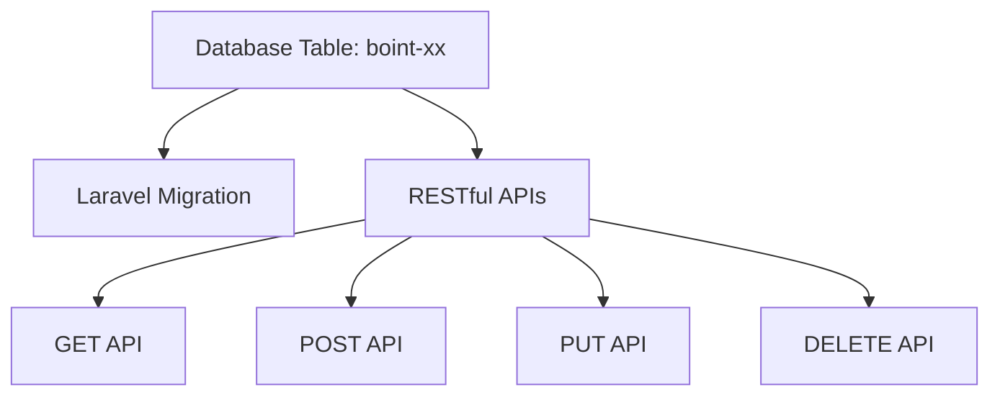

# BOINT-24: Develop Laravel APIs

## Overview
This task involves creating a Laravel migration script for a database table and developing RESTful APIs (GET, POST, PUT, DELETE) to interact with the table. The task also includes creating a branch in the BOINT BitBucket repository and committing the code.

## Database Table Specification

The database table `boint-xx` has the following structure:

| Column        | Type              | Nullable | Key  |
|---------------|-------------------|----------|------|
| code          | int               | No       | Yes  |
| name          | varchar(100)      | No       | No   |
| modified      | datetime          | Yes      | No   |
| modified_by   | int               | Yes      | No   |
| created       | datetime          | No       | No   |
| created_by    | int               | No       | No   |

## Mermaid Diagram



## Steps to Complete the Task

### 1. Create Laravel Migration Script
- Generate a migration file for the `boint-xx` table.
- Define the table schema as specified above.
- Run the migration to create the table in the database.

### 2. Develop RESTful APIs
- **GET API**: Retrieve records from the `boint-xx` table.
- **POST API**: Insert new records into the `boint-xx` table.
- **PUT API**: Update existing records in the `boint-xx` table.
- **DELETE API**: Delete records from the `boint-xx` table.

### 3. Create a Branch in BitBucket
- Create a new branch in the BOINT BitBucket repository with the JIRA key `boint-xx`.
- Commit the migration script and API code to this branch.

## Implementation Details

### Migration Script

```php
<?php

use Illuminate\Database\Migrations\Migration;
use Illuminate\Database\Schema\Blueprint;
use Illuminate\Support\Facades\Schema;

class CreateBointXxTable extends Migration
{
    public function up()
    {
        Schema::create('boint-xx', function (Blueprint $table) {
            $table->integer('code')->primary();
            $table->string('name', 100);
            $table->dateTime('modified')->nullable();
            $table->integer('modified_by')->nullable();
            $table->dateTime('created');
            $table->integer('created_by');
        });
    }

    public function down()
    {
        Schema::dropIfExists('boint-xx');
    }
}
```

### API Endpoints

#### GET API
- **Endpoint**: `/api/boint-xx/{code}`
- **Description**: Retrieve a record by its `code`.

#### POST API
- **Endpoint**: `/api/boint-xx`
- **Description**: Create a new record in the `boint-xx` table.

#### PUT API
- **Endpoint**: `/api/boint-xx/{code}`
- **Description**: Update an existing record by its `code`.

#### DELETE API
- **Endpoint**: `/api/boint-xx/{code}`
- **Description**: Delete a record by its `code`.

## Conclusion
This task involves creating a Laravel migration script for the `boint-xx` table and developing RESTful APIs to interact with the table. The final step is to commit the code to a new branch in the BOINT BitBucket repository.
