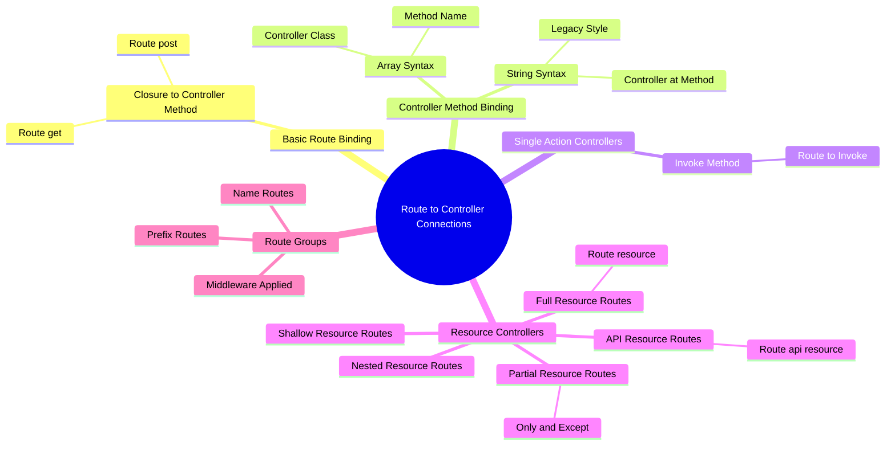

# Accessing Controllers in Routes

## Introduction

In Laravel, routes are defined in the `routes` directory, typically in `routes/web.php` for web routes and `routes/api.php` for API routes. Controllers are PHP classes that handle HTTP requests and return responses. They serve as an intermediary between the routing layer and the application's business logic. This document explains the various ways to access controllers in routes.



## Basic Controller Access

### Using Controller Methods

The most common way to access a controller in a route is by specifying the controller class and the method to be called. This is done using an array syntax where the first element is the controller class and the second element is the method name.

**File:** `routes/web.php`

```php
use App\Http\Controllers\UserController;

Route::get('/user/{id}', [UserController::class, 'show']);
```

In this example, when an incoming request matches the URI `/user/{id}`, the `show` method on the `UserController` class will be invoked, and the route parameters will be passed to the method.

### Using Single Action Controllers

Single action controllers are controllers that handle a single action. They are defined using the `__invoke` method. When registering routes for single action controllers, you do not need to specify a controller method. Instead, you may simply pass the name of the controller to the router.

**File:** `routes/web.php`

```php
use App\Http\Controllers\ProvisionServer;

Route::post('/server', ProvisionServer::class);
```

In this example, the `__invoke` method of the `ProvisionServer` controller will be called when the `/server` route is accessed via a POST request.

## Resource Controllers

Resource controllers are used to handle RESTful resources. They provide a convenient way to define routes for standard CRUD operations. Laravel provides the `Route::resource` method to register resource controllers.

### Basic Resource Controller

**File:** `routes/web.php`

```php
use App\Http\Controllers\PhotoController;

Route::resource('photos', PhotoController::class);
```

This single route declaration creates multiple routes to handle a variety of actions on the resource. The generated controller will already have methods stubbed for each of these actions.

### Actions Handled by Resource Controllers

| Verb      | URI                  | Action  | Route Name      |
|-----------|----------------------|---------|-----------------|
| GET       | /photos              | index   | photos.index    |
| GET       | /photos/create       | create  | photos.create   |
| POST      | /photos              | store   | photos.store    |
| GET       | /photos/{photo}      | show    | photos.show     |
| GET       | /photos/{photo}/edit | edit    | photos.edit     |
| PUT/PATCH | /photos/{photo}      | update  | photos.update   |
| DELETE    | /photos/{photo}      | destroy | photos.destroy |

### Partial Resource Routes

When declaring a resource route, you may specify a subset of actions the controller should handle instead of the full set of default actions:

**File:** `routes/web.php`

```php
use App\Http\Controllers\PhotoController;

Route::resource('photos', PhotoController::class)->only([
    'index', 'show'
]);

Route::resource('photos', PhotoController::class)->except([
    'create', 'store', 'update', 'destroy'
]);
```

### API Resource Routes

When declaring resource routes that will be consumed by APIs, you will commonly want to exclude routes that present HTML templates such as `create` and `edit`. For convenience, you may use the `apiResource` method to automatically exclude these two routes:

**File:** `routes/web.php`

```php
use App\Http\Controllers\PhotoController;

Route::apiResource('photos', PhotoController::class);
```

### Nested Resources

Sometimes you may need to define routes to a nested resource. For example, a photo resource may have multiple comments that may be attached to the photo. To nest the resource controllers, you may use "dot" notation in your route declaration:

**File:** `routes/web.php`

```php
use App\Http\Controllers\PhotoCommentController;

Route::resource('photos.comments', PhotoCommentController::class);
```

This route will register a nested resource that may be accessed with URIs like the following:

```
/photos/{photo}/comments/{comment}
```

### Shallow Nesting

Often, it is not entirely necessary to have both the parent and the child IDs within a URI since the child ID is already a unique identifier. When using unique identifiers such as auto-incrementing primary keys to identify your models in URI segments, you may choose to use "shallow nesting":

**File:** `routes/web.php`

```php
use App\Http\Controllers\CommentController;

Route::resource('photos.comments', CommentController::class)->shallow();
```

This route definition will define the following routes:

| Verb      | URI                              | Action  | Route Name              |
|-----------|----------------------------------|---------|-------------------------|
| GET       | /photos/{photo}/comments          | index   | photos.comments.index   |
| GET       | /photos/{photo}/comments/create  | create  | photos.comments.create  |
| POST      | /photos/{photo}/comments          | store   | photos.comments.store   |
| GET       | /comments/{comment}              | show    | comments.show           |
| GET       | /comments/{comment}/edit         | edit    | comments.edit           |
| PUT/PATCH | /comments/{comment}              | update  | comments.update         |
| DELETE    | /comments/{comment}              | destroy | comments.destroy        |

## Controller Middleware

Middleware may be assigned to the controller's routes in your route files:

**File:** `routes/web.php`

```php
use App\Http\Controllers\UserController;

Route::get('/profile', [UserController::class, 'show'])->middleware('auth');
```

Or, you may find it convenient to specify middleware within your controller class. To do so, your controller should implement the `HasMiddleware` interface, which dictates that the controller should have a static `middleware` method. From this method, you may return an array of middleware that should be applied to the controller's actions:

**File:** `app/Http/Controllers/UserController.php`

```php
<?php

namespace App\Http\Controllers;

use Illuminate\Routing\Controllers\HasMiddleware;
use Illuminate\Routing\Controllers\Middleware;

class UserController implements HasMiddleware
{
    /**
     * Get the middleware that should be assigned to the controller.
     *
     * @return array
     */
    public static function middleware(): array
    {
        return [
            'auth',
            new Middleware('log', only: ['index']),
            new Middleware('subscribed', except: ['store']),
        ];
    }

    // ...
}
```

You may also define controller middleware as closures, which provides a convenient way to define an inline middleware without writing an entire middleware class:

```php
use Closure;
use Illuminate\Http\Request;

/**
 * Get the middleware that should be assigned to the controller.
 *
 * @return array
 */
public static function middleware(): array
{
    return [
        function (Request $request, Closure $next) {
            return $next($request);
        },
    ];
}
```

## Dependency Injection and Controllers

### Constructor Injection

The Laravel service container is used to resolve all Laravel controllers. As a result, you are able to type-hint any dependencies your controller may need in its constructor. The declared dependencies will automatically be resolved and injected into the controller instance:

**File:** `app/Http/Controllers/UserController.php`

```php
<?php

namespace App\Http\Controllers;

use App\Repositories\UserRepository;

class UserController extends Controller
{
    /**
     * Create a new controller instance.
     */
    public function __construct(
        protected UserRepository $users,
    ) {}

    // ... controller methods
}
```

### Method Injection

In addition to constructor injection, you may also type-hint dependencies on your controller's methods. A common use-case for method injection is injecting the `Illuminate\Http\Request` instance into your controller methods:

**File:** `app/Http/Controllers/UserController.php`

```php
<?php

namespace App\Http\Controllers;

use Illuminate\Http\RedirectResponse;
use Illuminate\Http\Request;

class UserController extends Controller
{
    /**
     * Store a new user.
     *
     * @param \Illuminate\Http\Request $request
     * @return \Illuminate\Http\RedirectResponse
     */
    public function store(Request $request): RedirectResponse
    {
        $name = $request->name;

        // Store the user...

        return redirect('/users');
    }
}
```

If your controller method is also expecting input from a route parameter, list your route arguments after your other dependencies. For example, if your route is defined like so:

**File:** `routes/web.php`

```php
use App\Http\Controllers\UserController;

Route::put('/user/{id}', [UserController::class, 'update']);
```

You may still type-hint the `Illuminate\Http\Request` and access your `id` parameter by defining your controller method as follows:

**File:** `app/Http/Controllers/UserController.php`

```php
<?php

namespace App\Http\Controllers;

use Illuminate\Http\RedirectResponse;
use Illuminate\Http\Request;

class UserController extends Controller
{
    /**
     * Update the given user.
     *
     * @param \Illuminate\Http\Request $request
     * @param string $id
     * @return \Illuminate\Http\RedirectResponse
     */
    public function update(Request $request, string $id): RedirectResponse
    {
        // Update the user...

        return redirect('/users');
    }
}
```

## Legacy String Syntax

In older versions of Laravel (prior to 7), the string syntax 'ControllerName@methodName' was common. While it still works in modern Laravel for backward compatibility, the [Class, 'method'] array syntax is preferred as the string syntax can prevent route caching.

**File:** `routes/web.php`

```php
// Legacy syntax (discouraged in modern Laravel)
Route::get('/user/{id}', 'UserController@show');
```

## Conclusion

Accessing controllers in routes is a fundamental aspect of Laravel's routing system. By understanding the various ways to access controllers, including basic controller methods, single action controllers, resource controllers, dependency injection, and legacy string syntax, you can build robust and maintainable web applications. Always follow Laravel's best practices and conventions to ensure your code is clean, readable, and scalable.
