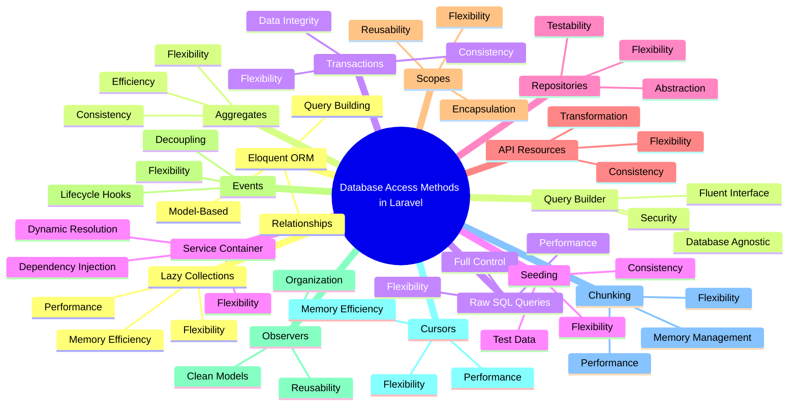

# Ways to Access Data from Database in Laravel

Laravel provides multiple ways to access data from the database, each suited for different use cases. Below are the primary methods:



## 1. Using Eloquent ORM

Eloquent is Laravel's built-in ORM (Object-Relational Mapper), which allows you to interact with your database using an object-oriented approach. It is the most common and recommended way to access data in Laravel.

### Key Features:
- **Model-Based**: Each database table has a corresponding model.
- **Relationships**: Easily define relationships between tables (e.g., one-to-one, one-to-many).
- **Query Building**: Chain methods to build complex queries.

### Example:
```php
use App\Models\Flight;

// Retrieve all flights
$flights = Flight::all();

// Retrieve a single flight by ID
$flight = Flight::find(1);

// Query with conditions
$activeFlights = Flight::where('active', 1)->get();
```

### Common Methods:
- `all()`: Retrieve all records.
- `find($id)`: Retrieve a record by its primary key.
- `where($column, $value)`: Add a where clause to the query.
- `get()`: Execute the query and retrieve the results.
- `first()`: Retrieve the first record matching the query.

## 2. Using Query Builder

The Query Builder provides a fluent interface for constructing and executing database queries. It is more flexible than raw SQL and is useful for complex queries that may not fit neatly into Eloquent's model-based approach.

### Key Features:
- **Fluent Interface**: Chain methods to build queries.
- **Database Agnostic**: Works across different database systems.
- **Security**: Automatically handles SQL injection.

### Example:
```php
use Illuminate\Support\Facades\DB;

// Retrieve all flights
$flights = DB::table('flights')->get();

// Retrieve flights with conditions
$activeFlights = DB::table('flights')->where('active', 1)->get();

// Join queries
$flights = DB::table('flights')
    ->join('airlines', 'flights.airline_id', '=', 'airlines.id')
    ->select('flights.*', 'airlines.name as airline_name')
    ->get();
```

### Common Methods:
- `table($table)`: Specify the table to query.
- `select($columns)`: Specify the columns to retrieve.
- `where($column, $value)`: Add a where clause.
- `join($table, $first, $operator, $second)`: Add a join clause.
- `get()`: Execute the query and retrieve the results.

## 3. Using Raw SQL Queries

For complex or database-specific queries, you can use raw SQL. This method provides the most flexibility but requires careful handling to avoid SQL injection.

### Key Features:
- **Full Control**: Write custom SQL queries.
- **Performance**: Optimize queries for specific database systems.
- **Flexibility**: Use database-specific features.

### Example:
```php
use Illuminate\Support\Facades\DB;

// Execute a raw SQL query
$flights = DB::select('SELECT * FROM flights WHERE active = ?', [1]);

// Execute a raw SQL statement
DB::statement('UPDATE flights SET active = 0 WHERE id = ?', [1]);
```

### Common Methods:
- `select($query, $bindings)`: Execute a select query.
- `statement($query, $bindings)`: Execute a raw SQL statement.
- `insert($query, $bindings)`: Execute an insert query.
- `update($query, $bindings)`: Execute an update query.
- `delete($query, $bindings)`: Execute a delete query.

## 4. Using Service Container

The Service Container in Laravel is a powerful tool for managing class dependencies and performing dependency injection. It can also be used to resolve database-related services dynamically.

### Key Features:
- **Dependency Injection**: Automatically resolve dependencies.
- **Flexibility**: Bind interfaces to implementations.
- **Dynamic Resolution**: Resolve services at runtime.

### Example:
```php
use App\Services\DatabaseService;
use Illuminate\Support\Facades\App;

// Resolve a database service from the container
$databaseService = App::make(DatabaseService::class);

// Use the service to interact with the database
$flights = $databaseService->getFlights();
```

### Common Methods:
- `make($class)`: Resolve a class from the container.
- `bind($interface, $implementation)`: Bind an interface to an implementation.
- `singleton($class, $callback)`: Bind a class as a singleton.

## 5. Using Repositories

Repositories are a design pattern that abstracts the data access layer, providing a clean separation between your application logic and database operations. This approach is useful for large applications where you want to decouple your business logic from the database.

### Key Features:
- **Abstraction**: Separate business logic from database operations.
- **Testability**: Easily mock database operations in tests.
- **Flexibility**: Switch between different data sources.

### Example:
```php
namespace App\Repositories;

use App\Models\Flight;

class FlightRepository
{
    public function getAllFlights()
    {
        return Flight::all();
    }

    public function getFlightById($id)
    {
        return Flight::find($id);
    }
}

// Usage
$flightRepository = new FlightRepository();
$flights = $flightRepository->getAllFlights();
```

### Common Methods:
- `getAll()`: Retrieve all records.
- `getById($id)`: Retrieve a record by its ID.
- `create($data)`: Create a new record.
- `update($id, $data)`: Update a record.
- `delete($id)`: Delete a record.

## 6. Using API Resources

API Resources in Laravel allow you to transform your Eloquent models and model collections into JSON responses. This is particularly useful for building APIs where you need to format your data in a specific way.

### Key Features:
- **Transformation**: Convert models to JSON responses.
- **Consistency**: Ensure consistent API responses.
- **Flexibility**: Customize the JSON structure.

### Example:
```php
namespace App\Http\Resources;

use Illuminate\Http\Resources\Json\JsonResource;

class FlightResource extends JsonResource
{
    public function toArray($request)
    {
        return [
            'id' => $this->id,
            'name' => $this->name,
            'active' => $this->active,
        ];
    }
}

// Usage
use App\Http\Resources\FlightResource;
use App\Models\Flight;

$flight = Flight::find(1);
return new FlightResource($flight);
```

### Common Methods:
- `toArray($request)`: Transform the model into an array.
- `with($data)`: Add additional data to the response.
- `collection($resource)`: Transform a collection of models.

## 7. Using Scopes

Scopes in Laravel allow you to define reusable query constraints that can be applied to your Eloquent models. This is useful for encapsulating common query logic.

### Key Features:
- **Reusability**: Define common query constraints once.
- **Encapsulation**: Keep query logic within the model.
- **Flexibility**: Apply scopes conditionally.

### Example:
```php
namespace App\Models;

use Illuminate\Database\Eloquent\Model;
use Illuminate\Database\Eloquent\Builder;

class Flight extends Model
{
    public function scopeActive($query)
    {
        return $query->where('active', 1);
    }
}

// Usage
$activeFlights = Flight::active()->get();
```

### Common Methods:
- `scopeName($query)`: Define a scope method.
- `apply($builder, $model)`: Apply the scope to the query.

## 8. Using Events

Laravel's event system allows you to hook into various points in the Eloquent lifecycle, such as when a model is created, updated, or deleted. This is useful for performing additional actions based on database operations.

### Key Features:
- **Lifecycle Hooks**: Hook into model events.
- **Decoupling**: Separate event logic from model logic.
- **Flexibility**: Perform actions based on database operations.

### Example:
```php
namespace App\Models;

use Illuminate\Database\Eloquent\Model;

class Flight extends Model
{
    protected $dispatchesEvents = [
        'created' => FlightCreated::class,
        'updated' => FlightUpdated::class,
        'deleted' => FlightDeleted::class,
    ];
}

// Usage
$flight = Flight::create(['name' => 'London to Paris']);
```

### Common Events:
- `created`: Fired after a model is created.
- `updated`: Fired after a model is updated.
- `deleted`: Fired after a model is deleted.
- `restored`: Fired after a model is restored from soft deletion.

## 9. Using Observers

Observers in Laravel allow you to group event listeners for a model into a single class. This is useful for organizing event logic and keeping your models clean.

### Key Features:
- **Organization**: Group event listeners into a single class.
- **Clean Models**: Keep event logic separate from model logic.
- **Reusability**: Reuse observers across multiple models.

### Example:
```php
namespace App\Observers;

use App\Models\Flight;

class FlightObserver
{
    public function created(Flight $flight)
    {
        // Handle flight creation
    }

    public function updated(Flight $flight)
    {
        // Handle flight update
    }

    public function deleted(Flight $flight)
    {
        // Handle flight deletion
    }
}

// Register the observer
use App\Models\Flight;
use App\Observers\FlightObserver;

Flight::observe(FlightObserver::class);
```

### Common Methods:
- `created($model)`: Handle model creation.
- `updated($model)`: Handle model update.
- `deleted($model)`: Handle model deletion.
- `restored($model)`: Handle model restoration.

## 10. Using Cursors

Cursors in Laravel allow you to iterate over large datasets efficiently by loading only one model at a time into memory. This is useful for processing large datasets without running out of memory.

### Key Features:
- **Memory Efficiency**: Load one model at a time.
- **Performance**: Process large datasets efficiently.
- **Flexibility**: Use with any Eloquent query.

### Example:
```php
use App\Models\Flight;

foreach (Flight::where('active', 1)->cursor() as $flight) {
    // Process each flight
}
```

### Common Methods:
- `cursor()`: Iterate over models one at a time.
- `lazy()`: Use lazy collections for efficient processing.

## 11. Using Chunking

Chunking in Laravel allows you to process large datasets in smaller chunks, which is useful for memory management and performance optimization.

### Key Features:
- **Memory Management**: Process data in smaller chunks.
- **Performance**: Optimize processing of large datasets.
- **Flexibility**: Use with any Eloquent query.

### Example:
```php
use App\Models\Flight;

Flight::chunk(200, function ($flights) {
    foreach ($flights as $flight) {
        // Process each flight
    }
});
```

### Common Methods:
- `chunk($count, $callback)`: Process data in chunks.
- `chunkById($count, $callback)`: Process data in chunks by ID.

## 12. Using Lazy Collections

Lazy Collections in Laravel allow you to work with large datasets efficiently by loading data on-demand. This is useful for processing large datasets without loading everything into memory at once.

### Key Features:
- **Memory Efficiency**: Load data on-demand.
- **Performance**: Process large datasets efficiently.
- **Flexibility**: Use with any Eloquent query.

### Example:
```php
use App\Models\Flight;

foreach (Flight::where('active', 1)->lazy() as $flight) {
    // Process each flight
}
```

### Common Methods:
- `lazy()`: Use lazy collections for efficient processing.
- `lazyById()`: Use lazy collections by ID.

## 13. Using Aggregates

Aggregates in Laravel allow you to perform aggregate operations on your database, such as counting, summing, or averaging values. This is useful for generating reports or statistics.

### Key Features:
- **Efficiency**: Perform aggregate operations efficiently.
- **Flexibility**: Use with any Eloquent query.
- **Consistency**: Ensure consistent results.

### Example:
```php
use App\Models\Flight;

$count = Flight::where('active', 1)->count();
$maxPrice = Flight::where('active', 1)->max('price');
```

### Common Methods:
- `count()`: Count the number of records.
- `sum($column)`: Sum the values of a column.
- `max($column)`: Get the maximum value of a column.
- `min($column)`: Get the minimum value of a column.
- `avg($column)`: Get the average value of a column.

## 14. Using Transactions

Transactions in Laravel allow you to group multiple database operations into a single transaction, ensuring that all operations succeed or fail as a unit. This is useful for maintaining data integrity.

### Key Features:
- **Data Integrity**: Ensure all operations succeed or fail together.
- **Flexibility**: Use with any database operations.
- **Consistency**: Maintain consistent database state.

### Example:
```php
use Illuminate\Support\Facades\DB;

DB::transaction(function () {
    // Perform database operations
    Flight::create(['name' => 'London to Paris']);
    Flight::create(['name' => 'Paris to London']);
});
```

### Common Methods:
- `transaction($callback)`: Execute operations within a transaction.
- `beginTransaction()`: Start a transaction.
- `commit()`: Commit a transaction.
- `rollBack()`: Roll back a transaction.

## 15. Using Seeding

Seeding in Laravel allows you to populate your database with test data. This is useful for setting up your application with initial data or for testing purposes.

### Key Features:
- **Test Data**: Populate the database with test data.
- **Flexibility**: Use with any database operations.
- **Consistency**: Ensure consistent database state.

### Example:
```php
use Illuminate\Database\Seeder;
use App\Models\Flight;

class FlightSeeder extends Seeder
{
    public function run()
    {
        Flight::create(['name' => 'London to Paris']);
        Flight::create(['name' => 'Paris to London']);
    }
}
```

### Common Methods:
- `run()`: Execute the seeder.
- `call($class)`: Call another seeder.

## Conclusion

Laravel provides a wide range of methods for accessing data from the database, each suited for different use cases. Whether you need the simplicity of Eloquent, the flexibility of the Query Builder, or the control of raw SQL, Laravel has you covered. Choose the method that best fits your application's requirements and enjoy the powerful features that Laravel offers for database interaction.