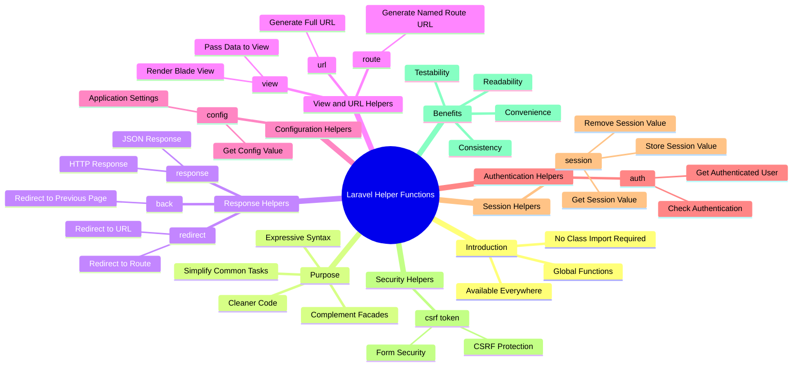

# Helper Functions in Laravel

## Introduction

Helper functions in Laravel are global functions that provide a convenient and expressive way to interact with common Laravel features without requiring you to import or instantiate classes manually. These functions are globally available throughout your application, making it easier to perform tasks like generating responses, accessing configuration values, or working with sessions.



## Overview

Helper functions complement facades and are designed to simplify common tasks. They are globally accessible, meaning you do not need to import any classes to use them. This makes your code cleaner and more concise.

## Common Helper Functions

Below are some of the most commonly used helper functions in Laravel:

### 1. `response()`

The `response()` helper function is used to generate HTTP responses. It returns an instance of `Illuminate\Contracts\Routing\ResponseFactory`, which provides methods for creating various types of responses.

**Example:**

```php
return response()->json([
    'name' => 'John Doe',
    'email' => 'john@example.com'
]);
```

### 2. `view()`

The `view()` helper function is used to create a view response. It allows you to render a Blade template or a simple view file.

**Example:**

```php
return view('welcome', ['name' => 'John']);
```

### 3. `url()`

The `url()` helper function generates a fully qualified URL for the given path.

**Example:**

```php
$url = url('/posts');
```

### 4. `config()`

The `config()` helper function retrieves a configuration value from your application's configuration files.

**Example:**

```php
$timezone = config('app.timezone');
```

### 5. `redirect()`

The `redirect()` helper function generates a redirect response to another URL or route.

**Example:**

```php
return redirect('/home');
```

### 6. `auth()`

The `auth()` helper function provides access to Laravel's authentication features. It allows you to check if a user is authenticated, retrieve the authenticated user, and more.

**Example:**

```php
if (auth()->check()) {
    $user = auth()->user();
}
```

### 7. `session()`

The `session()` helper function allows you to work with session data. You can retrieve, store, and delete session values.

**Example:**

```php
// Retrieve a session value
$value = session('key');

// Store a session value
session(['key' => 'value']);
```

### 8. `csrf_token()`

The `csrf_token()` helper function retrieves the current CSRF token for the session. This is useful for protecting your forms against CSRF attacks.

**Example:**

```php
$token = csrf_token();
```

### 9. `route()`

The `route()` helper function generates a URL for a named route. This is particularly useful for creating links or redirects to specific routes in your application.

**Example:**

```php
$url = route('profile', ['id' => 1]);
```

### 10. `back()`

The `back()` helper function generates a redirect response to the user's previous location. This is useful for sending users back to the page they were on before submitting a form.

**Example:**

```php
return back()->with('message', 'Operation successful!');
```

## Benefits of Using Helper Functions

1. **Convenience**: Helper functions provide a quick and easy way to perform common tasks without needing to import or instantiate classes.

2. **Readability**: They make your code more readable by abstracting complex operations into simple function calls.

3. **Consistency**: Helper functions ensure that common tasks are performed consistently across your application.

4. **Testability**: Many helper functions are designed to be easily testable, allowing you to write unit tests for your code.

## Conclusion

Helper functions in Laravel are a powerful tool for simplifying your code and making it more expressive. By leveraging these functions, you can write cleaner, more maintainable, and more efficient code. For a complete list of helper functions, refer to the official Laravel documentation.