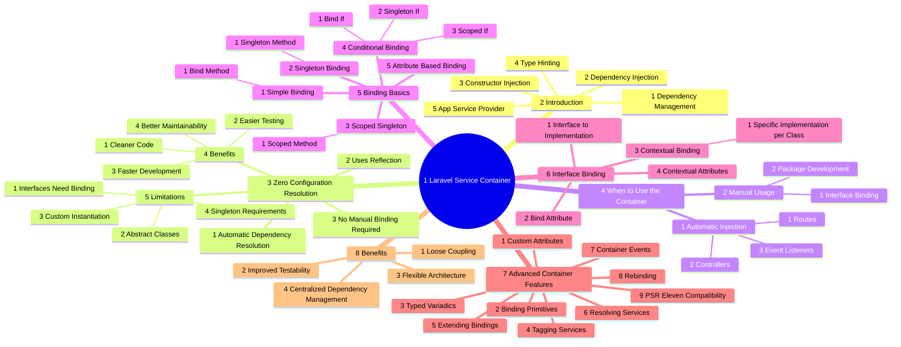

# Service Container Usage in Laravel

The Laravel Service Container is a powerful tool for managing class dependencies and performing dependency injection. It allows you to bind interfaces to implementations, manage singletons, and resolve dependencies automatically. Below is a comprehensive guide on how to use the Service Container in Laravel.



## Table of Contents

1. [Introduction](#introduction)
2. [Zero Configuration Resolution](#zero-configuration-resolution)
3. [When to Utilize the Container](#when-to-utilize-the-container)
4. [Binding Basics](#binding-basics)
5. [Advanced Interface Binding](#advanced-interface-binding)
6. [Advanced Container Features](#advanced-container-features)

## Introduction

- The Laravel service container is a powerful tool for managing class dependencies and performing dependency injection.
- Dependency injection means class dependencies are "injected" into the class via the constructor or "setter" methods.
- Type-hinting is a simple way to tell Laravel what dependencies your class needs.
- **File:** `app/Providers/AppServiceProvider.php`

**Example:**
```php
// Instead of manually creating the service:
$appleMusic = new AppleMusic();
$controller = new PodcastController($appleMusic);

// You just type-hint the dependency:
public function __construct(protected AppleMusic $apple)
{
    // Laravel automatically creates and injects AppleMusic
}
```

## Zero Configuration Resolution

- If a class has no dependencies or only depends on other concrete classes (not interfaces), the container does not need to be instructed on how to resolve that class.
- The Laravel service container uses PHP's reflection capabilities to automatically resolve class dependencies.
- Benefits of Zero Configuration:
  - Simplified Development
  - Cleaner Code
  - Easier Testing
  - Better Maintainability
  - Faster Development
- When Zero Configuration Isn't Enough:
  - Working with interfaces that need to be bound to implementations
  - Using abstract classes that need concrete implementations
  - Needing to configure how a class should be instantiated
  - Requiring singleton or scoped instances

**Example:**
```php
class Service
{
    // ...
}

Route::get('/', function (Service $service) {
    dd($service::class);
});
```

In this example, hitting your application's `/` route will automatically resolve the `Service` class and inject it into your route's handler.

## When to Utilize the Container

- Thanks to zero configuration resolution, you will often type-hint dependencies on routes, controllers, event listeners, and elsewhere without ever manually interacting with the container.
- In many cases, thanks to automatic dependency injection and facades, you can build Laravel applications without ever manually binding or resolving anything from the container.
- Situation 1: Binding Interfaces to Implementations
  - **File:** `app/Providers/AppServiceProvider.php`
- Situation 2: Package Development
  - **File:** `config/app.php`

**Example:**
```php
use Illuminate\Http\Request;

Route::get('/', function (Request $request) {
    // ...
});
```

In this example, the `Request` object is automatically resolved and injected into the route's handler by the service container.

## Binding Basics

- Bindings tell Laravel how to create objects when they're needed.
- Simple Bindings
  - **File:** `app/Providers/AppServiceProvider.php`
- Binding A Singleton
  - **File:** `app/Providers/AppServiceProvider.php`
- Binding Scoped Singletons
  - **File:** `app/Providers/AppServiceProvider.php`
- Additional Binding Methods:
  - Conditional Bindings: `bindIf` and `singletonIf`
  - Attribute-Based Bindings
  - Scoped Conditional Binding: `scopedIf`

**Example:**
```php
// File: app/Providers/AppServiceProvider.php
$this->app->bind(RadioTransmitter::class, function ($app) {
    $audioProcessor = $app->make(AudioProcessor::class);
    return new RadioTransmitter($audioProcessor);
});
```

This tells Laravel how to create a `RadioTransmitter` instance when it's needed.

## Advanced Interface Binding

- One of the most powerful features of the service container is binding interfaces to concrete implementations.
- Bind Attribute (PHP 8+)
  - **File:** `app/Contracts/EventPusher.php`
- Contextual Binding
  - **File:** `app/Providers/AppServiceProvider.php`
- Contextual Attributes
  - **File:** `app/Http/Controllers/PhotoController.php`

**Example:**
```php
// File: app/Providers/AppServiceProvider.php
$this->app->bind(PaymentGateway::class, StripeGateway::class);
```

This binds the `PaymentGateway` interface to the `StripeGateway` implementation, allowing you to type-hint the interface and get the concrete implementation.

## Advanced Container Features

- Defining Custom Attributes
  - **File:** `app/Attributes/Config.php`
- Binding Primitives
  - **File:** `app/Providers/AppServiceProvider.php`
- Binding Typed Variadics
  - **File:** `app/Providers/AppServiceProvider.php`
- Tagging
  - **File:** `app/Providers/AppServiceProvider.php`
- Extending Bindings
  - **File:** `app/Providers/AppServiceProvider.php`
- Resolving Services
  - **File:** `app/Providers/AppServiceProvider.php`
- Container Events
  - **File:** `app/Providers/AppServiceProvider.php`
- Rebinding
  - **File:** `app/Providers/AppServiceProvider.php`
- PSR-11 Compatibility
  - **File:** `routes/web.php`

**Example:**
```php
// File: app/Providers/AppServiceProvider.php
$this->app->singleton(DatabaseConnection::class, function (Application $app) {
    return new DatabaseConnection($app['config']['database']);
});
```

This creates a singleton binding for the `DatabaseConnection` class, ensuring that only one instance is created and reused throughout the application.

## Conclusion

The Laravel Service Container is a versatile and powerful tool for managing dependencies and performing dependency injection. It provides a wide range of features, from simple bindings to advanced techniques like contextual attributes, tagging, and extending bindings. By leveraging the Service Container, you can write more maintainable, testable, and flexible code in your Laravel applications.