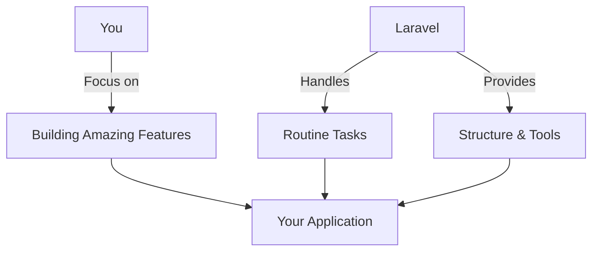
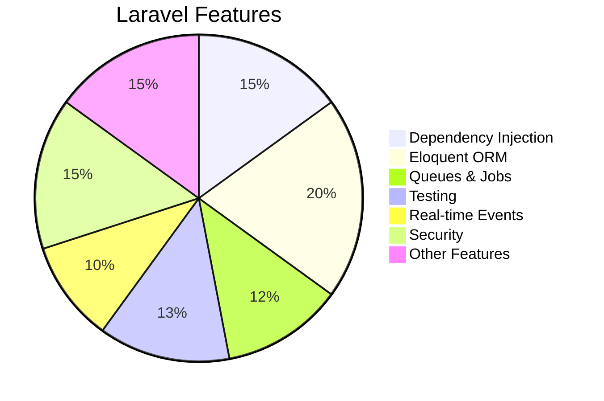
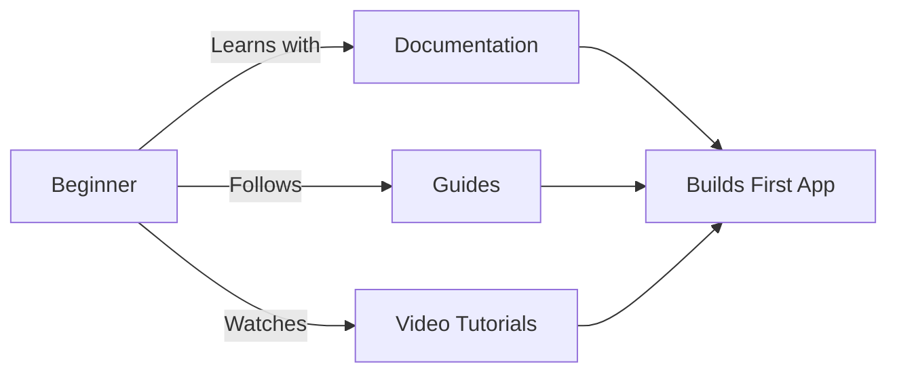
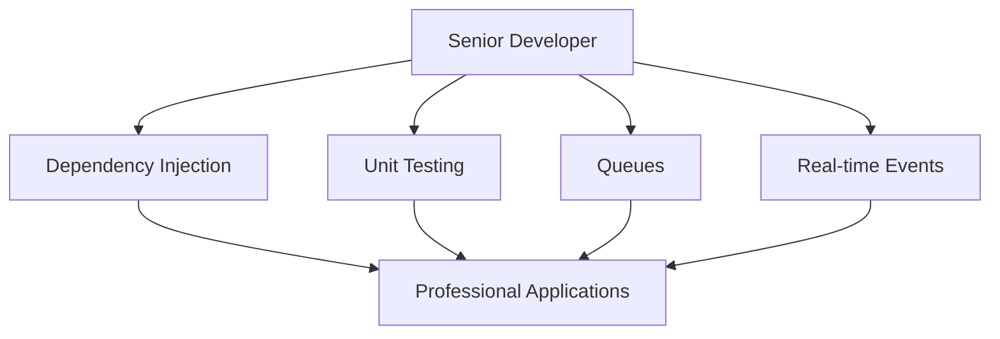
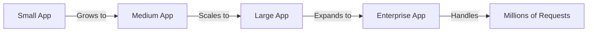
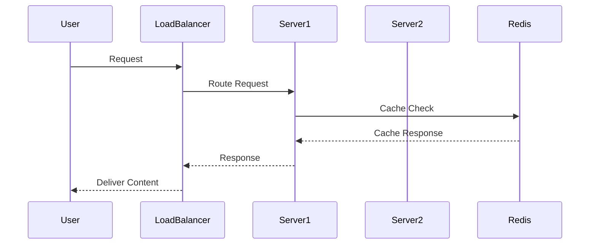
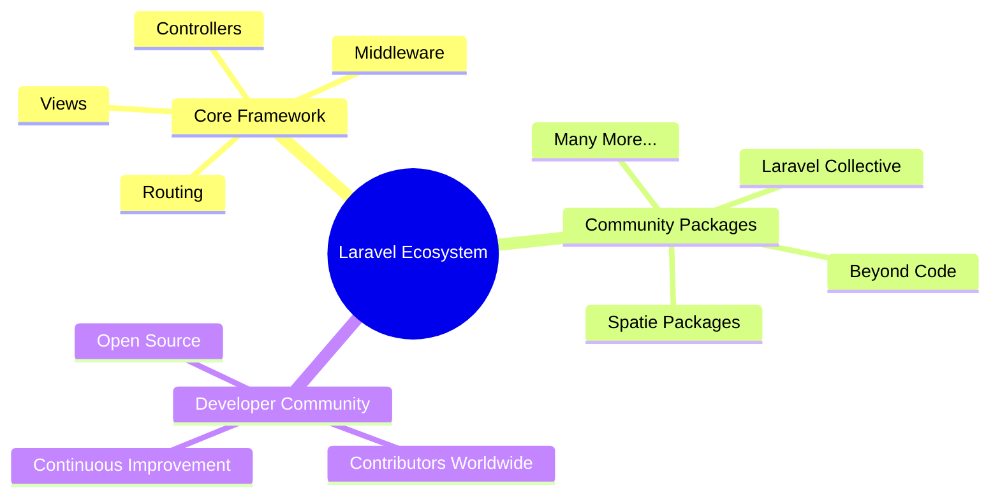
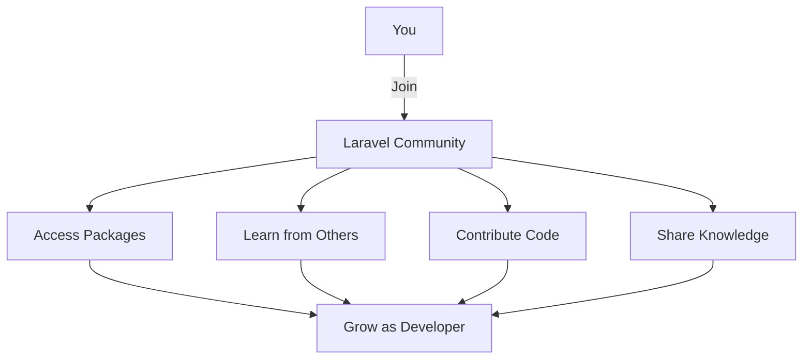
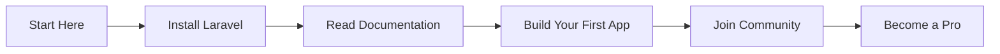

# Introduction to Laravel

## What is Laravel?

Laravel is a web application framework with expressive, elegant syntax. A web framework provides a structure and starting point for creating your application, allowing you to focus on creating something amazing while we sweat the details.

## Why Laravel?

There are a variety of tools and frameworks available when building web applications. Laravel stands out as the best choice for building modern, full-stack web applications.

### Key Features

- **Dependency Injection**: Robust and flexible dependency management
- **Eloquent ORM**: Expressive database abstraction layer
- **Queues & Jobs**: Background job processing
- **Testing**: Built-in support for unit and integration testing
- **Real-time Events**: WebSocket integration
- **Security**: Built-in protection against common vulnerabilities

## A Progressive Framework

Laravel is a "progressive" framework that grows with you:

### For Beginners

If you're new to web development, Laravel offers:
- Extensive documentation
- Step-by-step guides
- Video tutorials
- Gentle learning curve

### For Experienced Developers

For senior developers, Laravel provides:
- Robust dependency injection
- Comprehensive unit testing
- Queue management
- Real-time event handling
- Enterprise-ready features

## A Scalable Framework

Laravel is designed for scalability:

### Scaling Features

- **PHP Scalability**: Built on scalable PHP foundation
- **Redis Support**: Fast, distributed caching
- **Horizontal Scaling**: Easy to scale across servers
- **Cloud Ready**: Works with platforms like Laravel Cloud

## A Community Framework

Laravel benefits from a vibrant ecosystem:

### Why Join the Laravel Community?

- Access to thousands of packages
- Learn from experienced developers
- Contribute to open source
- Stay updated with best practices

## Getting Started

Whether you're new to PHP frameworks or an experienced developer, Laravel provides the tools and community support to help you build amazing applications. Start your Laravel journey today!

## Next Steps

Ready to dive in? Check out our [Installation Guide](1-installation.md) to get Laravel up and running on your system.