# Laravel 8.x Installation Guide

## Creating a Laravel Application

### Installing PHP and the Laravel Installer

Before creating your first Laravel application, make sure that your local machine has PHP, Composer, and the Laravel installer installed. In addition, you should install either Node and NPM or Bun so that you can compile your application's frontend assets.

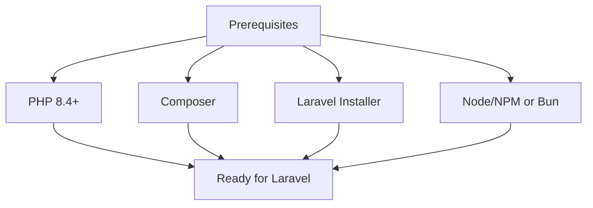

If you don't have PHP and Composer installed on your local machine, the following commands will install PHP, Composer, and the Laravel installer on macOS, Windows, or Linux:

```bash
# Run as administrator...
Set-ExecutionPolicy Bypass -Scope Process -Force; [System.Net.ServicePointManager]::SecurityProtocol = [System.Net.ServicePointManager]::SecurityProtocol -bor 3072; iex ((New-Object System.Net.WebClient).DownloadString('https://php.new/install/windows/8.4'))
```

After running one of the commands above, you should restart your terminal session. To update PHP, Composer, and the Laravel installer after installing them via php.new, you can re-run the command in your terminal.

If you already have PHP and Composer installed, you may install the Laravel installer via Composer:

```bash
composer global require laravel/installer
```

For a fully-featured, graphical PHP installation and management experience, check out Laravel Herd.

### Creating an Application

After you have installed PHP, Composer, and the Laravel installer, you're ready to create a new Laravel application. The Laravel installer will prompt you to select your preferred testing framework, database, and starter kit:

```bash
laravel new example-app
```

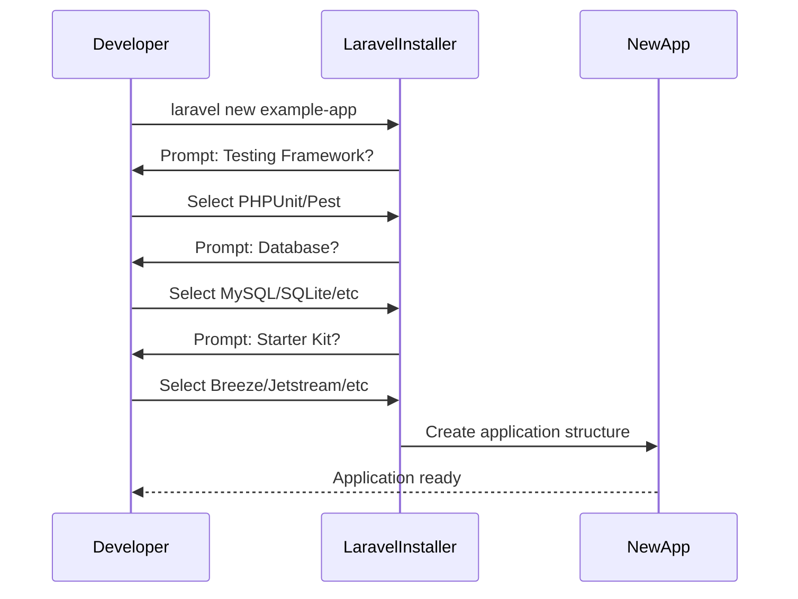

Once the application has been created, you can start Laravel's local development server, queue worker, and Vite development server using the dev Composer script:

```bash
cd example-app

npm install && npm run build

composer run dev
```

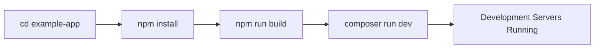

Once you have started the development server, your application will be accessible in your web browser at http://localhost:8000. Next, you're ready to start taking your next steps into the Laravel ecosystem. Of course, you may also want to configure a database.

If you would like a head start when developing your Laravel application, consider using one of our starter kits. Laravel's starter kits provide backend and frontend authentication scaffolding for your new Laravel application.

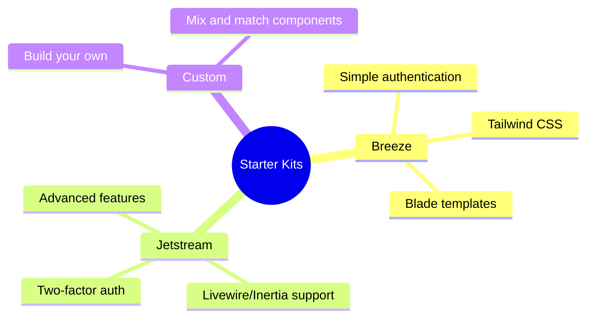

## Initial Configuration

All of the configuration files for the Laravel framework are stored in the `config` directory. Each option is documented, so feel free to look through the files and get familiar with the options available to you.

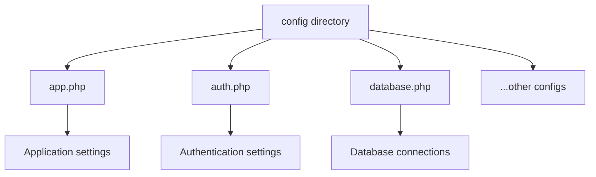

Laravel needs almost no additional configuration out of the box. You are free to get started developing! However, you may wish to review the `config/app.php` file and its documentation. It contains several options such as `url` and `locale` that you may wish to change according to your application.

## Environment Based Configuration

Since many of Laravel's configuration option values may vary depending on whether your application is running on your local machine or on a production web server, many important configuration values are defined using the `.env` file that exists at the root of your application.

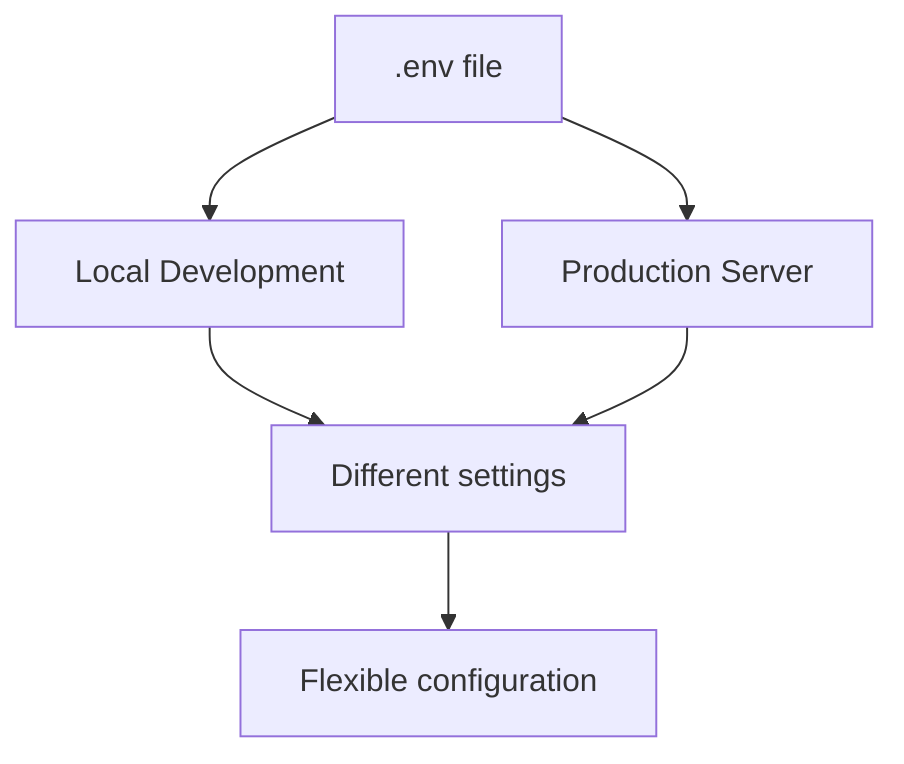

Your `.env` file should not be committed to your application's source control, since each developer / server using your application could require a different environment configuration. Furthermore, this would be a security risk in the event an intruder gains access to your source control repository, since any sensitive credentials would be exposed.

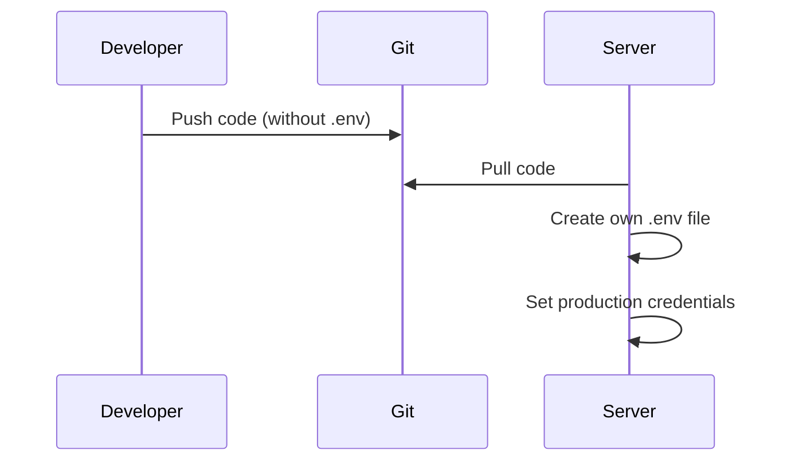

For more information about the `.env` file and environment based configuration, check out the full configuration documentation.

## Databases and Migrations

Now that you have created your Laravel application, you probably want to store some data in a database. By default, your application's `.env` configuration file specifies that Laravel will be interacting with an SQLite database.

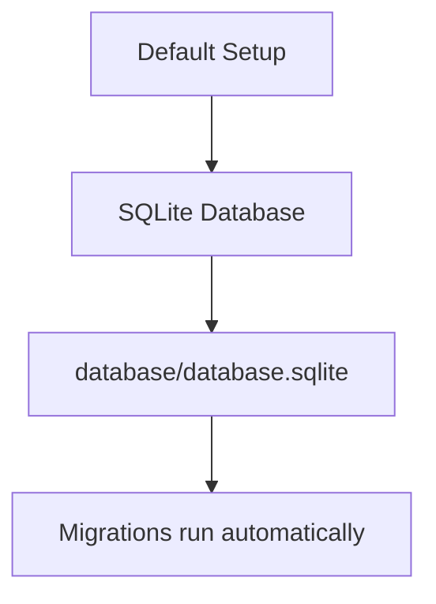

During the creation of the application, Laravel created a `database/database.sqlite` file for you, and ran the necessary migrations to create the application's database tables.

If you prefer to use another database driver such as MySQL or PostgreSQL, you can update your `.env` configuration file to use the appropriate database. For example, if you wish to use MySQL, update your `.env` configuration file's `DB_*` variables like so:

```env
DB_CONNECTION=mysql
DB_HOST=127.0.0.1
DB_PORT=3306
DB_DATABASE=laravel
DB_USERNAME=root
DB_PASSWORD=
```

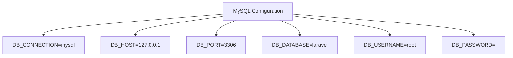

If you choose to use a database other than SQLite, you will need to create the database and run your application's database migrations:

```bash
php artisan migrate
```

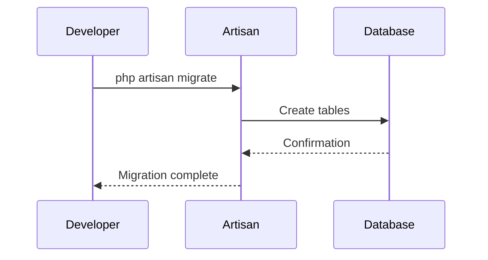

If you are developing on macOS or Windows and need to install MySQL, PostgreSQL, or Redis locally, consider using Herd Pro or DBngin.

## Directory Configuration

Laravel should always be served out of the root of the "web directory" configured for your web server. You should not attempt to serve a Laravel application out of a subdirectory of the "web directory". Attempting to do so could expose sensitive files present within your application.

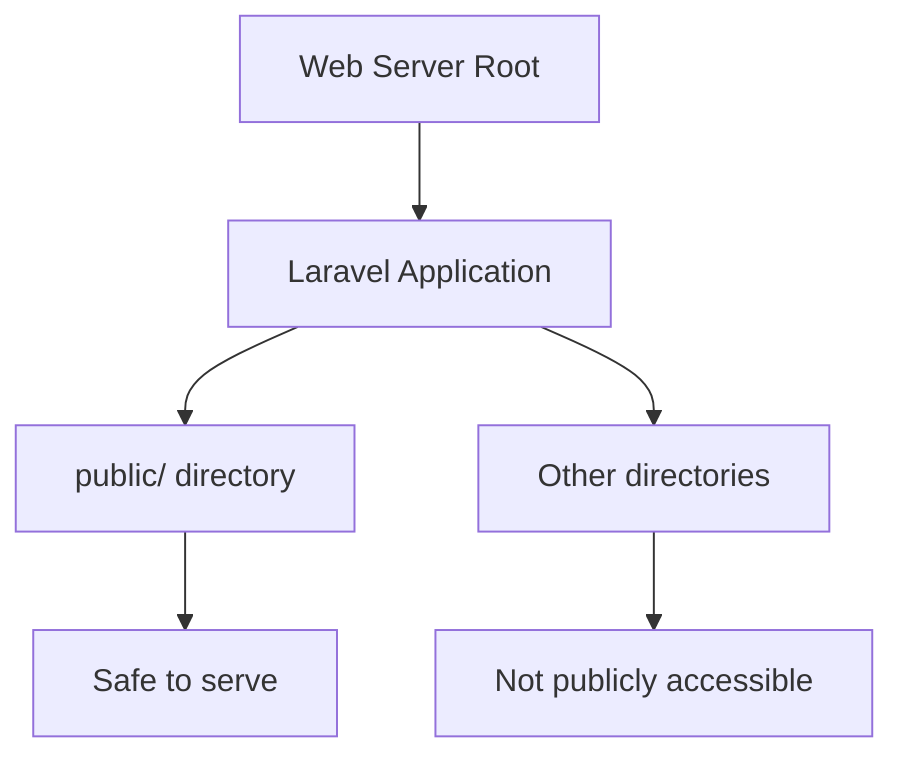

## Next Topic

[Request Lifecycle](2-request-lifecycle.md)