# CSRF Protection in Laravel

## Introduction

Cross-site request forgeries are a type of malicious exploit whereby unauthorized commands are performed on behalf of an authenticated user. Thankfully, Laravel makes it easy to protect your application from cross-site request forgery (CSRF) attacks.

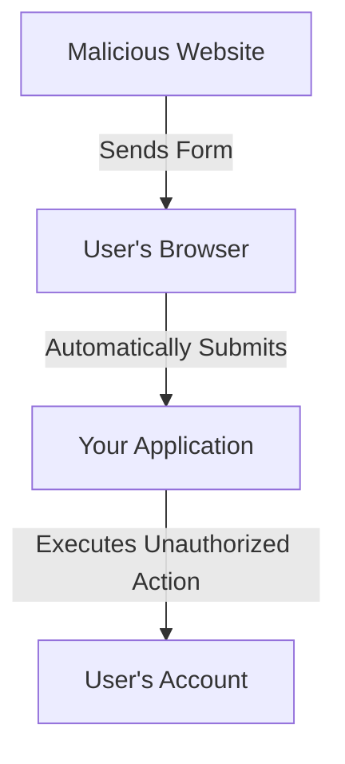

## An Explanation of the Vulnerability

In case you're not familiar with cross-site request forgeries, let's discuss an example of how this vulnerability can be exploited. Imagine your application has a `/user/email` route that accepts a POST request to change the authenticated user's email address. Most likely, this route expects an email input field to contain the email address the user would like to begin using.

Without CSRF protection, a malicious website could create an HTML form that points to your application's `/user/email` route and submits the malicious user's own email address:

**File:** `malicious-website.html`
```html
<form action="https://your-application.com/user/email" method="POST">
    <input type="email" value="malicious-email@example.com">
</form>

<script>
    document.forms[0].submit();
</script>
```

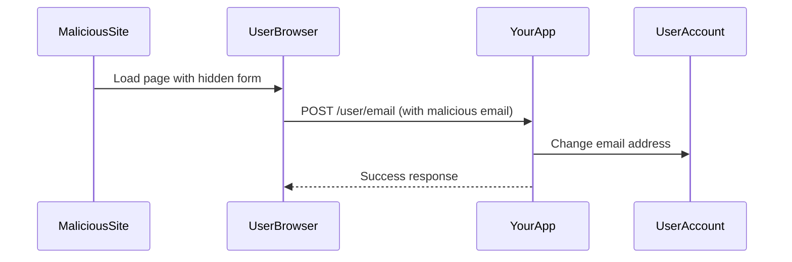

If the malicious website automatically submits the form when the page is loaded, the malicious user only needs to lure an unsuspecting user of your application to visit their website and their email address will be changed in your application.

To prevent this vulnerability, we need to inspect every incoming POST, PUT, PATCH, or DELETE request for a secret session value that the malicious application is unable to access.

## Preventing CSRF Requests

Laravel automatically generates a CSRF "token" for each active user session managed by the application. This token is used to verify that the authenticated user is the person actually making the requests to the application. Since this token is stored in the user's session and changes each time the session is regenerated, a malicious application is unable to access it.

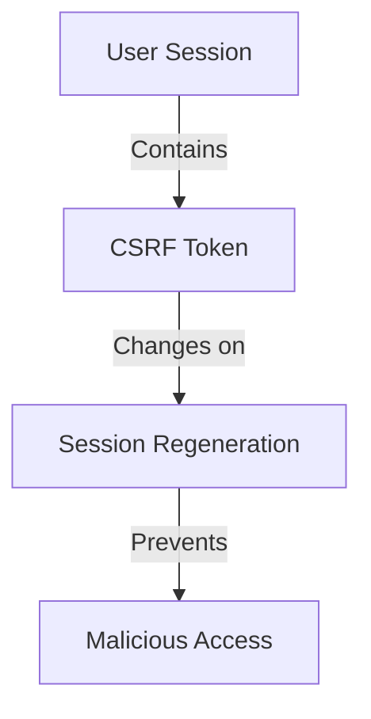

### Accessing the CSRF Token

The current session's CSRF token can be accessed via the request's session or via the `csrf_token` helper function:

**File:** `routes/web.php`
```php
use Illuminate\Http\Request;

Route::get('/token', function (Request $request) {
    $token = $request->session()->token();
    $token = csrf_token();
    // ...
});
```

### CSRF Tokens in Forms

Anytime you define a "POST", "PUT", "PATCH", or "DELETE" HTML form in your application, you should include a hidden CSRF _token field in the form so that the CSRF protection middleware can validate the request. For convenience, you may use the `@csrf` Blade directive to generate the hidden token input field:

**File:** `resources/views/form.blade.php`
```html
<form method="POST" action="/profile">
    @csrf
    <!-- Equivalent to... -->
    <input type="hidden" name="_token" value="{{ csrf_token() }}" />
</form>
```

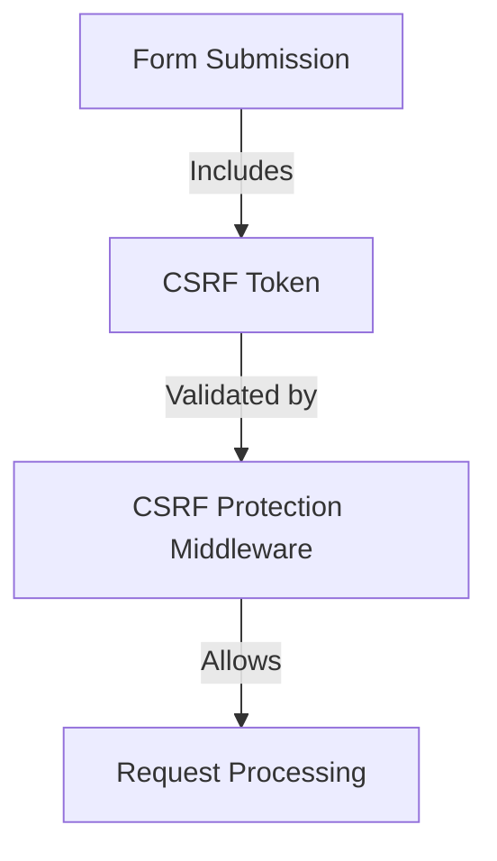

The `Illuminate\Foundation\Http\Middleware\ValidateCsrfToken` middleware, which is included in the web middleware group by default, will automatically verify that the token in the request input matches the token stored in the session. When these two tokens match, we know that the authenticated user is the one initiating the request.


### Why Malicious Attackers Can't Access the Token

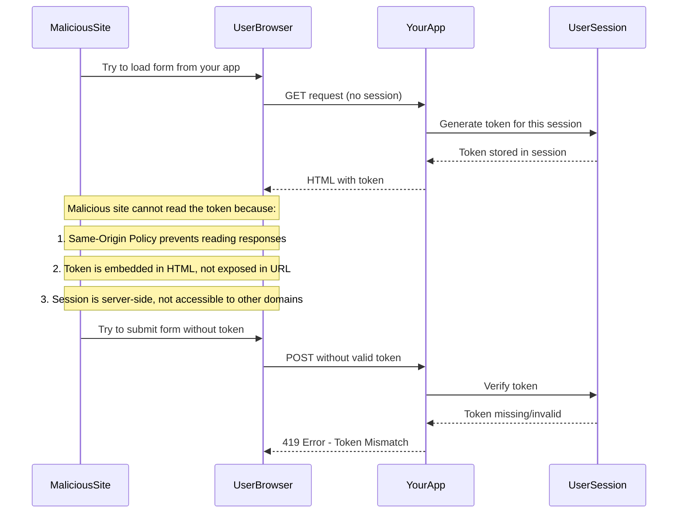

### Why Legitimate Users Can Access the Token

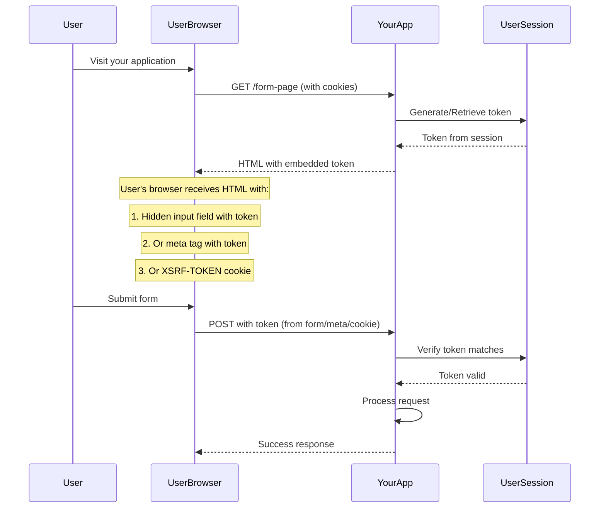

### Key Security Mechanisms

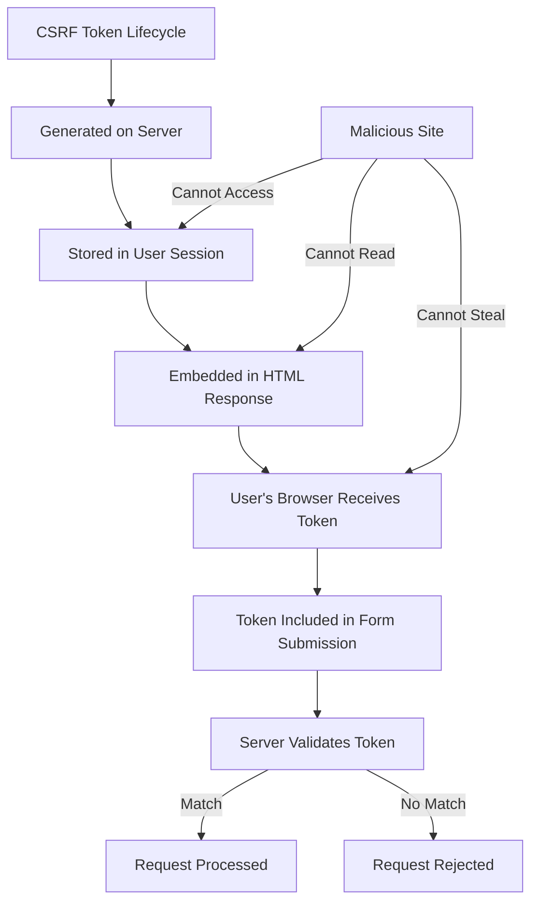


## CSRF Tokens & SPAs

If you are building an SPA that is utilizing Laravel as an API backend, you should consult the Laravel Sanctum documentation for information on authenticating with your API and protecting against CSRF vulnerabilities.

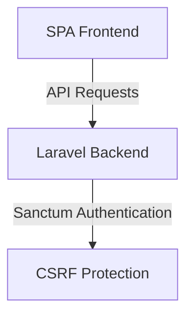

### X-CSRF-TOKEN

In addition to checking for the CSRF token as a POST parameter, the `Illuminate\Foundation\Http\Middleware\ValidateCsrfToken` middleware, which is included in the web middleware group by default, will also check for the `X-CSRF-TOKEN` request header. You could, for example, store the token in an HTML meta tag:

**File:** `resources/views/layouts/app.blade.php`
```html
<meta name="csrf-token" content="{{ csrf_token() }}">
```

Then, you can instruct a library like jQuery to automatically add the token to all request headers. This provides simple, convenient CSRF protection for your AJAX based applications using legacy JavaScript technology:

**File:** `resources/js/app.js`
```javascript
$.ajaxSetup({
    headers: {
        'X-CSRF-TOKEN': $('meta[name="csrf-token"]').attr('content')
    }
});
```

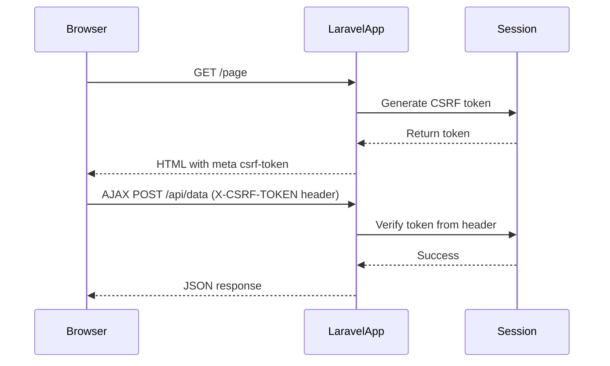

### X-XSRF-TOKEN

Laravel stores the current CSRF token in an encrypted `XSRF-TOKEN` cookie that is included with each response generated by the framework. You can use the cookie value to set the `X-XSRF-TOKEN` request header.

This cookie is primarily sent as a developer convenience since some JavaScript frameworks and libraries, like Angular and Axios, automatically place its value in the `X-XSRF-TOKEN` header on same-origin requests.

By default, the `resources/js/bootstrap.js` file includes the Axios HTTP library which will automatically send the `X-XSRF-TOKEN` header for you.

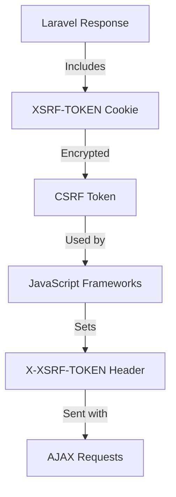

## X-XSRF-TOKEN: Detailed Technical Explanation

### Technical Definition

The `X-XSRF-TOKEN` is a HTTP request header used for CSRF protection in modern web applications. It's part of a two-token system where:

1. **XSRF-TOKEN Cookie**: An encrypted cookie containing the CSRF token, automatically set by Laravel
2. **X-XSRF-TOKEN Header**: The HTTP header that should contain the same token value for validation

### How It Works

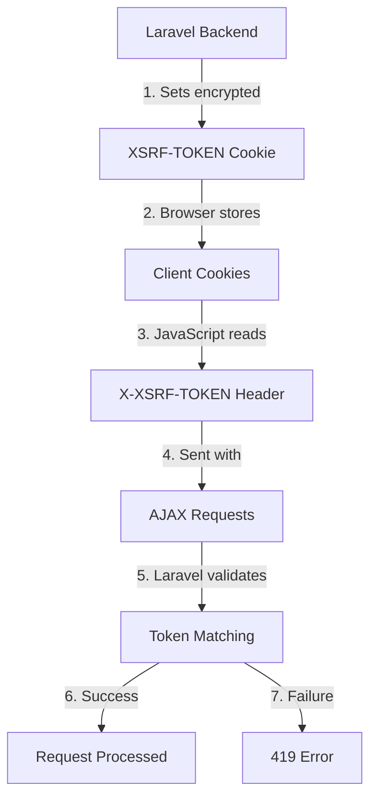

### Technical Flow

1. **Cookie Generation**: Laravel automatically includes an encrypted `XSRF-TOKEN` cookie in every HTTP response
2. **Cookie Storage**: Browser stores the cookie (HttpOnly flag prevents JavaScript access)
3. **Header Extraction**: JavaScript frameworks read the cookie and set it as `X-XSRF-TOKEN` header
4. **Request Validation**: Laravel's CSRF middleware compares cookie value with header value

### Code Implementation

#### Laravel Configuration

Laravel automatically handles XSRF-TOKEN through the `VerifyCsrfToken` middleware. The cookie is set in `config/session.php`:

```php
// config/session.php
'cookie' => [
    'name' => 'laravel_session',
    'secure' => env('SESSION_SECURE_COOKIE'),
    'http_only' => true,
    'same_site' => 'lax',
],

// XSRF-TOKEN is automatically handled by Laravel's CSRF middleware
```

#### JavaScript Frameworks Integration

**Axios (Automatic Handling)**:
```javascript
// resources/js/bootstrap.js
import axios from 'axios';

// Axios automatically handles X-XSRF-TOKEN
axios.defaults.withCredentials = true;

// When making requests:
axios.post('/api/data', { key: 'value' })
    .then(response => console.log(response.data));
```

**Manual Implementation**:
```javascript
// Get XSRF-TOKEN from cookie
function getCookie(name) {
    const value = `; ${document.cookie}`;
    const parts = value.split(`; ${name}=`);
    if (parts.length === 2) return parts.pop().split(';').shift();
}

// Set up Axios with manual XSRF token handling
const axiosInstance = axios.create({
    headers: {
        'X-XSRF-TOKEN': getCookie('XSRF-TOKEN')
    },
    withCredentials: true
});
```

#### Server-Side Validation

Laravel's `VerifyCsrfToken` middleware automatically validates the token:

```php
// app/Http/Middleware/VerifyCsrfToken.php
protected function tokensMatch($request)
{
    $token = $request->input('_token') ?: $request->header('X-CSRF-TOKEN');
    
    if (!$token && $header = $request->header('X-XSRF-TOKEN')) {
        $token = $this->encrypter->decrypt($header, static::serialized());
    }
    
    return $request->session()->token() === $token;
}
```

### Security Features

1. **Encryption**: The cookie value is encrypted using Laravel's encrypter
2. **HttpOnly**: Prevents JavaScript access to the cookie (when configured)
3. **SameSite**: Typically set to 'lax' for CSRF protection
4. **Automatic Handling**: Modern frameworks (Axios, Angular) automatically handle this header

### Comparison with Other Methods

| Method | Storage | Usage | Framework Support |
|--------|---------|-------|------------------|
| X-XSRF-TOKEN | Encrypted Cookie | AJAX requests | Axios, Angular |
| X-CSRF-TOKEN | Meta tag | AJAX requests | jQuery, custom |
| @csrf directive | Hidden form field | HTML forms | Blade templates |

### Best Practices

1. **Use with HTTPS**: Always use X-XSRF-TOKEN over HTTPS connections
2. **Framework Integration**: Leverage built-in framework support when available
3. **Cookie Configuration**: Ensure proper cookie settings (Secure, HttpOnly, SameSite)
4. **Fallback Mechanism**: Implement fallback to other CSRF methods when needed

The X-XSRF-TOKEN provides a convenient and secure way to handle CSRF protection for AJAX requests, especially in single-page applications and modern JavaScript frameworks.

**Example: Manual X-XSRF-TOKEN Usage**

**File:** `resources/js/api.js`
```javascript
// Get the XSRF token from cookie
function getCookie(name) {
    const value = `; ${document.cookie}`;
    const parts = value.split(`; ${name}=`);
    if (parts.length === 2) return parts.pop().split(';').shift();
}

// Set up Axios with XSRF token
const axiosInstance = axios.create({
    headers: {
        'X-XSRF-TOKEN': getCookie('XSRF-TOKEN')
    }
});

// Use the configured instance
axiosInstance.post('/api/data', { key: 'value' })
    .then(response => {
        console.log('Success:', response.data);
    });
```

**File:** `routes/api.php`
```php
use Illuminate\Support\Facades\Route;

Route::post('/api/data', function () {
    // This route is protected by CSRF middleware
    // X-XSRF-TOKEN header will be automatically validated
    return response()->json(['message' => 'Data received successfully']);
})->middleware('web'); // Note: Using web middleware for CSRF protection
```

## CSRF Token Comparison

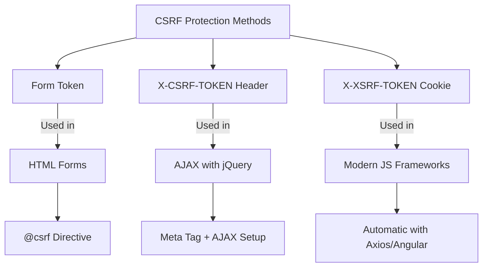

## Complete CSRF Protection Example

**File:** `resources/views/dashboard.blade.php`
```html
@extends('layouts.app')

@section('content')
<div class="container">
    <h1>Dashboard</h1>
    
    <!-- CSRF token in meta tag for AJAX -->
    <meta name="csrf-token" content="{{ csrf_token() }}">
    
    <!-- Traditional form with CSRF -->
    <form method="POST" action="/update-profile" id="profileForm">
        @csrf
        <input type="text" name="name" value="{{ auth()->user()->name }}">
        <button type="submit">Update</button>
    </form>
    
    <!-- AJAX form example -->
    <form id="ajaxForm">
        <input type="text" name="bio" value="{{ auth()->user()->bio }}">
        <button type="button" id="ajaxSubmit">Update via AJAX</button>
    </form>
</div>

<script>
// Set up global AJAX CSRF token
$.ajaxSetup({
    headers: {
        'X-CSRF-TOKEN': $('meta[name="csrf-token"]').attr('content')
    }
});

// Handle AJAX form submission
$('#ajaxSubmit').click(function() {
    $.post('/update-bio', {
        bio: $('input[name="bio"]').val()
    }).done(function(response) {
        alert('Updated successfully!');
    });
});
</script>
@endsection
```

**File:** `routes/web.php`
```php
use Illuminate\Support\Facades\Route;

// Traditional form route
Route::post('/update-profile', function () {
    // CSRF token from form will be validated automatically
    return back()->with('success', 'Profile updated!');
});

// AJAX route
Route::post('/update-bio', function () {
    // X-CSRF-TOKEN header will be validated automatically
    return response()->json(['message' => 'Bio updated!']);
});
```

## Excluding URIs From CSRF Protection

Sometimes you may wish to exclude a set of URIs from CSRF protection. For example, if you are using Stripe to process payments and are utilizing their webhook system, you will need to exclude your Stripe webhook handler route from CSRF protection since Stripe will not know what CSRF token to send to your routes.

Typically, you should place these kinds of routes outside of the web middleware group that Laravel applies to all routes in the `routes/web.php` file. However, you may also exclude specific routes by providing their URIs to the `validateCsrfTokens` method in your application's `bootstrap/app.php` file:

**File:** `bootstrap/app.php`
```php
->withMiddleware(function (Middleware $middleware): void {
    $middleware->validateCsrfTokens(except: [
        'stripe/*',
        'http://example.com/foo/bar',
        'http://example.com/foo/*',
    ]);
})
```

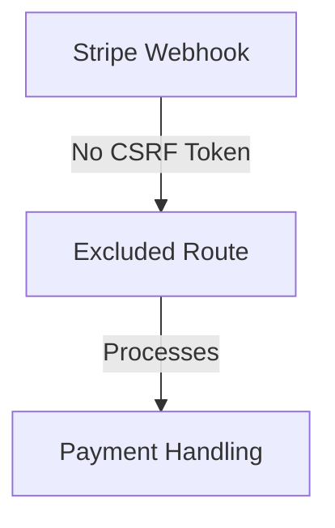

For convenience, the CSRF middleware is automatically disabled for all routes when running tests.

## Visualization of CSRF Protection Flow

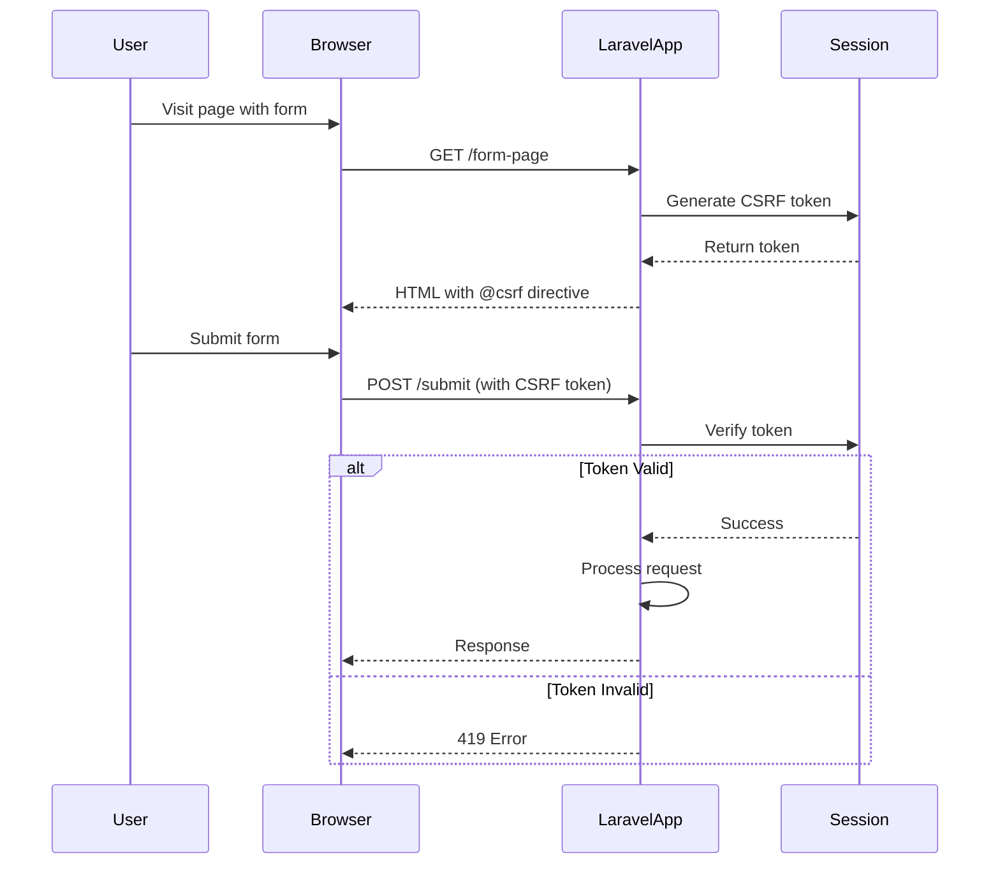

## Complete Example: Secure Form with CSRF Protection

**File:** `routes/web.php`
```php
use Illuminate\Support\Facades\Route;

Route::get('/profile', function () {
    return view('profile.edit');
})->name('profile.edit');

Route::post('/profile', function () {
    // Update user profile
    return redirect('/profile')->with('success', 'Profile updated!');
})->name('profile.update');
```

**File:** `resources/views/profile/edit.blade.php`
```html
@extends('layouts.app')

@section('content')
<div class="container">
    <h1>Edit Profile</h1>
    
    <form method="POST" action="{{ route('profile.update') }}">
        @csrf
        
        <div class="form-group">
            <label for="name">Name</label>
            <input type="text" name="name" id="name" class="form-control" value="{{ auth()->user()->name }}">
        </div>
        
        <div class="form-group">
            <label for="email">Email</label>
            <input type="email" name="email" id="email" class="form-control" value="{{ auth()->user()->email }}">
        </div>
        
        <button type="submit" class="btn btn-primary">Update Profile</button>
    </form>
</div>
@endsection
```

**File:** `app/Http/Controllers/ProfileController.php`
```php
<?php

namespace App\Http\Controllers;

use Illuminate\Http\Request;
use Illuminate\Support\Facades\Auth;

class ProfileController extends Controller
{
    public function update(Request $request)
    {
        // Validate the request
        $validated = $request->validate([
            'name' => 'required|string|max:255',
            'email' => 'required|string|email|max:255|unique:users,email,'.Auth::id(),
        ]);
        
        // Update the user
        Auth::user()->update($validated);
        
        return redirect()->route('profile.edit')->with('success', 'Profile updated successfully!');
    }
}
```

## CSRF Protection Workflow

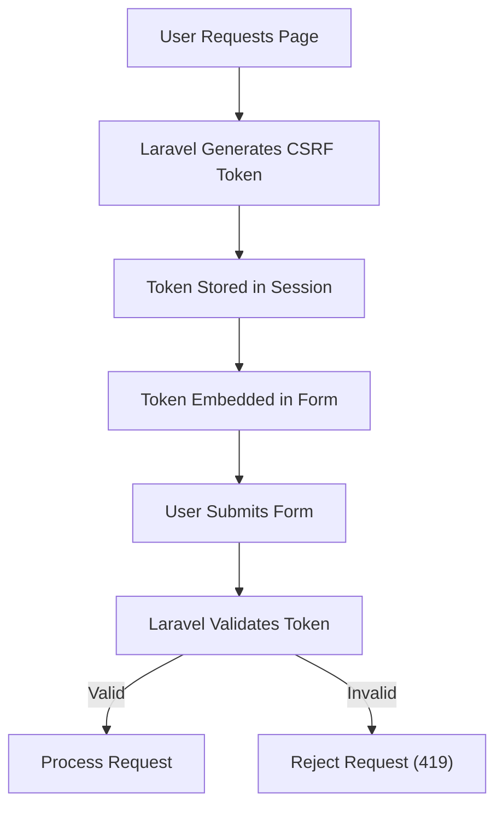

## Best Practices for CSRF Protection

1. **Always use @csrf directive** in forms that modify data
2. **Include CSRF token** in all POST, PUT, PATCH, DELETE requests
3. **Exclude only when necessary** (e.g., webhooks from trusted services)
4. **Use Laravel's built-in middleware** for automatic protection
5. **Test CSRF protection** in your application

## Common CSRF Vulnerabilities to Avoid

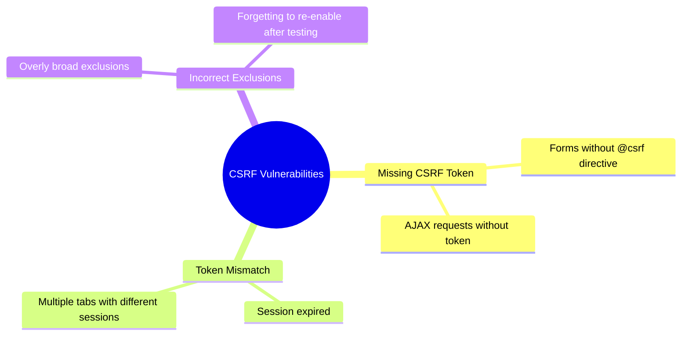

## Conclusion

CSRF protection is a critical security feature in Laravel that helps prevent unauthorized actions on behalf of authenticated users. By understanding how CSRF tokens work and properly implementing them in your forms, you can significantly enhance the security of your Laravel application. Always remember to include the CSRF token in your forms and only exclude routes from CSRF protection when absolutely necessary.