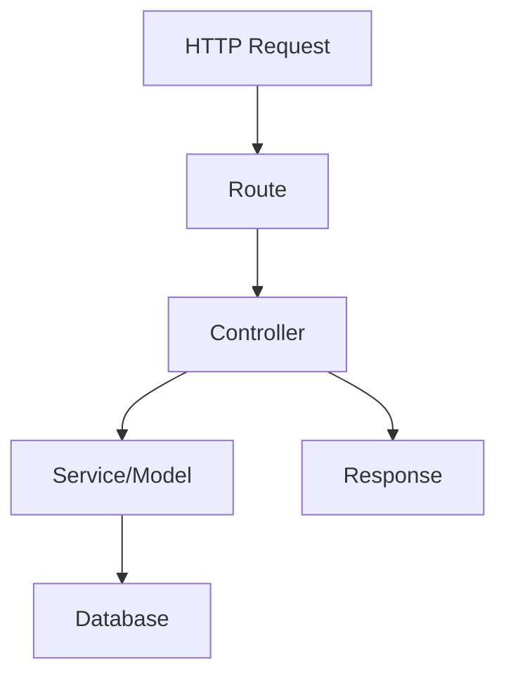

# Controllers

## File Information

- **File Path**: `app/Http/Controllers/`
- **Base Controller**: `App\Http\Controllers\Controller`
- **Dependencies**:
  - `Illuminate\Routing\Controller` (base controller class)
  - `Illuminate\Foundation\Auth\Access\AuthorizesRequests` (for authorization)
  - `Illuminate\Foundation\Validation\ValidatesRequests` (for validation)

## Introduction

Instead of defining all of your request handling logic as closures in your route files, you may wish to organize this behavior using "controller" classes. Controllers can group related request handling logic into a single class. For example, a `UserController` class might handle all incoming requests related to users, including showing, creating, updating, and deleting users. By default, controllers are stored in the `app/Http/Controllers` directory.

**Key Benefits of Using Controllers:**
- Better organization of request handling logic
- Improved code maintainability and readability
- Easier to implement complex business logic
- Supports dependency injection and middleware

## Technical Definition

Controllers in Laravel are PHP classes that handle HTTP requests and return responses. They serve as an intermediary between the routing layer and the application's business logic. Controllers are responsible for:

- Processing incoming HTTP requests
- Validating input data
- Interacting with models and services
- Returning appropriate HTTP responses

## Writing Controllers

### Basic Controllers

To quickly generate a new controller, you may run the `make:controller` Artisan command. By default, all of the controllers for your application are stored in the `app/Http/Controllers` directory:

```bash
php artisan make:controller UserController
```

Let's take a look at an example of a basic controller. A controller may have any number of public methods which will respond to incoming HTTP requests:

**File**: `app/Http/Controllers/UserController.php`

**Dependencies**:
- `App\Models\User` - User model for database operations
- `Illuminate\View\View` - View return type hint
- `App\Http\Controllers\Controller` - Base controller class

```php
<?php

namespace App\Http\Controllers;

use App\Models\User;
use Illuminate\View\View;

class UserController extends Controller
{
    /**
     * Show the profile for a given user.
     *
     * @param string $id
     * @return \Illuminate\View\View
     */
    public function show(string $id): View
    {
        return view('user.profile', [
            'user' => User::findOrFail($id)
        ]);
    }
}
```

Once you have written a controller class and method, you may define a route to the controller method like so:

```php
use App\Http\Controllers\UserController;

Route::get('/user/{id}', [UserController::class, 'show']);
```

When an incoming request matches the specified route URI, the `show` method on the `App\Http\Controllers\UserController` class will be invoked and the route parameters will be passed to the method.

Controllers are not required to extend a base class. However, it is sometimes convenient to extend a base controller class that contains methods that should be shared across all of your controllers.

### Single Action Controllers

If a controller action is particularly complex, you might find it convenient to dedicate an entire controller class to that single action. To accomplish this, you may define a single `__invoke` method within the controller:

**File**: `app/Http/Controllers/ProvisionServer.php`

**Dependencies**:
- `App\Http\Controllers\Controller` - Base controller class
- Any service classes needed for server provisioning

```php
<?php

namespace App\Http\Controllers;

class ProvisionServer extends Controller
{
    /**
     * Provision a new web server.
     *
     * @return \Illuminate\Http\Response
     */
    public function __invoke()
    {
        // Server provisioning logic
        // ...
    }
}
```

When registering routes for single action controllers, you do not need to specify a controller method. Instead, you may simply pass the name of the controller to the router:

```php
use App\Http\Controllers\ProvisionServer;

Route::post('/server', ProvisionServer::class);
```

You may generate an invokable controller by using the `--invokable` option of the `make:controller` Artisan command:

```bash
php artisan make:controller ProvisionServer --invokable
```

Controller stubs may be customized using stub publishing.

## Best Practices

### Controller Organization

1. **Single Responsibility Principle**: Each controller should handle a single resource or related set of resources.
2. **Keep Controllers Thin**: Move complex business logic to service classes or models.
3. **Use Resource Controllers**: For RESTful resources, use `php artisan make:controller UserController --resource` to generate standard CRUD methods.

### Method Naming

- Use descriptive method names that reflect the action being performed
- Follow RESTful conventions for resource controllers (index, create, store, show, edit, update, destroy)
- For non-resource actions, use verb-noun naming (e.g., `processPayment`, `generateReport`)

### Dependency Injection

Leverage Laravel's service container for dependency injection:

**Common Dependencies to Inject:**
- Repository classes for data access
- Service classes for business logic
- Request classes for validation
- External service clients

```php
<?php

namespace App\Http\Controllers;

use App\Repositories\UserRepository;
use App\Services\NotificationService;
use Illuminate\Http\Request;

class UserController extends Controller
{
    /**
     * Create a new controller instance.
     *
     * @param \App\Repositories\UserRepository $users
     * @param \App\Services\NotificationService $notifications
     */
    public function __construct(
        protected UserRepository $users,
        protected NotificationService $notifications
    ) {
        // Dependencies are automatically resolved by Laravel's service container
    }

    // ... controller methods
}
```

### Request Validation

Always validate incoming requests. Use form request classes for complex validation:

**Form Request File**: `app/Http/Requests/StoreUserRequest.php`

**Dependencies**:
- `Illuminate\Foundation\Http\FormRequest` - Base form request class
- Any validation rules and custom validation logic

```php
<?php

namespace App\Http\Requests;

use Illuminate\Foundation\Http\FormRequest;

class StoreUserRequest extends FormRequest
{
    /**
     * Get the validation rules that apply to the request.
     *
     * @return array
     */
    public function rules()
    {
        return [
            'name' => 'required|string|max:255',
            'email' => 'required|email|unique:users',
            'password' => 'required|min:8|confirmed',
        ];
    }
}
```

**Controller Usage**:

```php
<?php

namespace App\Http\Controllers;

use App\Http\Requests\StoreUserRequest;
use App\Models\User;
use Illuminate\Http\RedirectResponse;

class UserController extends Controller
{
    /**
     * Store a newly created user.
     *
     * @param \App\Http\Requests\StoreUserRequest $request
     * @return \Illuminate\Http\RedirectResponse
     */
    public function store(StoreUserRequest $request): RedirectResponse
    {
        // Validation is handled automatically by StoreUserRequest
        $user = User::create($request->validated());
        
        return redirect()->route('users.show', $user->id)
            ->with('success', 'User created successfully');
    }
}
```

## Common Pitfalls

1. **Fat Controllers**: Avoid putting too much logic in controllers. Move business logic to service classes.
2. **Direct Database Queries**: Avoid writing raw SQL queries in controllers. Use Eloquent or query builders.
3. **Missing Validation**: Always validate user input to prevent security vulnerabilities.
4. **Inconsistent Responses**: Return consistent response formats (e.g., always use JSON for API endpoints).
5. **Ignoring HTTP Methods**: Ensure your routes and controller methods use appropriate HTTP verbs.

## Visualization



## Conclusion

Controllers are a fundamental part of Laravel's MVC architecture. They provide a clean way to organize your application's request handling logic and separate concerns. By following best practices and avoiding common pitfalls, you can create maintainable and scalable controller implementations.

**Summary of Key Points:**
- Controllers handle HTTP requests and return responses
- Basic controllers can have multiple methods for different actions
- Single action controllers use the `__invoke` method
- Follow RESTful conventions and Laravel best practices
- Keep controllers thin and move complex logic to services

## Related Documentation

- [Routing](9-routing.md)
- [Middleware](8-middleware.md)
- [Requests](12-requests.md) (to be created)
- [Responses](13-responses.md) (to be created)

## Controller Middleware

Middleware may be assigned to the controller's routes in your route files:

```php
use App\Http\Controllers\UserController;

Route::get('/profile', [UserController::class, 'show'])->middleware('auth');
```

Or, you may find it convenient to specify middleware within your controller class. To do so, your controller should implement the `HasMiddleware` interface, which dictates that the controller should have a static `middleware` method. From this method, you may return an array of middleware that should be applied to the controller's actions:

**File**: `app/Http/Controllers/UserController.php`

**Dependencies**:
- `Illuminate\Routing\Controllers\HasMiddleware`
- `Illuminate\Routing\Controllers\Middleware`

```php
<?php

namespace App\Http\Controllers;

use Illuminate\Routing\Controllers\HasMiddleware;
use Illuminate\Routing\Controllers\Middleware;

class UserController implements HasMiddleware
{
    /**
     * Get the middleware that should be assigned to the controller.
     *
     * @return array
     */
    public static function middleware(): array
    {
        return [
            'auth',
            new Middleware('log', only: ['index']),
            new Middleware('subscribed', except: ['store']),
        ];
    }

    // ...
}
```

You may also define controller middleware as closures, which provides a convenient way to define an inline middleware without writing an entire middleware class:

```php
use Closure;
use Illuminate\Http\Request;

/**
 * Get the middleware that should be assigned to the controller.
 *
 * @return array
 */
public static function middleware(): array
{
    return [
        function (Request $request, Closure $next) {
            return $next($request);
        },
    ];
}
```

## Resource Controllers

If you think of each Eloquent model in your application as a "resource", it is typical to perform the same sets of actions against each resource in your application. For example, imagine your application contains a `Photo` model and a `Movie` model. It is likely that users can create, read, update, or delete these resources.

Because of this common use case, Laravel resource routing assigns the typical create, read, update, and delete ("CRUD") routes to a controller with a single line of code. To get started, we can use the `make:controller` Artisan command's `--resource` option to quickly create a controller to handle these actions:

```bash
php artisan make:controller PhotoController --resource
```

This command will generate a controller at `app/Http/Controllers/PhotoController.php`. The controller will contain a method for each of the available resource operations. Next, you may register a resource route that points to the controller:

```php
use App\Http\Controllers\PhotoController;

Route::resource('photos', PhotoController::class);
```

This single route declaration creates multiple routes to handle a variety of actions on the resource. The generated controller will already have methods stubbed for each of these actions. Remember, you can always get a quick overview of your application's routes by running the `route:list` Artisan command.

You may even register many resource controllers at once by passing an array to the `resources` method:

```php
Route::resources([
    'photos' => PhotoController::class,
    'posts' => PostController::class,
]);
```

The `softDeletableResources` method registers many resources controllers that all use the `withTrashed` method:

```php
Route::softDeletableResources([
    'photos' => PhotoController::class,
    'posts' => PostController::class,
]);
```

### Actions Handled by Resource Controllers

| Verb | URI | Action | Route Name |
|------|-----|--------|------------|
| GET | /photos | index | photos.index |
| GET | /photos/create | create | photos.create |
| POST | /photos | store | photos.store |
| GET | /photos/{photo} | show | photos.show |
| GET | /photos/{photo}/edit | edit | photos.edit |
| PUT/PATCH | /photos/{photo} | update | photos.update |
| DELETE | /photos/{photo} | destroy | photos.destroy |

### Customizing Missing Model Behavior

Typically, a 404 HTTP response will be generated if an implicitly bound resource model is not found. However, you may customize this behavior by calling the `missing` method when defining your resource route. The `missing` method accepts a closure that will be invoked if an implicitly bound model cannot be found for any of the resource's routes:

```php
use App\Http\Controllers\PhotoController;
use Illuminate\Http\Request;
use Illuminate\Support\Facades\Redirect;

Route::resource('photos', PhotoController::class)
    ->missing(function (Request $request) {
        return Redirect::route('photos.index');
    });
```

### Soft Deleted Models

Typically, implicit model binding will not retrieve models that have been soft deleted, and will instead return a 404 HTTP response. However, you can instruct the framework to allow soft deleted models by invoking the `withTrashed` method when defining your resource route:

```php
use App\Http\Controllers\PhotoController;

Route::resource('photos', PhotoController::class)->withTrashed();
```

Calling `withTrashed` with no arguments will allow soft deleted models for the `show`, `edit`, and `update` resource routes. You may specify a subset of these routes by passing an array to the `withTrashed` method:

```php
Route::resource('photos', PhotoController::class)->withTrashed(['show']);
```

### Specifying the Resource Model

If you are using route model binding and would like the resource controller's methods to type-hint a model instance, you may use the `--model` option when generating the controller:

```bash
php artisan make:controller PhotoController --model=Photo --resource
```

### Generating Form Requests

You may provide the `--requests` option when generating a resource controller to instruct Artisan to generate form request classes for the controller's storage and update methods:

```bash
php artisan make:controller PhotoController --model=Photo --resource --requests
```

## Partial Resource Routes

When declaring a resource route, you may specify a subset of actions the controller should handle instead of the full set of default actions:

```php
use App\Http\Controllers\PhotoController;

Route::resource('photos', PhotoController::class)->only([
    'index', 'show'
]);

Route::resource('photos', PhotoController::class)->except([
    'create', 'store', 'update', 'destroy'
]);
```

## API Resource Routes

When declaring resource routes that will be consumed by APIs, you will commonly want to exclude routes that present HTML templates such as `create` and `edit`. For convenience, you may use the `apiResource` method to automatically exclude these two routes:

```php
use App\Http\Controllers\PhotoController;

Route::apiResource('photos', PhotoController::class);
```

You may register many API resource controllers at once by passing an array to the `apiResources` method:

```php
use App\Http\Controllers\PhotoController;
use App\Http\Controllers\PostController;

Route::apiResources([
    'photos' => PhotoController::class,
    'posts' => PostController::class,
]);
```

To quickly generate an API resource controller that does not include the `create` or `edit` methods, use the `--api` switch when executing the `make:controller` command:

```bash
php artisan make:controller PhotoController --api
```

## Nested Resources

Sometimes you may need to define routes to a nested resource. For example, a photo resource may have multiple comments that may be attached to the photo. To nest the resource controllers, you may use "dot" notation in your route declaration:

```php
use App\Http\Controllers\PhotoCommentController;

Route::resource('photos.comments', PhotoCommentController::class);
```

This route will register a nested resource that may be accessed with URIs like the following:

```
/photos/{photo}/comments/{comment}
```

### Scoping Nested Resources

Laravel's implicit model binding feature can automatically scope nested bindings such that the resolved child model is confirmed to belong to the parent model. By using the `scoped` method when defining your nested resource, you may enable automatic scoping as well as instruct Laravel which field the child resource should be retrieved by.

## Shallow Nesting

Often, it is not entirely necessary to have both the parent and the child IDs within a URI since the child ID is already a unique identifier. When using unique identifiers such as auto-incrementing primary keys to identify your models in URI segments, you may choose to use "shallow nesting":

```php
use App\Http\Controllers\CommentController;

Route::resource('photos.comments', CommentController::class)->shallow();
```

This route definition will define the following routes:

| Verb | URI | Action | Route Name |
|------|-----|--------|------------|
| GET | /photos/{photo}/comments | index | photos.comments.index |
| GET | /photos/{photo}/comments/create | create | photos.comments.create |
| POST | /photos/{photo}/comments | store | photos.comments.store |
| GET | /comments/{comment} | show | comments.show |
| GET | /comments/{comment}/edit | edit | comments.edit |
| PUT/PATCH | /comments/{comment} | update | comments.update |
| DELETE | /comments/{comment} | destroy | comments.destroy |

## Additional Resources

- [Official Laravel Controller Documentation](https://laravel.com/docs/controllers)
- [Laravel Controller Testing Guide](https://laravel.com/docs/http-tests)
- [Laravel API Resources](https://laravel.com/docs/eloquent-resources)