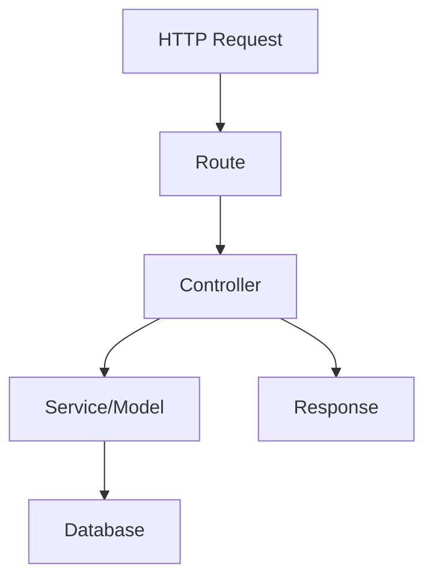

# Controllers

## File Information

- **File Path**: `app/Http/Controllers/`
- **Base Controller**: `App\Http\Controllers\Controller`
- **Dependencies**:
  - `Illuminate\Routing\Controller` (base controller class)
  - `Illuminate\Foundation\Auth\Access\AuthorizesRequests` (for authorization)
  - `Illuminate\Foundation\Validation\ValidatesRequests` (for validation)

## Introduction

Instead of defining all of your request handling logic as closures in your route files, you may wish to organize this behavior using "controller" classes. Controllers can group related request handling logic into a single class. For example, a `UserController` class might handle all incoming requests related to users, including showing, creating, updating, and deleting users. By default, controllers are stored in the `app/Http/Controllers` directory.

**Key Benefits of Using Controllers:**
- Better organization of request handling logic
- Improved code maintainability and readability
- Easier to implement complex business logic
- Supports dependency injection and middleware

## Technical Definition

Controllers in Laravel are PHP classes that handle HTTP requests and return responses. They serve as an intermediary between the routing layer and the application's business logic. Controllers are responsible for:

- Processing incoming HTTP requests
- Validating input data
- Interacting with models and services
- Returning appropriate HTTP responses

## Writing Controllers

### Basic Controllers

To quickly generate a new controller, you may run the `make:controller` Artisan command. By default, all of the controllers for your application are stored in the `app/Http/Controllers` directory:

```bash
php artisan make:controller UserController
```

Let's take a look at an example of a basic controller. A controller may have any number of public methods which will respond to incoming HTTP requests:

**File**: `app/Http/Controllers/UserController.php`

**Dependencies**:
- `App\Models\User` - User model for database operations
- `Illuminate\View\View` - View return type hint
- `App\Http\Controllers\Controller` - Base controller class

```php
<?php

namespace App\Http\Controllers;

use App\Models\User;
use Illuminate\View\View;

class UserController extends Controller
{
    /**
     * Show the profile for a given user.
     *
     * @param string $id
     * @return \Illuminate\View\View
     */
    public function show(string $id): View
    {
        return view('user.profile', [
            'user' => User::findOrFail($id)
        ]);
    }
}
```

Once you have written a controller class and method, you may define a route to the controller method like so:

```php
use App\Http\Controllers\UserController;

Route::get('/user/{id}', [UserController::class, 'show']);
```

When an incoming request matches the specified route URI, the `show` method on the `App\Http\Controllers\UserController` class will be invoked and the route parameters will be passed to the method.

Controllers are not required to extend a base class. However, it is sometimes convenient to extend a base controller class that contains methods that should be shared across all of your controllers.

### Single Action Controllers

If a controller action is particularly complex, you might find it convenient to dedicate an entire controller class to that single action. To accomplish this, you may define a single `__invoke` method within the controller:

**File**: `app/Http/Controllers/ProvisionServer.php`

**Dependencies**:
- `App\Http\Controllers\Controller` - Base controller class
- Any service classes needed for server provisioning

```php
<?php

namespace App\Http\Controllers;

class ProvisionServer extends Controller
{
    /**
     * Provision a new web server.
     *
     * @return \Illuminate\Http\Response
     */
    public function __invoke()
    {
        // Server provisioning logic
        // ...
    }
}
```

When registering routes for single action controllers, you do not need to specify a controller method. Instead, you may simply pass the name of the controller to the router:

```php
use App\Http\Controllers\ProvisionServer;

Route::post('/server', ProvisionServer::class);
```

You may generate an invokable controller by using the `--invokable` option of the `make:controller` Artisan command:

```bash
php artisan make:controller ProvisionServer --invokable
```

Controller stubs may be customized using stub publishing.

## Best Practices

### Controller Organization

1. **Single Responsibility Principle**: Each controller should handle a single resource or related set of resources.
2. **Keep Controllers Thin**: Move complex business logic to service classes or models.
3. **Use Resource Controllers**: For RESTful resources, use `php artisan make:controller UserController --resource` to generate standard CRUD methods.

### Method Naming

- Use descriptive method names that reflect the action being performed
- Follow RESTful conventions for resource controllers (index, create, store, show, edit, update, destroy)
- For non-resource actions, use verb-noun naming (e.g., `processPayment`, `generateReport`)

### Dependency Injection

Leverage Laravel's service container for dependency injection:

**Common Dependencies to Inject:**
- Repository classes for data access
- Service classes for business logic
- Request classes for validation
- External service clients

```php
<?php

namespace App\Http\Controllers;

use App\Repositories\UserRepository;
use App\Services\NotificationService;
use Illuminate\Http\Request;

class UserController extends Controller
{
    /**
     * Create a new controller instance.
     *
     * @param \App\Repositories\UserRepository $users
     * @param \App\Services\NotificationService $notifications
     */
    public function __construct(
        protected UserRepository $users,
        protected NotificationService $notifications
    ) {
        // Dependencies are automatically resolved by Laravel's service container
    }

    // ... controller methods
}
```

### Request Validation

Always validate incoming requests. Use form request classes for complex validation:

**Form Request File**: `app/Http/Requests/StoreUserRequest.php`

**Dependencies**:
- `Illuminate\Foundation\Http\FormRequest` - Base form request class
- Any validation rules and custom validation logic

```php
<?php

namespace App\Http\Requests;

use Illuminate\Foundation\Http\FormRequest;

class StoreUserRequest extends FormRequest
{
    /**
     * Get the validation rules that apply to the request.
     *
     * @return array
     */
    public function rules()
    {
        return [
            'name' => 'required|string|max:255',
            'email' => 'required|email|unique:users',
            'password' => 'required|min:8|confirmed',
        ];
    }
}
```

**Controller Usage**:

```php
<?php

namespace App\Http\Controllers;

use App\Http\Requests\StoreUserRequest;
use App\Models\User;
use Illuminate\Http\RedirectResponse;

class UserController extends Controller
{
    /**
     * Store a newly created user.
     *
     * @param \App\Http\Requests\StoreUserRequest $request
     * @return \Illuminate\Http\RedirectResponse
     */
    public function store(StoreUserRequest $request): RedirectResponse
    {
        // Validation is handled automatically by StoreUserRequest
        $user = User::create($request->validated());
        
        return redirect()->route('users.show', $user->id)
            ->with('success', 'User created successfully');
    }
}
```

## Common Pitfalls

1. **Fat Controllers**: Avoid putting too much logic in controllers. Move business logic to service classes.
2. **Direct Database Queries**: Avoid writing raw SQL queries in controllers. Use Eloquent or query builders.
3. **Missing Validation**: Always validate user input to prevent security vulnerabilities.
4. **Inconsistent Responses**: Return consistent response formats (e.g., always use JSON for API endpoints).
5. **Ignoring HTTP Methods**: Ensure your routes and controller methods use appropriate HTTP verbs.

## Visualization



## Conclusion

Controllers are a fundamental part of Laravel's MVC architecture. They provide a clean way to organize your application's request handling logic and separate concerns. By following best practices and avoiding common pitfalls, you can create maintainable and scalable controller implementations.

**Summary of Key Points:**
- Controllers handle HTTP requests and return responses
- Basic controllers can have multiple methods for different actions
- Single action controllers use the `__invoke` method
- Follow RESTful conventions and Laravel best practices
- Keep controllers thin and move complex logic to services

## Related Documentation

- [Routing](9-routing.md)
- [Middleware](8-middleware.md)
- [Requests](12-requests.md) (to be created)
- [Responses](13-responses.md) (to be created)

## Additional Resources

- [Official Laravel Controller Documentation](https://laravel.com/docs/controllers)
- [Laravel Controller Testing Guide](https://laravel.com/docs/http-tests)
- [Laravel API Resources](https://laravel.com/docs/eloquent-resources)