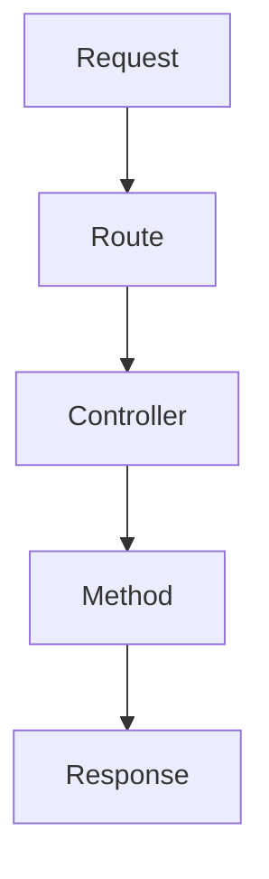

# Controllers

## Introduction

Instead of defining all of your request handling logic as closures in your route files, you may wish to organize this behavior using "controller" classes. Controllers can group related request handling logic into a single class. For example, a `UserController` class might handle all incoming requests related to users, including showing, creating, updating, and deleting users. By default, controllers are stored in the `app/Http/Controllers` directory.

## Writing Controllers

### Basic Controllers

To quickly generate a new controller, you may run the `make:controller` Artisan command. By default, all of the controllers for your application are stored in the `app/Http/Controllers` directory:

```bash
php artisan make:controller UserController
```

Let's take a look at an example of a basic controller. A controller may have any number of public methods which will respond to incoming HTTP requests:

**File:** `app/Http/Controllers/UserController.php`

```php
<?php

namespace App\Http\Controllers;

use App\Models\User;
use Illuminate\View\View;

class UserController extends Controller
{
    /**
     * Show the profile for a given user.
     */
    public function show(string $id): View
    {
        return view('user.profile', [
            'user' => User::findOrFail($id)
        ]);
    }
}
```

Once you have written a controller class and method, you may define a route to the controller method like so:

**File:** `routes/web.php`

```php
use App\Http\Controllers\UserController;

Route::get('/user/{id}', [UserController::class, 'show']);
```

When an incoming request matches the specified route URI, the `show` method on the `App\Http\Controllers\UserController` class will be invoked and the route parameters will be passed to the method.

Controllers are not required to extend a base class. However, it is sometimes convenient to extend a base controller class that contains methods that should be shared across all of your controllers.

### Single Action Controllers

If a controller action is particularly complex, you might find it convenient to dedicate an entire controller class to that single action. To accomplish this, you may define a single `__invoke` method within the controller:

**File:** `app/Http/Controllers/ProvisionServer.php`

```php
<?php

namespace App\Http\Controllers;

class ProvisionServer extends Controller
{
    /**
     * Provision a new web server.
     */
    public function __invoke()
    {
        // ...
    }
}
```

When registering routes for single action controllers, you do not need to specify a controller method. Instead, you may simply pass the name of the controller to the router:

**File:** `routes/web.php`

```php
use App\Http\Controllers\ProvisionServer;

Route::post('/server', ProvisionServer::class);
```

You may generate an invokable controller by using the `--invokable` option of the `make:controller` Artisan command:

```bash
php artisan make:controller ProvisionServer --invokable
```

Controller stubs may be customized using stub publishing.

### Controller Middleware

Middleware may be assigned to the controller's routes in your route files:

**File:** `routes/web.php`

```php
Route::get('/profile', [UserController::class, 'show'])->middleware('auth');
```

Or, you may find it convenient to specify middleware within your controller class. To do so, your controller should implement the `HasMiddleware` interface, which dictates that the controller should have a static `middleware` method. From this method, you may return an array of middleware that should be applied to the controller's actions:

**File:** `app/Http/Controllers/UserController.php`

```php
<?php

namespace App\Http\Controllers;

use Illuminate\Routing\Controllers\HasMiddleware;
use Illuminate\Routing\Controllers\Middleware;

class UserController implements HasMiddleware
{
    /**
     * Get the middleware that should be assigned to the controller.
     */
    public static function middleware(): array
    {
        return [
            'auth',
            new Middleware('log', only: ['index']),
            new Middleware('subscribed', except: ['store']),
        ];
    }

    // ...
}
```

You may also define controller middleware as closures, which provides a convenient way to define an inline middleware without writing an entire middleware class:

```php
use Closure;
use Illuminate\Http\Request;

/**
 * Get the middleware that should be assigned to the controller.
 */
public static function middleware(): array
{
    return [
        function (Request $request, Closure $next) {
            return $next($request);
        },
    ];
}
```

## Visualization

Below is a Mermaid diagram to visualize the flow of a request through a controller:



## Conclusion

Controllers provide a way to organize your request handling logic into classes, making your application more modular and easier to maintain. By using controllers, you can group related logic, apply middleware, and create single-action controllers for complex actions. This approach enhances the readability and scalability of your Laravel applications.