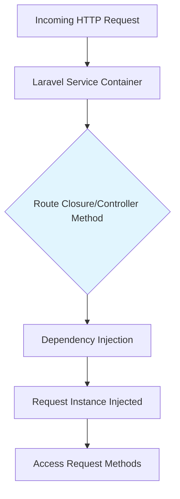
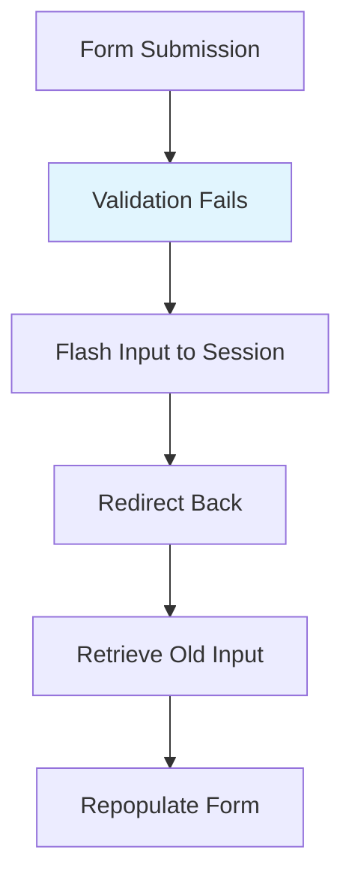

# 12. Request

## Introduction

Laravel's `Illuminate\Http.Request` class provides an object-oriented way to interact with the current HTTP request being handled by your application as well as retrieve the input, cookies, and files that were submitted with the request.

## Technical Definition

The `Illuminate\Http\Request` class extends the `Symfony\Component\HttpFoundation\Request` class and provides a variety of methods for examining the incoming HTTP request and retrieving user input data.

## 1. Interacting With The Request

### 1.1 Accessing the Request

To obtain an instance of the current HTTP request via dependency injection, you should type-hint the `Illuminate\Http\Request` class on your route closure or controller method. The incoming request instance will automatically be injected by the Laravel service container:

```php
// File: app/Http/Controllers/UserController.php
<?php

namespace App\Http\Controllers;

use Illuminate\Http\RedirectResponse;
use Illuminate\Http\Request;

class UserController extends Controller
{
    /**
     * Store a new user.
     */
    public function store(Request $request): RedirectResponse
    {
        $name = $request->input('name');

        // Store the user...

        return redirect('/users');
    }
}
```

You may also type-hint the `Illuminate\Http\Request` class on a route closure:

```php
// File: routes/web.php
use Illuminate\Http\Request;

Route::get('/', function (Request $request) {
    // ...
});
```

### 1.2 Dependency Injection and Route Parameters

If your controller method is also expecting input from a route parameter you should list your route parameters after your other dependencies:

```php
// File: routes/web.php
use App\Http\Controllers\UserController;

Route::put('/user/{id}', [UserController::class, 'update']);
```

You may still type-hint the `Illuminate\Http\Request` and access your `id` route parameter:

```php
// File: app/Http/Controllers/UserController.php
<?php

namespace App\Http\Controllers;

use Illuminate\Http\RedirectResponse;
use Illuminate\Http\Request;

class UserController extends Controller
{
    /**
     * Update the specified user.
     */
    public function update(Request $request, string $id): RedirectResponse
    {
        // Update the user...

        return redirect('/users');
    }
}
```

## 2. Request Path, Host, and Method

### 2.1 Retrieving the Request Path

The `path` method returns the request's path information:

```php
// File: app/Http/Controllers/ExampleController.php
$uri = $request->path();
```

### 2.2 Inspecting the Request Path / Route

The `is` method allows you to verify that the incoming request path matches a given pattern:

```php
// File: app/Http/Controllers/ExampleController.php
if ($request->is('admin/*')) {
    // ...
}
```

Using the `routeIs` method, you may determine if the incoming request has matched a named route:

```php
// File: app/Http/Controllers/ExampleController.php
if ($request->routeIs('admin.*')) {
    // ...
}
```

### 2.3 Retrieving the Request URL

To retrieve the full URL for the incoming request:

```php
// File: app/Http/Controllers/ExampleController.php
$url = $request->url();
$urlWithQueryString = $request->fullUrl();
```

You may append query string data:

```php
// File: app/Http/Controllers/ExampleController.php
$request->fullUrlWithQuery(['type' => 'phone']);
```

Or remove query string parameters:

```php
// File: app/Http/Controllers/ExampleController.php
$request->fullUrlWithoutQuery(['type']);
```

### 2.4 Retrieving the Request Host

```php
// File: app/Http/Controllers/ExampleController.php
$request->host();
$request->httpHost();
$request->schemeAndHttpHost();
```

### 2.5 Retrieving the Request Method

```php
// File: app/Http/Controllers/ExampleController.php
$method = $request->method();

if ($request->isMethod('post')) {
    // ...
}
```

## 3. Request Headers

### 3.1 Retrieving Headers

```php
// File: app/Http/Controllers/ExampleController.php
$value = $request->header('X-Header-Name');
$value = $request->header('X-Header-Name', 'default');
```

### 3.2 Checking Header Presence

```php
// File: app/Http/Controllers/ExampleController.php
if ($request->hasHeader('X-Header-Name')) {
    // ...
}
```

### 3.3 Bearer Token

```php
// File: app/Http/Controllers/ExampleController.php
$token = $request->bearerToken();
```

## 4. Request IP Address

```php
// File: app/Http/Controllers/ExampleController.php
$ipAddress = $request->ip();
$ipAddresses = $request->ips();
```

## 5. Content Negotiation

```php
// File: app/Http/Controllers/ExampleController.php
$contentTypes = $request->getAcceptableContentTypes();

if ($request->accepts(['text/html', 'application/json'])) {
    // ...
}

$preferred = $request->prefers(['text/html', 'application/json']);

if ($request->expectsJson()) {
    // ...
}
```

## 6. PSR-7 Requests

To use PSR-7 requests, install the required libraries:

```bash
// Terminal command
composer require symfony/psr-http-message-bridge
composer require nyholm/psr7
```

Then type-hint the PSR-7 request interface:

```php
// File: routes/web.php
use Psr\Http\Message\ServerRequestInterface;

Route::get('/', function (ServerRequestInterface $request) {
    // ...
});
```

## 7. Input

### 7.1 Retrieving All Input Data

```php
// File: app/Http/Controllers/ExampleController.php
$input = $request->all();
$input = $request->collect();
```

### 7.2 Retrieving an Input Value

```php
// File: app/Http/Controllers/ExampleController.php
$name = $request->input('name');
$name = $request->input('name', 'Sally');
$name = $request->input('products.0.name');
$names = $request->input('products.*.name');
```

### 7.3 Retrieving Input From the Query String

```php
// File: app/Http/Controllers/ExampleController.php
$name = $request->query('name');
$name = $request->query('name', 'Helen');
```

### 7.4 Retrieving JSON Input Values

```php
// File: app/Http/Controllers/ExampleController.php
$name = $request->input('user.name');
```

### 7.5 Retrieving Stringable Input Values

```php
// File: app/Http/Controllers/ExampleController.php
$name = $request->string('name')->trim();
```

### 7.6 Retrieving Integer Input Values

```php
// File: app/Http/Controllers/ExampleController.php
$perPage = $request->integer('per_page');
```

### 7.7 Retrieving Boolean Input Values

```php
// File: app/Http/Controllers/ExampleController.php
$archived = $request->boolean('archived');
```

### 7.8 Retrieving Array Input Values

```php
// File: app/Http/Controllers/ExampleController.php
$versions = $request->array('versions');
```

### 7.9 Retrieving Date Input Values

```php
// File: app/Http/Controllers/ExampleController.php
$birthday = $request->date('birthday');
$elapsed = $request->date('elapsed', '!H:i', 'Europe/Madrid');
```

### 7.10 Retrieving Enum Input Values

```php
// File: app/Http/Controllers/ExampleController.php
use App\Enums\Status;

$status = $request->enum('status', Status::class);
$status = $request->enum('status', Status::class, Status::Pending);

use App\Enums\Product;

$products = $request->enums('products', Product::class);
```

### 7.11 Retrieving Input via Dynamic Properties

```php
// File: app/Http/Controllers/ExampleController.php
$name = $request->name;
```

### 7.12 Retrieving a Portion of the Input Data

```php
// File: app/Http/Controllers/ExampleController.php
$input = $request->only(['username', 'password']);
$input = $request->except(['credit_card']);
```

## 8. Input Presence

### 8.1 Checking Input Presence

```php
// File: app/Http/Controllers/ExampleController.php
if ($request->has('name')) {
    // ...
}

if ($request->has(['name', 'email'])) {
    // ...
}

if ($request->hasAny(['name', 'email'])) {
    // ...
}
```

### 8.2 Conditional Input Handling

```php
// File: app/Http/Controllers/ExampleController.php
$request->whenHas('name', function (string $input) {
    // ...
});

$request->whenHas('name', function (string $input) {
    // The "name" value is present...
}, function () {
    // The "name" value is not present...
});
```

### 8.3 Checking Filled Input

```php
// File: app/Http/Controllers/ExampleController.php
if ($request->filled('name')) {
    // ...
}

if ($request->isNotFilled('name')) {
    // ...
}

if ($request->anyFilled(['name', 'email'])) {
    // ...
}
```

### 8.4 Conditional Filled Input Handling

```php
// File: app/Http/Controllers/ExampleController.php
$request->whenFilled('name', function (string $input) {
    // ...
});
```

### 8.5 Checking Missing Input

```php
// File: app/Http/Controllers/ExampleController.php
if ($request->missing('name')) {
    // ...
}

$request->whenMissing('name', function () {
    // The "name" value is missing...
}, function () {
    // The "name" value is present...
});
```

## 9. Merging Additional Input

```php
// File: app/Http/Controllers/ExampleController.php
$request->merge(['votes' => 0]);
$request->mergeIfMissing(['votes' => 0]);
```

## 10. Old Input

### 10.1 Flashing Input to the Session

```php
// File: app/Http/Controllers/ExampleController.php
$request->flash();
$request->flashOnly(['username', 'email']);
$request->flashExcept('password');
```

### 10.2 Flashing Input Then Redirecting

```php
// File: app/Http/Controllers/ExampleController.php
return redirect('/form')->withInput();
return redirect()->route('user.create')->withInput();
return redirect('/form')->withInput(
    $request->except('password')
);
```

### 10.3 Retrieving Old Input

```php
// File: app/Http/Controllers/ExampleController.php
$username = $request->old('username');
```

In Blade templates:

```html
<!-- File: resources/views/form.blade.php -->
<input type="text" name="username" value="{{ old('username') }}">
```

## 11. Cookies

```php
// File: app/Http/Controllers/ExampleController.php
$value = $request->cookie('name');
```

## 12. Input Trimming and Normalization

By default, Laravel includes middleware that automatically trims all incoming string fields and converts empty strings to null.

### 12.1 Disabling Input Normalization

```php
// File: bootstrap/app.php
use Illuminate\Foundation\Http\Middleware\ConvertEmptyStringsToNull;
use Illuminate\Foundation\Http\Middleware\TrimStrings;

->withMiddleware(function (Middleware $middleware): void {
    $middleware->remove([
        ConvertEmptyStringsToNull::class,
        TrimStrings::class,
    ]);
})
```

### 12.2 Conditional Normalization

```php
// File: bootstrap/app.php
->withMiddleware(function (Middleware $middleware): void {
    $middleware->convertEmptyStringsToNull(except: [
        fn (Request $request) => $request->is('admin/*'),
    ]);

    $middleware->trimStrings(except: [
        fn (Request $request) => $request->is('admin/*'),
    ]);
})
```

## 13. Files

### 13.1 Retrieving Uploaded Files

```php
// File: app/Http/Controllers/ExampleController.php
$file = $request->file('photo');
$file = $request->photo;

if ($request->hasFile('photo')) {
    // ...
}
```

### 13.2 Validating Successful Uploads

```php
// File: app/Http/Controllers/ExampleController.php
if ($request->file('photo')->isValid()) {
    // ...
}
```

### 13.3 File Paths and Extensions

```php
// File: app/Http/Controllers/ExampleController.php
$path = $request->photo->path();
$extension = $request->photo->extension();
```

### 13.4 Storing Uploaded Files

```php
// File: app/Http/Controllers/ExampleController.php
$path = $request->photo->store('images');
$path = $request->photo->store('images', 's3');
$path = $request->photo->storeAs('images', 'filename.jpg');
$path = $request->photo->storeAs('images', 'filename.jpg', 's3');
```

## Best Practices

1. **Always validate input data** before processing it
2. **Use type-hinting** for better code clarity and IDE support
3. **Be cautious with file uploads** - always validate file types and sizes
4. **Use the `filled` method** to check for non-empty input values
5. **Leverage Laravel's input normalization** for consistent data handling
6. **Use `old()` helper** for form repopulation after validation errors
7. **Consider security implications** when working with request data
8. **Use appropriate input retrieval methods** based on data type (integer(), boolean(), etc.)
9. **Validate file uploads** using `isValid()` before processing
10. **Sanitize input data** before storing or using it

## Common Pitfalls

1. **Not validating input** - always validate user input to prevent security vulnerabilities
2. **Assuming data types** - use specific retrieval methods like `integer()`, `boolean()` for type safety
3. **Ignoring file upload validation** - always check `isValid()` before processing uploaded files
4. **Overusing dynamic properties** - prefer explicit method calls for better code maintainability
5. **Not handling missing input** - always provide default values or proper error handling
6. **Trust all input blindly** - never trust user input without proper validation
7. **Forgetting to sanitize input** - clean and sanitize input before using it
8. **Incorrectly handling arrays in input** - use proper dot notation for nested arrays
9. **Not properly handling file paths** - validate file paths to prevent directory traversal attacks
10. **Exposing sensitive data in error messages** - avoid revealing internal details in error responses

## Visualization


### 1.1 Accessing the Request Visualization



### 2.1 Request Path, Host, and Method Visualization

```mermaid
graph TD
    A[HTTP Request] --> B[Request Instance]
    B --> C[Path Methods]
    B --> D[Host Methods]
    B --> E[Method Methods]
    C --> F[path(), is(), routeIs()]
    D --> G[host(), httpHost(), schemeAndHttpHost()]
    E --> H[method(), isMethod()]
    style B fill:#e1f5fe
```

### 3.1 Request Headers Visualization

```mermaid
graph TD
    A[HTTP Request] --> B[Request Instance]
    B --> C[Header Methods]
    C --> D[header()]
    C --> E[hasHeader()]
    C --> F[bearerToken()]
    D --> G[Get Specific Header]
    E --> H[Check Header Existence]
    F --> I[Get Bearer Token]
    style B fill:#e1f5fe
```

### 4.1 Request IP Address Visualization

```mermaid
graph TD
    A[HTTP Request] --> B[Request Instance]
    B --> C[IP Methods]
    C --> D[ip()]
    C --> E[ips()]
    D --> F[Single IP Address]
    E --> G[Array of IP Addresses]
    style B fill:#e1f5fe
```

### 5.1 Content Negotiation Visualization

```mermaid
graph TD
    A[HTTP Request] --> B[Request Instance]
    B --> C[Content Negotiation Methods]
    C --> D[getAcceptableContentTypes()]
    C --> E[accepts()]
    C --> F[prefers()]
    C --> G[expectsJson()]
    D --> H[All Accepted Types]
    E --> I[Check Specific Types]
    F --> J[Preferred Type]
    G --> K[JSON Expected?]
    style B fill:#e1f5fe
```

### 7.1 Input Methods Visualization

```mermaid
graph TD
    A[HTTP Request] --> B[Request Instance]
    B --> C[Input Methods]
    C --> D[All Input]
    C --> E[Specific Input]
    C --> F[Query String]
    C --> G[JSON Input]
    C --> H[Dynamic Properties]
    D --> I[all(), collect()]
    E --> J[input()]
    F --> K[query()]
    G --> L[JSON dot notation]
    H --> M[$request->property]
    style B fill:#e1f5fe
```

### 8.1 Input Presence Visualization

```mermaid
graph TD
    A[HTTP Request] --> B[Request Instance]
    B --> C[Presence Methods]
    C --> D[has()]
    C --> E[filled()]
    C --> F[missing()]
    D --> G[Value Present?]
    E --> H[Value Filled?]
    F --> I[Value Missing?]
    style B fill:#e1f5fe
```

### 10.1 Old Input Visualization



### 13.1 Files Visualization

```mermaid
graph TD
    A[File Upload Request] --> B[Request Instance]
    B --> C[File Methods]
    C --> D[Retrieve File]
    C --> E[Validate File]
    C --> F[Store File]
    D --> G[file(), photo property]
    E --> H[isValid()]
    F --> I[store(), storeAs()]
    style B fill:#e1f5fe
```

## Conclusion

The Laravel Request class provides a comprehensive and intuitive API for working with HTTP requests. By understanding its various methods and features, you can build robust web applications that handle user input securely and efficiently. Always remember to validate input data and follow Laravel's best practices for optimal security and performance.