# Views

## 1. Introduction

### 1.1 Overview
Views separate your controller/application logic from your presentation logic and are stored in the `resources/views` directory. When using Laravel, view templates are usually written using the Blade templating language.

### 1.2 Technical Definition
Views in Laravel are PHP files that contain HTML markup and optionally Blade template syntax. They serve as the presentation layer of your application, receiving data from controllers and rendering it in a user-friendly format.

### 1.3 Visualization
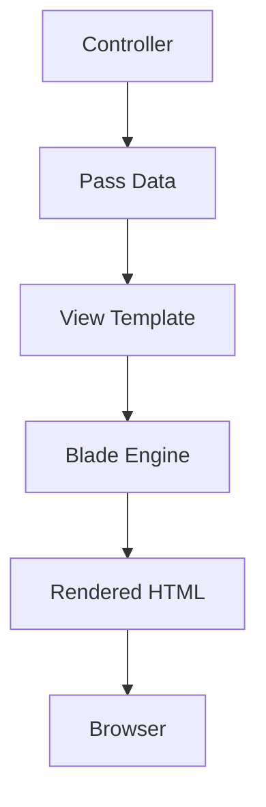

### 1.4 Code Examples

**File:** `resources/views/greeting.blade.php`
```html
<!-- View stored in resources/views/greeting.blade.php -->
<html>
    <body>
        <h1>Hello, {{ $name }}</h1>
    </body>
</html>
```

**File:** `routes/web.php`
```php
Route::get('/', function () {
    return view('greeting', ['name' => 'James']);
});
```

### 1.5 Best Practices
- Keep views simple and focused on presentation
- Use Blade directives for dynamic content
- Separate business logic from presentation logic
- Use view composers for complex data binding

---

## 2. Writing Views in React / Vue

### 2.1 Overview
Instead of writing their frontend templates in PHP via Blade, many developers have begun to prefer to write their templates using React or Vue. Laravel makes this painless thanks to Inertia, a library that makes it a cinch to tie your React / Vue frontend to your Laravel backend without the typical complexities of building an SPA.

### 2.2 Technical Definition
Inertia.js allows you to create classic server-side rendered Laravel applications using modern JavaScript frameworks like React or Vue. It eliminates the need for an API layer and provides seamless integration between Laravel and frontend frameworks.

### 2.3 Visualization
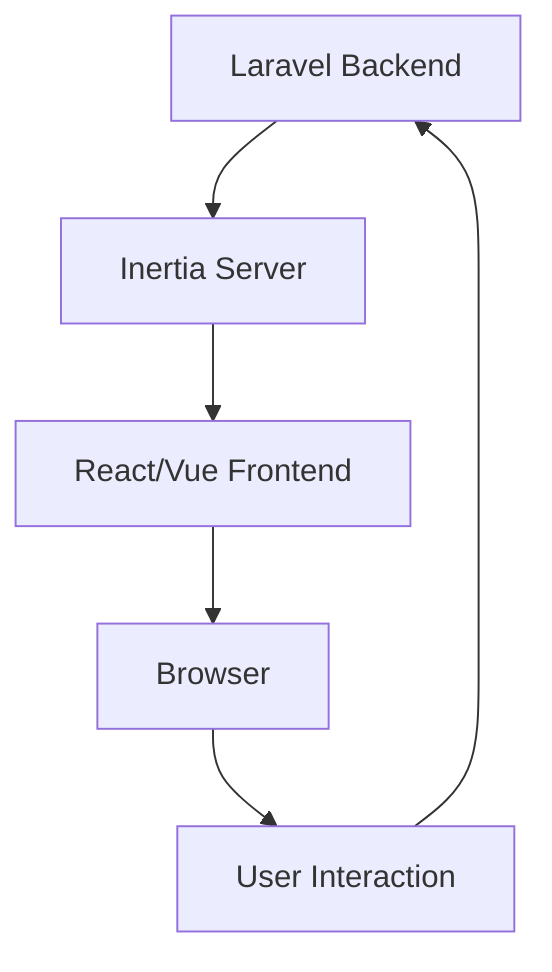

### 2.4 Code Examples

Our React and Vue application starter kits give you a great starting point for your next Laravel application powered by Inertia.

### 2.5 Best Practices
- Use Inertia for full-stack React/Vue applications
- Maintain server-side routing with client-side rendering
- Leverage Laravel's authentication with Inertia
- Follow component-based architecture principles

---

## 3. Creating and Rendering Views

### 3.1 Overview
Creating views in Laravel involves placing Blade template files in the appropriate directory and returning them from routes or controllers.

### 3.2 Technical Definition
Views are created by placing files with the `.blade.php` extension in your application's `resources/views` directory. These files contain HTML and Blade syntax that is processed by Laravel's Blade engine.

### 3.3 Visualization
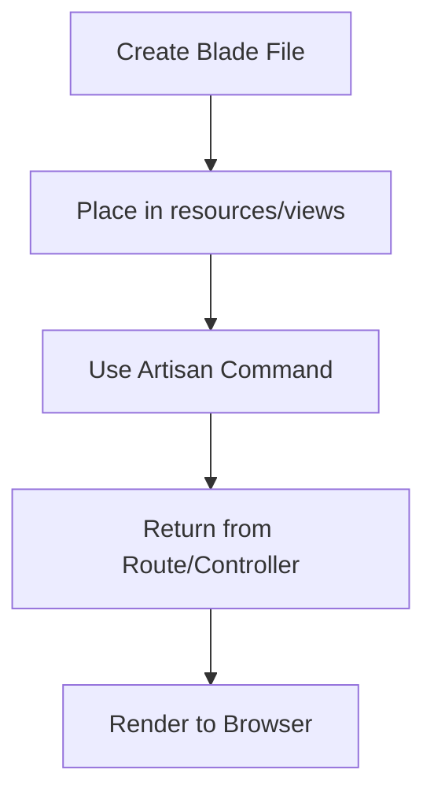

### 3.4 Code Examples

**Using Artisan Command:**
```bash
php artisan make:view greeting
```

**File:** `routes/web.php`
```php
Route::get('/', function () {
    return view('greeting', ['name' => 'James']);
});
```

**Using View Facade:**
```php
use Illuminate\Support\Facades\View;

return View::make('greeting', ['name' => 'James']);
```

**File:** `app/Http/Controllers/ViewController.php`
```php
<?php

namespace App\Http\Controllers;

use Illuminate\Http\Request;
use Illuminate\View\View;

class ViewController extends Controller
{
    /**
     * Show the greeting view.
     */
    public function show(): View
    {
        return view('greeting', ['name' => 'James']);
    }
}
```

### 3.5 Dependencies
- `Illuminate\Support\Facades\View` - View facade
- `Illuminate\View\View` - View interface
- `resources/views/` directory - Storage location for view files

### 3.6 Best Practices
- Use descriptive view names
- Organize views in subdirectories for complex applications
- Use view composers for shared data
- Keep views focused on presentation logic

---

## 4. Nested View Directories

### 4.1 Overview
Views may be nested within subdirectories of the `resources/views` directory. "Dot" notation may be used to reference nested views.

### 4.2 Technical Definition
Nested view directories allow for better organization of view files by grouping related views together in subdirectories. Laravel uses dot notation to reference these nested views.

### 4.3 Visualization
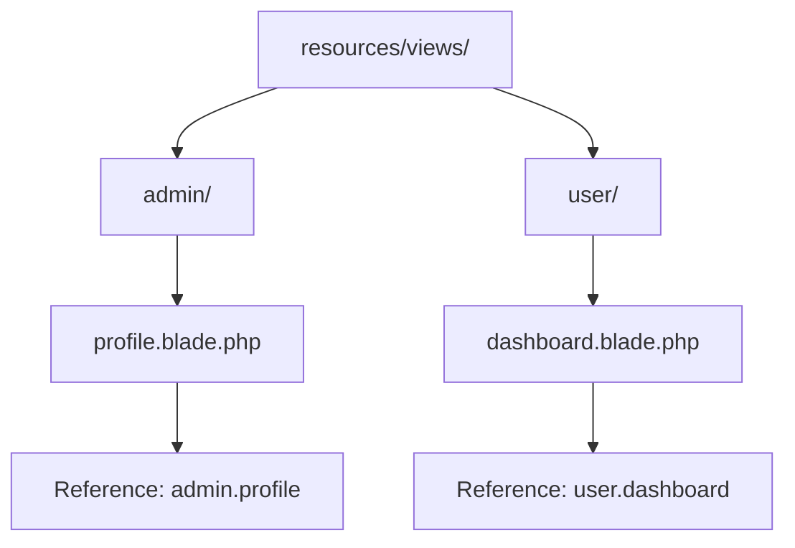

### 4.4 Code Examples

**File Structure:**
```
resources/views/
├── admin/
│   └── profile.blade.php
└── user/
    └── dashboard.blade.php
```

**File:** `routes/web.php`
```php
// Return view from nested directory
return view('admin.profile', $data);

// Using controller
Route::get('/admin/profile', function () {
    return view('admin.profile');
});
```

**File:** `app/Http/Controllers/AdminController.php`
```php
<?php

namespace App\Http\Controllers;

use Illuminate\Http\Request;
use Illuminate\View\View;

class AdminController extends Controller
{
    /**
     * Show the admin profile view.
     */
    public function showProfile(): View
    {
        return view('admin.profile', [
            'user' => auth()->user()
        ]);
    }
}
```

### 4.5 Dependencies
- `resources/views/` directory - Parent directory for all views
- Dot notation for referencing nested views
- Proper directory structure for organization

### 4.6 Best Practices
- Use meaningful directory names
- Maintain consistent naming conventions
- Group related views together
- Avoid deeply nested directories

---

## 5. Creating the First Available View

### 5.1 Overview
Using the View facade's `first` method, you may create the first view that exists in a given array of views. This may be useful if your application or package allows views to be customized or overwritten.

### 5.2 Technical Definition
The `first` method attempts to find and return the first view that exists from an array of view names. This is particularly useful for package development where users might want to override default views.

### 5.3 Visualization
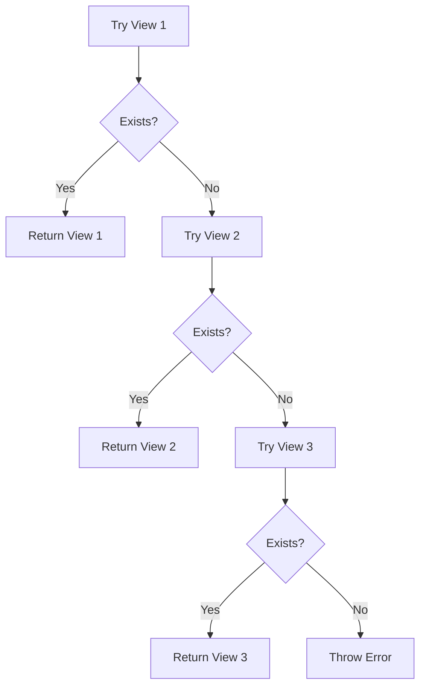

### 5.4 Code Examples

**File:** `app/Http/Controllers/ThemeController.php`
```php
<?php

namespace App\Http\Controllers;

use Illuminate\Http\Request;
use Illuminate\Support\Facades\View;
use Illuminate\View\View as ViewInstance;

class ThemeController extends Controller
{
    /**
     * Show a view with fallback options.
     */
    public function show(): ViewInstance
    {
        return View::first([
            'custom.admin',
            'admin',
            'layouts.admin'
        ], $data);
    }
    
    /**
     * Show a user profile with theme fallback.
     */
    public function userProfile(string $userId): ViewInstance
    {
        $user = User::findOrFail($userId);
        
        return View::first([
            'themes.' . $user->theme . '.profile',
            'themes.default.profile',
            'user.profile'
        ], compact('user'));
    }
}
```

**File:** `routes/web.php`
```php
use Illuminate\Support\Facades\View;

Route::get('/fallback-example', function () {
    return View::first(['custom.admin', 'admin'], $data);
});
```

### 5.5 Dependencies
- `Illuminate\Support\Facades\View` - View facade
- Multiple view files with fallback options
- Proper directory structure for custom themes

### 5.6 Best Practices
- Use fallback views for package development
- Maintain consistent fallback order
- Document fallback hierarchy
- Test all fallback scenarios

---

## 6. Determining if a View Exists

### 6.1 Overview
If you need to determine if a view exists, you may use the View facade. The `exists` method will return true if the view exists.

### 6.2 Technical Definition
The `exists` method checks whether a specified view file exists in the application's view directories. This is useful for conditional rendering or implementing fallback mechanisms.

### 6.3 Visualization
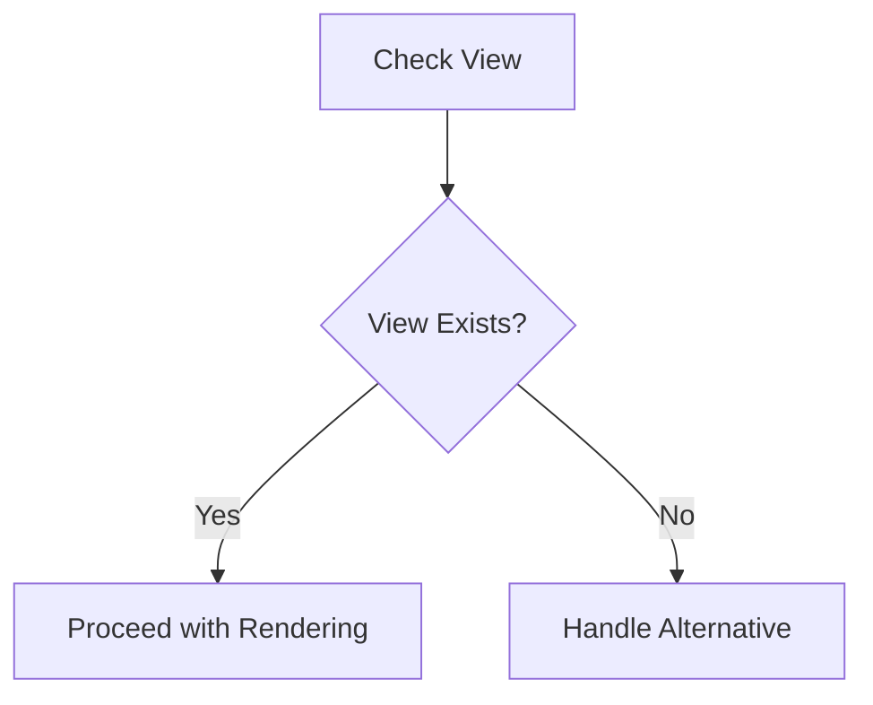

### 6.4 Code Examples

**File:** `app/Http/Controllers/DynamicViewController.php`
```php
<?php

namespace App\Http\Controllers;

use Illuminate\Http\Request;
use Illuminate\Support\Facades\View;
use Illuminate\View\View as ViewInstance;

class DynamicViewController extends Controller
{
    /**
     * Show a view conditionally based on existence.
     */
    public function show(string $viewName): ViewInstance
    {
        if (View::exists('custom.' . $viewName)) {
            return view('custom.' . $viewName);
        } elseif (View::exists('default.' . $viewName)) {
            return view('default.' . $viewName);
        } else {
            return view('fallback');
        }
    }
    
    /**
     * Check if theme view exists before rendering.
     */
    public function themedView(string $theme, string $page): ViewInstance
    {
        $viewPath = $theme . '.' . $page;
        
        if (View::exists($viewPath)) {
            return view($viewPath, [
                'theme' => $theme,
                'page' => $page
            ]);
        }
        
        // Fallback to default theme
        return view('default.' . $page, [
            'theme' => 'default',
            'page' => $page
        ]);
    }
}
```

**File:** `routes/web.php`
```php
use Illuminate\Support\Facades\View;

Route::get('/conditional-view/{name}', function (string $name) {
    if (View::exists('admin.' . $name)) {
        return view('admin.' . $name);
    } else {
        return view('default.page');
    }
});
```

### 6.5 Dependencies
- `Illuminate\Support\Facades\View` - View facade
- View files in appropriate directories
- Proper view naming conventions

### 6.6 Best Practices
- Check view existence before rendering in dynamic scenarios
- Use for conditional rendering logic
- Implement fallback mechanisms
- Avoid excessive view existence checks in performance-critical paths

---

## 7. Passing Data to Views

### 7.1 Overview
You may pass an array of data to views to make that data available to the view. When passing information in this manner, the data should be an array with key/value pairs.

### 7.2 Technical Definition
Data is passed to views using arrays where keys become variable names available in the view template. Laravel supports multiple methods for passing data including array passing and the `with` method.

### 7.3 Visualization
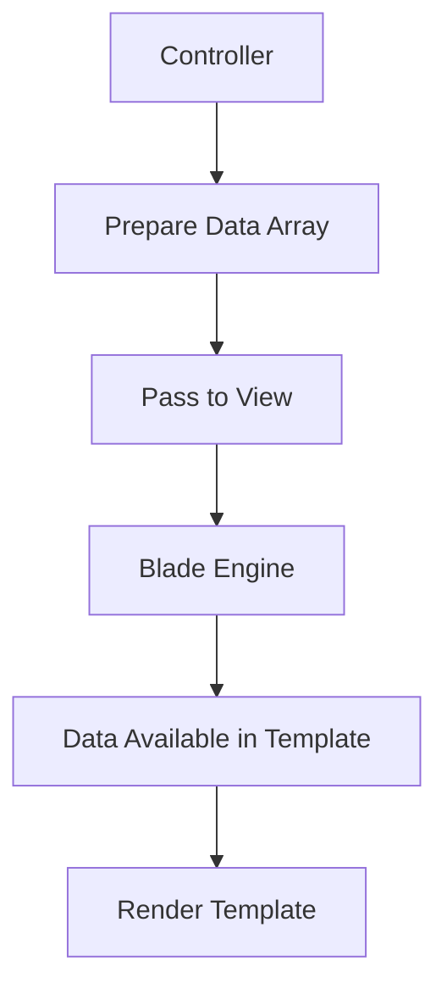

### 7.4 Code Examples

**Passing Data as Array:**
```php
return view('greetings', ['name' => 'Victoria']);
```

**Using with() Method:**
```php
return view('greeting')
    ->with('name', 'Victoria')
    ->with('occupation', 'Astronaut');
```

**File:** `app/Http/Controllers/UserController.php`
```php
<?php

namespace App\Http\Controllers;

use Illuminate\Http\Request;
use Illuminate\View\View;

class UserController extends Controller
{
    /**
     * Show the user profile.
     */
    public function show(Request $request, string $id): View
    {
        $user = User::findOrFail($id);
        
        // Pass data as array
        return view('user.profile', [
            'user' => $user,
            'posts' => $user->posts,
            'followers' => $user->followers()->count(),
            'following' => $user->following()->count()
        ]);
    }
    
    /**
     * Show user dashboard with chained with() calls.
     */
    public function dashboard(Request $request): View
    {
        $user = $request->user();
        
        return view('user.dashboard')
            ->with('user', $user)
            ->with('notifications', $user->unreadNotifications)
            ->with('recentPosts', $user->posts()->latest()->take(5)->get())
            ->with('stats', [
                'posts' => $user->posts()->count(),
                'comments' => $user->comments()->count(),
                'reactions' => $user->receivedReactions()->count()
            ]);
    }
}
```

**File:** `resources/views/user/profile.blade.php`
```html
<div class="user-profile">
    <h1>{{ $user->name }}</h1>
    <p>Posts: {{ $posts->count() }}</p>
    <p>Followers: {{ $followers }}</p>
    <p>Following: {{ $following }}</p>
</div>
```

### 7.5 Dependencies
- `Illuminate\View\View` - View interface
- Data arrays or individual values
- Blade template files

### 7.6 Best Practices
- Use meaningful variable names
- Pass only necessary data to views
- Consider using view composers for shared data
- Organize complex data structures appropriately

---

## 8. Sharing Data With All Views

### 8.1 Overview
Occasionally, you may need to share data with all views that are rendered by your application. You may do so using the View facade's `share` method.

### 8.2 Technical Definition
The `share` method allows you to register data that will be available to all views rendered by your application. This is useful for global data like user information, settings, or configuration values.

### 8.3 Visualization
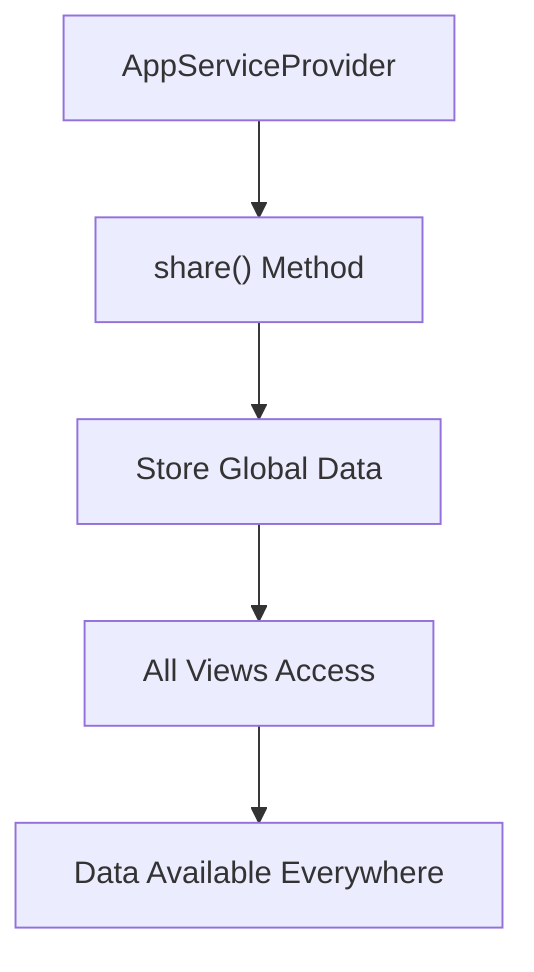

### 8.4 Code Examples

**File:** `app/Providers/AppServiceProvider.php`
```php
<?php

namespace App\Providers;

use Illuminate\Support\Facades\View;
use Illuminate\Support\ServiceProvider;

class AppServiceProvider extends ServiceProvider
{
    /**
     * Bootstrap any application services.
     */
    public function boot(): void
    {
        // Share data with all views
        View::share('appName', config('app.name'));
        View::share('appVersion', config('app.version'));
        View::share('currentUser', auth()->user());
        
        // Share computed values
        View::share('unreadNotificationsCount', function () {
            if (auth()->check()) {
                return auth()->user()->unreadNotifications()->count();
            }
            return 0;
        });
    }

    /**
     * Register any application services.
     */
    public function register(): void
    {
        // ...
    }
}
```

**Alternative approach in custom service provider:**
```php
<?php

namespace App\Providers;

use Illuminate\Support\ServiceProvider;
use Illuminate\Support\Facades\View;

class ViewComposerServiceProvider extends ServiceProvider
{
    /**
     * Register services.
     */
    public function register(): void
    {
        //
    }

    /**
     * Bootstrap services.
     */
    public function boot(): void
    {
        View::share('siteSettings', function () {
            return cache()->remember('site_settings', 3600, function () {
                return SiteSetting::all()->pluck('value', 'key');
            });
        });
    }
}
```

### 8.5 Dependencies
- `Illuminate\Support\Facades\View` - View facade
- `App\Providers\AppServiceProvider` - Service provider class
- Global data sources (config, auth, etc.)

### 8.6 Best Practices
- Use sparingly to avoid performance impact
- Cache expensive computations
- Consider alternatives like view composers for complex scenarios
- Document shared data for team awareness

---

## 9. View Composers

### 9.1 Overview
View composers are callbacks or class methods that are called when a view is rendered. If you have data that you want to be bound to a view each time that view is rendered, a view composer can help you organize that logic into a single location.

### 9.2 Technical Definition
View composers are classes or closures that bind data to views automatically. They are particularly useful when the same view is returned by multiple routes or controllers and always needs a particular piece of data.

### 9.3 Visualization
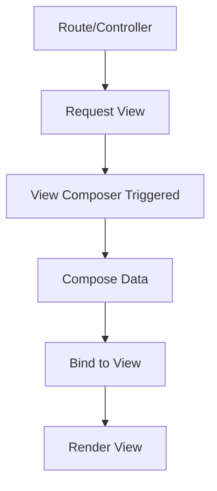

### 9.4 Code Examples

**File:** `app/Providers/AppServiceProvider.php`
```php
<?php

namespace App\Providers;

use App\View\Composers\ProfileComposer;
use Illuminate\Support\Facades;
use Illuminate\Support\ServiceProvider;
use Illuminate\View\View;

class AppServiceProvider extends ServiceProvider
{
    /**
     * Bootstrap any application services.
     */
    public function boot(): void
    {
        // Using class-based composers...
        Facades\View::composer('profile', ProfileComposer::class);
        
        // Using closure-based composers...
        Facades\View::composer('welcome', function (View $view) {
            $view->with('count', User::count());
        });
        
        Facades\View::composer('dashboard', function (View $view) {
            $view->with('recentUsers', User::latest()->take(5)->get());
        });
        
        // Multiple views with same composer
        Facades\View::composer(
            ['profile', 'dashboard'],
            ProfileComposer::class
        );
    }

    /**
     * Register any application services.
     */
    public function register(): void
    {
        // ...
    }
}
```

**File:** `app/View/Composers/ProfileComposer.php`
```php
<?php

namespace App\View\Composers;

use App\Repositories\UserRepository;
use Illuminate\View\View;

class ProfileComposer
{
    /**
     * Create a new profile composer.
     */
    public function __construct(
        protected UserRepository $users,
    ) {}

    /**
     * Bind data to the view.
     */
    public function compose(View $view): void
    {
        $view->with('count', $this->users->count());
        $view->with('recentUsers', $this->users->getRecent());
        $view->with('topUsers', $this->users->getTopPerformers());
    }
}
```

**Wildcard composer for all views:**
```php
use Illuminate\Support\Facades;
use Illuminate\View\View;

Facades\View::composer('*', function (View $view) {
    $view->with('globalData', [
        'appName' => config('app.name'),
        'version' => app()->version()
    ]);
});
```

### 9.5 Dependencies
- `Illuminate\View\View` - View interface
- `App\View\Composers\*` - Composer classes
- Repository classes for data access
- Service provider for registration

### 9.6 Best Practices
- Use for data that's needed across multiple views
- Keep composer logic simple and efficient
- Use dependency injection for complex data needs
- Consider caching for expensive operations

---

## 10. Attaching a Composer to Multiple Views

### 10.1 Overview
You may attach a view composer to multiple views at once by passing an array of views as the first argument to the composer method.

### 10.2 Technical Definition
Multiple view attachment allows a single composer to handle data binding for several views simultaneously, reducing code duplication and improving maintainability.

### 10.3 Visualization
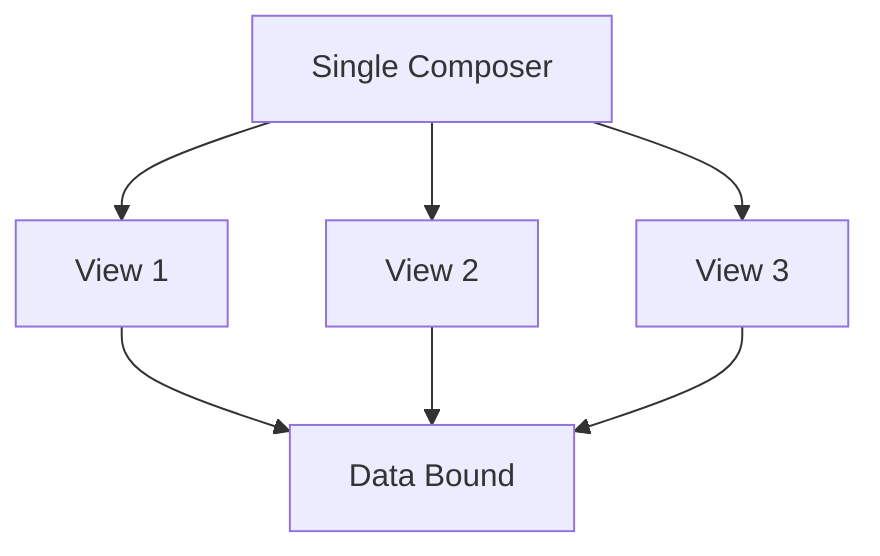

### 10.4 Code Examples

**File:** `app/Providers/AppServiceProvider.php`
```php
<?php

namespace App\Providers;

use App\View\Composers\MultiComposer;
use Illuminate\Support\Facades\View;

class AppServiceProvider extends ServiceProvider
{
    /**
     * Bootstrap any application services.
     */
    public function boot(): void
    {
        // Attach composer to multiple views
        View::composer(
            ['profile', 'dashboard', 'settings'],
            MultiComposer::class
        );
        
        // Using wildcards
        View::composer('*', function ($view) {
            $view->with('globalVar', 'value');
        });
    }

    /**
     * Register any application services.
     */
    public function register(): void
    {
        //
    }
}
```

**File:** `app/View/Composers/MultiComposer.php`
```php
<?php

namespace App\View\Composers;

use Illuminate\View\View;
use App\Services\NotificationService;

class MultiComposer
{
    /**
     * Create a new composer instance.
     */
    public function __construct(
        protected NotificationService $notifications,
    ) {}

    /**
     * Bind data to the view.
     */
    public function compose(View $view): void
    {
        $user = auth()->user();
        
        $view->with('unreadCount', $this->notifications->getUnreadCount($user));
        $view->with('recentNotifications', $this->notifications->getRecent($user));
        $view->with('user', $user);
    }
}
```

### 10.5 Dependencies
- `App\View\Composers\*` - Composer class
- `Illuminate\Support\Facades\View` - View facade
- Multiple view templates

### 10.6 Best Practices
- Use for views that share common data requirements
- Ensure composer logic works for all attached views
- Test each view with the composer
- Document which views use which composers

---

## 11. View Creators

### 11.1 Overview
View "creators" are very similar to view composers; however, they are executed immediately after the view is instantiated instead of waiting until the view is about to render.

### 11.2 Technical Definition
View creators execute their logic right after the view instance is created, unlike composers which execute before rendering. This timing difference can be important for certain initialization tasks.

### 11.3 Visualization
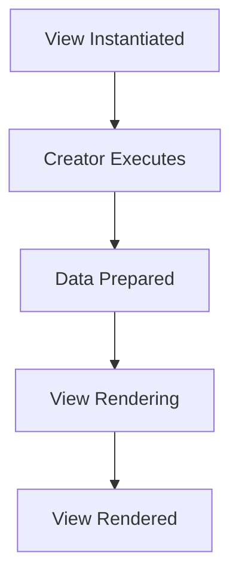

### 11.4 Code Examples

**File:** `app/Providers/AppServiceProvider.php`
```php
<?php

namespace App\Providers;

use App\View\Creators\ProfileCreator;
use Illuminate\Support\Facades\View;

class AppServiceProvider extends ServiceProvider
{
    /**
     * Bootstrap any application services.
     */
    public function boot(): void
    {
        // Register view creator
        View::creator('profile', ProfileCreator::class);
        
        // Using closure
        View::creator('dashboard', function ($view) {
            $view->with('initialized', true);
            $view->with('timestamp', now());
        });
    }

    /**
     * Register any application services.
     */
    public function register(): void
    {
        //
    }
}
```

**File:** `app/View/Creators/ProfileCreator.php`
```php
<?php

namespace App\View\Creators;

use Illuminate\View\View;

class ProfileCreator
{
    /**
     * Create a new profile creator instance.
     */
    public function __construct() {}

    /**
     * Bind data to the view.
     */
    public function create(View $view): void
    {
        // Execute immediately when view is instantiated
        $view->with('initialData', [
            'loadedAt' => now(),
            'cacheKey' => 'profile_' . auth()->id()
        ]);
        
        // Initialize view-specific services
        $view->with('formatter', new \App\Services\ProfileFormatter());
    }
}
```

### 11.5 Dependencies
- `App\View\Creators\*` - Creator classes
- `Illuminate\Support\Facades\View` - View facade
- Service provider for registration

### 11.6 Best Practices
- Use for initialization tasks that don't depend on other data
- Apply when you need early binding of view data
- Consider performance implications of early execution
- Use composers for data that requires other view data

---

## 12. Optimizing Views

### 12.1 Overview
By default, Blade template views are compiled on demand. When a request is executed that renders a view, Laravel will determine if a compiled version of the view exists. If the file exists, Laravel will then determine if the uncompiled view has been modified more recently than the compiled view.

### 12.2 Technical Definition
View compilation is the process of converting Blade templates into plain PHP code for faster execution. Laravel provides commands to precompile all views for improved performance in production environments.

### 12.3 Visualization
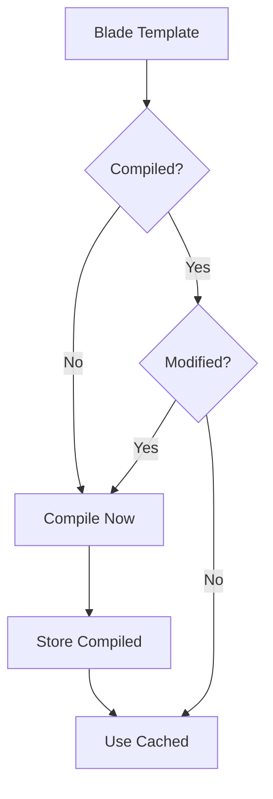

### 12.4 Code Examples

**Compiling views:**
```bash
# Precompile all views for better performance
php artisan view:cache

# Clear the view cache
php artisan view:clear
```

**File:** `app/Console/Commands/DeployCommand.php`
```php
<?php

namespace App\Console\Commands;

use Illuminate\Console\Command;

class DeployCommand extends Command
{
    /**
     * The name and signature of the console command.
     */
    protected $signature = 'deploy:optimize';
    
    /**
     * The console command description.
     */
    protected $description = 'Optimize application for deployment';

    /**
     * Execute the console command.
     */
    public function handle(): int
    {
        $this->call('config:cache');
        $this->call('route:cache');
        $this->call('view:cache');
        
        $this->info('Application optimized for deployment!');
        
        return 0;
    }
}
```

### 12.5 Dependencies
- `resources/views/` directory - Source blade templates
- `storage/framework/views/` directory - Compiled views storage
- Artisan commands for caching

### 12.6 Best Practices
- Run `view:cache` during deployment
- Clear cache when deploying updates
- Monitor performance improvements
- Test compiled views in staging environment

---

## 13. Best Practices

### 13.1 Overview
Best practices for working with Laravel views ensure maintainable, performant, and secure applications.

### 13.2 Technical Definition
Best practices encompass coding standards, performance optimizations, security considerations, and architectural patterns for effective view management.

### 13.3 Visualization
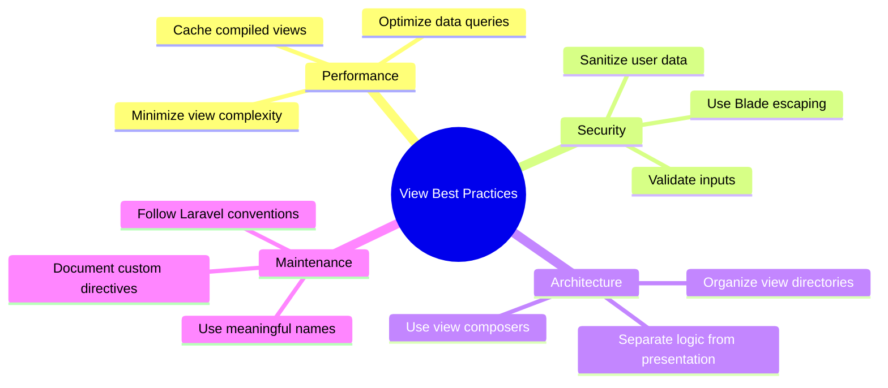

### 13.4 Code Examples

**Performance optimization:**
```php
// Use eager loading to avoid N+1 queries
$users = User::with(['posts', 'comments'])->paginate(15);

// Cache expensive queries in views
$sidebarStats = Cache::remember('sidebar_stats', 3600, function () {
    return [
        'totalUsers' => User::count(),
        'activePosts' => Post::where('published', true)->count(),
        'pendingReviews' => Review::where('approved', false)->count()
    ];
});
```

**Security considerations:**
```html
<!-- Blade automatically escapes variables -->
<h1>{{ $title }}</h1>

<!-- Use {!! !!} carefully for unescaped content -->
<div>{!! $trustedHtml !!}</div>

<!-- Sanitize user input before displaying -->
<p>{{ Str::limit($userInput, 100) }}</p>
```

### 13.5 Best Practices
- Use Blade directives for control structures
- Implement proper error handling
- Keep views lightweight and focused
- Use partials and components for reusable elements
- Follow consistent naming conventions
- Document complex view logic
- Test views with different data scenarios

---

## 14. Common Pitfalls

### 14.1 Overview
Common pitfalls when working with Laravel views can lead to performance issues, security vulnerabilities, and maintainability problems.

### 14.2 Technical Definition
Pitfalls are common mistakes or anti-patterns that developers encounter when working with views, often leading to inefficient code or security issues.

### 14.3 Visualization
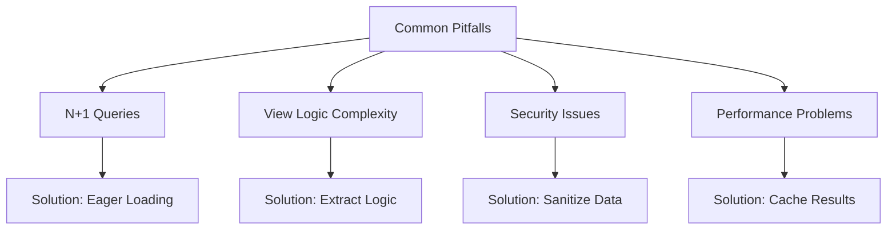

### 14.4 Code Examples

**N+1 Query Problem:**
```php
// Bad: Causes N+1 query problem
$posts = Post::all();
foreach ($posts as $post) {
    echo $post->author->name; // Loads author for each post
}

// Good: Use eager loading
$posts = Post::with('author')->get();
foreach ($posts as $post) {
    echo $post->author->name; // Author already loaded
}
```

**Complex View Logic:**
```php
// Bad: Complex logic in view
@if(count($users) > 0)
    @foreach($users as $user)
        @if($user->isActive() && $user->hasPermission('view_profile'))
            <div class="user">
                @if($user->isPremium())
                    <span class="premium-badge">Premium</span>
                @endif
                {{ $user->name }}
            </div>
        @endif
    @endforeach
@endif

// Good: Move logic to controller or service
@foreach($displayableUsers as $user)
    <div class="user">
        @if($user->is_premium)
            <span class="premium-badge">Premium</span>
        @endif
        {{ $user->name }}
    </div>
@endforeach
```

### 14.5 Common Pitfalls
- Placing business logic in views
- Forgetting to escape user data
- Not optimizing database queries
- Overcomplicating Blade templates
- Ignoring view performance
- Not using proper error handling
- Mixing concerns in view files
- Not following naming conventions

### 14.6 Solutions
- Extract complex logic to controllers/services
- Use view composers for shared data
- Implement proper caching strategies
- Follow separation of concerns principle
- Use components for reusable UI elements
- Test views with edge cases

---

## 15. Conclusion

### 15.1 Summary
Laravel views provide a powerful and flexible way to create the presentation layer of your application. By following best practices and understanding the various features available, you can create maintainable and efficient user interfaces.

### 15.2 Key Points
- Views separate presentation logic from business logic
- Blade templating engine provides powerful features
- View composers help manage shared data
- Proper optimization improves performance
- Security considerations are essential
- Following best practices ensures maintainability

### 15.3 Next Steps
- Explore Blade directives and components
- Learn about Inertia for full-stack applications
- Understand view caching strategies
- Master advanced Blade features
- Study security best practices for views