# 15. Blade Templates

## 1. Introduction

### 1.1 Overview
Blade is the simple, yet powerful templating engine that is included with Laravel. Unlike some PHP templating engines, Blade does not restrict you from using plain PHP code in your templates. In fact, all Blade templates are compiled into plain PHP code and cached until they are modified, meaning Blade adds essentially zero overhead to your application. Blade template files use the `.blade.php` file extension and are typically stored in the `resources/views` directory.

### 1.2 Technical Definition
Blade is Laravel's templating engine that provides a clean, readable syntax for creating HTML views. It extends PHP with additional template syntax and features like template inheritance, sections, and component-based architecture. Blade compiles templates into plain PHP code and caches them for performance.

### 1.3 Visualization
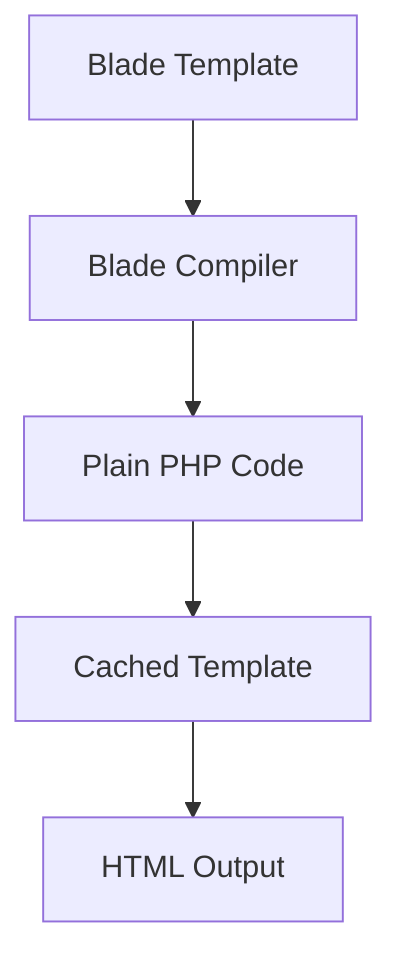
```mermaid
graph TD
    A[Blade Template] --> B[Blade Compiler]
    B --> C[Plain PHP Code]
    C --> D[Cached Template]
    D --> E[HTML Output]
```

### 1.4 Code Examples

**File:** `resources/views/greeting.blade.php`
```php
<!-- Blade template file -->
<html>
    <head>
        <title>Welcome</title>
    </head>
    <body>
        <h1>Hello, {{ $name }}!</h1>
    </body>
</html>
```

**File:** `routes/web.php`
```php
use Illuminate\Support\Facades\Route;

Route::get('/', function () {
    return view('greeting', ['name' => 'Samantha']);
});
```

### 1.5 Dependencies
- `resources/views/` directory - Storage location for Blade templates
- Laravel's view rendering system
- Blade compiler service
- Template inheritance features

### 1.6 Best Practices
- Use Blade's template inheritance for consistent layouts
- Keep templates clean and avoid complex logic
- Use Blade components for reusable UI elements
- Leverage Blade's security features (automatic escaping)
- Organize templates in subdirectories for complex applications

---

## 2. Displaying Data

### 2.1 Overview
You may display data that is passed to your Blade views by wrapping the variable in curly braces. Blade's `{{ }}` echo statements are automatically sent through PHP's `htmlspecialchars` function to prevent XSS attacks.

### 2.2 Technical Definition
Blade provides three main ways to display data: escaped output (`{{ }}`), unescaped output (`{!! !!}`), and conditional output with the `@isset` and `@empty` directives. The escaped output automatically sanitizes content to prevent XSS attacks.

### 2.3 Visualization
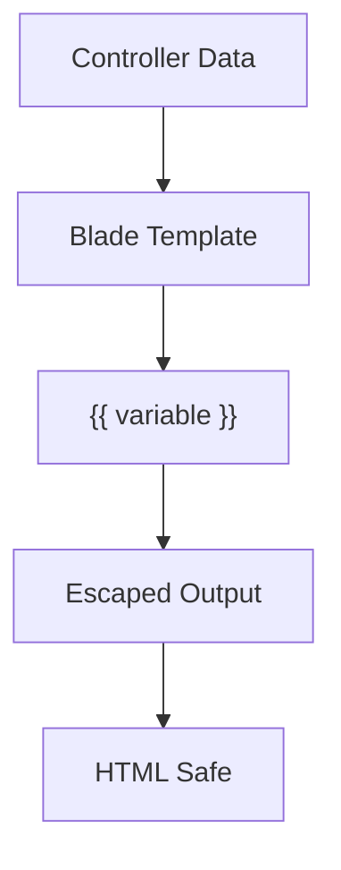
```mermaid
graph TD
    A[Controller Data] --> B[Blade Template]
    B --> C["{{ variable }}"]
    C --> D[Escaped Output]
    D --> E[HTML Safe]
```

### 2.4 Code Examples

**Displaying Simple Variables:**
```php
<!-- File: resources/views/welcome.blade.php -->
Hello, {{ $name }}.

<!-- With function calls -->
The current UNIX timestamp is {{ time() }}.

<!-- Displaying array/object properties -->
User email: {{ $user->email }}
Array value: {{ $items[0] }}
```

**File:** `routes/web.php`
```php
use Illuminate\Support\Facades\Route;

Route::get('/', function () {
    return view('welcome', [
        'name' => 'Samantha',
        'user' => User::first(),
        'items' => ['apple', 'banana']
    ]);
});
```

**Unescaped Data (Use with Caution):**
```php
<!-- File: resources/views/dangerous.blade.php -->
Hello, {!! $name !!}.

<!-- Note: Only use with trusted content to prevent XSS -->
```

### 2.5 Dependencies
- `Illuminate\View` - Laravel's view class
- `resources/views/` directory - Template storage
- PHP's `htmlspecialchars` function - For automatic escaping

### 2.6 Best Practices
- Always use `{{ }}` for user-generated content
- Only use `{!! !!}` for trusted HTML content
- Validate and sanitize data before passing to views
- Use Laravel's built-in security features

---

## 3. HTML Entity Encoding

### 3.1 Overview
By default, Blade (and the Laravel `e` function) will double encode HTML entities. If you would like to disable double encoding, call the `Blade::withoutDoubleEncoding` method from the `boot` method of your `AppServiceProvider`.

### 3.2 Technical Definition
HTML entity encoding in Blade ensures that special characters are properly converted to their HTML entities to prevent XSS attacks. Double encoding occurs when entities are encoded twice, which can cause display issues.

### 3.3 Visualization
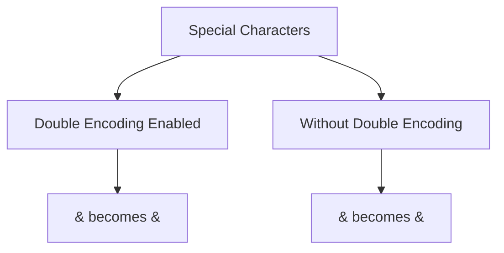
```mermaid
graph TD
    A[Special Characters] --> B[Double Encoding Enabled]
    B --> C[& becomes &amp;]
    A --> D[Without Double Encoding]
    D --> E[& becomes &]
```

### 3.4 Code Examples

**File:** `app/Providers/AppServiceProvider.php`
```php
<?php

namespace App\Providers;

use Illuminate\Support\Facades\Blade;
use Illuminate\Support\ServiceProvider;

class AppServiceProvider extends ServiceProvider
{
    /**
     * Bootstrap any application services.
     */
    public function boot(): void
    {
        // Disable double encoding of HTML entities
        Blade::withoutDoubleEncoding();
    }
}
```

**Example of the difference:**
```php
<!-- With double encoding (default) -->
{{ '<script>' }} <!-- Renders as: <script> -->

<!-- With double encoding disabled -->
{{ '<script>' }} <!-- Still renders safely as: <script> -->
```

### 3.5 Dependencies
- `App\Providers\AppServiceProvider` - Service provider class
- `Illuminate\Support\Facades\Blade` - Blade facade

### 3.6 Best Practices
- Leave double encoding enabled by default for security
- Only disable when specifically needed for content display
- Always validate user input before disabling encoding

---

## 4. Displaying Unescaped Data

### 4.1 Overview
By default, Blade `{{ }}` statements are automatically sent through PHP's `htmlspecialchars` function to prevent XSS attacks. If you do not want your data to be escaped, you may use the following syntax.

### 4.2 Technical Definition
Unescaped data display in Blade bypasses the automatic HTML entity encoding, allowing raw HTML to be rendered. This should be used with extreme caution as it can introduce XSS vulnerabilities if used with user-provided content.

### 4.3 Visualization
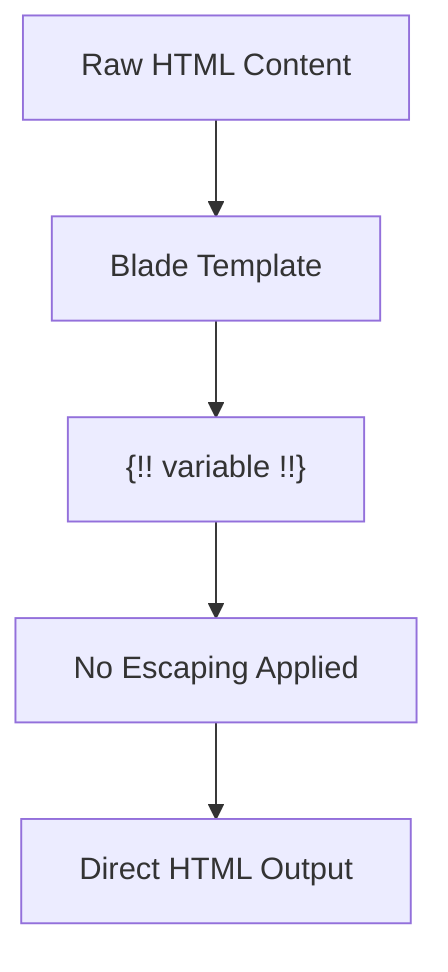
```mermaid
graph TD
    A[Raw HTML Content] --> B[Blade Template]
    B --> C["{!! variable !!}"]
    C --> D[No Escaping Applied]
    D --> E[Direct HTML Output]
```

### 4.4 Code Examples

**Safe Usage (Trusted Content):**
```php
<!-- File: resources/views/trusted.blade.php -->
<div class="content">
    {!! $trustedHtml !!}
</div>

<!-- Example with static content -->
{!! '<strong>Bold Text</strong>' !!}
```

**File:** `routes/web.php`
```php
use Illuminate\Support\Facades\Route;

Route::get('/trusted-content', function () {
    $trustedHtml = '<p>This is <strong>trusted</strong> HTML content.</p>';
    
    return view('trusted', ['trustedHtml' => $trustedHtml]);
});
```

**Dangerous Usage (User Content - DO NOT DO THIS):**
```php
<!-- NEVER do this with user input -->
{!! $userInput !!} <!-- XSS vulnerability! -->
```

### 4.5 Dependencies
- `resources/views/` directory - Template storage
- Raw HTML content to be displayed

### 4.6 Best Practices
- Never use `{!! !!}` with user-generated content
- Only use for trusted, sanitized HTML
- Validate and sanitize content before rendering
- Consider using HTML Purifier for user content

---

## 5. Blade and JavaScript Frameworks

### 5.1 Overview
Since many JavaScript frameworks also use "curly" braces to indicate a given expression should be displayed in the browser, you may use the `@` symbol to inform the Blade rendering engine an expression should remain untouched.

### 5.2 Technical Definition
Blade provides the `@` symbol to escape Blade directives when using JavaScript frameworks like Vue.js or Angular that also use curly braces. This prevents Blade from attempting to process JavaScript template expressions.

### 5.3 Visualization
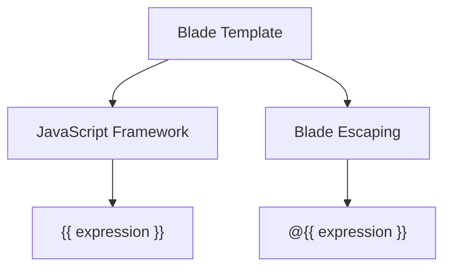
```mermaid
graph TD
    A[Blade Template] --> B[JavaScript Framework]
    B --> C["{{ expression }}"]
    A --> D[Blade Escaping]
    D --> E["@{{ expression }}"]
```

### 5.4 Code Examples

**Basic JavaScript Framework Integration:**
```php
<!-- File: resources/views/vue-app.blade.php -->
<h1>Laravel</h1>

<!-- This will be left untouched by Blade -->
Hello, @{{ name }}.

<!-- JavaScript framework will handle this -->
<div id="app">
    <p>User: {{ user.name }}</p>
    <p>Age: {{ user.age }}</p>
</div>
```

**Vue.js Example:**
```php
<!-- File: resources/views/vue-component.blade.php -->
<div id="app">
    <h1>@{{ title }}</h1>
    <p>@{{ message }}</p>
    
    <!-- Conditional rendering -->
    <div v-if="@{{ isVisible }}">
        @{{ conditionalText }}
    </div>
    
    <!-- Loop -->
    <ul>
        <li v-for="item in @{{ items }}">
            @{{ item.name }}
        </li>
    </ul>
</div>
```

**Escaping Blade Directives:**
```php
{{-- Blade template --}}
@@if()

<!-- HTML output -->
@if()
```

### 5.5 Dependencies
- JavaScript framework (Vue.js, React, Angular, etc.)
- Laravel's Blade templating engine
- Proper escaping of framework-specific syntax

### 5.6 Best Practices
- Use `@` symbol to escape JavaScript framework expressions
- Keep JavaScript logic separate from Blade logic
- Consider using Laravel's frontend scaffolding options
- Use components for complex JavaScript integrations

---

## 6. Rendering JSON

### 6.1 Overview
Sometimes you may pass an array to your view with the intention of rendering it as JSON in order to initialize a JavaScript variable. Laravel provides the `Js::from()` method for this purpose.

### 6.2 Technical Definition
The `Js::from()` method safely converts PHP arrays and objects to JSON strings that are properly escaped for inclusion in HTML attributes. It ensures that JSON content is properly formatted and secure for use in JavaScript contexts.

### 6.3 Visualization
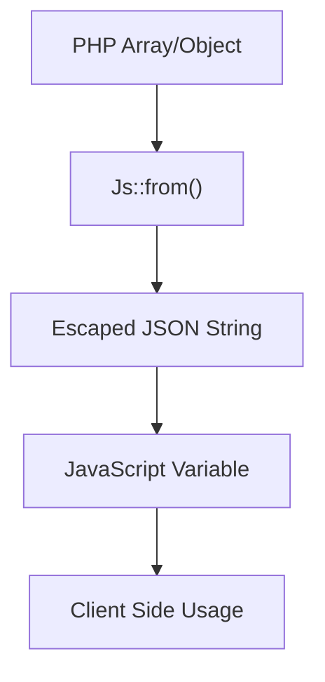
```mermaid
graph TD
    A["PHP Array/Object"] --> B["Js::from()"]
    B --> C[Escaped JSON String]
    C --> D[JavaScript Variable]
    D --> E[Client Side Usage]
```

### 6.4 Code Examples

**Basic JSON Rendering:**
```php
<!-- File: resources/views/json-example.blade.php -->
<script>
    // Using traditional approach (unsafe)
    var app1 = <?php echo json_encode($array); ?>;
    
    // Using Laravel's Js::from (safe and recommended)
    var app2 = {{ Js::from($array) }};
    
    // With the facade available
    var app3 = {{ Js::from($user->toArray()) }};
</script>
```

**File:** `routes/web.php`
```php
use Illuminate\Support\Facades\Route;

Route::get('/json-example', function () {
    $data = [
        'users' => User::all()->toArray(),
        'settings' => [
            'theme' => 'dark',
            'notifications' => true
        ]
    ];
    
    return view('json-example', ['array' => $data]);
});
```

**Advanced JSON Usage:**
```php
<!-- File: resources/views/advanced-json.blade.php -->
<script>
    // Initialize Vue app with server data
    const app = Vue.createApp({
        data() {
            return {
                users: {{ Js::from($users) }},
                currentUser: {{ Js::from(auth()->user()) }},
                config: {{ Js::from(config('app')) }}
            }
        }
    });
</script>
```

### 6.5 Dependencies
- `Illuminate\Support\Js` facade
- PHP's `json_encode` function
- Laravel's JSON escaping utilities

### 6.6 Best Practices
- Use `Js::from()` instead of `json_encode()` for security
- Only pass necessary data to JavaScript
- Avoid passing sensitive information to client-side
- Validate complex expressions before passing to Js::from()

---

## 7. The @verbatim Directive

### 7.1 Overview
If you are displaying JavaScript variables in a large portion of your template, you may wrap the HTML in the `@verbatim` directive so that you do not have to prefix each Blade echo statement with an `@` symbol.

### 7.2 Technical Definition
The `@verbatim` directive tells Blade to ignore all Blade syntax within its boundaries, treating the content as literal text. This is particularly useful when embedding JavaScript frameworks or large amounts of content with curly braces.

### 7.3 Visualization
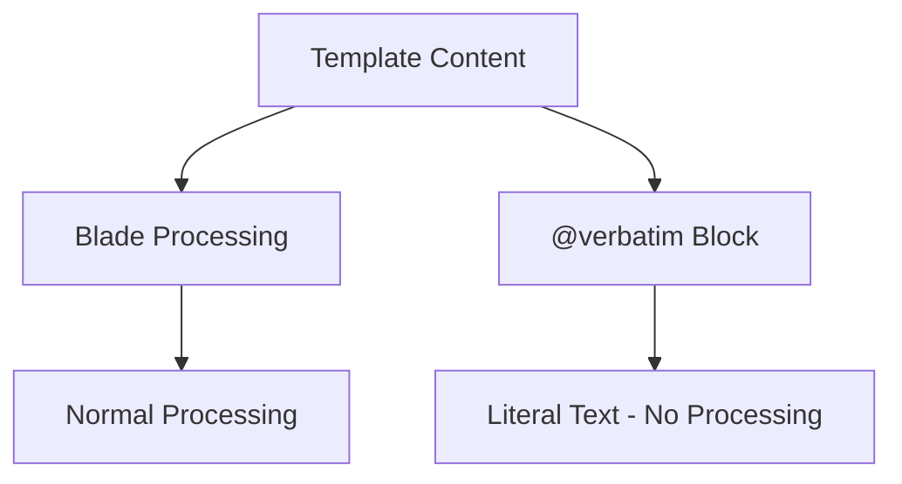
```mermaid
graph TD
    A[Template Content] --> B[Blade Processing]
    B --> C[Normal Processing]
    A --> D["@verbatim Block"]
    D --> E[Literal Text - No Processing]
```

### 7.4 Code Examples

**Basic Verbatim Usage:**
```php
<!-- File: resources/views/verbatim-example.blade.php -->
@verbatim
<div class="container">
    <h1>{{ title }}</h1>
    <p>Hello, {{ name }}!</p>
    
    <div v-if="showMessage">
        <span>{{ message }}</span>
    </div>
    
    <ul>
        <li v-for="item in items">
            {{ item.name }} - {{ item.value }}
        </li>
    </ul>
</div>
@endverbatim
```

**Mixed Content (Outside Verbatim):**
```php
<!-- File: resources/views/mixed-content.blade.php -->
<div class="header">
    <h1>{{ $pageTitle }}</h1> <!-- This is processed by Blade -->
</div>

@verbatim
<div id="vue-app">
    <p>These {{ braces }} are not processed by Blade</p>
    <p>But this content comes from Vue.js: {{ vueVariable }}</p>
</div>
@endverbatim

<div class="footer">
    <p>Copyright {{ date('Y') }}</p> <!-- This is processed by Blade -->
</div>
```

### 7.5 Dependencies
- Laravel's Blade templating engine
- Content with JavaScript framework syntax

### 7.6 Best Practices
- Use `@verbatim` for large blocks of JavaScript
- Keep verbatim blocks focused and organized
- Avoid nesting verbatim directives
- Use for JavaScript frameworks like Vue.js, Angular, etc.

---

## 8. Blade Directives

### 8.1 Overview
In addition to template inheritance and displaying data, Blade also provides convenient shortcuts for common PHP control structures, such as conditional statements and loops. These shortcuts provide a very clean, terse way of working with PHP control structures while also remaining familiar to their PHP counterparts.

### 8.2 Technical Definition
Blade directives are special syntax elements that compile to PHP control structures. They provide a cleaner, more readable way to write conditional logic, loops, and other control structures in Blade templates while maintaining PHP functionality.

### 8.3 Visualization
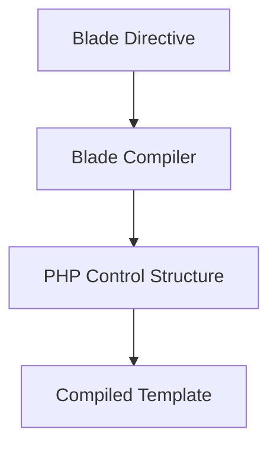
```mermaid
graph TD
    A[Blade Directive] --> B[Blade Compiler]
    B --> C[PHP Control Structure]
    C --> D[Compiled Template]
```

### 8.4 Code Examples

**List of Common Directives:**
- `@if`, `@elseif`, `@else`, `@endif` - Conditional statements
- `@unless`, `@endunless` - Inverse conditionals
- `@isset`, `@endisset` - Check if variable is set
- `@empty`, `@endempty` - Check if variable is empty
- `@for`, `@endfor` - For loops
- `@foreach`, `@endforeach` - Foreach loops
- `@while`, `@endwhile` - While loops
- `@switch`, `@case`, `@default`, `@endswitch` - Switch statements

**File:** `resources/views/directives-example.blade.php`
```php
@php
    // You can also use @php directive for PHP code
    $someVariable = 'Hello World';
@endphp

<!-- Conditional directives -->
@if (count($records) === 1)
    I have one record!
@elseif (count($records) > 1)
    I have multiple records!
@else
    I don't have any records!
@endif

<!-- Unless directive -->
@unless (Auth::check())
    You are not signed in.
@endunless

<!-- Loop directives -->
@for ($i = 0; $i < 10; $i++)
    <p>The current value is {{ $i }}</p>
@endfor

@foreach ($users as $user)
    <p>This is user {{ $user->id }}</p>
@endforeach

@forelse ($users as $user)
    <li>{{ $user->name }}</li>
@empty
    <p>No users</p>
@endforelse

@while (true)
    <p>I'm looping forever.</p>
    @break($counter > 5)
@endwhile
```

### 8.5 Dependencies
- Laravel's Blade templating engine
- PHP control structures functionality

### 8.6 Best Practices
- Use Blade directives for cleaner template code
- Keep complex logic in controllers or services
- Use appropriate directives for the situation
- Avoid nesting too many directives deeply

---

## 9. If Statements

### 9.1 Overview
You may construct if statements using the `@if`, `@elseif`, `@else`, and `@endif` directives. These directives function identically to their PHP counterparts but provide a cleaner syntax in Blade templates.

### 9.2 Technical Definition
Blade's if statement directives compile to standard PHP if statements while providing additional features like automatic variable checking and integration with Laravel's authentication system.

### 9.3 Visualization
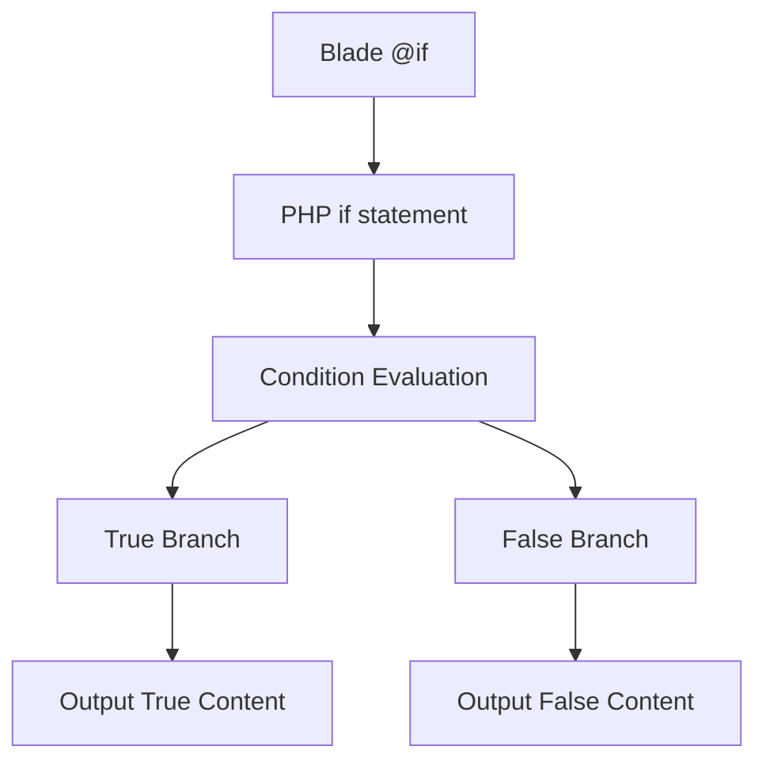
```mermaid
graph TD
    A[Blade @if] --> B[PHP if statement]
    B --> C[Condition Evaluation]
    C --> D[True Branch]
    C --> E[False Branch]
    D --> F[Output True Content]
    E --> G[Output False Content]
```

### 9.4 Code Examples

**Basic If Statement:**
```php
<!-- File: resources/views/if-example.blade.php -->
@if (count($records) === 1)
    <p>I have one record!</p>
@elseif (count($records) > 1)
    <p>I have multiple records!</p>
@else
    <p>I don't have any records!</p>
@endif
```

**Complex Conditions:**
```php
@if ($user->isAdmin() && $user->isActive())
    <div class="admin-panel">
        <h2>Admin Panel</h2>
        <p>Welcome, {{ $user->name }}!</p>
    </div>
@endif

@if ($order->status === 'pending' || $order->status === 'processing')
    <span class="status-pending">Order Processing</span>
@endif
```

**Nested If Statements:**
```php
@if ($user->isLoggedIn())
    <div class="user-content">
        @if ($user->hasPermission('edit'))
            <a href="/edit/{{ $item->id }}">Edit</a>
        @endif
        
        @if ($user->hasPermission('delete'))
            <a href="/delete/{{ $item->id }}">Delete</a>
        @endif
    </div>
@endif
```

### 9.5 Dependencies
- Laravel's Blade templating engine
- PHP's conditional logic

### 9.6 Best Practices
- Keep if statements simple and readable
- Use authentication directives when appropriate
- Consider using view composers for complex conditions
- Avoid deeply nested if statements

---

## 10. The @unless Directive

### 10.1 Overview
The `@unless` directive provides a convenient way to write "unless" conditional logic, which is essentially the opposite of an if statement. The content is displayed when the condition evaluates to false.

### 10.2 Technical Definition
The `@unless` directive is syntactic sugar for `@if (!condition)`. It executes the block when the provided condition is falsy, making the code more readable for negative conditions.

### 10.3 Visualization
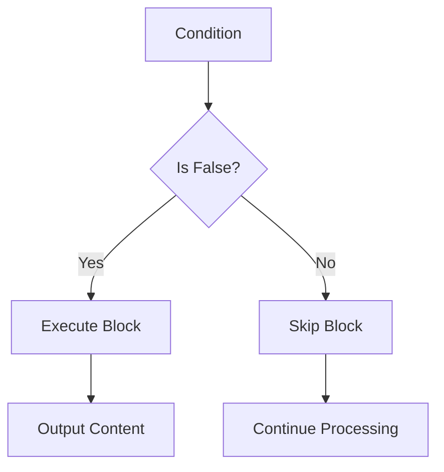
```mermaid
graph TD
    A[Condition] --> B{Is False?}
    B -->|Yes| C[Execute Block]
    B -->|No| D[Skip Block]
    C --> E[Output Content]
    D --> F[Continue Processing]
```

### 10.4 Code Examples

**Basic Unless Usage:**
```php
<!-- File: resources/views/unless-example.blade.php -->
@unless (Auth::check())
    <p>You are not signed in.</p>
@endunless

<!-- Equivalent to: -->
@if (!Auth::check())
    <p>You are not signed in.</p>
@endif
```

**Complex Unless Conditions:**
```php
@unless ($user->hasVerifiedEmail())
    <div class="alert alert-warning">
        Please verify your email address.
    </div>
@endunless

@unless ($order->isCompleted() || $order->isCancelled())
    <p>Order status: {{ $order->status }}</p>
@endunless
```

**Unless with Else:**
```php
@unless ($featureEnabled)
    <div class="feature-disabled">
        This feature is currently unavailable.
    </div>
@else
    <div class="feature-enabled">
        <!-- Feature content here -->
    </div>
@endunless
```

### 10.5 Dependencies
- Laravel's Blade templating engine
- PHP's logical operators

### 10.6 Best Practices
- Use `@unless` for negative conditions to improve readability
- Combine with authentication checks
- Use sparingly to avoid confusion
- Pair with `@else` when needed

---

## 11. Authentication Directives

### 11.1 Overview
The `@auth` and `@guest` directives may be used to quickly determine if the current user is authenticated or is a guest. These provide convenient shortcuts for checking authentication status in templates.

### 11.2 Technical Definition
Authentication directives in Blade provide quick ways to check if a user is authenticated (`@auth`) or not authenticated (`@guest`). They can also check specific authentication guards.

### 11.3 Visualization
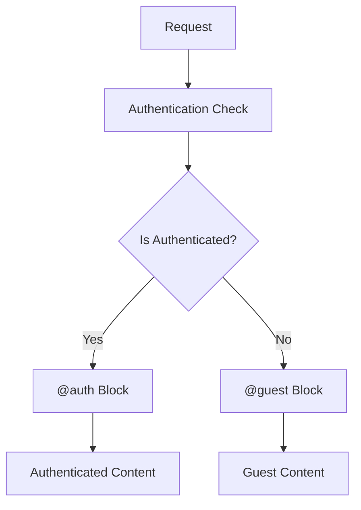
```mermaid
graph TD
    A[Request] --> B[Authentication Check]
    B --> C{Is Authenticated?}
    C -->|Yes| D["@auth Block"]
    C -->|No| E["@guest Block"]
    D --> F[Authenticated Content]
    E --> G[Guest Content]
```

### 11.4 Code Examples

**Basic Authentication Checks:**
```php
<!-- File: resources/views/auth-example.blade.php -->
@auth
    <p>The user is authenticated.</p>
    <p>Welcome back, {{ Auth::user()->name }}!</p>
@endauth

@guest
    <p>The user is not authenticated.</p>
    <a href="/login">Please login</a>
@endguest
```

**Specific Guard Authentication:**
```php
@auth('admin')
    <p>The user is authenticated as an admin.</p>
    <a href="/admin/dashboard">Admin Dashboard</a>
@endauth

@guest('admin')
    <p>Admin access required.</p>
    <a href="/admin/login">Login as admin</a>
@endguest
```

**Combining with Other Directives:**
```php
@auth
    <nav class="user-nav">
        <a href="/profile">Profile</a>
        <a href="/settings">Settings</a>
        <a href="/logout">Logout</a>
    </nav>
@else
    <nav class="guest-nav">
        <a href="/login">Login</a>
        <a href="/register">Register</a>
    </nav>
@endauth
```

### 11.5 Dependencies
- Laravel's authentication system
- `Illuminate\Support\Facades\Auth` facade

### 11.6 Best Practices
- Use authentication directives for simple checks
- Combine with other directives for complex logic
- Check specific guards when using multiple authentication systems
- Use for navigation and user-specific content

---

## 12. Environment Directives

### 12.1 Overview
You may check if the application is running in the production environment using the `@production` directive, or determine if the application is running in a specific environment using the `@env` directive.

### 12.2 Technical Definition
Environment directives allow you to conditionally render content based on the current Laravel environment. This is useful for showing/hiding development tools, analytics code, or environment-specific features.

### 12.3 Visualization
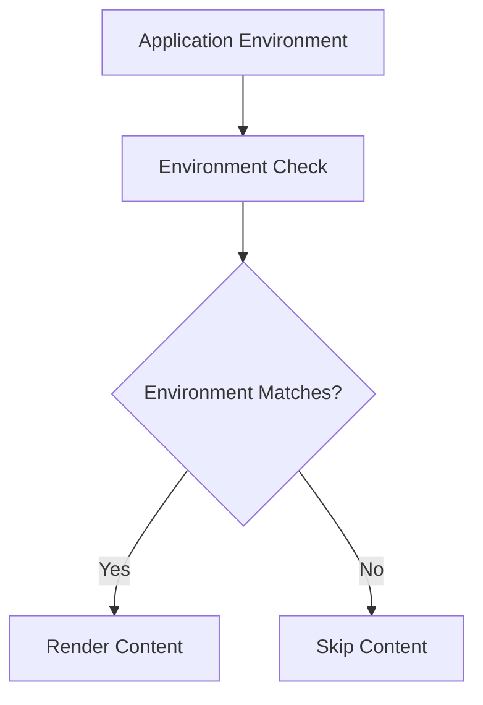
```mermaid
graph TD
    A[Application Environment] --> B[Environment Check]
    B --> C{Environment Matches?}
    C -->|Yes| D[Render Content]
    C -->|No| E[Skip Content]
```

### 12.4 Code Examples

**Production Environment Check:**
```php
<!-- File: resources/views/environment-example.blade.php -->
@production
    <!-- Production specific content -->
    <script async src="https://analytics.example.com/script.js"></script>
    <div class="prod-only">This shows in production only</div>
@endproduction

@development
    <!-- Development specific content -->
    <div class="dev-debug">Debug info: {{ $debugInfo }}</div>
@enddevelopment
```

**Specific Environment Check:**
```php
@env('staging')
    <div class="staging-banner">
        STAGING ENVIRONMENT - Data may not be real
    </div>
@endenv

@env(['staging', 'production'])
    <!-- Content shown in staging OR production -->
    <script src="/js/production.min.js"></script>
@endenv
```

**Complex Environment Logic:**
```php
@unless (app()->environment('local'))
    <!-- Google Analytics - not on local -->
    <script async src="https://www.googletagmanager.com/gtag/js?id=GA_TRACKING_ID"></script>
@endunless

@if (app()->environment('local', 'staging'))
    <!-- Debug toolbar for dev environments -->
    <div id="debug-toolbar">Debug Info</div>
@endif
```

### 12.5 Dependencies
- Laravel's environment configuration
- `APP_ENV` environment variable

### 12.6 Best Practices
- Use environment checks for analytics and debugging tools
- Avoid showing sensitive information in wrong environments
- Use for environment-specific features and tools
- Keep environment-specific code organized

---

## 13. Section Directives

### 13.1 Overview
You may determine if a template inheritance section has content using the `@hasSection` directive. This allows you to conditionally render content based on whether a section has been defined.

### 13.2 Technical Definition
Section directives in Blade allow you to check if specific sections have been defined in child templates, enabling conditional rendering of layout elements based on section content availability.

### 13.3 Visualization
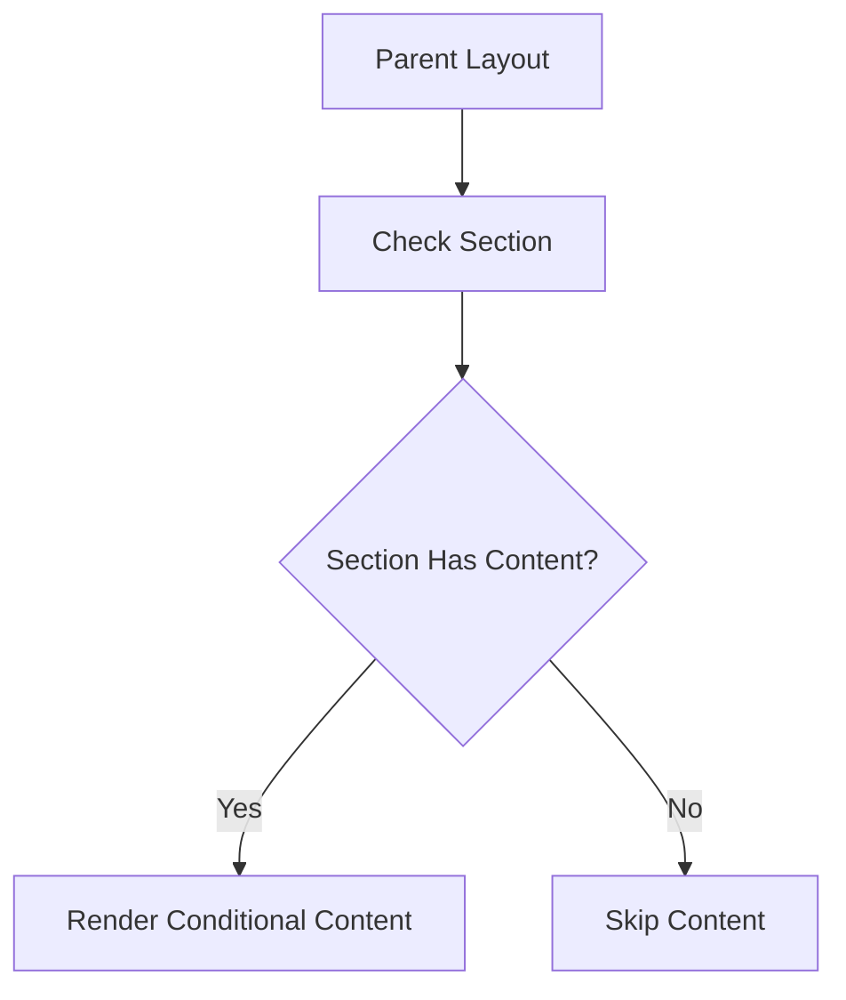
```mermaid
graph TD
    A[Parent Layout] --> B[Check Section]
    B --> C{Section Has Content?}
    C -->|Yes| D[Render Conditional Content]
    C -->|No| E[Skip Content]
```

### 13.4 Code Examples

**Checking if Section Has Content:**
```php
<!-- File: resources/views/layouts/app.blade.php -->
<!DOCTYPE html>
<html>
<head>
    <title>@yield('title', 'Default Title')</title>
    
    @hasSection('meta')
        @yield('meta')
    @else
        <meta name="description" content="Default description">
    @endif
</head>
<body>
    @hasSection('navigation')
        <div class="pull-right">
            @yield('navigation')
        </div>
        <div class="clearfix"></div>
    @endif
    
    <main>
        @yield('content')
    </main>
</body>
</html>
```

**Child Template:**
```php
<!-- File: resources/views/pages/home.blade.php -->
@extends('layouts.app')

@section('title', 'Home Page')

@section('navigation')
    <a href="/dashboard">Dashboard</a>
    <a href="/profile">Profile</a>
@endsection

@section('content')
    <h1>Welcome Home</h1>
@endsection
```

**Section Missing Check:**
```php
@sectionMissing('navigation')
    <div class="pull-right">
        @include('default-navigation')
    </div>
@endif
```

### 13.5 Dependencies
- Laravel's template inheritance system
- Section and yield directives
- Parent-child template relationships

### 13.6 Best Practices
- Use section checks for optional layout elements
- Provide fallbacks when sections are missing
- Keep section names consistent across templates
- Use for conditional sidebar, navigation, or header content

---

## 14. Session Directives

### 14.1 Overview
The `@session` directive may be used to determine if a session value exists. If the session value exists, the template contents within the `@session` and `@endsession` directives will be evaluated.

### 14.2 Technical Definition
The session directive provides a convenient way to check for and display session data in Blade templates, automatically handling the existence check and providing access to the session value.

### 14.3 Visualization
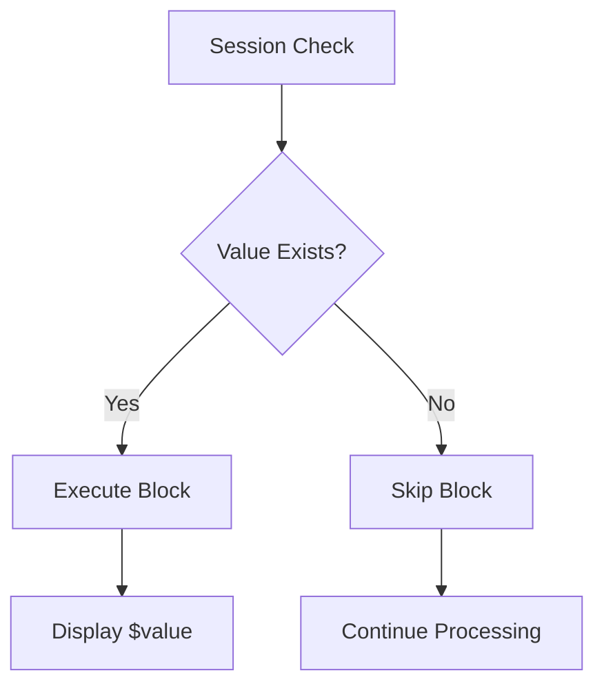
```mermaid
graph TD
    A[Session Check] --> B{Value Exists?}
    B -->|Yes| C[Execute Block]
    B -->|No| D[Skip Block]
    C --> E[Display $value]
    D --> F[Continue Processing]
```

### 14.4 Code Examples

**Basic Session Usage:**
```php
<!-- File: resources/views/session-example.blade.php -->
@session('status')
    <div class="alert alert-success">
        {{ $value }}
    </div>
@endsession

@session('error')
    <div class="alert alert-danger">
        {{ $value }}
    </div>
@endsession
```

**File:** `routes/web.php`
```php
use Illuminate\Support\Facades\Route;

Route::post('/submit-form', function () {
    // Process form...
    
    if ($validationFailed) {
        return redirect()->back()->withErrors(['message' => 'Validation failed']);
    }
    
    return redirect()->back()->with('status', 'Form submitted successfully!');
});
```

**Multiple Session Checks:**
```php
@session('success')
    <div class="alert alert-success">
        <strong>Success!</strong> {{ $value }}
    </div>
@endsession

@session('warning')
    <div class="alert alert-warning">
        <strong>Warning:</strong> {{ $value }}
    </div>
@endsession

@session('info')
    <div class="alert alert-info">
        <strong>Info:</strong> {{ $value }}
    </div>
@endsession
```

### 14.5 Dependencies
- Laravel's session system
- Session data availability
- Flash messaging functionality

### 14.6 Best Practices
- Use for displaying flash messages
- Keep session checks simple and focused
- Use appropriate alert classes for different message types
- Clear session data after displaying

---

## 15. Context Directives

### 15.1 Overview
The `@context` directive may be used to determine if a context value exists. If the context value exists, the template contents within the `@context` and `@endcontext` directives will be evaluated.

### 15.2 Technical Definition
Context directives allow you to check for and display contextual data that may be passed to templates through various means, providing conditional rendering based on context availability.

### 15.3 Visualization
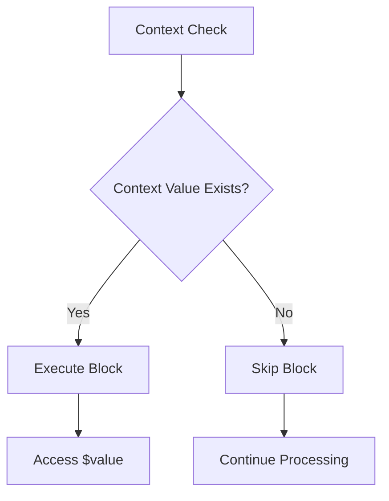
```mermaid
graph TD
    A[Context Check] --> B{Context Value Exists?}
    B -->|Yes| C[Execute Block]
    B -->|No| D[Skip Block]
    C --> E[Access $value]
    D --> F[Continue Processing]
```

### 15.4 Code Examples

**Basic Context Usage:**
```php
<!-- File: resources/views/context-example.blade.php -->
@context('canonical')
    <link href="{{ $value }}" rel="canonical">
@endcontext

@context('og_title')
    <meta property="og:title" content="{{ $value }}">
@endcontext

@context('twitter_card')
    <meta name="twitter:card" content="{{ $value }}">
@endcontext
```

**File:** `app/Http/Controllers/PageController.php`
```php
<?php

namespace App\Http\Controllers;

use Illuminate\Http\Request;
use Illuminate\View\View;

class PageController extends Controller
{
    public function show(Request $request): View
    {
        $context = [
            'canonical' => 'https://example.com/page',
            'og_title' => 'Page Title',
            'twitter_card' => 'summary_large_image'
        ];
        
        return view('pages.show', $context);
    }
}
```

**Complex Context Handling:**
```php
@context('structured_data')
    <script type="application/ld+json">
        {{ $value }}
    </script>
@endcontext

@context('json_ld_schema')
    <script type="application/ld+json">
        {!! $value !!}
    </script>
@endcontext
```

### 15.5 Dependencies
- Context data passed to templates
- Laravel's view rendering system
- Context-aware template logic

### 15.6 Best Practices
- Use for SEO-related contextual data
- Keep context values structured and consistent
- Use for meta tags and structured data
- Validate context data before rendering

---

## 16. Switch Statements

### 16.1 Overview
Switch statements can be constructed using the `@switch`, `@case`, `@break`, `@default` and `@endswitch` directives. This provides a clean syntax for handling multiple conditional cases.

### 16.2 Technical Definition
Blade switch statements compile to PHP switch statements, providing a readable way to handle multiple conditional cases in templates with proper break handling.

### 16.3 Visualization
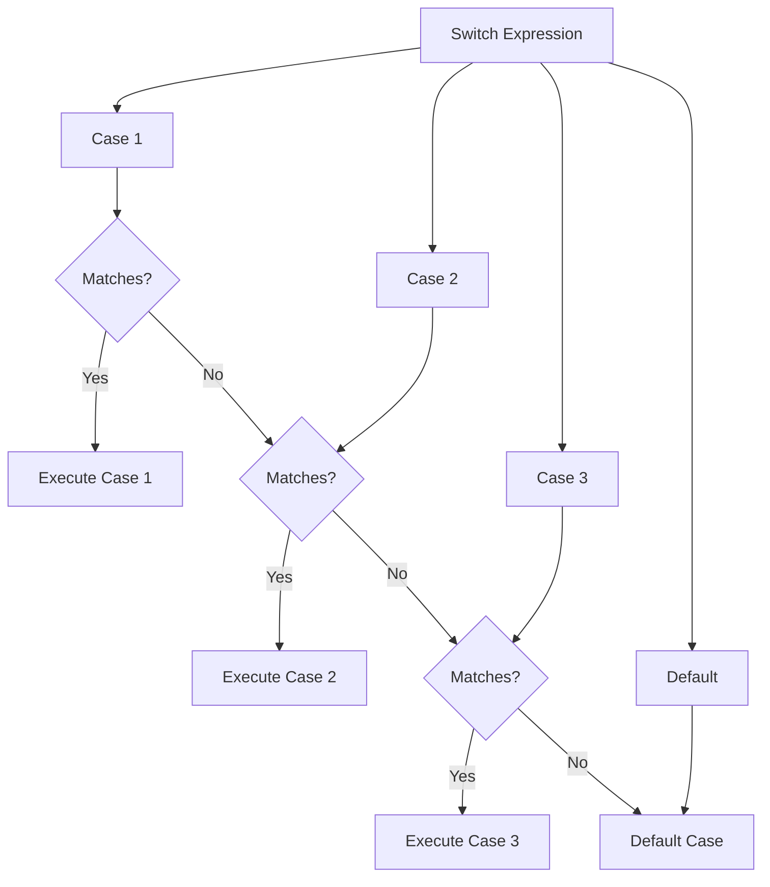
```mermaid
graph TD
    A[Switch Expression] --> B[Case 1]
    A --> C[Case 2]
    A --> D[Case 3]
    A --> E[Default]
    B --> F{Matches?}
    C --> G{Matches?}
    D --> H{Matches?}
    E --> I[Default Case]
    F -->|Yes| J[Execute Case 1]
    G -->|Yes| K[Execute Case 2]
    H -->|Yes| L[Execute Case 3]
    F -->|No| G
    G -->|No| H
    H -->|No| I
```

### 16.4 Code Examples

**Basic Switch Statement:**
```php
<!-- File: resources/views/switch-example.blade.php -->
@switch($i)
    @case(1)
        First case...
        @break

    @case(2)
        Second case...
        @break

    @case(3)
        Third case...
        @break

    @default
        Default case...
@endswitch
```

**Switch with Multiple Cases:**
```php
@switch($status)
    @case('pending')
    @case('processing')
        <span class="badge badge-warning">Processing</span>
        @break

    @case('completed')
        <span class="badge badge-success">Completed</span>
        @break

    @case('cancelled')
    @case('failed')
        <span class="badge badge-danger">Failed</span>
        @break

    @default
        <span class="badge badge-secondary">Unknown</span>
@endswitch
```

**Switch with Content:**
```php
@switch($user->role)
    @case('admin')
        <div class="admin-controls">
            <a href="/admin/users">Manage Users</a>
            <a href="/admin/settings">Settings</a>
        </div>
        @break

    @case('editor')
        <div class="editor-controls">
            <a href="/editor/content">Edit Content</a>
        </div>
        @break

    @case('subscriber')
        <div class="subscriber-content">
            <a href="/dashboard">My Dashboard</a>
        </div>
        @break

    @default
        <div class="basic-content">
            <a href="/account">My Account</a>
        </div>
@endswitch
```

### 16.5 Dependencies
- Laravel's Blade templating engine
- PHP switch statement functionality

### 16.6 Best Practices
- Use switch statements for multiple related conditions
- Always include `@break` statements
- Use `@default` for fallback cases
- Keep cases simple and focused

---

## 17. Loops

### 17.1 Overview
In addition to conditional statements, Blade provides simple directives for working with PHP's loop structures. These directives function identically to their PHP counterparts but provide a cleaner syntax in Blade templates.

### 17.2 Technical Definition
Blade loop directives provide syntactic sugar for PHP's loop constructs (`for`, `foreach`, `while`) with additional features like the `$loop` variable that provides useful information about the current iteration.

### 17.3 Visualization
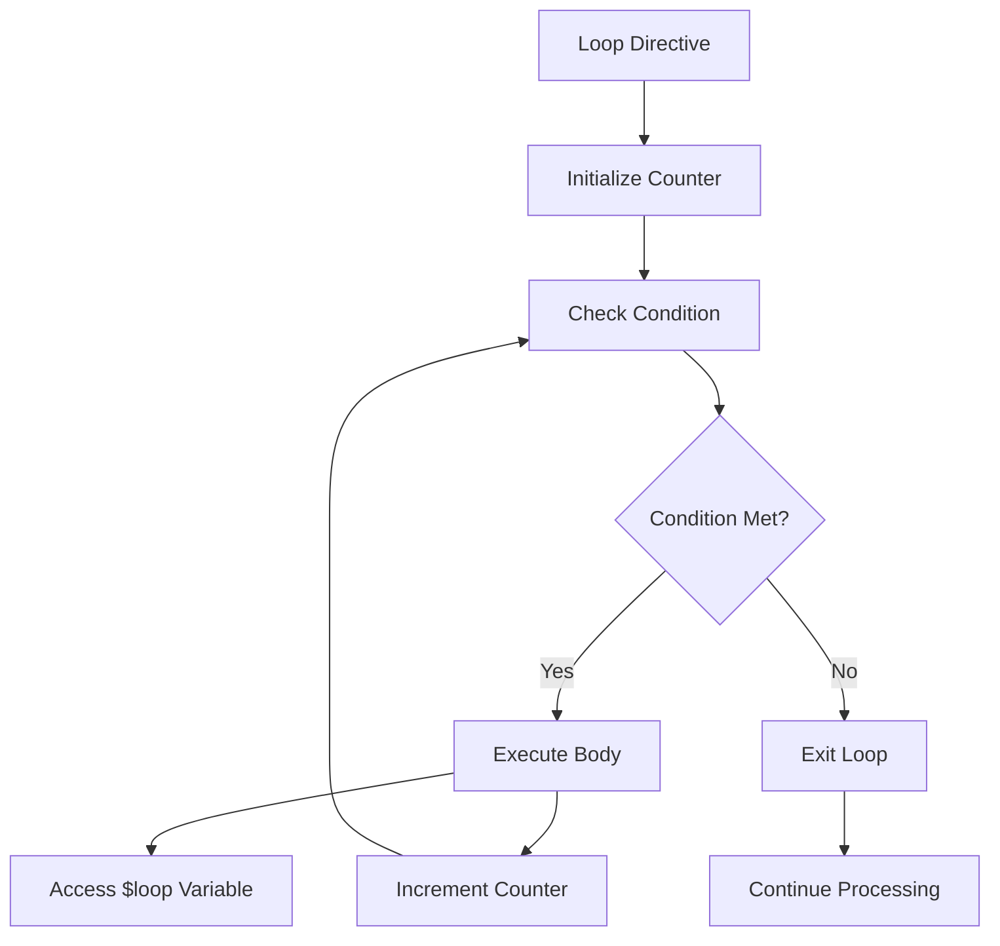
```mermaid
graph TD
    A[Loop Directive] --> B[Initialize Counter]
    B --> C[Check Condition]
    C --> D{Condition Met?}
    D -->|Yes| E[Execute Body]
    D -->|No| F[Exit Loop]
    E --> G[Increment Counter]
    G --> C
    E --> H[Access $loop Variable]
    F --> I[Continue Processing]
```

### 17.4 Code Examples

**For Loop:**
```php
<!-- File: resources/views/loops-example.blade.php -->
@for ($i = 0; $i < 10; $i++)
    <p>The current value is {{ $i }}</p>
@endfor
```

**Foreach Loop:**
```php
@foreach ($users as $user)
    <p>This is user {{ $user->id }}</p>
@endforeach

<!-- With $loop variable -->
@foreach ($users as $user)
    @if ($loop->first)
        <p>This is the first iteration.</p>
    @endif
    
    <p>User {{ $user->name }}</p>
    
    @if ($loop->last)
        <p>This is the last iteration.</p>
    @endif
@endforeach
```

**Forelse Loop:**
```php
@forelse ($users as $user)
    <li>{{ $user->name }}</li>
@empty
    <p>No users</p>
@endforelse
```

**While Loop:**
```php
@php
    $counter = 0;
@endphp

@while ($counter < 5)
    <p>Counter: {{ $counter }}</p>
    @php
        $counter++;
    @endphp
@endwhile
```

### 17.5 Dependencies
- Laravel's Blade templating engine
- PHP loop constructs
- Loop variable functionality

### 17.6 Best Practices
- Use appropriate loop type for the situation
- Leverage the `$loop` variable for iteration information
- Use `@forelse` for arrays that might be empty
- Keep loop bodies simple and readable

---

## 18. The Loop Variable

### 18.1 Overview
While iterating through a `foreach` loop, a `$loop` variable will be available inside of your loop. This variable provides access to some useful bits of information such as the current loop index and whether this is the first or last iteration through the loop.

### 18.2 Technical Definition
The `$loop` variable is automatically available in all Blade loop constructs and provides metadata about the current iteration, including index, count, first/last indicators, and nesting depth.

### 18.3 Visualization
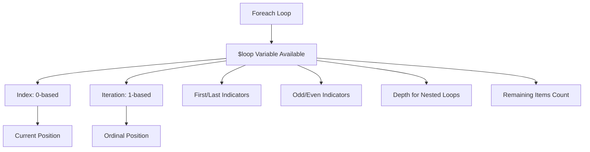
```mermaid
graph TD
    A[Foreach Loop] --> B[$loop Variable Available]
    B --> C[Index: 0-based]
    B --> D[Iteration: 1-based]
    B --> E[First/Last Indicators]
    B --> F[Odd/Even Indicators]
    B --> G[Depth for Nested Loops]
    B --> H[Remaining Items Count]
    C --> I[Current Position]
    D --> J[Ordinal Position]
```

### 18.4 Code Examples

**Basic Loop Variable Usage:**
```php
<!-- File: resources/views/loop-variable.blade.php -->
@foreach ($users as $user)
    @if ($loop->first)
        <div class="first-user">
    @endif

    <p>{{ $loop->iteration }} - {{ $user->name }}</p>

    @if ($loop->last)
        <span class="total-users">(Total: {{ $loop->count }} users)</span>
        </div>
    @endif
@endforeach
```

**Loop Variable Properties:**
```php
@foreach ($users as $user)
    <div class="user-item 
        @if ($loop->first) first @endif
        @if ($loop->last) last @endif
        @if ($loop->even) even @endif
        @if ($loop->odd) odd @endif">
        
        <span class="position">{{ $loop->index }} / {{ $loop->iteration }}</span>
        <span class="user-name">{{ $user->name }}</span>
        <span class="remaining">{{ $loop->remaining }} left</span>
    </div>
@endforeach
```

**Nested Loop Example:**
```php
@foreach ($users as $user)
    <div class="user">
        <h3>{{ $user->name }} (Loop Level: {{ $loop->depth }})</h3>
        
        @foreach ($user->posts as $post)
            <div class="post">
                <p>Post: {{ $post->title }}</p>
                
                @if ($loop->parent->first)
                    <span>This is the first user's first post</span>
                @endif
            </div>
        @endforeach
    </div>
@endforeach
```

**Loop Variable Properties Table:**
```php
@foreach ($items as $item)
    <pre>
Property: Value
$loop->index: {{ $loop->index }} (0-based index)
$loop->iteration: {{ $loop->iteration }} (1-based iteration)
$loop->remaining: {{ $loop->remaining }} (items remaining)
$loop->count: {{ $loop->count }} (total items)
$loop->first: {{ $loop->first ? 'true' : 'false' }}
$loop->last: {{ $loop->last ? 'true' : 'false' }}
$loop->even: {{ $loop->even ? 'true' : 'false' }}
$loop->odd: {{ $loop->odd ? 'true' : 'false' }}
$loop->depth: {{ $loop->depth }} (nesting level)
$loop->parent: {{ $loop->parent ? 'available' : 'none' }}
    </pre>
@endforeach
```

### 18.5 Dependencies
- Laravel's Blade templating engine
- Foreach loop constructs
- Loop metadata functionality

### 18.6 Best Practices
- Use `$loop->first` and `$loop->last` for special styling
- Leverage `$loop->iteration` for numbering
- Use `$loop->depth` in nested loops
- Consider `$loop->remaining` for progress indicators

---

## 19. Conditional Classes & Styles

### 19.1 Overview
The `@class` directive conditionally compiles a CSS class string. The directive accepts an array of classes where the array key contains the class or classes you wish to add, while the value is a boolean expression.

### 19.2 Technical Definition
The `@class` directive provides a convenient way to conditionally apply CSS classes to HTML elements based on boolean expressions, simplifying class management in templates.

### 19.3 Visualization
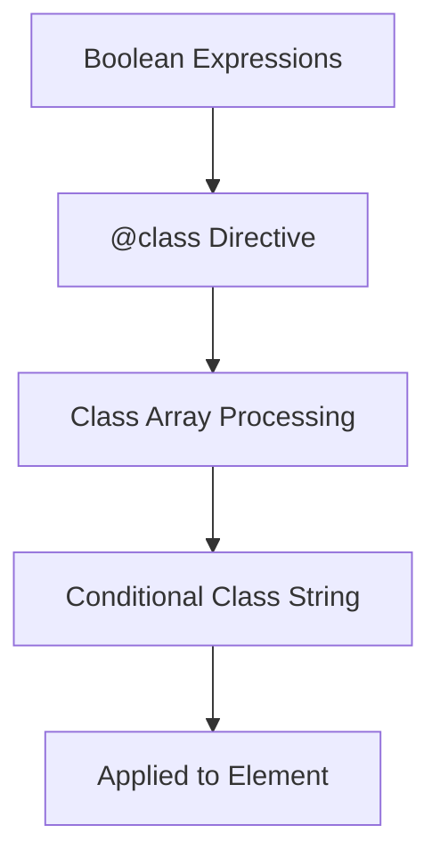
```mermaid
graph TD
    A[Boolean Expressions] --> B["@class Directive"]
    B --> C[Class Array Processing]
    C --> D[Conditional Class String]
    D --> E[Applied to Element]
```

### 19.4 Code Examples

**Basic Conditional Classes:**
```php
<!-- File: resources/views/conditional-classes.blade.php -->
@php
    $isActive = false;
    $hasError = true;
@endphp

<span @class([
    'p-4',
    'font-bold' => $isActive,
    'text-gray-500' => ! $isActive,
    'bg-red' => $hasError,
])></span>

<!-- Output: <span class="p-4 text-gray-500 bg-red"></span> -->
```

**Complex Conditional Classes:**
```php
<div @class([
    'card' => true,
    'card-large' => $size === 'large',
    'card-medium' => $size === 'medium',
    'card-small' => $size === 'small',
    'card-active' => $isActive,
    'card-disabled' => ! $isEnabled,
    'shadow-lg' => $hasShadow,
    'rounded-full' => $isRounded,
])>
    Card content
</div>
```

**Using the @style Directive:**
```php
@php
    $isActive = true;
    $backgroundColor = 'blue';
@endphp

<span @style([
    'background-color: red',
    'font-weight: bold' => $isActive,
    "color: {$backgroundColor}" => $hasColor,
])></span>

<!-- Output: <span style="background-color: red; font-weight: bold;"></span> -->
```

**Dynamic Classes from Arrays:**
```php
@php
    $userClasses = [
        'font-bold' => $user->isVip(),
        'text-blue' => $user->isActive(),
        'opacity-50' => ! $user->isOnline(),
    ];
@endphp

<div @class($userClasses)>
    User profile
</div>
```

### 19.5 Dependencies
- Laravel's Blade templating engine
- PHP array functionality
- CSS class management

### 19.6 Best Practices
- Use `@class` for complex conditional styling
- Keep class arrays organized and readable
- Combine with other directives for advanced logic
- Use for responsive and state-based styling

---

## 20. Additional Attributes

### 20.1 Overview
Blade provides convenient directives for adding common HTML attributes like `checked`, `selected`, `disabled`, `readonly`, and `required` based on boolean conditions.

### 20.2 Technical Definition
Additional attribute directives in Blade provide syntactic sugar for commonly used HTML boolean attributes, automatically adding or removing the attribute based on a condition.

### 20.3 Visualization
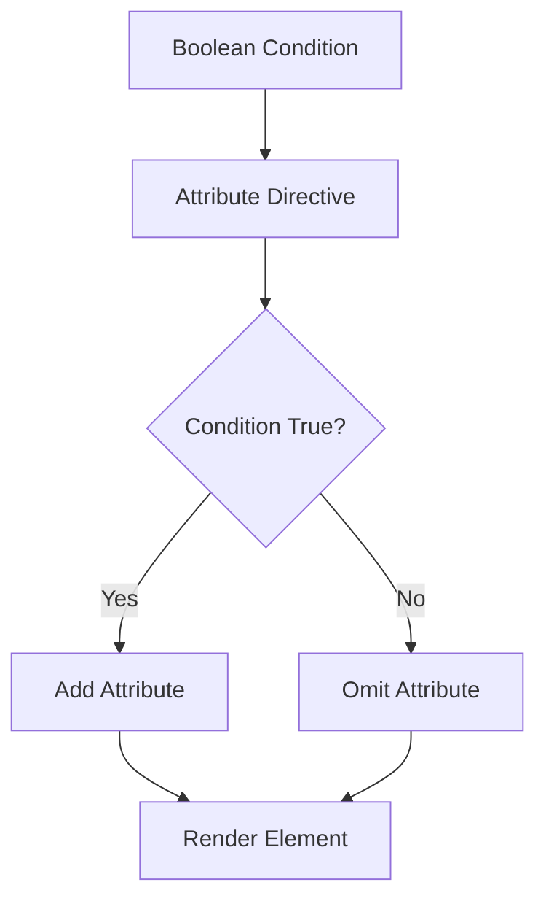
```mermaid
graph TD
    A[Boolean Condition] --> B[Attribute Directive]
    B --> C{Condition True?}
    C -->|Yes| D[Add Attribute]
    C -->|No| E[Omit Attribute]
    D --> F[Render Element]
    E --> F
```

### 20.4 Code Examples

**Checked Attribute:**
```php
<!-- File: resources/views/additional-attributes.blade.php -->
<input
    type="checkbox"
    name="active"
    value="active"
    @checked(old('active', $user->active))
/>

<!-- Multiple checkboxes -->
@foreach ($permissions as $permission)
    <label>
        <input
            type="checkbox"
            name="permissions[]"
            value="{{ $permission->id }}"
            @checked(in_array($permission->id, old('selected_permissions', $user->permissions->pluck('id')->toArray())))
        />
        {{ $permission->name }}
    </label>
@endforeach
```

**Selected Attribute:**
```php
<select name="version">
    @foreach ($product->versions as $version)
        <option value="{{ $version }}" @selected(old('version') == $version)>
            {{ $version }}
        </option>
    @endforeach
</select>
```

**Disabled Attribute:**
```php
<button type="submit" @disabled($errors->isNotEmpty())>
    Submit
</button>

<input type="text" @disabled(! $user->canEdit()) />

<!-- Multiple conditions -->
<div @disabled($formDisabled || $user->isBanned())>
    Restricted content
</div>
```

**Readonly Attribute:**
```php
<input
    type="email"
    name="email"
    value="{{ $user->email }}"
    @readonly($user->isNotAdmin())
/>

<!-- Textarea -->
<textarea @readonly($contentLocked)>{{ $content }}</textarea>
```

**Required Attribute:**
```php
<input
    type="text"
    name="title"
    value="{{ old('title') }}"
    @required($user->isAdmin())
/>
```

### 20.5 Dependencies
- Laravel's Blade templating engine
- HTML form attributes
- Boolean condition evaluation

### 20.6 Best Practices
- Use attribute directives for cleaner HTML
- Combine with form validation states
- Use for accessibility enhancements
- Keep conditions simple and readable

---

## 21. Including Subviews

### 21.1 Overview
While you're free to use the `@include` directive, Blade components provide similar functionality and offer several benefits over the `@include` directive such as data and attribute binding.

### 21.2 Technical Definition
The `@include` directive allows you to include a Blade view from within another view, making it possible to create reusable partial views and organize your templates more effectively.

### 21.3 Visualization
```mermaid
graph TD
    A[Main Template] --> B["@include Directive"]
    B --> C[Subview Template]
    C --> D[Combine Data]
    D --> E[Integrated Output]
```

### 21.4 Code Examples

**Basic Include:**
```php
<!-- File: resources/views/master.blade.php -->
<div>
    @include('shared.errors')
    
    <form>
        <!-- Form Contents -->
    </form>
</div>

<!-- File: resources/views/shared/errors.blade.php -->
@if ($errors->any())
    <div class="alert alert-danger">
        <ul>
            @foreach ($errors->all() as $error)
                <li>{{ $error }}</li>
            @endforeach
        </ul>
    </div>
@endif
```

**Include with Data:**
```php
@include('view.name', ['status' => 'complete'])

<!-- Include with multiple parameters -->
@include('user.card', [
    'user' => $user,
    'showActions' => true,
    'size' => 'large'
])
```

**Conditional Includes:**
```php
<!-- Include if view exists -->
@includeIf('view.name', ['status' => 'complete'])

<!-- Include when condition is true -->
@includeWhen($boolean, 'view.name', ['status' => 'complete'])

<!-- Include unless condition is true -->
@includeUnless($boolean, 'view.name', ['status' => 'complete'])

<!-- Include first available view -->
@includeFirst(['custom.admin', 'admin'], ['status' => 'complete'])
```

**Nested Includes:**
```php
<!-- File: resources/views/dashboard.blade.php -->
@extends('layouts.app')

@section('content')
    @include('partials.header', ['title' => 'Dashboard'])
    
    <div class="dashboard-content">
        @include('partials.sidebar')
        
        <main>
            @include('partials.stats', ['stats' => $dashboardStats])
        </main>
    </div>
    
    @include('partials.footer')
@endsection
```

### 21.5 Dependencies
- Laravel's view system
- Blade templating engine
- View file organization

### 21.6 Best Practices
- Use includes for reusable components
- Pass only necessary data to included views
- Use `@includeIf` for optional components
- Organize partials in dedicated directories

---

## 22. Rendering Views for Collections

### 22.1 Overview
You may combine loops and includes into one line with Blade's `@each` directive, which is perfect for rendering collections of items with consistent structure.

### 22.2 Technical Definition
The `@each` directive combines looping and including functionality, allowing you to render a view for each item in a collection with a single directive.

### 22.3 Visualization
```mermaid
graph TD
    A[Collection] --> B["@each Directive"]
    B --> C[Iterate Items]
    C --> D[Render View for Each Item]
    D --> E[Combined Output]
```

### 22.4 Code Examples

**Basic @each Usage:**
```php
<!-- File: resources/views/jobs-list.blade.php -->
@each('view.name', $jobs, 'job')

<!-- This is equivalent to -->
@foreach ($jobs as $job)
    @include('view.name', ['job' => $job])
@endforeach
```

**@each with Empty State:**
```php
<!-- Render with fallback for empty collections -->
@each('job.item', $jobs, 'job', 'job.empty')

<!-- File: resources/views/job/empty.blade.php -->
<div class="no-jobs">
    <p>No jobs found.</p>
</div>
```

**Real-world Example:**
```php
<!-- File: resources/views/products.blade.php -->
<div class="product-grid">
    @each('partials.product-card', $products, 'product', 'partials.no-products')
</div>

<!-- File: resources/views/partials/product-card.blade.php -->
<div class="product-card">
    image_url }}" alt="{{ $product->name }}">
    <h3>{{ $product->name }}</h3>
    <p class="price">${{ $product->price }}</p>
    <a href="/products/{{ $product->id }}" class="btn btn-primary">View Details</a>
</div>

<!-- File: resources/views/partials/no-products.blade.php -->
<div class="no-products">
    <p>No products available at the moment.</p>
</div>
```

**@each with Multiple Variables:**
```php
<!-- File: resources/views/user-list.blade.php -->
@each('partials.user-item', $users, 'user', 'partials.empty-state')

<!-- File: resources/views/partials/user-item.blade.php -->
<div class="user-item" data-user-id="{{ $user->id }}">
    avatar }}" alt="{{ $user->name }}" class="avatar">
    <div class="user-info">
        <h4>{{ $user->name }}</h4>
        <p>{{ $user->email }}</p>
    </div>
</div>
```

### 22.5 Dependencies
- Laravel's view system
- Collection data
- Blade templating engine

### 22.6 Best Practices
- Use `@each` for uniform collection rendering
- Provide empty state views for better UX
- Keep included views simple and focused
- Use for lists, grids, and repetitive content

---

## 23. The @once Directive

### 23.1 Overview
The `@once` directive allows you to define a portion of the template that will only be evaluated once per rendering cycle. This may be useful for pushing a given piece of JavaScript into the page's header using stacks.

### 23.2 Technical Definition
The `@once` directive ensures that a block of code is executed only once during the template rendering process, preventing duplicate content when the same template is rendered multiple times.

### 23.3 Visualization
```mermaid
graph TD
    A[Template Rendering] --> B[Encounter @once]
    B --> C{Already Executed?}
    C -->|No| D[Execute Block]
    C -->|Yes| E[Skip Block]
    D --> F[Mark as Executed]
    E --> G[Continue Rendering]
    F --> G
```

### 23.4 Code Examples

**Basic @once Usage:**
```php
<!-- File: resources/views/component.blade.php -->
@once
    @push('scripts')
        <script>
            // Custom JavaScript that should only run once
            console.log('Component JavaScript initialized');
            
            // Initialize component functionality
            document.addEventListener('DOMContentLoaded', function() {
                initializeComponent();
            });
        </script>
    @endpush
@endonce
```

**@pushOnce and @prependOnce:**
```php
<!-- More convenient alternatives -->
@pushOnce('scripts')
    <script src="/js/chart.js"></script>
@endPushOnce

@prependOnce('styles')
    <link rel="stylesheet" href="/css/component.css">
@endPrependOnce
```

**Using Unique Identifiers:**
```php
<!-- File: resources/views/charts/pie-chart.blade.php -->
@pushOnce('scripts', 'chart.js')
    <script src="/chart.js"></script>
@endPushOnce

<!-- File: resources/views/charts/line-chart.blade.php -->
@pushOnce('scripts', 'chart.js')  <!-- Will not be duplicated -->
    <script src="/chart.js"></script>
@endPushOnce
```

**Complex @once Example:**
```php
@once
    <style>
        .special-component {
            animation: fadeIn 0.5s ease-in;
        }
        
        @keyframes fadeIn {
            from { opacity: 0; }
            to { opacity: 1; }
        }
    </style>
    
    @push('head')
        <meta name="special-component-loaded" content="true">
    @endpush
@endonce
```

### 23.5 Dependencies
- Laravel's template rendering system
- Blade's stack functionality
- Rendering context tracking

### 23.6 Best Practices
- Use for scripts that should only run once
- Combine with `@pushOnce` for asset management
- Use unique identifiers to prevent conflicts
- Ideal for component-specific initialization

---

## 24. Raw PHP

### 24.1 Overview
In some situations, it's useful to embed PHP code directly into your views. You can use the Blade `@php` directive to execute a block of plain PHP within your template.

### 24.2 Technical Definition
The `@php` directive allows you to execute raw PHP code within Blade templates, providing access to the full PHP language when Blade's syntax isn't sufficient for complex logic.

### 24.3 Visualization
```mermaid
graph TD
    A[Blade Template] --> B["@php Directive"]
    B --> C[Execute PHP Code]
    C --> D[Return to Blade Processing]
```

### 24.4 Code Examples

**Basic @php Usage:**
```php
<!-- File: resources/views/raw-php.blade.php -->
@php
    $counter = 1;
    $users = User::where('active', true)->get();
    $isAdmin = auth()->check() && auth()->user()->isAdmin();
@endphp

@if ($isAdmin)
    <div class="admin-section">
        @php
            $adminStats = [
                'users' => User::count(),
                'posts' => Post::count(),
                'comments' => Comment::count()
            ];
        @endphp
        
        <h2>Admin Dashboard</h2>
        <ul>
            @foreach ($adminStats as $stat => $value)
                <li>{{ ucfirst($stat) }}: {{ $value }}</li>
            @endforeach
        </ul>
    </div>
@endif
```

**@use Directive for Imports:**
```php
@use('App\Models\Flight')

<!-- With alias -->
@use('App\Models\Flight', 'FlightModel')

<!-- Grouped imports -->
@use('App\Models\{Flight, Airport}')

<!-- Import functions -->
@use(function App\Helpers\format_currency)

<!-- Import constants -->
@use(const App\Constants\MAX_ATTEMPTS)
```

**Complex Logic in @php:**
```php
@php
    // Complex calculations
    $totalRevenue = 0;
    foreach ($orders as $order) {
        $totalRevenue += $order->calculateRevenue();
    }
    
    // Data transformation
    $groupedProducts = collect($products)->groupBy('category');
    
    // Conditional logic
    $recommendedProducts = $user->isVip() 
        ? $premiumRecommendations 
        : $standardRecommendations;
    
    // Initialize variables for template
    $showAdvancedOptions = $user->can('advanced_features');
@endphp

<div class="summary">
    <p>Total Revenue: ${{ number_format($totalRevenue, 2) }}</p>
    
    @if ($showAdvancedOptions)
        <div class="advanced-options">
            <!-- Advanced features here -->
        </div>
    @endif
</div>
```

### 24.5 Dependencies
- Laravel's Blade templating engine
- PHP interpreter
- Imported classes/functions/constants

### 24.6 Best Practices
- Use sparingly, prefer controllers for complex logic
- Keep PHP blocks short and focused
- Use for initialization and simple calculations
- Consider moving complex logic to service classes

---

## 25. Comments

### 25.1 Overview
Blade also allows you to define comments in your views. However, unlike HTML comments, Blade comments are not included in the HTML returned by your application.

### 25.2 Technical Definition
Blade comments are completely removed during the template compilation process and do not appear in the final rendered HTML, making them safe for leaving notes and documentation in templates.

### 25.3 Visualization
```mermaid
graph TD
    A[Blade Template with Comments] --> B[Blade Compiler]
    B --> C[Comments Removed]
    C --> D[Clean HTML Output]
```

### 25.4 Code Examples

**Basic Comments:**
```php
<!-- File: resources/views/comments-example.blade.php -->
{{-- This comment will not be present in the rendered HTML --}}
<div class="content">
    {{-- TODO: Implement user preferences --}}
    <h1>{{ $title }}</h1>
    
    {{-- Temporary debugging info --}}
    {{-- Current user: {{ $user->name }} --}}
</div>

{{-- 
    Multi-line comments are also supported
    This block will be completely removed
    from the final output
--}}
```

**Commenting Out Code:**
```php
<div class="layout">
    <header>
        {{-- 
        <nav>
            <a href="/old-page">Old Page</a>
            <a href="/deprecated">Deprecated Link</a>
        </nav> 
        --}}
        
        <nav>
            <a href="/home">Home</a>
            <a href="/about">About</a>
        </nav>
    </header>
    
    <main>
        {{-- Temporarily disabled feature --}}
        {{-- 
        @include('partials.feature-section')
        --}}
        
        @yield('content')
    </main>
</div>
```

**Documentation Comments:**
```php
{{-- 
    Template: User Profile Page
    Purpose: Display user information and activity
    Variables: 
        - $user: User model instance
        - $posts: User's recent posts collection
        - $stats: User statistics array
--}}
@extends('layouts.app')

@section('content')
    <div class="profile-container">
        {{-- User avatar and basic info --}}
        <div class="profile-header">
            avatar }}" alt="Avatar">
            <h1>{{ $user->name }}</h1>
        </div>
        
        {{-- Activity feed --}}
        <div class="activity-feed">
            @foreach ($posts as $post)
                {{-- Post item with engagement metrics --}}
                <div class="post-item">
                    <h3>{{ $post->title }}</h3>
                    <p>Likes: {{ $post->likes_count }}</p>
                </div>
            @endforeach
        </div>
    </div>
@endsection
```

### 25.5 Dependencies
- Laravel's Blade templating engine
- Comment parsing functionality

### 25.6 Best Practices
- Use for documentation and temporary notes
- Don't use for hiding content from users (use `@if` instead)
- Keep comments concise and relevant
- Use for explaining complex template logic

---

## 26. Components

### 26.1 Overview
Components and slots provide similar benefits to sections, layouts, and includes; however, some may find the mental model of components and slots easier to understand. There are two approaches to writing components: class-based components and anonymous components.

### 26.2 Technical Definition
Blade components are reusable UI elements that can accept data and provide slots for content insertion. They offer a more structured approach to creating reusable template elements compared to includes.

### 26.3 Visualization
```mermaid
graph TD
    A[Component Usage] --> B[Component Class/View]
    B --> C[Process Attributes]
    C --> D[Fill Slots]
    D --> E[Render Output]
```

### 26.4 Code Examples

**Creating a Component:**
```bash
# Create a class-based component
php artisan make:component Alert

# Create a component in a subdirectory
php artisan make:component Forms/Input
```

**File:** `app/View/Components/Alert.php`
```php
<?php

namespace App\View\Components;

use Illuminate\View\Component;
use Illuminate\View\View;

class Alert extends Component
{
    public function __construct(
        public string $type = 'info',
        public string $message,
    ) {}

    public function render(): View
    {
        return view('components.alert');
    }
}
```

**File:** `resources/views/components/alert.blade.php`
```php
<div class="alert alert-{{ $type }}">
    {{ $message }}
</div>
```

**Using Components:**
```php
<!-- File: resources/views/pages/example.blade.php -->
<x-alert type="error" :message="$errorMessage" />

<!-- With slots -->
<x-alert type="success" :message="$successMessage">
    <p>Additional content can go here</p>
    <button>Dismiss</button>
</x-alert>

<!-- Anonymous component -->
<x-modal title="Confirmation">
    <p>Are you sure you want to proceed?</p>
    <x-slot name="footer">
        <button class="btn btn-primary">Confirm</button>
        <button class="btn btn-secondary">Cancel</button>
    </x-slot>
</x-modal>
```

**Component with Slots:**
```php
<!-- File: resources/views/components/card.blade.php -->
<div class="card">
    <div class="card-header">
        {{ $header ?? $title }}
    </div>
    
    <div class="card-body">
        {{ $slot }}
    </div>
    
    @isset($footer)
        <div class="card-footer">
            {{ $footer }}
        </div>
    @endisset
</div>

<!-- Usage -->
<x-card title="User Profile">
    <p>User information goes here...</p>
    <x-slot name="footer">
        <a href="/edit">Edit Profile</a>
    </x-slot>
</x-card>
```

### 26.5 Dependencies
- `app/View/Components/` directory - Component classes
- `resources/views/components/` directory - Component views
- Laravel's component discovery system

### 26.6 Best Practices
- Use components for reusable UI elements
- Keep component logic simple
- Use slots for flexible content
- Follow naming conventions (PascalCase for components)

---

## 27. Passing Data to Components

### 27.1 Overview
You may pass data to Blade components using HTML attributes. Hard-coded, primitive values may be passed to the component using simple HTML attribute strings. PHP expressions and variables should be passed to the component via attributes that use the `:` character as a prefix.

### 27.2 Technical Definition
Component data passing allows you to provide information to components through attributes, with automatic type conversion and public property exposure for easy access within the component.

### 27.3 Visualization
```mermaid
graph TD
    A[Component Tag] --> B[Attribute Processing]
    B --> C[Data Conversion]
    C --> D[Property Assignment]
    D --> E[Component Access]
```

### 27.4 Code Examples

**Basic Data Passing:**
```php
<!-- File: resources/views/pages/components.blade.php -->
<x-alert type="error" :message="$errorMessage" />

<x-user-card 
    name="John Doe" 
    :email="$user->email" 
    :age="25" 
    :is-admin="true" 
/>

<!-- Short attribute syntax -->
<x-profile :$userId :$name />
<!-- Equivalent to: -->
<x-profile :user-id="$userId" :name="$name" />
```

**Component Class with Constructor:**
```php
<!-- File: app/View/Components/UserCard.php -->
<?php

namespace App\View\Components;

use App\Models\User;
use Illuminate\View\Component;
use Illuminate\View\View;

class UserCard extends Component
{
    public function __construct(
        public string $name,
        public string $email,
        public int $age,
        public bool $isAdmin = false,
        public ?User $user = null,
    ) {}

    public function render(): View
    {
        return view('components.user-card');
    }
}
```

**Component View:**
```php
<!-- File: resources/views/components/user-card.blade.php -->
<div class="user-card {{ $isAdmin ? 'admin-card' : '' }}">
    <h3>{{ $name }}</h3>
    <p>Email: {{ $email }}</p>
    <p>Age: {{ $age }}</p>
    
    @if ($isAdmin)
        <span class="badge">Administrator</span>
    @endif
    
    @if ($user)
        <p>User ID: {{ $user->id }}</p>
    @endif
</div>
```

**Complex Data Passing:**
```php
<x-product-card
    :product="$product"
    :reviews="$product->reviews"
    :is-favorite="$user->hasFavorited($product)"
    category="{{ $product->category->name }}"
    :metadata="[
        'created' => $product->created_at,
        'updated' => $product->updated_at,
        'tags' => $product->tags->pluck('name')->toArray()
    ]"
/>
```

**Conditional Data:**
```php
<x-data-table
    :items="$items"
    :columns="$tableColumns"
    :sortable="true"
    :filterable="auth()->user()?->can('filter')"
    :editable="auth()->user()?->can('edit')"
/>
```

### 27.5 Dependencies
- Component class with public properties
- Data to be passed to the component
- Laravel's attribute binding system

### 27.6 Best Practices
- Use `:` prefix for variables and expressions
- Use camelCase for attribute names (converted to kebab-case)
- Keep component constructors focused
- Use short attribute syntax when possible

---

## 28. Component Methods

### 28.1 Overview
In addition to public variables being available to your component template, any public methods on the component may be invoked from the component's template.

### 28.2 Technical Definition
Component methods allow you to define additional functionality within component classes that can be called from the component's template, extending the component's capabilities beyond simple data display.

### 28.3 Visualization
```mermaid
graph TD
    A[Component Template] --> B[Call Method]
    B --> C[Component Class]
    C --> D[Execute Method]
    D --> E[Return Result]
    E --> A
```

### 28.4 Code Examples

**Component with Methods:**
```php
<!-- File: app/View/Components/Select.php -->
<?php

namespace App\View\Components;

use Illuminate\View\Component;
use Illuminate\View\View;

class Select extends Component
{
    public function __construct(
        public string $name,
        public array $options,
        public ?string $selected = null,
    ) {}

    /**
     * Determine if the given option is selected.
     */
    public function isSelected(string $option): bool
    {
        return $option === $this->selected;
    }

    /**
     * Get the CSS class for the select element.
     */
    public function getCssClass(): string
    {
        $classes = ['form-select'];
        
        if ($this->isSelected('')) {
            $classes[] = 'placeholder-selected';
        }
        
        return implode(' ', $classes);
    }

    public function render(): View
    {
        return view('components.select');
    }
}
```

**Component Template:**
```php
<!-- File: resources/views/components/select.blade.php -->
<select name="{{ $name }}" class="{{ $getCssClass() }}">
    @foreach ($options as $value => $label)
        <option 
            value="{{ $value }}" 
            {{ $isSelected($value) ? 'selected' : '' }}
        >
            {{ $label }}
        </option>
    @endforeach
</select>
```

**Usage:**
```php
<!-- File: resources/views/pages/form.blade.php -->
<x-select 
    name="country"
    :options="$countries"
    :selected="$user->country"
/>
```

**Advanced Component Methods:**
```php
<!-- File: app/View/Components/DashboardWidget.php -->
<?php

namespace App\View\Components;

use Illuminate\View\Component;
use Illuminate\View\View;

class DashboardWidget extends Component
{
    public function __construct(
        public string $type,
        public array $data,
        public bool $collapsible = true,
        public bool $refreshable = true,
    ) {}

    public function getTitle(): string
    {
        return match($this->type) {
            'sales' => 'Sales Report',
            'users' => 'User Statistics', 
            'revenue' => 'Revenue Overview',
            default => 'Dashboard Widget'
        };
    }

    public function getIcon(): string
    {
        return match($this->type) {
            'sales' => 'fas fa-chart-line',
            'users' => 'fas fa-users',
            'revenue' => 'fas fa-dollar-sign',
            default => 'fas fa-chart-bar'
        };
    }

    public function hasData(): bool
    {
        return !empty($this->data);
    }

    public function getFormattedData(): array
    {
        return array_map(function($item) {
            return is_numeric($item) ? number_format($item) : $item;
        }, $this->data);
    }

    public function render(): View
    {
        return view('components.dashboard-widget');
    }
}
```

**Template Using Methods:**
```php
<!-- File: resources/views/components/dashboard-widget.blade.php -->
<div class="widget {{ $type }}-widget">
    <header class="widget-header">
        <i class="{{ $getIcon() }}"></i>
        <h3>{{ $getTitle() }}</h3>
        
        @if ($refreshable)
            <button class="refresh-btn" wire:click="refresh">Refresh</button>
        @endif
    </header>
    
    <div class="widget-content">
        @if ($hasData())
            <ul>
                @foreach ($getFormattedData() as $key => $value)
                    <li>{{ $key }}: {{ $value }}</li>
                @endforeach
            </ul>
        @else
            <p>No data available</p>
        @endif
    </div>
    
    @if ($collapsible)
        <footer class="widget-footer">
            <button class="toggle-btn">Show More</button>
        </footer>
    @endif
</div>
```

### 28.5 Dependencies
- Component class with public methods
- Component template access to methods
- Laravel's method invocation system

### 28.6 Best Practices
- Keep component methods focused on presentation logic
- Use methods for complex conditional logic
- Don't put heavy business logic in components
- Document public methods clearly

---

## 29. Accessing Attributes and Slots Within Component Classes

### 29.1 Overview
Blade components allow you to access the component name, attributes, and slot inside the class's render method. This provides powerful flexibility for dynamic component behavior.

### 29.2 Technical Definition
Components can access their attributes, slot content, and component name by returning a closure from the render method, allowing for dynamic template generation and attribute manipulation.

### 29.3 Visualization
```mermaid
graph TD
    A[Component Instantiation] --> B[Collect Attributes]
    B --> C[Capture Slot Content]
    C --> D[Pass to Render Closure]
    D --> E[Dynamic Template Generation]
    E --> F[Final Output]
```

### 29.4 Code Examples

**Basic Attribute Access:**
```php
<!-- File: app/View/Components/DynamicElement.php -->
<?php

namespace App\View\Components;

use Illuminate\View\Component;
use Illuminate\View\View;
use Closure;

class DynamicElement extends Component
{
    public function render(): Closure
    {
        return function (array $data) {
            // Access component name
            $componentName = $data['componentName']; // 'dynamic-element'
            
            // Access all attributes
            $attributes = $data['attributes'];
            
            // Access slot content
            $slot = $data['slot'];
            
            // Build dynamic class string
            $classList = ['element'];
            if ($attributes->has('variant')) {
                $classList[] = 'element-' . $attributes->get('variant');
            }
            if ($attributes->has('size')) {
                $classList[] = 'element-' . $attributes->get('size');
            }
            
            $classString = implode(' ', $classList);
            
            return "<div {$attributes->class($classString)}>{$slot}</div>";
        };
    }
}
```

**Usage:**
```php
<!-- File: resources/views/pages/elements.blade.php -->
<x-dynamic-element variant="primary" size="large" class="extra-class">
    <p>This content goes in the slot</p>
</x-dynamic-element>
```

**Advanced Attribute Manipulation:**
```php
<!-- File: app/View/Components/SmartButton.php -->
<?php

namespace App\View\Components;

use Illuminate\View\Component;
use Closure;

class SmartButton extends Component
{
    public function render(): Closure
    {
        return function (array $data) {
            $attributes = $data['attributes'];
            $slot = $data['slot'];
            
            // Add default classes
            $classList = ['btn'];
            
            // Determine button type
            $type = $attributes->get('type', 'button');
            $classList[] = 'btn-' . $attributes->get('variant', 'primary');
            
            // Add size class
            if ($size = $attributes->get('size')) {
                $classList[] = 'btn-' . $size;
            }
            
            // Add active class if needed
            if ($attributes->has('active')) {
                $classList[] = 'active';
            }
            
            // Build final attributes
            $finalAttributes = $attributes
                ->class($classList)
                ->merge(['type' => $type]);
            
            return "<button {$finalAttributes}>{$slot}</button>";
        };
    }
}
```

**Slot Processing:**
```php
<!-- File: app/View/Components/WrappedContent.php -->
<?php

namespace App\View\Components;

use Illuminate\View\Component;
use Closure;
use Illuminate\Support\Str;

class WrappedContent extends Component
{
    public function render(): Closure
    {
        return function (array $data) {
            $attributes = $data['attributes'];
            $slot = $data['slot'];
            
            // Process slot content
            $processedSlot = $slot;
            
            if ($attributes->has('uppercase')) {
                $processedSlot = Str::upper($processedSlot);
            }
            
            if ($attributes->has('truncate') && is_numeric($attributes->get('truncate'))) {
                $processedSlot = Str::limit($processedSlot, $attributes->get('truncate'));
            }
            
            return "<div {$attributes}>{$processedSlot}</div>";
        };
    }
}
```

**Conditional Rendering Based on Attributes:**
```php
<!-- File: app/View/Components/ConditionalWrapper.php -->
<?php

namespace App\View\Components;

use Illuminate\View\Component;
use Closure;

class ConditionalWrapper extends Component
{
    public function render(): Closure
    {
        return function (array $data) {
            $attributes = $data['attributes'];
            $slot = $data['slot'];
            
            if ($attributes->has('condition') && ! $attributes->get('condition')) {
                return ''; // Don't render anything
            }
            
            $wrapper = $attributes->get('wrapper', 'div');
            
            return "<{$wrapper} {$attributes->except(['condition', 'wrapper'])}>{$slot}</{$wrapper}>";
        };
    }
}
```

### 29.5 Dependencies
- Component class with closure-based render method
- Laravel's attribute bag functionality
- Slot content capture system

### 29.6 Best Practices
- Use closure-based rendering for dynamic behavior
- Validate attribute content before using
- Be careful with direct HTML output
- Consider security implications of dynamic content

---

## 30. Additional Dependencies

### 30.1 Overview
If your component requires dependencies from Laravel's service container, you may list them before any of the component's data attributes and they will automatically be injected by the container.

### 30.2 Technical Definition
Component dependency injection allows you to leverage Laravel's service container to inject services, repositories, or other dependencies directly into your component's constructor, making complex components more manageable.

### 30.3 Visualization
```mermaid
graph TD
    A[Component Instantiation] --> B[Service Container]
    B --> C[Dependency Injection]
    C --> D[Component Constructor]
    D --> E[Component Ready]
```

### 30.4 Code Examples

**Component with Dependencies:**
```php
<!-- File: app/View/Components/UserActivityFeed.php -->
<?php

namespace App\View\Components;

use App\Models\User;
use App\Services\ActivityService;
use Illuminate\View\Component;
use Illuminate\View;

class UserActivityFeed extends Component
{
    public function __construct(
        protected ActivityService $activityService,
        public User $user,
        public int $limit = 10,
        public string $type = 'all',
    ) {}

    public function render(): View
    {
        return view('components.user-activity-feed');
    }
    
    public function getActivity()
    {
        return $this->activityService
            ->forUser($this->user)
            ->type($this->type)
            ->limit($this->limit)
            ->get();
    }
}
```

**Component Template:**
```php
<!-- File: resources/views/components/user-activity-feed.blade.php -->
<div class="activity-feed">
    <h3>Recent Activity</h3>
    
    <ul>
        @foreach ($getActivity() as $activity)
            <li class="activity-item">
                <span class="activity-icon">{!! $activity->icon !!}</span>
                <span class="activity-text">{{ $activity->description }}</span>
                <span class="activity-time">{{ $activity->created_at->diffForHumans() }}</span>
            </li>
        @endforeach
    </ul>
</div>
```

**Usage:**
```php
<!-- File: resources/views/pages/profile.blade.php -->
<x-user-activity-feed :user="$user" :limit="5" type="posts" />
```

**Multiple Dependencies:**
```php
<!-- File: app/View/Components/AdvancedDashboard.php -->
<?php

namespace App\View\Components;

use App\Services\AnalyticsService;
use App\Services\NotificationService;
use App\Services\UserPreferenceService;
use Illuminate\View\Component;
use Illuminate\View\View;

class AdvancedDashboard extends Component
{
    public function __construct(
        protected AnalyticsService $analytics,
        protected NotificationService $notifications,
        protected UserPreferenceService $preferences,
        public int $userId,
    ) {}

    public function render(): View
    {
        return view('components.advanced-dashboard');
    }
    
    public function getDashboardData()
    {
        $userPrefs = $this->preferences->getForUser($this->userId);
        $analyticsData = $this->analytics->getDashboardMetrics($this->userId);
        $notifications = $this->notifications->getUnreadForUser($this->userId);
        
        return [
            'preferences' => $userPrefs,
            'metrics' => $analyticsData,
            'alerts' => $notifications,
        ];
    }
}
```

**Service with Configuration:**
```php
<!-- File: app/View/Components/FeatureToggle.php -->
<?php

namespace App\View\Components;

use App\Services\FeatureFlagService;
use Illuminate\View\Component;
use Illuminate\View\View;

class FeatureToggle extends Component
{
    public function __construct(
        protected FeatureFlagService $featureFlags,
        public string $feature,
        public $fallback = null,
    ) {}

    public function render(): View
    {
        return view('components.feature-toggle');
    }
    
    public function isEnabled()
    {
        return $this->featureFlags->isEnabled($this->feature);
    }
    
    public function getContent()
    {
        return $this->isEnabled() ? $this->slot : $this->fallback;
    }
}
```

### 30.5 Dependencies
- Laravel's service container
- Dependency classes/services
- Component class with typed constructor parameters

### 30.6 Best Practices
- Inject only necessary dependencies
- Use interfaces for better testability
- Don't inject heavy services that aren't used
- Consider performance implications of dependencies

---

## 31. Hiding Attributes / Methods

### 31.1 Overview
If you would like to prevent some public methods or properties from being exposed as variables to your component template, you may add them to an `$except` array property on your component.

### 31.2 Technical Definition
The `$except` property in Blade components allows you to specify which public properties or methods should not be automatically made available to the component's template, keeping the template scope clean and secure.

### 31.3 Visualization
```mermaid
graph TD
    A[Component Properties] --> B[Except Array Filter]
    B --> C{Should Expose?}
    C -->|Yes| D[Available in Template]
    C -->|No| E[Hidden from Template]
```

### 31.4 Code Examples

**Basic Hiding:**
```php
<!-- File: app/View/Components/SecureForm.php -->
<?php

namespace App\View\Components;

use Illuminate\View\Component;
use Illuminate\View\View;

class SecureForm extends Component
{
    protected $except = ['secretKey', 'internalMethod'];
    
    public function __construct(
        public string $action,
        public string $method = 'POST',
        public string $secretKey, // This will be hidden from template
    ) {}

    public function render(): View
    {
        return view('components.secure-form');
    }
    
    public function internalMethod()
    {
        // This method will be hidden from template
        return 'internal';
    }
    
    public function getFormAttributes()
    {
        // This method will be available in template
        return [
            'action' => $this->action,
            'method' => $this->method,
        ];
    }
}
```

**Component Template (Hidden Properties Not Available):**
```php
<!-- File: resources/views/components/secure-form.blade.php -->
<form 
    action="{{ $action }}" 
    method="{{ $method }}"
    {{-- $secretKey is NOT available here --}}
    {{-- $internalMethod is NOT callable here --}}
>
    @csrf
    
    <!-- Form content -->
    <input type="text" name="name" required>
    
    <button type="submit">Submit</button>
</form>

{{-- This would cause an error --}}
{{-- {{ $secretKey }} -- Would throw undefined variable error --}}
```

**Complex Hiding Example:**
```php
<!-- File: app/View/Components/DataTable.php -->
<?php

namespace App\View\Components;

use Illuminate\View\Component;
use Illuminate\View\View;

class DataTable extends Component
{
    protected $except = [
        'rawData',      // Don't expose raw data to template
        'databaseConnection', // Don't expose database connection
        'processData',  // Don't expose internal processing method
        'sensitiveConfig' // Don't expose sensitive configuration
    ];
    
    public function __construct(
        public array $rawData,
        public string $columns,
        public string $sortColumn = '',
        public string $sortDirection = 'asc',
        public array $sensitiveConfig = [],
    ) {
        $this->databaseConnection = app('db')->connection();
    }

    public function render(): View
    {
        return view('components.data-table');
    }
    
    public function getProcessedData()
    {
        // This method IS available in the template
        return $this->processData($this->rawData);
    }
    
    protected function processData(array $data)
    {
        // This method is PROTECTED, so automatically hidden
        return collect($data)->sortBy($this->sortColumn);
    }
    
    public function processData() // This will be hidden due to $except
    {
        return $this->processData($this->rawData);
    }
}
```

**Template Usage:**
```php
<!-- File: resources/views/components/data-table.blade.php -->
<div class="data-table">
    <table>
        <thead>
            <tr>
                @foreach(explode(',', $columns) as $column)
                    <th>{{ ucfirst($column) }}</th>
                @endforeach
            </tr>
        </thead>
        <tbody>
            @foreach($getProcessedData() as $row)
                <tr>
                    @foreach(explode(',', $columns) as $column)
                        <td>{{ $row[$column] ?? '' }}</td>
                    @endforeach
                </tr>
            @endforeach
        </tbody>
    </table>
</div>

{{-- These would cause errors: --}}
{{-- {{ $rawData }} --}} <!-- Undefined variable -->
{{-- {{ $sensitiveConfig }} --}} <!-- Undefined variable -->
{{-- {{ processData() }} --}} <!-- Method not found -->
```

### 31.5 Dependencies
- Component class with `$except` property
- Public properties/methods to hide
- Laravel's component variable exposure system

### 31.6 Best Practices
- Hide sensitive data from templates
- Keep component templates clean
- Use `$except` for internal methods
- Document hidden properties for team awareness

---

## 32. Component Attributes

### 32.1 Overview
Sometimes you may need to specify additional HTML attributes that are not part of the data required for a component to function. These additional attributes are automatically collected in an attribute bag and can be merged with the component's base attributes.

### 32.2 Technical Definition
Component attributes are automatically collected by Blade and made available through the `$attributes` variable, allowing components to pass through extra HTML attributes to their rendered elements while maintaining clean component APIs.

### 32.3 Visualization
```mermaid
graph TD
    A[Component Tag] --> B[Attribute Collection]
    B --> C[Separate Component Props from HTML Attrs]
    C --> D[Component Props to Constructor]
    C --> E[HTML Attrs to $attributes Bag]
    E --> F[Render with Merged Attributes]
```

### 32.4 Code Examples

**Basic Attribute Usage:**
```php
<!-- File: resources/views/pages/components.blade.php -->
<x-alert 
    type="error" 
    message="Something went wrong" 
    class="mb-4 mt-2"
    id="error-alert"
    data-track="true"
    onclick="handleClick()"
/>

<!-- File: app/View/Components/Alert.php -->
<?php

namespace App\View\Components;

use Illuminate\View\Component;
use Illuminate\View\View;

class Alert extends Component
{
    public function __construct(
        public string $type,
        public string $message,
    ) {}

    public function render(): View
    {
        return view('components.alert');
    }
}
```

**Component Template with Attributes:**
```php
<!-- File: resources/views/components/alert.blade.php -->
<!-- All extra attributes (class, id, data-track, onclick) are in $attributes -->
<div {{ $attributes->merge(['class' => 'alert alert-' . $type]) }}>
    {{ $message }}
</div>

{{-- This renders as: --}}
{{-- <div class="alert alert-error mb-4 mt-2" id="error-alert" data-track="true" onclick="handleClick()"> --}}
{{--     Something went wrong --}}
{{-- </div> --}}
```

**Attribute Merging:**
```php
<!-- File: app/View/Components/Button.php -->
<?php

namespace App\View\Components;

use Illuminate\View\Component;
use Illuminate\View\View;

class Button extends Component
{
    public function __construct(
        public string $variant = 'primary',
        public string $size = 'md',
    ) {}

    public function render(): View
    {
        return view('components.button');
    }
}
```

```php
<!-- File: resources/views/components/button.blade.php -->
<button {{ $attributes->merge([
    'class' => "btn btn-{$variant} btn-{$size}"
]) }}>
    {{ $slot }}
</button>
```

**Usage:**
```php
<x-button variant="danger" size="lg" class="w-full" id="delete-btn" data-confirm="true">
    Delete Account
</x-button>

{{-- Renders as: --}}
{{-- <button class="btn btn-danger btn-lg w-full" id="delete-btn" data-confirm="true"> --}}
{{--     Delete Account --}}
{{-- </button> --}}
```

**Conditional Attribute Merging:**
```php
<!-- File: app/View/Components/Input.php -->
<?php

namespace App\View\Components;

use Illuminate\View\Component;
use Illuminate\View\View;

class Input extends Component
{
    public function __construct(
        public string $name,
        public string $type = 'text',
        public ?string $label = null,
        public bool $required = false,
    ) {}

    public function render(): View
    {
        return view('components.input');
    }
}
```

```php
<!-- File: resources/views/components/input.blade.php -->
<div class="form-group">
    @if ($label)
        <label for="{{ $name }}">{{ $label }}</label>
    @endif
    
    <input 
        type="{{ $type }}"
        name="{{ $name }}"
        id="{{ $name }}"
        {{ $attributes->merge([
            'class' => 'form-control',
            'required' => $required
        ])->class([
            'is-invalid' => $errors->has($name),
            'is-valid' => $errors->has($name) === false && old($name)
        ]) }}
    >
    
    @error($name)
        <div class="invalid-feedback">{{ $message }}</div>
    @enderror
</div>
```

**Usage:**
```php
<x-input 
    name="email" 
    label="Email Address" 
    type="email" 
    required 
    placeholder="Enter your email"
    class="custom-input"
    wire:model="email"
/>
```

### 32.5 Dependencies
- Laravel's attribute bag system
- Component class with proper attribute handling
- Blade's attribute merging functionality

### 32.6 Best Practices
- Use `merge()` to combine default and passed attributes
- Apply conditional classes with `class()` method
- Preserve important HTML attributes
- Handle attribute conflicts gracefully

---

## 33. Default / Merged Attributes

### 33.1 Overview
Sometimes you may need to specify default values for attributes or merge additional values into some of the component's attributes. The attribute bag's `merge` method is particularly useful for defining a set of default CSS classes that should always be applied to a component.

### 33.2 Technical Definition
Default and merged attributes allow components to have baseline HTML attributes that are always present, with the ability to add or override these defaults through the component's attribute bag.

### 33.3 Visualization
```mermaid
graph TD
    A[Default Attributes] --> B[Component Attributes]
    B --> C[User Provided Attributes]
    C --> D[Attribute Merge Process]
    D --> E[Final Combined Attributes]
```

### 33.4 Code Examples

**Basic Default Attributes:**
```php
<!-- File: app/View/Components/Card.php -->
<?php

namespace App\View\Components;

use Illuminate\View\Component;
use Illuminate\View\View;

class Card extends Component
{
    public function __construct(
        public ?string $title = null,
        public string $variant = 'default',
    ) {}

    public function render(): View
    {
        return view('components.card');
    }
}
```

```php
<!-- File: resources/views/components/card.blade.php -->
<div {{ $attributes->merge([
    'class' => 'card card-' . $variant
]) }}>
    @if ($title)
        <div class="card-header">
            <h3 class="card-title">{{ $title }}</h3>
        </div>
    @endif
    
    <div class="card-body">
        {{ $slot }}
    </div>
</div>
```

**Usage:**
```php
<!-- File: resources/views/pages/dashboard.blade.php -->
<x-card title="User Statistics" variant="primary" class="col-md-6 mb-4">
    <p>Some content here...</p>
</x-card>

{{-- Renders as: --}}
{{-- <div class="card card-primary col-md-6 mb-4"> --}}
{{--     <div class="card-header"> --}}
{{--         <h3 class="card-title">User Statistics</h3> --}}
{{--     </div> --}}
{{--     <div class="card-body"> --}}
{{--         <p>Some content here...</p> --}}
{{--     </div> --}}
{{-- </div> --}}
```

**Complex Attribute Merging:**
```php
<!-- File: app/View/Components/Modal.php -->
<?php

namespace App\View\Components;

use Illuminate\View\Component;
use Illuminate\View\View;

class Modal extends Component
{
    public function __construct(
        public string $id,
        public string $size = 'md',
    ) {}

    public function render(): View
    {
        return view('components.modal');
    }
}
```

```php
<!-- File: resources/views/components/modal.blade.php -->
<div 
    id="{{ $id }}"
    {{ $attributes->merge([
        'class' => 'modal fade modal-' . $size,
        'tabindex' => '-1',
        'role' => 'dialog'
    ], escape: false) }}
>
    <div class="modal-dialog {{ $size !== 'md' ? 'modal-' . $size : '' }}" role="document">
        <div class="modal-content">
            <div class="modal-header">
                <h5 class="modal-title">{{ $slot->title ?? 'Modal Title' }}</h5>
                <button type="button" class="close" data-dismiss="modal">
                    <span>&times;</span>
                </button>
            </div>
            <div class="modal-body">
                {{ $slot }}
            </div>
        </div>
    </div>
</div>
```

**Conditional Attribute Merging:**
```php
<!-- File: app/View/Components/FormInput.php -->
<?php

namespace App\View\Components;

use Illuminate\View\Component;
use Illuminate\View\View;

class FormInput extends Component
{
    public function __construct(
        public string $name,
        public string $type = 'text',
        public ?string $label = null,
        public bool $required = false,
        public bool $autofocus = false,
    ) {}

    public function render(): View
    {
        return view('components.form-input');
    }
}
```

```php
<!-- File: resources/views/components/form-input.blade.php -->
<div class="form-group {{ $attributes->has('floating') ? 'form-floating' : '' }}">
    <input 
        type="{{ $type }}"
        name="{{ $name }}"
        id="{{ $name }}"
        {{ $attributes->merge([
            'class' => 'form-control' . ($errors->has($name) ? ' is-invalid' : ''),
            'required' => $required,
            'autofocus' => $autofocus,
            'aria-describedby' => $errors->has($name) ? $name . '-error' : null
        ], escape: false) }}
    >
    
    @if ($label && ! $attributes->has('floating'))
        <label for="{{ $name }}">{{ $label }}</label>
    @endif
    
    @error($name)
        <div id="{{ $name }}-error" class="invalid-feedback">{{ $message }}</div>
    @enderror
</div>
```

**Advanced Merging with Precedence:**
```php
<!-- File: app/View/Components/Dropdown.php -->
<?php

namespace App\View\Components;

use Illuminate\View\Component;
use Illuminate\View\View;

class Dropdown extends Component
{
    public function __construct(
        public string $align = 'left',
    ) {}

    public function render(): View
    {
        return view('components.dropdown');
    }
}
```

```php
<!-- File: resources/views/components/dropdown.blade.php -->
<div 
    {{ $attributes->merge([
        'class' => 'dropdown-menu dropdown-menu-' . $align,
    ])->class([
        'show' => $attributes->has('show'),
        'dropdown-menu-end' => $align === 'right',
    ]) }}
>
    {{ $slot }}
</div>
```

**Usage with Multiple Classes:**
```php
<x-dropdown align="right" class="custom-dropdown extra-padding" data-theme="dark">
    <a class="dropdown-item" href="#">Action</a>
    <a class="dropdown-item" href="#">Another action</a>
</x-dropdown>

{{-- Final class: "dropdown-menu dropdown-menu-right custom-dropdown extra-padding" --}}
```

### 33.5 Dependencies
- Laravel's attribute bag with merge functionality
- Component class with proper attribute handling
- CSS framework or custom styling

### 33.6 Best Practices
- Define sensible default attributes
- Use merge() for combining defaults with user attributes
- Consider attribute precedence carefully
- Test attribute combinations thoroughly

---

## 34. Conditionally Merge Classes

### 34.1 Overview
Sometimes you may wish to merge classes if a given condition is true. You can accomplish this using the `class()` method on the attribute bag, which conditionally adds CSS classes based on boolean values.

### 34.2 Technical Definition
The `class()` method on the attribute bag allows for conditional CSS class application based on boolean conditions, providing a clean way to add or remove classes dynamically.

### 34.3 Visualization
```mermaid
graph TD
    A[Boolean Conditions] --> B["class()" Method]
    B --> C[Conditional Class Evaluation]
    C --> D[Final CSS Class String]
```

### 34.4 Code Examples

**Basic Conditional Classes:**
```php
<!-- File: app/View/Components/StatusBadge.php -->
<?php

namespace App\View\Components;

use Illuminate\View\Component;
use Illuminate\View\View;

class StatusBadge extends Component
{
    public function __construct(
        public string $status,
        public bool $large = false,
        public bool $outline = false,
    ) {}

    public function render(): View
    {
        return view('components.status-badge');
    }
}
```

```php
<!-- File: resources/views/components/status-badge.blade.php -->
<span 
    {{ $attributes->class([
        'badge',
        'badge-lg' => $large,
        'badge-outline' => $outline,
        'badge-success' => $status === 'active',
        'badge-warning' => $status === 'pending',
        'badge-danger' => $status === 'inactive',
        'badge-secondary' => ! in_array($status, ['active', 'pending', 'inactive']),
    ]) }}
>
    {{ ucfirst($status) }}
</span>
```

**Usage:**
```php
<!-- File: resources/views/pages/user-list.blade.php -->
<x-status-badge status="active" :large="true" />
<!-- Renders: <span class="badge badge-lg badge-success">Active</span> -->

<x-status-badge status="pending" :outline="true" class="ml-2" />
<!-- Renders: <span class="badge badge-outline badge-warning ml-2">Pending</span> -->
```

**Complex Conditional Classes:**
```php
<!-- File: app/View/Components/NavigationItem.php -->
<?php

namespace App\View\Components;

use Illuminate\View\Component;
use Illuminate\View\View;

class NavigationItem extends Component
{
    public function __construct(
        public string $href,
        public string $text,
        public bool $active = false,
        public bool $disabled = false,
        public string $icon = '',
    ) {}

    public function render(): View
    {
        return view('components.navigation-item');
    }
}
```

```php
<!-- File: resources/views/components/navigation-item.blade.php -->
<li class="nav-item">
    <a 
        href="{{ $href }}"
        {{ $attributes->class([
            'nav-link',
            'active' => $active,
            'disabled' => $disabled,
            'nav-link-primary' => ! $attributes->has('variant'),
            'nav-link-' . $attributes->get('variant') => $attributes->has('variant'),
        ])->merge(['aria-current' => $active ? 'page' : null]) }}
    >
        @if ($icon)
            <i class="{{ $icon }}"></i>
        @endif
        {{ $text }}
    </a>
</li>
```

**Usage:**
```php
<x-navigation-item 
    href="/dashboard" 
    text="Dashboard" 
    :active="$current === 'dashboard'"
    variant="secondary"
/>

<x-navigation-item 
    href="/profile" 
    text="Profile" 
    :disabled="! $user->hasProfile()"
    class="border-start"
/>
```

**Combining with merge():**
```php
<!-- File: app/View/Components/Alert.php -->
<?php

namespace App\View\Components;

use Illuminate\View\Component;
use Illuminate\View\View;

class Alert extends Component
{
    public function __construct(
        public string $type = 'info',
        public bool $dismissible = false,
    ) {}

    public function render(): View
    {
        return view('components.alert');
    }
}
```

```php
<!-- File: resources/views/components/alert.blade.php -->
<div 
    {{ $attributes->merge(['class' => 'alert'])->class([
        'alert-' . $type,
        'alert-dismissible' => $dismissible,
        'fade show' => $dismissible,
    ]) }}
    @if($dismissible) role="alert" @endif
>
    {{ $slot }}
    
    @if ($dismissible)
        <button type="button" class="btn-close" data-bs-dismiss="alert"></button>
    @endif
</div>
```

**Advanced Conditional Class Logic:**
```php
<!-- File: app/View/Components/ProgressBar.php -->
<?php

namespace App\View\Components;

use Illuminate\View\Component;
use Illuminate\View\View;

class ProgressBar extends Component
{
    public function __construct(
        public float $percent,
        public string $label = '',
        public bool $animated = false,
        public bool $striped = false,
    ) {
        $this->percent = max(0, min(100, $percent)); // Clamp between 0-100
    }

    public function render(): View
    {
        return view('components.progress-bar');
    }
    
    public function getCssClasses(): array
    {
        return [
            'progress-bar',
            'progress-bar-animated' => $this->animated,
            'progress-bar-striped' => $this->striped || $this->animated,
            'bg-success' => $this->percent >= 70,
            'bg-warning' => $this->percent >= 30 && $this->percent < 70,
            'bg-danger' => $this->percent < 30,
        ];
    }
}
```

```php
<!-- File: resources/views/components/progress-bar.blade.php -->
<div class="progress">
    <div 
        class="progress-bar"
        {{ $attributes->class($getCssClasses())->merge([
            'role' => 'progressbar',
            'style' => "width: {$percent}%",
            'aria-valuenow' => $percent,
            'aria-valuemin' => 0,
            'aria-valuemax' => 100,
        ], escape: false) }}
    >
        @if ($label)
            <span class="progress-label">{{ $label }}</span>
        @endif
    </div>
</div>
```

**Usage:**
```php
<x-progress-bar :percent="75" label="Tasks Completed" :striped="true" />

<x-progress-bar 
    :percent="$user->completionRate()" 
    label="Profile Completion" 
    :animated="$user->isNew()" 
    class="mt-3"
/>
```

### 34.5 Dependencies
- Laravel's attribute bag with class() method
- Boolean conditions for class determination
- CSS framework or custom styling

### 34.6 Best Practices
- Use `class()` for conditional styling
- Combine with `merge()` for comprehensive attribute handling
- Keep conditions simple and readable
- Consider performance with complex conditional logic

---

## 35. Conclusion

### 35.1 Summary
Blade templates provide a powerful and expressive way to create dynamic HTML views in Laravel applications. From basic data display and control structures to advanced components and attribute handling, Blade offers a comprehensive templating solution that balances simplicity with functionality.

### 35.2 Key Concepts Covered
- **Basic Syntax**: Echoing data with `{{ }}`, unescaped output with `{!! !!}`
- **Control Structures**: If statements, loops, switches, and their Blade equivalents
- **Directives**: Special Blade syntax for common PHP operations
- **Components**: Reusable UI elements with data binding and slots
- **Attributes**: Handling HTML attributes in components
- **Security**: Automatic XSS protection and safe data handling

### 35.3 Best Practices Summary
- Always use `{{ }}` for user-generated content to prevent XSS
- Leverage Blade components for reusable UI elements
- Use the `$loop` variable for enhanced loop functionality
- Apply conditional classes with the `@class` directive
- Keep complex logic in controllers, not templates
- Organize templates in a logical directory structure
- Use template inheritance for consistent layouts

### 35.4 Advanced Features
- **@once directive** for single-execution blocks
- **Component methods** for enhanced functionality
- **Attribute bags** for flexible HTML attribute handling
- **Conditional class merging** for dynamic styling
- **Dependency injection** in components
- **Raw PHP execution** when needed

### 35.5 Performance Considerations
- Blade templates are compiled to PHP and cached
- Use `@includeFirst` and similar directives judiciously
- Consider template complexity for rendering performance
- Leverage caching strategies for dynamic content

### 35.6 Security Notes
- Automatic HTML entity encoding prevents XSS
- Validate and sanitize data before passing to views
- Use `{!! !!}` only with trusted content
- Be cautious with user-generated content in attributes

### 35.7 Further Learning
- Explore Laravel's built-in components and directives
- Investigate advanced component patterns
- Learn about custom Blade directives
- Understand template inheritance patterns
- Master the art of component communication

Blade templates are a cornerstone of Laravel development, providing the bridge between your application's logic and the user interface. Mastering Blade's features will make you more effective at building maintainable, secure, and efficient Laravel applications.