# Database: Migrations

## 1. Introduction

### 1.1 Overview
Migrations are like version control for your database, allowing your team to define and share the application's database schema definition. If you have ever had to tell a teammate to manually add a column to their local database schema after pulling in your changes from source control, you've faced the problem that database migrations solve.

### 1.2 Technical Definition
Migrations in Laravel are PHP classes that contain methods to modify the database schema. They allow you to create, update, and delete database tables and their columns in a structured and version-controlled way. Each migration class typically has an `up` method to apply changes and a `down` method to revert them.

### 1.3 Visualization
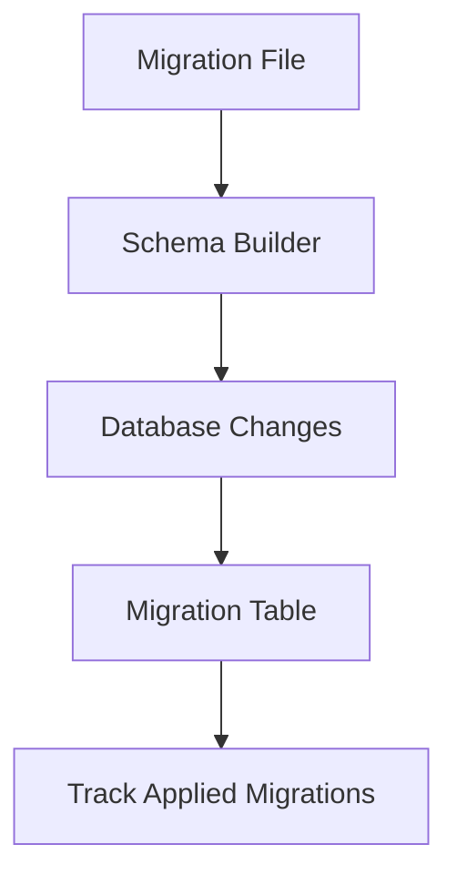

### 1.4 Code Examples

**File:** `database/migrations/xxxx_xx_xx_create_users_table.php`
```php
<?php

use Illuminate\Database\Migrations\Migration;
use Illuminate\Database\Schema\Blueprint;
use Illuminate\Support\Facades\Schema;

return new class extends Migration
{
    /**
     * Run the migrations.
     */
    public function up(): void
    {
        Schema::create('users', function (Blueprint $table) {
            $table->id();
            $table->string('name');
            $table->string('email')->unique();
            $table->timestamps();
        });
    }

    /**
     * Reverse the migrations.
     */
    public function down(): void
    {
        Schema::dropIfExists('users');
    }
};
```

**File:** `routes/console.php`
```php
use Illuminate\Support\Facades\Artisan;

Artisan::command('migrate:run', function () {
    $this->call('migrate');
    $this->info('Migrations completed!');
})->purpose('Run database migrations');
```

### 1.5 Dependencies
- `Illuminate\Database\Migrations\Migration` - Base migration class
- `Illuminate\Database\Schema\Blueprint` - Schema definition class
- `Illuminate\Support\Facades\Schema` - Schema facade
- `database/migrations/` directory - Storage location for migration files

### 1.6 Best Practices
- Use descriptive migration names
- Always implement the `down` method for reversibility
- Test migrations in a development environment first
- Keep migrations focused on a single change
- Use transactions for complex migrations

---

## 2. Generating Migrations

### 2.1 Overview
You may use the `make:migration` Artisan command to generate a database migration. The new migration will be placed in your `database/migrations` directory. Each migration filename contains a timestamp that allows Laravel to determine the order of the migrations.

### 2.2 Technical Definition
The `make:migration` command creates a new migration file with a timestamp prefix to ensure proper ordering. Laravel uses the migration name to determine if it's creating a new table or modifying an existing one, pre-filling the migration file accordingly.

### 2.3 Visualization
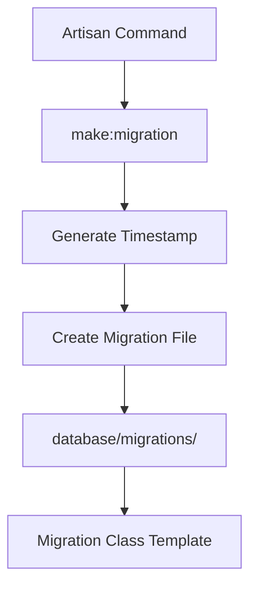

### 2.4 Code Examples

**Generate a basic migration:**
```bash
php artisan make:migration create_users_table
```

**Generate a migration for a specific table:**
```bash
php artisan make:migration create_flights_table
```

**Generate a migration with a custom path:**
```bash
php artisan make:migration create_users_table --path=/path/to/migrations
```

**Generate a migration for creating a table:**
```bash
php artisan make:migration create_posts_table --create=posts
```

**Generate a migration for modifying an existing table:**
```bash
php artisan make:migration add_votes_to_posts_table --table=posts
```

**File:** `database/migrations/xxxx_xx_xx_add_votes_to_posts_table.php`
```php
<?php

use Illuminate\Database\Migrations\Migration;
use Illuminate\Database\Schema\Blueprint;
use Illuminate\Support\Facades\Schema;

return new class extends Migration
{
    /**
     * Run the migrations.
     */
    public function up(): void
    {
        Schema::table('posts', function (Blueprint $table) {
            $table->integer('votes')->default(0);
        });
    }

    /**
     * Reverse the migrations.
     */
    public function down(): void
    {
        Schema::table('posts', function (Blueprint $table) {
            $table->dropColumn('votes');
        });
    }
};
```

### 2.5 Dependencies
- `database/migrations/` directory - Default storage location
- `Illuminate\Database\Migrations\Migration` - Base class
- Artisan CLI tool - For generating migrations

### 2.6 Best Practices
- Use descriptive names that indicate the action and table
- Follow Laravel's naming conventions
- Use `--create` for new tables and `--table` for modifications
- Consider using stubs for custom migration templates

---

## 3. Squashing Migrations

### 3.1 Overview
As you build your application, you may accumulate more and more migrations over time. This can lead to your `database/migrations` directory becoming bloated with potentially hundreds of migrations. If you would like, you may "squash" your migrations into a single SQL file.

### 3.2 Technical Definition
Migration squashing is a process where Laravel dumps the current database schema to a SQL file and removes all previous migration records. This consolidates multiple migrations into a single snapshot of the current database structure.

### 3.3 Visualization
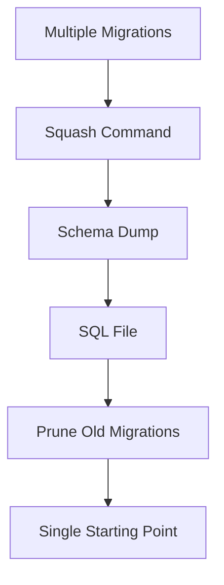

### 3.4 Code Examples

**Squash all migrations:**
```bash
php artisan schema:dump
```

**Squash and prune old migrations:**
```bash
php artisan schema:dump --prune
```

**Squash for a specific database connection:**
```bash
php artisan schema:dump --database=testing --prune
```

**File:** `database/schema/mysql-schema.sql` (generated)
```sql
CREATE TABLE users (
    id INT AUTO_INCREMENT PRIMARY KEY,
    name VARCHAR(255) NOT NULL,
    email VARCHAR(255) UNIQUE NOT NULL,
    created_at TIMESTAMP DEFAULT CURRENT_TIMESTAMP,
    updated_at TIMESTAMP DEFAULT CURRENT_TIMESTAMP ON UPDATE CURRENT_TIMESTAMP
);

CREATE TABLE posts (
    id INT AUTO_INCREMENT PRIMARY KEY,
    user_id INT NOT NULL,
    title VARCHAR(255) NOT NULL,
    content TEXT,
    created_at TIMESTAMP DEFAULT CURRENT_TIMESTAMP,
    updated_at TIMESTAMP DEFAULT CURRENT_TIMESTAMP ON UPDATE CURRENT_TIMESTAMP,
    FOREIGN KEY (user_id) REFERENCES users(id)
);
```

### 3.5 Dependencies
- `database/schema/` directory - Storage for schema files
- Database connection - Required for schema dump
- Supported databases - MariaDB, MySQL, PostgreSQL, SQLite

### 3.6 Best Practices
- Only squash when you have a stable schema
- Ensure all team members are on the same schema version
- Test the squashed schema in a development environment
- Commit the schema file to version control

---

## 4. Migration Structure

### 4.1 Overview
A migration class contains two methods: `up` and `down`. The `up` method is used to add new tables, columns, or indexes to your database, while the `down` method should reverse the operations performed by the `up` method.

### 4.2 Technical Definition
Migration classes extend the base `Migration` class and implement the `up` method to apply changes and the `down` method to reverse them. The schema builder provides methods to create and modify database structures.

### 4.3 Visualization
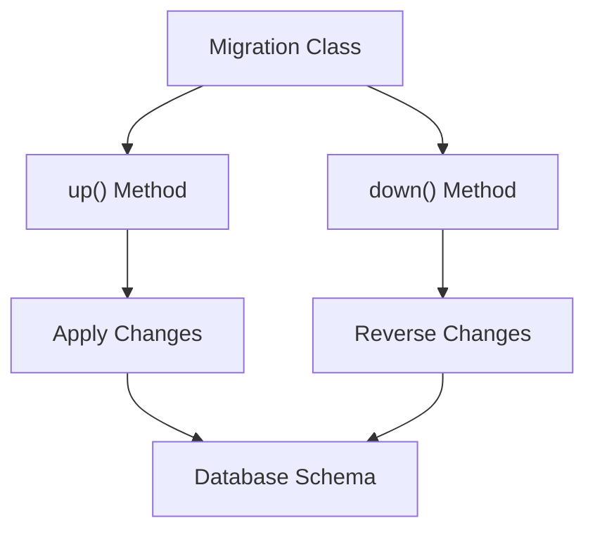

### 4.4 Code Examples

**Basic migration structure:**
```php
<?php

use Illuminate\Database\Migrations\Migration;
use Illuminate\Database\Schema\Blueprint;
use Illuminate\Support\Facades\Schema;

return new class extends Migration
{
    /**
     * Run the migrations.
     */
    public function up(): void
    {
        Schema::create('flights', function (Blueprint $table) {
            $table->id();
            $table->string('name');
            $table->string('airline');
            $table->timestamps();
        });
    }

    /**
     * Reverse the migrations.
     */
    public function down(): void
    {
        Schema::dropIfExists('flights');
    }
};
```

**Migration with connection specification:**
```php
<?php

use Illuminate\Database\Migrations\Migration;
use Illuminate\Support\Facades\Schema;

return new class extends Migration
{
    /**
     * The database connection that should be used by the migration.
     */
    protected $connection = 'pgsql';

    /**
     * Run the migrations.
     */
    public function up(): void
    {
        // Migration logic here
    }

    /**
     * Reverse the migrations.
     */
    public function down(): void
    {
        // Reverse migration logic here
    }
};
```

**Conditional migration execution:**
```php
<?php

use App\Models\Flight;
use Laravel\Pennant\Feature;
use Illuminate\Database\Migrations\Migration;
use Illuminate\Support\Facades\Schema;

return new class extends Migration
{
    /**
     * Determine if this migration should run.
     */
    public function shouldRun(): bool
    {
        return Feature::active(Flight::class);
    }

    /**
     * Run the migrations.
     */
    public function up(): void
    {
        // Migration logic here
    }

    /**
     * Reverse the migrations.
     */
    public function down(): void
    {
        // Reverse migration logic here
    }
};
```

### 4.5 Dependencies
- `Illuminate\Database\Migrations\Migration` - Base migration class
- `Illuminate\Database\Schema\Blueprint` - Schema definition class
- `Illuminate\Support\Facades\Schema` - Schema facade
- Database connection - For executing migration commands

### 4.6 Best Practices
- Always implement both `up` and `down` methods
- Use transactions for complex migrations
- Test the `down` method to ensure reversibility
- Keep migrations focused on a single change
- Use appropriate data types for columns

---

## 5. Running Migrations

### 5.1 Overview
To run all of your outstanding migrations, execute the `migrate` Artisan command. This will apply all unapplied migrations in the correct order based on their timestamps.

### 5.2 Technical Definition
The migration runner checks the `migrations` table to determine which migrations have been applied. It then executes any migration files that haven't been recorded in this table, in chronological order.

### 5.3 Visualization
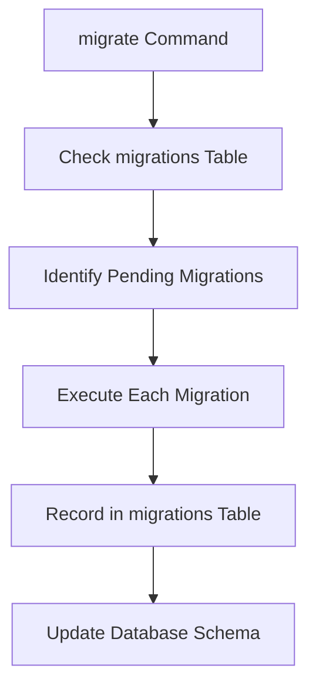

### 5.4 Code Examples

**Run all pending migrations:**
```bash
php artisan migrate
```

**Check migration status:**
```bash
php artisan migrate:status
```

**Preview SQL without executing:**
```bash
php artisan migrate --pretend
```

**Force migrations in production:**
```bash
php artisan migrate --force
```

**Run migrations with seed:**
```bash
php artisan migrate --seed
```

**Run migrations for a specific connection:**
```bash
php artisan migrate --database=sqlite
```

**Isolated migration execution:**
```bash
php artisan migrate --isolated
```

**File:** `app/Console/Commands/MigrateAndSeed.php`
```php
<?php

namespace App\Console\Commands;

use Illuminate\Console\Command;
use Illuminate\Support\Facades\Artisan;

class MigrateAndSeed extends Command
{
    protected $signature = 'app:migrate-and-seed';
    protected $description = 'Run migrations and seed the database';

    public function handle()
    {
        $this->info('Running migrations...');
        Artisan::call('migrate', ['--force' => true]);
        
        $this->info('Seeding database...');
        Artisan::call('db:seed', ['--force' => true]);
        
        $this->info('Migration and seeding completed!');
    }
}
```

### 5.5 Dependencies
- `migrations` table - Tracks applied migrations
- `database/migrations/` directory - Migration files location
- Database connection - For executing migrations
- Cache driver - For isolated migration locks

### 5.6 Best Practices
- Always backup databases before running migrations in production
- Use `--pretend` to preview changes before applying
- Implement isolated migrations in multi-server environments
- Use `--force` cautiously in production
- Test migrations in staging before production

---

## 6. Rolling Back Migrations

### 6.1 Overview
To roll back the latest migration operation, you may use the `rollback` Artisan command. This command rolls back the last "batch" of migrations, which may include multiple migration files.

### 6.2 Technical Definition
Migration rollbacks work by reversing the last batch of applied migrations. Each batch represents a set of migrations that were run together. The rollback command executes the `down` method of each migration in the batch.

### 6.3 Visualization
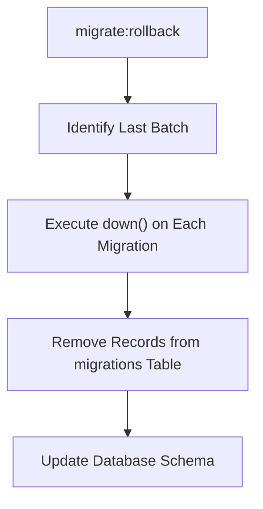

### 6.4 Code Examples

**Rollback last batch:**
```bash
php artisan migrate:rollback
```

**Rollback specific number of batches:**
```bash
php artisan migrate:rollback --step=5
```

**Rollback specific batch:**
```bash
php artisan migrate:rollback --batch=3
```

**Preview rollback SQL:**
```bash
php artisan migrate:rollback --pretend
```

**Rollback all migrations:**
```bash
php artisan migrate:reset
```

**Refresh database (rollback and migrate):**
```bash
php artisan migrate:refresh
```

**Refresh with seed:**
```bash
php artisan migrate:refresh --seed
```

**Refresh specific number of batches:**
```bash
php artisan migrate:refresh --step=5
```

**Fresh database (drop and recreate):**
```bash
php artisan migrate:fresh
```

**Fresh with seed:**
```bash
php artisan migrate:fresh --seed
```

**Fresh with specific connection:**
```bash
php artisan migrate:fresh --database=admin
```

**File:** `app/Console/Commands/DatabaseReset.php`
```php
<?php

namespace App\Console\Commands;

use Illuminate\Console\Command;
use Illuminate\Support\Facades\Artisan;

class DatabaseReset extends Command
{
    protected $signature = 'db:reset-complete';
    protected $description = 'Complete database reset with fresh migrations';

    public function handle()
    {
        $this->info('Resetting database...');
        
        // Fresh install
        Artisan::call('migrate:fresh', [
            '--seed' => true,
            '--force' => true
        ]);
        
        $this->info('Database reset completed!');
    }
}
```

### 6.5 Dependencies
- `migrations` table - Tracks migration batches
- Migration files - Contain `down()` methods
- Database connection - For executing rollbacks

### 6.6 Best Practices
- Always backup data before rolling back in production
- Test rollback procedures in development
- Use `--pretend` to preview rollback effects
- Be cautious with `migrate:fresh` as it drops all tables
- Consider data dependencies when rolling back

---

## 7. Tables

### 7.1 Overview
Laravel's schema builder provides database agnostic support for creating and manipulating tables across all of Laravel's supported database systems. This section covers creating, updating, and dropping database tables.

### 7.2 Technical Definition
The schema builder allows you to define database tables using PHP code instead of raw SQL. It supports creating tables with various column types, indexes, and constraints in a database-agnostic way.

### 7.3 Visualization
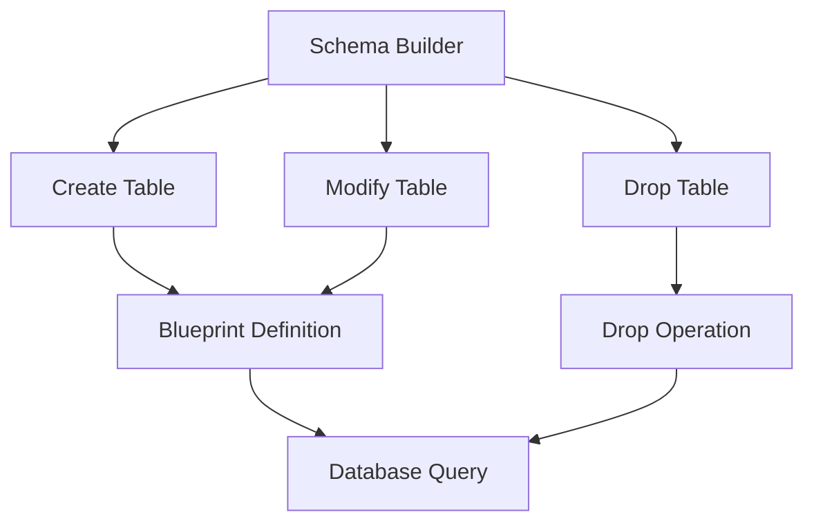

### 7.4 Code Examples

**Creating a new table:**
```php
use Illuminate\Database\Schema\Blueprint;
use Illuminate\Support\Facades\Schema;

Schema::create('users', function (Blueprint $table) {
    $table->id();
    $table->string('name');
    $table->string('email')->unique();
    $table->timestamps();
});
```

**Checking if table exists:**
```php
if (Schema::hasTable('users')) {
    // Table exists
}
```

**Updating an existing table:**
```php
use Illuminate\Database\Schema\Blueprint;
use Illuminate\Support\Facades\Schema;

Schema::table('users', function (Blueprint $table) {
    $table->integer('votes');
});
```

**Renaming a table:**
```php
use Illuminate\Support\Facades\Schema;

Schema::rename('from', 'to');
```

**Dropping a table:**
```php
Schema::drop('users');
Schema::dropIfExists('users'); // Safe drop
```

**Table with engine specification:**
```php
Schema::create('users', function (Blueprint $table) {
    $table->engine('InnoDB');
    $table->id();
    $table->string('name');
    $table->timestamps();
});
```

**Table with charset and collation:**
```php
Schema::create('users', function (Blueprint $table) {
    $table->charset('utf8mb4');
    $table->collation('utf8mb4_unicode_ci');
    $table->id();
    $table->string('name');
    $table->timestamps();
});
```

**Temporary table:**
```php
Schema::create('calculations', function (Blueprint $table) {
    $table->temporary();
    $table->integer('value');
});
```

**Table with comment:**
```php
Schema::create('calculations', function (Blueprint $table) {
    $table->comment('Business calculations');
    $table->id();
    $table->decimal('amount', 10, 2);
});
```

**Using a different database connection:**
```php
Schema::connection('sqlite')->create('users', function (Blueprint $table) {
    $table->id();
    $table->string('name');
});
```

**File:** `app/Console/Commands/CreateUserTable.php`
```php
<?php

namespace App\Console\Commands;

use Illuminate\Console\Command;
use Illuminate\Support\Facades\Schema;
use Illuminate\Database\Schema\Blueprint;

class CreateUserTable extends Command
{
    protected $signature = 'table:create-user';
    protected $description = 'Create users table programmatically';

    public function handle()
    {
        if (!Schema::hasTable('users')) {
            Schema::create('users', function (Blueprint $table) {
                $table->id();
                $table->string('name');
                $table->string('email')->unique();
                $table->timestamp('email_verified_at')->nullable();
                $table->string('password');
                $table->rememberToken();
                $table->timestamps();
            });
            
            $this->info('Users table created successfully!');
        } else {
            $this->warn('Users table already exists!');
        }
    }
}
```

### 7.5 Dependencies
- `Illuminate\Support\Facades\Schema` - Schema facade
- `Illuminate\Database\Schema\Blueprint` - Table definition class
- Database connection - For executing schema operations

### 7.6 Best Practices
- Always check if a table exists before creating it
- Use appropriate data types for columns
- Consider database engine capabilities
- Use transactions for complex table operations
- Test table operations in development first

---

## 8. Columns

### 8.1 Overview
The schema builder supports various column types that you can use when building your database tables. This section covers creating, modifying, and dropping table columns.

### 8.2 Technical Definition
Column methods in Laravel's schema builder provide a fluent interface for defining database columns with specific data types, constraints, and modifiers. These methods translate to appropriate SQL for the underlying database system.

### 8.3 Visualization
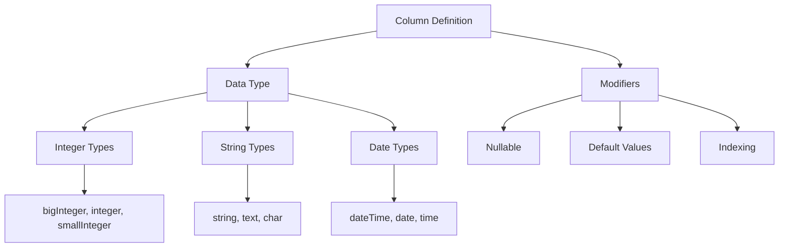

### 8.4 Code Examples

**Common column types:**
```php
Schema::create('users', function (Blueprint $table) {
    $table->id(); // Auto-incrementing UNSIGNED BIGINT (primary key)
    $table->bigIncrements('id'); // Alias for id()
    $table->bigInteger('votes'); // BIGINT equivalent column
    $table->binary('photo'); // BLOB equivalent column
    $table->boolean('confirmed'); // BOOLEAN equivalent column
    $table->char('name', length: 100); // CHAR equivalent column
    $table->dateTime('created_at'); // DATETIME equivalent column
    $table->dateTimeTz('created_at'); // DATETIME (with timezone) equivalent column
    $table->date('birth_date'); // DATE equivalent column
    $table->decimal('amount', total: 8, places: 2); // DECIMAL equivalent column
    $table->double('amount', precision: 15); // DOUBLE equivalent column
    $table->enum('level', ['easy', 'hard']); // ENUM equivalent column
    $table->float('amount'); // FLOAT equivalent column
    $table->foreignId('user_id'); // UNSIGNED BIGINT equivalent column
    $table->foreignIdFor(User::class); // ID column for model
    $table->integer('votes'); // INTEGER equivalent column
    $table->ipAddress('visitor'); // IP address column
    $table->json('options'); // JSON equivalent column
    $table->jsonb('options'); // JSONB equivalent column (PostgreSQL)
    $table->longText('description'); // LONGTEXT equivalent column
    $table->macAddress('device'); // MAC address column
    $table->mediumIncrements('id'); // Auto-incrementing MEDIUMINT primary key
    $table->mediumInteger('votes'); // MEDIUMINT equivalent column
    $table->mediumText('description'); // MEDIUMTEXT equivalent column
    $table->morphs('taggable'); // Adds taggable_id and taggable_type
    $table->nullableMorphs('taggable'); // Morphs that are nullable
    $table->rememberToken(); // VARCHAR(100) for "remember me" tokens
    $table->string('name', length: 100); // VARCHAR equivalent column
    $table->text('description'); // TEXT equivalent column
    $table->time('sunrise'); // TIME equivalent column
    $table->timeTz('sunrise'); // TIME (with timezone) equivalent column
    $table->timestamp('added_at'); // TIMESTAMP equivalent column
    $table->timestampTz('added_at'); // TIMESTAMP (with timezone) equivalent column
    $table->timestamps(); // Adds created_at and updated_at columns
    $table->timestampsTz(); // Adds TIMESTAMP with timezone columns
    $table->tinyIncrements('id'); // Auto-incrementing TINYINT primary key
    $table->tinyInteger('votes'); // TINYINT equivalent column
    $table->tinyText('notes'); // TINYTEXT equivalent column
    $table->unsignedBigInteger('votes'); // UNSIGNED BIGINT equivalent column
    $table->unsignedInteger('votes'); // UNSIGNED INTEGER equivalent column
    $table->unsignedMediumInteger('votes'); // UNSIGNED MEDIUMINT equivalent column
    $table->unsignedSmallInteger('votes'); // UNSIGNED SMALLINT equivalent column
    $table->unsignedTinyInteger('votes'); // UNSIGNED TINYINT equivalent column
    $table->uuid('id'); // UUID equivalent column
    $table->ulid('id'); // ULID equivalent column
    $table->year('birth_year'); // YEAR equivalent column
});
```

**Column modifiers:**
```php
Schema::table('users', function (Blueprint $table) {
    $table->string('email')->nullable(); // Allow NULL values
    $table->string('name')->default('Anonymous'); // Set default value
    $table->string('username')->unique(); // Add unique index
    $table->timestamp('created_at')->useCurrent(); // Use CURRENT_TIMESTAMP
    $table->timestamp('updated_at')->useCurrent()->useCurrentOnUpdate(); // Update on modification
    $table->string('name')->charset('utf8'); // Specify character set
    $table->string('name')->collation('utf8_unicode_ci'); // Specify collation
    $table->integer('votes')->unsigned(); // Set as unsigned
    $table->integer('votes')->comment('Number of votes'); // Add column comment
    $table->integer('options')->first(); // Place at beginning of table (MySQL)
    $table->integer('votes')->after('email'); // Place after specific column (MySQL)
    $table->integer('votes')->storedAs('expression'); // Generated stored column
    $table->integer('votes')->virtualAs('expression'); // Generated virtual column
});
```

**Modifying existing columns:**
```php
use Illuminate\Support\Facades\Schema;
use Illuminate\Database\Schema\Blueprint;

// Increase string column size
Schema::table('users', function (Blueprint $table) {
    $table->string('name', 50)->change(); // Change from default 255 to 50
});

// Make column nullable
Schema::table('users', function (Blueprint $table) {
    $table->string('middle_name')->nullable()->change();
});

// Change column type and properties
Schema::table('users', function (Blueprint $table) {
    $table->integer('votes')->unsigned()->default(0)->change();
});
```

**Renaming columns:**
```php
Schema::table('users', function (Blueprint $table) {
    $table->renameColumn('from', 'to');
});
```

**Dropping columns:**
```php
Schema::table('users', function (Blueprint $table) {
    $table->dropColumn('votes');
    $table->dropColumn(['votes', 'avatar', 'photo']); // Multiple columns
});

// Specialized drop methods
Schema::table('users', function (Blueprint $table) {
    $table->dropMorphs('imageable'); // Drop imageable_id and imageable_type
    $table->dropRememberToken(); // Drop remember_token column
    $table->dropSoftDeletes(); // Drop deleted_at column
    $table->dropTimestamps(); // Drop created_at and updated_at
});
```

**File:** `app/Console/Commands/AddUserProfileColumns.php`
```php
<?php

namespace App\Console\Commands;

use Illuminate\Console\Command;
use Illuminate\Support\Facades\Schema;
use Illuminate\Database\Schema\Blueprint;

class AddUserProfileColumns extends Command
{
    protected $signature = 'table:add-profile-columns';
    protected $description = 'Add profile-related columns to users table';

    public function handle()
    {
        if (Schema::hasTable('users')) {
            Schema::table('users', function (Blueprint $table) {
                $table->string('phone')->nullable();
                $table->date('birth_date')->nullable();
                $table->text('bio')->nullable();
                $table->string('website')->nullable();
                $table->json('social_links')->nullable();
                $table->boolean('is_public')->default(false);
                $table->timestamp('profile_updated_at')->nullable();
            });
            
            $this->info('Profile columns added to users table successfully!');
        } else {
            $this->error('Users table does not exist!');
        }
    }
}
```

### 8.5 Dependencies
- `Illuminate\Database\Schema\Blueprint` - Column definition class
- `Illuminate\Support\Facades\Schema` - Schema facade
- Database connection - For executing column operations

### 8.6 Best Practices
- Use appropriate column types for data requirements
- Add proper constraints and validations
- Consider indexing frequently queried columns
- Use nullable appropriately
- Test column modifications on a copy first

---

## 9. Indexes

### 9.1 Overview
Laravel's schema builder supports creating various types of indexes to improve query performance. Indexes allow the database to quickly locate and access specific rows in a table.

### 9.2 Technical Definition
Indexes in Laravel's schema builder are created using methods that translate to appropriate SQL for the underlying database system. Laravel automatically generates index names based on the table, column names, and index type, or you can specify custom names.

### 9.3 Visualization
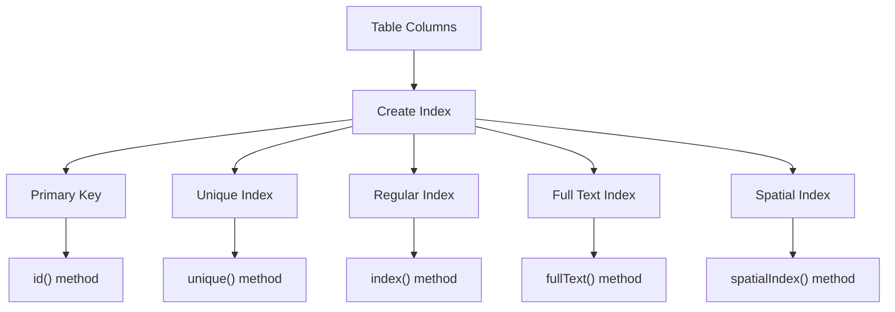

### 9.4 Code Examples

**Creating different types of indexes:**
```php
Schema::table('users', function (Blueprint $table) {
    // Primary key index
    $table->primary('id');
    $table->primary(['id', 'parent_id']); // Composite primary key
    
    // Unique index
    $table->unique('email');
    $table->unique(['account_id', 'id']); // Composite unique index
    
    // Regular index
    $table->index('state');
    $table->index(['account_id', 'created_at']); // Composite index
    
    // Full text index (MySQL/PostgreSQL)
    $table->fullText('body');
    $table->fullText('body')->language('english'); // PostgreSQL specific
    
    // Spatial index (except SQLite)
    $table->spatialIndex('location');
    
    // Custom index names
    $table->unique('email', 'unique_email_idx');
    $table->index(['account_id', 'created_at'], 'acct_created_idx');
});
```

**Online index creation (PostgreSQL/SQL Server):**
```php
Schema::table('users', function (Blueprint $table) {
    $table->string('email')->unique()->online();
});
```

**Renaming indexes:**
```php
Schema::table('geo', function (Blueprint $table) {
    $table->renameIndex('from', 'to');
});
```

**Dropping indexes:**
```php
Schema::table('users', function (Blueprint $table) {
    // Drop by convention-based name
    $table->dropPrimary('users_id_primary');
    $table->dropUnique('users_email_unique');
    $table->dropIndex('geo_state_index');
    $table->dropFullText('posts_body_fulltext');
    $table->dropSpatialIndex('geo_location_spatialindex');
    
    // Drop by column array (generates conventional name)
    $table->dropIndex(['state']); // Drops geo_state_index
});
```

**Index naming conventions:**
```php
// Laravel automatically names indexes:
// primary: table_column_primary (e.g., users_id_primary)
// unique: table_column_unique (e.g., users_email_unique)
// index: table_column_index (e.g., geo_state_index)
// fulltext: table_column_fulltext (e.g., posts_body_fulltext)
// spatial: table_column_spatialindex (e.g., geo_location_spatialindex)

// For composite indexes:
// table_column1_column2_index (e.g., users_account_id_created_at_index)
```

**Advanced index options:**
```php
Schema::table('users', function (Blueprint $table) {
    // Index with algorithm specification (MySQL)
    $table->index('email')->algorithm('hash');
    
    // Partial index (PostgreSQL)
    $table->index('status')->where('status', 'active');
    
    // Functional index (PostgreSQL)
    $table->index(DB::raw('lower(email)'))->name('users_email_lower_index');
});
```

**File:** `app/Console/Commands/AddUserIndexes.php`
```php
<?php

namespace App\Console\Commands;

use Illuminate\Console\Command;
use Illuminate\Support\Facades\Schema;
use Illuminate\Database\Schema\Blueprint;

class AddUserIndexes extends Command
{
    protected $signature = 'indexes:add-user';
    protected $description = 'Add performance indexes to users table';

    public function handle()
    {
        if (Schema::hasTable('users')) {
            Schema::table('users', function (Blueprint $table) {
                // Add indexes for common query patterns
                $table->index(['created_at', 'status'], 'idx_users_created_status');
                $table->index('last_login_at', 'idx_users_last_login');
                $table->index(['city', 'state'], 'idx_users_location');
                
                // Add unique index for username if it doesn't exist
                if (!Schema::hasIndex('users', 'users_username_unique')) {
                    $table->unique('username', 'users_username_unique');
                }
                
                // Add full text index for search if DB supports it
                if (Schema::getConnection()->getDriverName() !== 'sqlite') {
                    $table->fullText(['name', 'bio'], 'users_search_idx');
                }
            });
            
            $this->info('Performance indexes added to users table successfully!');
        } else {
            $this->error('Users table does not exist!');
        }
    }
}
```

### 9.5 Dependencies
- `Illuminate\Database\Schema\Blueprint` - Index definition class
- `Illuminate\Support\Facades\Schema` - Schema facade
- Database connection - For executing index operations
- Appropriate database permissions - For creating/dropping indexes

### 9.6 Best Practices
- Only create indexes that will be used in queries
- Be mindful of the trade-off between read and write performance
- Consider composite indexes for multi-column queries
- Monitor index usage and remove unused indexes
- Test index performance in a production-like environment

---

## 10. Foreign Key Constraints

### 10.1 Overview
Laravel provides support for creating foreign key constraints that enforce referential integrity at the database level. Foreign keys ensure that relationships between tables remain consistent.

### 10.2 Technical Definition
Foreign key constraints in Laravel are created using the schema builder's foreign key methods. These constraints link a column in one table to a primary key in another table, ensuring data integrity and preventing orphaned records.

### 10.3 Visualization
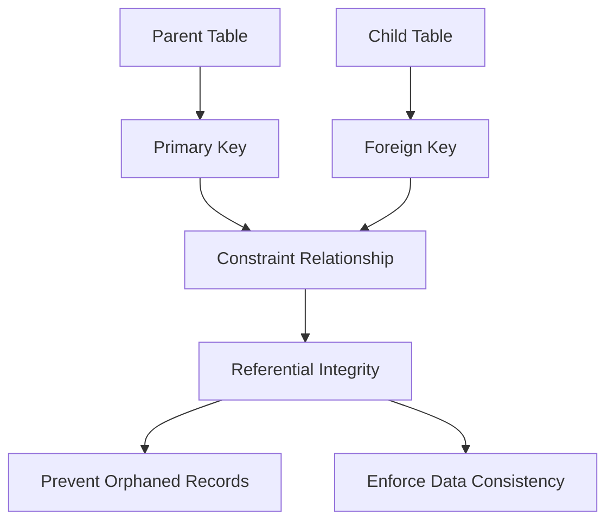

### 10.4 Code Examples

**Creating foreign key constraints:**
```php
use Illuminate\Database\Schema\Blueprint;
use Illuminate\Support\Facades\Schema;

Schema::table('posts', function (Blueprint $table) {
    $table->unsignedBigInteger('user_id');
    
    $table->foreign('user_id')
          ->references('id')
          ->on('users');
});
```

**Using the foreignId method (more concise):**
```php
Schema::table('posts', function (Blueprint $table) {
    $table->foreignId('user_id')->constrained();
});
```

**Specifying custom table and column names:**
```php
Schema::table('posts', function (Blueprint $table) {
    $table->foreignId('user_id')->constrained(
        table: 'users', 
        column: 'id'
    );
});
```

**Customizing constraint name:**
```php
Schema::table('posts', function (Blueprint $table) {
    $table->foreignId('user_id')->constrained(
        table: 'users',
        indexName: 'posts_user_id'
    );
});
```

**Adding actions for delete/update:**
```php
Schema::table('posts', function (Blueprint $table) {
    $table->foreignId('user_id')
          ->constrained()
          ->cascadeOnDelete()
          ->restrictOnUpdate();
});
```

**Alternative syntax for actions:**
```php
Schema::table('posts', function (Blueprint $table) {
    $table->foreignId('user_id')
          ->constrained()
          ->onDelete('cascade')
          ->onUpdate('restrict');
});
```

**Available actions:**
```php
// On Update
$table->cascadeOnUpdate();     // Updates cascade to child records
$table->restrictOnUpdate();    // Restricts updates if child records exist
$table->nullOnUpdate();        // Sets foreign key to NULL on update
$table->noActionOnUpdate();    // Takes no action on update

// On Delete
$table->cascadeOnDelete();     // Deletes child records when parent is deleted
$table->restrictOnDelete();    // Restricts deletion if child records exist
$table->nullOnDelete();        // Sets foreign key to NULL on delete
$table->noActionOnDelete();    // Takes no action on delete
```

**Adding constraints with other column modifiers:**
```php
Schema::table('posts', function (Blueprint $table) {
    $table->foreignId('user_id')
          ->nullable()
          ->constrained();
});
```

**Dropping foreign key constraints:**
```php
Schema::table('posts', function (Blueprint $table) {
    // Drop by conventional name
    $table->dropForeign('posts_user_id_foreign');
    
    // Drop by column name array
    $table->dropForeign(['user_id']);
    
    // Drop by full constraint definition (if name known)
    $table->dropForeign(['user_id']);
});
```

**Enabling/disabling foreign key constraints:**
```php
// Enable foreign key constraints
Schema::enableForeignKeyConstraints();

// Disable foreign key constraints
Schema::disableForeignKeyConstraints();

// Execute code with constraints disabled
Schema::withoutForeignKeyConstraints(function () {
    // Code that temporarily violates constraints
    // For example, bulk data operations
});
```

**File:** `app/Console/Commands/AddForeignKeys.php`
```php
<?php

namespace App\Console\Commands;

use Illuminate\Console\Command;
use Illuminate\Support\Facades\Schema;
use Illuminate\Database\Schema\Blueprint;

class AddForeignKeys extends Command
{
    protected $signature = 'constraints:add-foreign-keys';
    protected $description = 'Add foreign key constraints to related tables';

    public function handle()
    {
        // Ensure constraints are enabled
        Schema::enableForeignKeyConstraints();
        
        // Add foreign key to posts table
        if (Schema::hasTable('posts') && Schema::hasTable('users')) {
            Schema::table('posts', function (Blueprint $table) {
                if (!$table->hasColumn('user_id')) {
                    $table->foreignId('user_id')->constrained()->cascadeOnDelete();
                } else {
                    $table->foreignId('user_id')->constrained()->cascadeOnDelete();
                }
            });
        }
        
        // Add foreign key to comments table
        if (Schema::hasTable('comments') && Schema::hasTable('posts')) {
            Schema::table('comments', function (Blueprint $table) {
                $table->foreignId('post_id')->constrained()->cascadeOnDelete();
                $table->foreignId('user_id')->constrained();
            });
        }
        
        // Add foreign key to user profiles
        if (Schema::hasTable('user_profiles') && Schema::hasTable('users')) {
            Schema::table('user_profiles', function (Blueprint $table) {
                $table->foreignId('user_id')
                      ->constrained()
                      ->cascadeOnDelete()
                      ->unique();
            });
        }
        
        $this->info('Foreign key constraints added successfully!');
    }
}
```

### 10.5 Dependencies
- `Illuminate\Database\Schema\Blueprint` - Foreign key definition class
- `Illuminate\Support\Facades\Schema` - Schema facade
- Database connection with FK support - For enforcing constraints
- Referenced tables - Must exist before creating foreign keys

### 10.6 Best Practices
- Always create referenced tables before creating foreign keys
- Use appropriate actions (cascade, restrict, null) based on business logic
- Consider performance implications of foreign key constraints
- Test constraint behavior during development
- Use transactions when performing bulk operations that affect related tables

---

## 11. Events

### 11.1 Overview
For convenience, each migration operation will dispatch an event. These events allow you to hook into the migration process and perform additional operations when migrations are executed.

### 11.2 Technical Definition
Laravel's migration system dispatches events throughout the migration process, from starting a batch of migrations to completing individual migration operations. These events extend the base `MigrationEvent` class and can be listened to using Laravel's event system.

### 11.3 Visualization
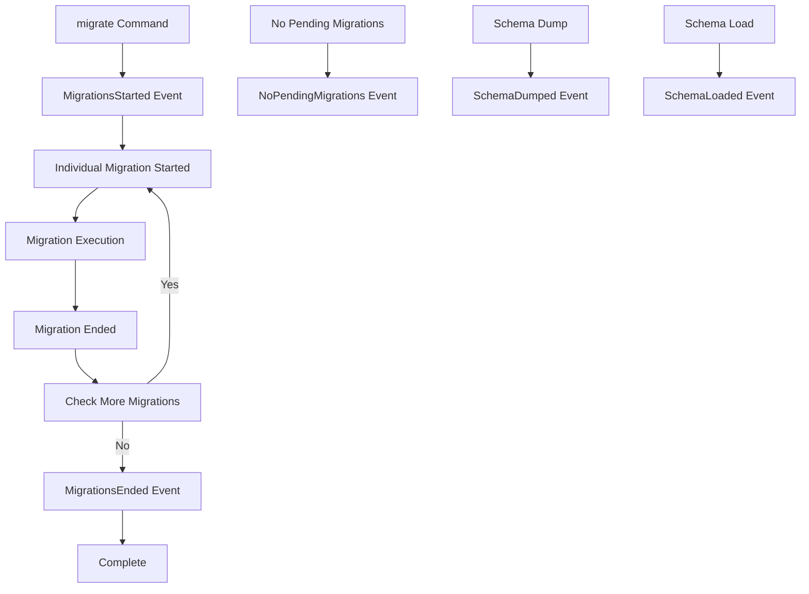

### 11.4 Code Examples

**Available migration events:**
```php
use Illuminate\Console\Events\MigrationsEnded;
use Illuminate\Console\Events\MigrationsStarted;
use Illuminate\Console\Events\MigrationEnded;
use Illuminate\Console\Events\MigrationStarted;
use Illuminate\Console\Events\NoPendingMigrations;
use Illuminate\Console\Events\SchemaDumped;
use Illuminate\Console\Events\SchemaLoaded;
use Illuminate\Foundation\Events\Dispatchable;

// Listen to when a batch of migrations starts
\Event::listen(function (MigrationsStarted $event) {
    \Log::info('Starting migration batch');
});

// Listen to when a batch of migrations ends
\Event::listen(function (MigrationsEnded $event) {
    \Log::info('Migration batch completed');
});

// Listen to when a single migration starts
\Event::listen(function (MigrationStarted $event) {
    \Log::info("Starting migration: {$event->method} - {$event->migration->getName()}");
});

// Listen to when a single migration ends
\Event::listen(function (MigrationEnded $event) {
    \Log::info("Completed migration: {$event->method} - {$event->migration->getName()}");
});

// Listen when there are no pending migrations
\Event::listen(function (NoPendingMigrations $event) {
    \Log::info('No pending migrations found');
});

// Listen to schema dump completion
\Event::listen(function (SchemaDumped $event) {
    \Log::info("Schema dumped to: {$event->path}");
});

// Listen to schema load completion
\Event::listen(function (SchemaLoaded $event) {
    \Log::info("Schema loaded from: {$event->path}");
});
```

**Creating an event listener class:**
```php
<?php

namespace App\Listeners;

use Illuminate\Console\Events\MigrationsStarted;
use Illuminate\Console\Events\MigrationsEnded;
use Illuminate\Console\Events\MigrationStarted;
use Illuminate\Console\Events\MigrationEnded;
use Illuminate\Support\Facades\Log;

class MigrationLogger
{
    public function handleMigrationsStarted(MigrationsStarted $event): void
    {
        Log::info('Migration batch started');
    }

    public function handleMigrationsEnded(MigrationsEnded $event): void
    {
        Log::info('Migration batch ended');
    }

    public function handleMigrationStarted(MigrationStarted $event): void
    {
        Log::info("Migration started: {$event->migration->getName()}");
    }

    public function handleMigrationEnded(MigrationEnded $event): void
    {
        Log::info("Migration ended: {$event->migration->getName()}");
    }
}
```

**Registering event listeners in EventServiceProvider:**
```php
<?php

namespace App\Providers;

use App\Listeners\MigrationLogger;
use Illuminate\Auth\Events\Registered;
use Illuminate\Auth\Listeners\SendEmailVerificationNotification;
use Illuminate\Foundation\Support\Providers\EventServiceProvider as ServiceProvider;

class EventServiceProvider extends ServiceProvider
{
    protected $listen = [
        \Illuminate\Console\Events\MigrationsStarted::class => [
            [MigrationLogger::class, 'handleMigrationsStarted'],
        ],
        \Illuminate\Console\Events\MigrationsEnded::class => [
            [MigrationLogger::class, 'handleMigrationsEnded'],
        ],
        \Illuminate\Console\Events\MigrationStarted::class => [
            [MigrationLogger::class, 'handleMigrationStarted'],
        ],
        \Illuminate\Console\Events\MigrationEnded::class => [
            [MigrationLogger::class, 'handleMigrationEnded'],
        ],
    ];

    public function boot(): void
    {
        parent::boot();
    }
}
```

**Creating a migration progress monitor:**
```php
<?php

namespace App\Services;

use Illuminate\Console\Events\MigrationEnded;
use Illuminate\Console\Events\MigrationStarted;
use Illuminate\Console\Events\MigrationsEnded;
use Illuminate\Console\Events\MigrationsStarted;
use Illuminate\Support\Facades\Cache;

class MigrationMonitor
{
    private string $cacheKey = 'migration_progress';
    
    public function handleMigrationsStarted(MigrationsStarted $event): void
    {
        Cache::put($this->cacheKey, [
            'status' => 'running',
            'started_at' => now(),
            'completed' => 0,
            'total' => 0, // This would need to be calculated separately
        ]);
    }

    public function handleMigrationStarted(MigrationStarted $event): void
    {
        $progress = Cache::get($this->cacheKey, []);
        $progress['current_migration'] = $event->migration->getName();
        Cache::put($this->cacheKey, $progress);
    }

    public function handleMigrationEnded(MigrationEnded $event): void
    {
        $progress = Cache::get($this->cacheKey, []);
        $progress['completed'] = ($progress['completed'] ?? 0) + 1;
        $progress['last_completed'] = $event->migration->getName();
        Cache::put($this->cacheKey, $progress);
    }

    public function handleMigrationsEnded(MigrationsEnded $event): void
    {
        $progress = Cache::get($this->cacheKey, []);
        $progress['status'] = 'completed';
        $progress['ended_at'] = now();
        Cache::put($this->cacheKey, $progress);
    }

    public function getProgress(): array
    {
        return Cache::get($this->cacheKey, [
            'status' => 'idle',
            'completed' => 0,
            'total' => 0,
        ]);
    }
}
```

**Using events for backup operations:**
```php
<?php

namespace App\Listeners;

use Illuminate\Console\Events\MigrationsStarted;
use Illuminate\Console\Events\MigrationsEnded;
use Illuminate\Support\Facades\Artisan;
use Illuminate\Support\Facades\Storage;

class MigrationBackupHandler
{
    public function handleMigrationsStarted(MigrationsStarted $event): void
    {
        // Create a backup before running migrations in production
        if (app()->environment('production')) {
            try {
                // Create database backup
                $backupFile = 'backup_' . now()->format('Y-m-d_H-i-s') . '.sql';
                $exitCode = Artisan::call('db:backup', [
                    '--file' => $backupFile
                ]);
                
                if ($exitCode === 0) {
                    \Log::info("Database backup created before migrations: {$backupFile}");
                } else {
                    \Log::error("Failed to create database backup before migrations");
                }
            } catch (\Exception $e) {
                \Log::error("Error during backup creation: " . $e->getMessage());
            }
        }
    }

    public function handleMigrationsEnded(MigrationsEnded $event): void
    {
        \Log::info('Migrations completed, cleaning up temporary files if needed');
    }
}
```

**File:** `app/Console/Commands/MonitorMigrations.php`
```php
<?php

namespace App\Console\Commands;

use App\Services\MigrationMonitor;
use Illuminate\Console\Command;
use Illuminate\Support\Facades\Artisan;

class MonitorMigrations extends Command
{
    protected $signature = 'migrate:monitored';
    protected $description = 'Run migrations with progress monitoring';

    public function handle(MigrationMonitor $monitor)
    {
        $this->info('Starting monitored migration process...');
        
        // Listen for migration events
        $this->call('migrate', ['--force' => true]);
        
        $progress = $monitor->getProgress();
        $this->info('Migration process completed!');
        $this->table(['Status', 'Completed', 'Current'], [[
            $progress['status'],
            $progress['completed'] ?? 0,
            $progress['current_migration'] ?? 'None'
        ]]);
    }
}
```

### 11.5 Dependencies
- `Illuminate\Console\Events\*` - Migration event classes
- `Illuminate\Events\Dispatcher` - Event dispatcher
- Event service provider - For registering listeners
- Cache system - For storing migration progress (optional)

### 11.6 Best Practices
- Use events for logging and monitoring migration processes
- Implement backup strategies before running migrations in production
- Track migration progress for long-running operations
- Use events for cleanup operations after migrations
- Test event handlers in development environment

---

## 12. Best Practices

### 12.1 Overview
Following best practices for migrations ensures database integrity, maintains application stability, and facilitates smooth deployments across different environments.

### 12.2 Technical Definition
Migration best practices encompass strategies for creating, organizing, testing, and deploying database schema changes in a way that minimizes risks and maximizes maintainability.

### 12.3 Visualization
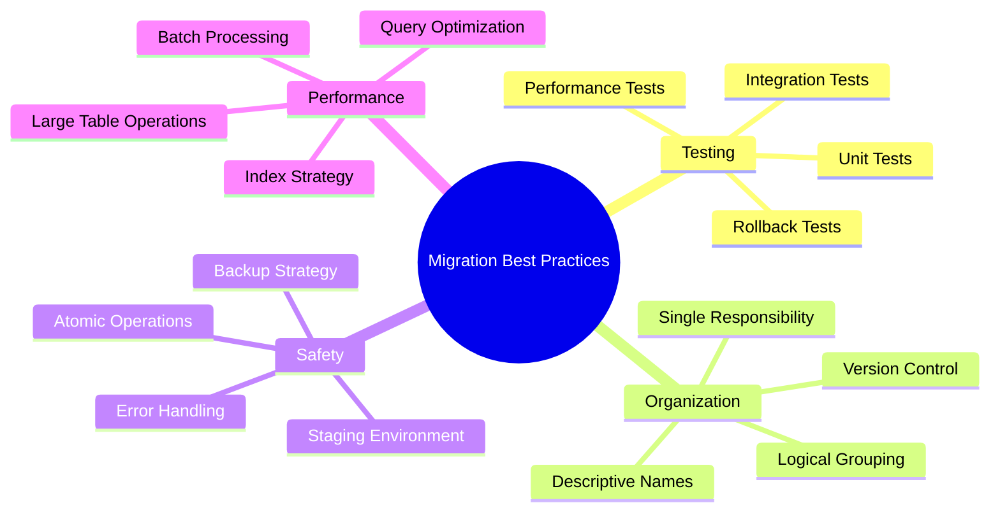

### 12.4 Code Examples

**Testing migrations:**
```php
<?php

namespace Tests\Feature;

use Illuminate\Foundation\Testing\RefreshDatabase;
use Illuminate\Support\Facades\Artisan;
use Tests\TestCase;

class MigrationTest extends TestCase
{
    use RefreshDatabase;

    /** @test */
    public function it_can_run_migration_successfully(): void
    {
        // Test that migration runs without errors
        Artisan::call('migrate', ['--force' => true]);
        
        // Verify table exists
        $this->assertTrue(\Schema::hasTable('users'));
        
        // Verify columns exist
        $this->assertTrue(\Schema::hasColumns('users', [
            'id', 'name', 'email', 'created_at', 'updated_at'
        ]));
    }

    /** @test */
    public function it_can_rollback_migration_successfully(): void
    {
        // Run migration
        Artisan::call('migrate', ['--force' => true]);
        
        // Verify table exists
        $this->assertTrue(\Schema::hasTable('users'));
        
        // Rollback migration
        Artisan::call('migrate:rollback', ['--force' => true]);
        
        // Verify table is gone
        $this->assertFalse(\Schema::hasTable('users'));
    }

    /** @test */
    public function it_maintains_data_integrity_during_migration(): void
    {
        // Insert test data
        $userId = \DB::table('users')->insertGetId([
            'name' => 'Test User',
            'email' => 'test@example.com',
            'created_at' => now(),
            'updated_at' => now(),
        ]);
        
        // Run a migration that modifies the table
        Artisan::call('migrate', ['--force' => true]);
        
        // Verify data still exists
        $user = \DB::table('users')->where('id', $userId)->first();
        $this->assertEquals('Test User', $user->name);
    }
}
```

**Organizing migrations with descriptive names:**
```php
// Good naming examples:
// 1. Creating new tables
create_users_table.php
create_posts_table.php
create_comments_table.php

// 2. Adding columns to existing tables
add_status_to_posts_table.php
add_soft_deletes_to_users_table.php
add_timestamps_to_categories_table.php

// 3. Modifying existing columns
increase_length_of_name_field_in_users_table.php
change_data_type_of_amount_in_orders_table.php

// 4. Adding/removing indexes
add_index_to_posts_title_column.php
remove_unique_constraint_from_users_email.php

// 5. Adding foreign key constraints
add_user_id_foreign_key_to_posts_table.php
create_foreign_keys_for_blog_tables.php
```

**Safe migration patterns:**
```php
<?php

use Illuminate\Database\Migrations\Migration;
use Illuminate\Database\Schema\Blueprint;
use Illuminate\Support\Facades\Schema;

// Safe migration example - adding a nullable column
return new class extends Migration
{
    public function up(): void
    {
        // Check if table exists before modifying
        if (Schema::hasTable('users')) {
            Schema::table('users', function (Blueprint $table) {
                // Add nullable column first
                $table->string('phone')->nullable();
            });
        }
    }

    public function down(): void
    {
        if (Schema::hasTable('users')) {
            Schema::table('users', function (Blueprint $table) {
                $table->dropColumn('phone');
            });
        }
    }
};
```

**Handling large table migrations safely:**
```php
<?php

use Illuminate\Database\Migrations\Migration;
use Illuminate\Database\Schema\Blueprint;
use Illuminate\Support\Facades\DB;
use Illuminate\Support\Facades\Schema;

return new class extends Migration
{
    public function up(): void
    {
        if (Schema::hasTable('large_data_table')) {
            // For large tables, consider running in batches
            Schema::table('large_data_table', function (Blueprint $table) {
                $table->string('new_field')->nullable();
            });
            
            // Update existing records in batches to avoid locking
            DB::statement('UPDATE large_data_table SET new_field = "" WHERE new_field IS NULL LIMIT 1000');
            DB::statement('UPDATE large_data_table SET new_field = "" WHERE new_field IS NULL AND id > 1000 LIMIT 1000');
            // Continue batching as needed...
        }
    }

    public function down(): void
    {
        if (Schema::hasTable('large_data_table')) {
            Schema::table('large_data_table', function (Blueprint $table) {
                $table->dropColumn('new_field');
            });
        }
    }
};
```

**Migration with transaction support:**
```php
<?php

use Illuminate\Database\Migrations\Migration;
use Illuminate\Database\Schema\Blueprint;
use Illuminate\Support\Facades\Schema;

return new class extends Migration
{
    public function up(): void
    {
        DB::transaction(function () {
            Schema::create('complex_table', function (Blueprint $table) {
                $table->id();
                $table->foreignId('user_id')->constrained();
                $table->string('name');
                $table->json('metadata');
                $table->timestamps();
            });
            
            // Add indexes
            Schema::table('complex_table', function (Blueprint $table) {
                $table->index(['user_id', 'created_at']);
                $table->unique(['user_id', 'name']);
            });
        });
    }

    public function down(): void
    {
        DB::transaction(function () {
            Schema::dropIfExists('complex_table');
        });
    }
};
```

**File:** `app/Console/Commands/SafeMigrate.php`
```php
<?php

namespace App\Console\Commands;

use Illuminate\Console\Command;
use Illuminate\Support\Facades\Artisan;
use Illuminate\Support\Facades\DB;

class SafeMigrate extends Command
{
    protected $signature = 'migrate:safe {--force : Force the operation to run}';
    protected $description = 'Safely run migrations with backup and validation';

    public function handle()
    {
        if (!$this->option('force') && $this->confirm('Do you want to run migrations?')) {
            return 1;
        }

        // Check if we're in production
        $isProduction = app()->environment('production');
        
        if ($isProduction) {
            $this->warn('Running in production environment!');
            
            // Optionally create a backup
            if ($this->confirm('Create a database backup before migrating?')) {
                $this->info('Creating backup...');
                // Run backup command
                Artisan::call('db:backup');
                $this->info('Backup completed.');
            }
        }

        try {
            // Test the migration in a transaction first (if supported)
            DB::beginTransaction();
            
            $this->info('Running migrations...');
            $exitCode = Artisan::call('migrate', [
                '--force' => true,
                '--quiet' => !$this->output->isVerbose()
            ]);
            
            // If successful, commit; otherwise rollback
            if ($exitCode === 0) {
                DB::commit();
                $this->info('Migrations completed successfully!');
                
                // Optionally run tests after migration
                if ($this->confirm('Run post-migration tests?')) {
                    Artisan::call('test', ['--group' => 'migration']);
                    $this->info('Post-migration tests completed.');
                }
            } else {
                DB::rollBack();
                $this->error('Migrations failed! Changes rolled back.');
                return 1;
            }
        } catch (\Exception $e) {
            DB::rollBack();
            $this->error('Migration error: ' . $e->getMessage());
            return 1;
        }

        return 0;
    }
}
```

**Migration validation helper:**
```php
<?php

namespace App\Helpers;

use Illuminate\Support\Facades\Schema;
use Illuminate\Support\Str;

class MigrationValidator
{
    /**
     * Validate that required tables exist before running dependent migrations
     */
    public static function requireTables(array $tables): bool
    {
        $missing = [];
        
        foreach ($tables as $table) {
            if (!Schema::hasTable($table)) {
                $missing[] = $table;
            }
        }
        
        if (!empty($missing)) {
            throw new \Exception('Required tables missing: ' . implode(', ', $missing));
        }
        
        return true;
    }

    /**
     * Validate that required columns exist before modifying them
     */
    public static function requireColumns(string $table, array $columns): bool
    {
        if (!Schema::hasTable($table)) {
            throw new \Exception("Table {$table} does not exist");
        }
        
        $missing = [];
        
        foreach ($columns as $column) {
            if (!Schema::hasColumn($table, $column)) {
                $missing[] = $column;
            }
        }
        
        if (!empty($missing)) {
            throw new \Exception("Required columns missing in {$table}: " . implode(', ', $missing));
        }
        
        return true;
    }

    /**
     * Generate standard migration name based on action and table
     */
    public static function generateName(string $action, string $tableName, ?string $columnName = null): string
    {
        $suffix = '';
        
        if ($columnName) {
            $suffix = '_' . Str::snake(Str::singular($columnName));
        }
        
        return Str::of("{$action}_{$tableName}{$suffix}_table")
            ->replace(' ', '_')
            ->lower()
            ->toString();
    }
}
```

### 12.5 Dependencies
- Testing framework - For validating migrations
- Database connection - For running migration operations
- Version control system - For tracking migration changes
- Backup utilities - For creating database backups

### 12.6 Best Practices
- Always test migrations in a staging environment first
- Create database backups before running migrations in production
- Use descriptive names that clearly indicate the migration's purpose
- Keep migrations focused on a single responsibility
- Implement proper error handling and rollback procedures
- Use transactions for complex migration operations
- Validate dependencies before running migrations
- Document significant schema changes

---

## 13. Common Pitfalls

### 13.1 Overview
Understanding common migration pitfalls helps prevent issues that can lead to data loss, downtime, or inconsistent database states.

### 13.2 Technical Definition
Migration pitfalls are common mistakes or problematic patterns that occur during database schema management, often resulting in failed deployments, data inconsistencies, or performance issues.

### 13.3 Visualization
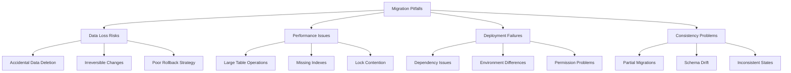

### 13.4 Code Examples

**Pitfall 1: Dropping columns without backup**
```php
<?php
// BAD: Directly dropping important column without preserving data
use Illuminate\Database\Migrations\Migration;
use Illuminate\Database\Schema\Blueprint;
use Illuminate\Support\Facades\Schema;

return new class extends Migration
{
    public function up(): void
    {
        // This could cause permanent data loss!
        Schema::table('users', function (Blueprint $table) {
            $table->dropColumn('important_data');
        });
    }

    public function down(): void
    {
        // How do we restore the lost data?
        Schema::table('users', function (Blueprint $table) {
            $table->text('important_data')->nullable();
        });
    }
};
```

**Solution: Safely rename and migrate data**
```php
<?php
// GOOD: Safely migrate data before dropping column
use Illuminate\Database\Migrations\Migration;
use Illuminate\Database\Schema\Blueprint;
use Illuminate\Support\Facades\Schema;

return new class extends Migration
{
    public function up(): void
    {
        Schema::table('users', function (Blueprint $table) {
            // 1. Add new column
            $table->text('new_data_structure')->nullable();
        });
        
        // 2. Migrate data (do this in chunks for large tables)
        \DB::table('users')
            ->whereNotNull('important_data')
            ->chunk(1000, function ($users) {
                foreach ($users as $user) {
                    \DB::table('users')
                        ->where('id', $user->id)
                        ->update([
                            'new_data_structure' => self::transformOldData($user->important_data)
                        ]);
                }
            });
        
        Schema::table('users', function (Blueprint $table) {
            // 3. Now drop old column
            $table->dropColumn('important_data');
        });
    }

    public function down(): void
    {
        Schema::table('users', function (Blueprint $table) {
            // Add back old column
            $table->text('important_data')->nullable();
        });
        
        // Restore data from new column to old column
        \DB::table('users')
            ->whereNotNull('new_data_structure')
            ->chunk(1000, function ($users) {
                foreach ($users as $user) {
                    \DB::table('users')
                        ->where('id', $user->id)
                        ->update([
                            'important_data' => self::reverseTransform($user->new_data_structure)
                        ]);
                }
            });
        
        Schema::table('users', function (Blueprint $table) {
            $table->dropColumn('new_data_structure');
        });
    }
    
    private static function transformOldData($oldData)
    {
        // Transform old data format to new format
        return json_encode($oldData);
    }
    
    private static function reverseTransform($newData)
    {
        // Reverse the transformation
        return json_decode($newData, true);
    }
};
```

**Pitfall 2: Large table modifications causing downtime**
```php
<?php
// BAD: Modifying large table without considering lock time
use Illuminate\Database\Migrations\Migration;
use Illuminate\Database\Schema\Blueprint;
use Illuminate\Support\Facades\Schema;

return new class extends Migration
{
    public function up(): void
    {
        // This could lock the table for minutes on large datasets!
        Schema::table('large_table_with_millions_of_rows', function (Blueprint $table) {
            $table->string('new_column', 255)->default('default_value');
        });
    }
};
```

**Solution: Use online DDL or chunked updates**
```php
<?php
// GOOD: Handle large table modifications safely
use Illuminate\Database\Migrations\Migration;
use Illuminate\Database\Schema\Blueprint;
use Illuminate\Support\Facades\Schema;
use Illuminate\Support\Facades\DB;

return new class extends Migration
{
    public function up(): void
    {
        Schema::table('large_table_with_millions_of_rows', function (Blueprint $table) {
            // Add nullable column first to avoid populating existing rows immediately
            $table->string('new_column', 255)->nullable();
        });
        
        // Populate in chunks to avoid long locks
        $this->populateColumnInChunks();
        
        // Now make it non-nullable if needed
        Schema::table('large_table_with_millions_of_rows', function (Blueprint $table) {
            $table->string('new_column', 255)->default('default_value')->change();
        });
    }
    
    private function populateColumnInChunks(): void
    {
        $total = DB::table('large_table_with_millions_of_rows')->count();
        $processed = 0;
        $batchSize = 10000;
        
        while ($processed < $total) {
            DB::statement("
                UPDATE large_table_with_millions_of_rows 
                SET new_column = 'default_value' 
                WHERE new_column IS NULL 
                LIMIT {$batchSize}
            ");
            
            $processed += $batchSize;
            
            // Small pause to reduce system load
            sleep(1);
        }
    }
};
```

**Pitfall 3: Forgetting foreign key constraints**
```php
<?php
// BAD: Creating related tables without proper constraints
use Illuminate\Database\Migrations\Migration;
use Illuminate\Database\Schema\Blueprint;
use Illuminate\Support\Facades\Schema;

return new class extends Migration
{
    public function up(): void
    {
        Schema::create('posts', function (Blueprint $table) {
            $table->id();
            $table->unsignedBigInteger('user_id'); // No constraint!
            $table->string('title');
            $table->text('content');
            $table->timestamps();
        });
    }
};
```

**Solution: Always add proper foreign key constraints**
```php
<?php
// GOOD: Include proper foreign key constraints
use Illuminate\Database\Migrations\Migration;
use Illuminate\Database\Schema\Blueprint;
use Illuminate\Support\Facades\Schema;

return new class extends Migration
{
    public function up(): void
    {
        Schema::create('posts', function (Blueprint $table) {
            $table->id();
            $table->foreignId('user_id')
                  ->constrained('users', 'id') // Reference users table
                  ->onDelete('cascade')       // Handle deletions properly
                  ->onUpdate('cascade');      // Handle updates properly
            $table->string('title');
            $table->text('content');
            $table->timestamps();
        });
    }

    public function down(): void
    {
        Schema::dropIfExists('posts');
    }
};
```

**Pitfall 4: Not testing rollback functionality**
```php
<?php
// BAD: Migration that can't be properly rolled back
use Illuminate\Database\Migrations\Migration;
use Illuminate\Database\Schema\Blueprint;
use Illuminate\Support\Facades\Schema;

return new class extends Migration
{
    public function up(): void
    {
        Schema::create('important_table', function (Blueprint $table) {
            $table->id();
            $table->string('name');
            // ... other columns
        });
        
        // Insert critical data that can't be recovered
        \DB::table('important_table')->insert([
            'name' => 'Critical Record',
            'created_at' => now(),
            'updated_at' => now(),
        ]);
    }

    public function down(): void
    {
        // This loses all the inserted data!
        Schema::dropIfExists('important_table');
    }
};
```

**Solution: Always test and implement proper rollback**
```php
<?php
// GOOD: Properly implement rollback with data preservation
use Illuminate\Database\Migrations\Migration;
use Illuminate\Database\Schema\Blueprint;
use Illuminate\Support\Facades\Schema;
use Illuminate\Support\Facades\DB;

return new class extends Migration
{
    public function up(): void
    {
        Schema::create('important_table', function (Blueprint $table) {
            $table->id();
            $table->string('name');
            $table->timestamps();
        });
        
        // Store data in a way that can be recovered if needed
        DB::table('important_table')->insert([
            'name' => 'Critical Record',
            'created_at' => now(),
            'updated_at' => now(),
        ]);
    }

    public function down(): void
    {
        // If data preservation is critical, export it first
        $criticalData = DB::table('important_table')->get();
        
        // Save to a temporary location if needed
        if (app()->environment('local', 'staging')) {
            \Storage::put('rollback_data/important_table_backup.json', 
                         $criticalData->toJson());
        }
        
        Schema::dropIfExists('important_table');
    }
};
```

**Pitfall 5: Environment-specific migrations**
```php
<?php
// BAD: Migration that behaves differently based on environment
use Illuminate\Database\Migrations\Migration;
use Illuminate\Database\Schema\Blueprint;
use Illuminate\Support\Facades\Schema;

return new class extends Migration
{
    public function up(): void
    {
        Schema::create('analytics', function (Blueprint $table) {
            $table->id();
            $table->string('metric');
            $table->decimal('value', 15, 2);
            $table->timestamp('recorded_at');
            
            // This will cause issues in other environments!
            if (app()->environment('production')) {
                $table->index(['metric', 'recorded_at'], 'analytics_metric_time_idx');
            }
        });
    }
};
```

**Solution: Consistent migrations across environments**
```php
<?php
// GOOD: Consistent behavior across all environments
use Illuminate\Database\Migrations\Migration;
use Illuminate\Database\Schema\Blueprint;
use Illuminate\Support\Facades\Schema;

return new class extends Migration
{
    public function up(): void
    {
        Schema::create('analytics', function (Blueprint $table) {
            $table->id();
            $table->string('metric', 100);
            $table->decimal('value', 15, 2);
            $table->timestamp('recorded_at');
            
            // Consistent indexing across environments
            $table->index(['metric', 'recorded_at'], 'analytics_metric_time_idx');
        });
    }

    public function down(): void
    {
        Schema::dropIfExists('analytics');
    }
};
```

**File:** `app/Console/Commands/CheckMigrationSafety.php`
```php
<?php

namespace App\Console\Commands;

use Illuminate\Console\Command;
use Illuminate\Support\Facades\DB;
use Illuminate\Support\Facades\Schema;
use Illuminate\Support\Str;

class CheckMigrationSafety extends Command
{
    protected $signature = 'migrate:check-safety {migration}';
    protected $description = 'Check if a migration is safe to run';

    public function handle()
    {
        $migrationName = $this->argument('migration');
        
        $this->info("Checking safety of migration: {$migrationName}");
        
        // Check if migration file exists
        $migrationFiles = glob(database_path('migrations/*_'.$migrationName.'.php'));
        
        if (empty($migrationFiles)) {
            $this->error("Migration file not found: {$migrationName}");
            return 1;
        }
        
        $migrationFile = $migrationFiles[0];
        $this->checkMigrationFile($migrationFile);
        
        return 0;
    }
    
    private function checkMigrationFile(string $filePath): void
    {
        $content = file_get_contents($filePath);
        
        // Check for potential issues
        $issues = [];
        
        // Check for dangerous operations
        if (preg_match('/dropColumn|dropIfExists|dropForeign/', $content)) {
            $issues[] = 'Contains potentially destructive operations (drop)';
        }
        
        // Check for missing rollback implementation
        if (!preg_match('/public\s+function\s+down\s*\(/', $content)) {
            $issues[] = 'Missing down() method for rollback';
        }
        
        // Check for environment-specific code
        if (preg_match('/app\(\)->environment|env\(|config\(\'app\.env\'/', $content)) {
            $issues[] = 'Contains environment-specific logic';
        }
        
        // Check for large table operations
        preg_match_all('/table\([\'"]([^\'"]+)[\'"]\)/', $content, $matches);
        $tables = $matches[1] ?? [];
        
        foreach ($tables as $table) {
            if ($this->isLargeTable($table)) {
                $issues[] = "Operations on potentially large table: {$table}";
            }
        }
        
        if (empty($issues)) {
            $this->info('✓ Migration appears safe to run');
        } else {
            $this->error('Potential issues found:');
            foreach ($issues as $issue) {
                $this->line("  • {$issue}");
            }
            
            if ($this->confirm('Continue anyway?')) {
                $this->info('Proceeding with caution advised');
            } else {
                $this->info('Operation cancelled');
            }
        }
    }
    
    private function isLargeTable(string $table): bool
    {
        if (!Schema::hasTable($table)) {
            return false;
        }
        
        try {
            // Approximate row count check (may not be accurate on all databases)
            $count = DB::table($table)->count();
            return $count > 100000; // More than 100k rows considered large
        } catch (\Exception $e) {
            return false; // If we can't check, assume it's not large
        }
    }
}
```

**Migration safety checklist:**
```php
<?php

namespace App\Helpers;

class MigrationSafetyChecklist
{
    /**
     * Checklist for safe migration practices
     */
    public static function getChecklist(): array
    {
        return [
            'Before Migration' => [
                'Database backup created',
                'Staging environment tested',
                'Rollback procedure verified',
                'Affected tables identified',
                'Downtime window planned'
            ],
            'During Migration' => [
                'Operations wrapped in transactions when possible',
                'Large operations processed in chunks',
                'Progress monitoring implemented',
                'Error handling in place',
                'Foreign key constraints maintained'
            ],
            'After Migration' => [
                'Data integrity verified',
                'Application functionality tested',
                'Performance benchmarks checked',
                'Rollback plan updated if needed',
                'Team notified of completion'
            ]
        ];
    }

    /**
     * Common warning signs in migration code
     */
    public static function getWarningSigns(): array
    {
        return [
            'Direct SQL statements instead of schema builder',
            'Missing down() method implementation',
            'Operations on tables without checking existence',
            'No foreign key constraints on related tables',
            'Large table modifications without chunking',
            'Environment-specific code in migrations',
            'Dropping columns without data preservation plan',
            'Adding non-nullable columns without defaults',
            'Missing proper error handling',
            'No tests for migration functionality'
        ];
    }
}
```

### 13.5 Dependencies
- Database analysis tools - For checking table sizes
- Testing framework - For validating migration safety
- Monitoring systems - For tracking migration performance
- Backup systems - For data protection

### 13.6 Best Practices to Avoid Pitfalls
- Always implement and test the `down()` method
- Use transactions for complex operations
- Process large tables in chunks
- Maintain consistent behavior across environments
- Create backups before running migrations
- Test migrations in staging before production
- Document potentially destructive operations
- Use foreign key constraints appropriately

---

## 14. Conclusion

### 14.1 Summary
Database migrations in Laravel provide a structured approach to managing database schema changes. Through this comprehensive guide, we've explored the essential aspects of Laravel migrations:

1. **Introduction**: Migrations serve as version control for your database, solving the problem of sharing database schema changes among team members.

2. **Generating Migrations**: The `make:migration` command creates timestamped migration files that ensure proper execution order.

3. **Squashing Migrations**: For mature applications, migration squashing consolidates multiple migrations into a single schema dump.

4. **Migration Structure**: Each migration contains `up()` and `down()` methods for applying and reversing changes.

5. **Running Migrations**: The `migrate` command applies pending migrations in chronological order.

6. **Rolling Back**: Commands like `migrate:rollback` and `migrate:reset` allow reverting applied migrations.

7. **Tables**: Creating, modifying, and dropping tables using the schema builder.

8. **Columns**: Various column types and modifiers for defining table structure.

9. **Indexes**: Creating different types of indexes to optimize query performance.

10. **Foreign Key Constraints**: Maintaining referential integrity between related tables.

11. **Events**: Hooking into the migration process for additional operations.

12. **Best Practices**: Following proven patterns for safe and maintainable migrations.

13. **Common Pitfalls**: Understanding and avoiding frequent migration mistakes.

### 14.2 Key Takeaways

- **Consistency**: Migrations ensure all environments maintain the same database structure
- **Safety**: Always test migrations in non-production environments first
- **Reversibility**: Implement proper `down()` methods for safe rollbacks
- **Performance**: Consider the impact of migrations on large tables
- **Integrity**: Use foreign key constraints to maintain data relationships
- **Organization**: Use descriptive names and follow single responsibility principle

### 14.3 Visualization
```mermaid
graph TB
    A[Migrations Concept] --> B[Generation]
    A --> C[Structure]
    A --> D[Execution]
    A --> E[Management]
    
    B --> F[make:migration]
    B --> G[Naming Conventions]
    B --> H[Squashing]
    
    C --> I[up()/down() Methods]
    C --> J[Schema Builder]
    C --> K[Blueprint]
    
    D --> L[migrate Command]
    D --> M[Rollback]
    D --> N[Status Check]
    
    E --> O[Tables]
    E --> P[Columns]
    E --> Q[Indexes]
    E --> R[Constraints]
    E --> S[Events]
    
    A --> T[Best Practices]
    A --> U[Pitfall Prevention]
```

### 14.4 Next Steps

To deepen your understanding of Laravel migrations, consider exploring:

- Database seeding for initial data population
- Advanced Eloquent relationships
- Query builder optimization
- Database testing strategies
- Deployment pipelines with database migrations

Migrations form the backbone of database management in Laravel applications, enabling teams to evolve their database schemas safely and consistently. By following the patterns and practices outlined in this guide, you'll be well-equipped to manage database changes effectively in your Laravel projects.

Remember to always prioritize data safety, test thoroughly in staging environments, and maintain clear documentation of your migration strategy.