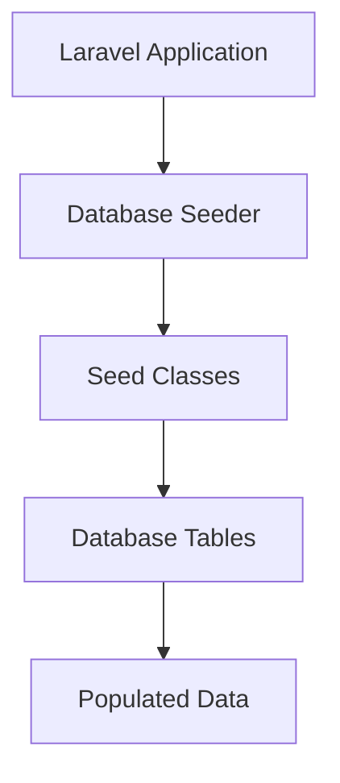
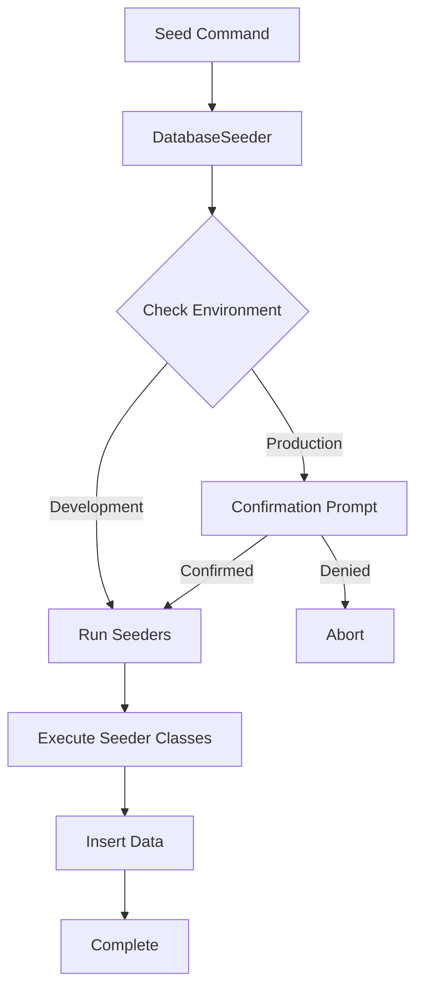
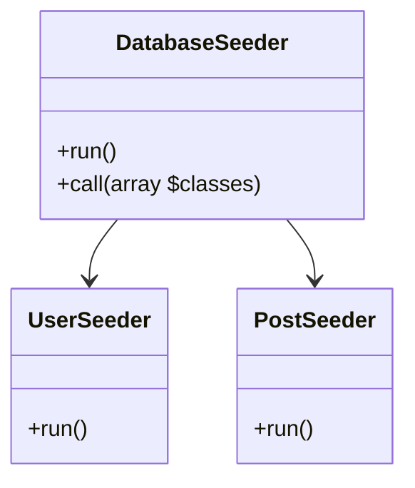
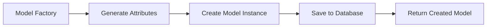

# Database: Seeding

## Introduction

Laravel includes the ability to seed your database with data using seed classes. All seed classes are stored in the `database/seeders` directory. By default, a `DatabaseSeeder` class is defined for you. From this class, you may use the `call` method to run other seed classes, allowing you to control the seeding order.

Mass assignment protection is automatically disabled during database seeding.



## Writing Seeders

To generate a seeder, execute the `make:seeder` Artisan command. All seeders generated by the framework will be placed in the `database/seeders` directory:

```bash
php artisan make:seeder UserSeeder
```

A seeder class only contains one method by default: `run`. This method is called when the `db:seed` Artisan command is executed. Within the `run` method, you may insert data into your database however you wish. You may use the query builder to manually insert data or you may use Eloquent model factories.

As an example, let's modify the default `DatabaseSeeder` class and add a database insert statement to the `run` method:

**File:** `database/seeders/DatabaseSeeder.php`

```php
<?php

namespace Database\Seeders;

use Illuminate\Database\Seeder;
use Illuminate\Support\Facades\DB;
use Illuminate\Support\Facades\Hash;
use Illuminate\Support\Str;

class DatabaseSeeder extends Seeder
{
    /**
     * Run the database seeders.
     */
    public function run(): void
    {
        DB::table('users')->insert([
            'name' => Str::random(10),
            'email' => Str::random(10).'@example.com',
            'password' => Hash::make('password'),
        ]);
    }
}
```

You may type-hint any dependencies you need within the `run` method's signature. They will automatically be resolved via the Laravel service container.

### Using Model Factories

Of course, manually specifying the attributes for each model seed is cumbersome. Instead, you can use model factories to conveniently generate large amounts of database records. First, review the model factory documentation to learn how to define your factories.

For example, let's create 50 users that each has one related post:

**File:** `database/seeders/DatabaseSeeder.php`

```php
<?php

namespace Database\Seeders;

use App\Models\User;
use Illuminate\Database\Seeder;

class DatabaseSeeder extends Seeder
{
    /**
     * Run the database seeders.
     */
    public function run(): void
    {
        User::factory()
            ->count(50)
            ->hasPosts(1)
            ->create();
    }
}
```

### Calling Additional Seeders

Within the `DatabaseSeeder` class, you may use the `call` method to execute additional seed classes. Using the `call` method allows you to break up your database seeding into multiple files so that no single seeder class becomes too large. The `call` method accepts an array of seeder classes that should be executed:

**File:** `database/seeders/DatabaseSeeder.php`

```php
<?php

namespace Database\Seeders;

use Illuminate\Database\Seeder;

class DatabaseSeeder extends Seeder
{
    /**
     * Run the database seeders.
     */
    public function run(): void
    {
        $this->call([
            UserSeeder::class,
            PostSeeder::class,
            CommentSeeder::class,
        ]);
    }
}
```

### Muting Model Events

While running seeds, you may want to prevent models from dispatching events. You may achieve this using the `WithoutModelEvents` trait. When used, the `WithoutModelEvents` trait ensures no model events are dispatched, even if additional seed classes are executed via the `call` method:

**File:** `database/seeders/DatabaseSeeder.php`

```php
<?php

namespace Database\Seeders;

use Illuminate\Database\Seeder;
use Illuminate\Database\Console\Seeds\WithoutModelEvents;

class DatabaseSeeder extends Seeder
{
    use WithoutModelEvents;

    /**
     * Run the database seeders.
     */
    public function run(): void
    {
        $this->call([
            UserSeeder::class,
        ]);
    }
}
```

## Running Seeders

You may execute the `db:seed` Artisan command to seed your database. By default, the `db:seed` command runs the `Database\Seeders\DatabaseSeeder` class, which may in turn invoke other seed classes. However, you may use the `--class` option to specify a specific seeder class to run individually:

```bash
php artisan db:seed
php artisan db:seed --class=UserSeeder
```

You may also seed your database using the `migrate:fresh` command in combination with the `--seed` option, which will drop all tables and re-run all of your migrations. This command is useful for completely re-building your database. The `--seeder` option may be used to specify a specific seeder to run:

```bash
php artisan migrate:fresh --seed
php artisan migrate:fresh --seed --seeder=UserSeeder
```

### Forcing Seeders to Run in Production

Some seeding operations may cause you to alter or lose data. In order to protect you from running seeding commands against your production database, you will be prompted for confirmation before the seeders are executed in the production environment. To force the seeders to run without a prompt, use the `--force` flag:

```bash
php artisan db:seed --force
```

## Visualization

### Database Seeding Flow


### Seeder Class Structure


### Factory Pattern Usage


## Best Practices

1. **Use Model Factories**: Instead of hardcoding data, use factories to generate realistic test data
2. **Organize Seeders**: Break large seeding operations into smaller, focused seeder classes
3. **Disable Model Events**: Use `WithoutModelEvents` trait when seeding to avoid triggering unnecessary events
4. **Order Dependencies**: Use the `call` method to ensure related data is seeded in the correct order
5. **Clean Up**: Consider implementing cleanup logic for test environments
6. **Document Dependencies**: Clearly document any dependencies between seeders
7. **Use Transactions**: Wrap seeding operations in transactions for consistency
8. **Environment Awareness**: Be cautious when running seeders in production

## Common Pitfalls

1. **Forgetting Dependencies**: Not considering the order of seeding related models
2. **Hardcoded Data**: Using hardcoded values instead of factories
3. **Production Accidents**: Forgetting to use `--force` in production or accidentally running in wrong environment
4. **Event Triggering**: Forgetting to mute model events, causing side effects during seeding
5. **Performance Issues**: Seeding large amounts of data without considering performance
6. **Foreign Key Violations**: Not respecting foreign key relationships when seeding
7. **Incomplete Cleanup**: Not properly cleaning up after tests that use seeding

## Examples

### Example 1: Basic User Seeder
```php
<?php

namespace Database\Seeders;

use Illuminate\Database\Seeder;
use Illuminate\Support\Facades\DB;
use Illuminate\Support\Facades\Hash;
use Illuminate\Support\Str;

class UserSeeder extends Seeder
{
    /**
     * Run the database seeds.
     */
    public function run(): void
    {
        DB::table('users')->insert([
            'name' => Str::random(10),
            'email' => Str::random(10).'@gmail.com',
            'password' => Hash::make('password'),
            'created_at' => now(),
            'updated_at' => now(),
        ]);
    }
}
```

### Example 2: Complex Seeder with Relationships
```php
<?php

namespace Database\Seeders;

use App\Models\User;
use App\Models\Post;
use App\Models\Comment;
use Illuminate\Database\Seeder;

class BlogSeeder extends Seeder
{
    /**
     * Run the database seeds.
     */
    public function run(): void
    {
        User::factory()
            ->count(10)
            ->has(
                Post::factory()
                    ->count(5)
                    ->has(
                        Comment::factory()
                            ->count(3)
                    )
            )
            ->create();
    }
}
```

### Example 3: Seeder with Specific Data
```php
<?php

namespace Database\Seeders;

use App\Models\Category;
use Illuminate\Database\Seeder;

class CategorySeeder extends Seeder
{
    /**
     * Run the database seeds.
     */
    public function run(): void
    {
        $categories = [
            ['name' => 'Technology', 'slug' => 'technology'],
            ['name' => 'Health', 'slug' => 'health'],
            ['name' => 'Travel', 'slug' => 'travel'],
            ['name' => 'Food', 'slug' => 'food'],
            ['name' => 'Sports', 'slug' => 'sports'],
        ];

        foreach ($categories as $category) {
            Category::create($category);
        }
    }
}
```

## Conclusion

Database seeding is an essential part of Laravel development, allowing you to populate your database with test data during development and testing. By understanding how to create and organize seeders, you can ensure your application has the necessary data to function properly during development and testing phases.