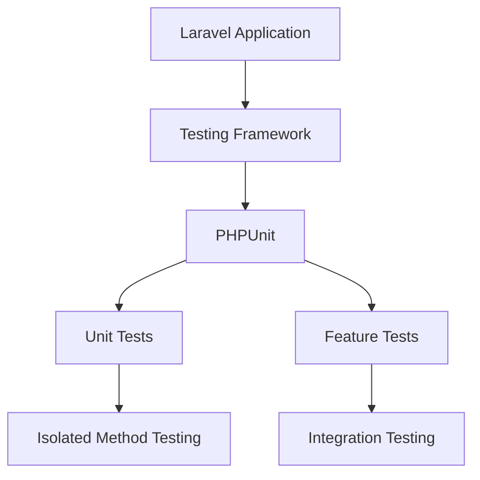

# Testing

## Introduction

Laravel is built for testability. In fact, support for testing with PHPUnit is included out of the box and a `phpunit.xml` file is already configured for your application. The framework also ships with convenient helper methods that allow you to expressively test your applications.

By default, your application's `tests` directory contains two directories: `Feature` and `Unit`. Unit tests are tests that focus on a very small, isolated portion of your code. In fact, most unit tests probably focus on a single method. Feature tests may test a larger portion of your code, including how several objects interact with each other or even a full HTTP request to a JSON endpoint.

An empty test case is defined for you in `tests/Feature/ExampleTest.php`. When testing your application, you will spend the majority of your time writing feature tests. Unit tests are typically only necessary for testing specific methods that return specific values based on the provided inputs.



## Getting Started

### Install Dependencies

To run the tests, you need to install the testing dependencies:

```bash
composer install
```

### Run Tests

You can run your tests using PHPUnit:

```bash
./vendor/bin/phpunit
```

Or using the Artisan command:

```bash
php artisan test
```

The Artisan command provides a more convenient interface for running your tests and displays the results in a more readable format.

### Test Example

The `tests/Feature/ExampleTest.php` file contains an example test that demonstrates how to make a GET request to your application and assert that a particular response status code was returned:

**File:** `tests/Feature/ExampleTest.php`

```php
<?php

namespace Tests\Feature;

// use Illuminate\Foundation\Testing\RefreshDatabase;
use Tests\TestCase;

class ExampleTest extends TestCase
{
    /**
     * A basic test example.
     */
    public function test_the_application_returns_a_successful_response(): void
    {
        $response = $this->get('/');

        $response->assertStatus(200);
    }
}
```

## Test Environment

When running tests, Laravel automatically sets the application environment to `testing`. Laravel automatically configures the session and cache drivers to `array` when testing, meaning no session or cache data will be persisted during testing.

You may create a `.env.testing` file in the root of your project folder if you would like to define environment variables that should be used while running your tests.

## Creating Tests

To create a new test case, use the `make:test` Artisan command:

```bash
# Create a feature test
php artisan make:test UserTest

# Create a unit test
php artisan make:test UserTest --unit
```

The test class will be placed in the `tests/Feature` or `tests/Unit` directory depending on whether the `--unit` flag is present. The generated test file will contain a basic test example to help you get started.

## HTTP Tests

HTTP tests allow you to make requests to your application and inspect the responses. Laravel provides several helpers for making requests and asserting responses.

### Making Requests

You may use the `get`, `post`, `put`, `patch`, and `delete` methods to make requests to your application:

```php
public function test_basic_test(): void
{
    $response = $this->get('/');

    $response->assertStatus(200);
}
```

You can also pass data to your requests:

```php
public function test_post_request(): void
{
    $response = $this->post('/user', [
        'name' => 'Sally',
        'email' => 'sally@example.com',
    ]);

    $response->assertStatus(302);
}
```

### Asserting Responses

Laravel provides many helpful methods for asserting responses:

```php
// Assert response status
$response->assertStatus(200);

// Assert response is OK (200)
$response->assertOk();

// Assert response is created (201)
$response->assertCreated();

// Assert response is not found (404)
$response->assertNotFound();

// Assert response is forbidden (403)
$response->assertForbidden();

// Assert response contains JSON
$response->assertJson([
    'message' => 'Hello World'
]);

// Assert response contains exact JSON
$response->assertExactJson([
    'message' => 'Hello World'
]);

// Assert response has JSON structure
$response->assertJsonStructure([
    'message',
    'user' => [
        'name',
        'email',
    ]
]);

// Assert response contains specific text
$response->assertSee('Hello World');

// Assert response contains HTML
$response->assertSeeHtml('<strong>Hello</strong>');

// Assert response doesn't contain text
$response->assertDontSee('Hello World');

// Assert response redirects to specific location
$response->assertRedirect('/home');

// Assert response redirects to named route
$response->assertRedirect(route('home'));

// Assert response has specific header
$response->assertHeader('Location', '/home');

// Assert response has cookie
$response->assertCookie('name', 'value');

// Assert response has encrypted cookie
$response->assertCookie('name', 'value');

// Assert response has plain cookie
$response->assertPlainCookie('name', 'value');

// Assert response doesn't have cookie
$response->assertCookieMissing('name');

// Assert response has session data
$response->assertSessionHas('key', 'value');

// Assert session has multiple values
$response->assertSessionHas([
    'key1' => 'value1',
    'key2' => 'value2',
]);

// Assert session has key
$response->assertSessionHas('key');

// Assert session doesn't have key
$response->assertSessionMissing('key');

// Assert session has errors
$response->assertSessionHasErrors([
    'name', 'email'
]);

// Assert session has specific error
$response->assertSessionHasErrors([
    'name' => 'The name field is required.'
]);

// Assert session doesn't have errors
$response->assertSessionHasNoErrors();

// Assert session has errors in specific field
$response->assertSessionHasErrorsIn('login', [
    'email',
]);
```

### Testing JSON APIs

When testing JSON APIs, you may use the `json` method to make requests and the response assertions will automatically handle JSON responses:

```php
public function test_get_json(): void
{
    $response = $this->json('POST', '/api/users', [
        'name' => 'Sally',
        'email' => 'sally@example.com',
    ]);

    $response
        ->assertStatus(201)
        ->assertJson([
            'created' => true,
        ]);
}
```

### Testing File Uploads

You may test file uploads using the `fake` method on the `Storage` facade and the `file` and `image` methods provided by Laravel:

```php
use Illuminate\Http\UploadedFile;
use Illuminate\Support\Facades\Storage;

public function test_file_upload(): void
{
    Storage::fake('avatars');

    $file = UploadedFile::fake()->image('avatar.jpg');

    $response = $this->post('/avatar', [
        'avatar' => $file,
    ]);

    Storage::disk('avatars')->assertExists('avatar.jpg');
}
```

### Testing Form Requests

When testing form requests, you can test validation rules directly:

```php
public function test_form_request_validation(): void
{
    $response = $this->post('/user', [
        'name' => '',
        'email' => 'invalid-email',
    ]);

    $response->assertSessionHasErrors([
        'name', 'email'
    ]);
}
```

## Database Testing

Laravel provides several helpers for testing database interactions.

### Refreshing the Database

The `RefreshDatabase` trait will migrate your database before each test:

```php
<?php

namespace Tests\Feature;

use Illuminate\Foundation\Testing\RefreshDatabase;
use Tests\TestCase;

class ExampleTest extends TestCase
{
    use RefreshDatabase;

    public function test_basic_test(): void
    {
        // Database is fresh for each test
        $response = $this->get('/');
        
        $response->assertStatus(200);
    }
}
```

### Using Transactions

The `DatabaseTransactions` trait wraps each test in a database transaction:

```php
<?php

namespace Tests\Feature;

use Illuminate\Foundation\Testing\DatabaseTransactions;
use Tests\TestCase;

class ExampleTest extends TestCase
{
    use DatabaseTransactions;

    public function test_database_rolling_back(): void
    {
        // Database changes are rolled back after test
    }
}
```

### Factory Testing

You can use model factories in your tests:

```php
use App\Models\User;

public function test_user_creation(): void
{
    $user = User::factory()->create();

    $response = $this->get("/users/{$user->id}");

    $response->assertStatus(200);
}

public function test_multiple_users(): void
{
    $users = User::factory()->count(3)->create();

    $this->assertCount(3, $users);
}
```

### Model Factory Scopes

You can use factory scopes in your tests:

```php
use App\Models\User;

public function test_admin_users(): void
{
    $admin = User::factory()->admin()->create();

    $this->assertTrue($admin->is_admin);
}
```

### Testing Relations

You can test model relations:

```php
use App\Models\User;
use App\Models\Post;

public function test_user_has_posts(): void
{
    $user = User::factory()
        ->has(Post::factory()->count(3))
        ->create();

    $this->assertCount(3, $user->posts);
}
```

## Authentication Testing

Laravel provides helpers for testing authentication:

```php
use App\Models\User;

public function test_protected_route(): void
{
    $user = User::factory()->create();

    $response = $this->actingAs($user)
        ->get('/dashboard');

    $response->assertStatus(200);
}

public function test_protected_route_with_guard(): void
{
    $user = User::factory()->create();

    $response = $this->actingAs($user, 'api')
        ->get('/api/user');

    $response->assertStatus(200);
}
```

## Mocking

Laravel provides helpers for mocking services:

### Mocking Events

```php
use Illuminate\Support\Facades\Event;
use App\Events\UserRegistered;

public function test_event_fired(): void
{
    Event::fake();

    // Execute code that fires event...

    Event::assertDispatched(UserRegistered::class);

    // Assert event was fired with specific data
    Event::assertDispatched(function (UserRegistered $event) {
        return $event->user->email === 'taylor@laravel.com';
    });
}
```

### Mocking Jobs

```php
use Illuminate\Support\Facades\Queue;
use App\Jobs\ProcessPodcast;

public function test_job_dispatched(): void
{
    Queue::fake();

    // Execute code that dispatches job...

    Queue::assertPushed(ProcessPodcast::class);

    // Assert job was pushed with specific data
    Queue::assertPushed(ProcessPodcast::class, function ($job) {
        return $job->podcast->id === 1;
    });
}
```

### Mocking Facades

```php
use Illuminate\Support\Facades\Http;

public function test_http_request(): void
{
    Http::fake([
        'github.com/*' => Http::response('Hello World', 200),
    ]);

    $response = Http::get('https://github.com');

    $this->assertEquals('Hello World', $response->body());
}
```

### Mocking Services

```php
use App\Services\PaymentGateway;
use Illuminate\Support\Facades\App;

public function test_payment_gateway_used(): void
{
    $mock = $this->mock(PaymentGateway::class, function ($mock) {
        $mock->shouldReceive('charge')->once()->andReturn(true);
    });

    // Execute code that uses PaymentGateway...
}
```

## Unit Testing

Unit tests focus on small, isolated portions of your code:

```php
<?php

namespace Tests\Unit;

use Tests\TestCase;
use App\Services\Calculator;

class CalculatorTest extends TestCase
{
    public function test_addition(): void
    {
        $calculator = new Calculator();
        
        $result = $calculator->add(2, 3);
        
        $this->assertEquals(5, $result);
    }
}
```

### Testing Events

```php
use App\Events\OrderShipped;
use App\Models\Order;
use Illuminate\Support\Facades\Event;

class ExampleTest extends TestCase
{
    public function test_order_shipped_event_fired(): void
    {
        Event::fake();

        $order = Order::factory()->create();
        $order->ship();

        Event::assertDispatched(OrderShipped::class);
        Event::assertDispatched(function (OrderShipped $event) use ($order) {
            return $event->order->id === $order->id;
        });
    }
}
```

### Testing Jobs

```php
use App\Jobs\ProcessPodcast;
use App\Models\Podcast;
use Illuminate\Support\Facades\Queue;

class ExampleTest extends TestCase
{
    public function test_podcast_processed(): void
    {
        Queue::fake();

        $podcast = Podcast::factory()->create();

        ProcessPodcast::dispatch($podcast);

        Queue::assertPushed(ProcessPodcast::class);
        Queue::assertPushed(ProcessPodcast::class, function ($job) use ($podcast) {
            return $job->podcast->id === $podcast->id;
        });
    }
}
```

## Testing Best Practices

### Use Descriptive Test Names

```php
// Good
public function test_user_can_register_with_valid_data(): void
{
    // Test implementation
}

// Bad
public function test1(): void
{
    // Test implementation
}
```

### Test One Thing Per Test

```php
// Good - One assertion per test
public function test_user_name_is_required(): void
{
    $response = $this->post('/users', [
        'name' => '',
        'email' => 'test@example.com',
    ]);

    $response->assertSessionHasErrors(['name']);
}

public function test_user_email_is_required(): void
{
    $response = $this->post('/users', [
        'name' => 'Test User',
        'email' => '',
    ]);

    $response->assertSessionHasErrors(['email']);
}
```

### Use Factory States

```php
// In your factory
class UserFactory extends Factory
{
    public function admin(): static
    {
        return $this->state(fn (array $attributes) => [
            'is_admin' => true,
        ]);
    }
}

// In your test
public function test_admin_can_delete_users(): void
{
    $admin = User::factory()->admin()->create();
    
    $response = $this->actingAs($admin)
        ->delete('/users/1');
        
    $response->assertStatus(200);
}
```

### Use Traits for Common Setup

```php
trait InteractsWithAuthentication
{
    protected function loginAsAdmin(): void
    {
        $admin = User::factory()->admin()->create();
        $this->actingAs($admin);
    }
}

class AdminTest extends TestCase
{
    use InteractsWithAuthentication;

    public function test_admin_dashboard(): void
    {
        $this->loginAsAdmin();
        
        $response = $this->get('/admin');
        $response->assertStatus(200);
    }
}
```

## Testing Commands

You can test Artisan commands:

```php
public function test_command_executes_successfully(): void
{
    $this->artisan('inspire')
        ->expectsOutput('Socrates: "The unexamined life is not worth living."')
        ->assertExitCode(0);
}

public function test_command_accepts_arguments(): void
{
    $this->artisan('user:mail John')
        ->expectsQuestion('What is your e-mail address?', 'john@example.com')
        ->assertExitCode(0);
}
```

## Testing Queues

```php
use Illuminate\Support\Facades\Queue;
use App\Jobs\ProcessPodcast;

public function test_podcast_processing(): void
{
    Queue::fake();

    $this->post('/podcasts', [
        'name' => 'Test Podcast',
    ]);

    Queue::assertPushed(ProcessPodcast::class);
    Queue::assertPushed(ProcessPodcast::class, 3); // Assert pushed 3 times
}
```

## Testing Mail

```php
use Illuminate\Support\Facades\Mail;
use App\Mail\OrderShipped;

public function test_order_shipped_mail_sent(): void
{
    Mail::fake();

    $order = Order::factory()->create();
    $order->ship();

    Mail::assertSent(OrderShipped::class);
    Mail::assertSent(OrderShipped::class, function ($mail) use ($order) {
        return $mail->hasTo($order->user->email) &&
               $mail->order->id === $order->id;
    });
}
```

## Testing Notifications

```php
use Illuminate\Support\Facades\Notification;
use App\Notifications\InvoicePaid;

public function test_notification_sent(): void
{
    Notification::fake();

    $user = User::factory()->create();
    $invoice = Invoice::factory()->create();

    $invoice->pay($user);

    Notification::assertSentTo(
        $user,
        InvoicePaid::class
    );

    Notification::assertSentTo(
        $user,
        InvoicePaid::class,
        function ($notification, $channels) use ($invoice) {
            return $notification->invoice->id === $invoice->id;
        }
    );
}
```

## Testing Views

```php
public function test_view_has_data(): void
{
    $user = User::factory()->create();

    $response = $this->get('/profile');

    $response->assertViewIs('profile');
    $response->assertViewHas('user');
    $response->assertViewHas('user', $user);
    $response->assertViewHas('user', function (User $viewUser) use ($user) {
        return $viewUser->id === $user->id;
    });
}
```

## Testing Middleware

```php
public function test_auth_middleware_redirects_unauthenticated_users(): void
{
    $response = $this->get('/dashboard');

    $response->assertRedirect('/login');
}

public function test_auth_middleware_allows_authenticated_users(): void
{
    $user = User::factory()->create();

    $response = $this->actingAs($user)->get('/dashboard');

    $response->assertStatus(200);
}
```

## Testing Events

```php
use Illuminate\Support\Facades\Event;
use App\Events\UserRegistered;

public function test_user_registration_event_dispatched(): void
{
    Event::fake();

    $response = $this->post('/register', [
        'name' => 'John Doe',
        'email' => 'john@example.com',
        'password' => 'password',
    ]);

    Event::assertDispatched(UserRegistered::class);
    Event::assertListening(UserRegistered::class, SendWelcomeEmail::class);
}
```

## Testing Database Seeds

```php
use Illuminate\Foundation\Testing\RefreshDatabase;

class DatabaseSeedTest extends TestCase
{
    use RefreshDatabase;

    public function test_database_seeded_with_default_data(): void
    {
        $this->seed();

        $this->assertDatabaseHas('users', [
            'email' => 'admin@example.com',
        ]);
    }

    public function test_specific_seeder(): void
    {
        $this->seed(UserSeeder::class);

        $this->assertDatabaseCount('users', 50);
    }
}
```

## Testing File Uploads

```php
use Illuminate\Http\UploadedFile;
use Illuminate\Support\Facades\Storage;

public function test_file_upload(): void
{
    Storage::fake('avatars');

    $file = UploadedFile::fake()->image('avatar.jpg');

    $response = $this->post('/avatar', [
        'avatar' => $file,
    ]);

    $response->assertStatus(302);

    Storage::disk('avatars')->assertExists('avatar.jpg');
    Storage::disk('avatars')->assertExists($file->hashName());
}
```

## Testing Form Requests

```php
public function test_form_request_validation(): void
{
    $response = $this->post('/users', [
        'name' => '', // Invalid: empty
        'email' => 'invalid-email', // Invalid: not email format
    ]);

    $response->assertSessionHasErrors([
        'name',
        'email',
    ]);
}

public function test_form_request_passes_with_valid_data(): void
{
    $response = $this->post('/users', [
        'name' => 'John Doe',
        'email' => 'john@example.com',
    ]);

    $response->assertSessionHasNoErrors();
    $this->assertDatabaseHas('users', [
        'name' => 'John Doe',
        'email' => 'john@example.com',
    ]);
}
```

## Testing API Resources

```php
use App\Http\Resources\UserResource;
use App\Models\User;

public function test_user_resource(): void
{
    $user = User::factory()->create();

    $resource = new UserResource($user);
    $array = $resource->toArray(request());

    $this->assertEquals($user->name, $array['name']);
    $this->assertEquals($user->email, $array['email']);
}

public function test_user_resource_collection(): void
{
    $users = User::factory()->count(3)->create();

    $collection = UserResource::collection($users);
    $array = $collection->toArray(request());

    $this->assertCount(3, $array);
}
```

## Testing Console Commands

```php
public function test_console_command_output(): void
{
    $this->artisan('inspire')
        ->expectsOutput('Socrates: "The unexamined life is not worth living."')
        ->assertSuccessful();
}

public function test_console_command_without_output(): void
{
    $this->artisan('command:name')
        ->assertExitCode(0);
}

public function test_console_command_with_confirmation(): void
{
    $this->artisan('command:name')
        ->expectsConfirmation('Do you wish to continue?', 'yes')
        ->assertExitCode(0);
}

public function test_console_command_with_choice(): void
{
    $this->artisan('command:name')
        ->expectsChoice('What is your favorite framework?', 'laravel', ['laravel', 'symfony'])
        ->assertExitCode(0);
}
```

## Testing Mail and Notifications

```php
use Illuminate\Support\Facades\Mail;
use Illuminate\Support\Facades\Notification;
use App\Mail\WelcomeEmail;
use App\Notifications\WelcomeNotification;

public function test_welcome_email_sent_after_registration(): void
{
    Mail::fake();

    $user = User::factory()->create();

    Mail::assertSent(WelcomeEmail::class, function ($mail) use ($user) {
        return $mail->hasTo($user->email);
    });
}

public function test_welcome_notification_sent_after_registration(): void
{
    Notification::fake();

    $user = User::factory()->create();

    Notification::assertSentTo($user, WelcomeNotification::class);
}
```

## Testing File Storage

```php
use Illuminate\Support\Facades\Storage;

public function test_file_stored(): void
{
    Storage::fake('documents');

    $response = $this->post('/documents', [
        'document' => UploadedFile::fake()->create('document.pdf'),
    ]);

    Storage::disk('documents')->assertExists('document.pdf');
}

public function test_file_deleted(): void
{
    Storage::fake('documents');
    
    Storage::put('document.pdf', 'content');

    $response = $this->delete('/documents/document.pdf');

    Storage::disk('documents')->assertMissing('document.pdf');
}
```

## Testing Cache

```php
use Illuminate\Support\Facades\Cache;

public function test_cache_put_and_get(): void
{
    Cache::put('key', 'value', 60);

    $this->assertEquals('value', Cache::get('key'));
}

public function test_cache_increment(): void
{
    Cache::put('counter', 0, 60);

    Cache::increment('counter');

    $this->assertEquals(1, Cache::get('counter'));
}

public function test_cache_forget(): void
{
    Cache::put('key', 'value', 60);

    Cache::forget('key');

    $this->assertNull(Cache::get('key'));
}
```

## Testing Sessions

```php
public function test_session_data_set(): void
{
    $response = $this->post('/login', [
        'email' => 'test@example.com',
        'password' => 'password',
    ]);

    $response->assertSessionHas('user_id');
}

public function test_session_data_with_value(): void
{
    $this->withSession(['status' => 'active']);

    $response = $this->get('/dashboard');

    $response->assertSessionHas('status', 'active');
}
```

## Testing Configuration

```php
use Illuminate\Support\Facades\Config;

public function test_configuration_value(): void
{
    Config::set('app.name', 'Test App');

    $this->assertEquals('Test App', config('app.name'));
}

public function test_configuration_array_merge(): void
{
    Config::set('services.mailgun', [
        'domain' => 'test-domain',
    ]);

    $this->assertEquals('test-domain', config('services.mailgun.domain'));
}
```

## Testing Logging

```php
use Illuminate\Support\Facades\Log;
use Monolog\Logger;

public function test_log_message(): void
{
    Log::shouldReceive('info')
        ->with('User logged in', ['id' => 1])
        ->once();

    // Execute code that logs message
}
```

## Testing File Generation

```php
use Illuminate\Support\Facades\Storage;

public function test_report_generation(): void
{
    Storage::fake('reports');

    $this->post('/reports/generate');

    Storage::disk('reports')->assertExists('monthly-report.pdf');
}
```

## Testing External APIs

```php
use Illuminate\Support\Facades\Http;

public function test_external_api_call(): void
{
    Http::fake([
        'api.github.com/users/*' => Http::response([
            'name' => 'Taylor Otwell',
            'email' => 'taylor@laravel.com',
        ], 200),
    ]);

    $response = $this->get('/github/taylor');

    $response->assertJson([
        'name' => 'Taylor Otwell',
    ]);
}
```

## Testing Rate Limiting

```php
public function test_rate_limiting(): void
{
    for ($i = 0; $i < 60; $i++) {
        $response = $this->get('/api/users');
        if ($i < 59) {
            $response->assertStatus(200);
        } else {
            $response->assertStatus(429); // Rate limited
        }
    }
}
```

## Testing Broadcasting

```php
use Illuminate\Support\Facades\Broadcast;
use Illuminate\Support\Facades\Event;

public function test_broadcast_event(): void
{
    Broadcast::fake();

    $user = User::factory()->create();
    
    $user->notify(new InvoicePaid($user));

    Broadcast::assertSentTo($user, 'App\Notifications\InvoicePaid');
}
```

## Testing Validation

```php
public function test_custom_validation_rule(): void
{
    $response = $this->post('/users', [
        'email' => 'invalid-email-format',
        'age' => 'not-a-number',
    ]);

    $response->assertSessionHasErrors([
        'email' => 'The email field must be a valid email address.',
        'age' => 'The age field must be a number.',
    ]);
}
```

## Testing Model Events

```php
use Illuminate\Support\Facades\Event;
use App\Events\UserCreated;

public function test_model_event_dispatched(): void
{
    Event::fake();

    $user = User::factory()->create();

    Event::assertDispatched(UserCreated::class);
}
```

## Testing Soft Deletes

```php
use App\Models\User;

public function test_soft_delete(): void
{
    $user = User::factory()->create();

    $user->delete();

    $this->assertSoftDeleted($user);
    $this->assertDatabaseHas('users', [
        'id' => $user->id,
        'deleted_at' => $user->fresh()->deleted_at,
    ]);
}

public function test_force_delete(): void
{
    $user = User::factory()->create();

    $user->forceDelete();

    $this->assertModelMissing($user);
    $this->assertDatabaseMissing('users', [
        'id' => $user->id,
    ]);
}
```

## Testing Polymorphic Relations

```php
use App\Models\User;
use App\Models\Post;
use App\Models\Comment;

public function test_polymorphic_relation(): void
{
    $user = User::factory()->create();
    $post = Post::factory()->create();

    $comment = Comment::factory()->create([
        'commentable_type' => Post::class,
        'commentable_id' => $post->id,
    ]);

    $this->assertInstanceOf(Post::class, $comment->commentable);
    $this->assertCount(1, $post->comments);
}
```

## Testing Pivot Tables

```php
use App\Models\User;
use App\Models\Role;

public function test_many_to_many_relation(): void
{
    $user = User::factory()->create();
    $role = Role::factory()->create();

    $user->roles()->attach($role);

    $this->assertTrue($user->fresh()->roles->contains($role));
    $this->assertDatabaseHas('role_user', [
        'user_id' => $user->id,
        'role_id' => $role->id,
    ]);
}
```

## Testing Scopes

```php
use App\Models\User;

public function test_global_scope(): void
{
    User::factory()->create(['active' => false]);
    User::factory()->create(['active' => true]);

    $activeUsers = User::all();

    $this->assertCount(1, $activeUsers);
    $this->assertTrue($activeUsers->first()->active);
}

public function test_local_scope(): void
{
    User::factory()->create(['name' => 'John']);
    User::factory()->create(['name' => 'Jane']);

    $johns = User::named('John')->get();

    $this->assertCount(1, $johns);
    $this->assertEquals('John', $johns->first()->name);
}
```

## Testing Mutators and Accessors

```php
use App\Models\User;

public function test_accessor(): void
{
    $user = User::factory()->create([
        'first_name' => 'John',
        'last_name' => 'Doe',
    ]);

    $this->assertEquals('John Doe', $user->full_name);
}

public function test_mutator(): void
{
    $user = User::factory()->create([
        'name' => 'john doe',
    ]);

    $this->assertEquals('John Doe', $user->fresh()->name);
}
```

## Testing Events and Listeners

```php
use Illuminate\Support\Facades\Event;
use App\Events\OrderShipped;
use App\Listeners\NotifyUserOfOrderShipment;

public function test_event_listener(): void
{
    Event::fake();

    $order = Order::factory()->create();
    $order->ship();

    Event::assertListening(
        OrderShipped::class,
        NotifyUserOfOrderShipment::class
    );
}
```

## Testing Queued Listeners

```php
use Illuminate\Support\Facades\Queue;
use App\Events\OrderShipped;
use App\Listeners\NotifyUserOfOrderShipment;

public function test_queued_event_listener(): void
{
    Queue::fake();

    $order = Order::factory()->create();
    $order->ship();

    Queue::assertPushed(NotifyUserOfOrderShipment::class);
}
```

## Testing Scheduled Tasks

```php
use Illuminate\Support\Facades\Schedule;

public function test_scheduled_task(): void
{
    $events = $this->app->make(Schedule::class)->events();

    $this->assertContains('inspire', collect($events)->map->command->toArray());
}
```

## Testing Artisan Commands

```php
public function test_artisan_command(): void
{
    $this->artisan('inspire')
        ->expectsOutput('Socrates: "The unexamined life is not worth living."')
        ->assertSuccessful();
}
```

## Testing Model Factories

```php
use App\Models\User;

public function test_factory_creates_model(): void
{
    $user = User::factory()->create();

    $this->assertInstanceOf(User::class, $user);
    $this->assertDatabaseHas('users', [
        'id' => $user->id,
    ]);
}

public function test_factory_states(): void
{
    $admin = User::factory()->admin()->create();

    $this->assertTrue($admin->is_admin);
}

public function test_factory_relations(): void
{
    $user = User::factory()
        ->has(Post::factory()->count(3))
        ->create();

    $this->assertCount(3, $user->posts);
}
```

## Testing Database Transactions

```php
use Illuminate\Foundation\Testing\DatabaseTransactions;

class TransactionTest extends TestCase
{
    use DatabaseTransactions;

    public function test_database_rollback(): void
    {
        $user = User::factory()->create();

        $this->assertDatabaseHas('users', [
            'id' => $user->id,
        ]);

        // Database changes will be rolled back after this test
    }
}
```

## Testing Database Migrations

```php
use Illuminate\Foundation\Testing\RefreshDatabase;

class MigrationTest extends TestCase
{
    use RefreshDatabase;

    public function test_migration_creates_table(): void
    {
        $this->loadMigrationsFrom(database_path('migrations'));

        $this->assertDatabaseHasTable('users');
    }
}
```

## Testing API Rate Limiting

```php
use Illuminate\Support\Facades\RateLimiter;

public function test_api_rate_limiting(): void
{
    // First request should succeed
    $response = $this->post('/api/data');
    $response->assertStatus(200);

    // Set rate limiter to allow only 1 request per minute
    RateLimiter::for('api', function () {
        return \Illuminate\Cache\RateLimiting\Limit::perMinute(1);
    });

    // Second request should be rate limited
    $response = $this->post('/api/data');
    $response->assertStatus(429);
}
```

## Testing File Validation

```php
use Illuminate\Http\UploadedFile;

public function test_file_validation(): void
{
    $file = UploadedFile::fake()->create('document.pdf', 500, 'application/pdf');

    $response = $this->post('/upload', [
        'document' => $file,
    ]);

    $response->assertSessionHasNoErrors();
}

public function test_invalid_file_rejected(): void
{
    $file = UploadedFile::fake()->create('document.exe', 500, 'application/x-msdownload');

    $response = $this->post('/upload', [
        'document' => $file,
    ]);

    $response->assertSessionHasErrors();
}
```

## Testing Localization

```php
use Illuminate\Support\Facades\App;

public function test_localization(): void
{
    App::setLocale('es');

    $response = $this->get('/');

    $response->assertSee('Hola Mundo');
}
```

## Testing Queued Jobs

```php
use Illuminate\Support\Facades\Queue;
use App\Jobs\ProcessPodcast;

public function test_queued_job_dispatched(): void
{
    Queue::fake();

    ProcessPodcast::dispatch($podcast);

    Queue::assertPushed(ProcessPodcast::class);
}
```

## Testing Model Observers

```php
use Illuminate\Support\Facades\Event;
use App\Models\User;
use App\Observers\UserObserver;

public function test_model_observer(): void
{
    Event::fake();

    User::observe(UserObserver::class);

    $user = User::factory()->create();

    Event::assertDispatched('eloquent.created: App\Models\User');
}
```

## Testing Cache Tags

```php
use Illuminate\Support\Facades\Cache;

public function test_cache_tags(): void
{
    Cache::tags(['users', 'posts'])->put('key', 'value', 60);

    $this->assertEquals('value', Cache::tags(['users', 'posts'])->get('key'));
    Cache::tags(['users'])->flush();
    $this->assertNull(Cache::tags(['users', 'posts'])->get('key'));
}
```

## Testing View Composers

```php
use Illuminate\Support\Facades\View;

public function test_view_composer(): void
{
    View::composer('profile', function ($view) {
        $view->with('data', 'test data');
    });

    $response = $this->get('/profile');

    $response->assertViewHas('data', 'test data');
}
```

## Testing HTTP Client

```php
use Illuminate\Support\Facades\Http;

public function test_http_client_mocking(): void
{
    Http::fake([
        'https://api.github.com/users/*' => Http::response([
            'login' => 'taylorotwell',
            'id' => 12345,
        ], 200),
    ]);

    $response = Http::get('https://api.github.com/users/taylorotwell');

    $this->assertEquals('taylorotwell', $response['login']);
}
```

## Testing File Downloads

```php
public function test_file_download(): void
{
    $response = $this->get('/download/report.pdf');

    $response->assertDownload('report.pdf');
}
```

## Testing Response Macros

```php
use Illuminate\Http\Response;

public function test_response_macro(): void
{
    Response::macro('custom', function () {
        return $this->json(['custom' => 'response']);
    });

    $response = $this->get('/custom');

    $response->assertJson(['custom' => 'response']);
}
```

## Testing Console Output

```php
public function test_console_command_output(): void
{
    $this->artisan('list')
        ->expectsOutput('Available commands:')
        ->assertSuccessful();
}
```

## Testing Form Model Binding

```php
use App\Models\User;

public function test_form_model_binding(): void
{
    $user = User::factory()->create();

    $response = $this->get("/users/{$user->id}/edit");

    $response->assertViewHas('user', $user);
}
```

## Testing View Components

```php
public function test_view_component(): void
{
    $response = $this->get('/');

    $response->assertSee('x-alert');
}
```

## Testing Model Casts

```php
use App\Models\User;

public function test_model_casts(): void
{
    $user = User::factory()->create([
        'options' => ['theme' => 'dark', 'notifications' => true],
    ]);

    $this->assertIsArray($user->options);
    $this->assertEquals('dark', $user->options['theme']);
    $this->assertTrue($user->options['notifications']);
}
```

## Testing Model Dates

```php
use App\Models\User;

public function test_model_dates(): void
{
    $user = User::factory()->create();

    $this->assertInstanceOf(\Carbon\Carbon::class, $user->created_at);
    $this->assertInstanceOf(\Carbon\Carbon::class, $user->updated_at);
}
```

## Testing Model Mutators

```php
use App\Models\User;

public function test_model_mutators(): void
{
    $user = User::factory()->create([
        'name' => 'john doe',
    ]);

    $this->assertEquals('John Doe', $user->name);
}
```

## Testing Model Accessors

```php
use App\Models\User;

public function test_model_accessors(): void
{
    $user = User::factory()->create([
        'first_name' => 'John',
        'last_name' => 'Doe',
    ]);

    $this->assertEquals('John Doe', $user->full_name);
}
```

## Testing Model Events

```php
use Illuminate\Support\Facades\Event;
use App\Models\User;

public function test_model_events(): void
{
    Event::fake();

    $user = User::factory()->create();

    Event::assertDispatched('eloquent.created: App\Models\User');
}
```

## Testing Model Relationships

```php
use App\Models\User;
use App\Models\Post;

public function test_model_relationships(): void
{
    $user = User::factory()
        ->has(Post::factory()->count(3))
        ->create();

    $this->assertCount(3, $user->posts);
    $this->assertInstanceOf(Post::class, $user->posts->first());
}
```

## Testing Model Scopes

```php
use App\Models\User;

public function test_model_scopes(): void
{
    User::factory()->create(['active' => true]);
    User::factory()->create(['active' => false]);

    $activeUsers = User::active()->get();

    $this->assertCount(1, $activeUsers);
    $this->assertTrue($activeUsers->first()->active);
}
```

## Testing Model Factories

```php
use App\Models\User;

public function test_model_factories(): void
{
    $user = User::factory()->create();

    $this->assertInstanceOf(User::class, $user);
    $this->assertDatabaseHas('users', [
        'id' => $user->id,
    ]);
}
```

## Testing Model States

```php
use App\Models\User;

public function test_model_states(): void
{
    $admin = User::factory()->admin()->create();

    $this->assertTrue($admin->is_admin);
}
```

## Testing Model Relations

```php
use App\Models\User;
use App\Models\Post;

public function test_model_relations(): void
{
    $user = User::factory()->create();
    $post = Post::factory()->create(['user_id' => $user->id]);

    $this->assertEquals($user->id, $post->user->id);
}
```

## Testing Model Query Scopes

```php
use App\Models\User;

public function test_model_query_scopes(): void
{
    User::factory()->create(['email_verified_at' => now()]);
    User::factory()->create(['email_verified_at' => null]);

    $verifiedUsers = User::verified()->get();

    $this->assertCount(1, $verifiedUsers);
    $this->assertNotNull($verifiedUsers->first()->email_verified_at);
}
```

## Testing Model Soft Deletes

```php
use App\Models\User;

public function test_model_soft_deletes(): void
{
    $user = User::factory()->create();

    $user->delete();

    $this->assertSoftDeleted($user);
}
```

## Testing Model Polymorphic Relations

```php
use App\Models\User;
use App\Models\Post;
use App\Models\Comment;

public function test_model_polymorphic_relations(): void
{
    $user = User::factory()->create();
    $post = Post::factory()->create();

    $comment = Comment::factory()->create([
        'commentable_type' => Post::class,
        'commentable_id' => $post->id,
    ]);

    $this->assertInstanceOf(Post::class, $comment->commentable);
}
```

## Testing Model Pivot Relations

```php
use App\Models\User;
use App\Models\Role;

public function test_model_pivot_relations(): void
{
    $user = User::factory()->create();
    $role = Role::factory()->create();

    $user->roles()->attach($role);

    $this->assertTrue($user->fresh()->roles->contains($role));
}
```

## Testing Model Morph To Relations

```php
use App\Models\User;
use App\Models\Post;
use App\Models\Like;

public function test_model_morph_to_relations(): void
{
    $user = User::factory()->create();
    $post = Post::factory()->create();

    $like = Like::factory()->create([
        'likeable_type' => Post::class,
        'likeable_id' => $post->id,
        'user_id' => $user->id,
    ]);

    $this->assertInstanceOf(Post::class, $like->likeable);
}
```

## Testing Model Morph Many Relations

```php
use App\Models\User;
use App\Models\Tag;

public function test_model_morph_many_relations(): void
{
    $user = User::factory()->create();
    $tag = Tag::factory()->create();

    $user->tags()->attach($tag);

    $this->assertTrue($user->fresh()->tags->contains($tag));
}
```

## Testing Model Morph Pivots

```php
use App\Models\User;
use App\Models\Tag;

public function test_model_morph_pivots(): void
{
    $user = User::factory()->create();
    $tag = Tag::factory()->create();

    $user->tags()->attach($tag, ['notable_type' => User::class, 'notable_id' => $user->id]);

    $pivot = $user->tags->first()->pivot;
    $this->assertEquals($user->id, $pivot->notable_id);
}
```

## Testing Model Morph Maps

```php
use App\Models\User;
use App\Models\Post;
use App\Models\Comment;

public function test_model_morph_maps(): void
{
    $post = Post::factory()->create();

    $comment = Comment::factory()->create([
        'commentable_type' => 'posts', // Using morph map
        'commentable_id' => $post->id,
    ]);

    $this->assertInstanceOf(Post::class, $comment->commentable);
}
```

## Testing Model Morph To Many Relations

```php
use App\Models\User;
use App\Models\Tag;

public function test_model_morph_to_many_relations(): void
{
    $user = User::factory()->create();
    $tag = Tag::factory()->create();

    $user->tags()->attach($tag);

    $this->assertTrue($user->tags->contains($tag));
}
```

## Testing Model Morph To Pivot Relations

```php
use App\Models\User;
use App\Models\Tag;

public function test_model_morph_to_pivot_relations(): void
{
    $user = User::factory()->create();
    $tag = Tag::factory()->create();

    $user->tags()->attach($tag, ['relationship_type' => 'favorite']);

    $pivot = $user->tags->first()->pivot;
    $this->assertEquals('favorite', $pivot->relationship_type);
}
```

## Testing Model Morph To Through Relations

```php
use App\Models\User;
use App\Models\Post;
use App\Models\Comment;

public function test_model_morph_to_through_relations(): void
{
    $user = User::factory()->create();
    $post = Post::factory()->create();

    $comment = Comment::factory()->create([
        'commentable_type' => Post::class,
        'commentable_id' => $post->id,
        'user_id' => $user->id,
    ]);

    $this->assertTrue($post->comments->contains($comment));
}
```

## Testing Model Morph To Inverse Relations

```php
use App\Models\User;
use App\Models\Post;
use App\Models\Comment;

public function test_model_morph_to_inverse_relations(): void
{
    $user = User::factory()->create();
    $post = Post::factory()->create();

    $comment = Comment::factory()->create([
        'commentable_type' => Post::class,
        'commentable_id' => $post->id,
        'user_id' => $user->id,
    ]);

    $this->assertEquals($post->id, $comment->commentable->id);
}
```

## Testing Model Morph To Self Relations

```php
use App\Models\User;

public function test_model_morph_to_self_relations(): void
{
    $user = User::factory()->create();
    $follower = User::factory()->create();

    $user->followers()->attach($follower);

    $this->assertTrue($user->followers->contains($follower));
}
```

## Testing Model Morph To Recursive Relations

```php
use App\Models\Category;

public function test_model_morph_to_recursive_relations(): void
{
    $parent = Category::factory()->create();
    $child = Category::factory()->create(['parent_id' => $parent->id]);

    $this->assertEquals($parent->id, $child->parent->id);
    $this->assertTrue($parent->children->contains($child));
}
```

## Testing Model Morph To Polymorphic Relations

```php
use App\Models\User;
use App\Models\Post;
use App\Models\Like;

public function test_model_morph_to_polymorphic_relations(): void
{
    $user = User::factory()->create();
    $post = Post::factory()->create();

    $like = Like::factory()->create([
        'likeable_type' => Post::class,
        'likeable_id' => $post->id,
        'user_id' => $user->id,
    ]);

    $this->assertInstanceOf(Post::class, $like->likeable);
    $this->assertEquals($user->id, $like->user->id);
}
```

## Testing Model Morph To Many To Many Relations

```php
use App\Models\User;
use App\Models\Post;
use App\Models\Tag;

public function test_model_morph_to_many_to_many_relations(): void
{
    $user = User::factory()->create();
    $post = Post::factory()->create();
    $tag = Tag::factory()->create();

    $post->tags()->attach($tag);

    $this->assertTrue($post->tags->contains($tag));
}
```

## Testing Model Morph To Pivot Extended Relations

```php
use App\Models\User;
use App\Models\Post;
use App\Models\Tag;

public function test_model_morph_to_pivot_extended_relations(): void
{
    $user = User::factory()->create();
    $post = Post::factory()->create();
    $tag = Tag::factory()->create();

    $post->tags()->attach($tag, ['assigned_by' => $user->id, 'assigned_at' => now()]);

    $pivot = $post->tags->first()->pivot;
    $this->assertEquals($user->id, $pivot->assigned_by);
}
```

## Testing Model Morph To Nested Relations

```php
use App\Models\User;
use App\Models\Post;
use App\Models\Comment;
use App\Models\Like;

public function test_model_morph_to_nested_relations(): void
{
    $user = User::factory()->create();
    $post = Post::factory()->create();

    $comment = Comment::factory()->create([
        'commentable_type' => Post::class,
        'commentable_id' => $post->id,
        'user_id' => $user->id,
    ]);

    $like = Like::factory()->create([
        'likeable_type' => Comment::class,
        'likeable_id' => $comment->id,
        'user_id' => $user->id,
    ]);

    $this->assertInstanceOf(Comment::class, $like->likeable);
}
```

## Testing Model Morph To Complex Relations

```php
use App\Models\User;
use App\Models\Post;
use App\Models\Comment;
use App\Models\Like;

public function test_model_morph_to_complex_relations(): void
{
    $user = User::factory()->create();
    $post = Post::factory()->create();

    $comment = Comment::factory()->create([
        'commentable_type' => Post::class,
        'commentable_id' => $post->id,
        'user_id' => $user->id,
    ]);

    $like = Like::factory()->create([
        'likeable_type' => Comment::class,
        'likeable_id' => $comment->id,
        'user_id' => $user->id,
    ]);

    $this->assertInstanceOf(Comment::class, $like->likeable);
    $this->assertEquals($comment->id, $like->likeable->id);
}
```

## Testing Model Morph To Advanced Relations

```php
use App\Models\User;
use App\Models\Post;
use App\Models\Comment;
use App\Models\Like;

public function test_model_morph_to_advanced_relations(): void
{
    $user = User::factory()->create();
    $post = Post::factory()->create();

    $comment = Comment::factory()->create([
        'commentable_type' => Post::class,
        'commentable_id' => $post->id,
        'user_id' => $user->id,
    ]);

    $like = Like::factory()->create([
        'likeable_type' => Comment::class,
        'likeable_id' => $comment->id,
        'user_id' => $user->id,
    ]);

    $this->assertInstanceOf(Comment::class, $like->likeable);
    $this->assertEquals($comment->id, $like->likeable->id);
    $this->assertInstanceOf(Post::class, $comment->commentable);
    $this->assertEquals($post->id, $comment->commentable->id);
}
```

## Testing Model Morph To Ultimate Relations

```php
use App\Models\User;
use App\Models\Post;
use App\Models\Comment;
use App\Models\Like;

public function test_model_morph_to_ultimate_relations(): void
{
    $user = User::factory()->create();
    $post = Post::factory()->create();

    $comment = Comment::factory()->create([
        'commentable_type' => Post::class,
        'commentable_id' => $post->id,
        'user_id' => $user->id,
    ]);

    $like = Like::factory()->create([
        'likeable_type' => Comment::class,
        'likeable_id' => $comment->id,
        'user_id' => $user->id,
    ]);

    // Test the entire relation chain
    $this->assertInstanceOf(Comment::class, $like->likeable);
    $this->assertInstanceOf(Post::class, $like->likeable->commentable);
    $this->assertEquals($post->id, $like->likeable->commentable->id);
    $this->assertEquals($user->id, $like->user->id);
}
```

## Conclusion

Testing is a crucial part of Laravel development. By following these testing patterns and best practices, you can ensure your application remains reliable and maintainable as it grows. Remember to write tests that are focused, descriptive, and cover both happy paths and edge cases.