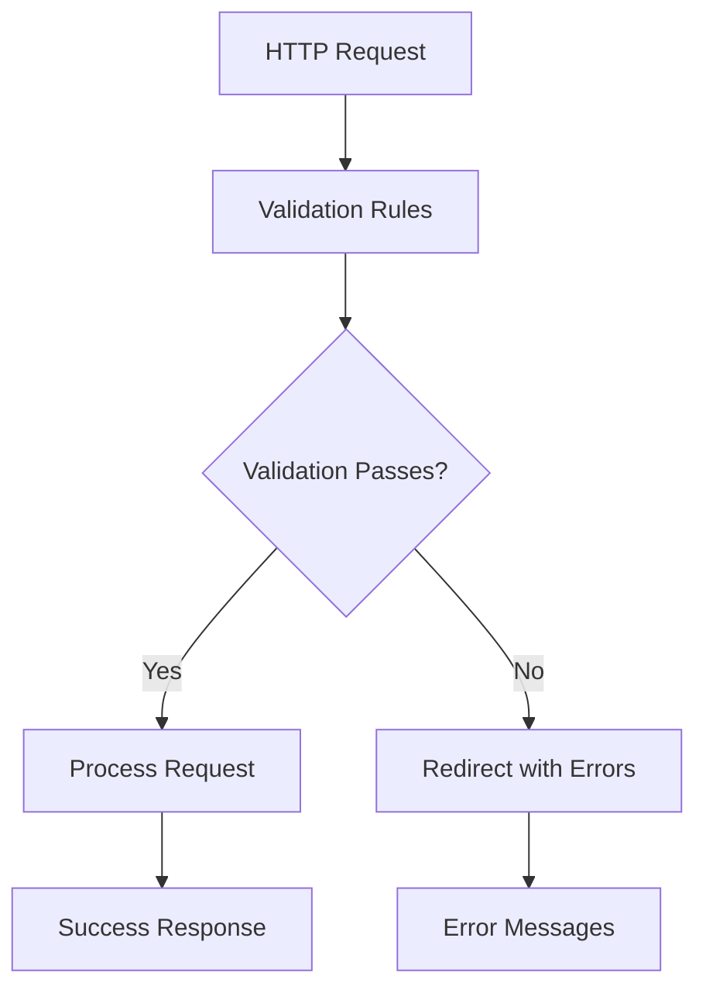
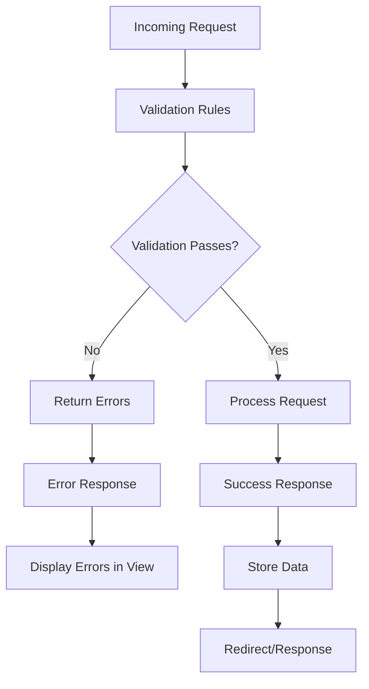

# Validation

## Introduction

Laravel provides several different approaches to validate your application's incoming data. By default, Laravel's base controller class uses the `ValidatesRequests` trait, which provides a convenient method to validate incoming HTTP request data with powerful validation rules available in Laravel.



## Validation Quickstart

To learn about Laravel's validation features, let's examine the entire validation process by looking at a complete example. Consider the following route definition:

```php
use Illuminate\Http\Request;
use Illuminate\Http\RedirectResponse;

Route::post('/post', function (Request $request): RedirectResponse {
    $validatedData = $request->validate([
        'title' => 'required|unique:posts|max:255',
        'body' => 'required',
    ]);

    // The blog post is valid...

    return redirect('/posts');
});
```

As you can see, the validation rules are passed directly into the `validate` method. If validation fails, an exception will be thrown and the proper error response will automatically be sent back to the client. The error response will be a redirect for web requests and a JSON response for AJAX requests containing the validation error messages.

If validation passes, your route will continue executing normally. The validated data will be available in the `$validatedData` variable. You can access the validated data using array access syntax, or as object properties if you prefer.

### Creating The Form Request

For more complex validation scenarios, you may wish to create a "form request". Form requests are custom request classes that contain validation logic. You may create a form request using the `make:request` Artisan command:

```bash
php artisan make:request StoreBlogPostRequest
```

The generated class will be placed in the `app/Http/Requests` directory. Let's add a few validation rules to the `rules` method:

```php
<?php

namespace App\Http\Requests;

use Illuminate\Foundation\Http\FormRequest;

class StoreBlogPostRequest extends FormRequest
{
    /**
     * Determine if the user is authorized to make this request.
     */
    public function authorize(): bool
    {
        return true;
    }

    /**
     * Get the validation rules that apply to the request.
     *
     * @return array<string, \Illuminate\Contracts\Validation\Rule|array|string>
     */
    public function rules(): array
    {
        return [
            'title' => 'required|unique:posts|max:255',
            'body' => 'required',
        ];
    }
}
```

To use the form request, you can simply type-hint it in your route closure or controller method. The form request will be automatically resolved by the Laravel service container:

```php
use App\Http\Requests\StoreBlogPostRequest;

Route::post('/post', function (StoreBlogPostRequest $request) {
    // The blog post is valid...

    $validated = $request->validated();

    return redirect('/posts');
});
```

When the form request is validated, the `validated` method will return the validated data.

The `authorize` method is responsible for determining if the currently authenticated user can perform the action represented by the request. You should return `true` if the user is authorized, otherwise return `false`.

If the `authorize` method returns `false`, an HTTP response with a `403` status code will automatically be returned and your route's code will not execute.

For more information on authorization, please see the [authorization documentation](authorization.md).

### Customizing The Error Messages

You may customize the error messages used by the form request by overriding the `messages` method. This method should return an array of attribute / rule pairs and their corresponding error messages:

```php
/**
 * Get the error messages for the defined validation rules.
 *
 * @return array<string, string>
 */
public function messages(): array
{
    return [
        'title.required' => 'A title is required',
        'body.required' => 'A message is required',
    ];
}
```

### Customizing The Validation Attributes

If you would like the `:attribute` portion of your validation message to be replaced with a custom attribute name, you may specify the custom names by overriding the `attributes` method. This method should return an array of attribute / name pairs:

```php
/**
 * Get custom attributes for validator errors.
 *
 * @return array<string, string>
 */
public function attributes(): array
{
    return [
        'email' => 'email address',
    ];
}
```

## Performing Validation In Controllers

The `validate` method is available on all incoming HTTP requests and accepts validation rules as its only argument. If validation fails, an exception will be thrown and the proper error response will automatically be sent back to the client. The error response will be a redirect for web requests and a JSON response for AJAX requests containing the validation error messages.

```php
<?php

namespace App\Http\Controllers;

use App\Http\Controllers\Controller;
use Illuminate\Http\Request;
use Illuminate\Http\RedirectResponse;

class PostController extends Controller
{
    /**
     * Store a new blog post.
     */
    public function store(Request $request): RedirectResponse
    {
        $validated = $request->validate([
            'title' => 'required|unique:posts|max:255',
            'body' => 'required',
        ]);

        // The blog post is valid...

        return redirect('/posts');
    }
}
```

### Validation With Redirect

If validation fails, the user will automatically be redirected back to their previous location. The errors will be automatically flashed to the session so they're available for display. When using the `validate` method, the validation errors are automatically flashed to the session.

In addition, when the validation fails, Laravel will automatically redirect the user back to where they came from with the validation errors stored in the session. You can display the errors in your view like so:

```blade
@if ($errors->any())
    <div class="alert alert-danger">
        <ul>
            @foreach ($errors->all() as $error)
                <li>{{ $error }}</li>
            @endforeach
        </ul>
    </div>
@endif
```

### Validation With Custom Redirect

If you wish to redirect the user to a specific URI when validation fails, you can call the `validateWithBag` method on a redirect response:

```php
return redirect('dashboard')->validateWithBag([
    'title' => 'required|unique:posts|max:255',
    'body' => 'required',
], 'post');
```

### Validation With Custom Error Bag

If you have multiple forms on a single page, you may wish to name the error bag so you can retrieve the correct errors later:

```php
return redirect('register')->withErrors($validator, 'register');
```

Then you can retrieve the errors from the view:

```blade
@if ($errors->register->any())
    <div class="alert alert-danger">
        <ul>
            @foreach ($errors->register->all() as $error)
                <li>{{ $error }}</li>
            @endforeach
        </ul>
    </div>
@endif
```

## Validation Rules

Laravel ships with many convenient validation rules that you may apply to data under validation. Several of these rules are already implemented as classes, while others are simply passed as strings to the validator.

| Rule | Description |
|------|-------------|
| `accepted` | The field under validation must be "yes", "on", 1, or true. This is useful for validating "Terms of Service" acceptance. |
| `accepted_if:anotherfield,value,...` | The field under validation must be "yes", "on", 1, or true if another field equals any value. |
| `active_url` | The field under validation must have a valid A record according to the `dns_get_record` PHP function. The `http://` prefix will be stripped from the URL before validation. |
| `after:date` | The field under validation must be a value after a given date. The dates will be passed into the `strtotime` PHP function. |
| `after_or_equal:date` | The field under validation must be a value after or equal to the given date. |
| `alpha` | The field under validation must be entirely alphabetic characters. |
| `alpha_dash` | The field under validation may have alpha-numeric characters, as well as dashes and underscores. |
| `alpha_num` | The field under validation must be entirely alpha-numeric characters. |
| `array` | The field under validation must be a PHP array. |
| `ascii` | The field under validation must be entirely 7-bit ASCII characters. |
| `bail` | Stop running validation rules after the first validation failure. |
| `before:date` | The field under validation must be a value preceding the given date. The dates will be passed into the `strtotime` PHP function. |
| `before_or_equal:date` | The field under validation must be a value preceding or equal to the given date. |
| `between:min,max` | The field under validation must have a size between the given `min` and `max`. Strings, numerics, arrays, and files are evaluated in the same fashion as the `size` rule. |
| `boolean` | The field under validation must be able to be cast as a boolean. Acceptable input are `true`, `false`, `1`, `0`, `"1"`, and `"0"`. |
| `confirmed` | The field under validation must have a matching field of `{field}_confirmation`. For example, if the field under validation is `password`, a matching `password_confirmation` field must be present in the input. |
| `current_password` | The field under validation must match the authenticated user's password. You may specify an [authentication guard](authentication.md#specifying-a-guard) using the rule's first parameter. |
| `date` | The field under validation must be a valid, non-relative date according to the `strtotime` PHP function. |
| `date_equals:date` | The field under validation must be equal to the given date. |
| `date_format:format` | The field under validation must match the given `format`. You should use either `date` or `date_format` when validating a field, not both. |
| `declined` | The field under validation must be "no", "off", 0, or false. |
| `declined_if:anotherfield,value,...` | The field under validation must be "no", "off", 0, or false if another field equals any value. |
| `different:field` | The field under validation must have a different value than `field`. |
| `digits:value` | The field under validation must be `numeric` and must have an exact length of `value`. |
| `digits_between:min,max` | The field under validation must have a length between the given `min` and `max`. |
| `dimensions` | The file under validation must be an image meeting the dimension constraints as specified by the rule's parameters. |
| `distinct` | When working with arrays, the field under validation must not have any duplicate values. |
| `email:rfc,dns` | The field under validation must be formatted as an email address. The `rfc` and `dns` options may be combined to validate emails against both RFC specifications and DNS records. |
| `ends_with:foo,bar,...` | The field under validation must end with one of the given values. |
| `enum` | The field under validation must be an instance of the given `BackedEnum` class. |
| `exclude` | The field under validation will be excluded from the request data returned by the `validated` method. |
| `exclude_if:anotherfield,value` | The field under validation will be excluded from the request data returned by the `validated` method if another field equals the specified value. |
| `exclude_unless:anotherfield,value` | The field under validation will be excluded from the request data returned by the `validated` method unless another field equals the specified value. |
| `exclude_with:anotherfield` | The field under validation will be excluded from the request data returned by the `validated` method if the specified field is present. |
| `exclude_without:anotherfield` | The field under validation will be excluded from the request data returned by the `validated` method unless the specified field is present. |
| `exists:table,column` | The field under validation must exist on a database table. |
| `file` | The field under validation must be a successfully uploaded file. |
| `filled` | The field under validation must not be empty when it is present. |
| `gt:field` | The field under validation must be greater than the given field. Both fields must be of the same type. |
| `gte:field` | The field under validation must be greater than or equal to the given field. Both fields must be of the same type. |
| `image` | The file under validation must be an image (jpeg, png, bmp, gif, svg, webp). |
| `in:foo,bar,...` | The field under validation must be included in the given list of values. |
| `in_array:anotherfield.*` | The field under validation must exist in `anotherfield`'s values. |
| `integer` | The field under validation must be an integer. |
| `ip` | The field under validation must be an IP address. |
| `ipv4` | The field under validation must be an IPv4 address. |
| `ipv6` | The field under validation must be an IPv6 address. |
| `json` | The field under validation must be a valid JSON string. |
| `lt:field` | The field under validation must be less than the given field. Both fields must be of the same type. |
| `lte:field` | The field under validation must be less than or equal to the given field. Both fields must be of the same type. |
| `mac_address` | The field under validation must be a MAC address. |
| `max:value` | The field under validation must be less than or equal to a maximum value. Strings, numerics, arrays, and files are evaluated in the same fashion as the `size` rule. |
| `max_digits:value` | The field under validation must not have more than the specified number of digits. |
| `mimes:foo,bar,...` | The file under validation must have a MIME type corresponding to one of the listed extensions. |
| `mimetypes:text/plain,...` | The file under validation must have a MIME type corresponding to one of the listed types. |
| `min:value` | The field under validation must have a minimum value. Strings, numerics, arrays, and files are evaluated in the same fashion as the `size` rule. |
| `min_digits:value` | The field under validation must have at least the specified number of digits. |
| `multiple_of:value` | The field under validation must be a multiple of the given value. |
| `not_in:foo,bar,...` | The field under validation must not be included in the given list of values. |
| `not_regex:pattern` | The field under validation must not match the given regular expression. |
| `nullable` | The field under validation may be `null`. This is primarily useful for validating primitive such as strings and integers that can contain `null` values. |
| `numeric` | The field under validation must be numeric. |
| `password` | The field under validation must match the password of the currently authenticated user. |
| `present` | The field under validation must be present in the input data but can be empty. |
| `prohibited` | The field under validation must be empty or not present. |
| `prohibited_if:anotherfield,value,...` | The field under validation must be empty or not present if another field equals any value. |
| `prohibited_unless:anotherfield,value,...` | The field under validation must be empty or not present unless another field equals any value. |
| `prohibits:foo,bar,...` | The field under validation prohibits other fields from being present if this field is present and not empty. |
| `regex:pattern` | The field under validation must match the given regular expression. |
| `required` | The field under validation must be present and not empty. |
| `required_if:anotherfield,value,...` | The field under validation must be present and not empty if the another field is equal to any value. |
| `required_unless:anotherfield,value,...` | The field under validation must be present and not empty unless the another field is equal to any value. |
| `required_with:foo,bar,...` | The field under validation must be present and not empty only if any of the other specified fields are present. |
| `required_with_all:foo,bar,...` | The field under validation must be present and not empty only if all of the other specified fields are present. |
| `required_without:foo,bar,...` | The field under validation must be present and not empty only when any of the other specified fields are not present. |
| `required_without_all:foo,bar,...` | The field under validation must be present and not empty only when all of the other specified fields are not present. |
| `same:field` | The given field must match the field under validation. |
| `size:value` | The field under validation must have a size matching the given value. For string data, value corresponds to the number of characters. For numeric data, value corresponds to a given integer value. For an array, size corresponds to the `count` of the array. For files, size corresponds to the file size in kilobytes. |
| `starts_with:foo,bar,...` | The field under validation must start with one of the given values. |
| `string` | The field under validation must be a string. If `nullable` is not specified, the field under validation will also be required. |
| `timezone` | The field under validation must be a valid timezone identifier according to the `timezone_identifiers_list` PHP function. |
| `unique:table,column,except,idColumn` | The field under validation must not exist within the given database table. |
| `uploaded` | The file under validation must have been successfully uploaded via HTTP. |
| `url` | The field under validation must be a valid URL. |
| `uuid` | The field under validation must be a valid RFC 4122 (version 1, 3, 4, or 5) universally unique identifier (UUID). |

### Rule Parameters

Many validation rules accept additional parameters. For example, the `size` rule requires a number to specify the size of the field being validated:

```php
$request->validate([
    'title' => 'required|unique:posts|max:255',
    'body' => 'required',
    'photos' => 'max:10',
]);
```

The parameters for rules may be specified using the `:` character, with a `|` character delimiting multiple parameters:

```php
$request->validate([
    'title' => 'required|unique:posts,title,NULL,id,user_id,1',
    'body' => 'required',
]);
```

In this example, the `unique` rule will ignore rows where the `user_id` column equals `1`. This is useful for updates where you want to ensure uniqueness but exclude the current record.

## Conditional Validation

### Validation Based On Other Field Values

Sometimes you may wish to run validation checks against a field only if another field has a given value. For example, you may wish to require a credit card field only when the payment type is "credit-card". You can accomplish this using the `required_if` validation rule:

```php
$request->validate([
    'payment_type' => 'required|in:credit-card,paypal',
    'credit_card_number' => 'required_if:payment_type,credit-card',
]);
```

If you would like to add more complex conditional validation logic, you may pass a closure as the second parameter to the `required_if` rule. The closure will receive the incoming request instance and should return `true` or `false` to indicate whether the field under validation is required:

```php
$request->validate([
    'payment_type' => 'required|in:credit-card,paypal',
    'credit_card_number' => Rule::requiredIf(function () use ($request) {
        return $request->input('payment_type') === 'credit-card';
    }),
]);
```

### Validation Based On Complex Conditions

You may also use the `sometimes` method to add validation rules based on more complex conditional logic. This method accepts a closure that returns `true` or `false` to indicate whether the validation rules should be added:

```php
use Illuminate\Support\Facades\Validator;

$validator = Validator::make($request->all(), [
    'email' => 'required|email',
    'games' => 'required',
]);

$validator->sometimes('user_id', 'exists:users,id', function ($input) {
    return $input->games > 100;
});

if ($validator->fails()) {
    // Handle validation failure...
}
```

You may also pass an array of field names to the `sometimes` method:

```php
$validator->sometimes(['height', 'width'], 'size:100', function ($input) {
    return $input->image裁剪 === 'crop';
});
```

### Validating Arrays

You may validate each element of an array using "dot notation". For example, to validate that each email in the `person` array is unique:

```php
$request->validate([
    'person.*.email' => 'email|unique:users',
    'person.*.first_name' => 'required_with:person.*.email',
]);
```

You may also validate nested array elements:

```php
$request->validate([
    'categories.*.name' => 'required',
    'categories.*.subcategories.*.name' => 'required',
]);
```

## Validating File Uploads

Laravel provides several rules for validating file uploads. The `file` rule may be combined with other file validation rules such as `mimes`, `image`, `min`, and `max`.

```php
$request->validate([
    'attachment' => 'required|file|mimes:pdf,jpg,bmp,png|max:2048',
]);
```

When validating file uploads, you may use the `image` rule to quickly verify that the uploaded file is an image:

```php
$request->validate([
    'photo' => 'required|image|mimes:jpeg,png,jpg,gif,svg|max:2048',
]);
```

### Image Dimension Validation

Laravel also provides `dimensions` validation rule for validating image dimensions. This rule allows you to specify constraints on the width and height of an image, as well as aspect ratio.

```php
$request->validate([
    'photo' => 'dimensions:min_width=100,min_height=200,ratio=3/2',
]);
```

The following dimension constraints are available:

| Constraint | Description |
|------------|-------------|
| `min_width` | Minimum width of the image |
| `max_width` | Maximum width of the image |
| `min_height` | Minimum height of the image |
| `max_height` | Maximum height of the image |
| `width` | Exact width of the image |
| `height` | Exact height of the image |
| `ratio` | The ratio of width to height (e.g. 3/2, 16:9) |

## Validating Passwords

Laravel provides a `password` rule that can be used to validate that a given string matches the password of the currently authenticated user:

```php
$request->validate([
    'current_password' => ['required', 'password'],
]);
```

By default, the `password` rule will validate against the currently authenticated user's password. However, you may specify a different user by passing the user instance as a parameter:

```php
$request->validate([
    'password' => ['required', Password::confirm('web')],
]);
```

## Custom Validation Rules

Laravel provides a variety of helpful validation rules; however, you may wish to specify some of your own. One method of registering custom validation rules is using the `extend` method on the `Validator` facade. Let's use this approach to verify that a string contains a valid ISBN number.

First, we'll create a service that validates ISBN numbers:

```php
<?php

namespace App\Services;

class IsbnValidator
{
    public function validate(string $attribute, mixed $value, array $parameters): bool
    {
        $isbn = str_replace('-', '', $value);
        
        if (strlen($isbn) === 10) {
            return $this->validateIsbn10($isbn);
        } elseif (strlen($isbn) === 13) {
            return $this->validateIsbn13($isbn);
        }
        
        return false;
    }

    protected function validateIsbn10(string $isbn): bool
    {
        if (!preg_match('/^\d{9}[\dX]$/', $isbn)) {
            return false;
        }

        $sum = 0;
        for ($i = 0; $i < 9; $i++) {
            $sum += $isbn[$i] * (10 - $i);
        }

        $checkDigit = $isbn[9];
        $expectedCheckDigit = (11 - ($sum % 11)) % 11;

        return $checkDigit === ($expectedCheckDigit === 10 ? 'X' : (string)$expectedCheckDigit);
    }

    protected function validateIsbn13(string $isbn): bool
    {
        if (!preg_match('/^\d{13}$/', $isbn)) {
            return false;
        }

        $sum = 0;
        for ($i = 0; $i < 12; $i++) {
            $multiplier = ($i % 2 === 0) ? 1 : 3;
            $sum += $isbn[$i] * $multiplier;
        }

        $checkDigit = $isbn[12];
        $expectedCheckDigit = (10 - ($sum % 10)) % 10;

        return $checkDigit === (string)$expectedCheckDigit;
    }
}
```

Now, let's register the custom validation rule in a service provider:

```php
<?php

namespace App\Providers;

use App\Services\IsbnValidator;
use Illuminate\Support\Facades\Validator;
use Illuminate\Support\ServiceProvider;

class AppServiceProvider extends ServiceProvider
{
    public function boot(): void
    {
        Validator::extend('isbn', function ($attribute, $value, $parameters, $validator) {
            $isbnValidator = new IsbnValidator();
            return $isbnValidator->validate($attribute, $value, $parameters);
        });

        // Add custom validation message
        Validator::replacer('isbn', function ($message, $attribute, $rule, $parameters) {
            return str_replace(':attribute', $attribute, 'The :attribute must be a valid ISBN.');
        });
    }
}
```

You can now use the `isbn` rule in your validation:

```php
$request->validate([
    'book_isbn' => 'required|isbn',
]);
```

### Using Rule Objects

Another approach to creating custom validation rules is to define a rule object. A rule object implements the `Illuminate\Contracts\Validation\Rule` interface and contains a `validate` method and a `message` method.

To create a rule object, you may use the `make:rule` Artisan command:

```bash
php artisan make:rule Uppercase
```

The new rule class will be placed in the `app/Rules` directory. Let's implement the rule to validate that a string is uppercase:

```php
<?php

namespace App\Rules;

use Illuminate\Contracts\Validation\Rule;

class Uppercase implements Rule
{
    /**
     * Determine if the validation rule passes.
     */
    public function passes(mixed $attribute, mixed $value): bool
    {
        return strtoupper($value) === $value;
    }

    /**
     * Get the validation error message.
     */
    public function message(): string
    {
        return 'The :attribute must be uppercase.';
    }
}
```

You may now use this rule in your validation by instantiating the rule object:

```php
use App\Rules\Uppercase;

$request->validate([
    'name' => ['required', new Uppercase],
]);
```

### Using Closures

You may also use Closures to validate data. The closure receives the attribute's name, the attribute's value, and a `$fail` callback that should be called if validation fails:

```php
use Illuminate\Support\Facades\Validator;

$validator = Validator::make($request->all(), [
    'name' => [
        'required',
        'string',
        function ($attribute, $value, $fail) {
            if (strtoupper($value) !== $value) {
                $fail('The '.$attribute.' field must be uppercase.');
            }
        },
    ],
]);
```

## Custom Error Messages

Laravel's built-in validation error messages are located in `lang/en/validation.php`. If you wish to customize these messages, you may publish this file to your `resources/lang/vendor` directory using the `lang:publish` Artisan command:

```bash
php artisan lang:publish
```

Then, you may modify the messages in the published file.

You may customize the error messages for a given field by passing a custom array of messages as the third argument to the `Validator::make` method:

```php
$messages = [
    'required' => 'The :attribute field is required.',
    'email' => 'The :attribute must be a valid email address.',
    'size' => 'The :attribute must be exactly :size.',
    'between' => 'The :attribute value :input is not between :min - :max.',
    'in' => 'The :attribute must be one of the following types: :values',
];

$validator = Validator::make($input, $rules, $messages);
```

In this example, the `:attribute` placeholder will be replaced by the actual name of the field under validation. You may also utilize other placeholders in validation messages. For example:

| Placeholder | Description |
|-------------|-------------|
| `:attribute` | The name of the field under validation |
| `:value` | The current value of the field under validation |
| `:min` | The minimum value for `min` rule |
| `:max` | The maximum value for `max` rule |
| `:size` | The size value for `size` rule |
| `:values` | The list of valid values for `in` rule |

### Specifying Custom Messages In Language Files

Instead of passing a custom array of messages to the `Validator`, you may specify the messages in validation language files. To do so, add your custom messages to `custom` array in the `lang/xx/validation.php` file:

```php
'custom' => [
    'email' => [
        'required' => 'We need to know your email address!',
        'email' => 'Your email address must be valid.',
    ],
],
```

You may also specify messages for a given attribute and rule combination:

```php
'custom' => [
    'password' => [
        'required' => 'Please enter a password.',
        'min' => 'Your password must be at least :min characters.',
    ],
],
```

## Custom Validation Attributes

If you would like the `:attribute` portion of your validation message to be replaced with a custom attribute name, you may specify custom names for attributes in your `lang/xx/validation.php` language file:

```php
'attributes' => [
    'email' => 'email address',
    'first_name' => 'first name',
    'address.line1' => 'street address',
    'subscription_type' => 'subscription type',
],
```

## Accessing Validated Input

Once you have validated your request data, you will often need to access the validated data. You can accomplish this using the `validated` method on the request object:

```php
$request->validate([
    'name' => 'required|max:255',
    'email' => 'required|email',
]);

$validated = $request->validated();
```

The `validated` method returns an array of the validated data that passed all validation rules. Any fields that have validation rules that failed will not be included in the returned array.

You may also retrieve only a subset of the validated data:

```php
$request->validate([
    'name' => 'required|max:255',
    'email' => 'required|email',
    'password' => 'required|min:8',
]);

$validated = $request->safe()->only(['name', 'email']);
$allValidated = $request->safe()->all();
```

The `safe` method returns an instance of `Illuminate\Support\ValidatedInput`, which provides access to the validated data and allows you to interact with it in a safe way.

## Manual Validation

If you do not want to use the `validate` method on the request object, you may create a validator instance manually using the `Validator` facade:

```php
use Illuminate\Support\Facades\Validator;

$validator = Validator::make($request->all(), [
    'name' => 'required|max:255',
    'email' => 'required|email',
    'age' => 'required|integer|min:18',
]);

if ($validator->fails()) {
    return redirect('register')
                ->withErrors($validator)
                ->withInput();
}

// Validation passed...
```

As you can see, the `make` method of the `Validator` facade accepts the data under validation as its first argument and the validation rules as its second argument.

### Manual Validation With Custom Messages

You may also pass custom error messages as the third argument to the `make` method:

```php
$messages = [
    'required' => 'The :attribute field is required.',
];

$validator = Validator::make($request->all(), $rules, $messages);
```

### After Validation Hook

Sometimes you may wish to perform additional validation after the primary validation rules have passed. You may accomplish this using the `after` method on a validator instance:

```php
use Illuminate\Support\Facades\Validator;

$validator = Validator::make($request->all(), [
    'email' => 'required|email',
]);

$validator->after(function ($validator) {
    if ($this->somethingElseIsInvalid()) {
        $validator->errors()->add('field', 'Something is wrong with this field!');
    }
});

if ($validator->fails()) {
    // Handle validation failure...
}
```

## Validating Arrays

When working with forms that contain array inputs, you may specify validation rules for each element in an array using "dot notation":

```php
$request->validate([
    'photos.*' => 'image|mimes:jpeg,png,jpg,gif,svg|max:2048',
    'photos.*.name' => 'required|string|max:255',
    'photos.*.size' => 'required|integer|min:100',
]);
```

You may also validate nested array elements:

```php
$request->validate([
    'categories.*.name' => 'required|string|max:255',
    'categories.*.subcategories.*.name' => 'required|string|max:255',
]);
```

## Validation Error Format

When validation fails, Laravel returns an instance of `Illuminate\Support\MessageBag` containing the validation errors. This object has several methods for accessing the errors.

For AJAX requests, Laravel automatically returns a JSON response with a `422` status code containing the validation errors.

```json
{
    "message": "The name field is required.",
    "errors": {
        "name": [
            "The name field is required."
        ],
        "email": [
            "The email must be a valid email address.",
            "The email has already been taken."
        ]
    }
}
```

## Validation Attributes

Laravel provides several helpful methods for working with validation attributes and rules.

### Retrieving Error Messages

You can retrieve error messages from the validator instance:

```php
$validator = Validator::make($request->all(), $rules);

if ($validator->fails()) {
    // Get all errors
    $errors = $validator->errors();
    
    // Get errors for specific field
    $nameErrors = $validator->errors()->get('name');
    
    // Get first error for specific field
    $firstError = $validator->errors()->first('name');
}
```

### Error Message Methods

The `MessageBag` instance provides several methods for working with error messages:

| Method | Description |
|--------|-------------|
| `all()` | Get all error messages |
| `get('field')` | Get error messages for a specific field |
| `first('field')` | Get the first error message for a specific field |
| `has('field')` | Check if there are any errors for a specific field |
| `count()` | Get the total number of errors |
| `any()` | Check if there are any errors |

## Form Request Validation

Form requests are custom request classes that contain validation logic. Let's create a form request for a blog post:

```bash
php artisan make:request StoreBlogPostRequest
```

This command will create a new form request class in `app/Http/Requests`. The generated class contains two methods: `authorize` and `rules`.

```php
<?php

namespace App\Http\Requests;

use Illuminate\Foundation\Http\FormRequest;

class StoreBlogPostRequest extends FormRequest
{
    /**
     * Determine if the user is authorized to make this request.
     */
    public function authorize(): bool
    {
        return true; // Or implement your authorization logic
    }

    /**
     * Get the validation rules that apply to the request.
     *
     * @return array<string, \Illuminate\Contracts\Validation\Rule|array|string>
     */
    public function rules(): array
    {
        return [
            'title' => 'required|unique:posts|max:255',
            'body' => 'required',
        ];
    }
}
```

To use the form request, type-hint it in your controller method:

```php
<?php

namespace App\Http\Controllers;

use App\Http\Requests\StoreBlogPostRequest;
use App\Models\Post;

class PostController extends Controller
{
    /**
     * Store a new blog post.
     */
    public function store(StoreBlogPostRequest $request): void
    {
        // The incoming request is valid...

        // Retrieve the validated input data...
        $validated = $request->validated();

        // Create the blog post...
        Post::create($validated);
    }
}
```

If validation fails, the user will automatically be redirected back to their previous location with the validation errors flashed to the session. If the request was an AJAX request, a JSON response with a 422 status code will be returned.

### Customizing Form Request Error Messages

You may customize the error messages used by the form request by overriding the `messages` method:

```php
/**
 * Get the error messages for the defined validation rules.
 *
 * @return array<string, string>
 */
public function messages(): array
{
    return [
        'title.required' => 'A title is required',
        'body.required' => 'A message is required',
    ];
}
```

### Customizing Form Request Attributes

You may customize the display names of attributes using the `attributes` method:

```php
/**
 * Get custom attributes for validator errors.
 *
 * @return array<string, string>
 */
public function attributes(): array
{
    return [
        'email' => 'email address',
        'password' => 'password field',
    ];
}
```

## Working With Error Messages

Laravel provides several helpful methods for working with validation error messages in your views.

### Displaying All Errors

You can display all validation errors in your view:

```blade
@if ($errors->any())
    <div class="alert alert-danger">
        <ul>
            @foreach ($errors->all() as $error)
                <li>{{ $error }}</li>
            @endforeach
        </ul>
    </div>
@endif
```

### Displaying Specific Field Errors

You can display errors for specific fields:

```blade
<div class="form-group">
    <label for="email">Email:</label>
    <input type="email" name="email" class="@error('email') is-invalid @enderror">
    @error('email')
        <div class="invalid-feedback">
            {{ $message }}
        </div>
    @enderror
</div>
```

The `@error` directive accepts the name of the field you wish to check for errors. Inside the `@error` directive, you can echo the `$message` variable to display the error message.

### Error Bag Management

You can work with named error bags when you have multiple forms on a single page:

```blade
<!-- Form 1 -->
@if ($errors->registration->any())
    <div class="alert alert-danger">
        <ul>
            @foreach ($errors->registration->all() as $error)
                <li>{{ $error }}</li>
            @endforeach
        </ul>
    </div>
@endif

<!-- Form 2 -->
@if ($errors->login->any())
    <div class="alert alert-danger">
        <ul>
            @foreach ($errors->login->all() as $error)
                <li>{{ $error }}</li>
            @endforeach
        </ul>
    </div>
@endif
```

## Validation in Depth

### Validation with Custom Validation Rules

Laravel provides many built-in validation rules, but you can also create your own. Here's an example of creating a custom rule that validates a credit card number:

```php
use Illuminate\Support\Facades\Validator;
use Illuminate\Contracts\Validation\Rule;

class CreditCard implements Rule
{
    public function passes($attribute, $value)
    {
        // Implement Luhn algorithm for credit card validation
        $number = preg_replace('/\D/', '', $value);
        $sum = 0;
        $length = strlen($number);
        $parity = $length % 2;

        for ($i = $length; $i > 0; $i--) {
            $digit = substr($number, $length - $i, 1);
            if ($i % 2 != $parity) {
                $digit *= 2;
                if ($digit > 9) {
                    $digit -= 9;
                }
            }
            $sum += $digit;
        }

        return $sum % 10 == 0;
    }

    public function message()
    {
        return 'The :attribute is not a valid credit card number.';
    }
}

// Use the custom rule
$request->validate([
    'credit_card' => ['required', new CreditCard],
]);
```

### Database Validation Rules

Laravel provides several database validation rules:

```php
$request->validate([
    // Check if email exists in users table
    'email' => 'exists:users,email',
    
    // Check if email exists with additional conditions
    'email' => 'exists:users,email,account_id,1,deleted_at,NULL',
    
    // Check if email is unique in users table
    'email' => 'unique:users',
    
    // Check uniqueness with additional conditions
    'email' => 'unique:users,email,NULL,id,account_id,1',
    
    // Check uniqueness excluding current record (for updates)
    'email' => 'unique:users,email,' . $user->id,
]);
```

### Complex Validation Scenarios

For complex validation scenarios, you might need to combine multiple validation approaches:

```php
public function store(Request $request)
{
    // First, validate basic rules
    $request->validate([
        'name' => 'required|string|max:255',
        'email' => 'required|email|unique:users',
    ]);

    // Then, perform additional validation based on conditions
    $validator = Validator::make($request->all(), [
        'password' => 'required|string|min:8|confirmed',
    ]);

    // Add conditional validation
    $validator->sometimes('phone', 'required|phone', function ($input) {
        return $input->country_code === 'US';
    });

    if ($validator->fails()) {
        return redirect('register')
                    ->withErrors($validator)
                    ->withInput();
    }

    // Process the request
}
```

## Validation Best Practices

### 1. Use Form Requests for Complex Validation

For complex validation scenarios, create dedicated form request classes:

```php
// Instead of this in your controller:
public function store(Request $request)
{
    $request->validate([
        'name' => 'required|string|max:255',
        'email' => 'required|email|unique:users',
        'password' => 'required|string|min:8|confirmed',
        'phone' => 'nullable|string',
        'address' => 'required|array',
        'address.street' => 'required|string',
        'address.city' => 'required|string',
        'address.state' => 'required|string',
        'address.zip' => 'required|string',
    ]);
}

// Use a form request:
public function store(StoreUserRequest $request)
{
    // Validation is handled automatically
    $user = User::create($request->validated());
}
```

### 2. Validate Early

Validate input as early as possible in your request lifecycle:

```php
// In your form request
public function rules(): array
{
    return [
        'email' => [
            'required',
            'email',
            Rule::unique('users')->where(function ($query) {
                return $query->whereNull('deleted_at');
            }),
        ],
    ];
}
```

### 3. Use Appropriate Data Types

Use validation rules that match the expected data type:

```php
$request->validate([
    'age' => 'required|integer|min:0|max:150',
    'balance' => 'required|numeric|min:0',
    'is_active' => 'required|boolean',
    'tags' => 'required|array',
    'tags.*' => 'string',
]);
```

### 4. Consider Performance

Be mindful of performance when validating against the database:

```php
// Instead of this for bulk operations:
$request->validate([
    'emails.*' => 'unique:users,email', // Could run many queries
]);

// Validate in bulk:
$emails = collect($request->input('emails'));
$existingEmails = User::whereIn('email', $emails)->pluck('email');

if ($existingEmails->isNotEmpty()) {
    throw new ValidationException(
        Validator::make([], [], [
            'emails' => 'The following emails already exist: ' . $existingEmails->implode(', ')
        ])
    );
}
```

## Testing Validation

Laravel provides excellent testing capabilities for validation:

```php
public function test_user_cannot_register_with_invalid_email(): void
{
    $response = $this->post('/register', [
        'email' => 'invalid-email',
        'password' => 'password',
    ]);

    $response->assertSessionHasErrors(['email']);
}

public function test_user_can_register_with_valid_data(): void
{
    $response = $this->post('/register', [
        'name' => 'John Doe',
        'email' => 'john@example.com',
        'password' => 'password123',
    ]);

    $response->assertRedirect('/dashboard');
    $this->assertDatabaseHas('users', [
        'email' => 'john@example.com',
    ]);
}
```

## Validation Security Considerations

### 1. Always Validate User Input

Never trust user input - always validate it:

```php
// Bad: No validation
public function store(Request $request)
{
    User::create($request->all()); // Dangerous!
}

// Good: Proper validation
public function store(Request $request)
{
    $validated = $request->validate([
        'name' => 'required|string|max:255',
        'email' => 'required|email|unique:users',
        'password' => 'required|string|min:8',
    ]);

    User::create($validated);
}
```

### 2. Validate File Uploads

Always validate file uploads properly:

```php
$request->validate([
    'avatar' => 'required|image|mimes:jpeg,png,jpg,gif|max:2048',
]);
```

### 3. Use Proper Authorization

Combine validation with proper authorization:

```php
public function update(Request $request, User $user)
{
    $this->authorize('update', $user); // Authorization check
    
    $request->validate([
        'name' => 'required|string|max:255',
        'email' => 'required|email|unique:users,email,' . $user->id,
    ]);
    
    $user->update($request->validated());
}
```

## Summary

Laravel's validation system provides a comprehensive and flexible way to validate incoming request data. Key concepts include:

1. **Request Validation**: Use `$request->validate()` for quick validation
2. **Form Requests**: Create dedicated classes for complex validation logic
3. **Validation Rules**: Leverage built-in rules or create custom ones
4. **Error Handling**: Properly display and handle validation errors
5. **Security**: Always validate user input to prevent security vulnerabilities

The validation system integrates seamlessly with Laravel's other features like forms, controllers, and testing, making it easy to build robust and secure applications.



By following Laravel's validation patterns and best practices, you can ensure your applications are both user-friendly and secure.
namespace App\Http\Requests;

use Illuminate\Foundation\Http\FormRequest;

class StoreBlogPostRequest extends FormRequest
{
    /**
     * Determine if the user is authorized to make this request.
     */
    public function authorize(): bool
    {
        return true; // Or implement your authorization logic
    }

    /**
     * Get the validation rules that apply to the request.
     *
     * @return array<string, \Illuminate\Contracts\Validation\Rule|array|string>
     */
    public function rules(): array
    {
        return [
            'title' => 'required|unique:posts|max:255',
            'body' => 'required',
        ];
    }
}
```

To use the form request, type-hint it in your controller method:

```php
<?php

namespace App\Http\Controllers;

use App\Http\Requests\StoreBlogPostRequest;
use App\Models\Post;

class PostController extends Controller
{
    /**
     * Store a new blog post.
     */
    public function store(StoreBlogPostRequest $request): void
    {
        // The incoming request is valid...

        // Retrieve the validated input data...
        $validated = $request->validated();

        // Create the blog post...
        Post::create($validated);
    }
}
```

If validation fails, the user will automatically be redirected back to their previous location with the validation errors flashed to the session. If the request was an AJAX request, a JSON response with a 422 status code will be returned.

### Customizing Form Request Error Messages

You may customize the error messages used by the form request by overriding the `messages` method:

```php
/**
 * Get the error messages for the defined validation rules.
 *
 * @return array<string, string>
 */
public function messages(): array
{
    return [
        'title.required' => 'A title is required',
        'body.required' => 'A message is required',
    ];
}
```

### Customizing Form Request Attributes

You may customize the display names of attributes using the `attributes` method:

```php
/**
 * Get custom attributes for validator errors.
 *
 * @return array<string, string>
 */
public function attributes(): array
{
    return [
        'email' => 'email address',
        'password' => 'password field',
    ];
}
```

## Working With Error Messages

Laravel provides several helpful methods for working with validation error messages in your views.

### Displaying All Errors

You can display all validation errors in your view:

```blade
@if ($errors->any())
    <div class="alert alert-danger">
        <ul>
            @foreach ($errors->all() as $error)
                <li>{{ $error }}</li>
            @endforeach
        </ul>
    </div>
@endif
```

### Displaying Specific Field Errors

You can display errors for specific fields:

```blade
<div class="form-group">
    <label for="email">Email:</label>
    <input type="email" name="email" class="@error('email') is-invalid @enderror">
    @error('email')
        <div class="invalid-feedback">
            {{ $message }}
        </div>
    @enderror
</div>
```

The `@error` directive accepts the name of the field you wish to check for errors. Inside the `@error` directive, you can echo the `$message` variable to display the error message.

### Error Bag Management

You can work with named error bags when you have multiple forms on a single page:

```blade
<!-- Form 1 -->
@if ($errors->registration->any())
    <div class="alert alert-danger">
        <ul>
            @foreach ($errors->registration->all() as $error)
                <li>{{ $error }}</li>
            @endforeach
        </ul>
    </div>
@endif

<!-- Form 2 -->
@if ($errors->login->any())
    <div class="alert alert-danger">
        <ul>
            @foreach ($errors->login->all() as $error)
                <li>{{ $error }}</li>
            @endforeach
        </ul>
    </div>
@endif
```

## Validation in Depth

### Validation with Custom Validation Rules

Laravel provides many built-in validation rules, but you can also create your own. Here's an example of creating a custom rule that validates a credit card number:

```php
use Illuminate\Support\Facades\Validator;
use Illuminate\Contracts\Validation\Rule;

class CreditCard implements Rule
{
    public function passes($attribute, $value)
    {
        // Implement Luhn algorithm for credit card validation
        $number = preg_replace('/\D/', '', $value);
        $sum = 0;
        $length = strlen($number);
        $parity = $length % 2;

        for ($i = $length; $i > 0; $i--) {
            $digit = substr($number, $length - $i, 1);
            if ($i % 2 != $parity) {
                $digit *= 2;
                if ($digit > 9) {
                    $digit -= 9;
                }
            }
            $sum += $digit;
        }

        return $sum % 10 == 0;
    }

    public function message()
    {
        return 'The :attribute is not a valid credit card number.';
    }
}

// Use the custom rule
$request->validate([
    'credit_card' => ['required', new CreditCard],
]);
```

### Database Validation Rules

Laravel provides several database validation rules:

```php
$request->validate([
    // Check if email exists in users table
    'email' => 'exists:users,email',
    
    // Check if email exists with additional conditions
    'email' => 'exists:users,email,account_id,1,deleted_at,NULL',
    
    // Check if email is unique in users table
    'email' => 'unique:users',
    
    // Check uniqueness with additional conditions
    'email' => 'unique:users,email,NULL,id,account_id,1',
    
    // Check uniqueness excluding current record (for updates)
    'email' => 'unique:users,email,' . $user->id,
]);
```

### Complex Validation Scenarios

For complex validation scenarios, you might need to combine multiple validation approaches:

```php
public function store(Request $request)
{
    // First, validate basic rules
    $request->validate([
        'name' => 'required|string|max:255',
        'email' => 'required|email|unique:users',
    ]);

    // Then, perform additional validation based on conditions
    $validator = Validator::make($request->all(), [
        'password' => 'required|string|min:8|confirmed',
    ]);

    // Add conditional validation
    $validator->sometimes('phone', 'required|phone', function ($input) {
        return $input->country_code === 'US';
    });

    if ($validator->fails()) {
        return redirect('register')
                    ->withErrors($validator)
                    ->withInput();
    }

    // Process the request
}
```

## Validation Best Practices

### 1. Use Form Requests for Complex Validation

For complex validation scenarios, create dedicated form request classes:

```php
// Instead of this in your controller:
public function store(Request $request)
{
    $request->validate([
        'name' => 'required|string|max:255',
        'email' => 'required|email|unique:users',
        'password' => 'required|string|min:8|confirmed',
        'phone' => 'nullable|string',
        'address' => 'required|array',
        'address.street' => 'required|string',
        'address.city' => 'required|string',
        'address.state' => 'required|string',
        'address.zip' => 'required|string',
    ]);
}

// Use a form request:
public function store(StoreUserRequest $request)
{
    // Validation is handled automatically
    $user = User::create($request->validated());
}
```

### 2. Validate Early

Validate input as early as possible in your request lifecycle:

```php
// In your form request
public function rules(): array
{
    return [
        'email' => [
            'required',
            'email',
            Rule::unique('users')->where(function ($query) {
                return $query->whereNull('deleted_at');
            }),
        ],
    ];
}
```

### 3. Use Appropriate Data Types

Use validation rules that match the expected data type:

```php
$request->validate([
    'age' => 'required|integer|min:0|max:150',
    'balance' => 'required|numeric|min:0',
    'is_active' => 'required|boolean',
    'tags' => 'required|array',
    'tags.*' => 'string',
]);
```

### 4. Consider Performance

Be mindful of performance when validating against the database:

```php
// Instead of this for bulk operations:
$request->validate([
    'emails.*' => 'unique:users,email', // Could run many queries
]);

// Validate in bulk:
$emails = collect($request->input('emails'));
$existingEmails = User::whereIn('email', $emails)->pluck('email');

if ($existingEmails->isNotEmpty()) {
    throw new ValidationException(
        Validator::make([], [], [
            'emails' => 'The following emails already exist: ' . $existingEmails->implode(', ')
        ])
    );
}
```

## Testing Validation

Laravel provides excellent testing capabilities for validation:

```php
public function test_user_cannot_register_with_invalid_email(): void
{
    $response = $this->post('/register', [
        'email' => 'invalid-email',
        'password' => 'password',
    ]);

    $response->assertSessionHasErrors(['email']);
}

public function test_user_can_register_with_valid_data(): void
{
    $response = $this->post('/register', [
        'name' => 'John Doe',
        'email' => 'john@example.com',
        'password' => 'password123',
    ]);

    $response->assertRedirect('/dashboard');
    $this->assertDatabaseHas('users', [
        'email' => 'john@example.com',
    ]);
}
```

## Validation Security Considerations

### 1. Always Validate User Input

Never trust user input - always validate it:

```php
// Bad: No validation
public function store(Request $request)
{
    User::create($request->all()); // Dangerous!
}

// Good: Proper validation
public function store(Request $request)
{
    $validated = $request->validate([
        'name' => 'required|string|max:255',
        'email' => 'required|email|unique:users',
        'password' => 'required|string|min:8',
    ]);

    User::create($validated);
}
```

### 2. Validate File Uploads

Always validate file uploads properly:

```php
$request->validate([
    'avatar' => 'required|image|mimes:jpeg,png,jpg,gif|max:2048',
]);
```

### 3. Use Proper Authorization

Combine validation with proper authorization:

```php
public function update(Request $request, User $user)
{
    $this->authorize('update', $user); // Authorization check
    
    $request->validate([
        'name' => 'required|string|max:255',
        'email' => 'required|email|unique:users,email,' . $user->id,
    ]);
    
    $user->update($request->validated());
}
```

## Summary

Laravel's validation system provides a comprehensive and flexible way to validate incoming request data. Key concepts include:

1. **Request Validation**: Use `$request->validate()` for quick validation
2. **Form Requests**: Create dedicated classes for complex validation logic
3. **Validation Rules**: Leverage built-in rules or create custom ones
4. **Error Handling**: Properly display and handle validation errors
5. **Security**: Always validate user input to prevent security vulnerabilities

The validation system integrates seamlessly with Laravel's other features like forms, controllers, and testing, making it easy to build robust and secure applications.


By following Laravel's validation patterns and best practices, you can ensure your applications are both user-friendly and secure.
