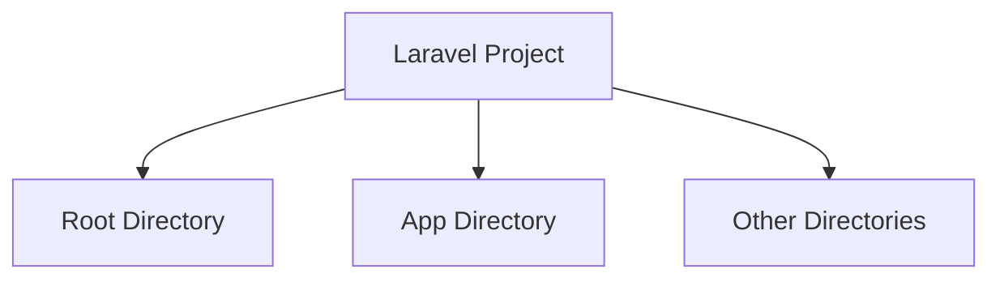
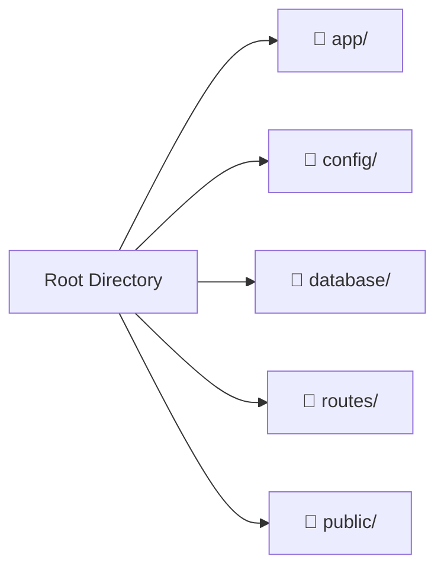
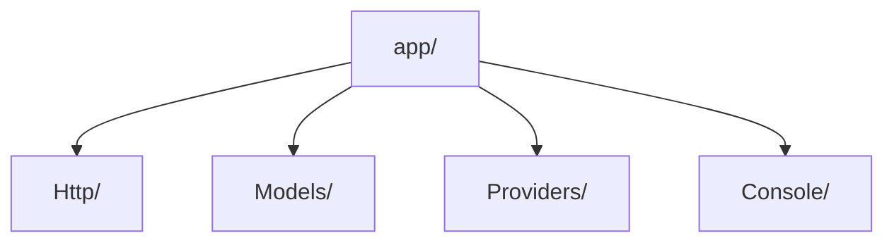
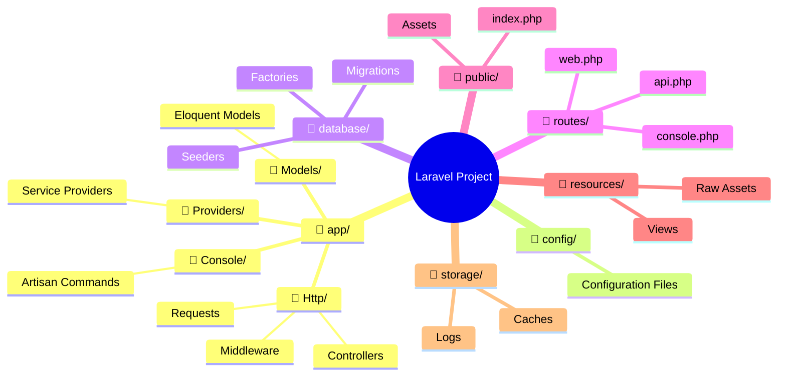
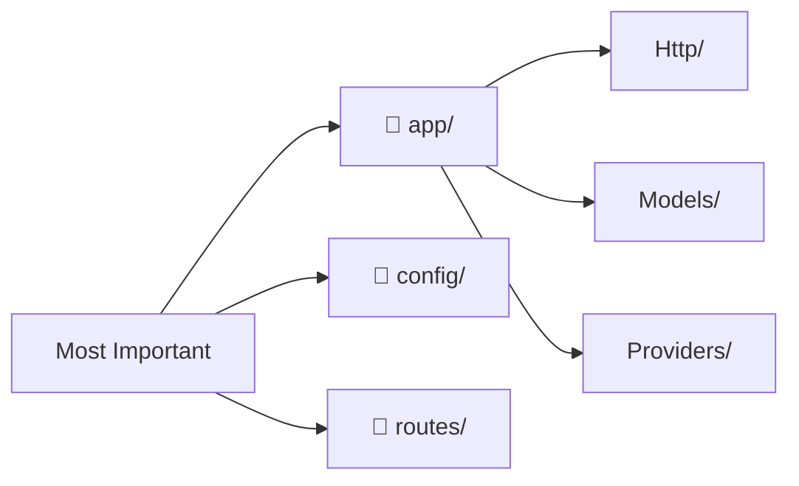

# Laravel Project Structure

## Introduction

The default Laravel application structure is intended to provide a great starting point for both large and small applications. Laravel imposes almost no restrictions on where any given class is located - as long as Composer can autoload the class.



## Root Directory Structure

```
📁 your-project/
├── 📁 app/                  # Core application code
├── 📁 bootstrap/           # Framework bootstrapping
├── 📁 config/              # Configuration files
├── 📁 database/            # Migrations, seeds, factories
├── 📁 public/              # Public assets & entry point
├── 📁 resources/           # Views, raw assets
├── 📁 routes/              # Route definitions
├── 📁 storage/             # Logs, caches, compiled files
├── 📁 tests/               # Test files
├── 📁 vendor/              # Composer dependencies
├── 📄 .env                 # Environment configuration
├── 📄 artisan              # Laravel CLI tool
├── 📄 composer.json        # PHP dependencies
└── 📄 README.md            # Project documentation
```

### 🔍 Important Root Directories



## The App Directory (Most Important!)

The `app` directory contains the core code of your application. Almost all of the classes in your application will be in this directory.

```
📁 app/
├── 📁 Console/             # Artisan commands
├── 📁 Exceptions/          # Custom exception handlers
├── 📁 Http/                # Controllers, middleware, requests
├── 📁 Models/              # Eloquent models
├── 📁 Providers/           # Service providers
└── 📁 ...                  # Other generated directories
```

### 🔥 Key App Subdirectories



#### Http Directory
- **Controllers**: Handle HTTP requests and return responses
- **Middleware**: Filter HTTP requests
- **Requests**: Form request validation

#### Models Directory
- **Eloquent Models**: Database interaction using ActiveRecord pattern
- **Relationships**: Define table relationships
- **Business Logic**: Core application logic

#### Providers Directory
- **Service Providers**: Bootstrap application services
- **AppServiceProvider**: Main service provider
- **Custom Providers**: Add your own service providers

## Other Important Directories

### 📁 config/
Contains all application configuration files. Key files:
- `app.php` - Core application settings
- `database.php` - Database connections
- `mail.php` - Email configuration
- `auth.php` - Authentication settings

### 📁 database/
```
📁 database/
├── 📁 migrations/      # Database migration files
├── 📁 seeders/        # Database seeders
└── 📁 factories/      # Model factories
```

### 📁 routes/
```
📁 routes/
├── 📄 web.php         # Web routes (with session, CSRF)
├── 📄 api.php         # API routes (stateless)
├── 📄 console.php     # Artisan commands
└── 📄 channels.php    # Broadcasting channels
```

### 📁 public/
- Entry point (`index.php`)
- Assets (CSS, JS, images)
- Compiled frontend assets

### 📁 resources/
```
📁 resources/
├── 📁 views/          # Blade templates
├── 📁 lang/           # Language files
├── 📁 js/             # JavaScript files
└── 📁 css/            # CSS files
```

### 📁 storage/
```
📁 storage/
├── 📁 app/            # Application files
├── 📁 framework/      # Framework generated files
├── 📁 logs/           # Log files
└── 📁 public/         # Publicly accessible files
```

## Visual Directory Hierarchy



## Directory Importance Guide

| Directory | Importance | Description |
|-----------|------------|-------------|
| 📁 app/ | ⭐⭐⭐⭐⭐ | Core application code |
| 📁 config/ | ⭐⭐⭐⭐ | Configuration files |
| 📁 routes/ | ⭐⭐⭐⭐ | Route definitions |
| 📁 database/ | ⭐⭐⭐ | Database related files |
| 📁 resources/ | ⭐⭐⭐ | Views and assets |
| 📁 public/ | ⭐⭐ | Public assets and entry point |
| 📁 storage/ | ⭐⭐ | Generated files and logs |
| 📁 tests/ | ⭐⭐ | Test files |

## Quick Reference



## Next Topic

[Service Container](3-service-container.md)