# Eloquent: Getting Started

## Introduction

Laravel includes Eloquent, an object-relational mapper (ORM) that makes it enjoyable to interact with your database. When using Eloquent, each database table has a corresponding "Model" that is used to interact with that table. In addition to retrieving records from the database table, Eloquent models allow you to insert, update, and delete records from the table as well.

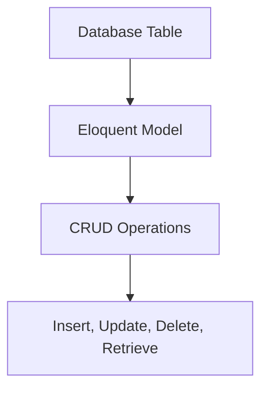

Before getting started, be sure to configure a database connection in your application's `config/database.php` configuration file. For more information on configuring your database, check out the database configuration documentation.

## Generating Model Classes

To get started, let's create an Eloquent model. Models typically live in the `app\Models` directory and extend the `Illuminate\Database\Eloquent\Model` class. You may use the `make:model` Artisan command to generate a new model:

```bash
php artisan make:model Flight
```

If you would like to generate a database migration when you generate the model, you may use the `--migration` or `-m` option:

```bash
php artisan make:model Flight --migration
```

You may generate various other types of classes when generating a model, such as factories, seeders, policies, controllers, and form requests. In addition, these options may be combined to create multiple classes at once:

```bash
# Generate a model and a FlightFactory class...
php artisan make:model Flight --factory
php artisan make:model Flight -f

# Generate a model and a FlightSeeder class...
php artisan make:model Flight --seed
php artisan make:model Flight -s

# Generate a model and a FlightController class...
php artisan make:model Flight --controller
php artisan make:model Flight -c

# Generate a model, FlightController resource class, and form request classes...
php artisan make:model Flight --controller --resource --requests
php artisan make:model Flight -crR

# Generate a model and a FlightPolicy class...
php artisan make:model Flight --policy

# Generate a model and a migration, factory, seeder, and controller...
php artisan make:model Flight -mfsc

# Shortcut to generate a model, migration, factory, seeder, policy, controller, and form requests...
php artisan make:model Flight --all
php artisan make:model Flight -a

# Generate a pivot model...
php artisan make:model Member --pivot
php artisan make:model Member -p
```

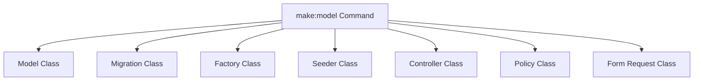

### Inspecting Models

Sometimes it can be difficult to determine all of a model's available attributes and relationships just by skimming its code. Instead, try the `model:show` Artisan command, which provides a convenient overview of all the model's attributes and relations:

```bash
php artisan model:show Flight
```

## Eloquent Model Conventions

Models generated by the `make:model` command will be placed in the `app/Models` directory. Let's examine a basic model class and discuss some of Eloquent's key conventions:

```php
<?php

namespace App\Models;

use Illuminate\Database\Eloquent\Model;

class Flight extends Model
{
    // ...
}
```

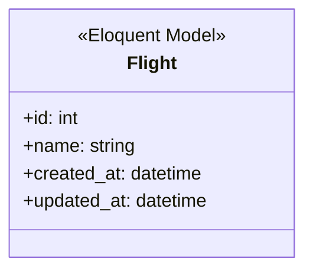

### Table Names

After glancing at the example above, you may have noticed that we did not tell Eloquent which database table corresponds to our `Flight` model. By convention, the "snake case", plural name of the class will be used as the table name unless another name is explicitly specified. So, in this case, Eloquent will assume the `Flight` model stores records in the `flights` table, while an `AirTrafficController` model would store records in an `air_traffic_controllers` table.

If your model's corresponding database table does not fit this convention, you may manually specify the model's table name by defining a `$table` property on the model:

```php
<?php

namespace App\Models;

use Illuminate\Database\Eloquent\Model;

class Flight extends Model
{
    /**
     * The table associated with the model.
     *
     * @var string
     */
    protected $table = 'my_flights';
}
```

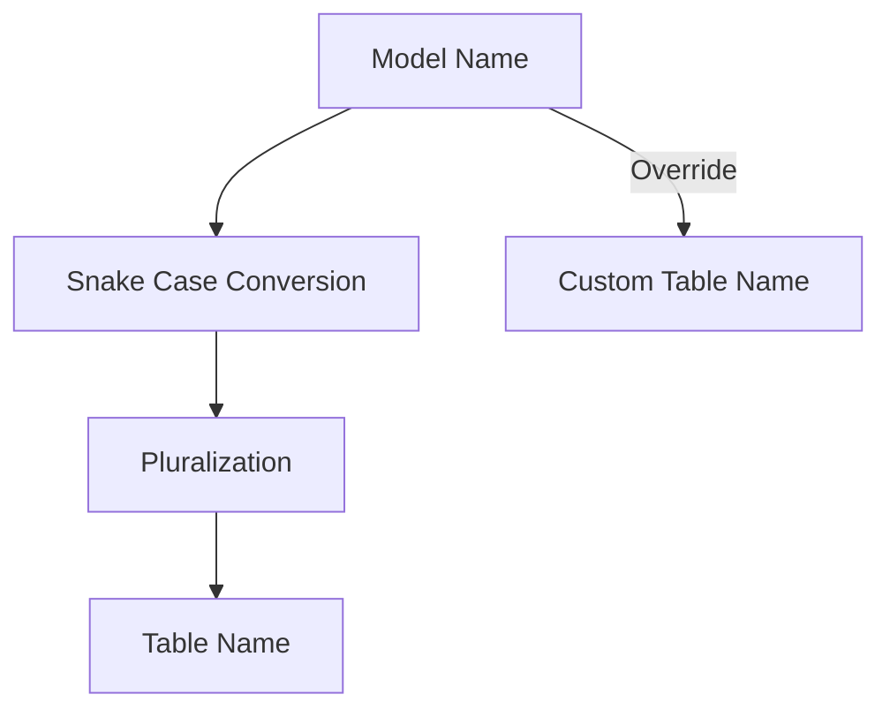

### Primary Keys

Eloquent will also assume that each model's corresponding database table has a primary key column named `id`. If necessary, you may define a protected `$primaryKey` property on your model to specify a different column that serves as your model's primary key:

```php
<?php

namespace App\Models;

use Illuminate\Database\Eloquent\Model;

class Flight extends Model
{
    /**
     * The primary key associated with the table.
     *
     * @var string
     */
    protected $primaryKey = 'flight_id';
}
```

In addition, Eloquent assumes that the primary key is an incrementing integer value, which means that Eloquent will automatically cast the primary key to an integer. If you wish to use a non-incrementing or a non-numeric primary key you must define a public `$incrementing` property on your model that is set to `false`:

```php
<?php

class Flight extends Model
{
    /**
     * Indicates if the model's ID is auto-incrementing.
     *
     * @var bool
     */
    public $incrementing = false;
}
```

If your model's primary key is not an integer, you should define a protected `$keyType` property on your model. This property should have a value of `string`:

```php
<?php

class Flight extends Model
{
    /**
     * The data type of the primary key ID.
     *
     * @var string
     */
    protected $keyType = 'string';
}
```

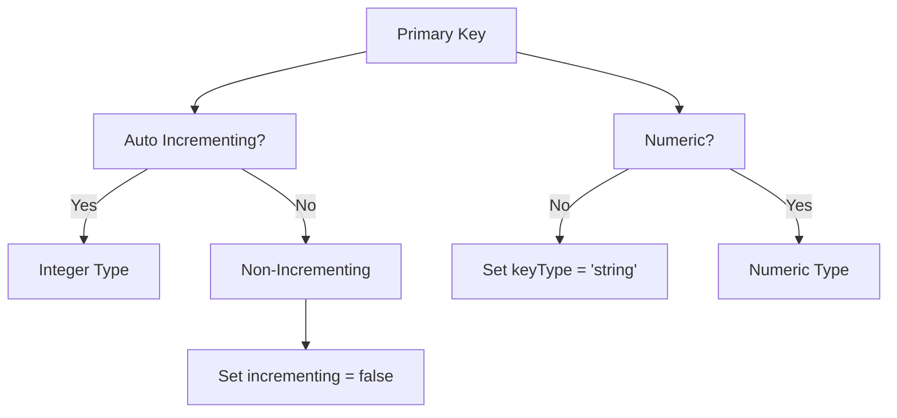

### UUID and ULID Keys

Instead of using auto-incrementing integers as your Eloquent model's primary keys, you may choose to use UUIDs instead. UUIDs are universally unique alpha-numeric identifiers that are 36 characters long.

If you would like a model to use a UUID key instead of an auto-incrementing integer key, you may use the `Illuminate\Database\Eloquent\Concerns\HasUuids` trait on the model. Of course, you should ensure that the model has a UUID equivalent primary key column:

```php
use Illuminate\Database\Eloquent\Concerns\HasUuids;
use Illuminate\Database\Eloquent\Model;

class Article extends Model
{
    use HasUuids;

    // ...
}

$article = Article::create(['title' => 'Traveling to Europe']);

$article->id; // "8f8e8478-9035-4d23-b9a7-62f4d2612ce5"
```

By default, The `HasUuids` trait will generate "ordered" UUIDs for your models. These UUIDs are more efficient for indexed database storage because they can be sorted lexicographically.

You can override the UUID generation process for a given model by defining a `newUniqueId` method on the model. In addition, you may specify which columns should receive UUIDs by defining a `uniqueIds` method on the model:

```php
use Ramsey\Uuid\Uuid;

/**
 * Generate a new UUID for the model.
 */
public function newUniqueId(): string
{
    return (string) Uuid::uuid4();
}

/**
 * Get the columns that should receive a unique identifier.
 *
 * @return array<int, string>
 */
public function uniqueIds(): array
{
    return ['id', 'discount_code'];
}
```

If you wish, you may choose to utilize "ULIDs" instead of UUIDs. ULIDs are similar to UUIDs; however, they are only 26 characters in length. Like ordered UUIDs, ULIDs are lexicographically sortable for efficient database indexing. To utilize ULIDs, you should use the `Illuminate\Database\Eloquent\Concerns\HasUlids` trait on your model. You should also ensure that the model has a ULID equivalent primary key column:

```php
use Illuminate\Database\Eloquent\Concerns\HasUlids;
use Illuminate\Database\Eloquent\Model;

class Article extends Model
{
    use HasUlids;

    // ...
}

$article = Article::create(['title' => 'Traveling to Asia']);

$article->id; // "01gd4d3tgrrfqeda94gdbtdk5c"
```

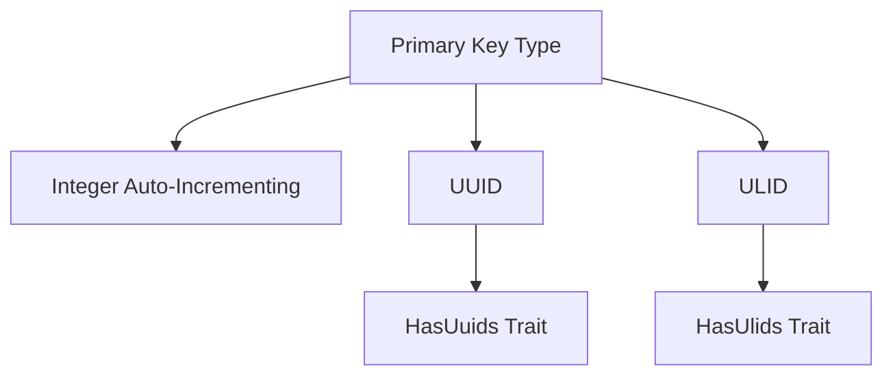

### Timestamps

By default, Eloquent expects `created_at` and `updated_at` columns to exist on your model's corresponding database table. If you do not want these columns to be automatically managed by Eloquent, you may define a `$timestamps` property on your model with a value of `false`:

```php
<?php

namespace App\Models;

use Illuminate\Database\Eloquent\Model;

class Flight extends Model
{
    /**
     * Indicates if the model should be timestamped.
     *
     * @var bool
     */
    public $timestamps = false;
}
```

If you need to customize the format of your model's timestamps, set the `$dateFormat` property on your model. This property determines how date attributes are stored in the database as well as their format when the model is serialized to an array or JSON:

```php
<?php

namespace App\Models;

use Illuminate\Database\Eloquent\Model;

class Flight extends Model
{
    /**
     * The storage format of the model's date columns.
     *
     * @var string
     */
    protected $dateFormat = 'U';
}
```

If you wish to customize the names of the columns used to store the timestamps, you may define the `CREATED_AT` and `UPDATED_AT` constants on your model:

```php
<?php

class Flight extends Model
{
    const CREATED_AT = 'creation_date';
    const UPDATED_AT = 'last_update';
}
```

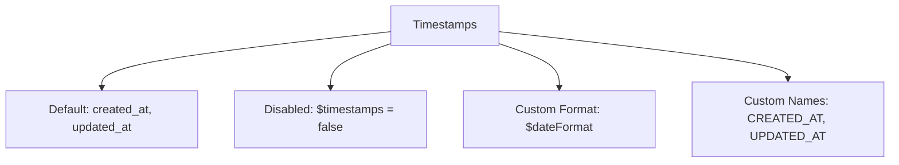

If you would like to perform model operations without the model having its `updated_at` timestamp modified, you may operate on the model within a closure given to the `withoutTimestamps` method:

```php
Model::withoutTimestamps(fn () => $post->increment('reads'));
```

### Database Connections

By default, all Eloquent models will use the default database connection that is configured for your application. If you would like to specify a different connection that should be used when interacting with a particular model, you should define a `$connection` property on your model:

```php
<?php

namespace App\Models;

use Illuminate\Database\Eloquent\Model;

class Flight extends Model
{
    /**
     * The database connection that should be used by the model.
     *
     * @var string
     */
    protected $connection = 'mysql';
}
```

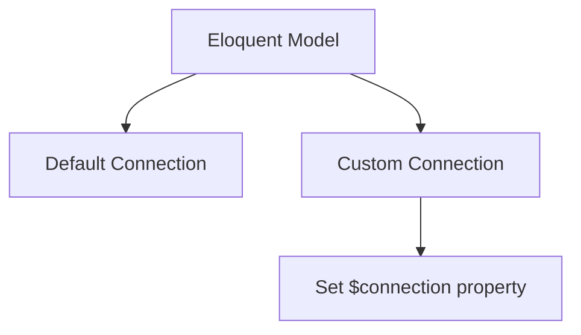

### Default Attribute Values

If you would like to define the default values for some of your model's attributes, you may define an `$attributes` property on your model. Attribute values placed in the `$attributes` array should be in their raw, "storable" format as if they were just read from the database:

```php
<?php

namespace App\Models;

use Illuminate\Database\Eloquent\Model;

class Flight extends Model
{
    /**
     * The model's default values for attributes.
     *
     * @var array
     */
    protected $attributes = [
        'options' => '[]',
        'delayed' => false,
    ];
}
```

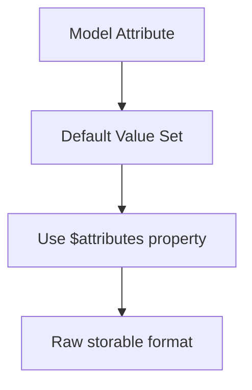

## Configuring Eloquent Strictness

Laravel offers several methods that allow you to configure Eloquent's behavior and "strictness" in a variety of situations.

First, the `preventLazyLoading` method accepts an optional boolean argument that indicates if lazy loading should be prevented. For example, you may wish to only disable lazy loading in non-production environments so that your production environment will continue to function normally even if a lazy loaded relationship is accidentally present in production code. Typically, this method should be invoked in the `boot` method of your application's `AppServiceProvider`:

```php
use Illuminate\Database\Eloquent\Model;

/**
 * Bootstrap any application services.
 */
public function boot(): void
{
    Model::preventLazyLoading(! $this->app->isProduction());
}
```

Also, you may instruct Laravel to throw an exception when attempting to fill an unfillable attribute by invoking the `preventSilentlyDiscardingAttributes` method. This can help prevent unexpected errors during local development when attempting to set an attribute that has not been added to the model's fillable array:

```php
Model::preventSilentlyDiscardingAttributes(! $this->app->isProduction());
```

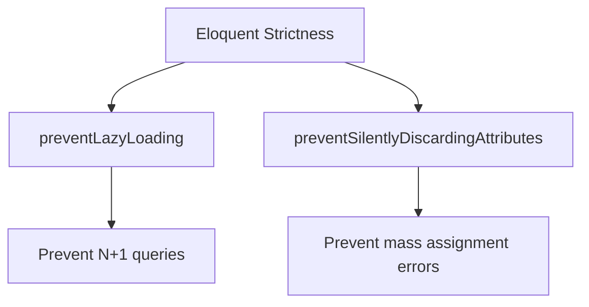

## Retrieving Models

Once you have created a model and its associated database table, you are ready to start retrieving data from your database. You can think of each Eloquent model as a powerful query builder allowing you to fluently query the database table associated with the model. The model's `all` method will retrieve all of the records from the model's associated database table:

```php
use App\Models\Flight;

foreach (Flight::all() as $flight) {
    echo $flight->name;
}
```

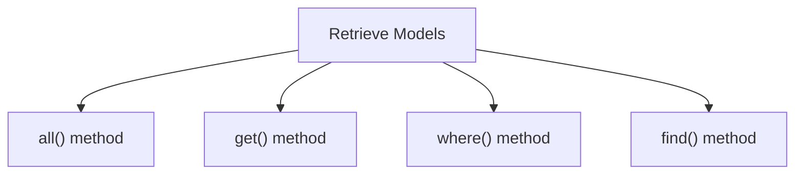

Building Queries
The Eloquent `all` method will return all of the results in the model's table. However, since each Eloquent model serves as a query builder, you may add additional constraints to queries and then invoke the `get` method to retrieve the results:

```php
$flights = Flight::where('active', 1)
    ->orderBy('name')
    ->limit(10)
    ->get();
```

Since Eloquent models are query builders, you should review all of the methods provided by Laravel's query builder. You may use any of these methods when writing your Eloquent queries.

### Collections

As we have seen, Eloquent methods like `all` and `get` retrieve multiple records from the database. However, these methods don't return a plain PHP array. Instead, an instance of `Illuminate\Database\Eloquent\Collection` is returned.

The Eloquent `Collection` class extends Laravel's base `Illuminate\Support\Collection` class, which provides a variety of helpful methods for interacting with data collections. For example, the `reject` method may be used to remove models from a collection based on the results of an invoked closure:

```php
$flights = Flight::where('destination', 'Paris')->get();

$filteredFlights = $flights->reject(function ($flight) {
    return $flight->cancelled;
});
```

In addition to the methods provided by Laravel's base collection class, the Eloquent collection class provides a few extra methods that are specifically intended for interacting with collections of Eloquent models.

Since all of Laravel's collections implement PHP's iterable interfaces, you may loop over collections as if they were an array:

```php
foreach ($flights as $flight) {
    echo $flight->name;
}
```

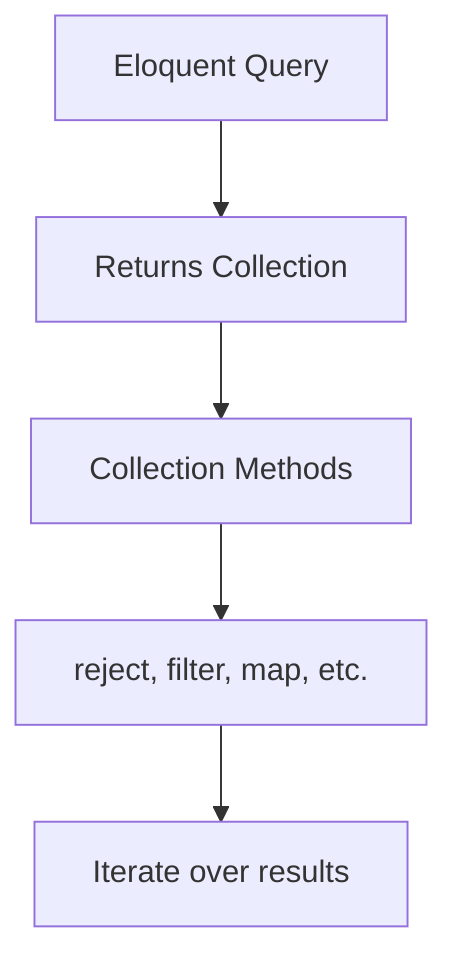

### Chunking Results

Your application may run out of memory if you attempt to load tens of thousands of Eloquent records via the `all` or `get` methods. Instead of using these methods, the `chunk` method may be used to process large numbers of models more efficiently. The `chunk` method will retrieve a subset of Eloquent models, passing them to a closure for processing:

```php
use App\Models\Flight;
use Illuminate\Database\Eloquent\Collection;

Flight::chunk(200, function (Collection $flights) {
    foreach ($flights as $flight) {
        //
    }
});
```

The first argument passed to the `chunk` method is the number of records you wish to receive per "chunk". The closure passed as the second argument will be invoked for each chunk that is retrieved from the database. A database query will be executed to retrieve each chunk of records passed to the closure.

If you are filtering the results of the `chunk` method based on a column that you will also be updating while iterating over the results, you should use the `chunkById` method. Using the `chunk` method in these scenarios could lead to unexpected and inconsistent results. Internally, the `chunkById` method will always retrieve models with an `id` column greater than the last model in the previous chunk:

```php
Flight::where('departed', true)
    ->chunkById(200, function (Collection $flights) {
        $flights->each->update(['departed' => false]);
    }, column: 'id');
```

Since the `chunkById` and `lazyById` methods add their own "where" conditions to the query being executed, you should typically logically group your own conditions within a closure:

```php
Flight::where(function ($query) {
    $query->where('delayed', true)->orWhere('cancelled', true);
})->chunkById(200, function (Collection $flights) {
    $flights->each->update([
        'departed' => false,
        'cancelled' => true
    ]);
}, column: 'id');
```

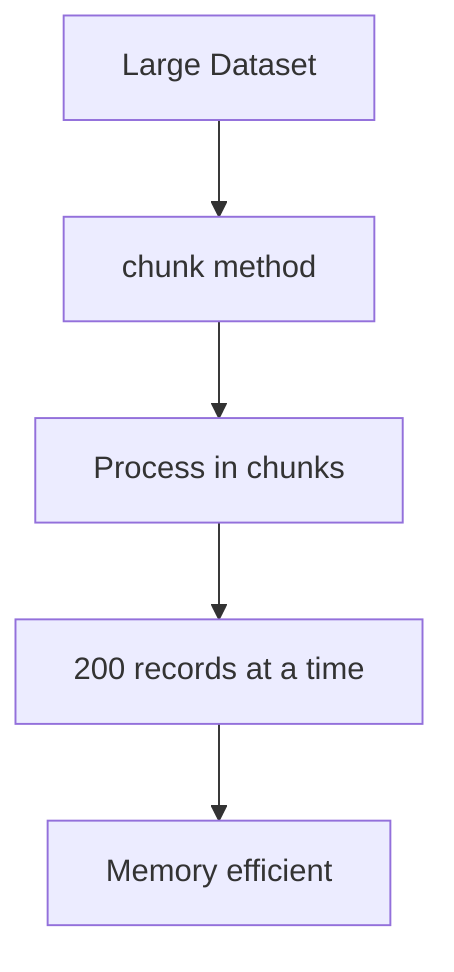

### Chunk Using Lazy Collections

The `lazy` method works similarly to the `chunk` method in the sense that, behind the scenes, it executes the query in chunks. However, instead of passing each chunk directly into a callback as is, the `lazy` method returns a flattened `LazyCollection` of Eloquent models, which lets you interact with the results as a single stream:

```php
use App\Models\Flight;

foreach (Flight::lazy() as $flight) {
    //
}
```

If you are filtering the results of the `lazy` method based on a column that you will also be updating while iterating over the results, you should use the `lazyById` method. Internally, the `lazyById` method will always retrieve models with an `id` column greater than the last model in the previous chunk:

```php
Flight::where('departed', true)
    ->lazyById(200, column: 'id')
    ->each->update(['departed' => false]);
```

You may filter the results based on the descending order of the `id` using the `lazyByIdDesc` method.

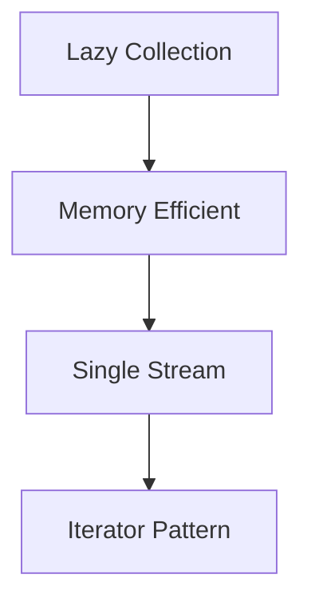

### Cursors

Similar to the `lazy` method, the `cursor` method may be used to significantly reduce your application's memory consumption when iterating through tens of thousands of Eloquent model records.

The `cursor` method will only execute a single database query; however, the individual Eloquent models will not be hydrated until they are actually iterated over. Therefore, only one Eloquent model is kept in memory at any given time while iterating over the cursor.

Since the `cursor` method only ever holds a single Eloquent model in memory at a time, it cannot eager load relationships. If you need to eager load relationships, consider using the `lazy` method instead.

Internally, the `cursor` method uses PHP generators to implement this functionality:

```php
use App\Models\Flight;

foreach (Flight::where('destination', 'Zurich')->cursor() as $flight) {
    //
}
```

The `cursor` returns an `Illuminate\Support\LazyCollection` instance. Lazy collections allow you to use many of the collection methods available on typical Laravel collections while only loading a single model into memory at a time:

```php
use App\Models\User;

$users = User::cursor()->filter(function (User $user) {
    return $user->id > 500;
});

foreach ($users as $user) {
    echo $user->id;
}
```

Although the cursor method uses far less memory than a regular query (by only holding a single Eloquent model in memory at a time), it will still eventually run out of memory. This is due to PHP's PDO driver internally caching all raw query results in its buffer. If you're dealing with a very large number of Eloquent records, consider using the `lazy` method instead.

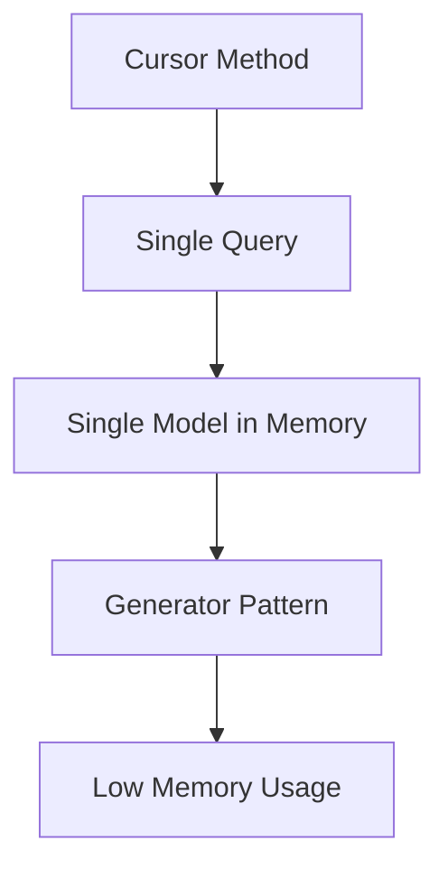

## Retrieving Single Models / Aggregates

In addition to retrieving all of the records matching a given query, you may also retrieve single records using the `find`, `first`, or `firstWhere` methods. Instead of returning a collection of models, these methods return a single model instance:

```php
use App\Models\Flight;

// Retrieve a model by its primary key...
$flight = Flight::find(1);

// Retrieve the first model matching the query constraints...
$flight = Flight::where('active', 1)->first();

// Alternative to retrieving the first model matching the query constraints...
$flight = Flight::firstWhere('active', 1);
```

You may also call the `findOr` and `firstOr` methods. These methods will return a single model instance or, if no results are found, execute the given closure. The value returned by the closure will be considered the result of the method:

```php
$flight = Flight::findOr(1, function () {
    // ...
});

$flight = Flight::where('legs', '>', 3)->firstOr(function () {
    // ...
});
```

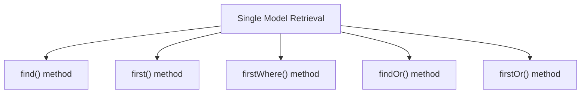

### Not Found Exceptions

Sometimes you may wish to throw an exception if a model is not found. This is particularly useful in routes or controllers. The `findOrFail` and `firstOrFail` methods will retrieve the first result of the query; however, if no result is found, an `Illuminate\Database\Eloquent\ModelNotFoundException` will be thrown:

```php
$flight = Flight::findOrFail(1);
$flight = Flight::where('legs', '>', 3)->firstOrFail();
```

If the `ModelNotFoundException` is not caught, a 404 HTTP response is automatically sent back to the client. So, it's not necessary to manually write checks to redirect users to a 404 page if a model is not found when using these methods in routes or controllers:

```php
use App\Models\Flight;

Route::get('/api/flights/{id}', function (string $id) {
    return Flight::findOrFail($id);
});
```

### Retrieving or Creating Models

The `firstOrCreate` method will attempt to locate a database record using the given column / value pairs. If the model cannot be found in the database, a record will be inserted with the attributes resulting from merging the first array argument with the optional second array argument.

The `firstOrNew` method, like `firstOrCreate`, will attempt to locate a record in the database matching the given attributes. However, if a model is not found, a new model instance will be returned. Note that the model returned by `firstOrNew` has not yet been persisted to the database. You will need to manually call the `save` method to persist it:

```php
use App\Models\Flight;

// Retrieve flight by name or create it if it doesn't exist...
$flight = Flight::firstOrCreate([
    'name' => 'London to Paris'
]);

// Retrieve flight by name or create it with the name, delayed, and arrival_time attributes...
$flight = Flight::firstOrCreate(
    ['name' => 'London to Paris'],
    ['delayed' => 1, 'arrival_time' => '11:30']
);

// Retrieve flight by name or instantiate a new Flight instance...
$flight = Flight::firstOrNew([
    'name' => 'London to Paris'
]);

// Retrieve flight by name or instantiate with the name, delayed, and arrival_time attributes...
$flight = Flight::firstOrNew(
    ['name' => 'Tokyo to Sydney'],
    ['delayed' => 1, 'arrival_time' => '11:30']
);
```

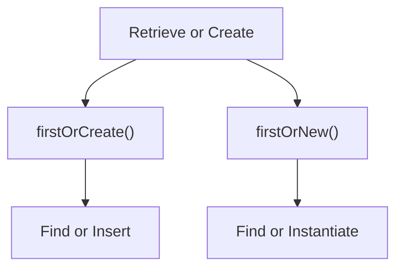

### Retrieving Aggregates

When interacting with Eloquent models, you may also use the `count`, `sum`, `max`, and other aggregate methods provided by Laravel's query builder. As you might expect, these methods return a scalar value instead of an Eloquent model instance:

```php
$count = Flight::where('active', 1)->count();
$max = Flight::where('active', 1)->max('price');
```

## Inserting and Updating Models

### Inserts

Of course, when using Eloquent, we don't only need to retrieve models from the database. We also need to insert new records. Thankfully, Eloquent makes it simple. To insert a new record into the database, you should instantiate a new model instance and set attributes on the model. Then, call the `save` method on the model instance:

```php
use App\Models\Flight;

$flight = new Flight;
$flight->name = 'London to Paris';
$flight->save();
```

In this example, we simply assign the `name` field from the request to the `name` attribute of the `App\Models\Flight` model instance. When we call the `save` method, a record will be inserted into the database. The model's `created_at` and `updated_at` timestamps will automatically be set when the `save` method is called, so there is no need to set them manually.

Alternatively, you may use the `create` method to "save" a new model using a single PHP statement. The inserted model instance will be returned to you by the `create` method. However, before using the `create` method, you will need to specify either a `fillable` or `guarded` property on your model class. These properties are required because all Eloquent models are protected against mass assignment vulnerabilities by default. This is discussed in more detail below:

```php
use App\Models\Flight;

$flight = Flight::create([
    'name' => 'London to Paris',
]);
```

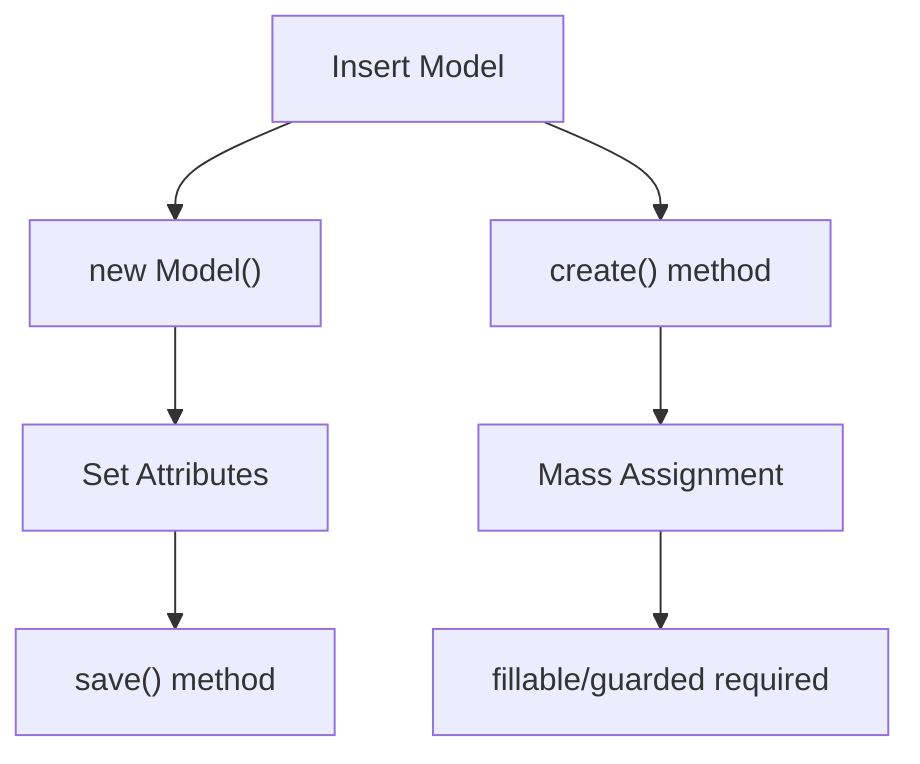

### Updates

The `save` method may also be used to update models that already exist in the database. To update a model, you should retrieve it and set any attributes you wish to update. Then, you should call the model's `save` method. Again, the `updated_at` timestamp will automatically be updated, so there is no need to manually set its value:

```php
use App\Models\Flight;

$flight = Flight::find(1);
$flight->name = 'Paris to London';
$flight->save();
```

Updates can also be performed against models that match a given query. In this example, all flights that are `active` and have a `destination` of `San Diego` will be marked as delayed:

```php
Flight::where('active', 1)
    ->where('destination', 'San Diego')
    ->update(['delayed' => 1]);
```

The `update` method expects an array of column and value pairs representing the columns that should be updated. The `update` method returns the number of affected rows.

When issuing a mass update via Eloquent, the `saving`, `saved`, `updating`, and `updated` model events will not be fired for the updated models. This is because the models are never actually retrieved when issuing a mass update. If you wish to fire these events, you may retrieve the models and issue updates manually:

```php
foreach (Flight::where('active', 1)->where('destination', 'San Diego')->get() as $flight) {
    $flight->delayed = true;
    $flight->save();
}
```

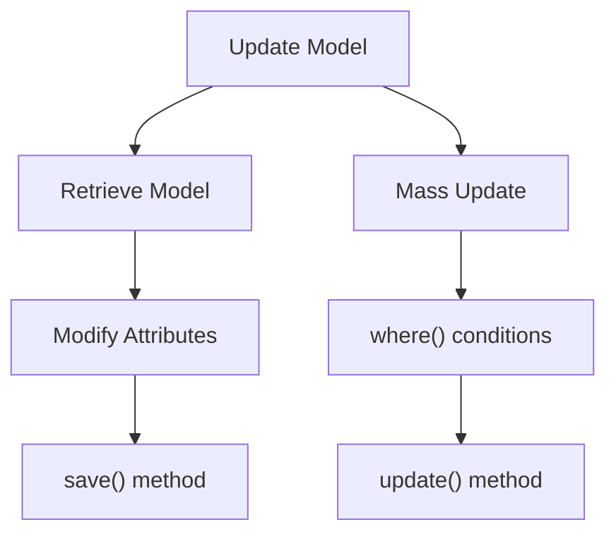

### Mass Assignment

You may use the `create` method to "save" a new model using a single PHP statement. However, before using the `create` method, you will need to specify either a `fillable` or `guarded` property on your model class. These properties are required because all Eloquent models are protected against mass assignment vulnerabilities by default.

A mass assignment vulnerability occurs when a user passes an unexpected HTTP request field and that field changes a column in your database that you did not expect. For example, a malicious user might send an `is_admin` parameter through an HTTP request, which is then passed to your model's `create` method, allowing the user to escalate themselves to an administrator:

```php
$request->validate([
    'name' => 'required|max:255',
    'email' => 'required|email',
]);

// Don't do this: $request->all() might include 'is_admin' field
$user = User::create($request->all());
```

To combat this, you should define which model attributes you want to make mass assignable. You may do this using the `$fillable` property on the model. For example, let's make the `name` attribute of our `Flight` model mass assignable:

```php
<?php

namespace App\Models;

use Illuminate\Database\Eloquent\Model;

class Flight extends Model
{
    /**
     * The attributes that are mass assignable.
     *
     * @var array<int, string>
     */
    protected $fillable = ['name'];
}
```

Once you have specified which attributes are mass assignable, you may use the `create` method to insert a new record in the database. The `create` method returns the newly created model instance. However, if you would like to use the `create` method without specifying any fillable attributes, you may define the model's `$fillable` property as an empty array. If both `$fillable` and `$guarded` are empty, all attributes will be considered fillable:

```php
$flight = Flight::create(['name' => 'London to Paris']);
```

If you would like to make all attributes mass assignable, you may define the model's `$guarded` property as an empty array. If you choose to unguard your model, you should take special care to always hand-craft the arrays passed to Eloquent's `fill`, `create`, and `update` methods using the `only` or `except` methods of the incoming request object:

```php
/**
 * The attributes that aren't mass assignable.
 *
 * @var array<string>|bool
 */
protected $guarded = [];
```

Alternatively, you may use the `fill` method to populate a model with an array of attributes. However, you must specify either a `$fillable` or `$guarded` property on the model since the `fill` method respects your model's mass assignment configuration:

```php
$flight = new Flight;
$flight->fill(['name' => 'London to Paris']);
```

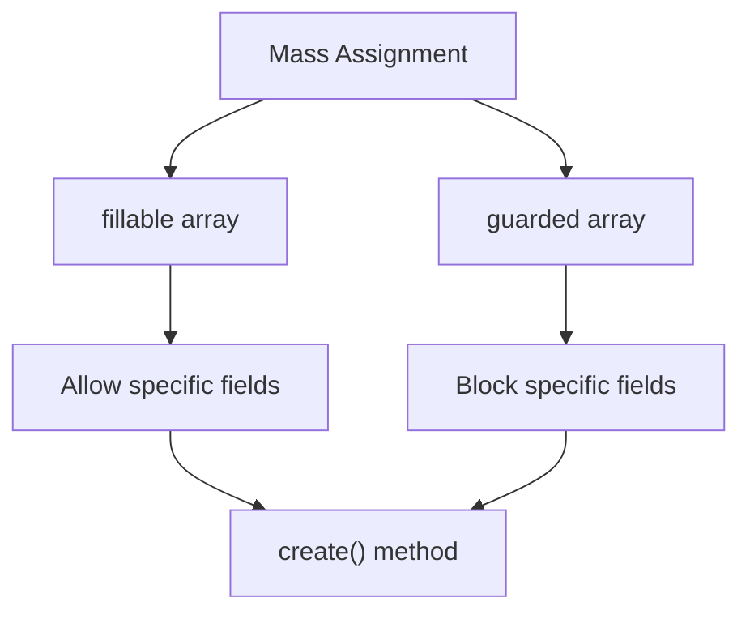

## Deleting Models

To delete a model, you may call the `delete` method on the model instance:

```php
use App\Models\Flight;

$flight = Flight::find(1);
$flight->delete();
```

To delete an existing model by its primary key, you may call the `destroy` method. In addition to accepting the single primary key, the `destroy` method will accept multiple primary keys, an array of primary keys, or a collection of primary keys:

```php
Flight::destroy(1);
Flight::destroy(1, 2, 3);
Flight::destroy([1, 2, 3]);
Flight::destroy(collect([1, 2, 3]));
```

```mermaid
graph TD
    A[Delete Model] --> B["find() + delete()"]
    A --> C["destroy() method"]
    C --> D[Single ID]
    C --> E[Multiple IDs]
    C --> F[Array of IDs]
    C --> G[Collection of IDs]
```

### Deleting Models Using Queries

Of course, you may also run a query to delete all models matching your query's criteria. In this example, we will delete all flights that are marked as inactive. Like mass updates, mass deletes will not dispatch any model events for the models that are deleted:

```php
$deleted = Flight::where('active', 0)->delete();
```

The `delete` method returns the number of affected rows.

When executing a mass delete statement via Eloquent, the `deleting` and `deleted` model events will not be dispatched for the deleted models. This is because the models are never actually retrieved when executing the delete statement. If you wish to dispatch these events, you should manually retrieve the models and call the `delete` method on each one:

```php
foreach (Flight::where('active', 0)->get() as $flight) {
    $flight->delete();
}
```

## Soft Deleting

In addition to actually removing records from your database, Eloquent can also "soft delete" models. When models are soft deleted, they are not actually removed from your database. Instead, a `deleted_at` attribute is set on the model indicating the date and time at which the model was "deleted". To enable soft deletes for a model, add the `Illuminate\Database\Eloquent\SoftDeletes` trait to the model:

```php
<?php

namespace App\Models;

use Illuminate\Database\Eloquent\Model;
use Illuminate\Database\Eloquent\SoftDeletes;

class Flight extends Model
{
    use SoftDeletes;
}
```

The `SoftDeletes` trait will automatically cast the `deleted_at` attribute to a `DateTime` / `Carbon` instance for you.

You should also add the `deleted_at` column to your database table. The Laravel schema builder contains a helper method to create this column:

```php
use Illuminate\Database\Schema\Blueprint;
use Illuminate\Support\Facades\Schema;

Schema::table('flights', function (Blueprint $table) {
    $table->softDeletes();
});
```

Now, when you call the `delete` method on the model, the `deleted_at` column will be set to the current date and time. However, the model's database record will be left in the table. When querying a model that uses soft deletes, the soft deleted models will automatically be excluded from all query results.

To determine if a given model instance has been soft deleted, you may use the `trashed` method:

```php
if ($flight->trashed()) {
    //
}
```

```mermaid
graph TD
    A[Soft Delete] --> B[Set deleted_at]
    B --> C[Record remains in DB]
    C --> D[Excluded from queries]
    D --> E["trashed() method"]
```

### Querying Soft Deleted Models

Including Soft Deleted Models
As noted above, soft deleted models will automatically be excluded from query results. However, you may force soft deleted models to be included in a query's results by calling the `withTrashed` method on the query:

```php
use App\Models\Flight;

$flights = Flight::withTrashed()
    ->where('account_id', 1)
    ->get();

$flight = Flight::withTrashed()->find(1);
```

The `withTrashed` method may also be called when building a relationship query:

```php
$flight->history()->withTrashed()->get();
```

Retrieving Only Soft Deleted Models
The `onlyTrashed` method will retrieve only soft deleted models:

```php
$flights = Flight::onlyTrashed()
    ->where('airline_id', 1)
    ->get();
```

Restoring Soft Deleted Models
Sometimes you may wish to "un-delete" a soft deleted model. To restore a soft deleted model into an active state, you may call the `restore` method on a model instance. The `restore` method will set the model's `deleted_at` column to `null`:

```php
$flight->restore();
```

You may also use the `restore` method in a query to restore multiple models. Again, like other "mass" operations, this will not dispatch any model events for the models that are restored:

```php
Flight::withTrashed()
    ->where('airline_id', 1)
    ->restore();
```

The `restore` method may also be used when building relationship queries:

```php
$flight->history()->restore();
```

Permanently Deleting Models
Sometimes you may need to truly remove a model from your database. You may use the `forceDelete` method to permanently remove a soft deleted model from the database table:

```php
// Force delete a single model instance...
$flight->forceDelete();

// Force delete all related models...
$flight->history()->forceDelete();
```

```mermaid
graph TD
    A[Soft Delete Querying] --> B["withTrashed()"]
    A --> C["onlyTrashed()"]
    A --> D["restore()"]
    A --> E["forceDelete()"]
    B --> F[Include deleted records]
    C --> G[Only deleted records]
    D --> H[Undelete records]
    E --> I[Permanently remove]
```

## Next Topic
[Eloquent: Relationships](21-eloquent-relationships.md)