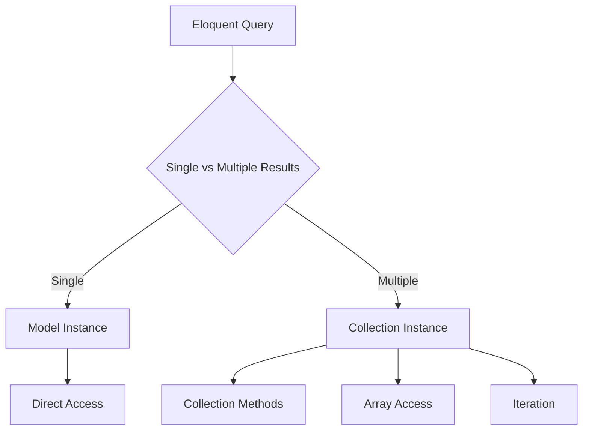
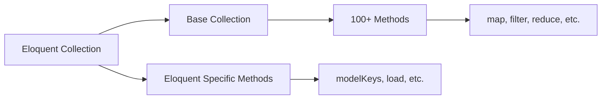
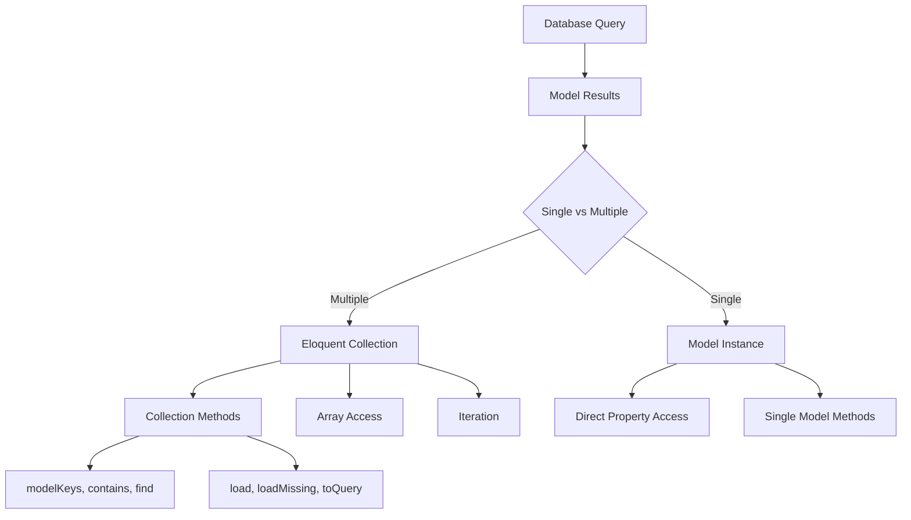

# Eloquent: Collections

## Introduction

All multi-result Eloquent methods like `get` and the `relationship` methods return an instance of `Illuminate\Database\Eloquent\Collection`, while single-result methods like `first` and `find` return a single Eloquent model instance.



Collections also provide a variety of helpful methods for working with the underlying Eloquent model instances. However, note that collections are not limited to Eloquent models; they can hold any type of object and provide a fluent, convenient wrapper for working with arrays of data.

```php
<?php

namespace App\Models;

use Illuminate\Database\Eloquent\Collection;
use Illuminate\Database\Eloquent\Model;

class User extends Model
{
    /**
     * Get all of the user's posts.
     */
    public function posts(): HasMany
    {
        return $this->hasMany(Post::class);
    }
}

// Retrieving multiple models returns a collection
$users = User::with('posts')->get(); // Returns Eloquent Collection

// Single model returns the model instance directly
$user = User::find(1); // Returns User model instance
```

## Available Methods

All Eloquent collections extend the Laravel base collection; therefore, they inherit all of the powerful methods provided by the base collection class. The base collection class provides over 100 methods that can be used to work with your data, including methods like `map`, `reduce`, `filter`, `sortBy`, and more. For the full list of available methods, check out the [collection documentation](collections.md).



### Custom Collections

If you need to work with a custom collection class when interacting with a given model, you may define a `newCollection` method on your model:

```php
<?php

namespace App\Models;

use App\Support\Collections\UserCollection;
use Illuminate\Database\Eloquent\Model;
use Illuminate\Database\Eloquent\Relations\HasMany;

class User extends Model
{
    /**
     * Create a new Eloquent Collection instance.
     *
     * @param  array<int, \Illuminate\Database\Eloquent\Model>  $models
     * @return \Illuminate\Database\Eloquent\Collection<int, static>
     */
    public function newCollection(array $models = []): Collection
    {
        return new UserCollection($models);
    }

    /**
     * Get all of the user's posts.
     */
    public function posts(): HasMany
    {
        return $this->hasMany(Post::class);
    }
}
```

Once you have defined a `newCollection` method, you will receive an instance of your custom collection class anytime Eloquent returns a `Collection` instance of that model. If you would like to customize the collection returned by relationship methods, you may invoke the `Collection` method when defining the relationship:

```php
<?php

namespace App\Models;

use App\Support\Collections\PostCollection;
use Illuminate\Database\Eloquent\Model;
use Illuminate\Database\Eloquent\Relations\HasMany;

class User extends Model
{
    /**
     * Get all of the user's posts.
     */
    public function posts(): HasMany
    {
        return $this->hasMany(Post::class)->Collection(PostCollection::class);
    }
}
```

Here's an example of a custom collection class implementation:

```php
<?php

namespace App\Support\Collections;

use Illuminate\Database\Eloquent\Collection;

class UserCollection extends Collection
{
    /**
     * Custom method to get all user emails.
     */
    public function getEmails(): array
    {
        return $this->pluck('email')->toArray();
    }

    /**
     * Custom method to filter active users.
     */
    public function active(): static
    {
        return $this->filter(fn ($user) => $user->active);
    }

    /**
     * Custom method to get users by role.
     */
    public function byRole(string $role): static
    {
        return $this->filter(fn ($user) => $user->role === $role);
    }
}
```

### Eloquent Collection Methods

In addition to the methods inherited from the base Laravel collection class, Eloquent collections provide additional methods that are specifically tailored for working with Eloquent models.

#### modelKeys

The `modelKeys` method returns the primary keys for all models in the collection:

```php
use App\Models\User;

$users = User::all();

// Returns an array of user IDs
$keys = $users->modelKeys(); // [1, 2, 3, 4, 5, ...]
```

#### contains

The `contains` method may be used to determine if a given model instance is contained by the collection. This method accepts a model instance or a primary key value:

```php
use App\Models\User;

$users = User::all();

$firstUser = $users->first();

if ($users->contains($firstUser)) {
    // The collection contains the given user model instance...
}

if ($users->contains('id', $firstUser->id)) {
    // The collection contains a user with the given ID...
}
```

#### find

The `find` method provides a convenient way to quickly retrieve a model by its primary key from a collection of models. This method accepts an array of primary keys or a single primary key:

```php
use App\Models\User;

$users = User::all();

// Find a single user by key...
$firstUser = $users->find(1);

// Find multiple users by keys...
$someUsers = $users->find([1, 2, 3]);
```

#### load

The `load` method may be used to eager load relationships for all models in the collection:

```php
use App\Models\User;

$users = User::with('posts')->get();

// Later, eager load additional relationships...
$users->load('comments', 'posts.tags');

// Or use an array...
$users->load(['comments', 'posts.tags']);

// Load with constraints...
$users->load(['posts' => function ($query) {
    $query->where('active', true);
}]);
```

#### loadMissing

The `loadMissing` method may be used to eager load relationships that have not already been loaded:

```php
use App\Models\User;

$users = User::with('posts')->get();

// Only load comments if they haven't been loaded yet...
$users->loadMissing('comments');

// Load nested relationships if missing...
$users->loadMissing(['posts.comments', 'posts.tags']);
```

#### toQuery

The `toQuery` method returns an Eloquent query builder instance containing a `whereIn` constraint on the collection model's primary keys:

```php
use App\Models\User;

$users = User::where('status', 'VIP')->get();

// Convert collection to query and add additional constraints...
$users = $users->toQuery()->where('registered', true)->get();
```

#### concatenate

The `concatenate` method may be used to concatenate another collection with the current collection:

```php
use App\Models\User;

$users = User::where('active', 1)->get();

$inactiveUsers = User::where('active', 0)->get();

$allUsers = $users->concatenate($inactiveUsers);
```

#### makeVisible / makeHidden

The `makeVisible` and `makeHidden` methods may be used to make attributes visible or hidden for all models in the collection:

```php
use App\Models\User;

$users = User::all();

// Make the 'email' attribute visible for all users in the collection...
$users = $users->makeVisible('email');

// Make the 'password' attribute hidden for all users in the collection...
$users = $users->makeHidden('password');
```

### Collection Method Customization

You can also add custom methods to your collection classes by extending the base collection class:

```php
<?php

namespace App\Support\Collections;

use Illuminate\Database\Eloquent\Collection;

class UserCollection extends Collection
{
    /**
     * Get the average age of users in the collection.
     */
    public function averageAge(): float
    {
        if ($this->isEmpty()) {
            return 0;
        }

        $totalAge = $this->sum(fn ($user) => $user->age);
        
        return $totalAge / $this->count();
    }

    /**
     * Get users older than the specified age.
     */
    public function olderThan(int $age): static
    {
        return $this->filter(fn ($user) => $user->age > $age);
    }

    /**
     * Get users younger than the specified age.
     */
    public function youngerThan(int $age): static
    {
        return $this->filter(fn ($user) => $user->age < $age);
    }

    /**
     * Get users within an age range.
     */
    public function ageRange(int $min, int $max): static
    {
        return $this->filter(fn ($user) => $user->age >= $min && $user->age <= $max);
    }
}
```

## Practical Examples

### Example 1: Working with Related Models

```php
use App\Models\User;

// Get all users with their posts
$users = User::with('posts')->get();

// Get all user emails
$emails = $users->pluck('email')->toArray();

// Get all user IDs
$userIds = $users->modelKeys();

// Filter active users
$activeUsers = $users->filter(fn ($user) => $user->is_active);

// Load additional relationships
$users->load('comments');

// Find specific users
$targetUser = $users->find(123);
```

### Example 2: Custom Collection Usage

```php
use App\Models\Post;

// Get all published posts
$posts = Post::where('published', true)->get();

// Use custom collection methods (if you have a custom collection)
$featuredPosts = $posts->featured(); // Assuming you have a custom 'featured' method
$recentPosts = $posts->recent();     // Assuming you have a custom 'recent' method

// Load comments for featured posts only
$featuredPosts->load('comments');
```

### Example 3: Relationship Collections

```php
use App\Models\User;

$user = User::find(1);

// Get user's posts (returns collection)
$posts = $user->posts;

// Count posts
$postCount = $posts->count();

// Get post titles
$titles = $posts->pluck('title')->toArray();

// Filter posts by status
$publishedPosts = $posts->filter(fn ($post) => $post->is_published);

// Load comments for all posts in the collection
$posts->load('comments');
```

## Performance Considerations

When working with Eloquent collections, consider the following performance tips:

### 1. Eager Loading

Always eager load relationships that will be accessed in loops:

```php
// Bad: N+1 query problem
$users = User::all();
foreach ($users as $user) {
    echo $user->posts->count(); // Executes a query for each user
}

// Good: Eager loaded
$users = User::with('posts')->get();
foreach ($users as $user) {
    echo $user->posts->count(); // No additional queries
}
```

### 2. Collection vs Query

Use collections for in-memory operations on small datasets:

```php
// Good for small datasets
$users = User::all();
$activeUsers = $users->filter(fn ($user) => $user->active);

// Better for large datasets
$activeUsers = User::where('active', true)->get();
```

### 3. Load Missing vs Load

Use `loadMissing` to avoid redundant queries:

```php
$users = User::with('posts')->get();
// posts relationship is already loaded, so this won't execute additional queries
$users->loadMissing('posts.comments');
```

## Best Practices

1. **Use Eloquent Collections**: When working with Eloquent models, always use Eloquent collections for the additional functionality they provide.

2. **Custom Collections**: Create custom collection classes for domain-specific operations to keep your code organized.

3. **Eager Loading**: Always consider eager loading relationships that will be accessed in loops or frequently used.

4. **Method Chaining**: Take advantage of method chaining to create fluent, readable code.

5. **Performance**: Be mindful of performance when working with large collections and consider using query constraints instead of collection filters when possible.

6. **Memory Usage**: For very large datasets, consider using lazy collections or chunking to avoid memory issues.

## Common Pitfalls

### 1. Confusing Collections with Queries

```php
// Collection operation (executed in PHP)
$users = User::all()->filter(fn ($user) => $user->active);

// Query operation (executed in database - more efficient)
$users = User::where('active', true)->get();
```

### 2. Forgetting to Eager Load

```php
// This will cause N+1 queries
$users = User::all();
foreach ($users as $user) {
    echo $user->profile->bio; // Query executed for each user
}

// This is more efficient
$users = User::with('profile')->get();
foreach ($users as $user) {
    echo $user->profile->bio; // No additional queries
}
```

### 3. Modifying Collections Instead of Queries

```php
// Less efficient: loads all records into memory
$users = User::all()->take(10);

// More efficient: limits at database level
$users = User::limit(10)->get();
```

## Visualization



## Summary

Eloquent collections provide a powerful and intuitive way to work with multiple Eloquent model instances. They extend Laravel's base collection class, inheriting over 100 helpful methods while adding Eloquent-specific functionality. By understanding and leveraging these collections effectively, you can write cleaner, more maintainable code while avoiding common performance pitfalls like N+1 queries.

Key takeaways:
- Eloquent collections provide additional methods specifically for working with Eloquent models
- Always consider eager loading to avoid N+1 query problems
- Use custom collections for domain-specific operations
- Be mindful of performance when working with large datasets
- Collections are ideal for in-memory operations on small to medium datasets

The combination of Laravel's base collection methods with Eloquent-specific additions makes working with related models both powerful and intuitive.