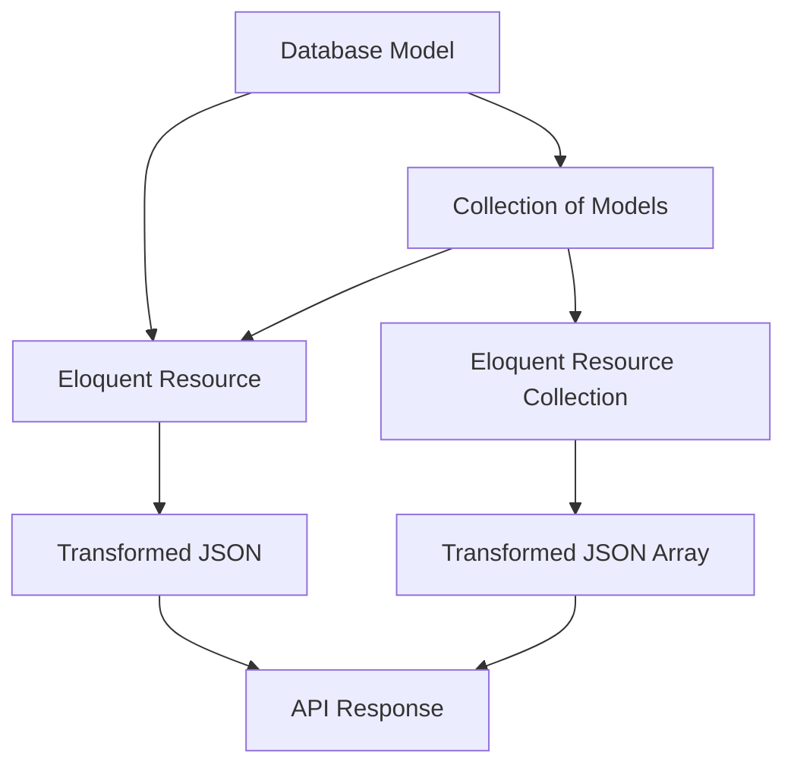
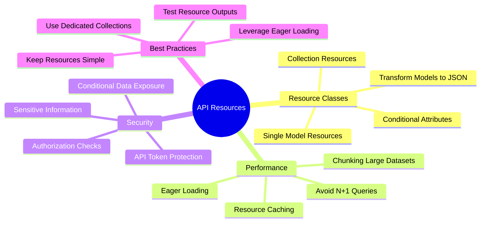

# Eloquent: API Resources

## Introduction

When building an API, you may need a transformation layer that sits between your Eloquent models and the JSON responses that are actually returned to your application's users. Laravel's API resources provide a simple, straightforward approach to transforming your models and model collections into JSON.



An API resource class represents a single model that needs to be transformed into a JSON structure. The resource class lives in the `app/Http/Resources` directory and extends Laravel's `Illuminate\Http\Resources\Json\JsonResource` class.

## Creating Resources

To generate a resource class, you may use the `make:resource` Artisan command. By default, resources will be placed in the `app/Http/Resources` directory of your application:

```bash
php artisan make:resource UserResource
```

This command will create a `UserResource` class in your `app/Http/Resources` directory. The resource class will contain a `toArray` method which is responsible for converting your model's attributes to an array that can be returned as JSON from your application's API:

```php
<?php

namespace App\Http\Resources;

use Illuminate\Http\Request;
use Illuminate\Http\Resources\Json\JsonResource;

class UserResource extends JsonResource
{
    /**
     * Transform the resource into an array.
     *
     * @return array<string, mixed>
     */
    public function toArray(Request $request): array
    {
        return [
            'id' => $this->id,
            'name' => $this->name,
            'email' => $this->email,
            'created_at' => $this->created_at,
            'updated_at' => $this->updated_at,
        ];
    }
}
```

### Resource Collections

Sometimes you may need to transform a collection of models, such as returning multiple User instances via an API endpoint. To create a resource collection that transforms a collection of models into JSON, you may append the `--collection` flag to the `make:resource` command:

```bash
php artisan make:resource UserResource --collection
```

This command will generate a `UserResourceCollection` class in the `app/Http/Resources` directory. The collection class will contain a `toArray` method which returns the array representation of the resource collection:

```php
<?php

namespace App\Http\Resources;

use Illuminate\Http\Request;
use Illuminate\Http\Resources\Json\ResourceCollection;

class UserResourceCollection extends ResourceCollection
{
    /**
     * Transform the resource collection into an array.
     *
     * @return array<int, \Illuminate\Http\Resources\Json\JsonResource>
     */
    public function toArray(Request $request): array
    {
        return [
            'data' => $this->collection,
        ];
    }
}
```

By default, Laravel will generate a resource collection class that wraps the collection of resources within a `data` key. This is in accordance with the JSON:API specification. If you wish to customize the collection response, you may modify the `toArray` method of the resource collection class.

## Usage

### Basic Usage

Once you have created a resource, you may return it from one of your routes or controllers. A resource class exposes a `toArray` method that transforms your model into an array. The resource automatically converts the array to JSON when it's returned from a route or controller:

```php
use App\Http\Resources\UserResource;
use App\Models\User;

Route::get('/user/{id}', function (string $id) {
    return new UserResource(User::findOrFail($id));
});
```

Resource collections may be returned in the same way. Instead of returning an individual `UserResource` instance, you would return a `UserResourceCollection` instance:

```php
use App\Http\Resources\UserResource;
use App\Models\User;

Route::get('/users', function () {
    return UserResource::collection(User::all());
});
```

### Wrapping Resources

Laravel provides a convenient way to wrap your resource's output within a top-level "data" key. To accomplish this, you may chain the `wrap` method onto your resource's instantiation. The `wrap` method accepts a string value that represents the "data" key you wish to wrap your resource's data within:

```php
use App\Http\Resources\UserResource;
use App\Models\User;

return (new UserResource(User::find(1)))->wrap('user');
```

The above example would return the following JSON response:

```json
{
    "user": {
        "id": 1,
        "name": "Taylor Otwell",
        "email": "taylor@laravel.com"
    }
}
```

To disable the wrapping of top-level resource data, you may call the `withoutWrapping` method within the `boot` method of your application's `AppServiceProvider`:

```php
use Illuminate\Http\Resources\Json\JsonResource;

/**
 * Bootstrap any application services.
 */
public function boot(): void
{
    JsonResource::withoutWrapping();
}
```

### Pagination

When returning paginated collections to your application's users, you may return your resource collection from the paginator directly. Even when transforming paginated resources using a resource collection, the `data` wrapper will automatically be included in the response, as well as any other pagination metadata such as `links` and `meta`:

```php
use App\Http\Resources\UserResource;
use App\Models\User;

Route::get('/users', function () {
    return UserResource::collection(User::paginate());
});
```

The above example would return a JSON response that looks like the following:

```json
{
    "data": [
        {
            "id": 1,
            "name": "Taylor Otwell",
            "email": "taylor@laravel.com"
        }
    ],
    "links": {
        "first": "http://localhost/users?page=1",
        "last": "http://localhost/users?page=1",
        "prev": null,
        "next": null
    },
    "meta": {
        "current_page": 1,
        "from": 1,
        "last_page": 1,
        "links": [...],
        "path": "http://localhost/users",
        "per_page": 15,
        "to": 1,
        "total": 1
    }
}
```

## Data Wrapping

### Customizing the "Data" Wrapper

As mentioned previously, resource collections are wrapped in a `data` key by default. You may customize the name of this wrapper by defining a `$wrap` property on the resource class:

```php
<?php

namespace App\Http\Resources;

use Illuminate\Http\Resources\Json\JsonResource;

class UserResource extends JsonResource
{
    /**
     * The "data" wrapper that should be applied.
     *
     * @var string|null
     */
    public static $wrap = 'user';
}
```

To disable wrapping for a single resource response, you may call the `withoutWrapping` method on the resource when returning it:

```php
return (new UserResource($user))->withoutWrapping();
```

### Resource Collections

When returning resource collections, you may return them in several ways. First, you may return them directly from your route or controller:

```php
return UserResource::collection(User::all());
```

However, this approach doesn't allow you to add additional data to the response. To add additional data to the response, you may call the `collection` method on the resource class and then modify the returned response using the `additional` method:

```php
return UserResource::collection(User::all())
    ->additional(['meta' => [
        'count' => User::count()
    ]]);
```

### Custom Resource Collections

For more complex resource collection responses, you may create a dedicated resource collection class. A resource collection class will be placed in the `app/Http/Resources` directory like your other resources. When generating a resource collection class, you should use the `--collection` flag when executing the `make:resource` command:

```bash
php artisan make:resource UsersCollection
```

This command will generate a new resource collection class at `app/Http/Resources/UsersCollection.php`. This class contains a `toArray` method where you can customize the collection's response:

```php
<?php

namespace App\Http\Resources;

use Illuminate\Http\Request;
use Illuminate\Http\Resources\Json\ResourceCollection;

class UsersCollection extends ResourceCollection
{
    /**
     * Transform the resource collection into an array.
     *
     * @return array<int, \Illuminate\Http\Resources\Json\JsonResource>
     */
    public function toArray(Request $request): array
    {
        return [
            'data' => $this->collection,
            'links' => [
                'self' => 'link-value',
            ],
        ];
    }
}
```

Once the resource collection class has been defined, you may return it directly from your route or controller:

```php
use App\Http\Resources\UsersCollection;
use App\Models\User;

return new UsersCollection(User::all());
```

## Conditional Attributes

Sometimes you may wish to only include an attribute in your resource response if a given condition is met. For example, you may wish to only include a user's email address in the response if the current user is the "owner" of the user data being returned. Laravel provides a variety of helper methods to assist you with this. The `when` method may be used to conditionally add an attribute to your resource response:

```php
/**
 * Transform the resource into an array.
 *
 * @return array<string, mixed>
 */
public function toArray(Request $request): array
{
    return [
        'id' => $this->id,
        'name' => $this->name,
        'email' => $this->when(Auth::id() === $this->id, $this->email),
        'created_at' => $this->created_at,
        'updated_at' => $this->updated_at,
    ];
}
```

In this example, the `email` key will only be included in the final resource response if the condition is `true`. If the condition is `false`, the `email` key will be removed from the resource response entirely before it is sent to the client.

The `when` method also accepts a third argument, which should be the value to return if the condition is `false`. This is particularly useful when you want to conditionally return `null` values:

```php
'nickname' => $this->when($this->hasNickname(), $this->nickname, 'No nickname'),
```

### Conditional Relationships

The `whenLoaded` method may be used to conditionally include relationship data in your resource response. This method prevents your resource from unnecessarily attempting to load relationships that have not been eager loaded by your query. The `whenLoaded` method accepts the name of the relationship as its only argument:

```php
/**
 * Transform the resource into an array.
 *
 * @return array<string, mixed>
 */
public function toArray(Request $request): array
{
    return [
        'id' => $this->id,
        'name' => $this->name,
        'email' => $this->email,
        'posts' => $this->whenLoaded('posts'),
        'created_at' => $this->created_at,
        'updated_at' => $this->updated_at,
    ];
}
```

In this example, if the relationship has not been loaded, the `posts` key will be removed from the resource response entirely before it is sent to the client.

If you need to transform the relationship via another resource class, you may pass an instance of the resource class as the second argument to the `whenLoaded` method:

```php
'posts' => $this->whenLoaded('posts', new PostCollection($this->whenLoaded('posts'))),
```

Or, you may provide a closure that returns a resource instance:

```php
'posts' => $this->whenLoaded('posts', function () {
    return new PostCollection($this->posts);
}),
```

### Merging Conditional Attributes

Sometimes you may have several attributes that should only be included in the resource response based on the same condition. In this case, you may use the `mergeWhen` method to include the attributes in your response only when the given condition is `true`:

```php
/**
 * Transform the resource into an array.
 *
 * @return array<string, mixed>
 */
public function toArray(Request $request): array
{
    return [
        'id' => $this->id,
        'name' => $this->name,
        'email' => $this->email,
        $this->mergeWhen(Auth::id() === $this->id, [
            'posts' => $this->posts,
            'email' => $this->email,
        ]),
        'created_at' => $this->created_at,
        'updated_at' => $this->updated_at,
    ];
}
```

Again, if the condition is `false`, these attributes will be removed from the resource response entirely before it is sent to the client.

You should be careful to not use the `mergeWhen` method within arrays that have numeric keys. Because the resource transformation process merges arrays using PHP's `array_merge` function, the numeric keys in the conditional array may cause unexpected re-indexing of values:

```php
[
    'id' => $this->id,
    $this->mergeWhen(true, [
        'first_item_in_collection',
        'second_item_in_collection',
    ])
]
```

The above example would result in a final array of:

```php
[
    'id' => 1,
    0 => 'first_item_in_collection',
    1 => 'second_item_in_collection',
]
```

## Conditional Relationships

### Eager Loading

When your resource returns a collection of models, it's important to remember that relationships may not be eager loaded on the models within the collection. This can lead to the N+1 query problem, where additional queries are executed for each model in the collection.

To avoid this issue, you should eager load the necessary relationships in your query. For example, when returning a collection of `Post` models:

```php
use App\Http\Resources\PostResource;
use App\Models\Post;

return PostResource::collection(Post::with('author')->get());
```

### Lazy Loading Prevention

You may prevent accidental N+1 queries by enabling strict mode for lazy loading. When strict mode is enabled, an exception will be thrown when your application attempts to lazy load a relationship that has not been eager loaded:

```php
// In AppServiceProvider boot method
use Illuminate\Database\Eloquent\Model;

Model::preventLazyLoading();
```

## Extending Resources

### Anonymous Resources

Sometimes you may need to transform a model or collection without creating a dedicated resource class. You may accomplish this by returning an anonymous resource class from your route or controller. To create an anonymous resource class, you may pass a closure to the `make` method of the resource:

```php
use App\Models\User;
use Illuminate\Http\Resources\Json\JsonResource;

Route::get('/user/{id}', function (string $id) {
    return JsonResource::make(User::findOrFail($id), function ($user) {
        return [
            'id' => $user->id,
            'name' => $user->name,
            'email' => $user->email,
            'secret' => 'secret-value',
        ];
    });
});
```

### Resource Composition

You can compose resources by returning other resources from your resource's `toArray` method:

```php
<?php

namespace App\Http\Resources;

use Illuminate\Http\Request;
use Illuminate\Http\Resources\Json\JsonResource;

class PostResource extends JsonResource
{
    /**
     * Transform the resource into an array.
     *
     * @return array<string, mixed>
     */
    public function toArray(Request $request): array
    {
        return [
            'id' => $this->id,
            'title' => $this->title,
            'content' => $this->content,
            'author' => new UserResource($this->author),
            'created_at' => $this->created_at,
            'updated_at' => $this->updated_at,
        ];
    }
}
```

## Customizing the JSON Response

### Adding Meta Data

You may add additional data to your resource responses by chaining the `additional` method onto your resource when returning it from a route:

```php
return (new UserResource($user))
    ->additional(['meta' => [
        'key' => 'value',
    ]]);
```

### Custom Response Formatting

You may customize the JSON response format by overriding the `toResponse` method in your resource class:

```php
<?php

namespace App\Http\Resources;

use Illuminate\Http\Request;
use Illuminate\Http\Resources\Json\JsonResource;

class UserResource extends JsonResource
{
    /**
     * Create an HTTP response that represents the object.
     */
    public function toResponse(Request $request): \Illuminate\Http\JsonResponse
    {
        return response()->json([
            'status' => 'success',
            'data' => $this->toArray($request),
        ]);
    }
}
```

## Resource Testing

### Testing Resource Responses

When testing API resources, you may want to test that the resource transforms your model data correctly. Laravel provides convenient methods for testing resources:

```php
use App\Http\Resources\UserResource;
use App\Models\User;

public function test_user_resource()
{
    $user = User::factory()->create();
    
    $resource = (new UserResource($user))->toArray(request());
    
    $this->assertEquals($user->id, $resource['id']);
    $this->assertEquals($user->name, $resource['name']);
    $this->assertEquals($user->email, $resource['email']);
}
```

### Testing Conditional Attributes

Testing conditional attributes requires testing the resource under different conditions:

```php
use App\Http\Resources\UserResource;
use App\Models\User;

public function test_conditional_attributes()
{
    $user = User::factory()->create();
    
    // Test with condition that should include email
    $this->be($user);
    $resource = (new UserResource($user))->toArray(request());
    
    $this->assertArrayHasKey('email', $resource);
    
    // Test with condition that should exclude email
    $otherUser = User::factory()->create();
    $this->be($otherUser);
    $resource = (new UserResource($user))->toArray(request());
    
    $this->assertArrayNotHasKey('email', $resource);
}
```

## Performance Considerations

### Eager Loading

Always eager load relationships that will be used in your resources to avoid N+1 query problems:

```php
// Bad: N+1 queries
$users = UserResource::collection(User::all());

// Good: Single query with eager loading
$users = UserResource::collection(User::with('posts')->get());
```

### Resource Caching

For frequently accessed resources, consider implementing caching:

```php
public function toArray(Request $request): array
{
    return Cache::remember("user_{$this->id}_resource", 3600, function () {
        return [
            'id' => $this->id,
            'name' => $this->name,
            'email' => $this->email,
            'profile' => $this->whenLoaded('profile'),
        ];
    });
}
```

### Chunking Large Collections

For large collections, consider using chunking to reduce memory usage:

```php
Route::get('/users', function () {
    $users = User::query()->chunk(100, function ($chunk) {
        return UserResource::collection($chunk);
    });
    
    return $users;
});
```

## Best Practices

### 1. Keep Resources Simple

Resources should focus on transforming data, not performing complex logic:

```php
// Good: Simple transformation
public function toArray(Request $request): array
{
    return [
        'id' => $this->id,
        'name' => $this->name,
        'email' => $this->email,
    ];
}

// Bad: Complex logic in resource
public function toArray(Request $request): array
{
    $stats = $this->posts()->count() + $this->comments()->count();
    
    return [
        'id' => $this->id,
        'name' => $this->name,
        'email' => $this->email,
        'complex_stat' => $stats, // Should be calculated elsewhere
    ];
}
```

### 2. Use Conditional Attributes Appropriately

Only include sensitive data when appropriate:

```php
public function toArray(Request $request): array
{
    return [
        'id' => $this->id,
        'name' => $this->name,
        'email' => $this->when($request->user()->isAdmin(), $this->email),
        'is_admin' => $this->when($request->user()->isAdmin(), $this->is_admin),
    ];
}
```

### 3. Leverage Eager Loading

Always eager load relationships that will be used:

```php
// In your controller
public function index()
{
    $users = User::with(['posts', 'profile'])->get();
    return UserResource::collection($users);
}
```

### 4. Use Resource Collections for Large Datasets

For collections of resources, consider using dedicated collection classes:

```php
// Instead of just using collection()
return UserResource::collection(User::all());

// Use a dedicated collection class
return new UsersCollection(User::all());
```

## Common Pitfalls

### 1. Forgetting to Eager Load Relationships

```php
// This will cause N+1 queries
Route::get('/users', function () {
    return UserResource::collection(User::all());
});

// Fix: Eager load relationships
Route::get('/users', function () {
    return UserResource::collection(User::with('posts')->get());
});
```

### 2. Including Too Much Data

```php
// Bad: Including sensitive data for all users
public function toArray(Request $request): array
{
    return [
        'id' => $this->id,
        'name' => $this->name,
        'email' => $this->email,
        'password' => $this->password, // Never do this!
        'api_token' => $this->api_token, // Never do this!
    ];
}
```

### 3. Not Using Conditional Attributes

```php
// Bad: Always including sensitive data
public function toArray(Request $request): array
{
    return [
        'id' => $this->id,
        'name' => $this->name,
        'email' => $this->email,
        'admin_notes' => $this->admin_notes, // Always included
    ];
}

// Good: Conditional inclusion
public function toArray(Request $request): array
{
    return [
        'id' => $this->id,
        'name' => $this->name,
        'email' => $this->email,
        'admin_notes' => $this->when($request->user()->isAdmin(), $this->admin_notes),
    ];
}
```

## Advanced Usage

### Resource Resolution

You can customize how resources are resolved by implementing the `resolve` method:

```php
public function resolve($request = null)
{
    $data = $this->toArray(
        $request ?: request()
    );

    if ($this->resource instanceof Model) {
        $data['links'] = [
            'self' => route('users.show', $this->resource->id),
        ];
    }

    return $data;
}
```

### Resource Transformation

For complex transformations, you can create transformer methods:

```php
<?php

namespace App\Http\Resources;

use Illuminate\Http\Request;
use Illuminate\Http\Resources\Json\JsonResource;

class UserResource extends JsonResource
{
    /**
     * Transform the resource into an array.
     *
     * @return array<string, mixed>
     */
    public function toArray(Request $request): array
    {
        return [
            'id' => $this->id,
            'name' => $this->name,
            'email' => $this->email,
            'full_name' => $this->getFullName(),
            'avatar_url' => $this->getAvatarUrl(),
            'created_at' => $this->formatDate($this->created_at),
            'updated_at' => $this->formatDate($this->updated_at),
        ];
    }

    protected function getFullName(): string
    {
        return $this->first_name . ' ' . $this->last_name;
    }

    protected function getAvatarUrl(): string
    {
        return $this->avatar ? asset('storage/' . $this->avatar) : asset('images/default-avatar.png');
    }

    protected function formatDate(?string $date): ?string
    {
        return $date ? date('Y-m-d H:i:s', strtotime($date)) : null;
    }
}
```

## Summary

API Resources provide a powerful and intuitive way to transform your Eloquent models into consistent JSON responses for your API. They help maintain clean separation between your models and your API responses while providing conditional attribute inclusion and relationship handling.

Key concepts:
- Resources transform single models to JSON
- Resource collections transform multiple models to JSON arrays
- Conditional attributes allow selective inclusion of data
- Eager loading prevents N+1 query problems
- Custom collections allow advanced response formatting
- Always consider security when including sensitive data



API Resources are essential for building well-structured Laravel APIs that provide consistent, secure, and performant responses to clients.