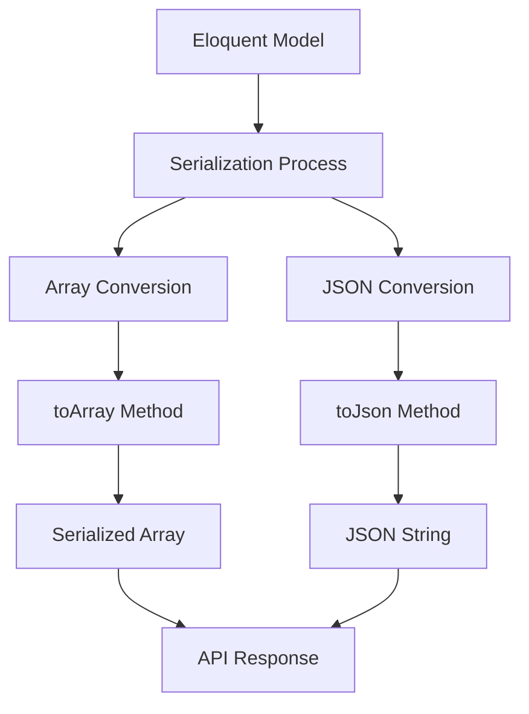
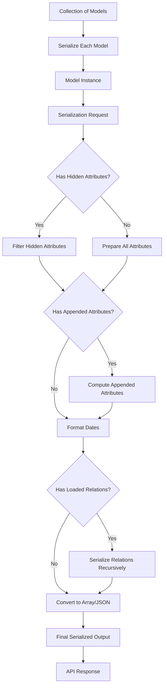

# Eloquent: Serialization

## Introduction

When building JSON APIs, you will often need to convert your models and relationships to arrays or JSON. Laravel's Eloquent ORM provides convenient methods for making these conversions, as well as controlling which attributes are included in your serializations.



## Converting Models to Arrays

To convert a model and its loaded relationships to an array, you should use the `toArray` method. This method is recursive, so all attributes and all relations (including the relations of relations) will be converted to arrays:

```php
use App\Models\User;

$user = User::with('posts')->first();

return $user->toArray();
```

The `toArray` method will automatically convert all of the model's attributes to array format and will also recursively convert all of the model's loaded relationships to arrays.

## Converting Models to JSON

To convert a model to JSON, you should use the `toJson` method. Like `toArray`, the `toJson` method is recursive, so all attributes and relations will be converted to JSON:

```php
use App\Models\User;

$user = User::with('posts')->first();

return $user->toJson();
```

Alternatively, you may cast a model or collection to a string, which will automatically call the `toJson` method on the model:

```php
$user = User::find(1);

return (string) $user;
```

Both `toArray` and `toJson` methods are also available on Eloquent collections. These methods are particularly useful when building JSON APIs for your application:

```php
use App\Models\User;

$users = User::all();

return $users->toArray();
// or
return $users->toJson();
```

## Serializing Models and Relationships

When a model or collection is cast to a string, it will be converted to JSON, making it particularly convenient when returning your Eloquent models directly from your application's routes or controllers:

```php
use App\Models\User;

Route::get('/users', function () {
    return User::all();
});
```

### Hiding Attributes from JSON

Sometimes you may wish to limit the attributes that are included in your model's array or JSON representation. To do this, add a `$hidden` property to your model:

```php
<?php

namespace App\Models;

use Illuminate\Database\Eloquent\Model;

class User extends Model
{
    /**
     * The attributes that should be hidden for serialization.
     *
     * @var array<int, string>
     */
    protected $hidden = ['password', 'remember_token'];
}
```

Alternatively, you may use the `$visible` property to define a "white list" of attributes that should be included in your model's array and JSON representation. All other attributes will be hidden when the model is converted to an array or JSON:

```php
<?php

namespace App\Models;

use Illuminate\Database\Eloquent\Model;

class User extends Model
{
    /**
     * The attributes that should be visible in serialization.
     *
     * @var array<int, string>
     */
    protected $visible = ['first_name', 'last_name', 'email'];
}
```

### Temporarily Overriding Hidden Attributes

If you would like to make a normally hidden attribute visible on a given model instance, you may use the `makeVisible` method. The `makeVisible` method returns the model instance for method chaining:

```php
return $user->makeVisible('attribute')->toArray();
```

Likewise, if you would like to hide attributes that are typically visible, you may use the `makeHidden` method:

```php
return $user->makeHidden('attribute')->toArray();
```

## Appending Values to JSON

Occasionally, you may need to add array attributes that do not have a corresponding column in your database. To do this, you may define an accessor for the value:

```php
<?php

namespace App\Models;

use Illuminate\Database\Eloquent\Casts\Attribute;
use Illuminate\Database\Eloquent\Model;

class User extends Model
{
    /**
     * Get the user's first name.
     */
    protected function firstName(): Attribute
    {
        return Attribute::make(
            get: fn (string $value) => ucfirst($value),
        );
    }

    /**
     * Get the user's full name.
     */
    protected function fullName(): Attribute
    {
        return Attribute::make(
            get: fn (string $value, array $attributes) => $attributes['first_name'].' '.$attributes['last_name'],
        );
    }
}
```

Once you have created the accessor, add the attribute name to the `appends` property on the model. Note that attribute names are typically referenced using "snake case", even though the accessor is defined using "camel case":

```php
<?php

namespace App\Models;

use Illuminate\Database\Eloquent\Model;

class User extends Model
{
    /**
     * The accessors to append to the model's array form.
     *
     * @var array<int, string>
     */
    protected $appends = ['full_name'];
}
```

Once the attribute has been added to the `appends` list, it will be included in both the model's array and JSON representations. Attributes in the `appends` array will also respect the visibility constraints configured for the model (hidden/visible).

### Appending at Runtime

You may also append attributes to a single model instance at runtime using the `append` method. Or, you may use the `setAppends` method to override the entire array of appended properties for a single model instance:

```php
return $user->append('full_name')->toArray();

return $user->setAppends(['full_name'])->toArray();
```

## Date Serialization

### Customizing the Date Format

You may customize the format in which your model's dates are converted to strings using the `$dateFormat` property on your model. This property determines the format in which date attributes are stored in the database, as well as the format in which they are serialized when your model is converted to an array or JSON:

```php
<?php

namespace App\Models;

use Illuminate\Database\Eloquent\Model;

class Flight extends Model
{
    /**
     * The storage format of the model's date columns.
     *
     * @var string
     */
    protected $dateFormat = 'U';
}
```

Alternatively, you may customize how dates are serialized to JSON by overriding the `serializeDate` method. This method does not affect how dates are formatted when they are stored in the database:

```php
use DateTimeInterface;

/**
 * Prepare the model's data for JSON serialization.
 */
protected function serializeDate(DateTimeInterface $date): string
{
    return $date->format('Y-m-d');
}
```

### Date Format Configuration

You may customize the default date format for all of your application's models by calling the `useDateFormat` method in the `boot` method of your `AppServiceProvider`:

```php
use Illuminate\Database\Eloquent\Model;
use Illuminate\Support\ServiceProvider;

class AppServiceProvider extends ServiceProvider
{
    /**
     * Bootstrap any application services.
     */
    public function boot(): void
    {
        Model::useDateFormat('U');
    }
}
```

## Serialization Customization

### Customizing the Serialization Process

Sometimes you may wish to have full control over the serialization process. You can accomplish this by overriding the `jsonSerialize` method on your model:

```php
use Illuminate\Database\Eloquent\Casts\Arrayable;
use JsonSerializable;

class User extends Model implements JsonSerializable
{
    /**
     * Serialize the model to an array.
     */
    public function jsonSerialize(): array
    {
        return [
            'id' => $this->id,
            'name' => $this->name,
            'email' => $this->email,
            'created_at' => $this->created_at->toISOString(),
            'custom_attribute' => $this->getCustomAttribute(),
        ];
    }

    /**
     * Get a custom attribute for serialization.
     */
    protected function getCustomAttribute(): string
    {
        return 'custom_value';
    }
}
```

### Customizing Attribute Serialization

You can also customize how specific attributes are serialized by defining cast types in your model's `$casts` property:

```php
<?php

namespace App\Models;

use Illuminate\Database\Eloquent\Model;

class User extends Model
{
    /**
     * The attributes that should be cast.
     *
     * @var array<string, string>
     */
    protected $casts = [
        'options' => 'array',
        'is_active' => 'boolean',
        'balance' => 'decimal:2',
        'metadata' => 'collection',
    ];
}
```

## Serialization Best Practices

### 1. Use Resource Classes for Complex APIs

For complex API responses, consider using API resources instead of direct serialization:

```php
// Instead of returning model directly
return User::find(1);

// Use API resource
return new UserResource(User::find(1));

// Or for collections
return UserResource::collection(User::all());
```

### 2. Protect Sensitive Data

Always be careful about which attributes are visible in your API responses:

```php
class User extends Model
{
    protected $hidden = [
        'password',
        'remember_token',
        'two_factor_secret',
        'email_verified_at',
    ];
}
```

### 3. Leverage Eager Loading

Always eager load relationships that will be serialized to avoid N+1 query problems:

```php
// Bad: N+1 queries
$users = User::all();
return $users->toJson();

// Good: Single query with eager loading
$users = User::with('posts', 'comments')->get();
return $users->toJson();
```

### 4. Use Appends Sparingly

Only use the `appends` feature when necessary, as it adds computational overhead:

```php
class User extends Model
{
    // Only include computed attributes that are frequently used
    protected $appends = ['full_name', 'is_online'];
    
    protected function fullName(): Attribute
    {
        return Attribute::make(
            get: fn (string $value, array $attributes) => $attributes['first_name'] . ' ' . $attributes['last_name']
        );
    }
    
    protected function isOnline(): Attribute
    {
        return Attribute::make(
            get: fn (string $value, array $attributes) => $attributes['last_activity_at']->diffInMinutes(now()) < 5
        );
    }
}
```

## Advanced Serialization Techniques

### Serialization with Conditions

You can conditionally include attributes in your serialization:

```php
public function toArray($request)
{
    return [
        'id' => $this->id,
        'name' => $this->name,
        'email' => $this->when(Auth::id() === $this->id, $this->email),
        'created_at' => $this->created_at,
        'admin_notes' => $this->when(Auth::user()?->isAdmin(), $this->admin_notes),
    ];
}
```

### Serialization with Relationships

When serializing models with relationships, you can control which relationships are included:

```php
// Only serialize specific relationships
$user = User::with('posts')->first();
return $user->setRelations(['posts'])->toArray();

// Exclude specific relationships
$user = User::with(['posts', 'comments'])->first();
$user->unsetRelation('comments');
return $user->toArray();
```

### Custom Serialization Methods

You can create custom serialization methods for different contexts:

```php
class User extends Model
{
    public function serializeForPublic(): array
    {
        return [
            'id' => $this->id,
            'name' => $this->name,
            'avatar' => $this->avatar_url,
        ];
    }
    
    public function serializeForAdmin(): array
    {
        return array_merge($this->serializeForPublic(), [
            'email' => $this->email,
            'last_login' => $this->last_login_at,
            'is_active' => $this->is_active,
        ]);
    }
}
```

## Performance Considerations

### Memory Usage

Large model serializations can consume significant memory. Consider chunking large datasets:

```php
// For large collections, consider chunking
User::chunk(1000, function ($users) {
    foreach ($users as $user) {
        // Process each user individually
        echo $user->toJson();
    }
});
```

### Database Query Optimization

Always optimize your queries before serialization:

```php
// Use select to limit columns retrieved
$users = User::select(['id', 'name', 'email'])->get();

// Use where clauses to limit results
$users = User::where('active', true)->limit(100)->get();

// Combine with eager loading
$users = User::with('posts')
    ->select(['id', 'name', 'email'])
    ->where('active', true)
    ->limit(100)
    ->get();
```

### Serialization Caching

For frequently accessed serialized data, consider implementing caching:

```php
public function getCachedArray()
{
    return Cache::remember("user_{$this->id}_array", 3600, function () {
        return $this->toArray();
    });
}

public function getCachedJson()
{
    return Cache::remember("user_{$this->id}_json", 3600, function () {
        return $this->toJson();
    });
}
```

## Security Considerations

### Data Exposure Prevention

Always be mindful of what data you're exposing through serialization:

```php
class User extends Model
{
    // Explicitly hide sensitive attributes
    protected $hidden = [
        'password',
        'remember_token',
        'two_factor_recovery_codes',
        'two_factor_secret',
        'email_verified_at',
        'password_reset_token',
    ];
    
    // Or use visible to whitelist only necessary attributes
    protected $visible = [
        'id',
        'name',
        'email',
        'created_at',
        'updated_at',
    ];
}
```

### Authorization in Serialization

Implement authorization checks when serializing sensitive data:

```php
public function toArray($request)
{
    return [
        'id' => $this->id,
        'name' => $this->name,
        'email' => $this->when(
            $request->user()?->can('viewEmail', $this), 
            $this->email
        ),
        'admin_notes' => $this->when(
            $request->user()?->isAdmin(), 
            $this->admin_notes
        ),
    ];
}
```

## Common Serialization Patterns

### Pattern 1: API Response Standardization

```php
// Create a standardized API response
public function toApiResponse()
{
    return [
        'data' => $this->toArray(),
        'meta' => [
            'timestamp' => now()->toISOString(),
            'version' => '1.0',
        ]
    ];
}
```

### Pattern 2: Conditional Serialization Based on User Role

```php
public function toArray($request)
{
    $array = [
        'id' => $this->id,
        'name' => $this->name,
        'created_at' => $this->created_at,
        'updated_at' => $this->updated_at,
    ];

    if ($request->user()?->isAdmin()) {
        $array['email'] = $this->email;
        $array['is_active'] = $this->is_active;
    }

    if ($request->user()?->can('viewFinancialData', $this)) {
        $array['balance'] = $this->balance;
    }

    return $array;
}
```

### Pattern 3: Versioned Serialization

```php
public function toArray($request)
{
    $version = $request->header('API-Version', '1.0');
    
    $array = [
        'id' => $this->id,
        'name' => $this->name,
    ];

    switch ($version) {
        case '2.0':
            $array['email'] = $this->email;
            $array['profile'] = $this->whenLoaded('profile');
            break;
        case '1.0':
        default:
            // Keep original format for backward compatibility
            break;
    }

    return $array;
}
```

## Troubleshooting Common Issues

### Issue 1: Circular References

When models have circular relationships, serialization can cause infinite loops:

```php
// Problem: Circular reference between User and Profile
class User extends Model
{
    public function profile(): HasOne
    {
        return $this->hasOne(Profile::class);
    }
}

class Profile extends Model
{
    public function user(): BelongsTo
    {
        return $this->belongsTo(User::class);
    }
}

// Solution: Be careful with eager loading and serialization
$user = User::with('profile')->first();
// The profile will include the user again, causing circular reference
```

### Issue 2: Memory Exhaustion

Large datasets can cause memory issues:

```php
// Instead of serializing all at once
$users = User::all(); // Potentially millions of records
return $users->toJson(); // Could exhaust memory

// Use chunking
$result = [];
User::chunk(1000, function ($chunk) use (&$result) {
    foreach ($chunk as $user) {
        $result[] = $user->toArray();
    }
});
return response()->json($result);
```

### Issue 3: Serialization Performance

For high-performance applications, consider these optimizations:

```php
// Use raw queries for read-only operations
$users = DB::table('users')
    ->select(['id', 'name', 'email'])
    ->where('active', true)
    ->get()
    ->map(function ($user) {
        return (array) $user;
    });

// Or use array-only models when possible
$users = User::select(['id', 'name', 'email'])->get()->toArray();
```

## Visualization of Serialization Process



## Summary

Eloquent serialization is a powerful feature that allows you to easily convert your models to arrays and JSON for API responses. Key concepts include:

- Use `toArray()` to convert models to arrays
- Use `toJson()` to convert models to JSON strings
- Control visibility with `$hidden` and `$visible` properties
- Add computed attributes with `$appends` and accessors
- Customize date formats with `$dateFormat`
- Consider performance and security implications
- Use API resources for complex serialization needs

Remember to always be mindful of what data you're exposing through your API and to optimize your queries for better performance.

```mermaid
mindmap
  root((Eloquent Serialization))
    Converting to Array
      toArray method
      Recursive conversion
      Includes relationships
      Performance considerations
    Converting to JSON
      toJson method
      String casting
      Collections to JSON
      Headers and formatting
    Controlling Visibility
      $hidden property
      $visible property
      makeVisible method
      makeHidden method
    Adding Computed Values
      $appends property
      Accessors
      Runtime appending
      Conditional attributes
    Date Handling
      $dateFormat property
      serializeDate method
      ISO format
      Custom formats
    Security
      Hidden attributes
      Authorization checks
      Data exposure
      API resources
    Performance
      Eager loading
      Query optimization
      Memory usage
      Caching strategies