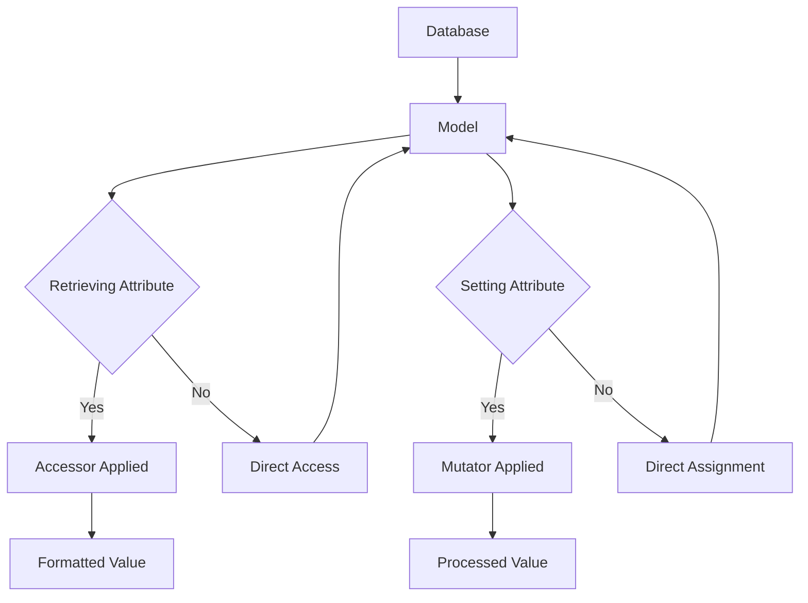
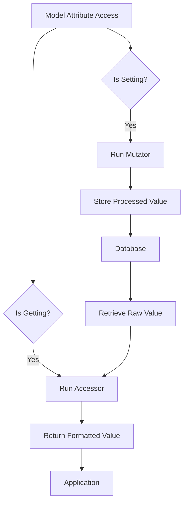

# Eloquent: Mutators

## Introduction

Accessors and mutators allow you to format Eloquent model attributes when retrieving them from a model or setting their value. For example, you may want to format a value like a phone number when retrieving it from the database, or hash a password before saving it to the database.



## Accessors

### Defining an Accessor

To define an accessor, create a protected method on your model to represent the accessible attribute. This method name should correspond to the "camel case" representation of the desired attribute name. In this example, we'll define an accessor for the `first_name` attribute. The accessor will automatically be called by Eloquent when attempting to retrieve the value of `first_name`:

```php
<?php

namespace App\Models;

use Illuminate\Database\Eloquent\Casts\Attribute;
use Illuminate\Database\Eloquent\Model;

class User extends Model
{
    /**
     * Get the user's first name.
     */
    protected function firstName(): Attribute
    {
        return Attribute::make(
            get: fn (string $value) => ucfirst($value),
        );
    }
}
```

As you can see, the original value of the column is passed to the accessor as an argument, allowing you to manipulate and return the value. To access the value of the accessor, you may simply access the `first_name` attribute:

```php
use App\Models\User;

$user = User::find(1);

$firstName = $user->first_name;
```

### Accessor with Additional Arguments

Accessors can also accept additional arguments beyond the original value:

```php
<?php

namespace App\Models;

use Illuminate\Database\Eloquent\Casts\Attribute;
use Illuminate\Database\Eloquent\Model;

class User extends Model
{
    /**
     * Get the user's full name with custom separator.
     */
    protected function fullName(): Attribute
    {
        return Attribute::make(
            get: fn (string $value, array $attributes) => $attributes['first_name'] . ' ' . $attributes['last_name'],
        );
    }
    
    /**
     * Get the user's name with custom format.
     */
    protected function formattedName(): Attribute
    {
        return Attribute::make(
            get: fn (string $value, array $attributes) => strtoupper($attributes['first_name'] . ' ' . $attributes['last_name']),
        );
    }
}
```

### Complex Accessor Example

Here's a more complex example that demonstrates various accessor patterns:

```php
<?php

namespace App\Models;

use Illuminate\Database\Eloquent\Casts\Attribute;
use Illuminate\Database\Eloquent\Model;
use Illuminate\Support\Str;

class User extends Model
{
    /**
     * Get the user's full name.
     */
    protected function fullName(): Attribute
    {
        return Attribute::make(
            get: fn (string $value, array $attributes) => trim($attributes['first_name'] . ' ' . $attributes['last_name']),
        );
    }

    /**
     * Get the user's email in lowercase.
     */
    protected function normalizedEmail(): Attribute
    {
        return Attribute::make(
            get: fn (string $value) => strtolower($value),
        );
    }

    /**
     * Get the user's avatar URL.
     */
    protected function avatarUrl(): Attribute
    {
        return Attribute::make(
            get: fn (string $value, array $attributes) => $value ?: 'https://www.gravatar.com/avatar/' . md5(strtolower($attributes['email'])),
        );
    }

    /**
     * Get the user's account age in days.
     */
    protected function accountAge(): Attribute
    {
        return Attribute::make(
            get: fn (string $value, array $attributes) => now()->diffInDays($attributes['created_at']),
        );
    }

    /**
     * Get the user's masked phone number.
     */
    protected function maskedPhone(): Attribute
    {
        return Attribute::make(
            get: fn (string $value) => Str::mask($value, '*', 3, -4),
        );
    }
}
```

## Mutators

### Defining a Mutator

Mutators follow a similar convention to accessors; however, they allow you to format an Eloquent attribute value when it is set on the model. To define a mutator, define a protected method on your model that returns an `Attribute` instance with a `set` callback. Let's define a mutator for the `first_name` attribute. This mutator will be automatically called when we attempt to set the value of the `first_name` attribute on the model:

```php
<?php

namespace App\Models;

use Illuminate\Database\Eloquent\Casts\Attribute;
use Illuminate\Database\Eloquent\Model;

class User extends Model
{
    /**
     * Set the user's first name.
     */
    protected function firstName(): Attribute
    {
        return Attribute::make(
            set: fn (string $value) => ucfirst($value),
        );
    }
}
```

The mutator will receive the value that is being set on the attribute, allowing you to manipulate the value and return the manipulated value. In this example, we're capitalizing the first letter of the name when the attribute is set. To use our mutator, we can simply set the `first_name` attribute on an Eloquent model:

```php
use App\Models\User;

$user = User::find(1);

$user->first_name = 'sally';

$user->save();
```

In this example, the `set` callback will be called with the value `sally`. The capitalized value will then be inserted into the model's internal attributes array.

### Mutator with Multiple Operations

Mutators can perform multiple operations on the value:

```php
<?php

namespace App\Models;

use Illuminate\Database\Eloquent\Casts\Attribute;
use Illuminate\Database\Eloquent\Model;
use Illuminate\Support\Str;

class User extends Model
{
    /**
     * Set the user's first name and last name.
     */
    protected function firstName(): Attribute
    {
        return Attribute::make(
            set: function (string $value) {
                $value = trim($value);
                $value = Str::title($value);
                $value = preg_replace('/[^a-zA-Z\s]/', '', $value);
                return $value;
            },
        );
    }

    /**
     * Set the user's email and normalize it.
     */
    protected function email(): Attribute
    {
        return Attribute::make(
            set: fn (string $value) => strtolower(trim($value)),
        );
    }

    /**
     * Set the user's phone number and format it.
     */
    protected function phone(): Attribute
    {
        return Attribute::make(
            set: function (string $value) {
                // Remove all non-numeric characters
                $cleaned = preg_replace('/[^0-9]/', '', $value);
                
                // Format as (XXX) XXX-XXXX
                $formatted = preg_replace('/^(\d{3})(\d{3})(\d{4})$/', '($1) $2-$3', $cleaned);
                
                return $formatted;
            },
        );
    }
}
```

### Combined Accessor and Mutator

You can define both accessor and mutator for the same attribute:

```php
<?php

namespace App\Models;

use Illuminate\Database\Eloquent\Casts\Attribute;
use Illuminate\Database\Eloquent\Model;

class User extends Model
{
    /**
     * Get / Set the user's first name.
     */
    protected function firstName(): Attribute
    {
        return Attribute::make(
            get: fn (string $value) => ucfirst($value),
            set: fn (string $value) => strtolower($value),
        );
    }

    /**
     * Get / Set the user's password with hashing.
     */
    protected function password(): Attribute
    {
        return Attribute::make(
            get: fn (string $value) => $value,
            set: fn (string $value) => bcrypt($value),
        );
    }
}
```

## Attribute Casting

Laravel provides additional casting functionality that works alongside accessors and mutators. You can cast attributes to common data types:

```php
<?php

namespace App\Models;

use Illuminate\Database\Eloquent\Model;
use Illuminate\Database\Eloquent\Casts\Attribute;

class User extends Model
{
    /**
     * The attributes that should be cast.
     *
     * @var array<string, string>
     */
    protected $casts = [
        'email_verified_at' => 'datetime',
        'is_subscribed' => 'boolean',
        'options' => 'array',
        'metadata' => 'collection',
        'balance' => 'decimal:2',
    ];

    /**
     * Get the user's balance as formatted currency.
     */
    protected function formattedBalance(): Attribute
    {
        return Attribute::make(
            get: fn (string $value, array $attributes) => '$' . number_format($attributes['balance'], 2),
        );
    }
}
```

### Custom Cast Classes

For more complex casting scenarios, you can create custom cast classes:

```php
<?php

namespace App\Casts;

use Illuminate\Contracts\Database\Eloquent\CastsAttributes;
use Illuminate\Database\Eloquent\Model;

class Money implements CastsAttributes
{
    /**
     * Cast the given value.
     *
     * @param  array<string, mixed>  $attributes
     */
    public function get(Model $model, string $key, mixed $value, array $attributes): float
    {
        return $value / 100;
    }

    /**
     * Prepare the given value for storage.
     */
    public function set(Model $model, string $key, mixed $value, array $attributes): int
    {
        return (int) round($value * 100);
    }
}
```

Then use the custom cast in your model:

```php
<?php

namespace App\Models;

use App\Casts\Money;
use Illuminate\Database\Eloquent\Model;

class Order extends Model
{
    protected $casts = [
        'amount' => Money::class,
    ];
}
```

## Array / JSON Casting

When working with attributes that are stored as JSON, you can cast them to an array and work with them as such:

```php
<?php

namespace App\Models;

use Illuminate\Database\Eloquent\Model;

class User extends Model
{
    protected $casts = [
        'options' => 'array',
        'preferences' => 'array',
        'metadata' => 'collection',
    ];
}
```

You can then access the JSON attributes as if they were properties of an array:

```php
$user = User::find(1);

$options = $user->options['key'];

$user->options['key'] = 'value';

$user->save();
```

## Date Casting

Laravel provides convenient methods for working with dates:

```php
<?php

namespace App\Models;

use Illuminate\Database\Eloquent\Model;
use Illuminate\Database\Eloquent\Casts\Attribute;

class Flight extends Model
{
    protected $casts = [
        'departure_at' => 'datetime',
        'arrived_at' => 'datetime',
    ];

    /**
     * Get the departure time in user's timezone.
     */
    protected function departureAtFormatted(): Attribute
    {
        return Attribute::make(
            get: fn (string $value, array $attributes) => 
                isset($attributes['departure_at']) 
                    ? $this->asDateTime($attributes['departure_at'])->format('Y-m-d H:i:s T') 
                    : null,
        );
    }
}
```

### Custom Date Formatting

```php
<?php

namespace App\Models;

use Carbon\Carbon;
use Illuminate\Database\Eloquent\Model;
use Illuminate\Database\Eloquent\Casts\Attribute;

class Event extends Model
{
    protected $casts = [
        'starts_at' => 'datetime',
    ];

    /**
     * Get the event start time formatted for display.
     */
    protected function startsAtFormatted(): Attribute
    {
        return Attribute::make(
            get: fn (string $value, array $attributes) => 
                Carbon::parse($attributes['starts_at'])->format('F j, Y g:i A'),
        );
    }
}
```

## Encrypted Attribute Casting

Laravel can automatically encrypt and decrypt attributes:

```php
<?php

namespace App\Models;

use Illuminate\Database\Eloquent\Model;

class User extends Model
{
    protected $casts = [
        'secret' => 'encrypted',
        'private_key' => 'encrypted:array',
    ];
}
```

## Attribute Mutator / Accessor Best Practices

### 1. Use Type Hints for Better IDE Support

```php
<?php

namespace App\Models;

use Illuminate\Database\Eloquent\Casts\Attribute;
use Illuminate\Database\Eloquent\Model;

class User extends Model
{
    /**
     * Get the user's full name.
     */
    protected function fullName(): Attribute
    {
        return Attribute::make(
            get: fn (string $value, array $attributes) => 
                trim($attributes['first_name'] . ' ' . $attributes['last_name']),
        );
    }
}
```

### 2. Handle Null Values Gracefully

```php
<?php

namespace App\Models;

use Illuminate\Database\Eloquent\Casts\Attribute;
use Illuminate\Database\Eloquent\Model;

class User extends Model
{
    /**
     * Get the user's avatar URL with fallback.
     */
    protected function avatarUrl(): Attribute
    {
        return Attribute::make(
            get: fn (?string $value) => $value ?: '/images/default-avatar.png',
        );
    }
}
```

### 3. Use Accessors for Computed Properties

```php
<?php

namespace App\Models;

use Illuminate\Database\Eloquent\Casts\Attribute;
use Illuminate\Database\Eloquent\Model;

class Order extends Model
{
    /**
     * Get the total price including tax.
     */
    protected function totalPrice(): Attribute
    {
        return Attribute::make(
            get: fn (string $value, array $attributes) => 
                $attributes['subtotal'] + $attributes['tax'],
        );
    }
}
```

## Serialization with Accessors and Mutators

When models are serialized to arrays or JSON, accessor values will automatically be included if they are available:

```php
<?php

namespace App\Models;

use Illuminate\Database\Eloquent\Casts\Attribute;
use Illuminate\Database\Eloquent\Model;

class User extends Model
{
    /**
     * Get the user's full name.
     */
    protected function fullName(): Attribute
    {
        return Attribute::make(
            get: fn (string $value, array $attributes) => 
                $attributes['first_name'] . ' ' . $attributes['last_name'],
        );
    }
}

// The full_name attribute will be included in JSON/array output
$user = User::find(1);
return $user->toArray(); // Includes full_name
return $user->toJson();  // Includes full_name
```

## Attribute Caching

For expensive computations in accessors, you might want to implement caching:

```php
<?php

namespace App\Models;

use Illuminate\Database\Eloquent\Casts\Attribute;
use Illuminate\Database\Eloquent\Model;

class User extends Model
{
    /**
     * Get the user's total order value (cached).
     */
    protected function totalOrderValue(): Attribute
    {
        return Attribute::make(
            get: function (string $value, array $attributes) {
                $cacheKey = "user_total_order_value_{$attributes['id']}";
                
                return cache()->remember($cacheKey, 3600, function () use ($attributes) {
                    return $this->orders()->sum('total');
                });
            },
        );
    }
}
```

## Conditional Attribute Application

You can conditionally apply accessors based on context:

```php
<?php

namespace App\Models;

use Illuminate\Database\Eloquent\Casts\Attribute;
use Illuminate\Database\Eloquent\Model;

class User extends Model
{
    /**
     * Get the user's email, conditionally based on context.
     */
    protected function email(): Attribute
    {
        return Attribute::make(
            get: function (string $value) {
                if (request()->is('api/*')) {
                    // Hide email in API responses unless authorized
                    return auth()->check() ? $value : null;
                }
                
                return $value;
            },
        );
    }
}
```

## Performance Considerations

### 1. Avoid Heavy Computations in Accessors

```php
// Bad: Heavy computation on every access
protected function expensiveCalculation(): Attribute
{
    return Attribute::make(
        get: fn (string $value, array $attributes) => 
            // Expensive database query or calculation
            $this->performComplexCalculation(),
    );
}

// Good: Lazy loading or caching
protected function expensiveCalculation(): Attribute
{
    return Attribute::make(
        get: function (string $value, array $attributes) {
            if (!isset($this->attributes['cached_calculation'])) {
                $this->attributes['cached_calculation'] = $this->performComplexCalculation();
            }
            return $this->attributes['cached_calculation'];
        },
    );
}
```

### 2. Use Database-Level Formatting When Possible

```php
// Instead of accessor, consider database-level formatting
class User extends Model
{
    protected $appends = ['formatted_phone'];
    
    public function getFormattedPhoneAttribute()
    {
        // This creates PHP overhead for every model
        return $this->formatPhone($this->phone);
    }
}

// Better: Format at query level when possible
class User extends Model
{
    protected $appends = ['formatted_phone'];
    
    protected function formattedPhone(): Attribute
    {
        return Attribute::make(
            get: fn (string $value, array $attributes) => 
                $this->formatPhone($attributes['phone']),
        );
    }
}
```

## Security Considerations

### 1. Sanitize Input in Mutators

```php
<?php

namespace App\Models;

use Illuminate\Database\Eloquent\Casts\Attribute;
use Illuminate\Database\Eloquent\Model;
use Illuminate\Support\Str;

class User extends Model
{
    /**
     * Set the user's bio with sanitization.
     */
    protected function bio(): Attribute
    {
        return Attribute::make(
            set: fn (string $value) => strip_tags($value), // Basic sanitization
        );
    }
}
```

### 2. Don't Expose Sensitive Information in Accessors

```php
// Never do this
protected function password(): Attribute
{
    return Attribute::make(
        get: fn (string $value) => $value, // Exposes hashed password!
    );
}

// Instead, use mutators only for sensitive data
protected function password(): Attribute
{
    return Attribute::make(
        set: fn (string $value) => bcrypt($value),
    );
}
```

## Advanced Attribute Patterns

### 1. Attribute with Multiple Sources

```php
<?php

namespace App\Models;

use Illuminate\Database\Eloquent\Casts\Attribute;
use Illuminate\Database\Eloquent\Model;

class User extends Model
{
    /**
     * Get the user's display name (prefer nickname, fallback to full name).
     */
    protected function displayName(): Attribute
    {
        return Attribute::make(
            get: fn (string $value, array $attributes) => 
                $attributes['nickname'] ?: 
                ($attributes['first_name'] . ' ' . $attributes['last_name']),
        );
    }
}
```

### 2. Conditional Mutators

```php
<?php

namespace App\Models;

use Illuminate\Database\Eloquent\Casts\Attribute;
use Illuminate\Database\Eloquent\Model;

class User extends Model
{
    /**
     * Set the user's phone number with country-specific formatting.
     */
    protected function phone(): Attribute
    {
        return Attribute::make(
            set: function (string $value) {
                if (strpos($value, '+') !== 0) {
                    // Assume US number if no country code
                    $value = '+1' . preg_replace('/[^0-9]/', '', $value);
                }
                return $value;
            },
        );
    }
}
```

### 3. Attribute with Validation

```php
<?php

namespace App\Models;

use Illuminate\Database\Eloquent\Casts\Attribute;
use Illuminate\Database\Eloquent\Model;
use InvalidArgumentException;

class User extends Model
{
    /**
     * Set the user's age with validation.
     */
    protected function age(): Attribute
    {
        return Attribute::make(
            set: function (int $value) {
                if ($value < 0 || $value > 150) {
                    throw new InvalidArgumentException('Age must be between 0 and 150');
                }
                return $value;
            },
        );
    }
}
```

## Testing Attributes

When testing models with accessors and mutators, make sure to test both the getter and setter functionality:

```php
<?php

namespace Tests\Unit;

use App\Models\User;
use Tests\TestCase;

class UserAttributeTest extends TestCase
{
    public function test_first_name_accessor_formats_properly(): void
    {
        $user = new User();
        $user->first_name = 'john'; // Mutator runs here
        
        $this->assertEquals('John', $user->first_name); // Accessor runs here
    }
    
    public function test_phone_number_mutator_formats_correctly(): void
    {
        $user = new User();
        $user->phone = '1234567890';
        
        $this->assertEquals('(123) 456-7890', $user->phone);
    }
    
    public function test_serialization_includes_accessor_values(): void
    {
        $user = new User([
            'first_name' => 'john',
            'last_name' => 'doe'
        ]);
        
        $array = $user->toArray();
        
        $this->assertArrayHasKey('full_name', $array);
        $this->assertEquals('John Doe', $array['full_name']);
    }
}
```

## Common Pitfalls

### 1. Infinite Loops in Accessors/Mutators

```php
// DON'T do this - creates infinite loop
protected function firstName(): Attribute
{
    return Attribute::make(
        get: fn (string $value) => $this->first_name, // Infinite recursion!
    );
}

// DO this instead
protected function firstName(): Attribute
{
    return Attribute::make(
        get: fn (string $value) => ucfirst($value),
    );
}
```

### 2. Using Old Accessor/Mutator Syntax

```php
// Old syntax (still works but not recommended)
public function getFirstNameAttribute($value)
{
    return ucfirst($value);
}

public function setFirstNameAttribute($value)
{
    $this->attributes['first_name'] = strtolower($value);
}

// New recommended syntax
protected function firstName(): Attribute
{
    return Attribute::make(
        get: fn (string $value) => ucfirst($value),
        set: fn (string $value) => strtolower($value),
    );
}
```

### 3. Forgetting to Return Attribute Instance

```php
// Wrong
protected function firstName()
{
    return Attribute::make(/* ... */); // Forgot type hint
}

// Correct
protected function firstName(): Attribute
{
    return Attribute::make(/* ... */);
}
```

## Visualization



## Summary

Attribute accessors and mutators provide a powerful way to format and process your model's attributes automatically. Key concepts include:

- Use accessors to format values when retrieving them from the model
- Use mutators to format values when setting them on the model  
- Use the new `Attribute::make()` syntax with `get` and `set` callbacks
- Combine with attribute casting for more complex transformations
- Be mindful of performance implications for expensive operations
- Always consider security implications when exposing data
- Test your attributes to ensure they work as expected

Remember that accessors and mutators run every time an attribute is accessed or set, so they should be efficient and not perform heavy operations unless properly cached.

```mermaid
mindmap
  root((Eloquent Attributes))
    Accessors
      Format on retrieval
      get callback
      Camel case naming
      Performance considerations
    Mutators
      Format on assignment
      set callback
      Input sanitization
      Validation
    Casting
      Date/time casting
      Array/object casting
      Encrypted casting
      Custom casting
    Security
      Sanitize input
      Don't expose sensitive data
      Validate values
      Escape output
    Performance
      Avoid heavy computations
      Consider caching
      Use database formatting
      Lazy loading
    Testing
      Test getters/setters
      Serialization tests
      Validation tests
      Edge case tests