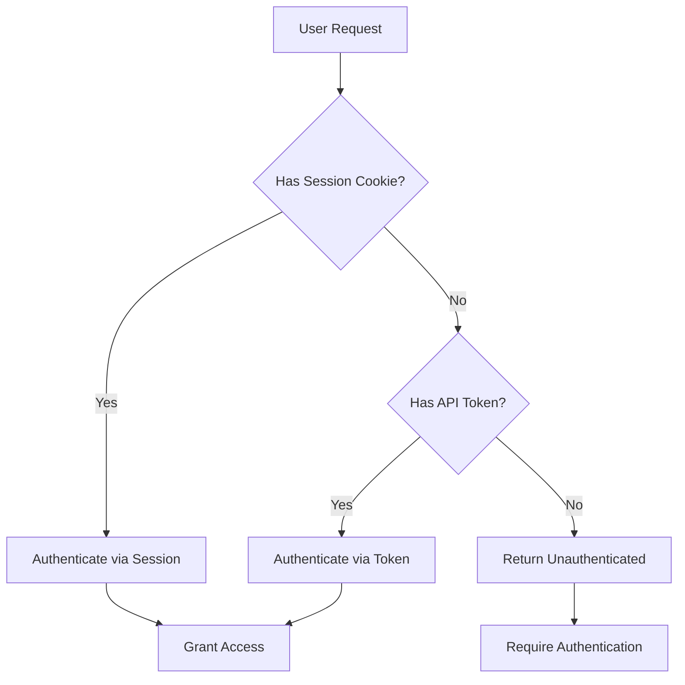
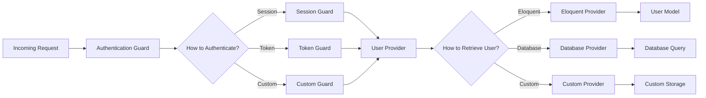
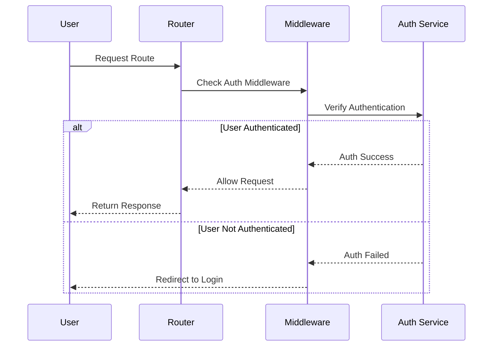

# Laravel Authentication Guide

## Table of Contents
- [Introduction](#introduction)
- [Technical Definitions](#technical-definitions)
- [Authentication Ecosystem](#authentication-ecosystem)
- [Visualization](#visualization)
- [Quickstart](#quickstart)
- [Manual Authentication](#manual-authentication)
- [Protecting Routes](#protecting-routes)
- [HTTP Basic Authentication](#http-basic-authentication)
- [Logging Out](#logging-out)
- [Password Confirmation](#password-confirmation)
- [Custom Guards](#custom-guards)
- [Custom User Providers](#custom-user-providers)
- [Automatic Password Rehashing](#automatic-password-rehashing)
- [Social Authentication](#social-authentication)
- [Events](#events)
- [Best Practices](#best-practices)
- [Conclusion](#conclusion)

## Introduction

Many web applications provide a way for their users to authenticate with the application and "login". Implementing this feature in web applications can be a complex and potentially risky endeavor. For this reason, Laravel strives to give you the tools you need to implement authentication quickly, securely, and easily.

At its core, Laravel's authentication facilities are made up of "guards" and "providers". Guards define how users are authenticated for each request. For example, Laravel ships with a session guard which maintains state using session storage and cookies.

Providers define how users are retrieved from your persistent storage. Laravel ships with support for retrieving users using Eloquent and the database query builder. However, you are free to define additional providers as needed for your application.

Your application's authentication configuration file is located at `config/auth.php`. This file contains several well-documented options for tweaking the behavior of Laravel's authentication services.

Guards and providers should not be confused with "roles" and "permissions". To learn more about authorizing user actions via permissions, please refer to the authorization documentation.

## Technical Definitions

### Authentication Guard
An authentication guard defines how users are authenticated for each request. Laravel ships with several built-in guards:

- **Session Guard**: Maintains state using session storage and cookies (for web browser authentication)
- **Token Guard**: Uses API tokens for authentication (for API authentication)
- **Custom Guards**: User-defined authentication mechanisms

### User Provider
A user provider defines how users are retrieved from your persistent storage. Laravel supports:

- **Eloquent Provider**: Uses Eloquent models to retrieve users
- **Database Provider**: Uses the query builder to retrieve users
- **Custom Providers**: User-defined user retrieval mechanisms

### Authenticatable Contract
The `Illuminate\Contracts\Auth\Authenticatable` interface defines methods that a user model must implement to be used with Laravel's authentication system:

```php
interface Authenticatable
{
    public function getAuthIdentifierName();
    public function getAuthIdentifier();
    public function getAuthPasswordName();
    public function getAuthPassword();
    public function getRememberToken();
    public function setRememberToken($value);
    public function getRememberTokenName();
}
```

### User Provider Contract
The `Illuminate\Contracts\Auth\UserProvider` interface defines methods for retrieving and validating users:

```php
interface UserProvider
{
    public function retrieveById($identifier);
    public function retrieveByToken($identifier, $token);
    public function updateRememberToken(Authenticatable $user, $token);
    public function retrieveByCredentials(array $credentials);
    public function validateCredentials(Authenticatable $user, array $credentials);
    public function rehashPasswordIfRequired(Authenticatable $user, array $credentials, bool $force = false);
}
```

### Authentication Middleware
Laravel includes built-in middleware for protecting routes:

- **auth**: Requires authentication to access the route
- **guest**: Allows only unauthenticated users to access the route
- **password.confirm**: Requires recent password confirmation for sensitive actions
- **auth.session**: Validates session authentication

## Authentication Ecosystem

Laravel offers several packages related to authentication:

### Laravel's Built-in Browser Authentication Services
Laravel includes built-in authentication and session services which are typically accessed via the `Auth` and `Session` facades. These features provide cookie-based authentication for requests that are initiated from web browsers.

### Laravel's API Authentication Services
Laravel provides two optional packages to assist you in managing API tokens and authenticating requests made with API tokens: Passport and Sanctum.

#### Passport
Passport is an OAuth2 authentication provider, offering a variety of OAuth2 "grant types" which allow you to issue various types of tokens. This is a robust and complex package for API authentication.

#### Sanctum
Laravel Sanctum is a hybrid web / API authentication package that can manage your application's entire authentication process. It handles both first-party web requests from a web browser and API requests via tokens.

### Starter Kits
Laravel application starter kits provide robust, modern scaffolding of the entire authentication layer, including controllers, routes, and views.

## Visualization

### Authentication Flow Diagram


### Authentication Architecture


### Route Protection Flow

## Quickstart

### Install a Starter Kit
First, you should install a Laravel application starter kit. Our starter kits offer beautifully designed starting points for incorporating authentication into your fresh Laravel application.

### Retrieving the Authenticated User
After creating an application from a starter kit and allowing users to register and authenticate with your application, you will often need to interact with the currently authenticated user. While handling an incoming request, you may access the authenticated user via the Auth facade's user method:

```php
use Illuminate\Support\Facades\Auth;

// Retrieve the currently authenticated user...
$user = Auth::user();

// Retrieve the currently authenticated user's ID...
$id = Auth::id();
```

Alternatively, once a user is authenticated, you may access the authenticated user via an Illuminate\Http\Request instance. Remember, type-hinted classes will automatically be injected into your controller methods. By type-hinting the Illuminate\Http\Request object, you may gain convenient access to the authenticated user from any controller method in your application via the request's user method:

```php
<?php

namespace App\Http\Controllers;

use Illuminate\Http\RedirectResponse;
use Illuminate\Http\Request;

class FlightController extends Controller
{
    /**
     * Update the flight information for an existing flight.
     */
    public function update(Request $request): RedirectResponse
    {
        $user = $request->user();

        // ...

        return redirect('/flights');
    }
}
```

### Determining if the Current User is Authenticated
To determine if the user making the incoming HTTP request is authenticated, you may use the check method on the Auth facade. This method will return true if the user is authenticated:

```php
use Illuminate\Support\Facades\Auth;

if (Auth::check()) {
    // The user is logged in...
}
```

Even though it is possible to determine if a user is authenticated using the check method, you will typically use a middleware to verify that the user is authenticated before allowing the user access to certain routes / controllers. To learn more about this, check out the documentation on protecting routes.

## Manual Authentication

You are not required to use the authentication scaffolding included with Laravel's application starter kits. If you choose not to use this scaffolding, you will need to manage user authentication using the Laravel authentication classes directly. Don't worry, it's a cinch!

We will access Laravel's authentication services via the Auth facade, so we'll need to make sure to import the Auth facade at the top of the class. Next, let's check out the attempt method. The attempt method is normally used to handle authentication attempts from your application's "login" form. If authentication is successful, you should regenerate the user's session to prevent session fixation:

```php
<?php

namespace App\Http\Controllers;

use Illuminate\Http\Request;
use Illuminate\Http\RedirectResponse;
use Illuminate\Support\Facades\Auth;

class LoginController extends Controller
{
    /**
     * Handle an authentication attempt.
     */
    public function authenticate(Request $request): RedirectResponse
    {
        $credentials = $request->validate([
            'email' => ['required', 'email'],
            'password' => ['required'],
        ]);

        if (Auth::attempt($credentials)) {
            $request->session()->regenerate();

            return redirect()->intended('dashboard');
        }

        return back()->withErrors([
            'email' => 'The provided credentials do not match our records.',
        ])->onlyInput('email');
    }
}
```

The attempt method accepts an array of key / value pairs as its first argument. The values in the array will be used to find the user in your database table. So, in the example above, the user will be retrieved by the value of the email column. If the user is found, the hashed password stored in the database will be compared with the password value passed to the method via the array. You should not hash the incoming request's password value, since the framework will automatically hash the value before comparing it to the hashed password in the database. An authenticated session will be started for the user if the two hashed passwords match.

Remember, Laravel's authentication services will retrieve users from your database based on your authentication guard's "provider" configuration. In the default config/auth.php configuration file, the Eloquent user provider is specified and it is instructed to use the App\Models\User model when retrieving users. You may change these values within your configuration file based on the needs of your application.

The attempt method will return true if authentication was successful. Otherwise, false will be returned.

The intended method provided by Laravel's redirector will redirect the user to the URL they were attempting to access before being intercepted by the authentication middleware. A fallback URI may be given to this method in case the intended destination is not available.

### Specifying Additional Conditions
If you wish, you may also add extra query conditions to the authentication query in addition to the user's email and password. To accomplish this, we may simply add the query conditions to the array passed to the attempt method. For example, we may verify that the user is marked as "active":

```php
if (Auth::attempt(['email' => $email, 'password' => $password, 'active' => 1])) {
    // Authentication was successful...
}
```

For complex query conditions, you may provide a closure in your array of credentials. This closure will be invoked with the query instance, allowing you to customize the query based on your application's needs:

```php
use Illuminate\Database\Eloquent\Builder;

if (Auth::attempt([
    'email' => $email,
    'password' => $password,
    fn (Builder $query) => $query->has('activeSubscription'),
])) {
    // Authentication was successful...
}
```

In these examples, email is not a required option, it is merely used as an example. You should use whatever column name corresponds to a "username" in your database table.

The attemptWhen method, which receives a closure as its second argument, may be used to perform more extensive inspection of the potential user before actually authenticating the user. The closure receives the potential user and should return true or false to indicate if the user may be authenticated:

```php
if (Auth::attemptWhen([
    'email' => $email,
    'password' => $password,
], function (User $user) {
    return $user->isNotBanned();
})) {
    // Authentication was successful...
}
```

### Accessing Specific Guard Instances
Via the Auth facade's guard method, you may specify which guard instance you would like to utilize when authenticating the user. This allows you to manage authentication for separate parts of your application using entirely separate authenticatable models or user tables.

The guard name passed to the guard method should correspond to one of the guards configured in your auth.php configuration file:

```php
if (Auth::guard('admin')->attempt($credentials)) {
    // ...
}
```

## Protecting Routes

Route middleware can be used to only allow authenticated users to access a given route. Laravel ships with an auth middleware, which is a middleware alias for the Illuminate\Auth\Middleware\Authenticate class. Since this middleware is already aliased internally by Laravel, all you need to do is attach the middleware to a route definition:

```php
Route::get('/flights', function () {
    // Only authenticated users may access this route...
})->middleware('auth');
```

### Redirecting Unauthenticated Users
When the auth middleware detects an unauthenticated user, it will redirect the user to the login named route. You may modify this behavior using the redirectGuestsTo method within your application's bootstrap/app.php file:

```php
use Illuminate\Http\Request;

->withMiddleware(function (Middleware $middleware): void {
    $middleware->redirectGuestsTo('/login');

    // Using a closure...
    $middleware->redirectGuestsTo(fn (Request $request) => route('login'));
})
```

### Redirecting Authenticated Users
When the guest middleware detects an authenticated user, it will redirect the user to the dashboard or home named route. You may modify this behavior using the redirectUsersTo method within your application's bootstrap/app.php file:

```php
use Illuminate\Http\Request;

->withMiddleware(function (Middleware $middleware): void {
    $middleware->redirectUsersTo('/panel');

    // Using a closure...
    $middleware->redirectUsersTo(fn (Request $request) => route('panel'));
})
```

### Specifying a Guard
When attaching the auth middleware to a route, you may also specify which "guard" should be used to authenticate the user. The guard specified should correspond to one of the keys in the guards array of your auth.php configuration file:

```php
Route::get('/flights', function () {
    // Only authenticated users may access this route...
})->middleware('auth:admin');
```

## HTTP Basic Authentication

HTTP Basic Authentication provides a quick way to authenticate users of your application without setting up a dedicated "login" page. To get started, attach the auth.basic middleware to a route. The auth.basic middleware is included with the Laravel framework, so you do not need to define it:

```php
Route::get('/profile', function () {
    // Only authenticated users may access this route...
})->middleware('auth.basic');
```

Once the middleware has been attached to the route, you will automatically be prompted for credentials when accessing the route in your browser. By default, the auth.basic middleware will assume the email column on your users database table is the user's "username".

### A Note on FastCGI
If you are using PHP FastCGI and Apache to serve your Laravel application, HTTP Basic authentication may not work correctly. To correct these problems, the following lines may be added to your application's .htaccess file:

```
RewriteCond %{HTTP:Authorization} ^(.+)$
RewriteRule .* - [E=HTTP_AUTHORIZATION:%{HTTP:Authorization}]
```

### Stateless HTTP Basic Authentication
You may also use HTTP Basic Authentication without setting a user identifier cookie in the session. This is primarily helpful if you choose to use HTTP Authentication to authenticate requests to your application's API. To accomplish this, define a middleware that calls the onceBasic method. If no response is returned by the onceBasic method, the request may be passed further into the application:

```php
<?php

namespace App\Http\Middleware;

use Closure;
use Illuminate\Http\Request;
use Illuminate\Support\Facades\Auth;
use Symfony\Component\HttpFoundation\Response;

class AuthenticateOnceWithBasicAuth
{
    /**
     * Handle an incoming request.
     *
     * @param  \Closure(\Illuminate\Http\Request): (\Symfony\Component\HttpFoundation\Response)  $next
     */
    public function handle(Request $request, Closure $next): Response
    {
        return Auth::onceBasic() ?: $next($request);
    }

}
```

Next, attach the middleware to a route:

```php
Route::get('/api/user', function () {
    // Only authenticated users may access this route...
})->middleware(AuthenticateOnceWithBasicAuth::class);
```

## Logging Out

To manually log users out of your application, you may use the logout method provided by the Auth facade. This will remove the authentication information from the user's session so that subsequent requests are not authenticated.

In addition to calling the logout method, it is recommended that you invalidate the user's session and regenerate their CSRF token. After logging the user out, you would typically redirect the user to the root of your application:

```php
use Illuminate\Http\Request;
use Illuminate\Http\RedirectResponse;
use Illuminate\Support\Facades\Auth;

/**
 * Log the user out of the application.
 */
public function logout(Request $request): RedirectResponse
{
    Auth::logout();

    $request->session()->invalidate();

    $request->session()->regenerateToken();

    return redirect('/');
}
```

### Invalidating Sessions on Other Devices
Laravel also provides a mechanism for invalidating and "logging out" a user's sessions that are active on other devices without invalidating the session on their current device. This feature is typically utilized when a user is changing or updating their password and you would like to invalidate sessions on other devices while keeping the current device authenticated.

Before getting started, you should make sure that the Illuminate\Session\Middleware\AuthenticateSession middleware is included on the routes that should receive session authentication. Typically, you should place this middleware on a route group definition so that it can be applied to the majority of your application's routes. By default, the AuthenticateSession middleware may be attached to a route using the auth.session middleware alias:

```php
Route::middleware(['auth', 'auth.session'])->group(function () {
    Route::get('/', function () {
        // ...
    });
});
```

Then, you may use the logoutOtherDevices method provided by the Auth facade. This method requires the user to confirm their current password, which your application should accept through an input form:

```php
use Illuminate\Support\Facades\Auth;

Auth::logoutOtherDevices($currentPassword);
```

When the logoutOtherDevices method is invoked, the user's other sessions will be invalidated entirely, meaning they will be "logged out" of all guards they were previously authenticated by.

## Password Confirmation

While building your application, you may occasionally have actions that should require the user to confirm their password before the action is performed or before the user is redirected to a sensitive area of the application. Laravel includes built-in middleware to make this process a breeze. Implementing this feature will require you to define two routes: one route to display a view asking the user to confirm their password and another route to confirm that the password is valid and redirect the user to their intended destination.

The following documentation discusses how to integrate with Laravel's password confirmation features directly; however, if you would like to get started more quickly, the Laravel application starter kits include support for this feature!

### Configuration
After confirming their password, a user will not be asked to confirm their password again for three hours. However, you may configure the length of time before the user is re-prompted for their password by changing the value of the password_timeout configuration value within your application's config/auth.php configuration file.

### Routing
The Password Confirmation Form
First, we will define a route to display a view that requests the user to confirm their password:

```php
Route::get('/confirm-password', function () {
    return view('auth.confirm-password');
})->middleware('auth')->name('password.confirm');
```

As you might expect, the view that is returned by this route should have a form containing a password field. In addition, feel free to include text within the view that explains that the user is entering a protected area of the application and must confirm their password.

### Confirming the Password
Next, we will define a route that will handle the form request from the "confirm password" view. This route will be responsible for validating the password and redirecting the user to their intended destination:

```php
use Illuminate\Http\Request;
use Illuminate\Support\Facades\Hash;

Route::post('/confirm-password', function (Request $request) {
    if (! Hash::check($request->password, $request->user()->password)) {
        return back()->withErrors([
            'password' => ['The provided password does not match our records.']
        ]);
    }

    $request->session()->passwordConfirmed();

    return redirect()->intended();
})->middleware(['auth', 'throttle:6,1']);
```

Before moving on, let's examine this route in more detail. First, the request's password field is determined to actually match the authenticated user's password. If the password is valid, we need to inform Laravel's session that the user has confirmed their password. The passwordConfirmed method will set a timestamp in the user's session that Laravel can use to determine when the user last confirmed their password. Finally, we can redirect the user to their intended destination.

### Protecting Routes
You should ensure that any route that performs an action which requires recent password confirmation is assigned the password.confirm middleware. This middleware is included with the default installation of Laravel and will automatically store the user's intended destination in the session so that the user may be redirected to that location after confirming their password. After storing the user's intended destination in the session, the middleware will redirect the user to the password.confirm named route:

```php
Route::get('/settings', function () {
    // ...
})->middleware(['password.confirm']);

Route::post('/settings', function () {
    // ...
})->middleware(['password.confirm']);
```

## Custom Guards

You may define your own authentication guards using the extend method on the Auth facade. You should place your call to the extend method within a service provider. Since Laravel already ships with an AppServiceProvider, we can place the code in that provider:

```php
<?php

namespace App\Providers;

use App\Services\Auth\JwtGuard;
use Illuminate\Contracts\Foundation\Application;
use Illuminate\Support\Facades\Auth;
use Illuminate\Support\ServiceProvider;

class AppServiceProvider extends ServiceProvider
{
    // ...

    /**
     * Bootstrap any application services.
     */
    public function boot(): void
    {
        Auth::extend('jwt', function (Application $app, string $name, array $config) {
            // Return an instance of Illuminate\Contracts\Auth\Guard...

            return new JwtGuard(Auth::createUserProvider($config['provider']));
        });
    }
}
```

As you can see in the example above, the callback passed to the extend method should return an implementation of Illuminate\Contracts\Auth\Guard. This interface contains a few methods you will need to implement to define a custom guard. Once your custom guard has been defined, you may reference the guard in the guards configuration of your auth.php configuration file:

```php
'guards' => [
    'api' => [
        'driver' => 'jwt',
        'provider' => 'users',
    ],
],
```

### Closure Request Guards
The simplest way to implement a custom, HTTP request based authentication system is by using the Auth::viaRequest method. This method allows you to quickly define your authentication process using a single closure.

To get started, call the Auth::viaRequest method within the boot method of your application's AppServiceProvider. The viaRequest method accepts an authentication driver name as its first argument. This name can be any string that describes your custom guard. The second argument passed to the method should be a closure that receives the incoming HTTP request and returns a user instance or, if authentication fails, null:

```php
use App\Models\User;
use Illuminate\Http\Request;
use Illuminate\Support\Facades\Auth;

/**
 * Bootstrap any application services.
 */
public function boot(): void
{
    Auth::viaRequest('custom-token', function (Request $request) {
        return User::where('token', (string) $request->token)->first();
    });
}
```

Once your custom authentication driver has been defined, you may configure it as a driver within the guards configuration of your auth.php configuration file:

```php
'guards' => [
    'api' => [
        'driver' => 'custom-token',
    ],
],
```

Finally, you may reference the guard when assigning the authentication middleware to a route:

```php
Route::middleware('auth:api')->group(function () {
    // ...
});
```

## Custom User Providers

If you are not using a traditional relational database to store your users, you will need to extend Laravel with your own authentication user provider. We will use the provider method on the Auth facade to define a custom user provider. The user provider resolver should return an implementation of Illuminate\Contracts\Auth\UserProvider:

```php
<?php

namespace App\Providers;

use App\Extensions\MongoUserProvider;
use Illuminate\Contracts\Foundation\Application;
use Illuminate\Support\Facades\Auth;
use Illuminate\Support\ServiceProvider;

class AppServiceProvider extends ServiceProvider
{
    // ...

    /**
     * Bootstrap any application services.
     */
    public function boot(): void
    {
        Auth::provider('mongo', function (Application $app, array $config) {
            // Return an instance of Illuminate\Contracts\Auth\UserProvider...

            return new MongoUserProvider($app->make('mongo.connection'));
        });
    }
}
```

After you have registered the provider using the provider method, you may switch to the new user provider in your auth.php configuration file. First, define a provider that uses your new driver:

```php
'providers' => [
    'users' => [
        'driver' => 'mongo',
    ],
],
```

Finally, you may reference this provider in your guards configuration:

```php
'guards' => [
    'web' => [
        'driver' => 'session',
        'provider' => 'users',
    ],
],
```

## Automatic Password Rehashing

Laravel's default password hashing algorithm is bcrypt. The "work factor" for bcrypt hashes can be adjusted via your application's config/hashing.php configuration file or the BCRYPT_ROUNDS environment variable.

Typically, the bcrypt work factor should be increased over time as CPU / GPU processing power increases. If you increase the bcrypt work factor for your application, Laravel will gracefully and automatically rehash user passwords as users authenticate with your application via Laravel's starter kits or when you manually authenticate users via the attempt method.

Typically, automatic password rehashing should not disrupt your application; however, you may disable this behavior by publishing the hashing configuration file:

```bash
php artisan config:publish hashing
```

Once the configuration file has been published, you may set the rehash_on_login configuration value to false:

```php
'rehash_on_login' => false,
```

## Social Authentication

Laravel provides mechanisms for authenticating users via social platforms like Facebook, Google, Twitter, and others. This is typically handled through the Laravel Socialite package, which provides a simple and secure way to authenticate users with OAuth providers.

## Events

Laravel dispatches a variety of events during the authentication process. You may define listeners for any of the following events:

- `Illuminate\Auth\Events\Registered`
- `Illuminate\Auth\Events\Attempting`
- `Illuminate\Auth\Events\Authenticated`
- `Illuminate\Auth\Events\Login`
- `Illuminate\Auth\Events\Failed`
- `Illuminate\Auth\Events\Validated`
- `Illuminate\Auth\Events\Verified`
- `Illuminate\Auth\Events\Logout`
- `Illuminate\Auth\Events\CurrentDeviceLogout`
- `Illuminate\Auth\Events\OtherDeviceLogout`
- `Illuminate\Auth\Events\Lockout`
- `Illuminate\Auth\Events\PasswordReset`
- `Illuminate\Auth\Events\PasswordResetLinkSent`

## Best Practices

### Security Considerations
- Always use HTTPS in production environments
- Implement proper rate limiting to prevent brute force attacks
- Use strong password policies
- Regularly update dependencies to patch security vulnerabilities
- Store passwords using Laravel's Hash facade (bcrypt by default)

### Performance Tips
- Use caching for frequently accessed user data
- Optimize database queries for user retrieval
- Implement proper indexing on authentication-related columns (email, etc.)
- Use eager loading when accessing related user data

### Common Mistakes to Avoid
- Not regenerating session IDs after login (session fixation)
- Storing plain-text passwords
- Not properly validating user input
- Exposing sensitive authentication data in logs
- Not properly handling authentication failures

## Configuration and Setup Instructions

### Default Authentication Configuration

Laravel's authentication configuration is located in `config/auth.php`. This file contains several well-documented options for customizing the behavior of Laravel's authentication services:

```php
<?php

return [
    /*
    |--------------------------------------------------------------------------
    | Authentication Defaults
    |--------------------------------------------------------------------------
    |
    | This option controls the default authentication "guard" and password
    | reset options for your application. You may change these defaults
    | as required, but they're a perfect start for most applications.
    |
    */

    'defaults' => [
        'guard' => 'web',
        'passwords' => 'users',
    ],

    /*
    |--------------------------------------------------------------------------
    | Authentication Guards
    |--------------------------------------------------------------------------
    |
    | Next, you may define every authentication guard for your application.
    | Of course, a great default configuration has been defined for you
    | here which uses session storage and the Eloquent user provider.
    |
    | All authentication drivers have a user provider. This defines how the
    | users are actually retrieved out of your database or other storage
    | mechanisms used by this application to persist your user's data.
    |
    | Supported: "session", "token"
    |
    */

    'guards' => [
        'web' => [
            'driver' => 'session',
            'provider' => 'users',
        ],

        'api' => [
            'driver' => 'token',
            'provider' => 'users',
            'hash' => false,
        ],
    ],

    /*
    |--------------------------------------------------------------------------
    | User Providers
    |--------------------------------------------------------------------------
    |
    | All authentication drivers have a user provider. This defines how the
    | users are actually retrieved out of your database or other storage
    | mechanisms used by this application to persist your user's data.
    |
    | If you have multiple user tables or models you may configure multiple
    | sources which represent each model / table. These sources may then
    | be assigned to any extra authentication guards you have defined.
    |
    | Supported: "database", "eloquent"
    |
    */

    'providers' => [
        'users' => [
            'driver' => 'eloquent',
            'model' => App\Models\User::class,
        ],

        // 'users' => [
        //     'driver' => 'database',
        //     'table' => 'users',
        // ],
    ],

    /*
    |--------------------------------------------------------------------------
    | Resetting Passwords
    |--------------------------------------------------------------------------
    |
    | You may specify multiple password reset configurations if you have more
    | than one user table or model in the application and you want to have
    | separate password reset settings based on the specific user types.
    |
    | The expire time is the number of minutes that each reset token will be
    | considered valid. This security feature keeps tokens short-lived so
    | they have less time to be guessed. You may change this as needed.
    |
    */

    'passwords' => [
        'users' => [
            'provider' => 'users',
            'table' => 'password_reset_tokens',
            'expire' => 60,
            'throttle' => 60,
        ],
    ],

    /*
    |--------------------------------------------------------------------------
    | Password Confirmation Timeout
    |--------------------------------------------------------------------------
    |
    | Here you may define the amount of seconds before a password confirmation
    | times out and the user is prompted to re-enter their password via the
    | password.confirm middleware. By default, the timeout is three hours.
    |
    */

    'password_timeout' => 10800, // 3 hours in seconds
];
```

### Setting Up Authentication with Starter Kits

To quickly implement authentication in a new Laravel application, you can use one of the official starter kits:

1. **Install Laravel Breeze** (minimal implementation):
   ```bash
   composer require laravel/breeze --dev
   php artisan breeze:install
   php artisan migrate
   ```

2. **Install Laravel Jetstream** (more advanced features):
   ```bash
   composer require laravel/jetstream
   php artisan jetstream:install livewire
   php artisan migrate
   ```

### Database Requirements

When building the database schema for the `App\Models\User` model, make sure the password column is at least 60 characters in length. The default users table migration included in new Laravel applications already creates a column that exceeds this length.

Also, verify that your users (or equivalent) table contains a nullable, string `remember_token` column of 100 characters. This column will be used to store a token for users that select the "remember me" option when logging into your application.

The default users table migration includes both requirements:

```php
Schema::create('users', function (Blueprint $table) {
    $table->id();
    $table->string('name');
    $table->string('email')->unique();
    $table->timestamp('email_verified_at')->nullable();
    $table->string('password');  // At least 60 characters for bcrypt
    $table->rememberToken();     // Nullable, 100 characters for remember token
    $table->timestamps();
});
```

### Login Throttling

Rate limiting is automatically applied to login attempts when using Laravel's starter kits. By default, a user will not be able to login for one minute if they fail to provide the correct credentials after several attempts. The throttling is unique to the user's username/email address and their IP address.

To customize the throttling behavior, you can modify the `throttle` middleware in your login route or controller:

```php
// In your LoginController
use Illuminate\Routing\Controller;
use Illuminate\Foundation\Auth\Access\AuthorizesRequests;
use Illuminate\Foundation\Validation\ValidatesRequests;
use Illuminate\Http\Request;
use Illuminate\Support\Facades\Auth;
use Illuminate\Support\Facades\RateLimiter;
use Illuminate\Support\Str;

class LoginController extends Controller
{
    protected function throttleKey(Request $request)
    {
        return Str::lower($request->input('email')).'|'.$request->ip();
    }
    
    protected function ensureIsNotRateLimited()
    {
        if (! RateLimiter::tooManyAttempts($this->throttleKey(request()), 5)) {
            return;
        }

        event(new Lockout(request()));

        $seconds = RateLimiter::availableIn($this->throttleKey(request()));

        throw ValidationException::withMessages([
            'email' => trans('auth.throttle', [
                'seconds' => $seconds,
                'minutes' => ceil($seconds / 60),
            ]),
        ]);
    }
}
```

## Conclusion

Laravel's authentication system provides a robust and secure foundation for managing user authentication in web applications. With built-in support for sessions, tokens, and various authentication providers, Laravel makes it easy to implement secure authentication while focusing on your application's core functionality.

Whether you're building a simple web application or a complex API, Laravel's authentication services offer the flexibility and security needed to protect your users' accounts and data.
