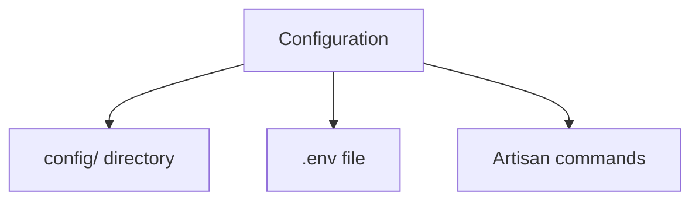
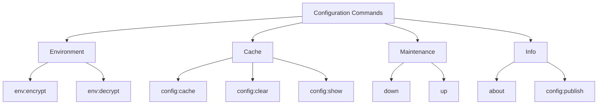

# Laravel Configuration

## Introduction

All of the configuration files for the Laravel framework are stored in the `config` directory. Each option is documented, so feel free to look through the files and get familiar with the options available to you.

These configuration files allow you to configure things like your database connection information, your mail server information, as well as various other core configuration values such as your application URL and encryption key.



## 🔧 Important Configuration Commands

### The `about` Command

Laravel can display an overview of your application's configuration, drivers, and environment via the `about` Artisan command.

```bash
php artisan about
```

If you're only interested in a particular section of the application overview output, you may filter for that section using the `--only` option:

```bash
php artisan about --only=environment
```

Or, to explore a specific configuration file's values in detail, you may use the `config:show` Artisan command:

```bash
php artisan config:show database
```

## 🌍 Environment Configuration

It is often helpful to have different configuration values based on the environment where the application is running. Laravel utilizes the DotEnv PHP library for environment management.

### Environment Files

```
📄 .env.example      # Template file (should be in source control)
📄 .env             # Actual environment file (should NOT be in source control)
📄 .env.staging     # Optional staging environment file
📄 .env.production  # Optional production environment file
```

### 🔐 Environment File Security

⚠️ **IMPORTANT**: Your `.env` file should **NOT** be committed to source control!

However, you can encrypt your environment file using Laravel's built-in encryption:

```bash
# Encrypt environment file
php artisan env:encrypt
```

```bash
# Encrypt with custom key
php artisan env:encrypt --key=3UVsEgGVK36XN82KKeyLFMhvosbZN1aF
```

```bash
# Encrypt specific environment
php artisan env:encrypt --env=staging
```

```bash
# Encrypt with readable variable names
php artisan env:encrypt --readable
```

### 🔓 Decrypting Environment Files

```bash
# Decrypt environment file
php artisan env:decrypt
```

```bash
# Decrypt with custom key
php artisan env:decrypt --key=3UVsEgGVK36XN82KKeyLFMhvosbZN1aF
```

```bash
# Decrypt specific environment
php artisan env:decrypt --env=staging
```

```bash
# Force overwrite existing .env file
php artisan env:decrypt --force
```

### Environment Variable Types

```mermaid
graph LR
    A[.env Value] -->|true| B[(bool) true]
    A -->|false| C[(bool) false]
    A -->|empty| D[(string) '']
    A -->|null| E[(null) null]
    A -->|"quoted"| F[(string) "quoted"]
```

### Retrieving Environment Configuration

```php
// Using env() function with default value
'debug' => (bool) env('APP_DEBUG', false),
```

### Determining Current Environment

```php
use Illuminate\Support\Facades\App;

$environment = App::environment();

if (App::environment('local')) {
    // The environment is local
}

if (App::environment(['local', 'staging'])) {
    // The environment is either local OR staging
}
```

## 📋 Accessing Configuration Values

### Basic Configuration Access

```php
use Illuminate\Support\Facades\Config;

// Get configuration value
$value = Config::get('app.timezone');

// Using global helper
$value = config('app.timezone');

// With default value
$value = config('app.timezone', 'Asia/Seoul');
```

### Setting Configuration at Runtime

```php
// Set single configuration value
Config::set('app.timezone', 'America/Chicago');

// Set multiple values
config(['app.timezone' => 'America/Chicago']);
```

### Typed Configuration Access

```php
// String value
Config::string('config-key');

// Integer value
Config::integer('config-key');

// Float value
Config::float('config-key');

// Boolean value
Config::boolean('config-key');

// Array value
Config::array('config-key');

// Collection value
Config::collection('config-key');
```

## ⚡ Configuration Caching

### Cache Configuration for Performance

```bash
# Cache all configuration files
php artisan config:cache
```

```bash
# Clear cached configuration
php artisan config:clear
```

⚠️ **Note**: After caching, `.env` file won't be loaded. Only use `env()` in config files!

## 📂 Configuration Publishing

```bash
# Publish specific configuration files
php artisan config:publish
```

```bash
# Publish all configuration files
php artisan config:publish --all
```

## 🐛 Debug Mode

```bash
# Enable debug mode (for development only!)
APP_DEBUG=true
```

```bash
# Disable debug mode (for production)
APP_DEBUG=false
```

## 🚧 Maintenance Mode

### Enable Maintenance Mode

```bash
php artisan down
```

```bash
# With auto-refresh after 15 seconds
php artisan down --refresh=15
```

```bash
# With retry-after header
php artisan down --retry=60
```

### Bypass Maintenance Mode

```bash
# Enable with secret token
php artisan down --secret="1630542a-246b-4b66-afa1-dd72a4c43515"
```

```bash
# Generate secret token automatically
php artisan down --with-secret
```

### Disable Maintenance Mode

```bash
php artisan up
```

## 🎯 Command Summary



## Next Topic

[Service Providers](5-service-providers.md)