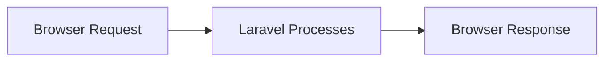
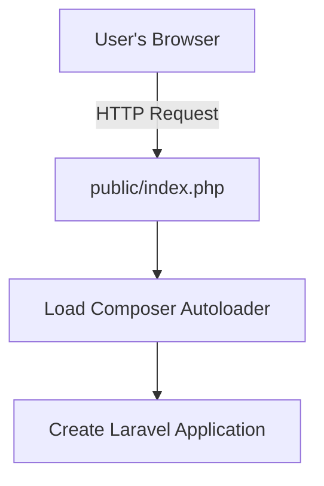
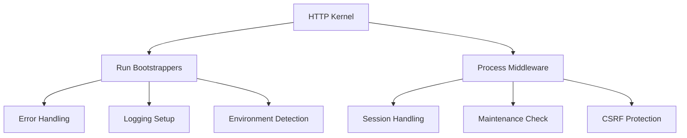
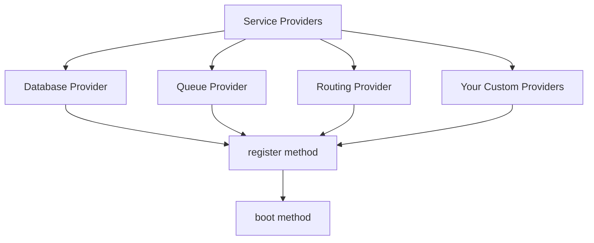
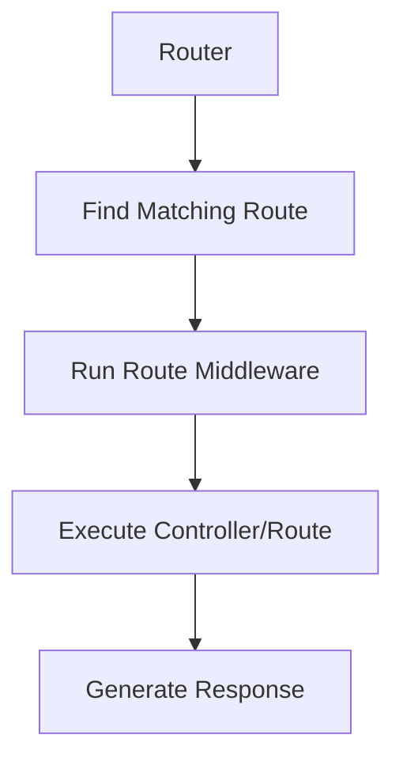
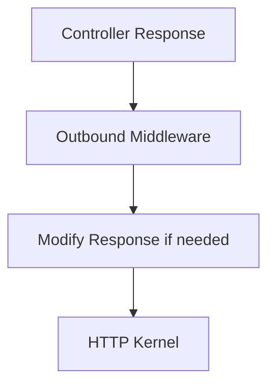
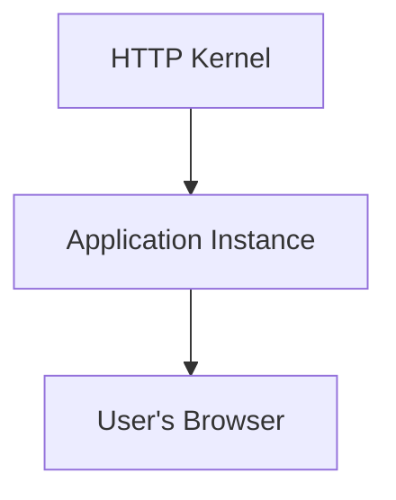
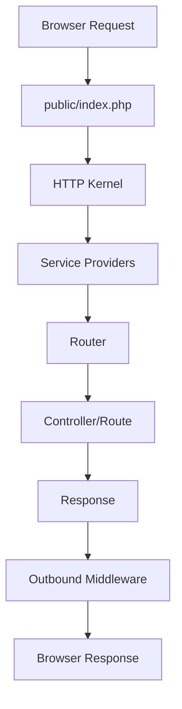
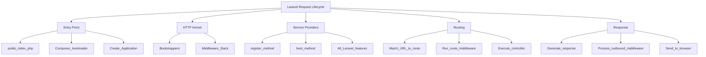

# Request Lifecycle

## Simple Overview

Understanding Laravel's request lifecycle helps you become a more confident developer. This document explains how Laravel processes incoming requests from start to finish in a simple, visual way.

## The Request Journey (6 Simple Steps)

### 1. Entry Point

**All requests start at `public/index.php`** - this is your application's single entry point.

**What happens:**
1. Web server (Apache/Nginx) directs all requests to `public/index.php`
2. Composer autoloader loads all framework classes
3. Laravel application instance is created

### 2. HTTP Kernel

**The HTTP Kernel orchestrates everything** - it's like the traffic controller.

**What happens:**
1. Bootstrappers configure the environment
2. Middleware stack processes the request
3. Each middleware can modify or reject the request

### 3. Service Providers (Most Important!)

**Service Providers bootstrap Laravel's features** - they're the heart of Laravel.

**What happens:**
1. Laravel loads all service providers
2. Calls `register()` on each provider
3. Calls `boot()` on each provider
4. All Laravel features become available

### 4. Routing

**The Router matches requests to code** - like a traffic director.

**What happens:**
1. Router finds the matching route
2. Route-specific middleware runs
3. Controller method or route closure executes
4. Response is generated

### 5. Response Processing

**Middleware processes the response** - final checks before sending.

**What happens:**
1. Response travels back through middleware
2. Middleware can modify the response
3. Final response is prepared

### 6. Send to Browser

**Final step - send response to user**

**What happens:**
1. HTTP Kernel returns response object to Application Instance
2. Application Instance calls `send()` method
3. Response is sent to User's Browser

## Simple Summary

## Key Points to Remember

1. **Single Entry Point**: All requests go through `public/index.php`
2. **HTTP Kernel**: Manages bootstrapping and middleware
3. **Service Providers**: Most important - they bootstrap all Laravel features
4. **Routing**: Matches URLs to controller methods or routes
5. **Middleware**: Filters both incoming requests and outgoing responses
6. **Response Flow**: Response goes back through middleware before sending

## Visual Cheat Sheet

## Next Topic

[Service Container](6-service-container.md)