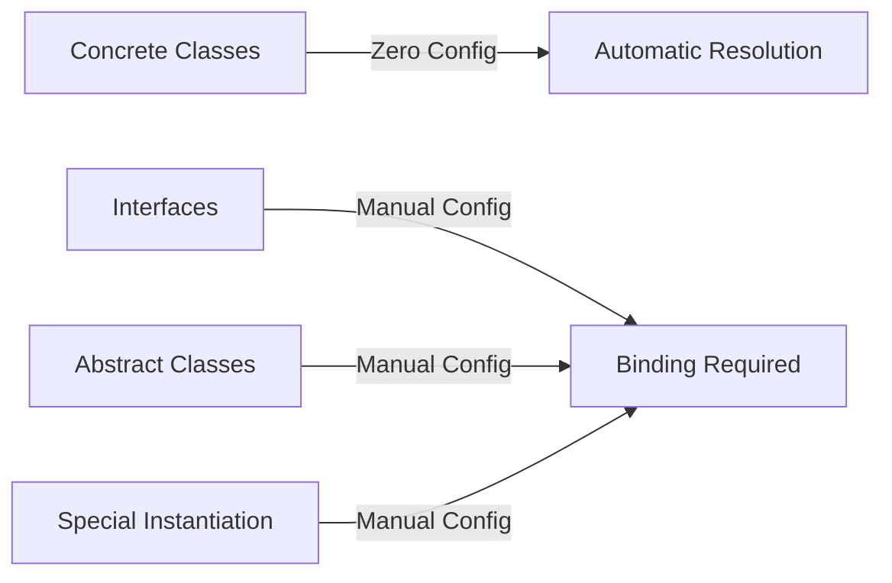

# Service Container

## Introduction

The Laravel service container is a powerful tool for managing class dependencies and performing dependency injection. Dependency injection is a fancy phrase that essentially means this: class dependencies are "injected" into the class via the constructor or, in some cases, "setter" methods.

### What is Type-Hinting?

**Type-hinting** is a simple way to tell Laravel what dependencies your class needs. Instead of manually creating objects, you just specify the class type in your constructor or method parameters, and Laravel automatically provides the right instance.

**Simple Example:**
```php
// Instead of manually creating the service:
$appleMusic = new AppleMusic();
$controller = new PodcastController($appleMusic);

// You just type-hint the dependency:
public function __construct(protected AppleMusic $apple)
{
    // Laravel automatically creates and injects AppleMusic
}
```

Let's look at a simple example:

```php
namespace App\Http\Controllers;

use App\Services\AppleMusic;
use Illuminate\View\View;

class PodcastController extends Controller
{
    /**
     * Create a new controller instance.
     */
    public function __construct(
        protected AppleMusic $apple,
    ) {}

    /**
     * Show information about the given podcast.
     */
    public function show(string $id): View
    {
        return view('podcasts.show', [
            'podcast' => $this->apple->findPodcast($id)
        ]);
    }
}
```

In this example, the `PodcastController` needs to retrieve podcasts from a data source such as Apple Music. So, we will inject a service that is able to retrieve podcasts. Since the service is injected, we are able to easily "mock", or create a dummy implementation of the `AppleMusic` service when testing our application.


A deep understanding of the Laravel service container is essential to building a powerful, large application, as well as for contributing to the Laravel core itself.

## Zero Configuration Resolution

If a class has no dependencies or only depends on other concrete classes (not interfaces), the container does not need to be instructed on how to resolve that class. For example, you may place the following code in your `routes/web.php` file:

```php
class Service
{
    // ...
}

Route::get('/', function (Service $service) {
    dd($service::class);
});
```

In this example, hitting your application's `/` route will automatically resolve the `Service` class and inject it into your route's handler. This is game changing. It means you can develop your application and take advantage of dependency injection without worrying about bloated configuration files.


Thankfully, many of the classes you will be writing when building a Laravel application automatically receive their dependencies via the container, including controllers, event listeners, middleware, and more. Additionally, you may type-hint dependencies in the `handle` method of queued jobs. Once you taste the power of automatic and zero configuration dependency injection it feels impossible to develop without it.

### How Zero Configuration Works

The Laravel service container uses PHP's reflection capabilities to automatically resolve class dependencies. Here's what happens:

1. **Reflection Analysis**: The container examines the class constructor using reflection
2. **Dependency Detection**: It identifies all type-hinted dependencies in the constructor
3. **Recursive Resolution**: For each dependency, the container repeats the process
4. **Instantiation**: Once all dependencies are resolved, the class is instantiated


### Benefits of Zero Configuration

- **Simplified Development**: No need to manually configure most dependencies
- **Cleaner Code**: Focus on business logic rather than dependency management
- **Easier Testing**: Dependencies can be easily mocked for testing
- **Better Maintainability**: Less configuration means less code to maintain
- **Faster Development**: Spend more time building features, less time configuring

### When Zero Configuration Isn't Enough

While zero configuration works great for concrete classes, you'll need manual configuration when:

- Working with interfaces that need to be bound to implementations
- Using abstract classes that need concrete implementations
- Needing to configure how a class should be instantiated
- Requiring singleton or scoped instances



## When to Utilize the Container

Thanks to zero configuration resolution, you will often type-hint dependencies on routes, controllers, event listeners, and elsewhere without ever manually interacting with the container. For example, you might type-hint the `Illuminate\Http\Request` object on your route definition so that you can easily access the current request. Even though we never have to interact with the container to write this code, it is managing the injection of these dependencies behind the scenes:

```php
use Illuminate\Http\Request;

Route::get('/', function (Request $request) {
    // ...
});
```


In many cases, thanks to automatic dependency injection and facades, you can build Laravel applications without ever manually binding or resolving anything from the container. So, when would you ever manually interact with the container? Let's examine two situations.

### Situation 1: Binding Interfaces to Implementations

First, if you write a class that implements an interface and you wish to type-hint that interface on a route or class constructor, you must tell the container how to resolve that interface.

**File: `app/Services/PaymentGateway.php`**
```php
<?php

namespace App\Services;

interface PaymentGateway {
    public function charge(int $amount);
}
```

**File: `app/Services/StripeGateway.php`**
```php
<?php

namespace App\Services;

class StripeGateway implements PaymentGateway {
    public function charge(int $amount) {
        // Charge via Stripe...
        return "Charged $$amount via Stripe";
    }
}
```

**File: `app/Providers/AppServiceProvider.php`**
```php
<?php

namespace App\Providers;

use App\Services\PaymentGateway;
use App\Services\StripeGateway;
use Illuminate\Support\ServiceProvider;

class AppServiceProvider extends ServiceProvider
{
    public function register()
    {
        // Binding the interface to implementation
        $this->app->bind(PaymentGateway::class, StripeGateway::class);
    }
}
```

**Where the binding is used:**

**File: `app/Http/Controllers/PaymentController.php`**
```php
<?php

namespace App\Http\Controllers;

use App\Services\PaymentGateway;
use Illuminate\Http\Request;

class PaymentController extends Controller
{
    public function process(PaymentGateway $gateway, int $amount)
    {
        // $gateway is automatically a StripeGateway instance
        $result = $gateway->charge($amount);
        return response()->json(['result' => $result]);
    }
}
```

**File: `routes/web.php`**
```php
<?php

use App\Services\PaymentGateway;
use Illuminate\Support\Facades\Route;

Route::get('/pay/{amount}', function (PaymentGateway $gateway, $amount) {
    // $gateway is automatically resolved to StripeGateway
    return $gateway->charge($amount);
});
```


**Complete Flow:**
1. Developer binds `PaymentGateway` interface to `StripeGateway` implementation
2. Controller or route type-hints `PaymentGateway` interface
3. Laravel automatically injects `StripeGateway` instance
4. Code works with interface, but gets concrete implementation

### Situation 2: Package Development

Secondly, if you are writing a Laravel package that you plan to share with other Laravel developers, you may need to bind your package's services into the container.

```php
// In your package's service provider
public function register()
{
    $this->app->singleton(AnalyticsService::class, function ($app) {
        return new AnalyticsService($app['config']['analytics.key']);
    });
}
```


### Visual Summary


## Binding Basics

### Simple Bindings

**What are bindings?**
Bindings tell Laravel how to create objects when they're needed. Think of it like giving Laravel a recipe for making specific classes.

**Let's create a practical example:**

**File: `app/Services/AudioProcessor.php`**
```php
<?php

namespace App\Services;

class AudioProcessor
{
    public function process(string $audioFile): string
    {
        return "Processed: " . $audioFile;
    }
}
```

**File: `app/Services/RadioTransmitter.php`**
```php
<?php

namespace App\Services;

class RadioTransmitter
{
    protected $audioProcessor;
    
    // The transmitter needs an audio processor
    public function __construct(AudioProcessor $audioProcessor)
    {
        $this->audioProcessor = $audioProcessor;
    }
    
    public function broadcast(string $audioFile): string
    {
        $processed = $this->audioProcessor->process($audioFile);
        return "Broadcasting: " . $processed;
    }
}
```

**Now, let's bind them in a Service Provider:**

**File: `app/Providers/AppServiceProvider.php`**
```php
<?php

namespace App\Providers;

use App\Services\RadioTransmitter;
use App\Services\AudioProcessor;
use Illuminate\Support\ServiceProvider;

class AppServiceProvider extends ServiceProvider
{
    public function register()
    {
        // Simple binding: "When someone needs RadioTransmitter, make it like this"
        $this->app->bind(RadioTransmitter::class, function ($app) {
            // 1. Get the audio processor (Laravel makes it automatically)
            $audioProcessor = $app->make(AudioProcessor::class);
            
            // 2. Create and return the radio transmitter with its dependency
            return new RadioTransmitter($audioProcessor);
        });
    }
}
```

**What does this do?**


**How it works step by step:**

1. **You define the binding:**
   ```php
   $this->app->bind(RadioTransmitter::class, function ($app) { ... });
   ```
   This tells Laravel: "Here's how to make a RadioTransmitter"

2. **Laravel stores the recipe:**
   The container remembers: "When someone asks for RadioTransmitter, run this function"

3. **When your app needs it:**
   ```php
   // In a controller or anywhere else:
   public function broadcast(RadioTransmitter $transmitter)
   {
       // Laravel automatically creates it using your recipe!
       return $transmitter->broadcast('music.mp3');
   }
   ```

4. **Laravel follows your recipe:**
   - Creates the AudioProcessor first (`$app->make(AudioProcessor::class)`)
   - Then creates the RadioTransmitter with the AudioProcessor
   - Returns the fully assembled object

**Why use bindings?**

1. **Control creation**: You decide exactly how objects are made
2. **Add configuration**: You can set up objects before they're used
3. **Handle complex dependencies**: When objects need special setup
4. **Testing**: Easily swap real implementations with mocks

**Important Note: Two Ways to Bind**

You might notice two different binding styles in our examples:

**Style 1: Direct Class Binding (Basic Binding Example)**
```php
$this->app->bind(RadioTransmitter::class, function ($app) {
    return new RadioTransmitter($app->make(AudioProcessor::class));
});
```
- Binds a **concrete class** to itself
- Used when you want to control how a specific class is instantiated
- The closure tells Laravel: "When someone asks for RadioTransmitter, make it THIS way"

**Style 2: Interface to Implementation Binding (Situation 1)**
```php
$this->app->bind(PaymentGateway::class, StripeGateway::class);
```
- Binds an **interface** to a **concrete class**
- Used when you want to type-hint interfaces but provide specific implementations
- Tells Laravel: "When someone asks for PaymentGateway, give them StripeGateway"

**Why the difference?**


**When to use each:**

| Scenario | Use Direct Class Binding | Use Interface Binding |
|----------|------------------------|----------------------|
| Need custom setup for a class | ✅ Yes | ❌ No |
| Want to control dependencies | ✅ Yes | ❌ No |
| Need to configure before use | ✅ Yes | ❌ No |
| Working with interfaces | ❌ No | ✅ Yes |
| Want to swap implementations | ❌ No | ✅ Yes |
| Type-hint interfaces | ❌ No | ✅ Yes |

**Direct Class Binding Example:**
```php
// You have a class that needs special setup
$this->app->bind(AnalyticsService::class, function ($app) {
    $service = new AnalyticsService();
    $service->setApiKey($app['config']['analytics.key']);
    return $service;
});
```

**Interface Binding Example:**
```php
// You have multiple implementations of an interface
$this->app->bind(PaymentGateway::class, StripeGateway::class);

// Later you can switch to another implementation
$this->app->bind(PaymentGateway::class, PayPalGateway::class);
```

**Simple Analogy:**
It's like teaching a chef how to make a special sandwich:
- **Direct Binding**: "When someone orders your special sandwich, make it with extra cheese"
- **Interface Binding**: "When someone orders any sandwich, give them your special sandwich"
- "First, make the AudioProcessor bread..."
- "Then, assemble them together..."
- "Here's your complete sandwich!"

### Binding A Singleton

**What is a Singleton?**
A singleton is a design pattern where only ONE instance of a class is ever created and reused everywhere in your application.

**Real-life Analogy:**
Think of a singleton like the main water supply for a building:
- Everyone in the building uses the same water pipes
- You don't create new water pipes for each apartment
- The same water source is shared by all residents

**In Laravel:**
```php
// First time someone asks for DatabaseConnection:
$connection1 = $app->make(DatabaseConnection::class); // NEW instance created

// Second time someone asks for DatabaseConnection:
$connection2 = $app->make(DatabaseConnection::class); // SAME instance returned

// Both variables point to the exact same object:
$connection1 === $connection2; // true - they are identical
```

**How to create a singleton binding:**

```php
// File: app/Providers/AppServiceProvider.php
$this->app->singleton(DatabaseConnection::class, function (Application $app) {
    // This function runs ONLY ONCE
    return new DatabaseConnection($app['config']['database']);
});
```

**What happens:**


**Key Characteristics of Singletons:**

1. **Single Instance**: Only ONE object is ever created
2. **Global Access**: The same instance is available everywhere
3. **Lazy Initialization**: Created only when first needed
4. **Persistent**: Lives for the entire application lifetime

**When to use singletons:**
✅ **Database connections** - You want one connection shared by all queries
✅ **Configuration services** - Settings should be consistent everywhere
✅ **Cache managers** - Single cache store for the whole app
✅ **Logger services** - All logs go to the same place
✅ **API clients** - Single connection to external services

**When NOT to use singletons:**
❌ **Request-specific data** - User sessions, request data
❌ **Stateful services** - Services that need fresh state per use
❌ **Testable components** - Harder to mock in tests
❌ **Most regular classes** - Only use when you truly need one instance

**Singleton vs Regular Binding:**

| Feature | Singleton Binding | Regular Binding |
|---------|------------------|-----------------|
| Instances created | 1 (ever) | Many (one per request) |
| Memory usage | Lower (one object) | Higher (many objects) |
| State sharing | Shared across app | Isolated per request |
| Use case | Shared resources | Request-specific work |

**Practical Example:**

```php
// Without singleton - new connection each time (BAD for databases!)
$this->app->bind(DatabaseConnection::class, function ($app) {
    return new DatabaseConnection(); // New connection every time!
});

// With singleton - one connection reused (GOOD!)
$this->app->singleton(DatabaseConnection::class, function ($app) {
    return new DatabaseConnection(); // Created once, reused always!
});
```

### Binding Scoped Singletons

The `scoped` method binds a class that should only be resolved one time within a given Laravel request/job lifecycle:

```php
use App\Services\Transistor;
use App\Services\PodcastParser;
use Illuminate\Contracts\Foundation\Application;

$this->app->scoped(Transistor::class, function (Application $app) {
    return new Transistor($app->make(PodcastParser::class));
});
```


**Scoped vs Singleton:**
- **Singleton**: Same instance for entire application lifetime
- **Scoped**: New instance per request, but same instance within one request

### Additional Binding Methods

Laravel provides several convenient methods for conditional binding and attribute-based binding.

#### Conditional Bindings: `bindIf` and `singletonIf`

These methods only register bindings if no binding already exists for the given type.

**`bindIf` - Conditional Simple Binding:**
```php
use App\Services\Transistor;
use App\Services\PodcastParser;
use Illuminate\Contracts\Foundation\Application;

// Only binds if Transistor is not already bound
$this->app->bindIf(Transistor::class, function (Application $app) {
    return new Transistor($app->make(PodcastParser::class));
});
```

**`singletonIf` - Conditional Singleton Binding:**
```php
// Only creates singleton if Transistor is not already bound
$this->app->singletonIf(Transistor::class, function (Application $app) {
    return new Transistor($app->make(PodcastParser::class));
});
```


**When to use conditional bindings:**
- Package development (don't override existing bindings)
- Optional service registration
- Fallback implementations

#### Attribute-Based Bindings

Laravel supports binding using PHP attributes (PHP 8+).

**Singleton Attribute:**
```php
<?php

namespace App\Services;

use Illuminate\Container\Attributes\Singleton;

#[Singleton]
class Transistor
{
    // This class will automatically be treated as a singleton
    // No need to manually register in service provider
}
```

**Scoped Attribute:**
```php
<?php

namespace App\Services;

use Illuminate\Container\Attributes\Scoped;

#[Scoped]
class Transistor
{
    // This class will automatically be scoped to the request lifecycle
    // New instance per request, same instance within request
}
```


**Benefits of attribute-based binding:**
- Cleaner code (binding logic stays with the class)
- Less boilerplate in service providers
- Self-documenting classes
- Easier to maintain

**When to use attributes:**
- Modern PHP 8+ applications
- Classes that should always have the same binding type
- Reducing service provider clutter

### Scoped Conditional Binding: `scopedIf`

Similar to `bindIf` and `singletonIf`, but for scoped bindings:

```php
// Only creates scoped binding if Transistor is not already bound
$this->app->scopedIf(Transistor::class, function (Application $app) {
    return new Transistor($app->make(PodcastParser::class));
});
```

**Complete Method Summary:**

| Method | Purpose | Conditional Version |
|--------|---------|-------------------|
| `bind()` | Simple binding | `bindIf()` |
| `singleton()` | Singleton binding | `singletonIf()` |
| `scoped()` | Scoped binding | `scopedIf()` |
| `instance()` | Instance binding | N/A |

| Attribute | Purpose | Equivalent Method |
|-----------|---------|------------------|
| `#[Singleton]` | Singleton binding | `singleton()` |
| `#[Scoped]` | Scoped binding | `scoped()` |

## Complete Usage Examples

Let's see how all these binding types are actually used in controllers and routes.

### 1. Simple Binding Usage

**Binding (in Service Provider):**
```php
// File: app/Providers/AppServiceProvider.php
$this->app->bind(RadioTransmitter::class, function ($app) {
    return new RadioTransmitter($app->make(AudioProcessor::class));
});
```

**Usage in Controller:**
```php
// File: app/Http/Controllers/BroadcastController.php
namespace App\Http\Controllers;

use App\Services\RadioTransmitter;
use Illuminate\Http\Request;

class BroadcastController extends Controller
{
    // Laravel automatically injects the bound RadioTransmitter
    public function broadcast(RadioTransmitter $transmitter, Request $request)
    {
        $result = $transmitter->broadcast($request->file);
        return response()->json(['message' => $result]);
    }
}
```

**Usage in Route:**
```php
// File: routes/web.php
use App\Services\RadioTransmitter;
use Illuminate\Support\Facades\Route;

Route::get('/broadcast/{file}', function (RadioTransmitter $transmitter, $file) {
    return $transmitter->broadcast($file);
});
```

### 2. Singleton Binding Usage

**Binding (in Service Provider):**
```php
// File: app/Providers/AppServiceProvider.php
$this->app->singleton(DatabaseConnection::class, function ($app) {
    return new DatabaseConnection($app['config']['database']);
});
```

**Usage in Controller:**
```php
// File: app/Http/Controllers/DataController.php
namespace App\Http\Controllers;

use App\Services\DatabaseConnection;

class DataController extends Controller
{
    // Same instance used across all methods and requests
    public function getUsers(DatabaseConnection $db)
    {
        return $db->query('SELECT * FROM users');
    }
    
    public function getPosts(DatabaseConnection $db)
    {
        // $db is the SAME instance as in getUsers()
        return $db->query('SELECT * FROM posts');
    }
}
```

**Usage in Route:**
```php
// File: routes/web.php
use App\Services\DatabaseConnection;

Route::get('/data/users', function (DatabaseConnection $db) {
    // Same database connection instance every time
    return $db->query('SELECT * FROM users');
});
```

### 3. Interface Binding Usage

**Binding (in Service Provider):**
```php
// File: app/Providers/AppServiceProvider.php
$this->app->bind(PaymentGateway::class, StripeGateway::class);
```

**Usage in Controller:**
```php
// File: app/Http/Controllers/PaymentController.php
namespace App\Http\Controllers;

use App\Services\PaymentGateway; // Interface!

class PaymentController extends Controller
{
    // Type-hint the interface, get the bound implementation
    public function processPayment(PaymentGateway $gateway, $amount)
    {
        // $gateway is actually a StripeGateway instance
        return $gateway->charge($amount);
    }
}
```

**Usage in Route:**
```php
// File: routes/web.php
use App\Services\PaymentGateway;

Route::post('/pay/{amount}', function (PaymentGateway $gateway, $amount) {
    // Automatically gets StripeGateway instance
    return $gateway->charge($amount);
});
```

### 4. Attribute-Based Binding Usage

**Singleton Attribute Class:**
```php
// File: app/Services/AnalyticsService.php
namespace App\Services;

use Illuminate\Container\Attributes\Singleton;

#[Singleton]
class AnalyticsService
{
    public function __construct()
    {
        // This will only run once!
    }
    
    public function track($event)
    {
        // Track analytics
    }
}
```

**Usage in Controller:**
```php
// File: app/Http/Controllers/PageController.php
namespace App\Http\Controllers;

use App\Services\AnalyticsService;

class PageController extends Controller
{
    // No binding needed! Laravel handles it automatically
    public function showPage(AnalyticsService $analytics)
    {
        $analytics->track('page_view');
        // $analytics is the same instance everywhere
        return view('page');
    }
}
```

**Scoped Attribute Class:**
```php
// File: app/Services/RequestLogger.php
namespace App\Services;

use Illuminate\Container\Attributes\Scoped;

#[Scoped]
class RequestLogger
{
    protected $requestId;
    
    public function __construct()
    {
        $this->requestId = uniqid();
    }
    
    public function log($message)
    {
        // Same requestId within one request, different across requests
    }
}
```

**Usage in Route:**
```php
// File: routes/web.php
use App\Services\RequestLogger;

Route::get('/log-test', function (RequestLogger $logger) {
    $logger->log('Test message');
    // $logger has same requestId within this request
    // Different request will get different RequestLogger instance
});
```

### 5. Conditional Binding Usage

**Conditional Binding (in Service Provider):**
```php
// File: app/Providers/AppServiceProvider.php
// Only binds if not already bound (useful for packages)
$this->app->bindIf(CacheService::class, function ($app) {
    return new FileCache($app['config']['cache.path']);
});

// Package user can override by binding their own CacheService
```

**Usage in Controller:**
```php
// File: app/Http/Controllers/CacheController.php
namespace App\Http\Controllers;

use App\Services\CacheService;

class CacheController extends Controller
{
    public function getCachedData(CacheService $cache)
    {
        // Gets the bound implementation (FileCache or user's override)
        return $cache->get('data_key');
    }
}
```

### Visual Summary of All Usage Patterns


**Key Takeaways:**

1. **All bindings work the same way in usage** - just type-hint the class/interface
2. **The difference is in registration** - how and when the binding is set up
3. **Attributes simplify binding** - no need to register in service providers
4. **Conditional bindings are safe** - they don't override existing bindings
5. **Interface bindings enable flexibility** - swap implementations without changing usage code

### Binding Instances

You may also bind an existing object instance directly into the container:

```php
use App\Services\Transistor;
use App\Services\PodcastParser;

$service = new Transistor(new PodcastParser);

$this->app->instance(Transistor::class, $service);
```


**When to use instance binding:**
- You have an existing object you want to make available globally
- Testing - bind mock objects
- Special cases where you need manual control

## Advanced Interface Binding

### Binding Interfaces to Implementations

One of the most powerful features of the service container is binding interfaces to concrete implementations. This allows you to write flexible code that depends on interfaces while Laravel provides the actual implementation.

**Real-world Example:**
Let's create an event pushing system where we can easily switch between different implementations.

**File: `app/Contracts/EventPusher.php`**
```php
<?php

namespace App\Contracts;

interface EventPusher
{
    public function push(string $event, array $data): bool;
}
```

**File: `app/Services/RedisEventPusher.php`**
```php
<?php

namespace App\Services;

use App\Contracts\EventPusher;

class RedisEventPusher implements EventPusher
{
    public function push(string $event, array $data): bool
    {
        // Push event to Redis
        return true;
    }
}
```

**File: `app/Providers/AppServiceProvider.php`**
```php
<?php

namespace App\Providers;

use App\Contracts\EventPusher;
use App\Services\RedisEventPusher;
use Illuminate\Support\ServiceProvider;

class AppServiceProvider extends ServiceProvider
{
    public function register()
    {
        // Bind interface to implementation
        $this->app->bind(EventPusher::class, RedisEventPusher::class);
    }
}
```


**How it works:**

```php
// File: app/Http/Controllers/EventController.php
namespace App\Http\Controllers;

use App\Contracts\EventPusher;

class EventController extends Controller
{
    // Type-hint the interface, get the bound implementation
    public function __construct(protected EventPusher $pusher) {}
    
    public function sendEvent()
    {
        // $this->pusher is actually a RedisEventPusher instance!
        $this->pusher->push('user_registered', ['user_id' => 123]);
    }
}
```

**Benefits:**
✅ Write code against stable interfaces
✅ Easily switch implementations (Redis → Database → API)
✅ Better for testing (mock the interface)
✅ More maintainable code

### Bind Attribute (PHP 8+)

Laravel provides a convenient `#[Bind]` attribute to simplify interface binding.

**File: `app/Contracts/EventPusher.php`**
```php
<?php

namespace App\Contracts;

use App\Services\RedisEventPusher;
use App\Services\FakeEventPusher;
use Illuminate\Container\Attributes\Bind;

#[Bind(RedisEventPusher::class)]
#[Bind(FakeEventPusher::class, environments: ['local', 'testing'])]
interface EventPusher
{
    public function push(string $event, array $data): bool;
}
```


**What this does:**
- In **production**: Binds `EventPusher` to `RedisEventPusher`
- In **local/testing**: Binds `EventPusher` to `FakeEventPusher`
- **No service provider registration needed!**

**With Singleton:**
```php
use App\Services\RedisEventPusher;
use Illuminate\Container\Attributes\Bind;
use Illuminate\Container\Attributes\Singleton;

#[Bind(RedisEventPusher::class)]
#[Singleton]
interface EventPusher
{
    // This will be a singleton!
}
```

### Contextual Binding

Sometimes different classes need different implementations of the same interface.

**Example:** Different controllers need different filesystem disks.

**File: `app/Providers/AppServiceProvider.php`**
```php
<?php

namespace App\Providers;

use App\Http\Controllers\PhotoController;
use App\Http\Controllers\VideoController;
use Illuminate\Contracts\Filesystem\Filesystem;
use Illuminate\Support\Facades\Storage;
use Illuminate\Support\ServiceProvider;

class AppServiceProvider extends ServiceProvider
{
    public function register()
    {
        // PhotoController gets local disk
        $this->app->when(PhotoController::class)
                  ->needs(Filesystem::class)
                  ->give(function () {
                      return Storage::disk('local');
                  });
        
        // VideoController gets S3 disk
        $this->app->when(VideoController::class)
                  ->needs(Filesystem::class)
                  ->give(function () {
                      return Storage::disk('s3');
                  });
    }
}
```


**Usage:**
```php
// File: app/Http/Controllers/PhotoController.php
namespace App\Http\Controllers;

use Illuminate\Contracts\Filesystem\Filesystem;

class PhotoController extends Controller
{
    public function __construct(protected Filesystem $filesystem) {}
    
    public function upload()
    {
        // $this->filesystem is the LOCAL disk
        $this->filesystem->put('photo.jpg', $content);
    }
}

// File: app/Http/Controllers/VideoController.php
namespace App\Http\Controllers;

use Illuminate\Contracts\Filesystem\Filesystem;

class VideoController extends Controller
{
    public function __construct(protected Filesystem $filesystem) {}
    
    public function upload()
    {
        // $this->filesystem is the S3 disk
        $this->filesystem->put('video.mp4', $content);
    }
}
```

### Contextual Attributes

Laravel provides attributes for common contextual bindings.

**Filesystem Example:**
```php
// File: app/Http/Controllers/PhotoController.php
namespace App\Http\Controllers;

use Illuminate\Container\Attributes\Storage;
use Illuminate\Contracts\Filesystem\Filesystem;

class PhotoController extends Controller
{
    public function __construct(
        #[Storage('local')] protected Filesystem $filesystem
    ) {}
}
```

**Multiple Contextual Attributes:**
```php
// File: app/Http/Controllers/DashboardController.php
namespace App\Http\Controllers;

use App\Contracts\UserRepository;
use App\Models\Photo;
use App\Repositories\DatabaseRepository;
use Illuminate\Container\Attributes\Auth;
use Illuminate\Container\Attributes\Cache;
use Illuminate\Container\Attributes\Config;
use Illuminate\Container\Attributes\DB;
use Illuminate\Container\Attributes\Give;
use Illuminate\Container\Attributes\Log;
use Illuminate\Contracts\Auth\Guard;
use Illuminate\Contracts\Cache\Repository;
use Illuminate\Database\Connection;
use Psr\Log\LoggerInterface;

class DashboardController extends Controller
{
    public function __construct(
        #[Auth('web')] protected Guard $auth,
        #[Cache('redis')] protected Repository $cache,
        #[Config('app.timezone')] protected string $timezone,
        #[DB('mysql')] protected Connection $connection,
        #[Give(DatabaseRepository::class)] protected UserRepository $users,
        #[Log('daily')] protected LoggerInterface $log
    ) {}
}
```

**Current User Attribute:**
```php
// File: routes/web.php
use App\Models\User;
use Illuminate\Container\Attributes\CurrentUser;

Route::get('/profile', function (#[CurrentUser] User $user) {
    return view('profile', ['user' => $user]);
})->middleware('auth');
```

### Understanding Contextual Attributes

**What are Contextual Attributes?**
Contextual attributes are special PHP 8+ attributes that tell Laravel's container how to resolve specific dependencies in different contexts. They provide a clean, declarative way to configure dependency injection right where the dependency is needed.

**Why Use Them in Controllers?**

1. **Cleaner Code**: Move dependency configuration from service providers to where it's actually used
2. **Self-Documenting**: The controller clearly shows what it needs and how
3. **Context-Specific**: Different controllers can get different implementations of the same interface
4. **Less Boilerplate**: No need to write service provider bindings for common cases

**Common Use Cases:**


**Example: Why Use #[Storage] in Controllers**

**Without Contextual Attributes (Traditional Way):**
```php
// File: app/Providers/AppServiceProvider.php
$this->app->when(PhotoController::class)
          ->needs(Filesystem::class)
          ->give(function () {
              return Storage::disk('local');
          });

$this->app->when(VideoController::class)
          ->needs(Filesystem::class)
          ->give(function () {
              return Storage::disk('s3');
          });

// File: app/Http/Controllers/PhotoController.php
class PhotoController extends Controller
{
    public function __construct(protected Filesystem $filesystem) {}
    // But which disk? Not obvious from the code!
}
```

**With Contextual Attributes (Better Way):**
```php
// File: app/Http/Controllers/PhotoController.php
use Illuminate\Container\Attributes\Storage;
use Illuminate\Contracts\Filesystem\Filesystem;

class PhotoController extends Controller
{
    public function __construct(
        #[Storage('local')] protected Filesystem $filesystem
    ) {
        // Clearly shows: "I need the LOCAL disk"
    }
}

// File: app/Http/Controllers/VideoController.php
class VideoController extends Controller
{
    public function __construct(
        #[Storage('s3')] protected Filesystem $filesystem
    ) {
        // Clearly shows: "I need the S3 disk"
    }
}
```

**Benefits of Contextual Attributes:**

| Feature | Traditional Binding | Contextual Attributes |
|---------|-------------------|----------------------|
| **Clarity** | ❌ Hidden in service provider | ✅ Visible in controller |
| **Maintenance** | ❌ Change in two places | ✅ Change in one place |
| **Documentation** | ❌ Not self-documenting | ✅ Self-documenting |
| **Flexibility** | ✅ Good | ✅ Excellent |
| **Boilerplate** | ❌ More code | ✅ Less code |

**When to Use Contextual Attributes:**

✅ **Configuration Values**: Inject app settings directly
✅ **Service Selection**: Choose different implementations per controller
✅ **Environment-Specific**: Different behavior in different environments
✅ **Request Data**: Access route parameters, authenticated user
✅ **Common Services**: Filesystem, cache, database connections

**When NOT to Use Them:**

❌ **Complex Setup**: When you need complex object construction
❌ **Reusable Logic**: When the same binding is used in many places
❌ **PHP < 8.0**: Attributes require PHP 8.0+
❌ **Package Development**: Service providers are more appropriate

**Real-World Controller Example:**

```php
// File: app/Http/Controllers/DashboardController.php
namespace App\Http\Controllers;

use App\Contracts\UserRepository;
use App\Repositories\DatabaseRepository;
use Illuminate\Container\Attributes\Auth;
use Illuminate\Container\Attributes\Cache;
use Illuminate\Container\Attributes\Config;
use Illuminate\Container\Attributes\DB;
use Illuminate\Container\Attributes\Give;
use Illuminate\Container\Attributes\Log;
use Illuminate\Contracts\Auth\Guard;
use Illuminate\Contracts\Cache\Repository;
use Illuminate\Database\Connection;
use Psr\Log\LoggerInterface;

class DashboardController extends Controller
{
    public function __construct(
        #[Auth('web')] protected Guard $auth,           // Specific auth guard
        #[Cache('redis')] protected Repository $cache,   // Redis cache
        #[Config('app.timezone')] protected string $timezone, // Config value
        #[DB('mysql')] protected Connection $connection,   // MySQL connection
        #[Give(DatabaseRepository::class)] protected UserRepository $users, // Custom implementation
        #[Log('daily')] protected LoggerInterface $log      // Daily log channel
    ) {}
    
    public function index()
    {
        // All dependencies are automatically injected!
        $this->log->info('Dashboard accessed', [
            'user' => $this->auth->id(),
            'timezone' => $this->timezone
        ]);
        
        $users = $this->cache->remember('dashboard_users', 60, function () {
            return $this->users->getRecent();
        });
        
        return view('dashboard', ['users' => $users]);
    }
}
```

**Why This is Better:**

1. **Self-Documenting**: Anyone reading the controller can immediately see what it needs
2. **No Service Provider**: No need to register bindings separately
3. **Easy to Modify**: Change dependencies right in the controller
4. **Type Safety**: Full IDE support and type checking
5. **Clean Architecture**: Dependencies are explicit and visible

```mermaid
graph TD
    A[Contextual Attributes Benefits] --> B[Self-Documenting Code]
    A --> C[Reduced Boilerplate]
    A --> D[Better Maintainability]
    A --> E[Clear Dependencies]
    A --> F[IDE Friendly]
    
    B -->|Controller shows| G[Exactly what it needs]
    C -->|No| H[Service provider bindings]
    D -->|Change in| I[One place]
    E -->|No hidden| J[Magic dependencies]
    F -->|Full| K[Autocomplete support]
```

**Visual Comparison:**

```mermaid
graph TD
    subgraph Traditional Approach
        A[Service Provider] --> B[Filesystem]
        B --> C[Controller]
        C --> D[Which disk?]
    end
    
    subgraph Contextual Attributes
        E[Controller] --> F[Filesystem]
        E --> G[Uses S3 disk]
    end
```

**Visual Summary:**

```mermaid
mindmap
  root((Interface Binding))
    Basic Binding
      Interface to Implementation
      Service Provider Registration
      Type-hint interface anywhere
    Bind Attribute
      Bind on interface
      Environment-specific bindings
      Singleton support
      No service provider needed
    Contextual Binding
      Different implementations per class
      when needs give
      Flexible dependency resolution
    Contextual Attributes
      Storage Auth Cache etc
      CurrentUser for routes
      Clean declarative syntax
      PHP 8 plus attributes
```

## Advanced Container Features

### Defining Custom Attributes

Create your own contextual attributes by implementing the `ContextualAttribute` contract.

**File: `app/Attributes/Config.php`**
```php
<?php

namespace App\Attributes;

use Attribute;
use Illuminate\Contracts\Container\Container;
use Illuminate\Contracts\Container\ContextualAttribute;

#[Attribute(Attribute::TARGET_PARAMETER)]
class Config implements ContextualAttribute
{
    public function __construct(public string $key, public mixed $default = null) {}
    
    public static function resolve(self $attribute, Container $container)
    {
        return $container->make('config')->get($attribute->key, $attribute->default);
    }
}
```

```mermaid
graph TD
    A[Custom Config Attribute] --> B[Implements ContextualAttribute]
    B --> C[resolve method]
    C --> D[Returns config value]
```

**Usage:**
```php
// File: app/Http/Controllers/SettingsController.php
namespace App\Http\Controllers;

use App\Attributes\Config;

class SettingsController extends Controller
{
    public function show(#[Config('app.timezone')] string $timezone)
    {
        return "Timezone: " . $timezone;
    }
}
```

### Binding Primitives

**Definition:**
Binding primitives allows you to inject non-class dependencies (strings, integers, booleans, etc.) into your classes through the service container. This is useful when your classes need configuration values or simple parameters that aren't objects.

**Why Use Binding Primitives?**

1. **Configuration Injection**: Inject app settings directly into classes
2. **Environment Flexibility**: Different values in different environments
3. **Testability**: Easy to mock primitive values in tests
4. **Clean Constructors**: Avoid mixing service resolution with primitive parameters

**Use Cases:**

```mermaid
graph TD
    A[Binding Primitives Use Cases] --> B[App Configuration]
    A --> C[Environment Variables]
    A --> D[Feature Flags]
    A --> E[API Keys]
    A --> F[Rate Limits]
    A --> G[Timeout Values]
```

**Example with Explanation:**

**File: `app/Providers/AppServiceProvider.php`**
```php
<?php

namespace App\Providers;

use App\Http\Controllers\UserController;
use App\Services\PaymentService;
use Illuminate\Support\ServiceProvider;

class AppServiceProvider extends ServiceProvider
{
    public function register()
    {
        // Case 1: Hard-coded primitive value
        $this->app->when(UserController::class)
                  ->needs('$maxUsers')  // Parameter name in constructor
                  ->give(100);          // Value to inject
        
        // Case 2: Configuration value from config files
        $this->app->when(UserController::class)
                  ->needs('$timezone')
                  ->giveConfig('app.timezone'); // Gets value from config
        
        // Case 3: Environment-specific value
        $this->app->when(PaymentService::class)
                  ->needs('$apiKey')
                  ->give(env('PAYMENT_API_KEY'));
        
        // Case 4: Boolean feature flag
        $this->app->when(PaymentService::class)
                  ->needs('$sandboxMode')
                  ->give(env('PAYMENT_SANDBOX', false));
    }
}
```

**Usage in Controller:**
```php
// File: app/Http/Controllers/UserController.php
namespace App\Http\Controllers;

use App\Services\PaymentService;

class UserController extends Controller
{
    public function __construct(
        protected int $maxUsers,      // Injected: 100
        protected string $timezone,   // Injected: from config
        protected PaymentService $payments // Also injected automatically
    ) {}
    
    public function createUser()
    {
        if (count($this->users) >= $this->maxUsers) {
            throw new Exception("User limit reached!");
        }
        
        // Use timezone for date operations
        $date = now()->timezone($this->timezone);
        
        // ...
    }
}
```

**Advantages:**

✅ **Cleaner Code**: Configuration moves from constructors to service providers
✅ **Single Source of Truth**: All configuration in one place (config files/env)
✅ **Easy to Change**: Modify values without changing class signatures
✅ **Environment Flexibility**: Different values in dev/staging/production
✅ **Testable**: Easy to inject different values in tests

**Disadvantages:**

❌ **Less Explicit**: Dependencies not obvious from constructor signature alone
❌ **Service Provider Bloat**: Can lead to large service provider files
❌ **Runtime Errors**: Typos in parameter names cause runtime errors
❌ **IDE Limitations**: Less IDE support compared to type-hinted dependencies
❌ **Debugging**: Harder to trace where values come from

**When to Use:**

✅ Configuration values that change per environment
✅ App settings that shouldn't be hard-coded
✅ Feature flags and toggleable functionality
✅ API keys and sensitive data from environment

**When to Avoid:**

❌ Simple, constant values that never change
❌ Values that are always the same in all environments
❌ When you need maximum code clarity
❌ For core business logic parameters

**Comparison with Other Approaches:**

| Approach | Pros | Cons |
|----------|------|------|
| **Primitive Binding** | Flexible, configurable | Less explicit, harder to debug |
| **Constructor Parameters** | Explicit, easy to debug | Hard-coded, less flexible |
| **Config Helper** | Simple, direct | Tight coupling to config |
| **Environment Variables** | Environment-specific | Security risks, no type safety |

**Best Practices:**

1. **Document Dependencies**: Add PHPDoc comments for injected primitives
2. **Use Config Files**: Prefer `giveConfig()` over hard-coded values
3. **Validate Values**: Check injected values in constructor
4. **Default Values**: Provide sensible defaults where possible
5. **Group Related**: Bind related primitives together

```mermaid
graph TD
    A[Best Practices] --> B[Document with PHPDoc]
    A --> C[Use giveConfig]
    A --> D[Validate in constructor]
    A --> E[Provide defaults]
    A --> F[Group related values]
```

### Binding Typed Variadics

Handle classes with variadic typed arguments.

**File: `app/Services/Firewall.php`**
```php
<?php

namespace App\Services;

use App\Models\Filter;
use App\Services\Logger;

class Firewall
{
    public function __construct(
        protected Logger $logger,
        Filter ...$filters
    ) {
        $this->filters = $filters;
    }
}
```

**File: `app/Providers/AppServiceProvider.php`**
```php
<?php

namespace App\Providers;

use App\Services\Firewall;
use App\Models\Filter;
use App\Models\NullFilter;
use App\Models\ProfanityFilter;
use App\Models\TooLongFilter;
use Illuminate\Contracts\Foundation\Application;
use Illuminate\Support\ServiceProvider;

class AppServiceProvider extends ServiceProvider
{
    public function register()
    {
        $this->app->when(Firewall::class)
                  ->needs(Filter::class)
                  ->give([
                      NullFilter::class,
                      ProfanityFilter::class,
                      TooLongFilter::class,
                  ]);
    }
}
```

```mermaid
graph TD
    A[Variadic Binding] --> B[Filter ...$filters]
    B --> C[Array of Filter classes]
    C --> D[Container resolves each]
```

### Tagging

**Definition:**
Tagging allows you to group multiple service bindings under a common tag name, then inject all services with that tag as a collection. It's useful when you have multiple implementations of the same interface or related services that need to be used together.

**Why Use Tagging?**

1. **Collection Injection**: Inject multiple related services as an array
2. **Plugin Architecture**: Easily add/remove services without changing consumer code
3. **Modular Design**: Services don't need to know about each other
4. **Extensibility**: New services can be added by just tagging them

**Use Cases:**

```mermaid
graph TD
    A[Tagging Use Cases] --> B[Report Generators]
    A --> C[Notification Channels]
    A --> D[Payment Gateways]
    A --> E[Export Formats]
    A --> F[Validation Rules]
    A --> G[Plugin Systems]
```

**Complete Example with Explanation:**

**File: `app/Contracts/Report.php`**
```php
<?php

namespace App\Contracts;

interface Report
{
    public function generate(): array;
}
```

**File: `app/Services/CpuReport.php`**
```php
<?php

namespace App\Services;

use App\Contracts\Report;

class CpuReport implements Report
{
    public function generate(): array
    {
        return ['type' => 'cpu', 'usage' => 45];
    }
}
```

**File: `app/Services/MemoryReport.php`**
```php
<?php

namespace App\Services;

use App\Contracts\Report;

class MemoryReport implements Report
{
    public function generate(): array
    {
        return ['type' => 'memory', 'usage' => 75];
    }
}
```

**File: `app/Services/DiskReport.php`**
```php
<?php

namespace App\Services;

use App\Contracts\Report;

class DiskReport implements Report
{
    public function generate(): array
    {
        return ['type' => 'disk', 'usage' => 60];
    }
}
```

**File: `app/Services/ReportAnalyzer.php`**
```php
<?php

namespace App\Services;

use App\Contracts\Report;

class ReportAnalyzer
{
    protected $reports;
    
    public function __construct(array $reports)
    {
        $this->reports = $reports;
    }
    
    public function analyze()
    {
        $results = [];
        foreach ($this->reports as $report) {
            $results[] = $report->generate();
        }
        return $results;
    }
}
```

**File: `app/Providers/AppServiceProvider.php`**
```php
<?php

namespace App\Providers;

use App\Services\CpuReport;
use App\Services\MemoryReport;
use App\Services\DiskReport;
use App\Services\ReportAnalyzer;
use Illuminate\Contracts\Foundation\Application;
use Illuminate\Support\ServiceProvider;

class AppServiceProvider extends ServiceProvider
{
    public function register()
    {
        // Register individual report services
        $this->app->bind(CpuReport::class, function () {
            return new CpuReport();
        });
        
        $this->app->bind(MemoryReport::class, function () {
            return new MemoryReport();
        });
        
        $this->app->bind(DiskReport::class, function () {
            return new DiskReport();
        });
        
        // Tag all report services with 'reports' tag
        $this->app->tag([
            CpuReport::class,
            MemoryReport::class,
            DiskReport::class
        ], 'reports');
        
        // Inject all tagged services into ReportAnalyzer
        $this->app->bind(ReportAnalyzer::class, function (Application $app) {
            return new ReportAnalyzer($app->tagged('reports'));
        });
    }
}
```

**Usage:**
```php
// File: app/Http/Controllers/ReportController.php
namespace App\Http\Controllers;

use App\Services\ReportAnalyzer;

class ReportController extends Controller
{
    public function __construct(protected ReportAnalyzer $analyzer) {}
    
    public function index()
    {
        $reports = $this->analyzer->analyze();
        return response()->json($reports);
        // Returns data from ALL report services!
    }
}
```

**Advantages:**

✅ **Loose Coupling**: ReportAnalyzer doesn't know about specific report types
✅ **Easy Extension**: Add new reports by just tagging them
✅ **Single Responsibility**: Each report class does one thing
✅ **Testable**: Easy to mock individual reports
✅ **Maintainable**: Changes to one report don't affect others

**Disadvantages:**

❌ **Less Explicit**: Not obvious which reports are available
❌ **Type Safety**: Array injection loses type information
❌ **Performance**: All tagged services are instantiated
❌ **Debugging**: Harder to trace which services are tagged
❌ **Ordering**: No guaranteed order of services in array

**When to Use Tagging:**

✅ **Plugin Systems**: Multiple interchangeable implementations
✅ **Report Generators**: Different report types
✅ **Notification Channels**: Email, SMS, Push notifications
✅ **Payment Gateways**: Multiple payment processors
✅ **Export Formats**: PDF, CSV, Excel exporters

**When to Avoid:**

❌ **Tightly Coupled Services**: When services depend on each other
❌ **Small Applications**: Overkill for simple use cases
❌ **Performance-Critical**: When instantiation overhead matters
❌ **Ordered Dependencies**: When service order is important

**Comparison with Other Approaches:**

| Approach | Pros | Cons |
|----------|------|------|
| **Tagging** | Extensible, loose coupling | Less explicit, type safety |
| **Manual Array** | Explicit, controlled | Hard to extend, tight coupling |
| **Service Locator** | Flexible | Anti-pattern, hard to test |
| **Event System** | Decoupled | Complex, indirect |

**Best Practices:**

1. **Use Interfaces**: Tag implementations of the same interface
2. **Document Tags**: Add comments explaining tag purposes
3. **Group Logically**: Tag related services together
4. **Avoid Overuse**: Don't tag everything
5. **Test Collections**: Verify all tagged services work together

```mermaid
graph TD
    A[Tagging Best Practices] --> B[Use interfaces]
    A --> C[Document tag purposes]
    A --> D[Group logically]
    A --> E[Avoid overuse]
    A --> F[Test collections]
```

### Extending Bindings

**Definition:**
Extending bindings allows you to modify or wrap resolved services using the decorator pattern. When a service is resolved from the container, you can run additional code to enhance, configure, or wrap the original service before it's returned.

**Why Use Extending Bindings?**

1. **Decorator Pattern**: Wrap services with additional functionality
2. **Configuration**: Set up services after resolution
3. **Logging**: Add logging to existing services
4. **Caching**: Wrap services with caching logic
5. **Validation**: Add validation to service methods

**Use Cases:**

```mermaid
graph TD
    A[Extending Use Cases] --> B[Add Logging]
    A --> C[Add Caching]
    A --> D[Add Validation]
    A --> E[Add Monitoring]
    A --> F[Modify Behavior]
    A --> G[Setup Resources]
```

**Complete Example with Explanation:**

**File: `app/Services/OriginalService.php`**
```php
<?php

namespace App\Services;

class OriginalService
{
    public function process(string $data): string
    {
        return strtoupper($data);
    }
}
```

**File: `app/Services/LoggingService.php`**
```php
<?php

namespace App\Services;

use Psr\Log\LoggerInterface;

class LoggingService
{
    protected $original;
    protected $logger;
    
    public function __construct(OriginalService $original, LoggerInterface $logger)
    {
        $this->original = $original;
        $this->logger = $logger;
    }
    
    public function process(string $data): string
    {
        $this->logger->info("Processing data: " . $data);
        $result = $this->original->process($data);
        $this->logger->info("Processed result: " . $result);
        return $result;
    }
}
```

**File: `app/Services/CachingService.php`**
```php
<?php

namespace App\Services;

use Illuminate\Contracts\Cache\Repository;

class CachingService
{
    protected $original;
    protected $cache;
    
    public function __construct(OriginalService $original, Repository $cache)
    {
        $this->original = $original;
        $this->cache = $cache;
    }
    
    public function process(string $data): string
    {
        $cacheKey = 'service_process_' . md5($data);
        
        return $this->cache->remember($cacheKey, 60, function () use ($data) {
            return $this->original->process($data);
        });
    }
}
```

**File: `app/Providers/AppServiceProvider.php`**
```php
<?php

namespace App\Providers;

use App\Services\OriginalService;
use App\Services\LoggingService;
use App\Services\CachingService;
use Psr\Log\LoggerInterface;
use Illuminate\Contracts\Cache\Repository;
use Illuminate\Contracts\Foundation\Application;
use Illuminate\Support\ServiceProvider;

class AppServiceProvider extends ServiceProvider
{
    public function register()
    {
        // Example 1: Simple extension with logging
        $this->app->extend(OriginalService::class, function (OriginalService $service, Application $app) {
            $logger = $app->make(LoggerInterface::class);
            return new LoggingService($service, $logger);
        });
        
        // Example 2: Extension with caching
        $this->app->extend(OriginalService::class, function (OriginalService $service, Application $app) {
            $cache = $app->make(Repository::class);
            return new CachingService($service, $cache);
        });
        
        // Example 3: Simple configuration
        $this->app->extend(OriginalService::class, function (OriginalService $service) {
            $service->setTimeout(30);
            return $service;
        });
    }
}
```

**Usage:**
```php
// File: app/Http/Controllers/ServiceController.php
namespace App\Http\Controllers;

use App\Services\OriginalService;

class ServiceController extends Controller
{
    public function __construct(protected OriginalService $service) {}
    
    public function process()
    {
        // $this->service is actually the decorated version!
        // It has logging, caching, and configuration applied
        $result = $this->service->process('hello world');
        
        return response()->json(['result' => $result]);
    }
}
```

**Advantages:**

✅ **Non-Invasive**: Modify services without changing their code
✅ **Reusable**: Same extension can be applied to multiple services
✅ **Separation of Concerns**: Keep cross-cutting concerns separate
✅ **Flexible**: Easy to add/remove extensions
✅ **Testable**: Extensions can be tested independently

**Disadvantages:**

❌ **Hidden Behavior**: Service behavior not obvious from class alone
❌ **Order Sensitivity**: Extension order can affect behavior
❌ **Performance**: Multiple wrappers can impact performance
❌ **Debugging**: Harder to trace execution flow
❌ **Complexity**: Can lead to overly complex architectures

**When to Use Extending:**

✅ **Cross-Cutting Concerns**: Logging, caching, monitoring
✅ **Third-Party Services**: Extend packages without modifying them
✅ **Temporary Modifications**: Feature flags, A/B testing
✅ **Configuration**: Set up services after resolution
✅ **Testing**: Add test-specific behavior

**When to Avoid:**

❌ **Core Business Logic**: Should be in the service itself
❌ **Simple Configuration**: Use constructor parameters instead
❌ **Performance-Critical**: Multiple wrappers add overhead
❌ **Complex Logic**: Hard to understand and maintain

**Comparison with Other Approaches:**

| Approach | Pros | Cons |
|----------|------|------|
| **Extending** | Non-invasive, flexible | Hidden behavior, order sensitive |
| **Inheritance** | Explicit, type-safe | Tight coupling, less flexible |
| **Traits** | Code reuse | Multiple inheritance issues |
| **Middleware** | HTTP-specific | Limited to request/response |

**Best Practices:**

1. **Document Extensions**: Add comments explaining what extensions do
2. **Keep Simple**: Avoid complex extension chains
3. **Order Matters**: Be aware of extension order
4. **Test Extensions**: Verify extensions work as expected
5. **Avoid Overuse**: Don't extend everything

```mermaid
graph TD
    A[Extending Best Practices] --> B[Document extensions]
    A --> C[Keep simple]
    A --> D[Be aware of order]
    A --> E[Test extensions]
    A --> F[Avoid overuse]
```

**Visual Flow:**

```mermaid
graph TD
    A[Container] -->|resolve| B[OriginalService]
    B -->|pass to| C[Extend Closure 1]
    C -->|return| D[LoggingService]
    D -->|pass to| E[Extend Closure 2]
    E -->|return| F[CachingService]
    F -->|final| G[Controller]
```

### Resolving Services

**Definition:**
Resolving services means asking the container to create and return an instance of a class or interface. Laravel provides several ways to resolve services, each with specific use cases.

**Why Use Manual Resolution?**

1. **Outside Container**: When you need a service in code not resolved by container
2. **Dynamic Resolution**: When the class name is determined at runtime
3. **Conditional Resolution**: When you only need the service under certain conditions
4. **Testing**: When you need to manually resolve services in tests

**Use Cases:**

```mermaid
graph TD
    A[Manual Resolution Use Cases] --> B[Service Providers]
    A --> C[Artisan Commands]
    A --> D[Queue Jobs]
    A --> E[Helper Functions]
    A --> F[Package Development]
    A --> G[Dynamic Class Names]
```

**Complete Examples with Explanation:**

**1. Basic Resolution:**
```php
// File: app/Providers/AppServiceProvider.php
use App\Services\Transistor;
use App\Services\AudioProcessor;
use Illuminate\Contracts\Foundation\Application;

class AppServiceProvider extends ServiceProvider
{
    public function register()
    {
        // Basic resolution - container creates instance with all dependencies
        $transistor = $this->app->make(Transistor::class);
        // Equivalent to: new Transistor(new AudioProcessor())
        
        // The container automatically resolves all constructor dependencies
    }
}
```

**2. Resolution with Parameters:**
```php
// File: app/Providers/AppServiceProvider.php
use App\Services\Transistor;
use Illuminate\Contracts\Foundation\Application;

class AppServiceProvider extends ServiceProvider
{
    public function register()
    {
        // When some dependencies can't be resolved automatically
        $transistor = $this->app->makeWith(Transistor::class, [
            'id' => 1,              // Manual parameter
            'name' => 'Main'        // Manual parameter
            // AudioProcessor will still be auto-resolved
        ]);
    }
}
```

**File: `app/Services/Transistor.php`**
```php
<?php

namespace App\Services;

class Transistor
{
    public function __construct(
        protected AudioProcessor $audioProcessor, // Auto-resolved
        protected int $id,                        // Manual parameter
        protected string $name = 'Default'         // Manual parameter
    ) {}
}
```

**3. Checking if Bound:**
```php
// File: app/Providers/AppServiceProvider.php
use App\Services\Transistor;
use App\Services\SpecialTransistor;
use Illuminate\Contracts\Foundation\Application;

class AppServiceProvider extends ServiceProvider
{
    public function register()
    {
        // Check if a service is explicitly bound
        if ($this->app->bound(Transistor::class)) {
            $service = $this->app->make(Transistor::class);
        } else {
            // Fallback to default implementation
            $service = new SpecialTransistor();
        }
        
        // Useful for optional dependencies or fallback logic
    }
}
```

**4. Using App Facade:**
```php
// File: app/Helpers/helpers.php
use App\Services\Transistor;
use Illuminate\Support\Facades\App;

function getTransistorService()
{
    // Using App facade (available anywhere)
    return App::make(Transistor::class);
}
```

**5. Using app() Helper:**
```php
// File: routes/web.php
use App\Services\Transistor;

Route::get('/transistor', function () {
    // Using global app() helper function
    $transistor = app(Transistor::class);
    return $transistor->process();
});
```

**6. Resolving Interfaces:**
```php
// File: app/Providers/AppServiceProvider.php
use App\Contracts\EventPusher;
use Illuminate\Contracts\Foundation\Application;

class AppServiceProvider extends ServiceProvider
{
    public function register()
    {
        // Resolve interface to bound implementation
        $pusher = $this->app->make(EventPusher::class);
        // Returns the concrete class bound to EventPusher
    }
}
```

**Advantages:**

✅ **Flexibility**: Resolve services anywhere in your code
✅ **Dynamic**: Handle runtime class determination
✅ **Fallbacks**: Check if services exist before using
✅ **Testing**: Easy to mock and test
✅ **Package Development**: Works well in packages

**Disadvantages:**

❌ **Less Explicit**: Manual resolution is less obvious than type-hinting
❌ **Container Dependency**: Creates dependency on container
❌ **Harder to Test**: More setup needed for unit tests
❌ **Performance**: Slight overhead vs direct instantiation
❌ **Complexity**: Can lead to service locator anti-pattern

**When to Use Manual Resolution:**

✅ **Service Providers**: Setting up application services
✅ **Artisan Commands**: CLI tools that need services
✅ **Queue Jobs**: When job classes need services
✅ **Helper Functions**: Global functions that need services
✅ **Package Development**: When you can't use type-hinting

**When to Avoid:**

❌ **Controllers**: Use constructor injection instead
❌ **Regular Classes**: Use type-hinting when possible
❌ **Simple Cases**: When direct instantiation is clearer
❌ **Performance-Critical**: When every microsecond counts

**Comparison with Other Approaches:**

| Approach | Pros | Cons |
|----------|------|------|
| **Manual Resolution** | Flexible, dynamic | Less explicit, container dependency |
| **Constructor Injection** | Explicit, testable | Requires container resolution |
| **Service Locator** | Flexible | Anti-pattern, hard to test |
| **Direct Instantiation** | Simple, fast | Tight coupling, hard to mock |

**Best Practices:**

1. **Prefer Injection**: Use constructor injection when possible
2. **Document Usage**: Add comments explaining manual resolution
3. **Centralize**: Put resolution logic in service providers
4. **Avoid Overuse**: Don't resolve everything manually
5. **Test Resolved**: Verify resolved services work correctly

```mermaid
graph TD
    A[Resolution Best Practices] --> B[Prefer injection]
    A --> C[Document usage]
    A --> D[Centralize logic]
    A --> E[Avoid overuse]
    A --> F[Test resolved services]
```

### Container Events

**Definition:**
Container events allow you to hook into the service resolution process. You can listen for when specific services are resolved and run additional code to configure, modify, or log the resolved instances before they're used.

**Why Use Container Events?**

1. **Automatic Configuration**: Set up services automatically when resolved
2. **Cross-Cutting Concerns**: Add logging, monitoring, or other concerns
3. **Service Initialization**: Prepare services for use
4. **Debugging**: Log when services are resolved
5. **Resource Management**: Allocate resources when services are created

**Use Cases:**

```mermaid
graph TD
    A[Container Events Use Cases] --> B[Service Configuration]
    A --> C[Logging Resolution]
    A --> D[Performance Monitoring]
    A --> E[Resource Allocation]
    A --> F[Debugging]
    A --> G[Caching Setup]
```

**Complete Example with Explanation:**

**File: `app/Services/DatabaseService.php`**
```php
<?php

namespace App\Services;

class DatabaseService
{
    protected $connection;
    protected $logger;
    
    public function __construct()
    {
        // Connection will be set by container event
    }
    
    public function setConnection($connection)
    {
        $this->connection = $connection;
    }
    
    public function setLogger($logger)
    {
        $this->logger = $logger;
    }
    
    public function query(string $sql)
    {
        if ($this->logger) {
            $this->logger->info("Query: " . $sql);
        }
        return $this->connection->query($sql);
    }
}
```

**File: `app/Services/ApiService.php`**
```php
<?php

namespace App\Services;

class ApiService
{
    protected $apiKey;
    protected $baseUrl;
    
    public function setApiKey(string $key)
    {
        $this->apiKey = $key;
    }
    
    public function setBaseUrl(string $url)
    {
        $this->baseUrl = $url;
    }
    
    public function call(string $endpoint)
    {
        return $this->makeRequest($this->baseUrl . $endpoint, $this->apiKey);
    }
}
```

**File: `app/Providers/AppServiceProvider.php`**
```php
<?php

namespace App\Providers;

use App\Services\DatabaseService;
use App\Services\ApiService;
use Illuminate\Contracts\Foundation\Application;
use Illuminate\Support\Facades\DB;
use Illuminate\Support\Facades\Log;
use Illuminate\Support\ServiceProvider;

class AppServiceProvider extends ServiceProvider
{
    public function register()
    {
        // Example 1: Configure specific service when resolved
        $this->app->resolving(DatabaseService::class, function (DatabaseService $service, Application $app) {
            $service->setConnection(DB::connection());
            $service->setLogger(Log::channel('database'));
        });
        
        // Example 2: Configure API service with environment variables
        $this->app->resolving(ApiService::class, function (ApiService $service) {
            $service->setApiKey(env('API_KEY'));
            $service->setBaseUrl(env('API_URL', 'https://api.example.com'));
        });
        
        // Example 3: Log all service resolutions (for debugging)
        $this->app->resolving(function (mixed $object, Application $app) {
            if (env('APP_DEBUG')) {
                Log::debug('Service resolved: ' . get_class($object));
            }
        });
        
        // Example 4: Performance monitoring
        $this->app->resolving(function (mixed $object) {
            if (method_exists($object, 'setPerformanceMonitor')) {
                $object->setPerformanceMonitor(app(PerformanceMonitor::class));
            }
        });
        
        // Example 5: Automatic caching setup
        $this->app->resolving(function (mixed $object, Application $app) {
            if (method_exists($object, 'setCache')) {
                $object->setCache($app->make('cache'));
            }
        });
    }
}
```

**Usage:**
```php
// File: app/Http/Controllers/DataController.php
namespace App\Http\Controllers;

use App\Services\DatabaseService;
use App\Services\ApiService;

class DataController extends Controller
{
    public function __construct(
        protected DatabaseService $database,
        protected ApiService $api
    ) {
        // Services are automatically configured by container events!
        // DatabaseService has connection and logger set
        // ApiService has API key and base URL set
    }
    
    public function getData()
    {
        $dbResult = $this->database->query('SELECT * FROM users');
        $apiResult = $this->api->call('/users');
        
        return response()->json([
            'database' => $dbResult,
            'api' => $apiResult
        ]);
    }
}
```

**Advantages:**

✅ **Automatic Setup**: Services are configured automatically
✅ **Separation of Concerns**: Configuration separate from service logic
✅ **Reusable**: Same event handlers for multiple services
✅ **Flexible**: Easy to add/remove event handlers
✅ **Debugging**: Great for logging and monitoring

**Disadvantages:**

❌ **Hidden Behavior**: Configuration not obvious from service class
❌ **Order Sensitivity**: Event order can affect behavior
❌ **Performance**: Slight overhead for event handling
❌ **Debugging**: Harder to trace when events run
❌ **Complexity**: Can make architecture harder to understand

**When to Use Container Events:**

✅ **Service Configuration**: When services need automatic setup
✅ **Cross-Cutting Concerns**: Logging, monitoring, caching
✅ **Resource Management**: Allocate resources on resolution
✅ **Debugging**: Log service resolution for debugging
✅ **Framework Integration**: Integrate with other systems

**When to Avoid:**

❌ **Simple Configuration**: When constructor injection is sufficient
❌ **Performance-Critical**: When every microsecond counts
❌ **Explicit Code**: When you need clear, obvious configuration
❌ **Complex Systems**: Can make architecture harder to understand

**Comparison with Other Approaches:**

| Approach | Pros | Cons |
|----------|------|------|
| **Container Events** | Automatic, flexible | Hidden behavior, order sensitive |
| **Constructor Injection** | Explicit, testable | More boilerplate |
| **Service Providers** | Centralized | Less flexible |
| **Middleware** | HTTP-specific | Limited scope |

**Best Practices:**

1. **Document Events**: Explain what events do
2. **Keep Simple**: Avoid complex event logic
3. **Order Matters**: Be aware of event order
4. **Test Events**: Verify events work correctly
5. **Avoid Overuse**: Don't use events for everything

```mermaid
graph TD
    A[Container Events Best Practices] --> B[Document events]
    A --> C[Keep simple]
    A --> D[Be aware of order]
    A --> E[Test events]
    A --> F[Avoid overuse]
```

**Visual Flow:**

```mermaid
graph TD
    A[Container] -->|resolve| B[Service]
    B -->|trigger| C[resolving Event]
    C -->|callback| D[Configure Service]
    D -->|return| E[Configured Service]
    E -->|to| F[Consumer]
```

**Advanced Example: Conditional Events**

```php
// File: app/Providers/AppServiceProvider.php
use App\Services\PaymentGateway;
use App\Services\StripeGateway;
use App\Services\PayPalGateway;
use Illuminate\Contracts\Foundation\Application;

class AppServiceProvider extends ServiceProvider
{
    public function register()
    {
        // Different configuration based on environment
        $this->app->resolving(PaymentGateway::class, function (PaymentGateway $gateway, Application $app) {
            if ($app->environment('production')) {
                $gateway->setMode('live');
                $gateway->enableLogging();
            } else {
                $gateway->setMode('test');
                $gateway->disableLogging();
            }
        });
        
        // Type-specific configuration
        $this->app->resolving(StripeGateway::class, function (StripeGateway $gateway) {
            $gateway->setApiKey(env('STRIPE_KEY'));
            $gateway->setWebhookSecret(env('STRIPE_WEBHOOK'));
        });
        
        $this->app->resolving(PayPalGateway::class, function (PayPalGateway $gateway) {
            $gateway->setClientId(env('PAYPAL_ID'));
            $gateway->setClientSecret(env('PAYPAL_SECRET'));
        });
    }
}
```

**Event Order Considerations:**

```mermaid
graph TD
    A[Service Resolution] --> B[First Event Handler]
    B --> C[Second Event Handler]
    C --> D[Third Event Handler]
    D --> E[Final Service]
```

**Key Takeaways:**

1. **Automatic Configuration**: Container events handle setup automatically
2. **Flexible**: Can configure services based on environment or conditions
3. **Powerful**: Enable cross-cutting concerns like logging and monitoring
4. **Use Judiciously**: Too many events can make code hard to understand
5. **Document Well**: Always document what events are doing

### Rebinding

**Definition:**
Rebinding allows you to listen for when a service is re-bound (overridden) in the container. This is useful when you need to perform setup or cleanup when a service implementation changes.

**Why Use Rebinding?**

1. **Service Swapping**: Handle when services are replaced
2. **Configuration**: Reconfigure when implementations change
3. **Cleanup**: Release resources from old implementations
4. **Notification**: Alert other parts of the system
5. **Testing**: Setup/teardown for test environments

**Use Cases:**

```mermaid
graph TD
    A[Rebinding Use Cases] --> B[Service Overrides]
    A --> C[Package Development]
    A --> D[Environment Switching]
    A --> E[Feature Toggling]
    A --> F[Resource Management]
```

**Complete Example with Explanation:**

**File: `app/Contracts/PodcastPublisher.php`**
```php
<?php

namespace App\Contracts;

interface PodcastPublisher
{
    public function publish(string $podcastId): bool;
    public function setup(): void;
    public function cleanup(): void;
}
```

**File: `app/Services/SpotifyPublisher.php`**
```php
<?php

namespace App\Services;

use App\Contracts\PodcastPublisher;

class SpotifyPublisher implements PodcastPublisher
{
    protected $apiClient;
    
    public function setup()
    {
        $this->apiClient = new SpotifyApiClient();
        $this->apiClient->authenticate();
    }
    
    public function cleanup()
    {
        $this->apiClient->logout();
    }
    
    public function publish(string $podcastId): bool
    {
        return $this->apiClient->publish($podcastId);
    }
}
```

**File: `app/Services/TransistorPublisher.php`**
```php
<?php

namespace App\Services;

use App\Contracts\PodcastPublisher;

class TransistorPublisher implements PodcastPublisher
{
    protected $apiClient;
    
    public function setup()
    {
        $this->apiClient = new TransistorApiClient();
        $this->apiClient->connect();
    }
    
    public function cleanup()
    {
        $this->apiClient->disconnect();
    }
    
    public function publish(string $podcastId): bool
    {
        return $this->apiClient->upload($podcastId);
    }
}
```

**File: `app/Services/PodcastManager.php`**
```php
<?php

namespace App\Services;

use App\Contracts\PodcastPublisher;

class PodcastManager
{
    protected $publisher;
    
    public function __construct(PodcastPublisher $publisher)
    {
        $this->publisher = $publisher;
    }
    
    public function publishPodcast(string $podcastId)
    {
        return $this->publisher->publish($podcastId);
    }
}
```

**File: `app/Providers/AppServiceProvider.php`**
```php
<?php

namespace App\Providers;

use App\Contracts\PodcastPublisher;
use App\Services\SpotifyPublisher;
use App\Services\TransistorPublisher;
use App\Services\PodcastManager;
use Illuminate\Contracts\Foundation\Application;
use Illuminate\Support\ServiceProvider;

class AppServiceProvider extends ServiceProvider
{
    public function register()
    {
        // Initial binding
        $this->app->bind(PodcastPublisher::class, SpotifyPublisher::class);
        
        // Set up rebinding listener
        $this->app->rebinding(PodcastPublisher::class, function (Application $app, PodcastPublisher $newInstance) {
            // This runs when PodcastPublisher is re-bound
            $newInstance->setup();
            
            // Also update the PodcastManager with new publisher
            if ($app->bound(PodcastManager::class)) {
                $manager = $app->make(PodcastManager::class);
                // Manager automatically gets new publisher via constructor
            }
        });
        
        // Later, switch to different implementation
        // This triggers the rebinding callback!
        $this->app->bind(PodcastPublisher::class, TransistorPublisher::class);
    }
}
```

**Advantages:**

✅ **Service Swapping**: Easily switch implementations at runtime
✅ **Automatic Setup**: New instances are configured automatically
✅ **Resource Management**: Clean up old resources properly
✅ **System Notification**: Other parts know when services change
✅ **Testing Friendly**: Great for test environment setup

**Disadvantages:**

❌ **Complexity**: Adds complexity to service management
❌ **Hidden Behavior**: Rebinding logic not obvious from class
❌ **Order Sensitivity**: Callback order can affect behavior
❌ **Debugging**: Harder to trace when callbacks run
❌ **Performance**: Slight overhead for rebinding checks

**When to Use Rebinding:**

✅ **Service Overrides**: When implementations need to be swapped
✅ **Package Development**: Allow packages to override services
✅ **Environment Switching**: Different services in different environments
✅ **Feature Toggling**: Enable/disable features by swapping services
✅ **Resource Management**: Clean up resources when services change

**When to Avoid:**

❌ **Simple Applications**: Overkill for basic use cases
❌ **Stable Services**: When services never change
❌ **Performance-Critical**: When every microsecond counts
❌ **Complex Systems**: Can make architecture harder to understand

**Comparison with Other Approaches:**

| Approach | Pros | Cons |
|----------|------|------|
| **Rebinding** | Flexible, automatic setup | Complex, hidden behavior |
| **Manual Swapping** | Explicit, controlled | More code to maintain |
| **Factory Pattern** | Testable, explicit | More boilerplate |
| **Strategy Pattern** | Clean architecture | More classes to manage |

**Best Practices:**

1. **Document Callbacks**: Explain what rebinding does
2. **Keep Simple**: Avoid complex rebinding logic
3. **Cleanup Properly**: Release resources from old instances
4. **Test Rebinding**: Verify callbacks work correctly
5. **Avoid Overuse**: Don't rebind everything

```mermaid
graph TD
    A[Rebinding Best Practices] --> B[Document callbacks]
    A --> C[Keep simple]
    A --> D[Cleanup properly]
    A --> E[Test rebinding]
    A --> F[Avoid overuse]
```

**Visual Flow:**

```mermaid
graph TD
    A[Initial Binding] -->|SpotifyPublisher| B[PodcastPublisher]
    C[Rebind] -->|TransistorPublisher| B
    B -->|triggers| D[Rebinding Callback]
    D -->|setup| C
    D -->|notify| E[Other Services]
```

### PSR-11 Compatibility

**Definition:**
PSR-11 (PHP Standard Recommendation 11) is a standard interface for container interoperability. Laravel's service container implements this interface, allowing you to use standard container methods and making Laravel compatible with packages that expect PSR-11 containers.

**PSR-11 Full Form:**
- **PSR**: PHP Standard Recommendation
- **11**: The 11th accepted PSR standard
- **Purpose**: Container Interoperability

**Why Use PSR-11?**

1. **Standardization**: Use standard container methods across frameworks
2. **Interoperability**: Work with packages that require PSR-11
3. **Portability**: Easier to migrate code between frameworks
4. **Familiarity**: Consistent interface for developers
5. **Package Compatibility**: Many packages expect PSR-11 containers

**Use Cases:**

```mermaid
graph TD
    A[PSR-11 Use Cases] --> B[Package Development]
    A --> C[Framework Agnostic Code]
    A --> D[Container Testing]
    A --> E[Interoperable Libraries]
    A --> F[Standard Compliance]
```

**Complete Example with Explanation:**

**File: `routes/web.php`**
```php
<?php

use App\Services\Transistor;
use App\Contracts\EventPusher;
use Psr\Container\ContainerInterface;
use Illuminate\Support\Facades\Route;

Route::get('/', function (ContainerInterface $container) {
    // Using PSR-11 standard get() method
    $transistor = $container->get(Transistor::class);
    
    // Works with interfaces too
    $pusher = $container->get(EventPusher::class);
    
    return $transistor->process();
});
```

**File: `app/Services/ContainerService.php`**
```php
<?php

namespace App\Services;

use Psr\Container\ContainerInterface;

class ContainerService
{
    protected $container;
    
    public function __construct(ContainerInterface $container)
    {
        $this->container = $container;
    }
    
    public function getService(string $serviceName)
    {
        // Framework-agnostic service resolution
        return $this->container->get($serviceName);
    }
    
    public function hasService(string $serviceName): bool
    {
        // Check if service exists (PSR-11 doesn't require has(), but Laravel provides it)
        return $this->container->has($serviceName);
    }
}
```

**PSR-11 Interface Methods:**

```php
interface ContainerInterface
{
    /**
     * Finds an entry of the container by its identifier and returns it.
     *
     * @param string $id Identifier of the entry to look for.
     *
     * @throws NotFoundExceptionInterface  No entry was found for this identifier.
     * @throws ContainerExceptionInterface Error while retrieving the entry.
     *
     * @return mixed Entry.
     */
    public function get(string $id);
    
    /**
     * Returns true if the container can return an entry for the given identifier.
     * Returns false otherwise.
     *
     * `has($id)` returning true does not mean that `get($id)` will not throw an exception.
     * It does however mean that `get($id)` will not throw a `NotFoundExceptionInterface`.
     *
     * @param string $id Identifier of the entry to look for.
     *
     * @return bool
     */
    public function has(string $id); // Optional in PSR-11, but Laravel implements it
}
```

**Error Handling:**
```php
// File: app/Http/Controllers/ServiceController.php
namespace App\Http\Controllers;

use Psr\Container\ContainerInterface;
use Psr\Container\NotFoundExceptionInterface;
use Psr\Container\ContainerExceptionInterface;
use Illuminate\Http\Request;

class ServiceController extends Controller
{
    public function resolveService(Request $request, ContainerInterface $container)
    {
        $serviceName = $request->input('service');
        
        try {
            // Try to resolve the service
            $service = $container->get($serviceName);
            return response()->json(['result' => $service->process()]);
            
        } catch (NotFoundExceptionInterface $e) {
            // Service was never bound to the container
            return response()->json([
                'error' => 'Service not found',
                'service' => $serviceName
            ], 404);
            
        } catch (ContainerExceptionInterface $e) {
            // Service was bound but couldn't be resolved
            // (e.g., missing dependencies, circular dependencies)
            return response()->json([
                'error' => 'Service resolution failed',
                'service' => $serviceName,
                'message' => $e->getMessage()
            ], 500);
        }
    }
}
```

**Advantages:**

✅ **Standardization**: Consistent interface across PHP frameworks
✅ **Interoperability**: Works with PSR-11 compatible packages
✅ **Portability**: Easier to migrate code between frameworks
✅ **Familiarity**: Developers know the standard methods
✅ **Package Ecosystem**: Many packages expect PSR-11 containers

**Disadvantages:**

❌ **Limited Methods**: PSR-11 only defines get() and has()
❌ **Less Laravel-Specific**: Can't use Laravel's extended features
❌ **Error Handling**: Requires understanding PSR-11 exceptions
❌ **Type Safety**: Less type safety than Laravel's methods
❌ **Learning Curve**: Need to learn PSR-11 standards

**When to Use PSR-11:**

✅ **Package Development**: When building framework-agnostic packages
✅ **Interoperability**: When working with PSR-11 packages
✅ **Standard Compliance**: When you need to follow PSR standards
✅ **Framework Migration**: When preparing code for other frameworks
✅ **Container Testing**: When testing container functionality

**When to Avoid:**

❌ **Laravel-Specific Code**: When you can use Laravel's native methods
❌ **Simple Applications**: When PSR-11 isn't needed
❌ **Performance-Critical**: When method call overhead matters
❌ **Laravel Features**: When you need Laravel-specific container features

**Comparison with Laravel Methods:**

| Feature | PSR-11 | Laravel Native |
|---------|--------|----------------|
| **Standard** | ✅ Yes | ❌ Laravel-specific |
| **Methods** | get(), has() | make(), makeWith(), bound(), etc. |
| **Error Handling** | PSR exceptions | Laravel exceptions |
| **Interoperability** | ✅ High | ❌ Low |
| **Laravel Features** | ❌ No | ✅ Yes |
| **Type Safety** | ❌ Limited | ✅ Better |

**Best Practices:**

1. **Use Native When Possible**: Prefer Laravel's methods in Laravel apps
2. **Document PSR-11 Usage**: Explain why PSR-11 is used
3. **Handle Exceptions**: Properly catch PSR-11 exception types
4. **Type Hint**: Use ContainerInterface for framework-agnostic code
5. **Test Compatibility**: Verify PSR-11 code works across frameworks

```mermaid
graph TD
    A[PSR-11 Best Practices] --> B[Use native when possible]
    A --> C[Document usage]
    A --> D[Handle exceptions]
    A --> E[Type hint interface]
    A --> F[Test compatibility]
```

**PSR-11 in Laravel Ecosystem:**

```mermaid
graph TD
    A[Laravel Container] -->|implements| B[PSR-11 ContainerInterface]
    B -->|provides| C[get method]
    B -->|provides| D[has method]
    
    E[PSR-11 Packages] -->|use| B
    F[Framework-Agnostic Code] -->|use| B
    G[Standard Compliance] -->|use| B
```

**Real-World Example:**

```php
// File: app/Services/FrameworkAgnosticService.php
namespace App\Services;

use Psr\Container\ContainerInterface;

class FrameworkAgnosticService
{
    public function __construct(protected ContainerInterface $container) {}
    
    public function process(string $serviceName, array $data)
    {
        // This code works in Laravel, Symfony, or any PSR-11 framework!
        $service = $this->container->get($serviceName);
        return $service->handle($data);
    }
}
```

## Visual Summary

```mermaid
mindmap
  root((Advanced Container Features))
    Custom Attributes
      Implement ContextualAttribute
      resolve method
      Attribute TARGET_PARAMETER
    Binding Primitives
      when needs give
      giveConfig method
      Primitive values
    Typed Variadics
      Variadic parameters
      Array of classes
      Container resolves all
    Tagging
      Group related services
      tagged method
      Inject collections
    Extending
      Modify resolved services
      Decorator pattern
      extend method
    Resolving
      make and makeWith
      bound check
      App facade helper
    Events
      resolving callback
      Configure before use
      All services or specific
    Rebinding
      Listen for overrides
      Setup new instances
      Service swapping
    PSR-11
      Standard interface
      get method
      Error handling
```

## Next Topic

[Service Providers](4-service-providers.md)