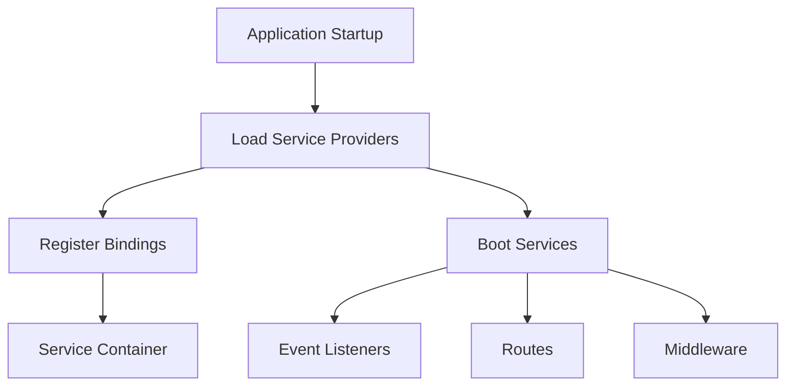

# Service Providers

## Introduction

Service providers are the central place of all Laravel application bootstrapping. Your own application, as well as all of Laravel's core services, are bootstrapped via service providers.

But, what do we mean by "bootstrapped"? In general, we mean registering things, including registering service container bindings, event listeners, middleware, and even routes. Service providers are the central place to configure your application.

Laravel uses dozens of service providers internally to bootstrap its core services, such as the mailer, queue, cache, and others. Many of these providers are "deferred" providers, meaning they will not be loaded on every request, but only when the services they provide are actually needed.

All user-defined service providers are registered in the `bootstrap/providers.php` file. In the following documentation, you will learn how to write your own service providers and register them with your Laravel application.

If you would like to learn more about how Laravel handles requests and works internally, check out our documentation on the Laravel request lifecycle.

## Writing Service Providers

All service providers extend the `Illuminate\Support\ServiceProvider` class. Most service providers contain a `register` and a `boot` method. Within the `register` method, you should only bind things into the service container. You should never attempt to register any event listeners, routes, or any other piece of functionality within the `register` method.

The Artisan CLI can generate a new provider via the `make:provider` command. Laravel will automatically register your new provider in your application's `bootstrap/providers.php` file:

```bash
php artisan make:provider RiakServiceProvider
```

### The Register Method

As mentioned previously, within the `register` method, you should only bind things into the service container. You should never attempt to register any event listeners, routes, or any other piece of functionality within the `register` method. Otherwise, you may accidentally use a service that is provided by a service provider which has not loaded yet.

Let's take a look at a basic service provider. Within any of your service provider methods, you always have access to the `$app` property which provides access to the service container:

```php
<?php

namespace App\Providers;

use App\Services\Riak\Connection;
use Illuminate\Contracts\Foundation\Application;
use Illuminate\Support\ServiceProvider;

class RiakServiceProvider extends ServiceProvider
{
    /**
     * Register any application services.
     */
    public function register(): void
    {
        $this->app->singleton(Connection::class, function (Application $app) {
            return new Connection(config('riak'));
        });
    }
}
```

This service provider only defines a `register` method, and uses that method to define an implementation of `App\Services\Riak\Connection` in the service container. If you're not yet familiar with Laravel's service container, check out its documentation.

### The Bindings and Singletons Properties

If your service provider registers many simple bindings, you may wish to use the `bindings` and `singletons` properties instead of manually registering each container binding. When the service provider is loaded by the framework, it will automatically check for these properties and register their bindings:

```php
<?php

namespace App\Providers;

use App\Contracts\DowntimeNotifier;
use App\Contracts\ServerProvider;
use App\Services\DigitalOceanServerProvider;
use App\Services\PingdomDowntimeNotifier;
use App\Services\ServerToolsProvider;
use Illuminate\Support\ServiceProvider;

class AppServiceProvider extends ServiceProvider
{
    /**
     * All of the container bindings that should be registered.
     *
     * @var array
     */
    public $bindings = [
        ServerProvider::class => DigitalOceanServerProvider::class,
    ];

    /**
     * All of the container singletons that should be registered.
     *
     * @var array
     */
    public $singletons = [
        DowntimeNotifier::class => PingdomDowntimeNotifier::class,
        ServerProvider::class => ServerToolsProvider::class,
    ];
}
```

## Visualization

Below is a Mermaid diagram to visualize the flow of service providers in Laravel:



## Examples

### Example 1: Basic Service Provider

```php
<?php

namespace App\Providers;

use Illuminate\Support\ServiceProvider;

class LogServiceProvider extends ServiceProvider
{
    /**
     * Register any application services.
     */
    public function register(): void
    {
        $this->app->singleton('log', function ($app) {
            return new \App\Services\LogService();
        });
    }

    /**
     * Bootstrap any application services.
     */
    public function boot(): void
    {
        //
    }
}
```

### Example 2: Deferred Service Provider

```php
<?php

namespace App\Providers;

use Illuminate\Contracts\Support\DeferrableProvider;
use Illuminate\Support\ServiceProvider;

class CacheServiceProvider extends ServiceProvider implements DeferrableProvider
{
    /**
     * Register any application services.
     */
    public function register(): void
    {
        $this->app->singleton('cache', function ($app) {
            return $app->make('cache.store');
        });

        $this->app->singleton('cache.store', function ($app) {
            return new \App\Services\CacheService();
        });
    }

    /**
     * Get the services provided by the provider.
     *
     * @return array
     */
    public function provides(): array
    {
        return ['cache', 'cache.store'];
    }
}
```

## The Boot Method

The `boot` method is where you can register functionalities that require access to all other services registered by Laravel. For example, if you need to register a view composer, you should do it in the `boot` method:

**File:** `app/Providers/ComposerServiceProvider.php`

```php
<?php

namespace App\Providers;

use Illuminate\Support\Facades\View;
use Illuminate\Support\ServiceProvider;

class ComposerServiceProvider extends ServiceProvider
{
    /**
     * Bootstrap any application services.
     */
    public function boot(): void
    {
        View::composer('view', function () {
            // Register your view composer logic here
        });
    }
}
```

### Boot Method Dependency Injection

You can also request dependencies in the `boot` method. Laravel will automatically provide them for you:

**File:** `app/Providers/AppServiceProvider.php`

```php
use Illuminate\Contracts\Routing\ResponseFactory;

/**
 * Bootstrap any application services.
 */
public function boot(ResponseFactory $response): void
{
    $response->macro('serialized', function (mixed $value) {
        // Add a custom response macro
    });
}
```

## Registering Providers

All service providers are listed in the `bootstrap/providers.php` file. This file contains an array of service provider class names:

**File:** `bootstrap/providers.php`

```php
<?php

return [
    App\Providers\AppServiceProvider::class,
];
```

When you create a new service provider using the Artisan command, Laravel automatically adds it to this file:

```bash
php artisan make:provider ComposerServiceProvider
```

If you create a service provider manually, you need to add it to the `bootstrap/providers.php` file yourself:

**File:** `bootstrap/providers.php`

```php
<?php

return [
    App\Providers\AppServiceProvider::class,
    App\Providers\ComposerServiceProvider::class,
];
```

## Deferred Providers

Deferred providers are loaded only when they are needed, which improves your application's performance. To make a provider deferred, implement the `DeferrableProvider` interface and define a `provides` method:

**File:** `app/Providers/RiakServiceProvider.php`

```php
<?php

namespace App\Providers;

use App\Services\Riak\Connection;
use Illuminate\Contracts\Foundation\Application;
use Illuminate\Contracts\Support\DeferrableProvider;
use Illuminate\Support\ServiceProvider;

class RiakServiceProvider extends ServiceProvider implements DeferrableProvider
{
    /**
     * Register any application services.
     */
    public function register(): void
    {
        $this->app->singleton(Connection::class, function (Application $app) {
            return new Connection($app['config']['riak']);
        });
    }

    /**
     * Get the services provided by the provider.
     *
     * @return array<int, string>
     */
    public function provides(): array
    {
        return [Connection::class];
    }
}
```

## Conclusion

Service providers are a fundamental part of Laravel's architecture. They allow you to organize and bootstrap your application's services in a clean and maintainable way. By understanding how to create and use service providers, you can effectively manage your application's dependencies and configurations.