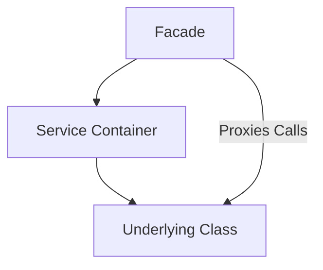
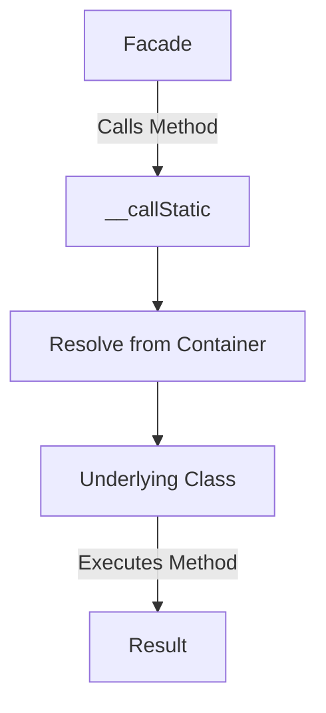
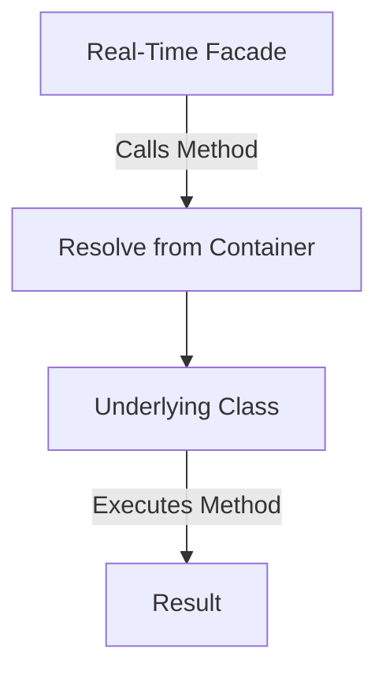

# Facades

## Introduction

Throughout the Laravel documentation, you will see examples of code that interacts with Laravel's features via "facades". Facades provide a "static" interface to classes that are available in the application's service container. Laravel ships with many facades which provide access to almost all of Laravel's features.

Laravel facades serve as "static proxies" to underlying classes in the service container, providing the benefit of a terse, expressive syntax while maintaining more testability and flexibility than traditional static methods. It's perfectly fine if you don't totally understand how facades work - just go with the flow and continue learning about Laravel.

All of Laravel's facades are defined in the `Illuminate\Support\Facades` namespace. So, we can easily access a facade like so:

```php
use Illuminate\Support\Facades\Cache;
use Illuminate\Support\Facades\Route;

Route::get('/cache', function () {
    return Cache::get('key');
});
```

Throughout the Laravel documentation, many of the examples will use facades to demonstrate various features of the framework.

## Helper Functions

To complement facades, Laravel offers a variety of global "helper functions" that make it even easier to interact with common Laravel features. Some of the common helper functions you may interact with are `view`, `response`, `url`, `config`, and more. Each helper function offered by Laravel is documented with their corresponding feature; however, a complete list is available within the dedicated helper documentation.

For example, instead of using the `Illuminate\Support\Facades\Response` facade to generate a JSON response, we may simply use the `response` function. Because helper functions are globally available, you do not need to import any classes in order to use them:

```php
use Illuminate\Support\Facades\Response;

Route::get('/users', function () {
    return Response::json([
        // ...
    ]);
});

Route::get('/users', function () {
    return response()->json([
        // ...
    ]);
});
```

## When to Utilize Facades

Facades have many benefits. They provide a terse, memorable syntax that allows you to use Laravel's features without remembering long class names that must be injected or configured manually. Furthermore, because of their unique usage of PHP's dynamic methods, they are easy to test.

However, some care must be taken when using facades. The primary danger of facades is class "scope creep". Since facades are so easy to use and do not require injection, it can be easy to let your classes continue to grow and use many facades in a single class. Using dependency injection, this potential is mitigated by the visual feedback a large constructor gives you that your class is growing too large. So, when using facades, pay special attention to the size of your class so that its scope of responsibility stays narrow. If your class is getting too large, consider splitting it into multiple smaller classes.

## Facades vs. Dependency Injection

One of the primary benefits of dependency injection is the ability to swap implementations of the injected class. This is useful during testing since you can inject a mock or stub and assert that various methods were called on the stub.

Typically, it would not be possible to mock or stub a truly static class method. However, since facades use dynamic methods to proxy method calls to objects resolved from the service container, we actually can test facades just as we would test an injected class instance. For example, given the following route:

```php
use Illuminate\Support\Facades\Cache;

Route::get('/cache', function () {
    return Cache::get('key');
});
```

Using Laravel's facade testing methods, we can write the following test to verify that the `Cache::get` method was called with the argument we expected:

```php
use Illuminate\Support\Facades\Cache;

Cache::shouldReceive('get')->once()->with('key');
```

## Visualization

Below is a Mermaid diagram to visualize the relationship between facades and the service container:



## Examples

### Example 1: Using a Facade

**File:** `routes/web.php`

```php
use Illuminate\Support\Facades\Cache;
use Illuminate\Support\Facades\Route;

Route::get('/cache', function () {
    return Cache::get('key');
});
```

### Example 2: Using a Helper Function

**File:** `routes/web.php`

```php
Route::get('/users', function () {
    return response()->json([
        'name' => 'John Doe',
        'email' => 'john@example.com'
    ]);
});
```

### Example 3: Testing a Facade

**File:** `tests/Feature/ExampleTest.php`

```php
use Illuminate\Support\Facades\Cache;

public function test_cache_facade()
{
    Cache::shouldReceive('get')->once()->with('key')->andReturn('value');

    $response = $this->get('/cache');

    $response->assertSee('value');
}
```

## How Facades Work

In a Laravel application, a facade is a class that provides access to an object from the container. The machinery that makes this work is in the `Facade` class. Laravel's facades, and any custom facades you create, will extend the base `Illuminate\Support\Facades\Facade` class.

The `Facade` base class makes use of the `__callStatic()` magic-method to defer calls from your facade to an object resolved from the container. In the example below, a call is made to the Laravel cache system. By glancing at this code, one might assume that the static `get` method is being called on the `Cache` class:

**File:** `app/Http/Controllers/UserController.php`

```php
<?php

namespace App\Http\Controllers;

use Illuminate\Support\Facades\Cache;
use Illuminate\View\View;

class UserController extends Controller
{
    /**
     * Show the profile for the given user.
     */
    public function showProfile(string $id): View
    {
        $user = Cache::get('user:'.$id);

        return view('profile', ['user' => $user]);
    }
}
```

Notice that near the top of the file we are "importing" the `Cache` facade. This facade serves as a proxy for accessing the underlying implementation of the `Illuminate\Contracts\Cache\Factory` interface. Any calls we make using the facade will be passed to the underlying instance of Laravel's cache service.

If we look at that `Illuminate\Support\Facades\Cache` class, you'll see that there is no static method `get`:

```php
class Cache extends Facade
{
    /**
     * Get the registered name of the component.
     */
    protected static function getFacadeAccessor(): string
    {
        return 'cache';
    }
}
```

Instead, the `Cache` facade extends the base `Facade` class and defines the method `getFacadeAccessor()`. This method's job is to return the name of a service container binding. When a user references any static method on the `Cache` facade, Laravel resolves the `cache` binding from the service container and runs the requested method (in this case, `get`) against that object.

### Visualization of How Facades Work



## Real-Time Facades

Using real-time facades, you may treat any class in your application as if it was a facade. To illustrate how this can be used, let's first examine some code that does not use real-time facades. For example, let's assume our `Podcast` model has a `publish` method. However, in order to publish the podcast, we need to inject a `Publisher` instance:

**File:** `app/Models/Podcast.php`

```php
<?php

namespace App\Models;

use App\Contracts\Publisher;
use Illuminate\Database\Eloquent\Model;

class Podcast extends Model
{
    /**
     * Publish the podcast.
     */
    public function publish(Publisher $publisher): void
    {
        $this->update(['publishing' => now()]);

        $publisher->publish($this);
    }
}
```

Injecting a publisher implementation into the method allows us to easily test the method in isolation since we can mock the injected publisher. However, it requires us to always pass a publisher instance each time we call the `publish` method. Using real-time facades, we can maintain the same testability while not being required to explicitly pass a `Publisher` instance. To generate a real-time facade, prefix the namespace of the imported class with `Facades`:

**File:** `app/Models/Podcast.php`

```php
<?php

namespace App\Models;

use App\Contracts\Publisher;
use Facades\App\Contracts\Publisher;
use Illuminate\Database\Eloquent\Model;

class Podcast extends Model
{
    /**
     * Publish the podcast.
     */
    public function publish(Publisher $publisher): void
    public function publish(): void
    {
        $this->update(['publishing' => now()]);

        $publisher->publish($this);
        Publisher::publish($this);
    }
}
```

When the real-time facade is used, the publisher implementation will be resolved out of the service container using the portion of the interface or class name that appears after the `Facades` prefix. When testing, we can use Laravel's built-in facade testing helpers to mock this method call:

**File:** `tests/Feature/PodcastTest.php`

```php
<?php

namespace Tests\Feature;

use App\Models\Podcast;
use Facades\App\Contracts\Publisher;
use Illuminate\Foundation\Testing\RefreshDatabase;
use Tests\TestCase;

class PodcastTest extends TestCase
{
    use RefreshDatabase;

    /**
     * A test example.
     */
    public function test_podcast_can_be_published(): void
    {
        $podcast = Podcast::factory()->create();

        Publisher::shouldReceive('publish')->once()->with($podcast);

        $podcast->publish();
    }
}
```

### Visualization of Real-Time Facades



## Facade Class Reference

Below you will find every facade and its underlying class. This is a useful tool for quickly digging into the API documentation for a given facade root. The service container binding key is also included where applicable.

| Facade | Class | Service Container Binding |
|--------|-------|---------------------------|
| App | `Illuminate\Foundation\Application` | `app` |
| Artisan | `Illuminate\Contracts\Console\Kernel` | `artisan` |
| Auth (Instance) | `Illuminate\Contracts\Auth\Guard` | `auth.driver` |
| Auth | `Illuminate\Auth\AuthManager` | `auth` |
| Blade | `Illuminate\View\Compilers\BladeCompiler` | `blade.compiler` |
| Broadcast (Instance) | `Illuminate\Contracts\Broadcasting\Broadcaster` | |
| Broadcast | `Illuminate\Contracts\Broadcasting\Factory` | |
| Bus | `Illuminate\Contracts\Bus\Dispatcher` | |
| Cache (Instance) | `Illuminate\Cache\Repository` | `cache.store` |
| Cache | `Illuminate\Cache\CacheManager` | `cache` |
| Config | `Illuminate\Config\Repository` | `config` |
| Context | `Illuminate\Log\Context\Repository` | |
| Cookie | `Illuminate\Cookie\CookieJar` | `cookie` |
| Crypt | `Illuminate\Encryption\Encrypter` | `encrypter` |
| Date | `Illuminate\Support\DateFactory` | `date` |
| DB (Instance) | `Illuminate\Database\Connection` | `db.connection` |
| DB | `Illuminate\Database\DatabaseManager` | `db` |
| Event | `Illuminate\Events\Dispatcher` | `events` |
| Exceptions (Instance) | `Illuminate\Contracts\Debug\ExceptionHandler` | |
| Exceptions | `Illuminate\Foundation\Exceptions\Handler` | |
| File | `Illuminate\Filesystem\Filesystem` | `files` |
| Gate | `Illuminate\Contracts\Auth\Access\Gate` | |
| Hash | `Illuminate\Contracts\Hashing\Hasher` | `hash` |
| Http | `Illuminate\Http\Client\Factory` | |
| Lang | `Illuminate\Translation\Translator` | `translator` |
| Log | `Illuminate\Log\LogManager` | `log` |
| Mail | `Illuminate\Mail\Mailer` | `mailer` |
| Notification | `Illuminate\Notifications\ChannelManager` | |
| Password (Instance) | `Illuminate\Auth\Passwords\PasswordBroker` | `auth.password.broker` |
| Password | `Illuminate\Auth\Passwords\PasswordBrokerManager` | `auth.password` |
| Pipeline (Instance) | `Illuminate\Pipeline\Pipeline` | |
| Process | `Illuminate\Process\Factory` | |
| Queue (Base Class) | `Illuminate\Queue\Queue` | |
| Queue (Instance) | `Illuminate\Contracts\Queue\Queue` | `queue.connection` |
| Queue | `Illuminate\Queue\QueueManager` | `queue` |
| RateLimiter | `Illuminate\Cache\RateLimiter` | |
| Redirect | `Illuminate\Routing\Redirector` | `redirect` |
| Redis (Instance) | `Illuminate\Redis\Connections\Connection` | `redis.connection` |
| Redis | `Illuminate\Redis\RedisManager` | `redis` |
| Request | `Illuminate\Http\Request` | `request` |
| Response (Instance) | `Illuminate\Http\Response` | |
| Response | `Illuminate\Contracts\Routing\ResponseFactory` | |
| Route | `Illuminate\Routing\Router` | `router` |
| Schedule | `Illuminate\Console\Scheduling\Schedule` | |
| Schema | `Illuminate\Database\Schema\Builder` | |
| Session (Instance) | `Illuminate\Session\Store` | `session.store` |
| Session | `Illuminate\Session\SessionManager` | `session` |
| Storage (Instance) | `Illuminate\Contracts\Filesystem\Filesystem` | `filesystem.disk` |
| Storage | `Illuminate\Filesystem\FilesystemManager` | `filesystem` |
| URL | `Illuminate\Routing\UrlGenerator` | `url` |
| Validator (Instance) | `Illuminate\Validation\Validator` | |
| Validator | `Illuminate\Validation\Factory` | `validator` |
| View (Instance) | `Illuminate\View\View` | |
| View | `Illuminate\View\Factory` | `view` |
| Vite | `Illuminate\Foundation\Vite` | |

## Conclusion

Facades provide a simple and expressive way to interact with Laravel's features. They offer the convenience of static methods while maintaining the flexibility and testability of dependency injection. By understanding how facades work, including real-time facades, and referring to the facade class reference, you can write cleaner and more maintainable Laravel applications.