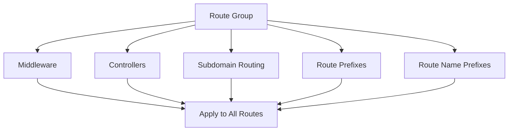
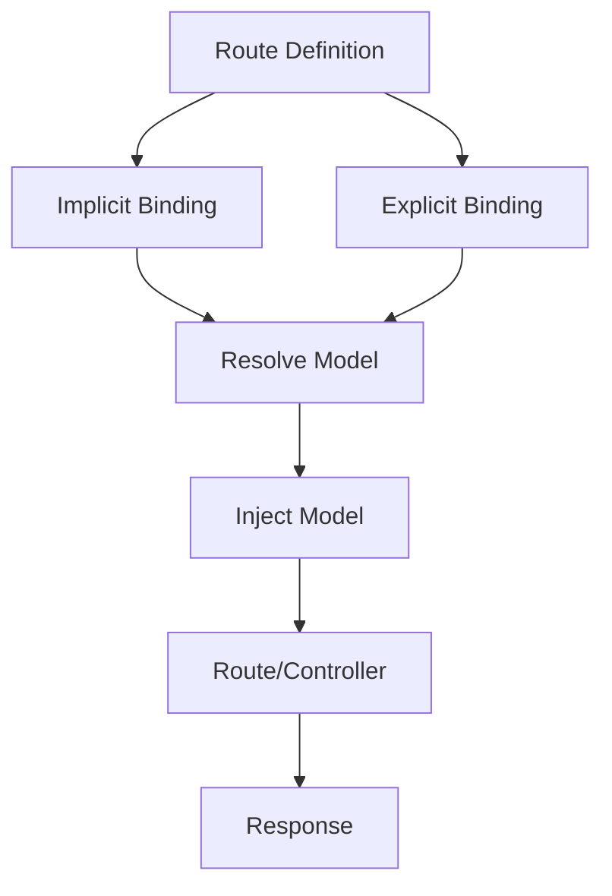
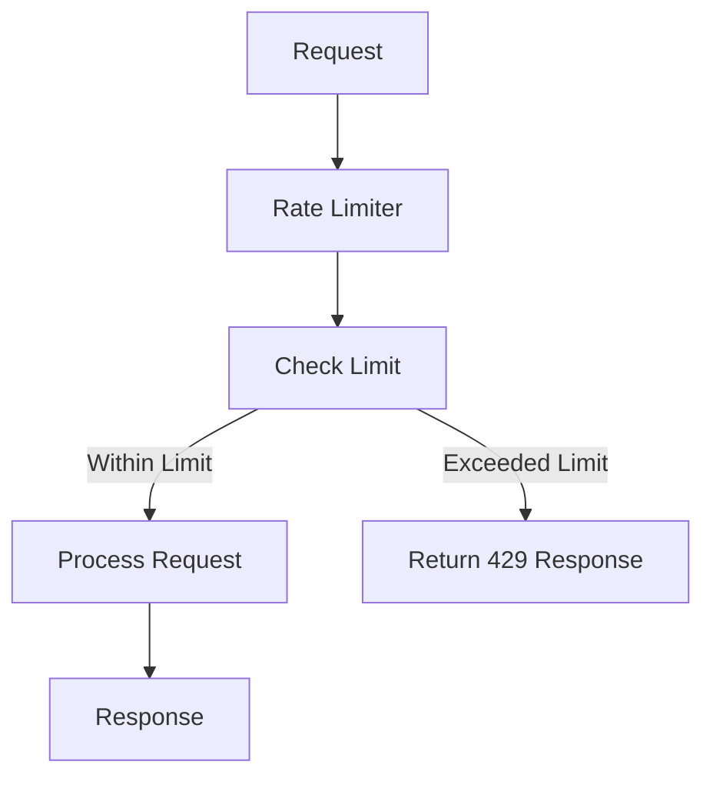
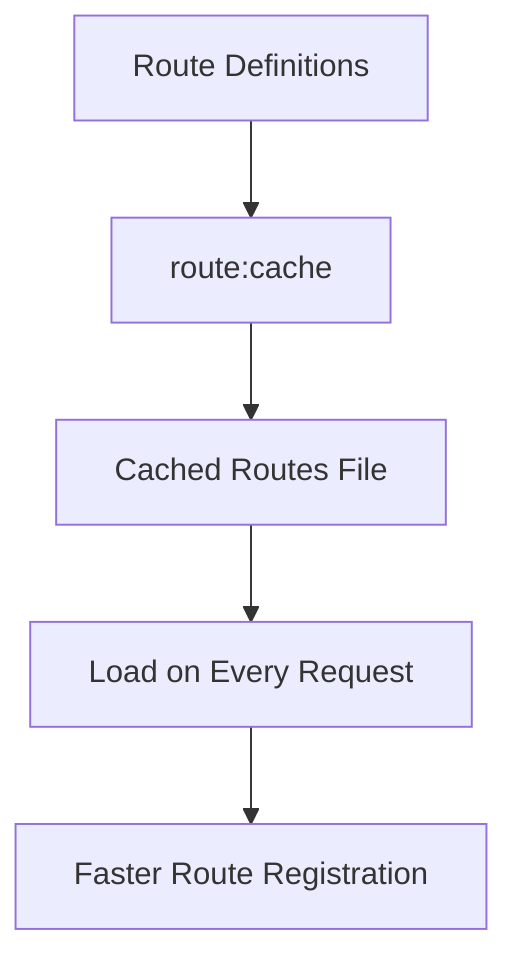
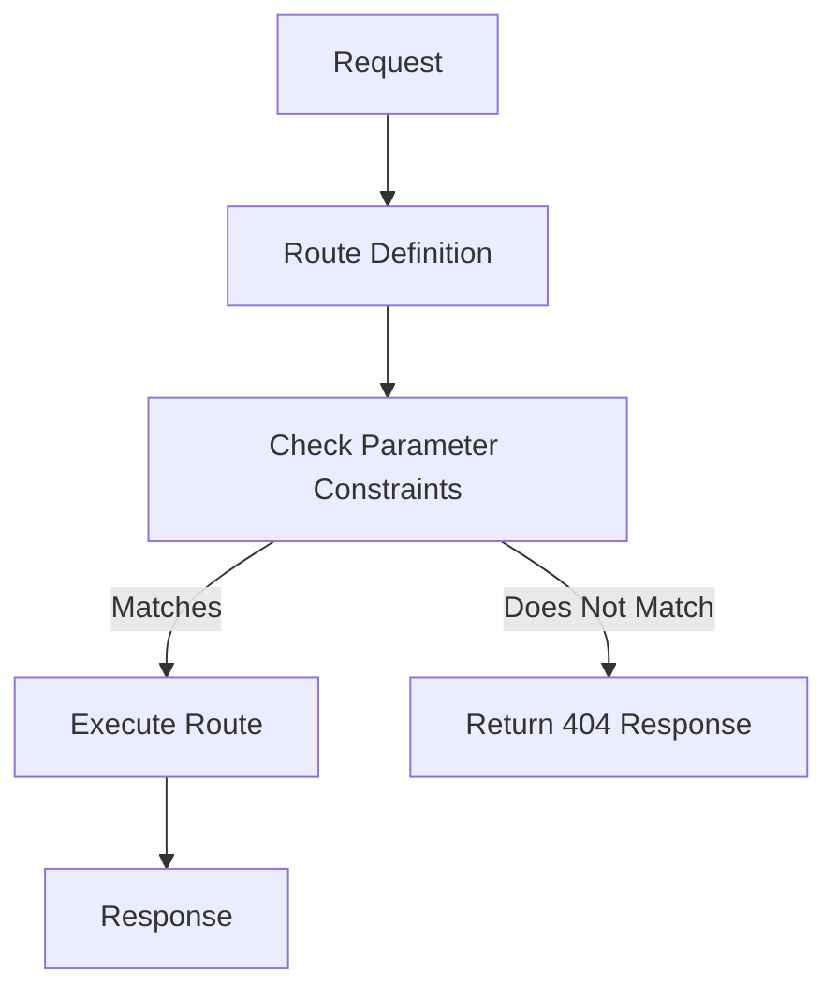
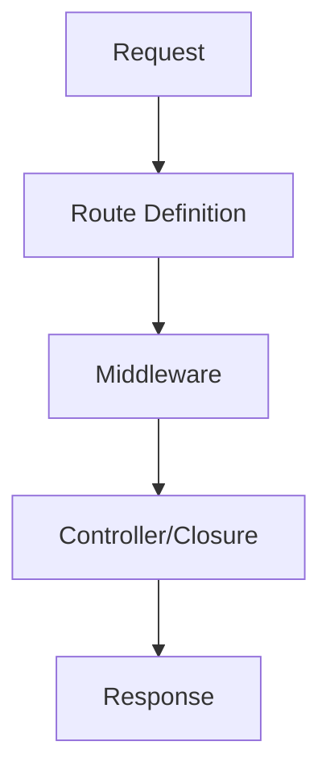

# Basic Routing

## Introduction

The most basic Laravel routes accept a URI and a closure, providing a very simple and expressive method of defining routes and behavior without complicated routing configuration files:

```php
use Illuminate\Support\Facades\Route;

Route::get('/greeting', function () {
    return 'Hello World';
});
```

### Basic Structure of a Route

A basic Laravel route consists of the following components:

1. **HTTP Method**: The HTTP method (e.g., `GET`, `POST`, `PUT`, `DELETE`) that the route should respond to.
2. **URI**: The Uniform Resource Identifier (URI) that the route should match.
3. **Callback**: The closure or controller method that should be executed when the route is accessed.

Here is the basic structure of a route:

```php
Route::method('uri', callback);
```

- **method**: The HTTP method (e.g., `get`, `post`, `put`, `delete`).
- **uri**: The URI path that the route should match.
- **callback**: The closure or controller method that handles the request.

For example, a `GET` route that returns a simple string:

```php
Route::get('/hello', function () {
    return 'Hello, World!';
});
```

A `POST` route that handles form submissions:

```php
Route::post('/submit', function () {
    return 'Form submitted successfully!';
});
```

## The Default Route Files

All Laravel routes are defined in your route files, which are located in the `routes` directory. These files are automatically loaded by Laravel using the configuration specified in your application's `bootstrap/app.php` file. The `routes/web.php` file defines routes that are for your web interface. These routes are assigned the `web` middleware group, which provides features like session state and CSRF protection.

For most applications, you will begin by defining routes in your `routes/web.php` file. The routes defined in `routes/web.php` may be accessed by entering the defined route's URL in your browser. For example, you may access the following route by navigating to `http://example.com/user` in your browser:

**File:** `routes/web.php`

```php
use App\Http\Controllers\UserController;

Route::get('/user', [UserController::class, 'index']);
```

## API Routes

If your application will also offer a stateless API, you may enable API routing using the `install:api` Artisan command:

```bash
php artisan install:api
```

The `install:api` command installs Laravel Sanctum, which provides a robust, yet simple API token authentication guard which can be used to authenticate third-party API consumers, SPAs, or mobile applications. In addition, the `install:api` command creates the `routes/api.php` file:

**File:** `routes/api.php`

```php
Route::get('/user', function (Request $request) {
    return $request->user();
})->middleware('auth:sanctum');
```

The routes in `routes/api.php` are stateless and are assigned to the `api` middleware group. Additionally, the `/api` URI prefix is automatically applied to these routes, so you do not need to manually apply it to every route in the file. You may change the prefix by modifying your application's `bootstrap/app.php` file:

```php
->withRouting(
    api: __DIR__.'/../routes/api.php',
    apiPrefix: 'api/admin',
    // ...
)
```

## Available Router Methods

The router allows you to register routes that respond to any HTTP verb:

```php
Route::get($uri, $callback);
Route::post($uri, $callback);
Route::put($uri, $callback);
Route::patch($uri, $callback);
Route::delete($uri, $callback);
Route::options($uri, $callback);
```

Sometimes you may need to register a route that responds to multiple HTTP verbs. You may do so using the `match` method. Or, you may even register a route that responds to all HTTP verbs using the `any` method:

```php
Route::match(['get', 'post'], '/', function () {
    // ...
});

Route::any('/', function () {
    // ...
});
```

When defining multiple routes that share the same URI, routes using the `get`, `post`, `put`, `patch`, `delete`, and `options` methods should be defined before routes using the `any`, `match`, and `redirect` methods. This ensures the incoming request is matched with the correct route.

## Dependency Injection

You may type-hint any dependencies required by your route in your route's callback signature. The declared dependencies will automatically be resolved and injected into the callback by the Laravel service container. For example, you may type-hint the `Illuminate\Http\Request` class to have the current HTTP request automatically injected into your route callback:

```php
use Illuminate\Http\Request;

Route::get('/users', function (Request $request) {
    // ...
```

## CSRF Protection

Remember, any HTML forms pointing to `POST`, `PUT`, `PATCH`, or `DELETE` routes that are defined in the web routes file should include a CSRF token field. Otherwise, the request will be rejected. You can read more about CSRF protection in the CSRF documentation:

```html
<form method="POST" action="/profile">
    @csrf
    ...
</form>
```

## Redirect Routes

If you are defining a route that redirects to another URI, you may use the `Route::redirect` method. This method provides a convenient shortcut so that you do not have to define a full route or controller for performing a simple redirect:

```php
Route::redirect('/here', '/there');
```

By default, `Route::redirect` returns a `302` status code. You may customize the status code using the optional third parameter:

```php
Route::redirect('/here', '/there', 301);
```

Or, you may use the `Route::permanentRedirect` method to return a `301` status code:

```php
Route::permanentRedirect('/here', '/there');
```

When using route parameters in redirect routes, the following parameters are reserved by Laravel and cannot be used: `destination` and `status`.

## View Routes

If your route only needs to return a view, you may use the `Route::view` method. Like the `redirect` method, this method provides a simple shortcut so that you do not have to define a full route or controller. The `view` method accepts a URI as its first argument and a view name as its second argument. In addition, you may provide an array of data to pass to the view as an optional third argument:

```php
Route::view('/welcome', 'welcome');

Route::view('/welcome', 'welcome', ['name' => 'Taylor']);
```

When using route parameters in view routes, the following parameters are reserved by Laravel and cannot be used: `view`, `data`, `status`, and `headers`.

## Listing Your Routes

The `route:list` Artisan command can easily provide an overview of all of the routes that are defined by your application:

```bash
php artisan route:list
```

By default, the route middleware that are assigned to each route will not be displayed in the `route:list` output; however, you can instruct Laravel to display the route middleware and middleware group names by adding the `-v` option to the command:

```bash
php artisan route:list -v
```

You may also instruct Laravel to only show routes that begin with a given URI:

```bash
php artisan route:list --path=api
```

In addition, you may instruct Laravel to hide any routes that are defined by third-party packages by providing the `--except-vendor` option when executing the `route:list` command:

```bash
php artisan route:list --except-vendor
```

Likewise, you may also instruct Laravel to only show routes that are defined by third-party packages by providing the `--only-vendor` option when executing the `route:list` command:

```bash
php artisan route:list --only-vendor
```

## Routing Customization

By default, your application's routes are configured and loaded by the `bootstrap/app.php` file:

```php
<?php

use Illuminate\Foundation\Application;

return Application::configure(basePath: dirname(__DIR__))
    ->withRouting(
        web: __DIR__.'/../routes/web.php',
        commands: __DIR__.'/../routes/console.php',
        health: '/up',
    )->create();
```

However, sometimes you may want to define an entirely new file to contain a subset of your application's routes. To accomplish this, you may provide a `then` closure to the `withRouting` method. Within this closure, you may register any additional routes that are necessary for your application:

```php
use Illuminate\Support\Facades\Route;

->withRouting(
    web: __DIR__.'/../routes/web.php',
    commands: __DIR__.'/../routes/console.php',
    health: '/up',
    then: function () {
        Route::middleware('api')
            ->prefix('webhooks')
            ->name('webhooks.')
            ->group(base_path('routes/webhooks.php'));
    },
)
```

Or, you may even take complete control over route registration by providing a `using` closure to the `withRouting` method. When this argument is passed, no HTTP routes will be registered by the framework and you are responsible for manually registering all routes:

```php
use Illuminate\Support\Facades\Route;

->withRouting(
    commands: __DIR__.'/../routes/console.php',
    using: function () {
        Route::middleware('api')
            ->prefix('api')
            ->group(base_path('routes/api.php'));

        Route::middleware('web')
            ->group(base_path('routes/web.php'));
    },
)
```

## Named Routes

**Definition:**
Named routes allow you to assign a unique name to a route, making it easier to generate URLs or redirects for that route. This is particularly useful when you need to reference a route in multiple places within your application.

**Technical Explanation:**
By assigning a name to a route, you can use that name to generate URLs or redirects without having to hardcode the route's URI. This makes your code more maintainable and flexible, as you can change the route's URI without having to update all references to it.

### Assigning Names to Routes

You can specify a name for a route by chaining the `name` method onto the route definition:

**File:** `routes/web.php`

```php
use Illuminate\Support\Facades\Route;

Route::get('/user/profile', function () {
    // Route logic here
    return 'User Profile';
})->name('profile');
```

You can also specify route names for controller actions:

**File:** `routes/web.php`

```php
use Illuminate\Support\Facades\Route;
use App\Http\Controllers\UserProfileController;

Route::get('/user/profile', [UserProfileController::class, 'show'])->name('profile');
```

**Note:** Route names should always be unique to avoid conflicts.

### Generating URLs to Named Routes

Once you have assigned a name to a route, you can use that name to generate URLs or redirects using Laravel's `route` and `redirect` helper functions.

**Generating URLs:**

**File:** `routes/web.php`

```php
use Illuminate\Support\Facades\Route;

$url = route('profile');
```

**Generating Redirects:**

**File:** `routes/web.php`

```php
use Illuminate\Support\Facades\Route;

return redirect()->route('profile');
```

**Using the `to_route` Helper:**

**File:** `routes/web.php`

```php
use Illuminate\Support\Facades\Route;

return to_route('profile');
```

**Passing Parameters:**

If the named route defines parameters, you can pass them as the second argument to the `route` function:

**File:** `routes/web.php`

```php
use Illuminate\Support\Facades\Route;

Route::get('/user/{id}/profile', function (string $id) {
    // Route logic here
    return 'User Profile for ID: '.$id;
})->name('profile');

$url = route('profile', ['id' => 1]);
```

**Adding Query Parameters:**

You can also pass additional parameters that will be added to the generated URL's query string:

**File:** `routes/web.php`

```php
use Illuminate\Support\Facades\Route;

Route::get('/user/{id}/profile', function (string $id) {
    // Route logic here
    return 'User Profile for ID: '.$id;
})->name('profile');

$url = route('profile', ['id' => 1, 'photos' => 'yes']);
// Generated URL: http://example.com/user/1/profile?photos=yes
```

**Default Parameters:**

You can specify request-wide default values for URL parameters using the `URL::defaults` method. This is useful for setting default values like the current locale.

**File:** `routes/web.php`

```php
use Illuminate\Support\Facades\URL;

URL::defaults(['locale' => 'en']);
```

### Inspecting the Current Route

You can determine if the current request was routed to a given named route using the `named` method on a `Route` instance. This is useful in route middleware or controllers.

**File:** `app/Http/Middleware/CheckRoute.php`

```php
<?php

namespace App\Http\Middleware;

use Closure;
use Illuminate\Http\Request;
use Symfony\Component\HttpFoundation\Response;

class CheckRoute
{
    /**
     * Handle an incoming request.
     *
     * @param  \Closure(\Illuminate\Http\Request): (\Symfony\Component\HttpFoundation\Response)  $next
     */
    public function handle(Request $request, Closure $next): Response
    {
        if ($request->route()->named('profile')) {
            // Perform actions specific to the 'profile' route
        }

        return $next($request);
    }
}
```

**Visualization:**

```mermaid
graph TD
    A[Named Route Definition] --> B[Generate URL/Redirect]
    B --> C[route('profile')]
    B --> D[redirect()->route('profile')]
    B --> E[to_route('profile')]
    C --> F[URL]
    D --> F
    E --> F
```

**Summary:**

- **Named Routes**: Assign unique names to routes for easy reference.
- **Generating URLs/Redirects**: Use the `route`, `redirect`, and `to_route` helpers.
- **Parameters**: Pass parameters to named routes for dynamic URLs.
- **Query Parameters**: Add query parameters to generated URLs.
- **Inspecting Routes**: Check the current route name using the `named` method.

## Route Groups

**Definition:**
Route groups allow you to share route attributes, such as middleware, across multiple routes without needing to define those attributes on each individual route. This makes your route definitions more concise and easier to maintain.

**Technical Explanation:**
Route groups are useful for applying common attributes like middleware, controllers, prefixes, and names to a collection of routes. Nested groups intelligently merge attributes with their parent group, ensuring that middleware and conditions are combined while names and prefixes are appended.

### Middleware

To assign middleware to all routes within a group, you can use the `middleware` method before defining the group. Middleware are executed in the order they are listed in the array.

**File:** `routes/web.php`

```php
use Illuminate\Support\Facades\Route;

Route::middleware(['first', 'second'])->group(function () {
    Route::get('/', function () {
        // Uses first & second middleware...
        return 'Home Page';
    });

    Route::get('/user/profile', function () {
        // Uses first & second middleware...
        return 'User Profile';
    });
});
```

### Controllers

If a group of routes all utilize the same controller, you can use the `controller` method to define the common controller for all routes within the group. This allows you to specify only the controller method when defining the routes.

**File:** `routes/web.php`

```php
use Illuminate\Support\Facades\Route;
use App\Http\Controllers\OrderController;

Route::controller(OrderController::class)->group(function () {
    Route::get('/orders/{id}', 'show');
    Route::post('/orders', 'store');
});
```

### Subdomain Routing

Route groups can also be used to handle subdomain routing. Subdomains may be assigned route parameters just like route URIs, allowing you to capture a portion of the subdomain for usage in your route or controller.

**File:** `routes/web.php`

```php
use Illuminate\Support\Facades\Route;

Route::domain('{account}.example.com')->group(function () {
    Route::get('/user/{id}', function (string $account, string $id) {
        // Handle subdomain routing...
        return 'Account: '.$account.', User ID: '.$id;
    });
});
```

**Note:** To ensure your subdomain routes are reachable, you should register subdomain routes before registering root domain routes. This prevents root domain routes from overwriting subdomain routes with the same URI path.

### Route Prefixes

The `prefix` method may be used to prefix each route in the group with a given URI. This is useful for grouping routes under a common prefix, such as `admin`.

**File:** `routes/web.php`

```php
use Illuminate\Support\Facades\Route;

Route::prefix('admin')->group(function () {
    Route::get('/users', function () {
        // Matches The "/admin/users" URL
        return 'Admin Users';
    });

    Route::get('/posts', function () {
        // Matches The "/admin/posts" URL
        return 'Admin Posts';
    });
});
```

### Route Name Prefixes

The `name` method may be used to prefix each route name in the group with a given string. This is useful for organizing route names under a common prefix, such as `admin`.

**File:** `routes/web.php`

```php
use Illuminate\Support\Facades\Route;

Route::name('admin.')->group(function () {
    Route::get('/users', function () {
        // Route assigned name "admin.users"...
        return 'Admin Users';
    })->name('users');

    Route::get('/posts', function () {
        // Route assigned name "admin.posts"...
        return 'Admin Posts';
    })->name('posts');
});
```

**Visualization:**



**Summary:**

- **Middleware**: Apply middleware to all routes in a group.
- **Controllers**: Define a common controller for all routes in a group.
- **Subdomain Routing**: Handle subdomain routing with route parameters.
- **Route Prefixes**: Prefix all route URIs in a group with a common string.
- **Route Name Prefixes**: Prefix all route names in a group with a common string.

## Route Model Binding

**Definition:**
Route model binding provides a convenient way to automatically inject model instances directly into your routes or controller actions. Instead of manually querying the database to retrieve a model based on its ID, Laravel can automatically resolve and inject the model instance that matches the given ID from the route parameters.

**Technical Explanation:**
When you type-hint a model in your route or controller action, Laravel will automatically resolve the model instance based on the route segment name. If a matching model instance is not found, Laravel will generate a `404 HTTP` response.

### Implicit Binding

Laravel automatically resolves Eloquent models defined in routes or controller actions whose type-hinted variable names match a route segment name.

**File:** `routes/web.php`

```php
use Illuminate\Support\Facades\Route;
use App\Models\User;

Route::get('/users/{user}', function (User $user) {
    return $user->email;
});
```

In this example, the `$user` variable is type-hinted as the `App\Models\User` Eloquent model, and the variable name matches the `{user}` URI segment. Laravel will automatically inject the model instance that has an ID matching the corresponding value from the request URI.

**Controller Example:**

**File:** `routes/web.php`

```php
use Illuminate\Support\Facades\Route;
use App\Http\Controllers\UserController;

Route::get('/users/{user}', [UserController::class, 'show']);
```

**File:** `app/Http/Controllers/UserController.php`

```php
<?php

namespace App\Http\Controllers;

use App\Models\User;
use Illuminate\View\View;

class UserController extends Controller
{
    public function show(User $user): View
    {
        return view('user.profile', ['user' => $user]);
    }
}
```

### Soft Deleted Models

By default, implicit model binding will not retrieve models that have been soft deleted. However, you can instruct the implicit binding to retrieve these models by chaining the `withTrashed` method onto your route's definition.

**File:** `routes/web.php`

```php
use Illuminate\Support\Facades\Route;
use App\Models\User;

Route::get('/users/{user}', function (User $user) {
    return $user->email;
})->withTrashed();
```

### Customizing the Key

You can resolve Eloquent models using a column other than `id` by specifying the column in the route parameter definition.

**File:** `routes/web.php`

```php
use Illuminate\Support\Facades\Route;
use App\Models\Post;

Route::get('/posts/{post:slug}', function (Post $post) {
    return $post;
});
```

Alternatively, you can override the `getRouteKeyName` method on the Eloquent model to always use a specific column for route binding:

**File:** `app/Models/Post.php`

```php
<?php

namespace App\Models;

use Illuminate\Database\Eloquent\Model;

class Post extends Model
{
    /**
     * Get the route key for the model.
     */
    public function getRouteKeyName(): string
    {
        return 'slug';
    }
}
```

### Custom Keys and Scoping

When implicitly binding multiple Eloquent models in a single route definition, you may wish to scope the second Eloquent model such that it must be a child of the previous Eloquent model.

**File:** `routes/web.php`

```php
use Illuminate\Support\Facades\Route;
use App\Models\Post;
use App\Models\User;

Route::get('/users/{user}/posts/{post:slug}', function (User $user, Post $post) {
    return $post;
});
```

Laravel will automatically scope the query to retrieve the nested model by its parent using conventions to guess the relationship name on the parent.

**Scoping Bindings:**

You can instruct Laravel to scope "child" bindings even when a custom key is not provided by invoking the `scopeBindings` method:

**File:** `routes/web.php`

```php
use Illuminate\Support\Facades\Route;
use App\Models\Post;
use App\Models\User;

Route::get('/users/{user}/posts/{post}', function (User $user, Post $post) {
    return $post;
})->scopeBindings();
```

Or, you may instruct an entire group of route definitions to use scoped bindings:

**File:** `routes/web.php`

```php
use Illuminate\Support\Facades\Route;

Route::scopeBindings()->group(function () {
    Route::get('/users/{user}/posts/{post}', function (User $user, Post $post) {
        return $post;
    });
});
```

**Disabling Scoped Bindings:**

You can explicitly instruct Laravel to not scope bindings by invoking the `withoutScopedBindings` method:

**File:** `routes/web.php`

```php
use Illuminate\Support\Facades\Route;
use App\Models\Post;
use App\Models\User;

Route::get('/users/{user}/posts/{post:slug}', function (User $user, Post $post) {
    return $post;
})->withoutScopedBindings();
```

### Customizing Missing Model Behavior

You can customize the behavior when an implicitly bound model is not found by calling the `missing` method when defining your route.

**File:** `routes/web.php`

```php
use Illuminate\Support\Facades\Route;
use App\Http\Controllers\LocationsController;
use Illuminate\Http\Request;
use Illuminate\Support\Facades\Redirect;

Route::get('/locations/{location:slug}', [LocationsController::class, 'show'])
    ->name('locations.view')
    ->missing(function (Request $request) {
        return Redirect::route('locations.index');
    });
```

### Implicit Enum Binding

Laravel allows you to type-hint a string-backed Enum on your route definition. Laravel will only invoke the route if the route segment corresponds to a valid Enum value.

**File:** `app/Enums/Category.php`

```php
<?php

namespace App\Enums;

enum Category: string
{
    case Fruits = 'fruits';
    case People = 'people';
}
```

**File:** `routes/web.php`

```php
use Illuminate\Support\Facades\Route;
use App\Enums\Category;

Route::get('/categories/{category}', function (Category $category) {
    return $category->value;
});
```

### Explicit Binding

You can explicitly define how route parameters correspond to models using the `model` method in your `AppServiceProvider`.

**File:** `app/Providers/AppServiceProvider.php`

```php
<?php

namespace App\Providers;

use App\Models\User;
use Illuminate\Support\Facades\Route;
use Illuminate\Support\ServiceProvider;

class AppServiceProvider extends ServiceProvider
{
    /**
     * Bootstrap any application services.
     */
    public function boot(): void
    {
        Route::model('user', User::class);
    }
}
```

**File:** `routes/web.php`

```php
use Illuminate\Support\Facades\Route;
use App\Models\User;

Route::get('/users/{user}', function (User $user) {
    // ...
});
```

### Customizing the Resolution Logic

You can define your own model binding resolution logic using the `Route::bind` method.

**File:** `app/Providers/AppServiceProvider.php`

```php
<?php

namespace App\Providers;

use App\Models\User;
use Illuminate\Support\Facades\Route;
use Illuminate\Support\ServiceProvider;

class AppServiceProvider extends ServiceProvider
{
    /**
     * Bootstrap any application services.
     */
    public function boot(): void
    {
        Route::bind('user', function (string $value) {
            return User::where('name', $value)->firstOrFail();
        });
    }
}
```

Alternatively, you can override the `resolveRouteBinding` method on your Eloquent model:

**File:** `app/Models/User.php`

```php
<?php

namespace App\Models;

use Illuminate\Database\Eloquent\Model;

class User extends Model
{
    /**
     * Retrieve the model for a bound value.
     *
     * @param  mixed  $value
     * @param  string|null  $field
     * @return \Illuminate\Database\Eloquent\Model|null
     */
    public function resolveRouteBinding($value, $field = null)
    {
        return $this->where('name', $value)->firstOrFail();
    }
}
```

**Visualization:**



**Summary:**

- **Implicit Binding**: Automatically resolve models based on route segment names.
- **Soft Deleted Models**: Use `withTrashed` to include soft-deleted models.
- **Custom Keys**: Use custom keys like `slug` for route binding.
- **Scoping**: Scope child bindings to parent models.
- **Explicit Binding**: Define custom model bindings in `AppServiceProvider`.
- **Custom Resolution**: Override `resolveRouteBinding` for custom logic.

## Rate Limiting

**Definition:**
Rate limiting is a technique used to control the amount of traffic a user or application can send to a server within a specific time frame. Laravel provides powerful and customizable rate limiting services to restrict the amount of traffic for a given route or group of routes.

**Technical Explanation:**
Rate limiters are defined using the `RateLimiter` facade and can be configured to limit requests based on various criteria such as user ID, IP address, or custom logic. When a rate limit is exceeded, Laravel automatically returns a `429 HTTP` status code.

### Defining Rate Limiters

Rate limiters are defined within the `boot` method of your application's `AppServiceProvider` class.

**File:** `app/Providers/AppServiceProvider.php`

```php
<?php

namespace App\Providers;

use Illuminate\Cache\RateLimiting\Limit;
use Illuminate\Http\Request;
use Illuminate\Support\Facades\RateLimiter;
use Illuminate\Support\ServiceProvider;

class AppServiceProvider extends ServiceProvider
{
    /**
     * Bootstrap any application services.
     */
    public function boot(): void
    {
        RateLimiter::for('api', function (Request $request) {
            return Limit::perMinute(60)->by($request->user()?->id ?: $request->ip());
        });
    }
}
```

**Explanation:**
- **RateLimiter::for**: Defines a rate limiter with a given name (`api` in this case).
- **Limit::perMinute(60)**: Limits the number of requests to 60 per minute.
- **by($request->user()?->id ?: $request->ip())**: Segments the rate limit by user ID or IP address.

### Basic Rate Limiter

You can define a basic rate limiter that applies a global limit to all requests:

**File:** `app/Providers/AppServiceProvider.php`

```php
<?php

namespace App\Providers;

use Illuminate\Cache\RateLimiting\Limit;
use Illuminate\Http\Request;
use Illuminate\Support\Facades\RateLimiter;
use Illuminate\Support\ServiceProvider;

class AppServiceProvider extends ServiceProvider
{
    /**
     * Bootstrap any application services.
     */
    public function boot(): void
    {
        RateLimiter::for('global', function (Request $request) {
            return Limit::perMinute(1000);
        });
    }
}
```

### Custom Response

You can define a custom response to be returned when a rate limit is exceeded:

**File:** `app/Providers/AppServiceProvider.php`

```php
<?php

namespace App\Providers;

use Illuminate\Cache\RateLimiting\Limit;
use Illuminate\Http\Request;
use Illuminate\Support\Facades\RateLimiter;
use Illuminate\Support\ServiceProvider;

class AppServiceProvider extends ServiceProvider
{
    /**
     * Bootstrap any application services.
     */
    public function boot(): void
    {
        RateLimiter::for('global', function (Request $request) {
            return Limit::perMinute(1000)->response(function (Request $request, array $headers) {
                return response('Custom response...', 429, $headers);
            });
        });
    }
}
```

### Dynamic Rate Limits

You can dynamically adjust rate limits based on the incoming request or authenticated user:

**File:** `app/Providers/AppServiceProvider.php`

```php
<?php

namespace App\Providers;

use Illuminate\Cache\RateLimiting\Limit;
use Illuminate\Http\Request;
use Illuminate\Support\Facades\RateLimiter;
use Illuminate\Support\ServiceProvider;

class AppServiceProvider extends ServiceProvider
{
    /**
     * Bootstrap any application services.
     */
    public function boot(): void
    {
        RateLimiter::for('uploads', function (Request $request) {
            return $request->user()->vipCustomer()
                ? Limit::none()
                : Limit::perHour(10);
        });
    }
}
```

### Segmenting Rate Limits

You can segment rate limits by arbitrary values, such as IP address or user ID:

**File:** `app/Providers/AppServiceProvider.php`

```php
<?php

namespace App\Providers;

use Illuminate\Cache\RateLimiting\Limit;
use Illuminate\Http\Request;
use Illuminate\Support\Facades\RateLimiter;
use Illuminate\Support\ServiceProvider;

class AppServiceProvider extends ServiceProvider
{
    /**
     * Bootstrap any application services.
     */
    public function boot(): void
    {
        RateLimiter::for('uploads', function (Request $request) {
            return $request->user()
                ? Limit::perMinute(100)->by($request->user()->id)
                : Limit::perMinute(10)->by($request->ip());
        });
    }
}
```

### Multiple Rate Limits

You can define multiple rate limits for a single rate limiter configuration:

**File:** `app/Providers/AppServiceProvider.php`

```php
<?php

namespace App\Providers;

use Illuminate\Cache\RateLimiting\Limit;
use Illuminate\Http\Request;
use Illuminate\Support\Facades\RateLimiter;
use Illuminate\Support\ServiceProvider;

class AppServiceProvider extends ServiceProvider
{
    /**
     * Bootstrap any application services.
     */
    public function boot(): void
    {
        RateLimiter::for('login', function (Request $request) {
            return [
                Limit::perMinute(500),
                Limit::perMinute(3)->by($request->input('email')),
            ];
        });
    }
}
```

**Note:** If you're assigning multiple rate limits segmented by identical `by` values, ensure each `by` value is unique by prefixing them:

**File:** `app/Providers/AppServiceProvider.php`

```php
<?php

namespace App\Providers;

use Illuminate\Cache\RateLimiting\Limit;
use Illuminate\Http\Request;
use Illuminate\Support\Facades\RateLimiter;
use Illuminate\Support\ServiceProvider;

class AppServiceProvider extends ServiceProvider
{
    /**
     * Bootstrap any application services.
     */
    public function boot(): void
    {
        RateLimiter::for('uploads', function (Request $request) {
            return [
                Limit::perMinute(10)->by('minute:'.$request->user()->id),
                Limit::perDay(1000)->by('day:'.$request->user()->id),
            ];
        });
    }
}
```

### Response-Based Rate Limiting

You can rate limit based on the response using the `after` method. This is useful for limiting specific responses like `404` errors:

**File:** `app/Providers/AppServiceProvider.php`

```php
<?php

namespace App\Providers;

use Illuminate\Cache\RateLimiting\Limit;
use Illuminate\Http\Request;
use Illuminate\Support\Facades\RateLimiter;
use Symfony\Component\HttpFoundation\Response;
use Illuminate\Support\ServiceProvider;

class AppServiceProvider extends ServiceProvider
{
    /**
     * Bootstrap any application services.
     */
    public function boot(): void
    {
        RateLimiter::for('resource-not-found', function (Request $request) {
            return Limit::perMinute(10)
                ->by($request->user()?->id ?: $request->ip())
                ->after(function (Response $response) {
                    // Only count 404 responses toward the rate limit
                    return $response->status() === 404;
                });
        });
    }
}
```

### Attaching Rate Limiters to Routes

You can attach rate limiters to routes or route groups using the `throttle` middleware:

**File:** `routes/web.php`

```php
use Illuminate\Support\Facades\Route;

Route::middleware(['throttle:uploads'])->group(function () {
    Route::post('/audio', function () {
        // ...
    });

    Route::post('/video', function () {
        // ...
    });
});
```

### Throttling With Redis

If you are using Redis as your application's cache driver, you can instruct Laravel to use Redis to manage rate limiting:

**File:** `bootstrap/app.php`

```php
<?php

use Illuminate\Foundation\Application;
use Illuminate\Foundation\Configuration\Middleware;

return Application::configure(basePath: dirname(__DIR__))
    ->withMiddleware(function (Middleware $middleware): void {
        $middleware->throttleWithRedis();
    })
    ->create();
```

**Visualization:**



**Summary:**

- **Rate Limiting**: Control traffic to routes based on defined limits.
- **Dynamic Limits**: Adjust limits based on user roles or request data.
- **Segmentation**: Segment limits by user ID, IP address, or custom logic.
- **Multiple Limits**: Apply multiple rate limits to a single route.
- **Response-Based Limiting**: Limit based on response status codes.
- **Redis Support**: Use Redis for distributed rate limiting.

## Form Method Spoofing

**Definition:**
HTML forms do not support `PUT`, `PATCH`, or `DELETE` actions. To work around this limitation, Laravel provides a way to "spoof" these HTTP methods using a hidden `_method` field in the form.

**Technical Explanation:**
When defining `PUT`, `PATCH`, or `DELETE` routes that are called from an HTML form, you need to include a hidden `_method` field. The value of this field will be used as the HTTP request method.

### Basic Usage

**File:** `resources/views/form.blade.php`

```html
<form action="/example" method="POST">
    <input type="hidden" name="_method" value="PUT">
    <input type="hidden" name="_token" value="{{ csrf_token() }}">
</form>
```

### Using Blade Directives

For convenience, you can use the `@method` Blade directive to generate the `_method` input field:

**File:** `resources/views/form.blade.php`

```html
<form action="/example" method="POST">
    @method('PUT')
    @csrf
</form>
```

**Explanation:**
- `@method('PUT')`: Generates a hidden input field with the name `_method` and the value `PUT`.
- `@csrf`: Generates a hidden input field with the CSRF token.

## Accessing the Current Route

**Definition:**
You can access information about the current route handling the incoming request using the `Route` facade.

**Technical Explanation:**
The `Route` facade provides methods to retrieve details about the current route, such as the route instance, route name, and route action.

### Basic Usage

**File:** `routes/web.php`

```php
use Illuminate\Support\Facades\Route;

$route = Route::current(); // Illuminate\Routing\Route
$name = Route::currentRouteName(); // string
$action = Route::currentRouteAction(); // string
```

**Explanation:**
- **Route::current()**: Returns the current route instance.
- **Route::currentRouteName()**: Returns the name of the current route.
- **Route::currentRouteAction()**: Returns the action of the current route.

## Cross-Origin Resource Sharing (CORS)

**Definition:**
Cross-Origin Resource Sharing (CORS) is a mechanism that allows many resources on a web page to be requested from another domain outside the domain from which the resource originated. Laravel can automatically respond to CORS `OPTIONS` HTTP requests with values that you configure.

**Technical Explanation:**
Laravel includes the `HandleCors` middleware in your application's global middleware stack, which automatically handles CORS `OPTIONS` requests.

### Publishing the CORS Configuration

You can customize the CORS configuration values for your application by publishing the CORS configuration file:

**Command:**

```bash
php artisan config:publish cors
```

This command will place a `cors.php` configuration file within your application's `config` directory.

**File:** `config/cors.php`

```php
<?php

return [
    'paths' => ['api/*', 'sanctum/csrf-cookie'],
    'allowed_methods' => ['*'],
    'allowed_origins' => ['*'],
    'allowed_origins_patterns' => [],
    'allowed_headers' => ['*'],
    'exposed_headers' => [],
    'max_age' => 0,
    'supports_credentials' => false,
];
```

**Explanation:**
- **paths**: The paths that should be subject to CORS.
- **allowed_methods**: The HTTP methods allowed for CORS requests.
- **allowed_origins**: The origins allowed to make CORS requests.
- **allowed_headers**: The headers allowed in CORS requests.
- **exposed_headers**: The headers exposed in CORS responses.
- **max_age**: The maximum age of the CORS preflight response.
- **supports_credentials**: Whether the CORS requests support credentials.

## Route Caching

**Definition:**
Route caching is a feature in Laravel that drastically decreases the amount of time it takes to register all of your application's routes. This is particularly useful in production environments where performance is critical.

**Technical Explanation:**
When you cache your routes, Laravel compiles all of your route definitions into a single file, which is then loaded on every request. This eliminates the need to parse and register each route individually, resulting in faster route registration.

### Caching Routes

To generate a route cache, execute the `route:cache` Artisan command:

**Command:**

```bash
php artisan route:cache
```

**Note:** You should only run the `route:cache` command during your project's deployment. If you add any new routes, you will need to generate a fresh route cache.

### Clearing the Route Cache

You can clear the route cache using the `route:clear` Artisan command:

**Command:**

```bash
php artisan route:clear
```

**Visualization:**



**Summary:**

- **Form Method Spoofing**: Use hidden `_method` field or `@method` directive to spoof `PUT`, `PATCH`, or `DELETE` requests.
- **Accessing the Current Route**: Use `Route::current()`, `Route::currentRouteName()`, and `Route::currentRouteAction()` to get route details.
- **CORS**: Publish and customize the `cors.php` configuration file to handle CORS requests.
- **Route Caching**: Use `route:cache` to improve performance in production and `route:clear` to clear the cache.

## Route Parameters

### Required Parameters

Sometimes you will need to capture segments of the URI within your route. For example, you may need to capture a user's ID from the URL. You may do so by defining route parameters:

```php
Route::get('/user/{id}', function (string $id) {
    return 'User '.$id;
});
```

You may define as many route parameters as required by your route:

```php
Route::get('/posts/{post}/comments/{comment}', function (string $postId, string $commentId) {
    // ...
});
```

Route parameters are always encased within `{}` braces and should consist of alphabetic characters. Underscores (`_`) are also acceptable within route parameter names. Route parameters are injected into route callbacks / controllers based on their order - the names of the route callback / controller arguments do not matter.

### Regular Expression Constraints

**Definition:**
Regular expression constraints allow you to define specific patterns that your route parameters must match. This ensures that the incoming request parameters adhere to the expected format, such as numeric IDs, alphabetic names, or specific patterns.

**Technical Explanation:**
The `where` method on a route instance is used to apply regular expression constraints to route parameters. If the incoming request does not match the defined pattern, Laravel will automatically return a `404 HTTP` response.

**Basic Usage:**

You can constrain a route parameter to match a specific regular expression pattern using the `where` method:

```php
Route::get('/user/{name}', function (string $name) {
    // This route will only match if {name} contains alphabetic characters
    return 'User: '.$name;
})->where('name', '[A-Za-z]+');
```

**Example: Numeric ID Constraint**

```php
Route::get('/user/{id}', function (string $id) {
    // This route will only match if {id} is numeric
    return 'User ID: '.$id;
})->where('id', '[0-9]+');
```

**Example: Multiple Constraints**

You can apply constraints to multiple parameters in a single route:

```php
Route::get('/user/{id}/{name}', function (string $id, string $name) {
    // This route will only match if {id} is numeric and {name} contains alphabetic characters
    return 'User ID: '.$id.', Name: '.$name;
})->where(['id' => '[0-9]+', 'name' => '[a-z]+']);
```

**Helper Methods for Common Patterns:**

Laravel provides convenient helper methods for commonly used regular expression patterns:

- **whereNumber**: Constrains the parameter to numeric values.
- **whereAlpha**: Constrains the parameter to alphabetic characters.
- **whereAlphaNumeric**: Constrains the parameter to alphanumeric characters.
- **whereUuid**: Constrains the parameter to a valid UUID format.
- **whereUlid**: Constrains the parameter to a valid ULID format.
- **whereIn**: Constrains the parameter to a specific set of values.

**Example: Using Helper Methods**

**File:** `routes/web.php`

```php
use Illuminate\Support\Facades\Route;

Route::get('/user/{id}/{name}', function (string $id, string $name) {
    // This route will only match if {id} is numeric and {name} contains alphabetic characters
    return 'User ID: '.$id.', Name: '.$name;
})->whereNumber('id')->whereAlpha('name');
```

**Example: Alphanumeric Constraint**

**File:** `routes/web.php`

```php
use Illuminate\Support\Facades\Route;

Route::get('/user/{name}', function (string $name) {
    // This route will only match if {name} contains alphanumeric characters
    return 'User: '.$name;
})->whereAlphaNumeric('name');
```

**Example: UUID Constraint**

**File:** `routes/web.php`

```php
use Illuminate\Support\Facades\Route;

Route::get('/user/{id}', function (string $id) {
    // This route will only match if {id} is a valid UUID
    return 'User ID: '.$id;
})->whereUuid('id');
```

**Example: ULID Constraint**

**File:** `routes/web.php`

```php
use Illuminate\Support\Facades\Route;

Route::get('/user/{id}', function (string $id) {
    // This route will only match if {id} is a valid ULID
    return 'User ID: '.$id;
})->whereUlid('id');
```

**Example: Specific Values Constraint**

**File:** `routes/web.php`

```php
use Illuminate\Support\Facades\Route;

Route::get('/category/{category}', function (string $category) {
    // This route will only match if {category} is one of the specified values
    return 'Category: '.$category;
})->whereIn('category', ['movie', 'song', 'painting']);
```

**Example: Using Enum Values**

**File:** `routes/web.php`

```php
use Illuminate\Support\Facades\Route;
use App\Enums\CategoryEnum;

Route::get('/category/{category}', function (string $category) {
    // This route will only match if {category} is one of the enum values
    return 'Category: '.$category;
})->whereIn('category', CategoryEnum::cases());
```

**Global Constraints:**

If you want a route parameter to always be constrained by a specific regular expression, you can define a global pattern in the `boot` method of your `AppServiceProvider`:

**File:** `app/Providers/AppServiceProvider.php`

```php
<?php

namespace App\Providers;

use Illuminate\Support\Facades\Route;
use Illuminate\Support\ServiceProvider;

class AppServiceProvider extends ServiceProvider
{
    /**
     * Bootstrap any application services.
     */
    public function boot(): void
    {
        Route::pattern('id', '[0-9]+');
    }
}
```

Once the pattern is defined, it will be automatically applied to all routes using that parameter name:

**File:** `routes/web.php`

```php
use Illuminate\Support\Facades\Route;

Route::get('/user/{id}', function (string $id) {
    // This route will only match if {id} is numeric
    return 'User ID: '.$id;
});
```

**Encoded Forward Slashes:**

By default, Laravel does not allow forward slashes (`/`) within route parameter values. To explicitly allow forward slashes, you must use a regular expression constraint:

```php
Route::get('/search/{search}', function (string $search) {
    // This route will match any character, including forward slashes
    return $search;
})->where('search', '.*');
```

**Note:** Encoded forward slashes are only supported within the last route segment.

**Visualization:**



**Summary:**

- **Regular Expression Constraints**: Define specific patterns for route parameters.
- **Helper Methods**: Use built-in methods for common patterns (e.g., numeric, alphabetic).
- **Global Constraints**: Apply constraints globally in the `AppServiceProvider`.
- **Encoded Forward Slashes**: Explicitly allow forward slashes using regular expressions.

### Parameters and Dependency Injection

If your route has dependencies that you would like the Laravel service container to automatically inject into your route's callback, you should list your route parameters after your dependencies:

```php
use Illuminate\Http\Request;

Route::get('/user/{id}', function (Request $request, string $id) {
    return 'User '.$id;
});
```

### Optional Parameters

Occasionally you may need to specify a route parameter that may not always be present in the URI. You may do so by placing a `?` mark after the parameter name. Make sure to give the route's corresponding variable a default value:

```php
Route::get('/user/{name?}', function (?string $name = null) {
    return $name;
});

Route::get('/user/{name?}', function (?string $name = 'John') {
    return $name;
});
```

## Visualization

Below is a Mermaid diagram to visualize the routing flow in Laravel:



## Conclusion

Routing in Laravel is simple and expressive, allowing you to define routes and their behaviors with minimal configuration. By understanding the basics of routing, including route parameters, dependency injection, and middleware, you can build robust and maintainable web applications.