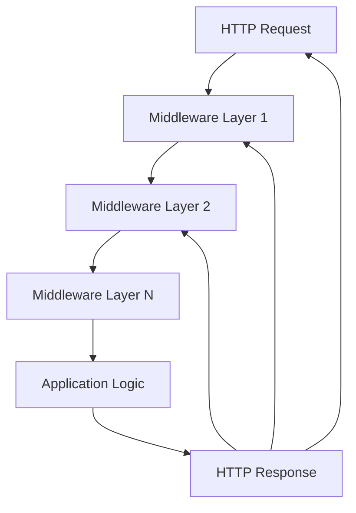
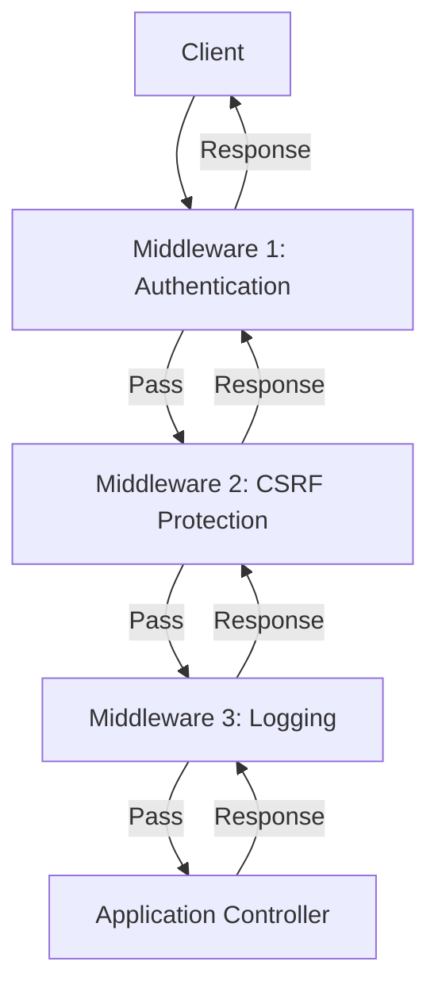
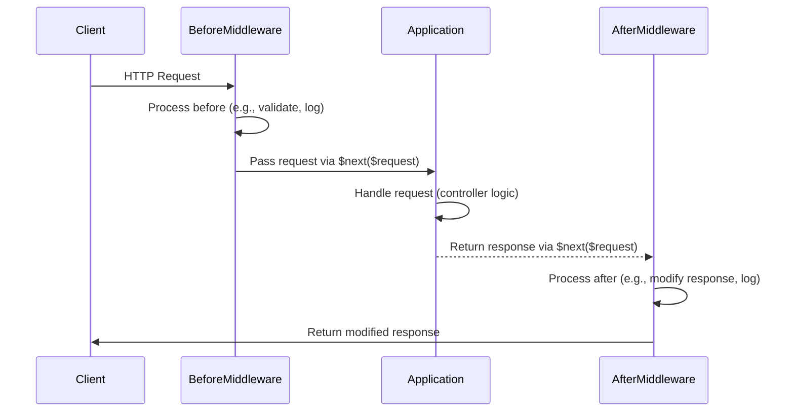
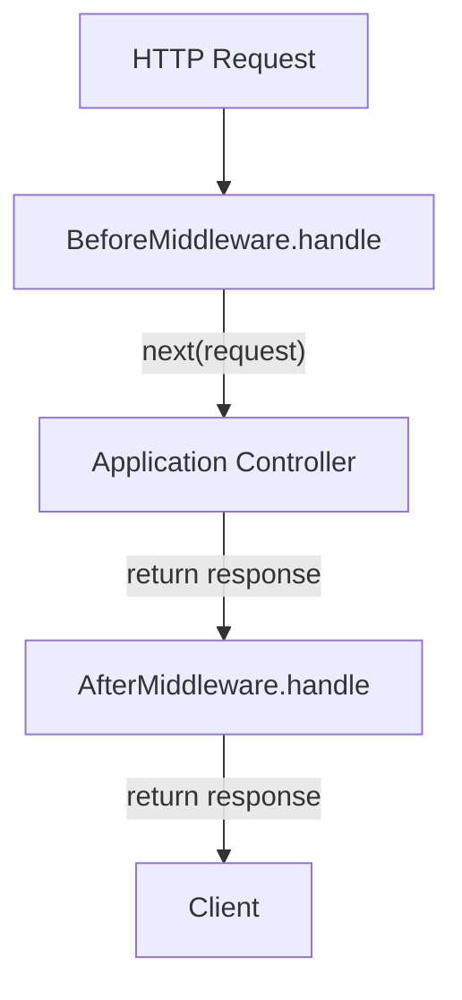
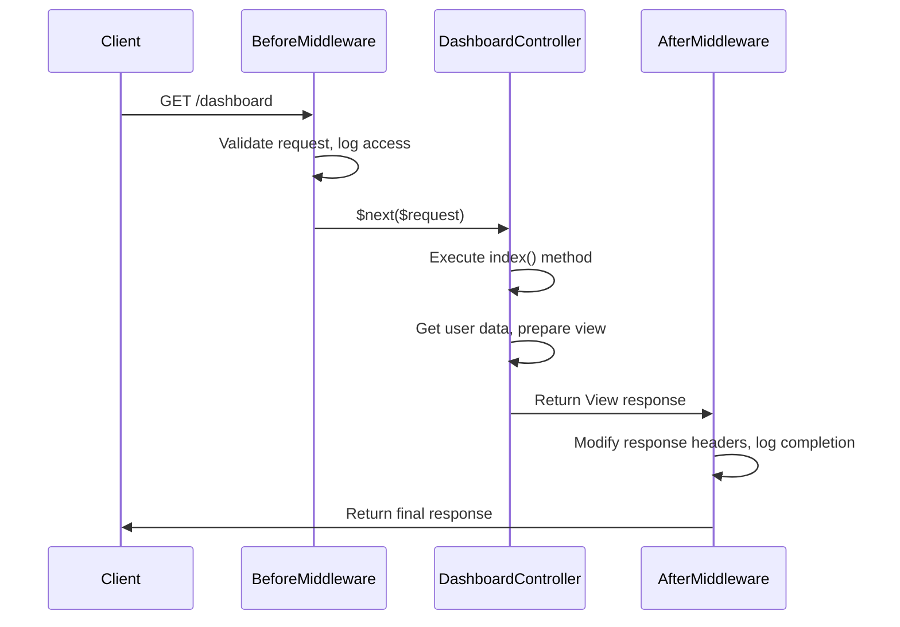
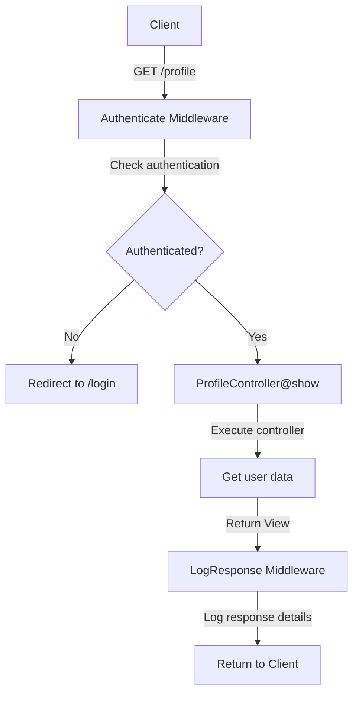
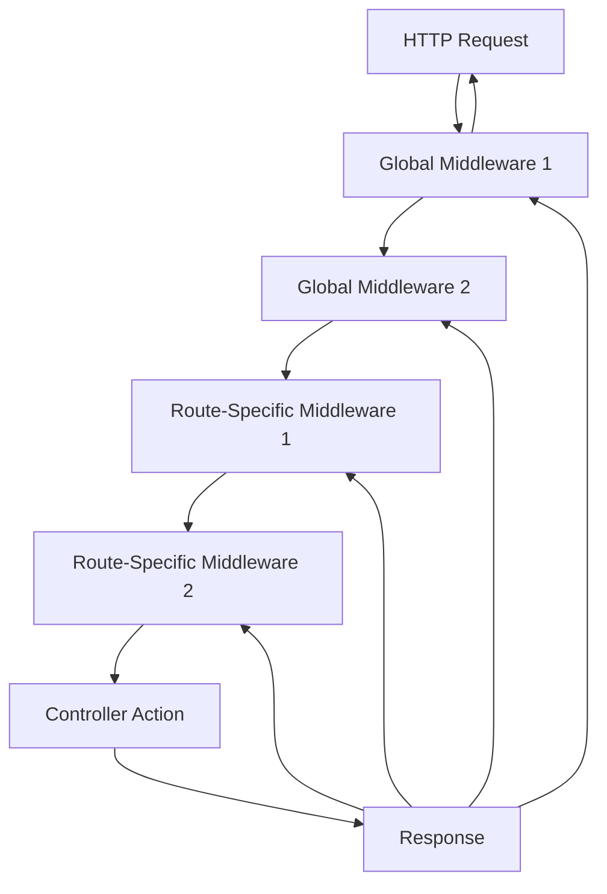
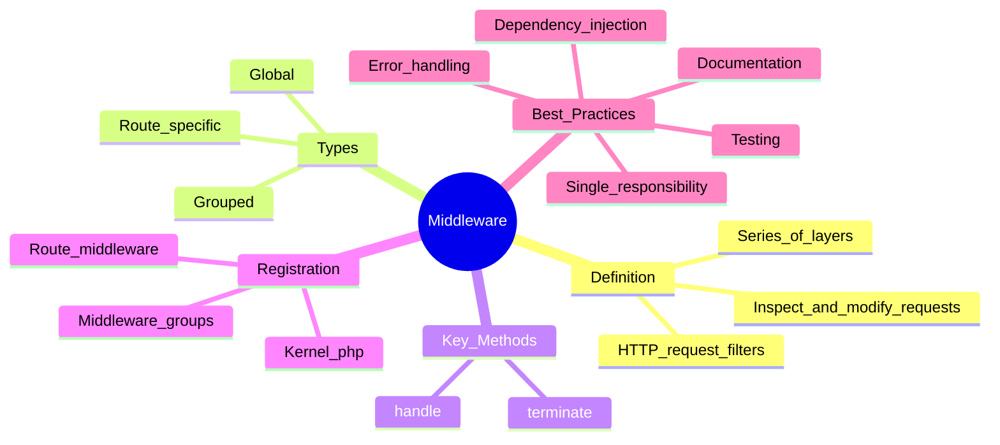

# Middleware

## Introduction

Middleware provide a convenient mechanism for inspecting and filtering HTTP requests entering your application. For example, Laravel includes a middleware that verifies the user of your application is authenticated. If the user is not authenticated, the middleware will redirect the user to your application's login screen. However, if the user is authenticated, the middleware will allow the request to proceed further into the application.

Additional middleware can be written to perform a variety of tasks besides authentication. For example, a logging middleware might log all incoming requests to your application. A variety of middleware are included in Laravel, including middleware for authentication and CSRF protection; however, all user-defined middleware are typically located in your application's `app/Http/Middleware` directory.



## Defining Middleware

To create a new middleware, use the `make:middleware` Artisan command:

```bash
php artisan make:middleware EnsureTokenIsValid
```

This command will place a new `EnsureTokenIsValid` class within your `app/Http/Middleware` directory. In this middleware, we will only allow access to the route if the supplied token input matches a specified value. Otherwise, we will redirect the users back to the `/home` URI:

**File:** `app/Http/Middleware/EnsureTokenIsValid.php`

```php
<?php

namespace App\Http\Middleware;

use Closure;
use Illuminate\Http\Request;
use Symfony\Component\HttpFoundation\Response;

class EnsureTokenIsValid
{
    /**
     * Handle an incoming request.
     *
     * @param  \Closure(\Illuminate\Http\Request): (\Symfony\Component\HttpFoundation\Response)  $next
     */
    public function handle(Request $request, Closure $next): Response
    {
        if ($request->input('token') !== 'my-secret-token') {
            return redirect('/home');
        }

        return $next($request);
    }
}
```

As you can see, if the given token does not match our secret token, the middleware will return an HTTP redirect to the client; otherwise, the request will be passed further into the application. To pass the request deeper into the application (allowing the middleware to "pass"), you should call the `$next` callback with the `$request`.

It's best to envision middleware as a series of "layers" HTTP requests must pass through before they hit your application. Each layer can examine the request and even reject it entirely.



All middleware are resolved via the service container, so you may type-hint any dependencies you need within a middleware's constructor.

## Middleware and Responses

Of course, a middleware can perform tasks before or after passing the request deeper into the application. For example, the following middleware would perform some task before the request is handled by the application:

**File:** `app/Http/Middleware/BeforeMiddleware.php`

```php
<?php

namespace App\Http\Middleware;

use Closure;
use Illuminate\Http\Request;
use Symfony\Component\HttpFoundation\Response;

class BeforeMiddleware
{
    public function handle(Request $request, Closure $next): Response
    {
        // Perform action before request is handled
        // For example: Log the request, modify request data, etc.

        return $next($request);
    }
}
```

However, this middleware would perform its task after the request is handled by the application:

**File:** `app/Http/Middleware/AfterMiddleware.php`

```php
<?php

namespace App\Http\Middleware;

use Closure;
use Illuminate\Http\Request;
use Symfony\Component\HttpFoundation\Response;

class AfterMiddleware
{
    public function handle(Request $request, Closure $next): Response
    {
        $response = $next($request);

        // Perform action after request is handled
        // For example: Modify response, add headers, log response, etc.

        return $response;
    }
}
```

### How Laravel Distinguishes Between Before and After Middleware

Laravel determines whether a middleware executes before or after the application logic by examining how the `$next` callback is used:

1. **Before Middleware**: When `$next($request)` is called immediately and its result is returned directly, the middleware executes before the application logic.

2. **After Middleware**: When the result of `$next($request)` is captured in a variable, processed, and then returned, the middleware executes after the application logic.

**Key Difference:**

```php
// Before Middleware - executes before application logic
public function handle(Request $request, Closure $next): Response
{
    // Code here runs BEFORE the application
    return $next($request); // Immediately pass to next layer
}

// After Middleware - executes after application logic
public function handle(Request $request, Closure $next): Response
{
    $response = $next($request); // First let application run
    // Code here runs AFTER the application
    return $response; // Then return modified response
}
```

### Middleware Execution Flow



### Visual Execution Order



**Color Legend:**
- Pink: Before Middleware (executes before application)
- Blue: After Middleware (executes after application)

### Practical Example with Multiple Middleware

Consider a request passing through multiple middleware layers with a controller:

**File:** `routes/web.php`

```php
use Illuminate\Support\Facades\Route;
use App\Http\Middleware\BeforeMiddleware;
use App\Http\Middleware\AfterMiddleware;
use App\Http\Controllers\DashboardController;

Route::get('/dashboard', [DashboardController::class, 'index'])
    ->middleware([
        BeforeMiddleware::class,  // Runs first - before controller
        AfterMiddleware::class,   // Runs last - after controller
    ]);
```

**File:** `app/Http/Controllers/DashboardController.php`

```php
<?php

namespace App\Http\Controllers;

use Illuminate\Http\Request;
use Illuminate\View\View;

class DashboardController extends Controller
{
    /**
     * Display the dashboard.
     */
    public function index(Request $request): View
    {
        // This is the application logic that runs AFTER BeforeMiddleware
        // and BEFORE AfterMiddleware
        
        $user = $request->user();
        $data = [
            'user' => $user,
            'stats' => $this->getUserStats($user),
        ];

        return view('dashboard', $data);
    }

    protected function getUserStats($user): array
    {
        // Business logic to get user statistics
        return [
            'posts' => 42,
            'comments' => 128,
            'likes' => 520,
        ];
    }
}
```

**Execution Flow with Controller:**



### Complete Middleware Pipeline Example

Let's look at a more complete example with authentication and logging middleware:

**File:** `app/Http/Middleware/Authenticate.php` (Before Middleware)

```php
<?php

namespace App\Http\Middleware;

use Closure;
use Illuminate\Http\Request;
use Symfony\Component\HttpFoundation\Response;

class Authenticate
{
    public function handle(Request $request, Closure $next): Response
    {
        // BEFORE: Check authentication before controller executes
        if (!$request->user()) {
            return redirect('/login');
        }

        // User is authenticated, pass to next layer (controller)
        return $next($request);
    }
}
```

**File:** `app/Http/Middleware/LogResponse.php` (After Middleware)

```php
<?php

namespace App\Http\Middleware;

use Closure;
use Illuminate\Http\Request;
use Symfony\Component\HttpFoundation\Response;
use Illuminate\Support\Facades\Log;

class LogResponse
{
    public function handle(Request $request, Closure $next): Response
    {
        // Pass request to controller first
        $response = $next($request);

        // AFTER: Log response details after controller executes
        Log::info('Response sent', [
            'route' => $request->path(),
            'method' => $request->method(),
            'status' => $response->getStatusCode(),
            'user_id' => $request->user()?->id,
        ]);

        return $response;
    }
}
```

**File:** `routes/web.php`

```php
use Illuminate\Support\Facades\Route;
use App\Http\Controllers\ProfileController;

Route::get('/profile', [ProfileController::class, 'show'])
    ->middleware([
        Authenticate::class,   // Before: Check auth first
        LogResponse::class,    // After: Log response last
    ]);
```

**File:** `app/Http/Controllers/ProfileController.php`

```php
<?php

namespace App\Http\Controllers;

use Illuminate\Http\Request;
use Illuminate\View\View;

class ProfileController extends Controller
{
    public function show(Request $request): View
    {
        // This executes AFTER Authenticate middleware
        // and BEFORE LogResponse middleware
        
        $user = $request->user();
        $profileData = $this->getProfileData($user);

        return view('profile.show', [
            'user' => $user,
            'profile' => $profileData,
        ]);
    }

    protected function getProfileData($user): array
    {
        return [
            'name' => $user->name,
            'email' => $user->email,
            'join_date' => $user->created_at->format('Y-m-d'),
            'post_count' => $user->posts()->count(),
        ];
    }
}
```

**Complete Request Flow:**



**Color Legend:**
- Pink: Before Middleware (Authenticate)
- Green: Controller Logic
- Blue: After Middleware (LogResponse)

### Middleware with Controller Constructor Injection

Middleware can also work with controllers that use dependency injection:

**File:** `app/Http/Controllers/Api/UserController.php`

```php
<?php

namespace App\Http\Controllers\Api;

use App\Services\UserService;
use Illuminate\Http\JsonResponse;
use Illuminate\Http\Request;

class UserController extends Controller
{
    protected $userService;

    public function __construct(UserService $userService)
    {
        $this->userService = $userService;
    }

    public function index(Request $request): JsonResponse
    {
        // Middleware has already executed before this point
        $users = $this->userService->getAllUsers();

        return response()->json([
            'success' => true,
            'data' => $users,
        ]);
    }
}
```

**File:** `routes/api.php`

```php
use Illuminate\Support\Facades\Route;
use App\Http\Controllers\Api\UserController;
use App\Http\Middleware\ApiAuthenticate;
use App\Http\Middleware\JsonResponseFormatter;

Route::get('/api/users', [UserController::class, 'index'])
    ->middleware([
        ApiAuthenticate::class,      // Before: API token authentication
        JsonResponseFormatter::class, // After: Format JSON response
    ]);
```

This shows how middleware integrates seamlessly with Laravel's controller system, allowing you to separate concerns while maintaining a clean architecture.

## Registering Middleware

### Global Middleware

If you want a middleware to run during every HTTP request to your application, you may append it to the global middleware stack in your application's `bootstrap/app.php` file:

**File:** `bootstrap/app.php`

```php
use App\Http\Middleware\EnsureTokenIsValid;

->withMiddleware(function (Middleware $middleware): void {
    $middleware->append(EnsureTokenIsValid::class);
})
```

The `$middleware` object provided to the `withMiddleware` closure is an instance of `Illuminate\Foundation\Configuration\Middleware` and is responsible for managing the middleware assigned to your application's routes. The `append` method adds the middleware to the end of the list of global middleware. If you would like to add a middleware to the beginning of the list, you should use the `prepend` method.

**Manually Managing Laravel's Default Global Middleware**

If you would like to manage Laravel's global middleware stack manually, you may provide Laravel's default stack of global middleware to the `use` method. Then, you may adjust the default middleware stack as necessary:

**File:** `bootstrap/app.php`

```php
->withMiddleware(function (Middleware $middleware): void {
    $middleware->use([
        \Illuminate\Foundation\Http\Middleware\InvokeDeferredCallbacks::class,
        // \Illuminate\Http\Middleware\TrustHosts::class,
        \Illuminate\Http\Middleware\TrustProxies::class,
        \Illuminate\Http\Middleware\HandleCors::class,
        \Illuminate\Foundation\Http\Middleware\PreventRequestsDuringMaintenance::class,
        \Illuminate\Http\Middleware\ValidatePostSize::class,
        \Illuminate\Foundation\Http\Middleware\TrimStrings::class,
        \Illuminate\Foundation\Http\Middleware\ConvertEmptyStringsToNull::class,
    ]);
})
```

### Assigning Middleware to Routes

If you would like to assign middleware to specific routes, you may invoke the `middleware` method when defining the route:

**File:** `routes/web.php`

```php
use App\Http\Middleware\EnsureTokenIsValid;

Route::get('/profile', function () {
    // ...
})->middleware(EnsureTokenIsValid::class);
```

You may assign multiple middleware to the route by passing an array of middleware names to the `middleware` method:

**File:** `routes/web.php`

```php
Route::get('/', function () {
    // ...
})->middleware([First::class, Second::class]);
```

### Excluding Middleware

When assigning middleware to a group of routes, you may occasionally need to prevent the middleware from being applied to an individual route within the group. You may accomplish this using the `withoutMiddleware` method:

**File:** `routes/web.php`

```php
use App\Http\Middleware\EnsureTokenIsValid;

Route::middleware([EnsureTokenIsValid::class])->group(function () {
    Route::get('/', function () {
        // ...
    });

    Route::get('/profile', function () {
        // ...
    })->withoutMiddleware([EnsureTokenIsValid::class]);
});
```

You may also exclude a given set of middleware from an entire group of route definitions:

**File:** `routes/web.php`

```php
use App\Http\Middleware\EnsureTokenIsValid;

Route::withoutMiddleware([EnsureTokenIsValid::class])->group(function () {
    Route::get('/profile', function () {
        // ...
    });
});
```

**Note:** The `withoutMiddleware` method can only remove route middleware and does not apply to global middleware.

### Middleware Groups

Sometimes you may want to group several middleware under a single key to make them easier to assign to routes. Laravel includes `web` and `api` middleware groups by default, but you can also define your own groups.

**File:** `bootstrap/app.php`

```php
->withMiddleware(function (Middleware $middleware): void {
    $middleware->group('admin', [
        \App\Http\Middleware\EnsureTokenIsValid::class,
        \App\Http\Middleware\CheckAdmin::class,
    ]);
})
```

You can assign middleware groups to routes using the same syntax as individual middleware:

**File:** `routes/web.php`

```php
Route::get('/admin/dashboard', function () {
    // Uses admin middleware group
})->middleware('admin');
```

### Route Middleware

To assign middleware to specific routes, you can chain the `middleware` method onto a route definition:

**File:** `routes/web.php`

```php
use Illuminate\Support\Facades\Route;
use App\Http\Middleware\CheckAge;

Route::get('/admin', function () {
    //
})->middleware(CheckAge::class);
```

You can also assign multiple middleware to a route:

**File:** `routes/web.php`

```php
Route::get('/', function () {
    //
})->middleware([First::class, Second::class]);
```

### Middleware Aliases

For convenience, you may assign aliases to your middleware. This allows you to reference middleware by a short name rather than the full class name.

**File:** `bootstrap/app.php`

```php
->withMiddleware(function (Middleware $middleware): void {
    $middleware->alias([
        'auth' => \App\Http\Middleware\Authenticate::class,
        'token' => \App\Http\Middleware\EnsureTokenIsValid::class,
    ]);
})
```

Once the middleware has been defined with an alias, you can use the alias when assigning middleware to a route:

**File:** `routes/web.php`

```php
Route::get('/admin', function () {
    //
})->middleware('token');
```

## Middleware Parameters

Middleware can also receive additional parameters. For example, if your application needs to verify that a user has a given "role" before performing a given action, you could create a `CheckRole` middleware that receives a role name as an additional argument.

Additional middleware parameters will be passed to the middleware after the `$next` argument:

**File:** `app/Http/Middleware/CheckRole.php`

```php
<?php

namespace App\Http\Middleware;

use Closure;
use Illuminate\Http\Request;
use Symfony\Component\HttpFoundation\Response;

class CheckRole
{
    /**
     * Handle an incoming request.
     *
     * @param  \Closure(\Illuminate\Http\Request): (\Symfony\Component\HttpFoundation\Response)  $next
     * @param  string  $role
     */
    public function handle(Request $request, Closure $next, string $role): Response
    {
        if (!$request->user()->hasRole($role)) {
            // Redirect or return error response
            return redirect('/home');
        }

        return $next($request);
    }
}
```

Middleware parameters may be specified when defining the route by separating the middleware name and parameters with a `:`. Multiple parameters should be delimited by commas:

**File:** `routes/web.php`

```php
use Illuminate\Support\Facades\Route;
use App\Http\Middleware\CheckRole;

Route::put('/post/{id}', function (string $id) {
    // The current user may update the post...
})->middleware('role:editor');

Route::put('/post/{id}', function (string $id) {
    // The current user may update the post...
})->middleware('role:editor,admin');
```

## Terminable Middleware

Sometimes a middleware may need to do some work after the HTTP response has been sent to the browser. If you define a `terminate` method on your middleware, it will automatically be called after the response is sent to the browser.

**File:** `app/Http/Middleware/TerminableMiddleware.php`

```php
<?php

namespace App\Http\Middleware;

use Closure;
use Illuminate\Http\Request;
use Symfony\Component\HttpFoundation\Response;

class TerminableMiddleware
{
    public function handle(Request $request, Closure $next): Response
    {
        return $next($request);
    }

    public function terminate(Request $request, Response $response): void
    {
        // Perform post-response tasks
        // For example: Log the final response, clean up resources, etc.
    }
}
```

The `terminate` method should receive both the request and the response. Once you have defined a terminable middleware, you should add it to the list of routes or global middleware in your HTTP kernel.

When calling the `terminate` method on your middleware, Laravel will resolve a fresh instance of the middleware from the service container. If you would like to use the same middleware instance when the `handle` and `terminate` methods are called, register the middleware with the container using the container's `singleton` method.

## Built-in Middleware

Laravel includes several middleware that you can use in your application. These are located in the `Illuminate\Http\Middleware` namespace.

### Authentication

The `auth` middleware is used to verify that the user is authenticated:

**File:** `routes/web.php`

```php
Route::get('/profile', function () {
    // Only authenticated users may access this route...
})->middleware('auth');
```

### CSRF Protection

The `VerifyCsrfToken` middleware is responsible for verifying that the CSRF token in the request matches the token stored in the session:

**File:** `app/Http/Middleware/VerifyCsrfToken.php`

```php
<?php

namespace App\Http\Middleware;

use Illuminate\Foundation\Http\Middleware\VerifyCsrfToken as Middleware;

class VerifyCsrfToken extends Middleware
{
    /**
     * The URIs that should be excluded from CSRF verification.
     *
     * @var array<int, string>
     */
    protected $except = [
        'stripe/*',
        'http://example.com/foo/bar',
        'http://example.com/foo/*',
    ];
}
```

### Maintenance Mode

The `PreventRequestsDuringMaintenance` middleware will display the maintenance mode page when your application is in maintenance mode:

```php
php artisan down
```

### Trim Strings

The `TrimStrings` middleware automatically trims all incoming string fields on the request:

**File:** `app/Http/Middleware/TrimStrings.php`

```php
<?php

namespace App\Http\Middleware;

use Illuminate\Foundation\Http\Middleware\TrimStrings as Middleware;

class TrimStrings extends Middleware
{
    /**
     * The names of the attributes that should not be trimmed.
     *
     * @var array<int, string>
     */
    protected $except = [
        'password',
        'password_confirmation',
    ];
}
```

### Convert Empty Strings to Null

The `ConvertEmptyStringsToNull` middleware converts empty string fields to `null`:

**File:** `app/Http/Middleware/ConvertEmptyStringsToNull.php`

```php
<?php

namespace App\Http\Middleware;

use Illuminate\Foundation\Http\Middleware\ConvertEmptyStringsToNull as Middleware;

class ConvertEmptyStringsToNull extends Middleware
{
    /**
     * The names of the attributes that should not be converted to null.
     *
     * @var array<int, string>
     */
    protected $except = [
        'password',
    ];
}
```

## Visualization of Middleware Flow



## Best Practices

1. **Keep middleware focused**: Each middleware should have a single responsibility.
2. **Use dependency injection**: Type-hint dependencies in the middleware constructor.
3. **Handle errors gracefully**: Return appropriate responses when middleware conditions fail.
4. **Document your middleware**: Clearly document what each middleware does and its parameters.
5. **Test your middleware**: Write tests to ensure your middleware behaves as expected.

## Common Use Cases

### Authentication Check

```php
<?php

namespace App\Http\Middleware;

use Closure;
use Illuminate\Http\Request;
use Symfony\Component\HttpFoundation\Response;

class Authenticate
{
    public function handle(Request $request, Closure $next): Response
    {
        if (!$request->user()) {
            return redirect('/login');
        }

        return $next($request);
    }
}
```

### Role-Based Access Control

```php
<?php

namespace App\Http\Middleware;

use Closure;
use Illuminate\Http\Request;
use Symfony\Component\HttpFoundation\Response;

class CheckAdmin
{
    public function handle(Request $request, Closure $next): Response
    {
        if (!$request->user() || !$request->user()->isAdmin()) {
            abort(403, 'Unauthorized action.');
        }

        return $next($request);
    }
}
```

### Request Logging

```php
<?php

namespace App\Http\Middleware;

use Closure;
use Illuminate\Http\Request;
use Symfony\Component\HttpFoundation\Response;
use Illuminate\Support\Facades\Log;

class LogRequests
{
    public function handle(Request $request, Closure $next): Response
    {
        Log::info('Request received', [
            'method' => $request->method(),
            'uri' => $request->getRequestUri(),
            'ip' => $request->ip(),
        ]);

        $response = $next($request);

        Log::info('Response sent', [
            'status' => $response->getStatusCode(),
        ]);

        return $response;
    }
}
```

## Conclusion

Middleware provide a powerful way to filter HTTP requests entering your application. By understanding how to create, register, and use middleware, you can add layers of functionality to your Laravel application in a clean and organized way. Whether you need to handle authentication, logging, or any other cross-cutting concern, middleware offer a flexible solution that keeps your application logic focused and maintainable.

