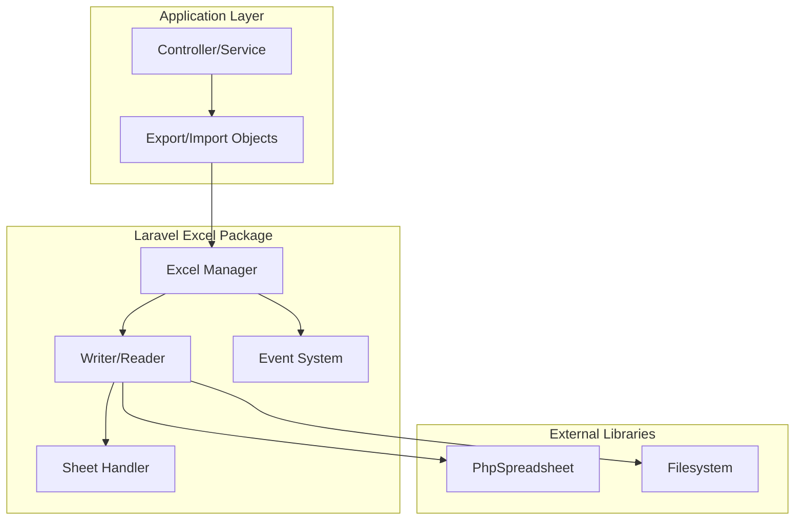
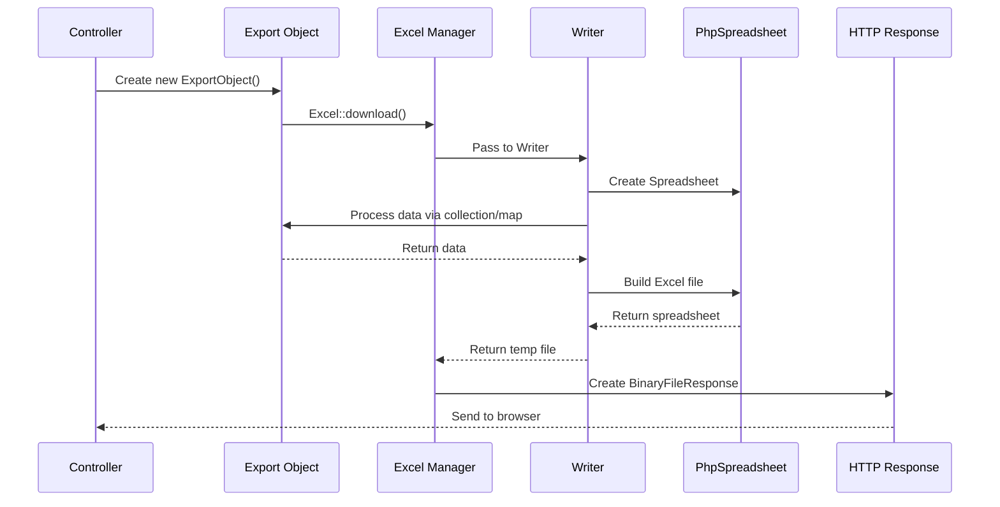
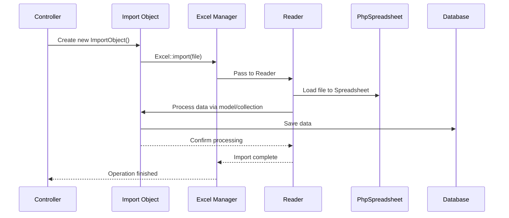

# Laravel Excel Architecture Guide

## File Path: laravel-8.x/excel/architecture.md

---

## Table of Contents
- [Introduction](#introduction)
- [Technical Definitions](#technical-definitions)
- [Architecture Visualization](#architecture-visualization)
- [Lifecycle Overview](#lifecycle-overview)
- [Import & Export Objects](#import--export-objects)
- [Concerns](#concerns)
- [Best Practices](#best-practices)

---

## Introduction

Laravel Excel provides supercharged Excel exports and imports in Laravel applications. The architecture is built around three core concepts: lifecycle management, import/export objects, and concerns. Understanding this architecture helps developers leverage the full potential of the package while maintaining clean, maintainable code.

The Laravel Excel architecture follows object-oriented principles and dependency injection patterns, making it flexible and extensible for various use cases.

---

## Technical Definitions

### Export Object
An **Export Object** is a Plain Old PHP Object (POPO) that encapsulates the entire export logic. It both configures and handles the export process, transferring data from your Laravel application to an Excel file. Export objects can accept data via constructors, setters, or other methods, and implement various concerns to customize behavior.

### Import Object  
An **Import Object** is a POPO that encapsulates the entire import logic. It handles reading data from Excel files and processing it according to your business requirements. Import objects can store data to databases, transform it, validate it, or perform any other operations needed.

### Concerns
**Concerns** are interfaces that define contracts for export/import objects. They allow you to configure and customize the behavior of the Excel operations. Concerns can be either method contracts (requiring specific methods) or marker interfaces (indicating behavior without requiring methods).

### Lifecycle Manager
The **Lifecycle Manager** refers to the internal components (`Excel`, `Writer`, `Reader`, `Sheet`) that handle the processing of export/import operations from start to finish, managing the interaction between your objects and the underlying PhpSpreadsheet library.

---

## Architecture Visualization



### Export Process Flow



### Import Process Flow



---

## Lifecycle Overview

### Export Lifecycle

#### 1. Export Object Creation
Everything starts with the `Export` object. This object encapsulates your entire export logic, configuring and handling the export process.

**Example:**
```php
// File Path: app/Exports/UsersExport.php
<?php

namespace App\Exports;

use App\User;
use Maatwebsite\Excel\Concerns\FromCollection;

class UsersExport implements FromCollection
{
    public function collection()
    {
        return User::all();
    }
}
```

#### 2. Passing on the Export Object
The Export object is passed to the Laravel Excel package through the main entry point, the `Maatwebsite\Excel\Excel` class. There are several ways to achieve this:

##### Facade
The easiest approach uses the `Maatwebsite\Excel\Facades\Excel` facade:
```php
return Excel::download(new UsersExport, 'users.xlsx');
```

##### Dependency Injection
Inject the `Maatwebsite\Excel\Excel` manager class:
```php
// File Path: app/Http/Controllers/ExportController.php
<?php
use App\Exports\UsersExport;
use Maatwebsite\Excel\Excel;

class ExportController
{
    private $excel;

    public function __construct(Excel $excel)
    {
        $this->excel = $excel;
    }
    
    public function exportViaConstructorInjection()
    {
        return $this->excel->download(new UsersExport, 'users.xlsx');
    }
    
    public function exportViaMethodInjection(Excel $excel)
    {
        return $excel->download(new UsersExport, 'users.xlsx');
    }
}
```

##### Contract Interface
Use the `Maatwebsite\Excel\Exporter` interface for better testability:
```php
// File Path: app/Http/Controllers/ExportsController.php
use App\Exports\UsersExport;
use Maatwebsite\Excel\Exporter;

class ExportsController
{
    private $exporter;

    public function __construct(Exporter $exporter)
    {
        $this->exporter = $exporter;
    }
    
    public function export()
    {
        return $this->exporter->download(new UsersExport, 'users.xlsx');
    }
}
```

##### Exportable Trait
Use the `Maatwebsite\Excel\Concerns\Exportable` trait for convenience:
```php
// File Path: app/Exports/UsersExport.php
namespace App\Exports;

use App\User;
use Maatwebsite\Excel\Concerns\FromCollection;
use Maatwebsite\Excel\Concerns\Exportable;

class UsersExport implements FromCollection
{
    use Exportable;

    public function collection()
    {
        return User::all();
    }
}

// Usage:
return (new UsersExport)->download('users.xlsx');
```

#### 3. Handling the Export Object
Once passed to the Excel manager, the process continues with:

##### Writer Type Detection
The system determines the export format based on file extension or explicit writer type, using the mapping in `excel.php` config under `extension_detector`.

##### Starting the Writing Process
The `Excel` manager delegates to the `Maatwebsite\Excel\Writer`, which registers event listeners and creates a `PhpOffice\PhpSpreadsheet\Spreadsheet` instance. The `BeforeExport` event is raised here.

##### Multiple Sheets Handling
The system checks for the `Maatwebsite\Excel\Concerns\WithMultipleSheets` concern and delegates sheet processing to the `Maatwebsite\Excel\Sheet` class.

##### Sheet Processing
The `Sheet` class creates worksheet instances and processes data based on the export type:
- `FromView`: Converts Blade view HTML to Excel cells
- `FromQuery`: Chunks query results to reduce memory usage
- `FromCollection`/`FromArray`: Directly appends data to sheet

#### 4. Passing to PhpSpreadsheet
After sheet processing, the writing process begins with the `BeforeWriting` event, creating a PhpSpreadsheet writer and saving to a temporary file.

#### 5. Creating a Response
The system either creates a download response or stores the file to disk using Laravel's Filesystem.

### Import Lifecycle

#### 1. Import Object Creation
Similar to exports, everything starts with the `Import` object:
```php
// File Path: app/Imports/UsersImport.php
namespace App\Imports;

use App\User;
use Illuminate\Support\Collection;
use Maatwebsite\Excel\Concerns\ToCollection;

class UsersImport implements ToCollection
{
    public function collection(Collection $rows)
    {
        foreach ($rows as $row)
        {
            User::create([
                'name' => $row[0],
            ]);
        }
    }
}
```

#### 2. Passing on the Import Object
The import object follows similar passing mechanisms as exports, including facade, dependency injection, contracts, and the importable trait.

#### 3. Handling the Import Object
The process includes reader type detection, creating a `Reader` instance, loading the file into a `Spreadsheet`, and processing sheets based on the import type:
- `ToModel`: Persists models via Eloquent
- `ToCollection`/`ToArray`: Processes entire datasets

---

## Import & Export Objects

The entire Laravel Excel philosophy revolves around having `Export` and/or `Import` objects.

### Directory Structure
Organize your import/export classes in dedicated directories:
```
.
├── app
│   ├── Exports (Groups all exports in your app)
│   │   ├── UsersExport.php
│   │   ├── ProductsExport.php
│   │   └── Sheets (You can group sheets together)
│   │       ├── InactiveUsersSheet.php
│   │       └── ActiveUsersSheet.php
│   │
│   ├── Imports (Groups all imports in your app)
│   │   ├── UsersImport.php
│   │   ├── ProductsImport.php
│   │   └── Sheets (You can group sheets together)
│   │       ├── OutOfStockProductsSheet.php
│   │       └── ProductsOnSaleSheet.php
│   
└── composer.json
```

### Encapsulation
These objects encapsulate the entire export or import process, keeping all logic within the object. This makes them reusable across controllers, services, jobs, event listeners, or commands.

### Data Transfer Objects (DTOs)
Import/export objects function as DTOs, transferring information between your application and the Excel writer/reader. They carry not just the data to export/import, but also styling, worksheet names, cell formats, and other metadata.

### Plain Old PHP Objects (POPOs)
Beyond being DTOs, these objects are standard PHP objects supporting:

#### Constructor Injection
```php
// File Path: app/Exports/UsersExport.php
class UsersExport implements FromCollection {
    private $year;

    public function __construct(int $year)
    {
        $this->year = $year;
    }
    
    public function collection()
    {
        return Users::whereYear('created_at', $this->year)->get();
    }
}

// Usage:
Excel::download(new UsersExport(2019), 'users.xlsx');
```

#### Setters
```php
// File Path: app/Exports/UsersExport.php
class UsersExport implements FromCollection {
    private $year;

    public function setYear(int $year)
    {
        $this->year = $year;
    }
    
    public function collection()
    {
        return Users::whereYear('created_at', $this->year)->get();
    }
}

// Usage:
$export = new UsersExport();
$export->setYear(2019);
Excel::download($export, 'users.xlsx');
```

#### Getters
```php
// File Path: app/Imports/UsersImport.php
namespace App\Imports;

use App\User;
use Maatwebsite\Excel\Concerns\ToModel;

class UsersImport implements ToModel
{
    private $rows = 0;

    public function model(array $row)
    {
        ++$this->rows;

        return new User([
            'name' => $row[0],
        ]);
    }
    
    public function getRowCount(): int
    {
        return $this->rows;
    }
}

// Usage:
$import = new UsersImport;
Excel::import($import, 'users.xlsx');
echo 'Row count: ' . $import->getRowCount();
```

### Hooks (Events)
For complex scenarios, you can hook into the read/write process using events by implementing the `Maatwebsite\Excel\Concerns\WithEvents` concern:

```php
// File Path: app/Exports/UsersExport.php
namespace App\Exports;

use Maatwebsite\Excel\Concerns\WithEvents;
use Maatwebsite\Excel\Events\BeforeExport;

class UsersExport implements WithEvents
{
    /**
     * @return array
     */
    public function registerEvents(): array
    {
        return [
            // Handle by a closure.
            BeforeExport::class => function(BeforeExport $event) {
                // Do something before the export process starts.
            },
        ];
    }
}
```

---

## Concerns

Most export/import configuration is done using **Concerns**, which are simple interfaces that establish contracts.

### Method Contracts
Some concerns require specific methods to be implemented. For example, `FromCollection` requires a `collection` method:

```php
// File Path: app/Exports/UsersExport.php
namespace App\Exports;

use App\User;
use Maatwebsite\Excel\Concerns\FromCollection;

class UsersExport implements FromCollection
{
    public function collection()
    {
        return User::all();
    }
}
```

### Marker Interfaces (Pointer Interfaces)
Other concerns don't require methods but serve as indicators. For example, `ShouldAutoSize` tells the system to auto-size columns:

```php
// File Path: app/Exports/UsersExport.php
namespace App\Exports;

use App\User;
use Maatwebsite\Excel\Concerns\ShouldAutoSize;

class UsersExport implements ShouldAutoSize
{
    // No methods required - just indicates behavior
}
```

### Common Concerns

| Concern | Purpose | Type |
|---------|---------|------|
| `FromCollection` | Export data from a Laravel Collection | Method Contract |
| `FromQuery` | Export data from a database query | Method Contract |
| `FromView` | Export data from a Blade view | Method Contract |
| `ToModel` | Import rows as Eloquent models | Method Contract |
| `ToCollection` | Import data to a Collection | Method Contract |
| `ShouldAutoSize` | Auto-size column widths | Marker Interface |
| `WithHeadings` | Add headings to exported data | Marker Interface |
| `WithMapping` | Transform data before export | Method Contract |
| `WithEvents` | Register event handlers | Method Contract |

---

## Best Practices

1. **Organize Objects**: Group export and import classes in dedicated directories (`app/Exports` and `app/Imports`)

2. **Use Descriptive Names**: Name your export/import classes descriptively (e.g., `ActiveUsersExport`, `ProductInventoryImport`)

3. **Implement Relevant Concerns**: Use appropriate concerns to customize behavior rather than duplicating functionality

4. **Handle Large Datasets**: Use `FromQuery` with chunking for large datasets to manage memory consumption

5. **Validate Input**: When importing, validate data before persisting to prevent database errors

6. **Use Events**: Implement events for complex pre/post-processing operations

7. **Test Thoroughly**: Test both successful and error scenarios for your export/import operations

8. **Consider Performance**: For large exports, consider using queued jobs to prevent timeouts