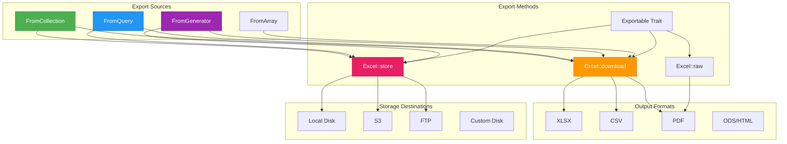
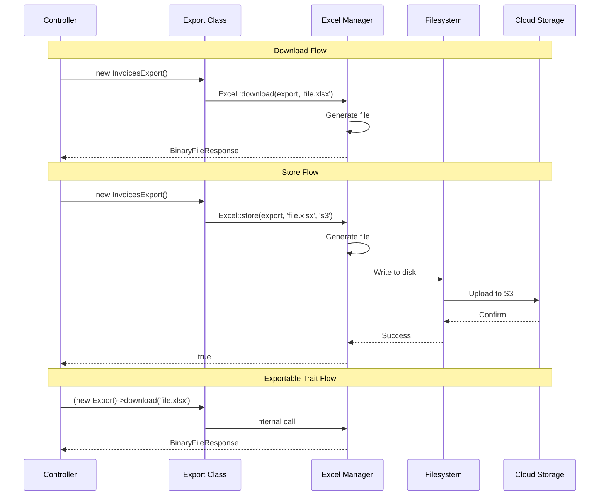
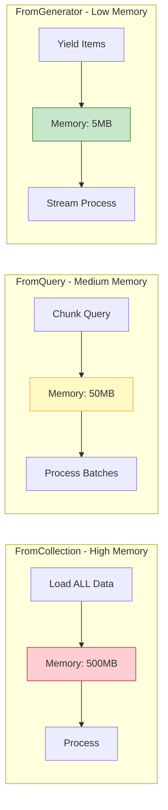
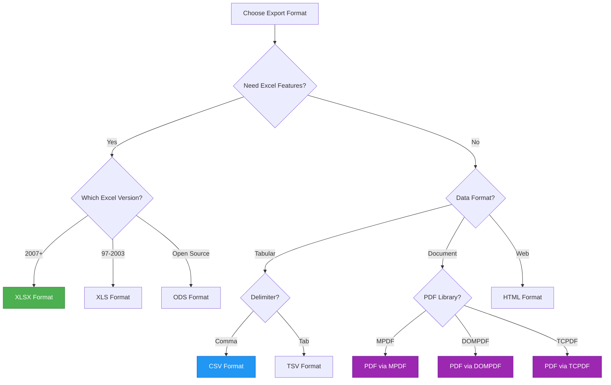
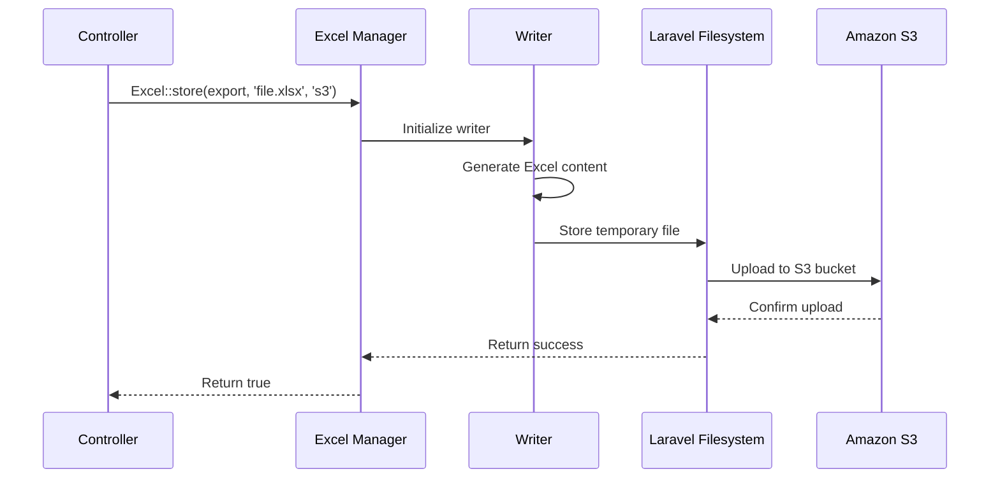
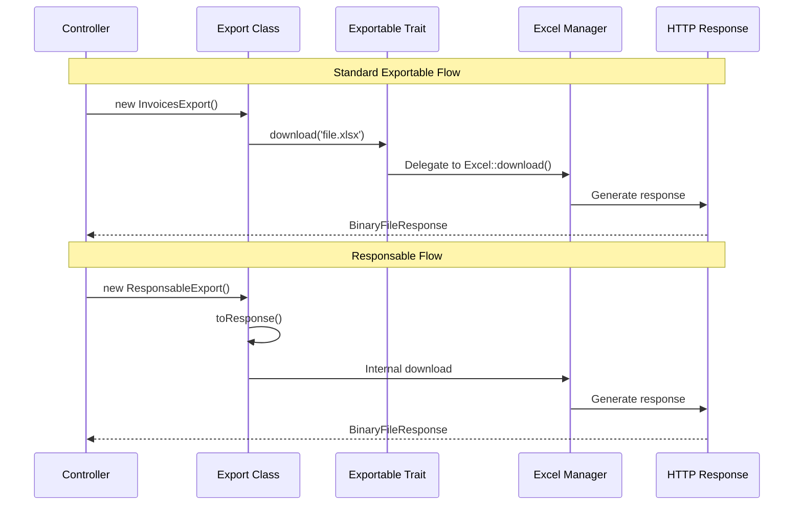
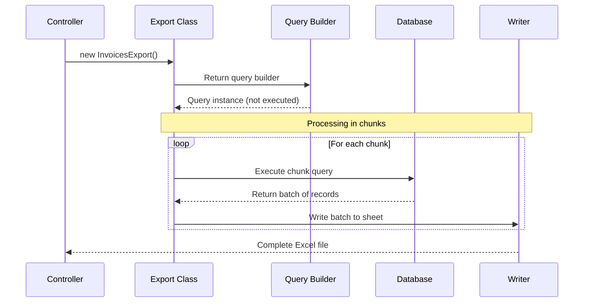
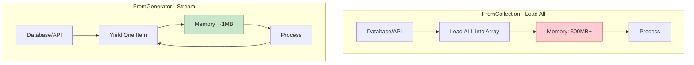
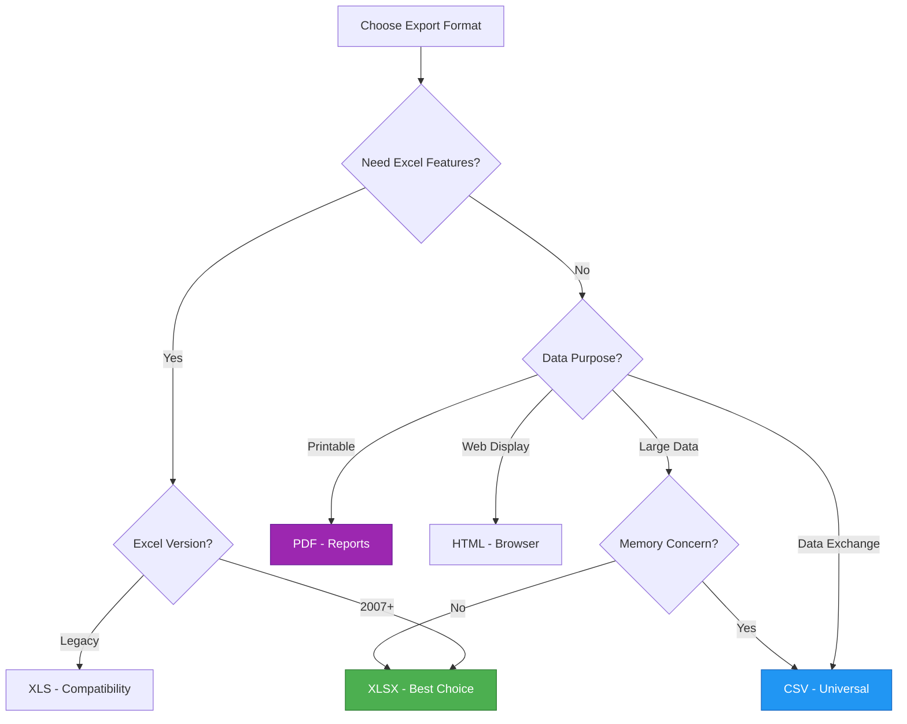

# Advanced Export Methods | Laravel Excel

## File Path: laravel-8.x/excel/3-advanced-exports.md

---

## Table of Contents
- [Introduction](#introduction)
- [Technical Definitions](#technical-definitions)
- [Architecture Visualization](#architecture-visualization)
- [Storing Exports on Disk](#storing-exports-on-disk)
- [Export Formats](#export-formats)
- [Exportables Trait](#exportables-trait)
- [Query-Based Exports](#query-based-exports)
- [Generator-Based Exports](#generator-based-exports)
- [Best Practices](#best-practices)

---

## Introduction

Advanced export methods in Laravel Excel provide powerful techniques for handling various export scenarios. From storing files on different filesystems to exporting large datasets efficiently using queries and generators, these methods give you the flexibility to handle any export requirement.

This guide covers five essential advanced export topics:
- **Storing exports** on Laravel's filesystem disks
- **Multiple export formats** including XLSX, CSV, PDF, and more
- **Exportables trait** for cleaner, more expressive code
- **Query-based exports** for memory-efficient large dataset handling
- **Generator-based exports** for streaming data without memory overhead

---

## Technical Definitions

### Excel::store()
The **store()** method persists exported Excel files to Laravel's filesystem disks (local, S3, FTP, etc.) instead of returning a download response. It supports custom disk options like visibility settings and is ideal for background processing and scheduled exports.

### Export Formats
**Export Formats** refer to the various file types Laravel Excel can generate, including XLSX (Excel 2007+), XLS (Excel 97-2003), CSV (Comma-Separated Values), TSV (Tab-Separated Values), ODS (OpenDocument Spreadsheet), HTML, and PDF (via MPDF, DOMPDF, or TCPDF).

### Exportable Trait
The **Exportable** trait (`Maatwebsite\Excel\Concerns\Exportable`) adds convenient methods to export classes, allowing them to self-dispatch downloads and storage operations without using the Excel facade. It provides `download()`, `store()`, and `raw()` methods directly on the export class.

### Responsable Interface
The **Responsable** interface (`Illuminate\Contracts\Support\Responsable`) is a Laravel contract that transforms objects into HTTP responses. When implemented in export classes, it enables returning the export instance directly from controllers.

### FromQuery Concern
The **FromQuery** concern enables memory-efficient exports by executing database queries in chunks. Instead of loading all data into memory, it processes the query iteratively, making it ideal for large datasets.

### FromGenerator Concern
The **FromGenerator** concern allows exports from PHP generators, enabling lazy evaluation of data. Generators yield values one at a time, significantly reducing memory consumption for large or streaming data sources.

### Query Chunking
**Query Chunking** is a technique where large database queries are split into smaller batches, processed sequentially to prevent memory exhaustion. Laravel Excel automatically chunks queries when using the `FromQuery` concern.

---

## Architecture Visualization

### Export Methods Overview



### Export Flow Comparison



### Memory Usage Comparison



### Export Formats Decision Tree



---

## Storing Exports on Disk

### Overview

Instead of downloading exports, you can store them on any Laravel filesystem disk. This is useful for:
- Scheduled report generation
- Background export processing
- Sharing files via cloud storage
- Archiving exports

### Default Disk Storage

```php
// File Path: app/Http/Controllers/ExportController.php
<?php

namespace App\Http\Controllers;

use App\Exports\InvoicesExport;
use Maatwebsite\Excel\Facades\Excel;

class ExportController extends Controller
{
    /**
     * Store export on the default disk.
     * 
     * @return bool
     */
    public function storeOnDefaultDisk()
    {
        // Stores to the default disk configured in config/filesystems.php
        Excel::store(new InvoicesExport(2018), 'invoices.xlsx');
        
        return response()->json(['message' => 'Export stored successfully']);
    }
}
```

### Custom Disk Storage

```php
// File Path: app/Http/Controllers/ExportController.php
<?php

namespace App\Http\Controllers;

use App\Exports\InvoicesExport;
use Maatwebsite\Excel\Facades\Excel;
use Maatwebsite\Excel\Excel as ExcelConstants;

class ExportController extends Controller
{
    /**
     * Store export on custom disks.
     * 
     * @return \Illuminate\Http\JsonResponse
     */
    public function storeOnCustomDisk()
    {
        // Store on S3 disk
        Excel::store(new InvoicesExport(2018), 'invoices.xlsx', 's3');
        
        // Store on S3 with explicit writer type
        Excel::store(
            new InvoicesExport(2018),
            'invoices.xlsx',
            's3',
            ExcelConstants::XLSX
        );
        
        // Store on local disk
        Excel::store(new InvoicesExport(2018), 'invoices.xlsx', 'local');
        
        return response()->json(['message' => 'Exports stored successfully']);
    }
}
```

### Disk Options and Visibility

```php
// File Path: app/Http/Controllers/ExportController.php
<?php

namespace App\Http\Controllers;

use App\Exports\InvoicesExport;
use Maatwebsite\Excel\Facades\Excel;

class ExportController extends Controller
{
    /**
     * Store with custom disk options.
     * 
     * @return \Illuminate\Http\JsonResponse
     */
    public function storeWithOptions()
    {
        // Store with custom visibility options
        Excel::store(
            new InvoicesExport(2018),
            'invoices.xlsx',
            's3',
            null,
            [
                'visibility' => 'private',
            ]
        );
        
        // Laravel shortcut for private files
        Excel::store(
            new InvoicesExport(2018),
            'invoices.xlsx',
            's3',
            null,
            'private'
        );
        
        return response()->json(['message' => 'Private export stored']);
    }
}
```

### Storage Flow Visualization



### File Naming Restrictions

When naming files, avoid these characters:
- `<` (less than)
- `>` (greater than)
- `:` (colon)
- `"` (double quote)
- `/` (forward slash)
- `\` (backslash)
- `|` (vertical bar or pipe)
- `?` (question mark)
- `*` (asterisk)

---

## Export Formats

### Supported Formats Overview

Laravel Excel supports multiple export formats. The format is automatically detected from the file extension, or you can explicitly specify it.

```php
// File Path: config/excel.php
// Extension detector mapping
'extension_detector' => [
    'xlsx' => Excel::XLSX,
    'xlsm' => Excel::XLSX,
    'xltx' => Excel::XLSX,
    'xltm' => Excel::XLSX,
    'xls'  => Excel::XLS,
    'xlt'  => Excel::XLS,
    'ods'  => Excel::ODS,
    'ots'  => Excel::ODS,
    'slk'  => Excel::SLK,
    'xml'  => Excel::XML,
    'gnumeric' => Excel::GNUMERIC,
    'htm'  => Excel::HTML,
    'html' => Excel::HTML,
    'csv'  => Excel::CSV,
    'tsv'  => Excel::TSV,
    'pdf'  => Excel::DOMPDF,
],
```

### XLSX Format (Excel 2007+)

```php
// File Path: app/Http/Controllers/ExportController.php
<?php

namespace App\Http\Controllers;

use App\Exports\InvoicesExport;
use Maatwebsite\Excel\Facades\Excel;
use Maatwebsite\Excel\Excel as ExcelConstants;

class ExportController extends Controller
{
    /**
     * Export as XLSX format.
     * 
     * @return \Symfony\Component\HttpFoundation\BinaryFileResponse
     */
    public function exportXlsx()
    {
        // Automatic format detection from extension
        return Excel::download(new InvoicesExport, 'invoices.xlsx');
        
        // Explicit format specification
        return Excel::download(
            new InvoicesExport,
            'invoices.xlsx',
            ExcelConstants::XLSX
        );
    }
}
```

### CSV Format

```php
// File Path: app/Http/Controllers/ExportController.php
<?php

namespace App\Http\Controllers;

use App\Exports\InvoicesExport;
use Maatwebsite\Excel\Facades\Excel;
use Maatwebsite\Excel\Excel as ExcelConstants;

class ExportController extends Controller
{
    /**
     * Export as CSV format.
     * 
     * @return \Symfony\Component\HttpFoundation\BinaryFileResponse
     */
    public function exportCsv()
    {
        // Basic CSV export
        return Excel::download(
            new InvoicesExport,
            'invoices.csv',
            ExcelConstants::CSV
        );
    }
    
    /**
     * Export CSV with custom Content-Type.
     * 
     * @return \Symfony\Component\HttpFoundation\BinaryFileResponse
     */
    public function exportCsvWithHeaders()
    {
        // CSV with custom Content-Type header
        return Excel::download(
            new InvoicesExport,
            'invoices.csv',
            ExcelConstants::CSV,
            [
                'Content-Type' => 'text/csv',
            ]
        );
    }
}
```

### TSV Format (Tab-Separated)

```php
// File Path: app/Http/Controllers/ExportController.php
<?php

namespace App\Http\Controllers;

use App\Exports\InvoicesExport;
use Maatwebsite\Excel\Facades\Excel;
use Maatwebsite\Excel\Excel as ExcelConstants;

class ExportController extends Controller
{
    /**
     * Export as TSV format.
     * 
     * @return \Symfony\Component\HttpFoundation\BinaryFileResponse
     */
    public function exportTsv()
    {
        return Excel::download(
            new InvoicesExport,
            'invoices.tsv',
            ExcelConstants::TSV
        );
    }
}
```

### ODS Format (OpenDocument Spreadsheet)

```php
// File Path: app/Http/Controllers/ExportController.php
<?php

namespace App\Http\Controllers;

use App\Exports\InvoicesExport;
use Maatwebsite\Excel\Facades\Excel;
use Maatwebsite\Excel\Excel as ExcelConstants;

class ExportController extends Controller
{
    /**
     * Export as ODS format (LibreOffice/OpenOffice).
     * 
     * @return \Symfony\Component\HttpFoundation\BinaryFileResponse
     */
    public function exportOds()
    {
        return Excel::download(
            new InvoicesExport,
            'invoices.ods',
            ExcelConstants::ODS
        );
    }
}
```

### XLS Format (Excel 97-2003)

```php
// File Path: app/Http/Controllers/ExportController.php
<?php

namespace App\Http\Controllers;

use App\Exports\InvoicesExport;
use Maatwebsite\Excel\Facades\Excel;
use Maatwebsite\Excel\Excel as ExcelConstants;

class ExportController extends Controller
{
    /**
     * Export as XLS format (legacy Excel).
     * 
     * @return \Symfony\Component\HttpFoundation\BinaryFileResponse
     */
    public function exportXls()
    {
        return Excel::download(
            new InvoicesExport,
            'invoices.xls',
            ExcelConstants::XLS
        );
    }
}
```

### HTML Format

```php
// File Path: app/Http/Controllers/ExportController.php
<?php

namespace App\Http\Controllers;

use App\Exports\InvoicesExport;
use Maatwebsite\Excel\Facades\Excel;
use Maatwebsite\Excel\Excel as ExcelConstants;

class ExportController extends Controller
{
    /**
     * Export as HTML format.
     * 
     * @return \Symfony\Component\HttpFoundation\BinaryFileResponse
     */
    public function exportHtml()
    {
        return Excel::download(
            new InvoicesExport,
            'invoices.html',
            ExcelConstants::HTML
        );
    }
}
```

### PDF Formats

For PDF exports, you need to install a PDF rendering library. Refer to [PhpSpreadsheet Documentation](https://phpspreadsheet.readthedocs.io/en/latest/topics/reading-and-writing-to-file/#pdf) for installation instructions.

```php
// File Path: app/Http/Controllers/ExportController.php
<?php

namespace App\Http\Controllers;

use App\Exports\InvoicesExport;
use Maatwebsite\Excel\Facades\Excel;
use Maatwebsite\Excel\Excel as ExcelConstants;

class ExportController extends Controller
{
    /**
     * Export as PDF using MPDF.
     * 
     * @return \Symfony\Component\HttpFoundation\BinaryFileResponse
     */
    public function exportPdfMpdf()
    {
        return Excel::download(
            new InvoicesExport,
            'invoices.pdf',
            ExcelConstants::MPDF
        );
    }
    
    /**
     * Export as PDF using DOMPDF.
     * 
     * @return \Symfony\Component\HttpFoundation\BinaryFileResponse
     */
    public function exportPdfDompdf()
    {
        return Excel::download(
            new InvoicesExport,
            'invoices.pdf',
            ExcelConstants::DOMPDF
        );
    }
    
    /**
     * Export as PDF using TCPDF.
     * 
     * @return \Symfony\Component\HttpFoundation\BinaryFileResponse
     */
    public function exportPdfTcpdf()
    {
        return Excel::download(
            new InvoicesExport,
            'invoices.pdf',
            ExcelConstants::TCPDF
        );
    }
}
```

### Format Comparison Table

| Format | Extension | Writer Type | Best For |
|--------|-----------|-------------|----------|
| XLSX | `.xlsx` | `Excel::XLSX` | Modern Excel, full features |
| XLS | `.xls` | `Excel::XLS` | Legacy Excel compatibility |
| CSV | `.csv` | `Excel::CSV` | Data exchange, simple exports |
| TSV | `.tsv` | `Excel::TSV` | Tab-delimited data |
| ODS | `.ods` | `Excel::ODS` | LibreOffice/OpenOffice |
| HTML | `.html` | `Excel::HTML` | Web display |
| PDF | `.pdf` | `Excel::MPDF/DOMPDF/TCPDF` | Printable reports |

---

## Exportables Trait

### Overview

The `Exportable` trait provides a cleaner, more expressive way to handle exports by adding methods directly to your export class.

### Basic Exportable Usage

```php
// File Path: app/Exports/InvoicesExport.php
<?php

namespace App\Exports;

use App\Invoice;
use Maatwebsite\Excel\Concerns\FromCollection;
use Maatwebsite\Excel\Concerns\Exportable;

class InvoicesExport implements FromCollection
{
    use Exportable;

    /**
     * @return \Illuminate\Support\Collection
     */
    public function collection()
    {
        return Invoice::all();
    }
}
```

```php
// File Path: app/Http/Controllers/ExportController.php
<?php

namespace App\Http\Controllers;

use App\Exports\InvoicesExport;

class ExportController extends Controller
{
    /**
     * Download using Exportable trait.
     * 
     * @return \Symfony\Component\HttpFoundation\BinaryFileResponse
     */
    public function export()
    {
        // No need for Excel facade!
        return (new InvoicesExport)->download('invoices.xlsx');
    }
}
```

### Exportable with Custom Options

```php
// File Path: app/Http/Controllers/ExportController.php
<?php

namespace App\Http\Controllers;

use App\Exports\InvoicesExport;
use Maatwebsite\Excel\Excel as ExcelConstants;

class ExportController extends Controller
{
    /**
     * Download with writer type and headers.
     * 
     * @return \Symfony\Component\HttpFoundation\BinaryFileResponse
     */
    public function exportWithOptions()
    {
        return (new InvoicesExport)->download(
            'invoices.csv',
            ExcelConstants::CSV,
            ['Content-Type' => 'text/csv']
        );
    }
    
    /**
     * Store using Exportable trait.
     * 
     * @return bool
     */
    public function store()
    {
        return (new InvoicesExport)->store('invoices.xlsx', 's3');
    }
    
    /**
     * Store with visibility option.
     * 
     * @return bool
     */
    public function storePrivate()
    {
        return (new InvoicesExport)->store(
            'invoices.xlsx',
            's3',
            null,
            'private'
        );
    }
}
```

### Responsable Interface

Make your export class even more expressive by implementing Laravel's `Responsable` interface:

```php
// File Path: app/Exports/ResponsableInvoicesExport.php
<?php

namespace App\Exports;

use App\Invoice;
use Maatwebsite\Excel\Excel;
use Illuminate\Contracts\Support\Responsable;
use Maatwebsite\Excel\Concerns\FromCollection;
use Maatwebsite\Excel\Concerns\Exportable;

class ResponsableInvoicesExport implements FromCollection, Responsable
{
    use Exportable;
    
    /**
     * Required: File name for the export.
     * @var string
     */
    private $fileName = 'invoices.xlsx';
    
    /**
     * Optional: Writer type.
     * @var string
     */
    private $writerType = Excel::XLSX;
    
    /**
     * Optional: HTTP headers.
     * @var array
     */
    private $headers = [
        'Content-Type' => 'application/vnd.openxmlformats-officedocument.spreadsheetml.sheet',
    ];

    /**
     * @return \Illuminate\Support\Collection
     */
    public function collection()
    {
        return Invoice::all();
    }
}
```

```php
// File Path: app/Http/Controllers/ExportController.php
<?php

namespace App\Http\Controllers;

use App\Exports\ResponsableInvoicesExport;

class ExportController extends Controller
{
    /**
     * Return export directly - no method calls needed!
     * 
     * @return \App\Exports\ResponsableInvoicesExport
     */
    public function export()
    {
        // Just return the instance!
        return new ResponsableInvoicesExport();
    }
}
```

### Exportable Methods Flow



---

## Query-Based Exports

### Overview

The `FromQuery` concern is designed for memory-efficient exports of large datasets. Instead of loading all data into memory, it executes the query in chunks.

### Basic Query Export

```php
// File Path: app/Exports/InvoicesQueryExport.php
<?php

namespace App\Exports;

use App\Invoice;
use Maatwebsite\Excel\Concerns\FromQuery;
use Maatwebsite\Excel\Concerns\Exportable;

class InvoicesQueryExport implements FromQuery
{
    use Exportable;

    /**
     * Return the query builder (NOT ->get()).
     * 
     * @return \Illuminate\Database\Eloquent\Builder
     */
    public function query()
    {
        return Invoice::query();
    }
}
```

```php
// File Path: app/Http/Controllers/ExportController.php
<?php

namespace App\Http\Controllers;

use App\Exports\InvoicesQueryExport;

class ExportController extends Controller
{
    /**
     * Export using query.
     * 
     * @return \Symfony\Component\HttpFoundation\BinaryFileResponse
     */
    public function exportQuery()
    {
        return (new InvoicesQueryExport)->download('invoices.xlsx');
    }
}
```

### Query with Constructor Parameter

```php
// File Path: app/Exports/YearlyInvoicesExport.php
<?php

namespace App\Exports;

use App\Invoice;
use Maatwebsite\Excel\Concerns\FromQuery;
use Maatwebsite\Excel\Concerns\Exportable;

class YearlyInvoicesExport implements FromQuery
{
    use Exportable;

    /**
     * @var int
     */
    private $year;

    /**
     * @param int $year
     */
    public function __construct(int $year)
    {
        $this->year = $year;
    }

    /**
     * @return \Illuminate\Database\Eloquent\Builder
     */
    public function query()
    {
        return Invoice::query()->whereYear('created_at', $this->year);
    }
}
```

```php
// File Path: app/Http/Controllers/ExportController.php
<?php

namespace App\Http\Controllers;

use App\Exports\YearlyInvoicesExport;

class ExportController extends Controller
{
    /**
     * Export invoices for a specific year.
     * 
     * @param int $year
     * @return \Symfony\Component\HttpFoundation\BinaryFileResponse
     */
    public function exportYear($year)
    {
        return (new YearlyInvoicesExport($year))->download('invoices.xlsx');
    }
}
```

### Query with Setter Method

```php
// File Path: app/Exports/DateRangeInvoicesExport.php
<?php

namespace App\Exports;

use App\Invoice;
use Maatwebsite\Excel\Concerns\FromQuery;
use Maatwebsite\Excel\Concerns\Exportable;

class DateRangeInvoicesExport implements FromQuery
{
    use Exportable;

    /**
     * @var int
     */
    private $year;

    /**
     * Set the year for the export.
     * 
     * @param int $year
     * @return $this
     */
    public function forYear(int $year)
    {
        $this->year = $year;
        
        return $this;
    }

    /**
     * @return \Illuminate\Database\Eloquent\Builder
     */
    public function query()
    {
        return Invoice::query()->whereYear('created_at', $this->year);
    }
}
```

```php
// File Path: app/Http/Controllers/ExportController.php
<?php

namespace App\Http\Controllers;

use App\Exports\DateRangeInvoicesExport;

class ExportController extends Controller
{
    /**
     * Export with fluent setter.
     * 
     * @return \Symfony\Component\HttpFoundation\BinaryFileResponse
     */
    public function exportWithSetter()
    {
        return (new DateRangeInvoicesExport)
            ->forYear(2018)
            ->download('invoices.xlsx');
    }
}
```

### Query Macros

Laravel Excel provides convenient macros for Eloquent queries:

```php
// File Path: app/Http/Controllers/ExportController.php
<?php

namespace App\Http\Controllers;

use App\Models\User;
use Maatwebsite\Excel\Facades\Excel;
use Maatwebsite\Excel\Excel as ExcelConstants;

class ExportController extends Controller
{
    /**
     * Download query directly.
     * 
     * @return \Symfony\Component\HttpFoundation\BinaryFileResponse
     */
    public function downloadQuery()
    {
        // Download filtered query
        return User::query()
            ->where('name', 'Patrick')
            ->downloadExcel('query-download.xlsx');
    }
    
    /**
     * Download query with headers.
     * 
     * @return \Symfony\Component\HttpFoundation\BinaryFileResponse
     */
    public function downloadQueryWithHeaders()
    {
        // Include header row (third parameter)
        return User::query()
            ->downloadExcel('query-download.xlsx', ExcelConstants::XLSX, true);
    }
    
    /**
     * Store query results.
     * 
     * @return \Illuminate\Http\JsonResponse
     */
    public function storeQuery()
    {
        // Store query results to disk
        User::query()
            ->where('active', true)
            ->storeExcel('active-users.xlsx', 's3');
        
        return response()->json(['message' => 'Export stored']);
    }
}
```

### Query Chunking Visualization



---

## Generator-Based Exports

### Overview

The `FromGenerator` concern allows exports from PHP generators, enabling lazy evaluation and minimal memory usage for large or streaming data sources.

### What is a Generator?

A PHP generator allows you to iterate over data without building an entire array in memory. Instead, it yields one value at a time, making it ideal for:
- Large datasets
- Streaming data from APIs
- Memory-constrained environments

### Basic Generator Export

```php
// File Path: app/Exports/GeneratorExport.php
<?php

namespace App\Exports;

use Generator;
use Maatwebsite\Excel\Concerns\Exportable;
use Maatwebsite\Excel\Concerns\FromGenerator;

class GeneratorExport implements FromGenerator
{
    use Exportable;

    /**
     * @return Generator
     */
    public function generator(): Generator
    {
        for ($i = 1; $i <= 100; $i++) {
            yield [$i, $i + 1, $i + 2];
        }
    }
}
```

```php
// File Path: app/Http/Controllers/ExportController.php
<?php

namespace App\Http\Controllers;

use App\Exports\GeneratorExport;

class ExportController extends Controller
{
    /**
     * Export from generator.
     * 
     * @return \Symfony\Component\HttpFoundation\BinaryFileResponse
     */
    public function exportGenerator()
    {
        return (new GeneratorExport)->download('data.xlsx');
    }
}
```

### Generator with Database Query

```php
// File Path: app/Exports/LargeDatasetExport.php
<?php

namespace App\Exports;

use App\Product;
use Generator;
use Maatwebsite\Excel\Concerns\Exportable;
use Maatwebsite\Excel\Concerns\FromGenerator;

class LargeDatasetExport implements FromGenerator
{
    use Exportable;

    /**
     * Yield products one at a time.
     * 
     * @return Generator
     */
    public function generator(): Generator
    {
        // Process large dataset with cursor
        foreach (Product::cursor() as $product) {
            yield [
                $product->id,
                $product->name,
                $product->price,
                $product->stock,
            ];
        }
    }
}
```

### Generator with API Data

```php
// File Path: app/Exports/ApiGeneratorExport.php
<?php

namespace App\Exports;

use Generator;
use Illuminate\Support\Facades\Http;
use Maatwebsite\Excel\Concerns\Exportable;
use Maatwebsite\Excel\Concerns\FromGenerator;

class ApiGeneratorExport implements FromGenerator
{
    use Exportable;

    /**
     * Stream data from API.
     * 
     * @return Generator
     */
    public function generator(): Generator
    {
        $page = 1;
        
        while (true) {
            $response = Http::get("https://api.example.com/data", [
                'page' => $page,
                'per_page' => 100,
            ]);
            
            $data = $response->json('data');
            
            if (empty($data)) {
                break;
            }
            
            foreach ($data as $item) {
                yield [
                    $item['id'],
                    $item['name'],
                    $item['value'],
                ];
            }
            
            $page++;
        }
    }
}
```

### Generator with File Reading

```php
// File Path: app/Exports/FileGeneratorExport.php
<?php

namespace App\Exports;

use Generator;
use Maatwebsite\Excel\Concerns\Exportable;
use Maatwebsite\Excel\Concerns\FromGenerator;

class FileGeneratorExport implements FromGenerator
{
    use Exportable;

    /**
     * @var string
     */
    private $filePath;

    /**
     * @param string $filePath
     */
    public function __construct(string $filePath)
    {
        $this->filePath = $filePath;
    }

    /**
     * Stream data from file.
     * 
     * @return Generator
     */
    public function generator(): Generator
    {
        $handle = fopen($this->filePath, 'r');
        
        while (($line = fgetcsv($handle)) !== false) {
            yield $line;
        }
        
        fclose($handle);
    }
}
```

### Memory Comparison Visualization



---

## Best Practices

### 1. Choose the Right Export Method

| Scenario | Recommended Method | Reason |
|----------|-------------------|--------|
| Small datasets (< 1000 rows) | `FromCollection` | Simple, straightforward |
| Medium datasets (1000-10000 rows) | `FromQuery` | Chunked processing |
| Large datasets (> 10000 rows) | `FromGenerator` or `FromQuery` | Memory efficient |
| Streaming data | `FromGenerator` | Lazy evaluation |
| API data | `FromGenerator` | Process as received |

### 2. Use Exportable Trait for Cleaner Code

```php
// File Path: app/Exports/BestPracticeExport.php
<?php

namespace App\Exports;

use App\Invoice;
use Maatwebsite\Excel\Concerns\FromQuery;
use Maatwebsite\Excel\Concerns\Exportable;
use Maatwebsite\Excel\Concerns\WithHeadings;
use Maatwebsite\Excel\Concerns\WithMapping;

class BestPracticeExport implements FromQuery, WithHeadings, WithMapping
{
    use Exportable;

    private $year;

    // ✅ Use setter for fluent interface
    public function forYear(int $year): self
    {
        $this->year = $year;
        return $this;
    }

    // ✅ Use query for large datasets
    public function query()
    {
        return Invoice::query()
            ->whereYear('created_at', $this->year)
            ->orderBy('created_at');
    }

    // ✅ Map data for clean output
    public function map($invoice): array
    {
        return [
            $invoice->id,
            $invoice->number,
            $invoice->total,
            $invoice->created_at->format('Y-m-d'),
        ];
    }

    // ✅ Always include headings
    public function headings(): array
    {
        return ['ID', 'Number', 'Total', 'Date'];
    }
}
```

### 3. Handle Queued Exports Properly

When using `Excel::queue()` or `ShouldQueue`, ensure proper queue configuration:

```php
// File Path: app/Exports/QueuedExport.php
<?php

namespace App\Exports;

use App\Invoice;
use Maatwebsite\Excel\Concerns\FromQuery;
use Maatwebsite\Excel\Concerns\ShouldQueue;
use Maatwebsite\Excel\Concerns\WithChunkReading;

class QueuedExport implements FromQuery, ShouldQueue
{
    public function query()
    {
        return Invoice::query();
    }
    
    // Required for queued exports
    public function chunkSize(): int
    {
        return 1000;
    }
}
```

### 4. Common Pitfalls

| Pitfall | Problem | Solution |
|---------|---------|----------|
| Using `->get()` in `FromQuery` | Loads all data into memory | Return query builder only |
| Missing chunk size | Memory issues with large exports | Implement `WithChunkSize` |
| Wrong file extension | Format mismatch | Use explicit writer type |
| Invalid filename characters | File system errors | Sanitize filenames |
| No error handling | Silent failures | Wrap in try-catch |

### 5. Performance Tips

```php
// File Path: app/Exports/OptimizedExport.php
<?php

namespace App\Exports;

use App\Invoice;
use Maatwebsite\Excel\Concerns\FromQuery;
use Maatwebsite\Excel\Concerns\Exportable;
use Maatwebsite\Excel\Concerns\WithChunkSize;
use Maatwebsite\Excel\Concerns\WithBatchInserts;

class OptimizedExport implements FromQuery, WithChunkSize
{
    use Exportable;

    public function query()
    {
        // ✅ Select only needed columns
        return Invoice::query()
            ->select(['id', 'number', 'total'])
            ->where('active', true);
    }

    // ✅ Process in chunks for memory efficiency
    public function chunkSize(): int
    {
        return 1000;
    }
}
```

### 6. Format Selection Guide



---

## Quick Reference

### Export Methods

| Method | Purpose | Returns |
|--------|---------|---------|
| `Excel::download()` | Download to browser | BinaryFileResponse |
| `Excel::store()` | Save to disk | bool |
| `Excel::raw()` | Get raw contents | string |
| `$export->download()` | Exportable download | BinaryFileResponse |
| `$export->store()` | Exportable store | bool |

### Export Concerns

| Concern | Purpose | Required Method |
|---------|---------|-----------------|
| `FromCollection` | Export from Collection | `collection()` |
| `FromQuery` | Export from Query | `query()` |
| `FromGenerator` | Export from Generator | `generator()` |
| `FromArray` | Export from Array | `array()` |
| `Exportable` | Add export methods | None (trait) |
| `ShouldQueue` | Queue the export | None (marker) |

### Supported Formats

| Constant | Format | Extension |
|----------|--------|-----------|
| `Excel::XLSX` | Excel 2007+ | .xlsx |
| `Excel::XLS` | Excel 97-2003 | .xls |
| `Excel::CSV` | Comma-separated | .csv |
| `Excel::TSV` | Tab-separated | .tsv |
| `Excel::ODS` | OpenDocument | .ods |
| `Excel::HTML` | HTML table | .html |
| `Excel::MPDF` | PDF (MPDF) | .pdf |
| `Excel::DOMPDF` | PDF (DOMPDF) | .pdf |
| `Excel::TCPDF` | PDF (TCPDF) | .pdf |
