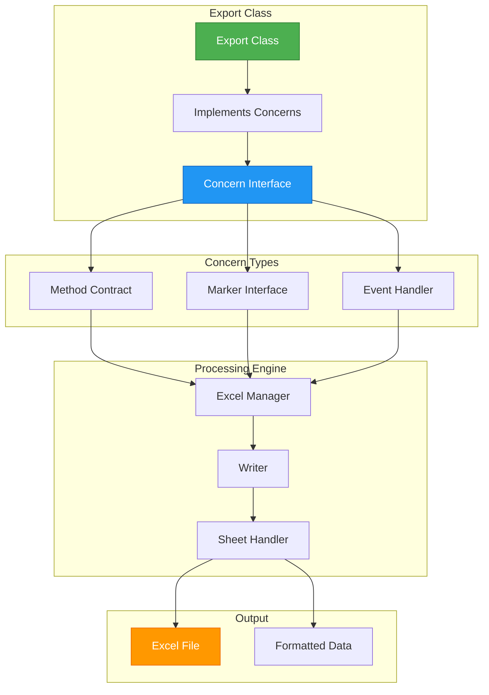
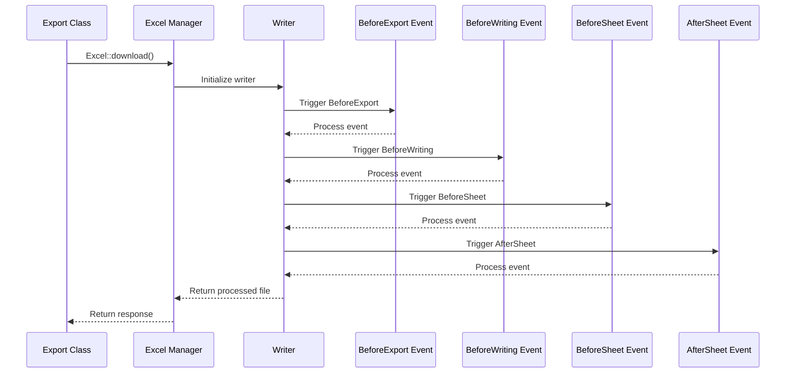
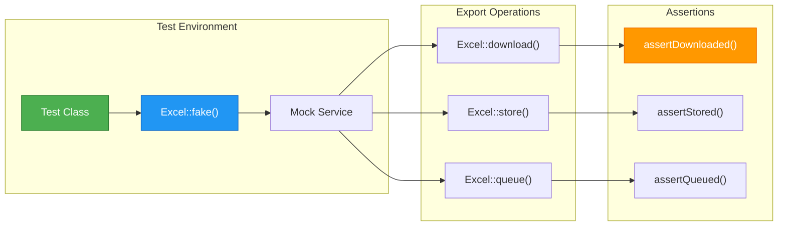

# Advanced Export Techniques | Laravel Excel

## File Path: laravel-8.x/excel/5-advanced-techniques.md

---
## Table of Contents
- [Introduction](#introduction)
- [Technical Definitions](#technical-definitions)
- [Architecture Visualization](#architecture-visualization)
- [Export Concerns Deep Dive](#export-concerns-deep-dive)
- [Extending Laravel Excel](#extending-laravel-excel)
- [Testing Excel Exports](#testing-excel-exports)
- [Best Practices](#best-practices)

---

## Introduction

Advanced export techniques in Laravel Excel provide powerful capabilities for extending functionality, customizing behavior, and ensuring robustness through testing. This guide covers three essential advanced topics:

1. **Export Concerns** - Comprehensive overview of all available concerns and their purposes
2. **Extending Laravel Excel** - How to customize and extend the package with custom functionality
3. **Testing Excel Exports** - Strategies for thoroughly testing your export functionality

These techniques enable you to build sophisticated Excel export solutions with enhanced customization and reliability.

---

## Technical Definitions

### Export Concerns
**Export Concerns** are interfaces that define contracts for export functionality. They allow you to configure and customize the behavior of the Excel operations by implementing specific methods or markers. Each concern serves a distinct purpose in the export process.

### WithEvents Concern
The **WithEvents** concern enables hooking into the export process through events. It allows you to interact with the underlying classes to add custom behavior at specific points in the export lifecycle.

### Custom Concerns
**Custom Concerns** are user-defined interfaces that extend the functionality of Laravel Excel beyond the built-in concerns. They can be registered to handle specific export requirements unique to your application.

### Event Handlers
**Event Handlers** are classes or closures that respond to specific events during the export process. Laravel Excel provides events like `BeforeExport`, `BeforeWriting`, `BeforeSheet`, and `AfterSheet`.

### Fake Excel Service
The **Fake Excel Service** is a testing utility that intercepts Excel operations during testing, allowing you to verify that exports were generated correctly without actually creating files.

### Macroable Classes
**Macroable Classes** (like `Writer` and `Sheet`) can be extended with custom methods at runtime. This allows you to add functionality to these classes without modifying their source code.

---

## Architecture Visualization

### Export Concerns Architecture


### Event System Architecture


### Testing Architecture


---

## Export Concerns Deep Dive

### Complete List of Export Concerns

Laravel Excel provides numerous concerns to customize export behavior. Here's a comprehensive overview:

#### Data Source Concerns

| Concern | Purpose | Required Method |
|---------|---------|-----------------|
| `FromArray` | Use an array to populate the export | `array(): array` |
| `FromCollection` | Use a Laravel Collection to populate the export | `collection(): Collection` |
| `FromGenerator` | Use a generator to populate the export | `generator(): Generator` |
| `FromIterator` | Use an iterator to populate the export | `iterator(): Iterator` |
| `FromQuery` | Use an Eloquent query to populate the export | `query(): QueryBuilder` |
| `FromView` | Use a (Blade) view to populate the export | `view(): View` |

#### Formatting Concerns

| Concern | Purpose | Required Method |
|---------|---------|-----------------|
| `ShouldAutoSize` | Auto-size the columns in the worksheet | None (marker interface) |
| `WithColumnFormatting` | Format certain columns | `columnFormats(): array` |
| `WithColumnWidths` | Set column widths | `columnWidths(): array` |
| `WithCustomStartCell` | Specify a custom start cell | `startCell(): string` |
| `WithHeadings` | Prepend a heading row | `headings(): array` |
| `WithMapping` | Format the row before it's written to the file | `map($row): array` |
| `WithStyles` | Set styles on worksheets | `styles(Worksheet $sheet): array` |

#### Advanced Concerns

| Concern | Purpose | Required Method |
|---------|---------|-----------------|
| `WithCharts` | Run one or multiple PhpSpreadsheet Chart instances | `charts(): array` |
| `WithCustomChunkSize` | Define chunk size for exportables | `chunkSize(): int` |
| `WithCustomCsvSettings` | Run custom CSV settings for exportable | `getCsvSettings(): array` |
| `WithCustomQuerySize` | Provide custom query size for FromQuery | `querySize(): int` |
| `WithCustomValueBinder` | Specify a custom value binder | `bindValue(Cell $cell, $value): bool` |
| `WithDrawings` | Run one or multiple PhpSpreadsheet Drawing instances | `drawings(): array` |
| `WithEvents` | Register events to hook into the PhpSpreadsheet process | `registerEvents(): array` |
| `WithMultipleSheets` | Enable multi-sheet support | `sheets(): array` |
| `WithPreCalculateFormulas` | Force recalculation of formulas | None (marker interface) |
| `WithProperties` | Set properties on the document | `properties(): array` |
| `WithStrictNullComparison` | Use strict comparisons for null values | None (marker interface) |
| `WithTitle` | Set the Workbook or Worksheet title | `title(): string` |

#### Trait-Based Concerns

| Trait | Purpose |
|-------|---------|
| `Exportable` | Add download/store abilities right on the export class |
| `RegistersEventListeners` | Auto-register available event listeners |

### Example: Combining Multiple Concerns

```php
// File Path: app/Exports/AdvancedExport.php
<?php

namespace App\Exports;

use App\Models\Invoice;
use PhpOffice\PhpSpreadsheet\Shared\Date;
use PhpOffice\PhpSpreadsheet\Style\NumberFormat;
use PhpOffice\PhpSpreadsheet\Worksheet\Worksheet;
use PhpOffice\PhpSpreadsheet\Worksheet\Drawing;
use Maatwebsite\Excel\Concerns\FromQuery;
use Maatwebsite\Excel\Concerns\WithMapping;
use Maatwebsite\Excel\Concerns\WithHeadings;
use Maatwebsite\Excel\Concerns\WithColumnFormatting;
use Maatwebsite\Excel\Concerns\WithStyles;
use Maatwebsite\Excel\Concerns\WithProperties;
use Maatwebsite\Excel\Concerns\WithDrawings;

class AdvancedExport implements 
    FromQuery,
    WithMapping,
    WithHeadings,
    WithColumnFormatting,
    WithStyles,
    WithProperties,
    WithDrawings
{
    /**
     * @return \Illuminate\Database\Query\Builder
     */
    public function query()
    {
        return Invoice::query()->with('user');
    }
    
    /**
     * @param Invoice $invoice
     * @return array
     */
    public function map($invoice): array
    {
        return [
            $invoice->id,
            $invoice->invoice_number,
            $invoice->user->name ?? 'N/A',
            $invoice->total,
            Date::dateTimeToExcel($invoice->created_at),
        ];
    }
    
    public function headings(): array
    {
        return [
            'ID',
            'Invoice Number',
            'Customer',
            'Total',
            'Date',
        ];
    }
    
    public function columnFormats(): array
    {
        return [
            'D' => NumberFormat::FORMAT_CURRENCY_USD,
            'E' => NumberFormat::FORMAT_DATE_YYYYMMDD,
        ];
    }
    
    public function styles(Worksheet $sheet)
    {
        return [
            // Style the first row (headings) as bold
            1 => ['font' => ['bold' => true]],
        ];
    }
    
    public function properties(): array
    {
        return [
            'creator' => 'Finance Department',
            'title' => 'Monthly Invoice Report',
            'subject' => 'Invoice Data',
            'keywords' => 'invoices,reports,finance',
        ];
    }
    
    public function drawings()
    {
        $drawing = new Drawing();
        $drawing->setName('Company Logo');
        $drawing->setDescription('Company logo');
        $drawing->setPath(public_path('/images/logo.png'));
        $drawing->setHeight(60);
        $drawing->setCoordinates('A1');

        return $drawing;
    }
}
```

---

## Extending Laravel Excel

### Event System

The event system allows you to hook into the export process at specific points to add custom behavior.

#### Basic Event Implementation

```php
// File Path: app/Exports/EventDrivenExport.php
<?php

namespace App\Exports;

use Maatwebsite\Excel\Concerns\WithEvents;
use Maatwebsite\Excel\Events\BeforeExport;
use Maatwebsite\Excel\Events\BeforeWriting;
use Maatwebsite\Excel\Events\BeforeSheet;
use Maatwebsite\Excel\Events\AfterSheet;

class EventDrivenExport implements WithEvents
{
    /**
     * @return array
     */
    public function registerEvents(): array
    {
        return [
            // Handle by a closure
            BeforeExport::class => function(BeforeExport $event) {
                $event->writer->getProperties()->setCreator('Patrick');
            },
            
            // Array callable, referring to a static method
            BeforeWriting::class => [self::class, 'beforeWriting'],
            
            // Using a class with an __invoke method
            BeforeSheet::class => new BeforeSheetHandler(),
            
            // Another closure
            AfterSheet::class => function(AfterSheet $event) {
                // Add a comment to the sheet
                $event->sheet->getDelegate()->getComments();
            }
        ];
    }
    
    public static function beforeWriting(BeforeWriting $event) 
    {
        // Perform actions before writing
        $event->writer->getDelegate()->getProperties()
            ->setTitle('Custom Title Set via Event')
            ->setSubject('Custom Subject Set via Event');
    }
}
```

#### Event Handler Class

```php
// File Path: app/Exports/Handlers/BeforeSheetHandler.php
<?php

namespace App\Exports\Handlers;

use Maatwebsite\Excel\Events\BeforeSheet;

class BeforeSheetHandler
{
    public function __invoke(BeforeSheet $event)
    {
        // Add custom styling to the sheet
        $event->sheet->getDelegate()->getStyle('A1:E1')
            ->getFill()
            ->setFillType(\PhpOffice\PhpSpreadsheet\Style\Fill::FILL_SOLID)
            ->getStartColor()->setARGB('FF8DB4E2');
        
        // Set print area
        $event->sheet->getDelegate()->getActiveSheet()->getPageSetup()
            ->setPrintArea('A1:E50');
    }
}
```

### Auto-Register Event Listeners

Instead of manually registering events, you can use the `RegistersEventListeners` trait to automatically register event listeners:

```php
// File Path: app/Exports/AutoEventExport.php
<?php

namespace App\Exports;

use Maatwebsite\Excel\Concerns\WithEvents;
use Maatwebsite\Excel\Concerns\RegistersEventListeners;
use Maatwebsite\Excel\Events\BeforeExport;
use Maatwebsite\Excel\Events\BeforeWriting;
use Maatwebsite\Excel\Events\BeforeSheet;
use Maatwebsite\Excel\Events\AfterSheet;

class AutoEventExport implements WithEvents
{
    use Exportable, RegistersEventListeners;
    
    public static function beforeExport(BeforeExport $event)
    {
        $event->writer->getProperties()->setCreator('Auto Event Exporter');
    }

    public static function beforeWriting(BeforeWriting $event)
    {
        $event->writer->getDelegate()->getProperties()
            ->setDescription('Exported via auto event system');
    }

    public static function beforeSheet(BeforeSheet $event)
    {
        $event->sheet->getDelegate()->setTitle('Dynamic Sheet Title');
    }

    public static function afterSheet(AfterSheet $event)
    {
        // Add a footer
        $event->sheet->getDelegate()->getHeaderFooter()
            ->setOddFooter('&L&B' . $event->sheet->getDelegate()->getTitle() . '&RPage &P of &N');
    }
}
```

### Global Event Listeners

Event listeners can be configured globally for all exports in your application. Add them to a service provider like `AppServiceProvider`:

```php
// File Path: app/Providers/AppServiceProvider.php
<?php

namespace App\Providers;

use Illuminate\Support\ServiceProvider;
use Maatwebsite\Excel\Writer;
use Maatwebsite\Excel\Sheet;
use Maatwebsite\Excel\Events\BeforeExport;
use Maatwebsite\Excel\Events\BeforeWriting;
use Maatwebsite\Excel\Events\BeforeSheet;
use Maatwebsite\Excel\Events\AfterSheet;

class AppServiceProvider extends ServiceProvider
{
    public function register()
    {
        // Global event listeners for all exports
        Writer::listen(BeforeExport::class, function (BeforeExport $event) {
            $event->writer->getProperties()
                ->setCreator(config('app.name'))
                ->setLastModifiedBy(config('app.name'));
        });

        Writer::listen(BeforeWriting::class, function (BeforeWriting $event) {
            $event->writer->getDelegate()->getProperties()
                ->setTitle('Generated by ' . config('app.name'))
                ->setSubject('Automatically generated report');
        });

        Sheet::listen(BeforeSheet::class, function (BeforeSheet $event) {
            // Set default orientation for all sheets
            $event->sheet->getDelegate()->getPageSetup()
                ->setOrientation(\PhpOffice\PhpSpreadsheet\Worksheet\PageSetup::ORIENTATION_PORTRAIT);
        });

        Sheet::listen(AfterSheet::class, function (AfterSheet $event) {
            // Add company footer to all sheets
            $event->sheet->getDelegate()->getHeaderFooter()
                ->setOddFooter('&C&F - Generated on &D at &T');
        });
    }
}
```

### Custom Concerns

You can create custom concerns to extend Laravel Excel functionality:

#### 1. Define the Custom Concern Interface

```php
// File Path: app/Exports/Concerns/WithCustomProperties.php
<?php

namespace App\Exports\Concerns;

interface WithCustomProperties
{
    /**
     * @return string
     */
    public function description(): string;
    
    /**
     * @return string
     */
    public function category(): string;
}
```

#### 2. Create the Concern Handler

```php
// File Path: app/Exports/Concerns/WithCustomPropertiesHandler.php
<?php

namespace App\Exports\Concerns;

use App\Exports\Concerns\WithCustomProperties;
use Maatwebsite\Excel\Writer;

class WithCustomPropertiesHandler
{
    /**
     * @param WithCustomProperties $exportable
     * @param Writer $writer
     */
    public function __invoke(WithCustomProperties $exportable, Writer $writer)
    {
        $writer
            ->getDelegate()
            ->getProperties()
            ->setDescription($exportable->description())
            ->setCategory($exportable->category());
    }
}
```

#### 3. Register the Custom Concern

```php
// File Path: app/Providers/AppServiceProvider.php
<?php

namespace App\Providers;

use Illuminate\Support\ServiceProvider;
use Maatwebsite\Excel\Excel;
use App\Exports\Concerns\WithCustomProperties;
use App\Exports\Concerns\WithCustomPropertiesHandler;
use Maatwebsite\Excel\Events\BeforeExport;

class AppServiceProvider extends ServiceProvider
{
    public function register()
    {
        // Register custom concern
        Excel::extend(
            WithCustomProperties::class, 
            new WithCustomPropertiesHandler(),
            BeforeExport::class  // Hook into specific event
        );
    }
}
```

#### 4. Use the Custom Concern

```php
// File Path: app/Exports/CustomPropertyExport.php
<?php

namespace App\Exports;

use App\Models\Invoice;
use Maatwebsite\Excel\Concerns\FromQuery;
use App\Exports\Concerns\WithCustomProperties;

class CustomPropertyExport implements FromQuery, WithCustomProperties
{
    /**
     * @return \Illuminate\Database\Query\Builder
     */
    public function query()
    {
        return Invoice::query();
    }
    
    public function description(): string
    {
        return 'This is a custom property export with additional metadata';
    }
    
    public function category(): string
    {
        return 'Financial Reports';
    }
}
```

### Macroable Extensions

Both `Writer` and `Sheet` classes are "macroable", allowing you to extend them with custom functionality:

#### Writer Macros

```php
// File Path: app/Providers/AppServiceProvider.php
<?php

namespace App\Providers;

use Illuminate\Support\ServiceProvider;
use Maatwebsite\Excel\Writer;

class AppServiceProvider extends ServiceProvider
{
    public function register()
    {
        // Add custom macro to Writer
        Writer::macro('setCreatorAndCompany', function (Writer $writer, string $creator, string $company) {
            $properties = $writer->getDelegate()->getProperties();
            $properties->setCreator($creator);
            $properties->setCompany($company);
        });
        
        // Add watermark macro
        Writer::macro('addWatermark', function (Writer $writer, string $watermarkText) {
            $spreadsheet = $writer->getDelegate();
            $spreadsheet->getActiveSheet()->getHeaderFooter()
                ->setOddHeader('&C&H' . $watermarkText);
        });
    }
}
```

#### Sheet Macros

```php
// File Path: app/Providers/AppServiceProvider.php
<?php

namespace App\Providers;

use Illuminate\Support\ServiceProvider;
use Maatwebsite\Excel\Sheet;

class AppServiceProvider extends ServiceProvider
{
    public function register()
    {
        // Add custom macro to Sheet
        Sheet::macro('setOrientation', function (Sheet $sheet, $orientation) {
            $sheet->getDelegate()->getPageSetup()->setOrientation($orientation);
        });
        
        // Add custom macro to style cells
        Sheet::macro('styleCells', function (Sheet $sheet, string $cellRange, array $style) {
            $sheet->getDelegate()->getStyle($cellRange)->applyFromArray($style);
        });
        
        // Add RTL support
        Sheet::macro('setRightToLeft', function (Sheet $sheet) {
            $sheet->getDelegate()->setRightToLeft(true);
        });
    }
}
```

#### Using Macros in Exports

```php
// File Path: app/Exports/MacroExport.php
<?php

namespace App\Exports;

use Maatwebsite\Excel\Concerns\WithEvents;
use Maatwebsite\Excel\Events\BeforeExport;
use Maatwebsite\Excel\Events\AfterSheet;
use Maatwebsite\Excel\Events\BeforeWriting;

class MacroExport implements WithEvents
{
    /**
     * @return array
     */
    public function registerEvents(): array
    {
        return [
            BeforeExport::class => function(BeforeExport $event) {
                // Use the custom macro
                $event->writer->setCreatorAndCompany('System', 'My Company Inc.');
            },
            BeforeWriting::class => function(BeforeWriting $event) {
                // Add watermark
                $event->writer->addWatermark('CONFIDENTIAL');
            },
            AfterSheet::class => function(AfterSheet $event) {
                // Set landscape orientation
                $event->sheet->setOrientation(\PhpOffice\PhpSpreadsheet\Worksheet\PageSetup::ORIENTATION_LANDSCAPE);
                
                // Style specific cells
                $event->sheet->styleCells(
                    'B2:G8',
                    [
                        'borders' => [
                            'outline' => [
                                'borderStyle' => \PhpOffice\PhpSpreadsheet\Style\Border::BORDER_THICK,
                                'color' => ['argb' => 'FFFF0000'],
                            ],
                        ]
                    ]
                );
                
                // Set RTL if needed
                // $event->sheet->setRightToLeft();
            },
        ];
    }
}
```

---

## Testing Excel Exports

### Testing Downloads

The Excel facade provides a fake implementation for testing purposes:

```php
// File Path: tests/Feature/ExportTest.php
<?php

namespace Tests\Feature;

use Illuminate\Foundation\Testing\RefreshDatabase;
use Tests\TestCase;
use App\Exports\InvoicesExport;
use Maatwebsite\Excel\Facades\Excel;

class ExportTest extends TestCase
{
    use RefreshDatabase;

    /** @test */
    public function user_can_download_invoices_export()
    {
        // Create test data
        factory(\App\Models\Invoice::class, 10)->create();

        // Fake the Excel service
        Excel::fake();

        // Perform the download request
        $response = $this->actingAs(factory(\App\Models\User::class)->create())
                         ->get('/invoices/download/xlsx');

        // Assert that the correct export was downloaded
        Excel::assertDownloaded('invoices.xlsx', function(InvoicesExport $export) {
            // Assert that the correct export is downloaded
            return $export instanceof InvoicesExport;
        });
    }

    /** @test */
    public function user_can_download_invoices_with_specific_content()
    {
        // Create test data
        $invoice = factory(\App\Models\Invoice::class)->create([
            'invoice_number' => '#2018-01'
        ]);

        Excel::fake();

        $this->actingAs(factory(\App\Models\User::class)->create())
             ->get('/invoices/download/xlsx');

        Excel::assertDownloaded('invoices.xlsx', function(InvoicesExport $export) use ($invoice) {
            // Test specific content in the export
            return true; // Actual test would check collection contents
        });
    }
}
```

### Testing Stored Exports

Test that exports are properly stored to disk:

```php
// File Path: tests/Feature/ExportTest.php
<?php

namespace Tests\Feature;

use Illuminate\Foundation\Testing\RefreshDatabase;
use Tests\TestCase;
use Maatwebsite\Excel\Facades\Excel;

class ExportTest extends TestCase
{
    use RefreshDatabase;

    /** @test */
    public function user_can_store_invoices_export()
    {
        Excel::fake();

        $this->actingAs(factory(\App\Models\User::class)->create())
             ->get('/invoices/store/xlsx');

        // Assert that the file was stored
        Excel::assertStored('invoices.xlsx', 'local');
        
        // Assert with callback
        Excel::assertStored('invoices.xlsx', 'local', function($export) {
            return $export instanceof \App\Exports\InvoicesExport;
        });
        
        // When passing the callback as 2nd param, the disk will be the default disk
        Excel::assertStored('invoices.xlsx', function($export) {
            return $export instanceof \App\Exports\InvoicesExport;
        });
    }

    /** @test */
    public function user_can_store_invoices_to_custom_disk()
    {
        Excel::fake();

        $this->actingAs(factory(\App\Models\User::class)->create())
             ->get('/invoices/store/s3');

        Excel::assertStored('invoices.xlsx', 's3');
    }
}
```

### Testing Queued Exports

Test that exports are properly queued for background processing:

```php
// File Path: tests/Feature/ExportTest.php
<?php

namespace Tests\Feature;

use Illuminate\Foundation\Testing\RefreshDatabase;
use Tests\TestCase;
use Maatwebsite\Excel\Facades\Excel;
use App\Jobs\NotifyUsers;

class ExportTest extends TestCase
{
    use RefreshDatabase;

    /** @test */
    public function user_can_queue_invoices_export()
    {
        Excel::fake();

        $this->actingAs(factory(\App\Models\User::class)->create())
             ->get('/invoices/queue/xlsx');

        // Assert that the export was queued
        Excel::assertQueued('invoices.xlsx', 'local');
        
        // Assert with callback
        Excel::assertQueued('invoices.xlsx', 'local', function($export) {
            return $export instanceof \App\Exports\InvoicesExport;
        });
        
        // When passing the callback as 2nd param, the disk will be the default disk
        Excel::assertQueued('invoices.xlsx', function($export) {
            return $export instanceof \App\Exports\InvoicesExport;
        });
        
        // Assert that the export was queued with a specific chain of other jobs
        Excel::assertQueuedWithChain([
            new NotifyUsers(),
        ]);
    }

    /** @test */
    public function queued_export_has_correct_properties()
    {
        Excel::fake();

        $this->get('/invoices/queue/xlsx');

        Excel::assertQueued('invoices.xlsx', function($export) {
            // Test that the export has correct configuration
            return true; // Actual test would check export properties
        });
    }
}
```

### Testing with Dynamic File Names

For exports with dynamic file names, use regular expressions in tests:

```php
// File Path: tests/Feature/ExportTest.php
<?php

namespace Tests\Feature;

use Illuminate\Foundation\Testing\RefreshDatabase;
use Tests\TestCase;
use Maatwebsite\Excel\Facades\Excel;

class ExportTest extends TestCase
{
    use RefreshDatabase;

    /** @test */
    public function user_can_store_invoices_export_with_dynamic_name()
    {
        Excel::fake();
        
        $this->actingAs(factory(\App\Models\User::class)->create())
             ->get('/invoices/store/dynamic');
        
        // Tell the mock to use regular expressions
        Excel::matchByRegex(); 
        
        // For a given dynamic named file 'invoices_2023.xlsx'
        Excel::assertStored('/invoices_\d{4}\.xlsx/', 'local');
        
        // For more complex patterns
        Excel::assertStored('/invoices_[0-9]{4}-[0-9]{2}-[0-9]{2}\.xlsx/', 'local');
    }

    /** @test */
    public function user_can_download_report_with_timestamp()
    {
        Excel::fake();
        
        $this->get('/reports/monthly/download');
        
        Excel::matchByRegex();
        
        // Match file with timestamp: 'monthly-report_2023-08-15_123456.xlsx'
        Excel::assertDownloaded('/monthly-report_\d{4}-\d{2}-\d{2}_\d{6}\.xlsx/');
    }
}
```

### Complete Testing Example

Here's a comprehensive test suite for an export class:

```php
// File Path: tests/Feature/ComprehensiveExportTest.php
<?php

namespace Tests\Feature;

use Illuminate\Foundation\Testing\RefreshDatabase;
use Tests\TestCase;
use App\Exports\AdvancedExport;
use Maatwebsite\Excel\Facades\Excel;
use Illuminate\Support\Facades\Queue;
use App\Jobs\SendNotification;

class ComprehensiveExportTest extends TestCase
{
    use RefreshDatabase;

    protected function setUp(): void
    {
        parent::setUp();
        
        // Create test users and invoices
        $this->user = factory(\App\Models\User::class)->create();
        $this->invoices = factory(\App\Models\Invoice::class, 10)->create();
    }

    /** @test */
    public function export_class_implements_required_concerns()
    {
        $export = new AdvancedExport();
        
        $this->assertInstanceOf(
            \Maatwebsite\Excel\Concerns\FromQuery::class,
            $export
        );
        
        $this->assertInstanceOf(
            \Maatwebsite\Excel\Concerns\WithMapping::class,
            $export
        );
        
        $this->assertInstanceOf(
            \Maatwebsite\Excel\Concerns\WithHeadings::class,
            $export
        );
    }

    /** @test */
    public function export_returns_correct_query()
    {
        $export = new AdvancedExport();
        
        $query = $export->query();
        
        $this->assertInstanceOf(\Illuminate\Database\Query\Builder::class, $query);
        $this->assertTrue(str_contains($query->toSql(), 'invoices'));
    }

    /** @test */
    public function export_maps_data_correctly()
    {
        $export = new AdvancedExport();
        
        $invoice = $this->invoices->first();
        
        $mapped = $export->map($invoice);
        
        $this->assertCount(5, $mapped);
        $this->assertEquals($invoice->id, $mapped[0]);
        $this->assertEquals($invoice->invoice_number, $mapped[1]);
    }

    /** @test */
    public function export_has_correct_headings()
    {
        $export = new AdvancedExport();
        
        $headings = $export->headings();
        
        $this->assertEquals([
            'ID',
            'Invoice Number', 
            'Customer',
            'Total',
            'Date',
        ], $headings);
    }

    /** @test */
    public function export_can_be_downloaded()
    {
        Excel::fake();

        $response = $this->actingAs($this->user)
                         ->get('/exports/invoices/download');

        $response->assertSuccessful();
        
        Excel::assertDownloaded('invoices.xlsx', function($export) {
            return $export instanceof AdvancedExport;
        });
    }

    /** @test */
    public function export_can_be_stored()
    {
        Excel::fake();

        $this->actingAs($this->user)
             ->post('/exports/invoices/store', [
                 'disk' => 'local'
             ]);

        Excel::assertStored('invoices.xlsx', 'local');
    }

    /** @test */
    public function export_can_be_queued()
    {
        Excel::fake();
        Queue::fake();

        $this->actingAs($this->user)
             ->post('/exports/invoices/queue');

        Excel::assertQueued('invoices.xlsx');
    }

    /** @test */
    public function export_handles_events_properly()
    {
        Excel::fake();

        // Test with an export that uses events
        $this->actingAs($this->user)
             ->get('/exports/event-driven/download');

        Excel::assertDownloaded('event-driven.xlsx');
    }

    /** @test */
    public function export_with_custom_properties_works()
    {
        Excel::fake();

        $this->actingAs($this->user)
             ->get('/exports/custom-properties/download');

        Excel::assertDownloaded('custom-properties.xlsx', function($export) {
            // Test that custom properties are applied
            return true; // Actual test would check specific properties
        });
    }

    /** @test */
    public function export_fails_with_insufficient_permissions()
    {
        $user = factory(\App\Models\User::class)->create([
            'role' => 'guest' // Assuming guests can't export
        ]);

        $response = $this->actingAs($user)
                         ->get('/exports/invoices/download');

        $response->assertForbidden();
    }

    /** @test */
    public function export_works_with_large_dataset()
    {
        // Create a large dataset
        factory(\App\Models\Invoice::class, 1000)->create();

        Excel::fake();

        $this->actingAs($this->user)
             ->get('/exports/large-invoices/download');

        Excel::assertDownloaded('large-invoices.xlsx');
    }
}
```

---

## Best Practices

### 1. Organize Your Export Classes

Structure your export classes logically with proper namespaces:

```
app/
├── Exports/
│   ├── Concerns/
│   │   ├── WithCustomProperties.php
│   │   └── WithCustomPropertiesHandler.php
│   ├── Handlers/
│   │   ├── BeforeSheetHandler.php
│   │   └── AfterSheetHandler.php
│   ├── BaseExport.php
│   ├── AdvancedExport.php
│   └── CustomPropertyExport.php
```

### 2. Use Concerns Strategically

Combine concerns based on your export requirements:

```php
// File Path: app/Exports/BestPracticeExport.php
<?php

namespace App\Exports;

use App\Models\Invoice;
use PhpOffice\PhpSpreadsheet\Shared\Date;
use PhpOffice\PhpSpreadsheet\Style\NumberFormat;
use PhpOffice\PhpSpreadsheet\Worksheet\Worksheet;
use PhpOffice\PhpSpreadsheet\Worksheet\Drawing;
use Maatwebsite\Excel\Concerns\FromQuery;
use Maatwebsite\Excel\Concerns\WithMapping;
use Maatwebsite\Excel\Concerns\WithHeadings;
use Maatwebsite\Excel\Concerns\WithColumnFormatting;
use Maatwebsite\Excel\Concerns\WithStyles;
use Maatwebsite\Excel\Concerns\WithProperties;
use Maatwebsite\Excel\Concerns\WithDrawings;

class BestPracticeExport implements 
    FromQuery,
    WithMapping,
    WithHeadings,
    WithColumnFormatting,
    WithStyles,
    WithProperties,
    WithDrawings
{
    /**
     * @return \Illuminate\Database\Query\Builder
     */
    public function query()
    {
        return Invoice::query()->with('user');
    }
    
    public function map($invoice): array
    {
        return [
            $invoice->id,
            $invoice->invoice_number,
            $invoice->user->name ?? 'N/A',
            $invoice->total,
            $invoice->status,
            Date::dateTimeToExcel($invoice->created_at),
        ];
    }
    
    public function headings(): array
    {
        return [
            'ID',
            'Invoice Number',
            'Customer',
            'Total',
            'Status',
            'Date',
        ];
    }
    
    public function columnFormats(): array
    {
        return [
            'D' => NumberFormat::FORMAT_CURRENCY_USD,
            'F' => NumberFormat::FORMAT_DATE_YYYYMMDD,
        ];
    }
    
    public function styles(Worksheet $sheet)
    {
        return [
            1 => ['font' => ['bold' => true]], // Header row bold
        ];
    }
    
    public function properties(): array
    {
        return [
            'title' => 'Invoice Report',
            'subject' => 'Invoice Data',
            'creator' => 'System',
        ];
    }
    
    public function drawings()
    {
        $drawing = new Drawing();
        $drawing->setName('Logo');
        $drawing->setDescription('Company logo');
        $drawing->setPath(public_path('/images/logo.png'));
        $drawing->setHeight(50);
        $drawing->setCoordinates('A1');

        return $drawing;
    }
}
```

### 3. Implement Proper Error Handling

Always include error handling in your export classes:

```php
// File Path: app/Exports/SafeExport.php
<?php

namespace App\Exports;

use App\Models\Invoice;
use Maatwebsite\Excel\Concerns\FromQuery;
use Maatwebsite\Excel\Concerns\WithMapping;
use Maatwebsite\Excel\Concerns\WithHeadings;

class SafeExport implements FromQuery, WithMapping, WithHeadings
{
    /**
     * @return \Illuminate\Database\Query\Builder
     */
    public function query()
    {
        try {
            return Invoice::query()->with('user');
        } catch (\Exception $e) {
            \Log::error('Export query failed: ' . $e->getMessage());
            throw $e;
        }
    }
    
    public function map($invoice): array
    {
        try {
            return [
                $invoice->id ?? '',
                $invoice->invoice_number ?? '',
                $invoice->user->name ?? 'N/A',
                $invoice->total ?? 0,
            ];
        } catch (\Exception $e) {
            \Log::warning('Mapping failed for invoice ID: ' . ($invoice->id ?? 'unknown'));
            return ['', '', 'Error', 0];
        }
    }
    
    public function headings(): array
    {
        return ['ID', 'Number', 'Customer', 'Total'];
    }
}
```

### 4. Common Pitfalls to Avoid

| Pitfall | Problem | Solution |
|---------|---------|----------|
| Not implementing required methods | Runtime errors | Always implement required methods for each concern |
| Using `->get()` in `FromQuery` | Memory issues | Return query builder only, not executed query |
| Missing headings | Confusing exports | Always include `WithHeadings` for clarity |
| Hardcoded file paths | Deployment issues | Use `public_path()` or config for image paths |
| No error handling | Silent failures | Wrap image operations in try-catch |
| Closures in queued exports | Serialization errors | Use `RegistersEventListeners` trait instead |
| Forgetting to register custom concerns | Functionality not working | Register concerns in service providers |

### 5. Performance Optimization Tips

```php
// File Path: app/Exports/OptimizedExport.php
<?php

namespace App\Exports;

use App\Models\User;
use Maatwebsite\Excel\Concerns\FromQuery;
use Maatwebsite\Excel\Concerns\WithMapping;
use Maatwebsite\Excel\Concerns\WithHeadings;
use Maatwebsite\Excel\Concerns\WithColumnWidths;
use Maatwebsite\Excel\Concerns\WithChunkReading;

class OptimizedExport implements 
    FromQuery, 
    WithMapping, 
    WithHeadings, 
    WithColumnWidths,
    WithChunkReading
{
    /**
     * Select only needed columns for performance.
     * 
     * @return \Illuminate\Database\Query\Builder
     */
    public function query()
    {
        return User::query()
            ->select(['id', 'name', 'email', 'created_at'])
            ->where('active', true);
    }
    
    public function map($user): array
    {
        return [
            $user->id,
            $user->name,
            $user->email,
            $user->created_at->format('Y-m-d'),
        ];
    }
    
    public function headings(): array
    {
        return ['ID', 'Name', 'Email', 'Created'];
    }
    
    public function columnWidths(): array
    {
        return [
            'A' => 10,
            'B' => 25,
            'C' => 35,
            'D' => 15,
        ];
    }
    
    public function chunkSize(): int
    {
        return 500; // Adjust based on your memory limits
    }
}
```

### 6. Testing Strategy

Create a comprehensive testing strategy that covers:

1. **Unit tests** for individual export classes
2. **Integration tests** for export functionality
3. **Feature tests** for user interactions with exports
4. **Performance tests** for large datasets

```php
// File Path: tests/Feature/ExportPerformanceTest.php
<?php

namespace Tests\Feature;

use Tests\TestCase;
use Maatwebsite\Excel\Facades\Excel;
use Illuminate\Support\Facades\DB;

class ExportPerformanceTest extends TestCase
{
    /** @test */
    public function large_export_performs_within_acceptable_time()
    {
        // Create a large dataset
        DB::table('invoices')->insert(
            factory(\App\Models\Invoice::class, 5000)->make()->toArray()
        );

        Excel::fake();

        $startTime = microtime(true);
        
        $this->actingAs(factory(\App\Models\User::class)->create())
             ->get('/exports/large/download');
             
        $executionTime = microtime(true) - $startTime;
        
        // Assert that export completes within 10 seconds
        $this->assertLessThan(10, $executionTime);
    }
}
```

---

## Summary

This comprehensive guide covered:

1. **Export Concerns** - A complete overview of all available concerns and their implementations
2. **Extending Laravel Excel** - How to customize functionality with events, custom concerns, and macros
3. **Testing Excel Exports** - Complete testing strategies for all export scenarios

By mastering these advanced techniques, you can build robust, customizable, and well-tested Excel export functionality in your Laravel applications. Remember to follow best practices for organization, error handling, and performance optimization.