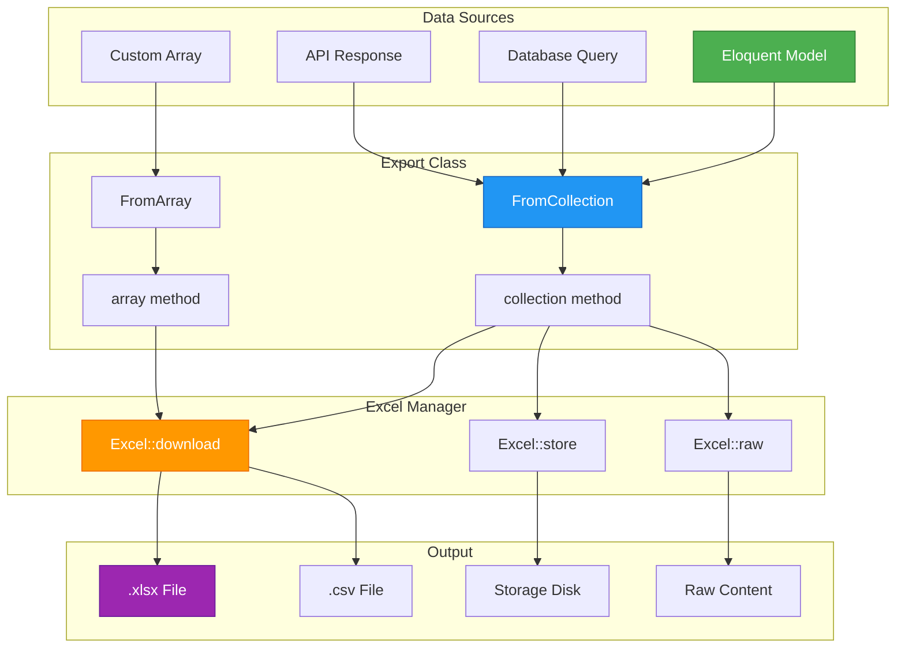
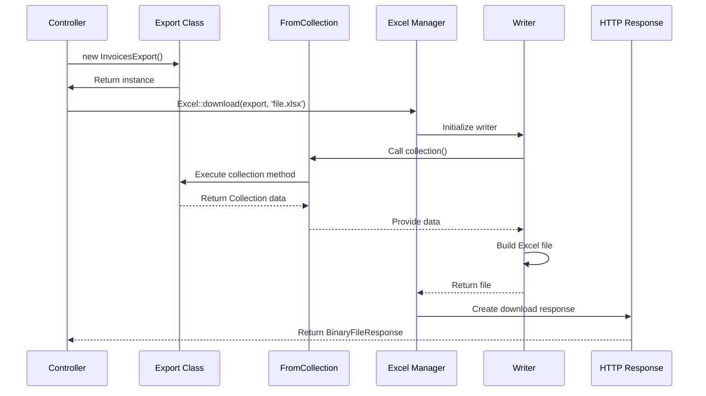
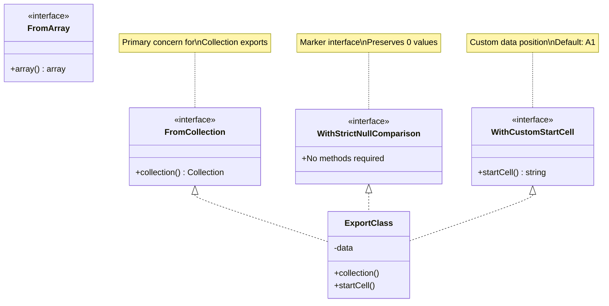
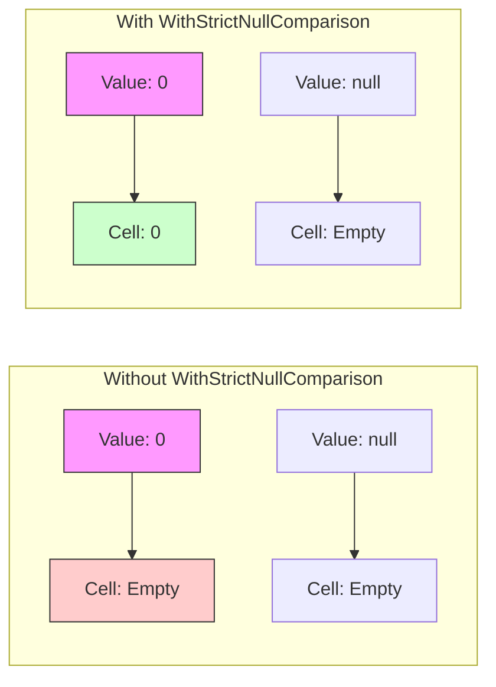
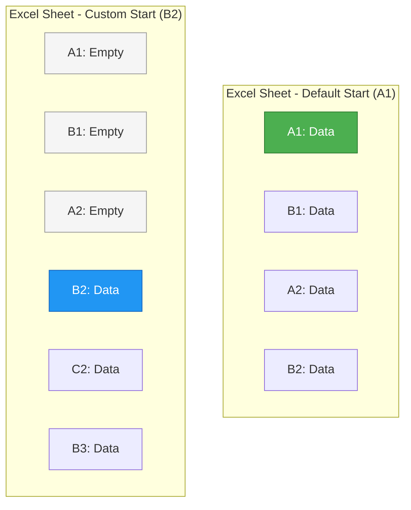
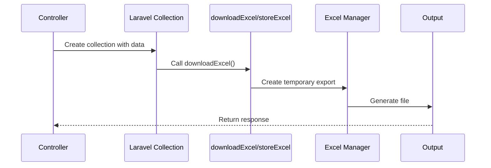
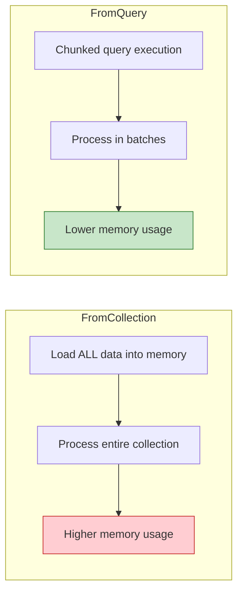

# Exporting Collections | Laravel Excel

## File Path: laravel-8.x/excel/2-collection.md

---

## Table of Contents
- [Introduction](#introduction)
- [Technical Definitions](#technical-definitions)
- [Visualization](#visualization)
- [Basic Collection Export](#basic-collection-export)
- [Using Custom Structures](#using-custom-structures)
- [Using Arrays](#using-arrays)
- [Dependency Injection](#dependency-injection)
- [Strict Null Comparisons](#strict-null-comparisons)
- [Custom Start Cell](#custom-start-cell)
- [Storing Raw Contents](#storing-raw-contents)
- [Collection Macros](#collection-macros)
- [Best Practices](#best-practices)

---

## Introduction

Exporting collections is the most straightforward way to create Excel exports in Laravel Excel. The `FromCollection` concern allows you to export data from Laravel Collections, Eloquent models, or custom data structures to Excel files. This approach is ideal for small to medium-sized datasets and provides a clean, intuitive API for data export operations.

Understanding collection exports is fundamental to Laravel Excel, as it forms the basis for more advanced export techniques like queued exports, multiple sheets, and data mapping.

---

## Technical Definitions

### FromCollection Concern
The **FromCollection** concern is an interface that requires implementing a `collection()` method. This method returns a Laravel Collection or any iterable data structure that will be transformed into Excel rows. It's the primary mechanism for exporting data in Laravel Excel.

### FromArray Concern
The **FromArray** concern is an alternative interface that requires implementing an `array()` method. It's used when you prefer working with plain PHP arrays instead of Laravel Collections.

### WithStrictNullComparison Concern
The **WithStrictNullComparison** concern ensures that `0` (zero) values are preserved as actual zeros in the Excel file, rather than being converted to empty cells (null values).

### WithCustomStartCell Concern
The **WithCustomStartCell** concern allows you to specify a custom starting cell for your data export, instead of the default `A1` position.

### Collection Macros
**Collection Macros** are extension methods added to Laravel's Collection class by Laravel Excel, providing convenient methods like `downloadExcel()` and `storeExcel()` for quick exports without creating separate export classes.

---

## Visualization

### Collection Export Flow



### Export Process Sequence



### Concerns Relationship Diagram



---

## Basic Collection Export

### Creating an Export Class

The easiest way to start an export is to create a custom export class that implements the `FromCollection` concern.

```php
// File Path: app/Exports/InvoicesExport.php
<?php

namespace App\Exports;

use App\Invoice;
use Maatwebsite\Excel\Concerns\FromCollection;

class InvoicesExport implements FromCollection
{
    /**
     * @return \Illuminate\Support\Collection
     */
    public function collection()
    {
        return Invoice::all();
    }
}
```

### Downloading the Export

In your controller, you can download the export using the Excel facade:

```php
// File Path: app/Http/Controllers/ExportController.php
<?php

namespace App\Http\Controllers;

use App\Exports\InvoicesExport;
use Maatwebsite\Excel\Facades\Excel;

class ExportController extends Controller
{
    /**
     * Download invoices as Excel file.
     * 
     * @return \Symfony\Component\HttpFoundation\BinaryFileResponse
     */
    public function export()
    {
        return Excel::download(new InvoicesExport, 'invoices.xlsx');
    }
}
```

### Download with Custom Headers

You can optionally pass whether to output headers and custom response headers:

```php
// File Path: app/Http/Controllers/ExportController.php
public function exportWithHeaders()
{
    return Excel::download(
        new InvoicesExport,
        'invoices.xlsx',
        true,  // Output headers
        ['X-Vapor-Base64-Encode' => 'True']  // Custom headers
    );
}
```

### Storing on Disk

Store the export to a specific disk (e.g., S3):

```php
// File Path: app/Http/Controllers/ExportController.php
public function storeExcel()
{
    // Store on S3 disk
    Excel::store(new InvoicesExport, 'invoices.xlsx', 's3');
    
    // Store on local disk
    Excel::store(new InvoicesExport, 'invoices.xlsx', 'local');
    
    return response()->json(['message' => 'Export stored successfully']);
}
```

---

## Using Custom Structures

### Non-Eloquent Data Sources

If you're not using Eloquent or have another data source (e.g., API, MongoDB, Cache), you can return a custom collection:

```php
// File Path: app/Exports/CustomDataExport.php
<?php

namespace App\Exports;

use Illuminate\Support\Collection;
use Maatwebsite\Excel\Concerns\FromCollection;

class CustomDataExport implements FromCollection
{
    /**
     * @return \Illuminate\Support\Collection
     */
    public function collection()
    {
        return new Collection([
            ['ID', 'Name', 'Amount'],
            [1, 'Invoice A', 100],
            [2, 'Invoice B', 200],
            [3, 'Invoice C', 300],
        ]);
    }
}
```

### API Data Export Example

```php
// File Path: app/Exports/ApiDataExport.php
<?php

namespace App\Exports;

use Illuminate\Support\Collection;
use Maatwebsite\Excel\Concerns\FromCollection;
use Illuminate\Support\Facades\Http;

class ApiDataExport implements FromCollection
{
    /**
     * Export data from external API.
     * 
     * @return \Illuminate\Support\Collection
     */
    public function collection()
    {
        $response = Http::get('https://api.example.com/data');
        
        return collect($response->json())->map(function ($item) {
            return [
                $item['id'],
                $item['name'],
                $item['value'],
            ];
        });
    }
}
```

---

## Using Arrays

### FromArray Concern

If you prefer plain arrays over Collections, use the `FromArray` concern:

```php
// File Path: app/Exports/ArrayExport.php
<?php

namespace App\Exports;

use Maatwebsite\Excel\Concerns\FromArray;

class ArrayExport implements FromArray
{
    /**
     * @return array
     */
    public function array(): array
    {
        return [
            ['ID', 'Name', 'Amount'],
            [1, 'Product A', 100],
            [2, 'Product B', 200],
            [3, 'Product C', 300],
        ];
    }
}
```

### Passing Data via Constructor

Pass data from the controller to your export class using constructor injection:

```php
// File Path: app/Exports/DynamicArrayExport.php
<?php

namespace App\Exports;

use Maatwebsite\Excel\Concerns\FromArray;

class DynamicArrayExport implements FromArray
{
    protected $data;

    /**
     * @param array $data
     */
    public function __construct(array $data)
    {
        $this->data = $data;
    }

    /**
     * @return array
     */
    public function array(): array
    {
        return $this->data;
    }
}
```

### Controller Usage

```php
// File Path: app/Http/Controllers/ExportController.php
<?php

namespace App\Http\Controllers;

use App\Exports\DynamicArrayExport;
use Maatwebsite\Excel\Facades\Excel;

class ExportController extends Controller
{
    public function exportDynamic()
    {
        $export = new DynamicArrayExport([
            ['ID', 'Name', 'Status'],
            [1, 'Item 1', 'Active'],
            [2, 'Item 2', 'Inactive'],
            [3, 'Item 3', 'Pending'],
        ]);

        return Excel::download($export, 'dynamic-export.xlsx');
    }
}
```

---

## Dependency Injection

### Injecting Dependencies

When your export class needs dependencies, you can inject them through the constructor:

```php
// File Path: app/Exports/RepositoryExport.php
<?php

namespace App\Exports;

use App\Repositories\InvoicesRepository;
use Maatwebsite\Excel\Concerns\FromCollection;

class RepositoryExport implements FromCollection
{
    protected $invoices;

    /**
     * @param InvoicesRepository $invoices
     */
    public function __construct(InvoicesRepository $invoices)
    {
        $this->invoices = $invoices;
    }

    /**
     * @return \Illuminate\Support\Collection
     */
    public function collection()
    {
        return $this->invoices->all();
    }
}
```

### Controller with Method Injection

```php
// File Path: app/Http/Controllers/ExportController.php
<?php

namespace App\Http\Controllers;

use App\Exports\RepositoryExport;
use Maatwebsite\Excel\Excel;

class ExportController extends Controller
{
    /**
     * Export using dependency injection.
     * 
     * @param Excel $excel
     * @param RepositoryExport $export
     * @return \Symfony\Component\HttpFoundation\BinaryFileResponse
     */
    public function export(Excel $excel, RepositoryExport $export)
    {
        // Laravel automatically resolves RepositoryExport
        // and injects InvoicesRepository
        return $excel->download($export, 'invoices.xlsx');
    }
}
```

---

## Strict Null Comparisons

### Preserving Zero Values

By default, `0` values might be converted to empty cells. Use `WithStrictNullComparison` to preserve them:

```php
// File Path: app/Exports/StrictExport.php
<?php

namespace App\Exports;

use App\Repositories\InvoicesRepository;
use Maatwebsite\Excel\Concerns\FromCollection;
use Maatwebsite\Excel\Concerns\WithStrictNullComparison;

class StrictExport implements FromCollection, WithStrictNullComparison
{
    protected $invoices;

    public function __construct(InvoicesRepository $invoices)
    {
        $this->invoices = $invoices;
    }

    /**
     * @return \Illuminate\Support\Collection
     */
    public function collection()
    {
        return $this->invoices->all();
    }
}
```

### Visual Comparison



---

## Custom Start Cell

### Specifying Start Position

The default start cell is `A1`. Implement `WithCustomStartCell` to specify a different starting position:

```php
// File Path: app/Exports/CustomStartExport.php
<?php

namespace App\Exports;

use App\Invoice;
use Maatwebsite\Excel\Concerns\FromCollection;
use Maatwebsite\Excel\Concerns\WithCustomStartCell;

class CustomStartExport implements FromCollection, WithCustomStartCell
{
    /**
     * @return \Illuminate\Support\Collection
     */
    public function collection()
    {
        return Invoice::all();
    }

    /**
     * @return string
     */
    public function startCell(): string
    {
        return 'B2';
    }
}
```

### Start Cell Visualization



> **Note:** `WithCustomStartCell` is only supported for `FromCollection` exports.

---

## Storing Raw Contents

### Getting Raw File Contents

If you need the raw contents of the exported file (e.g., for email attachments or API responses), use the `raw()` method:

```php
// File Path: app/Http/Controllers/ExportController.php
<?php

namespace App\Http\Controllers;

use App\Exports\InvoicesExport;
use Maatwebsite\Excel\Facades\Excel;
use Maatwebsite\Excel\Excel as ExcelConstants;

class ExportController extends Controller
{
    /**
     * Get raw Excel contents.
     * 
     * @return \Illuminate\Http\Response
     */
    public function rawExport()
    {
        $contents = Excel::raw(
            new InvoicesExport,
            ExcelConstants::XLSX
        );
        
        // Use raw contents for email attachment
        // Mail::to($user)->send(new InvoiceMail($contents));
        
        return response($contents)
            ->header('Content-Type', 'application/vnd.openxmlformats-officedocument.spreadsheetml.sheet');
    }
}
```

---

## Collection Macros

Laravel Excel provides convenient macros for Laravel's Collection class, allowing quick exports without creating separate export classes.

### Downloading a Collection

```php
// File Path: app/Http/Controllers/QuickExportController.php
<?php

namespace App\Http\Controllers;

use App\Models\User;

class QuickExportController extends Controller
{
    /**
     * Quick download using collection macro.
     * 
     * @return \Symfony\Component\HttpFoundation\BinaryFileResponse
     */
    public function downloadUsers()
    {
        return User::all()->downloadExcel(
            'users.xlsx',           // File path
            \Maatwebsite\Excel\Excel::XLSX,  // Writer type (optional)
            true                    // Include headings (optional)
        );
    }
}
```

### Storing a Collection

```php
// File Path: app/Http/Controllers/QuickExportController.php
public function storeUsers()
{
    User::all()->storeExcel(
        'users.xlsx',           // File path
        's3',                   // Disk name (optional)
        \Maatwebsite\Excel\Excel::XLSX,  // Writer type (optional)
        true                    // Include headings (optional)
    );
    
    return response()->json(['message' => 'Users exported to S3']);
}
```

### Custom Collection Export

```php
// File Path: app/Http/Controllers/QuickExportController.php
<?php

namespace App\Http\Controllers;

use Illuminate\Support\Collection;

class QuickExportController extends Controller
{
    public function downloadCustom()
    {
        // Works with any collection, not just Eloquent
        return (new Collection([
            ['ID', 'Name', 'Email'],
            [1, 'John Doe', 'john@example.com'],
            [2, 'Jane Smith', 'jane@example.com'],
        ]))->downloadExcel('custom.xlsx');
    }
}
```

### Collection Macros Flow



---

## Best Practices

### 1. Choose the Right Concern

| Data Source | Recommended Concern | Reason |
|-------------|---------------------|--------|
| Eloquent Models | `FromCollection` | Direct integration with Eloquent |
| Plain Arrays | `FromArray` | Simpler for array data |
| Large Datasets | `FromQuery` | Better memory management |
| External APIs | `FromCollection` | Transform data in collection method |

### 2. Use Constructor Injection for Dynamic Data

```php
// File Path: app/Exports/BestPracticeExport.php
<?php

namespace App\Exports;

use Maatwebsite\Excel\Concerns\FromCollection;
use Illuminate\Support\Collection;

class BestPracticeExport implements FromCollection
{
    protected $data;
    protected $startDate;
    protected $endDate;

    // ✅ Good: Accept parameters via constructor
    public function __construct(Collection $data, $startDate = null, $endDate = null)
    {
        $this->data = $data;
        $this->startDate = $startDate;
        $this->endDate = $endDate;
    }

    public function collection()
    {
        return $this->data;
    }
}

// Usage:
// Excel::download(new BestPracticeExport($filteredData, '2024-01-01'), 'report.xlsx');
```

### 3. Combine with Mapping for Relationships

When exporting Eloquent models with relationships, combine `FromCollection` with `WithMapping`:

```php
// File Path: app/Exports/UsersWithRolesExport.php
<?php

namespace App\Exports;

use App\User;
use Maatwebsite\Excel\Concerns\FromCollection;
use Maatwebsite\Excel\Concerns\WithMapping;
use Maatwebsite\Excel\Concerns\WithHeadings;

class UsersWithRolesExport implements FromCollection, WithMapping, WithHeadings
{
    public function collection()
    {
        return User::with('roles')->get();
    }

    public function map($user): array
    {
        return [
            $user->id,
            $user->name,
            $user->email,
            $user->roles->pluck('name')->implode(', '),
        ];
    }

    public function headings(): array
    {
        return [
            'ID',
            'Name',
            'Email',
            'Roles',
        ];
    }
}
```

### 4. Memory Considerations

For large datasets, consider using `FromQuery` instead of `FromCollection`:



### 5. Common Pitfalls to Avoid

| Pitfall | Problem | Solution |
|---------|---------|----------|
| Loading all relationships | Memory bloat | Use `WithMapping` to select only needed fields |
| No null handling | Unexpected empty cells | Use `WithStrictNullComparison` |
| Missing headings | Confusing data | Implement `WithHeadings` concern |
| Large collections | Timeouts | Use queued exports with `FromQuery` |

---

## Quick Reference

### Common Concerns for Collection Exports

| Concern | Purpose | Required Method |
|---------|---------|-----------------|
| `FromCollection` | Export from Collection | `collection()` |
| `FromArray` | Export from Array | `array()` |
| `WithStrictNullComparison` | Preserve zero values | None (marker) |
| `WithCustomStartCell` | Custom start position | `startCell()` |
| `WithHeadings` | Add column headers | `headings()` |
| `WithMapping` | Transform row data | `map($row)` |

### Export Methods

| Method | Purpose | Returns |
|--------|---------|---------|
| `Excel::download()` | Download to browser | BinaryFileResponse |
| `Excel::store()` | Save to disk | bool |
| `Excel::raw()` | Get raw contents | string |
| `$collection->downloadExcel()` | Quick download macro | BinaryFileResponse |
| `$collection->storeExcel()` | Quick store macro | bool |
