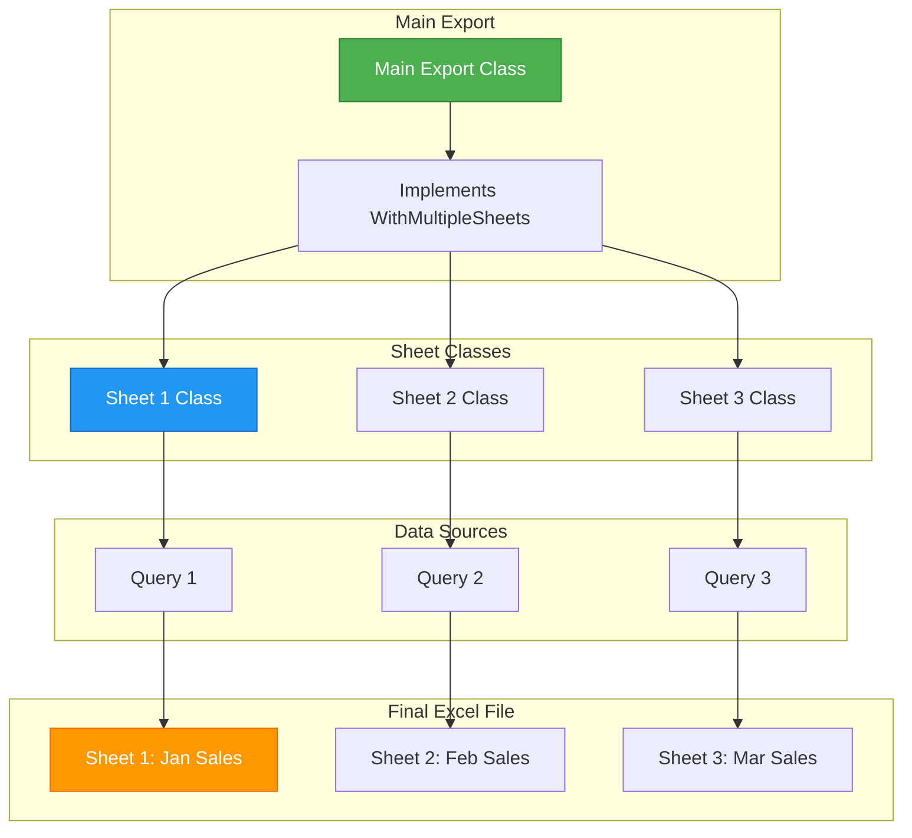
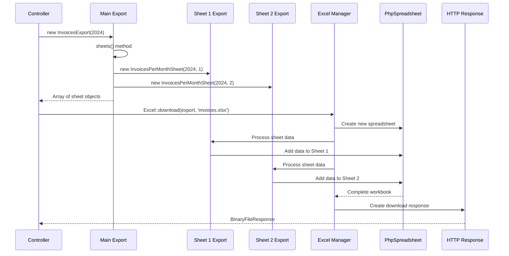
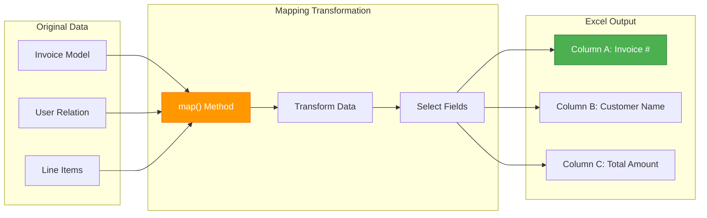
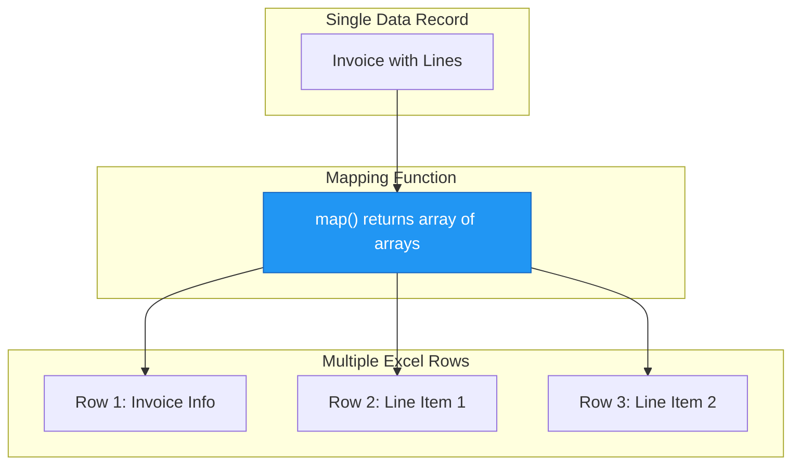
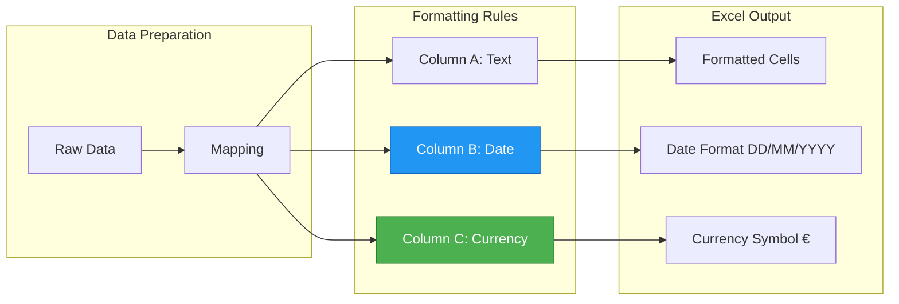
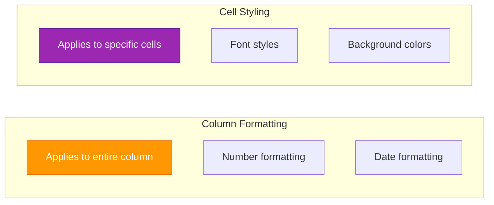
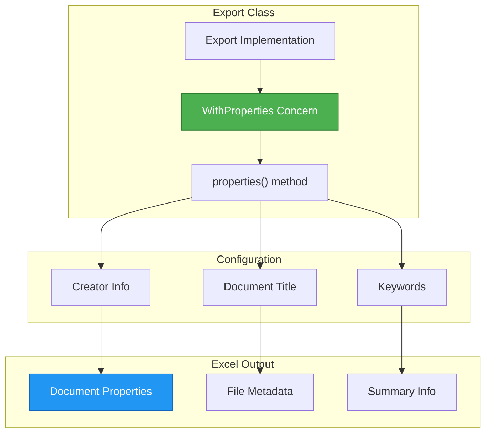
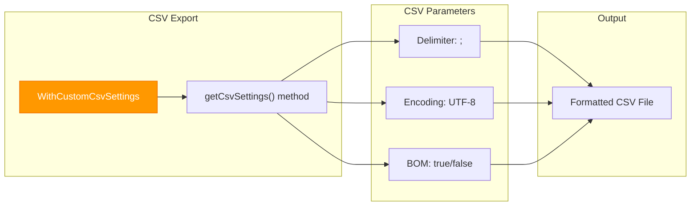
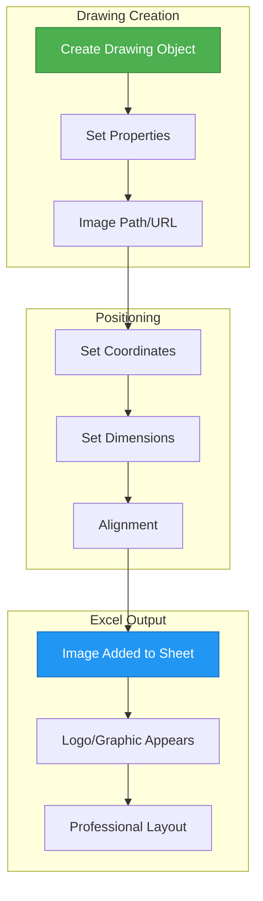
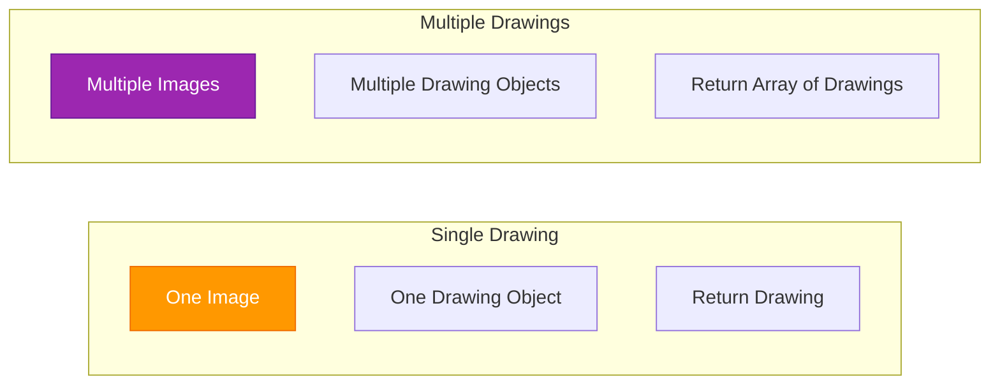

# Advanced Export Features | Laravel Excel

## File Path: laravel-8.x/excel/4-advanced-features.md

---

## Table of Contents
- [Introduction](#introduction)
- [Technical Definitions](#technical-definitions)
- [Multiple Sheets Visualization](#multiple-sheets-visualization)
- [Exporting Multiple Sheets](#exporting-multiple-sheets)
- [Data Mapping Visualization](#data-mapping-visualization)
- [Mapping Data](#mapping-data)
- [Column Formatting Visualization](#column-formatting-visualization)
- [Column Formatting](#column-formatting)
- [Settings Configuration Visualization](#settings-configuration-visualization)
- [Export Settings](#export-settings)
- [Drawings Visualization](#drawings-visualization)
- [Adding Drawings](#adding-drawings)
- [Best Practices](#best-practices)

---

## Introduction

Advanced export features in Laravel Excel provide powerful capabilities for creating sophisticated Excel files. This guide covers four essential advanced topics:

1. **Multiple Sheets** - Creating Excel files with multiple worksheets
2. **Data Mapping** - Transforming data before export 
3. **Column Formatting** - Customizing column appearance and behavior
4. **Export Settings** - Configuring document properties and CSV settings
5. **Drawings** - Adding images and logos to your spreadsheets

These features enable you to create professional-grade Excel exports with complex layouts and rich formatting.

---

## Technical Definitions

### WithMultipleSheets Concern
The **WithMultipleSheets** concern enables exports to contain multiple worksheets. It requires implementing a `sheets()` method that returns an array of sheet export objects, each representing a separate worksheet in the final Excel file.

### WithMapping Concern
The **WithMapping** concern allows transforming data before it's written to the Excel file. It requires implementing a `map()` method that receives each data item and returns the array of values to be exported, giving you control over the actual source for each column.

### WithHeadings Concern
The **WithHeadings** concern adds heading rows to exported data. It requires implementing a `headings()` method that returns an array of column headers for the first row of the worksheet.

### WithColumnFormatting Concern
The **WithColumnFormatting** concern enables custom formatting for entire columns. It requires implementing a `columnFormats()` method that returns an array mapping column letters to format specifications using PhpSpreadsheet's NumberFormat constants.

### WithStyles Concern
The **WithStyles** concern provides fine-grained control over cell styling. It requires implementing a `styles()` method that returns an array of styling rules applied to specific rows, columns, or cells.

### WithProperties Concern
The **WithProperties** concern allows setting document properties like title, description, creator, keywords, etc. It requires implementing a `properties()` method that returns an associative array of document metadata.

### WithCustomCsvSettings Concern
The **WithCustomCsvSettings** concern enables custom CSV export configurations. It requires implementing a `getCsvSettings()` method that returns an array of CSV-specific settings like delimiter, encoding, and line endings.

### WithDrawings Concern
The **WithDrawings** concern adds image support to worksheets. It requires implementing a `drawings()` method that returns a Drawing instance or an array of Drawing instances to be added to the worksheet.

---

## Multiple Sheets Visualization

### Multiple Sheets Architecture


### Multiple Sheets Process Flow


---

## Exporting Multiple Sheets

### Creating a Multi-Sheet Export

The `WithMultipleSheets` concern allows you to create Excel files with multiple worksheets. Each sheet can contain different data or represent different aspects of the same dataset.

```php
// File Path: app/Exports/InvoicesExport.php
<?php

namespace App\Exports;

use Maatwebsite\Excel\Concerns\Exportable;
use Maatwebsite\Excel\Concerns\WithMultipleSheets;

class InvoicesExport implements WithMultipleSheets
{
    use Exportable;

    protected $year;
    
    public function __construct(int $year)
    {
        $this->year = $year;
    }

    /**
     * @return array
     */
    public function sheets(): array
    {
        $sheets = [];

        // Create a sheet for each month of the year
        for ($month = 1; $month <= 12; $month++) {
            $sheets[] = new InvoicesPerMonthSheet($this->year, $month);
        }

        return $sheets;
    }
}
```

### Creating Individual Sheet Classes

Each sheet in a multi-sheet export is represented by its own class that implements the appropriate concerns for that sheet's data.

```php
// File Path: app/Exports/Sheets/InvoicesPerMonthSheet.php
<?php

namespace App\Exports\Sheets;

use App\Models\Invoice;
use Maatwebsite\Excel\Concerns\FromQuery;
use Maatwebsite\Excel\Concerns\WithTitle;

class InvoicesPerMonthSheet implements FromQuery, WithTitle
{
    private $month;
    private $year;

    public function __construct(int $year, int $month)
    {
        $this->month = $month;
        $this->year  = $year;
    }

    /**
     * @return \Illuminate\Database\Query\Builder
     */
    public function query()
    {
        return Invoice::query()
            ->whereYear('created_at', $this->year)
            ->whereMonth('created_at', $this->month);
    }

    /**
     * @return string
     */
    public function title(): string
    {
        return 'Month ' . $this->month;
    }
}
```

### Using the Multi-Sheet Export

```php
// File Path: app/Http/Controllers/ExportController.php
<?php

namespace App\Http\Controllers;

use App\Exports\InvoicesExport;

class ExportController extends Controller
{
    /**
     * Download invoices with 12 monthly sheets.
     * 
     * @return \Symfony\Component\HttpFoundation\BinaryFileResponse
     */
    public function downloadMonthlyInvoices()
    {
        return (new InvoicesExport(2024))->download('invoices.xlsx');
    }
}
```

### Advanced Multi-Sheet Example

For more complex scenarios, you can create different types of sheets within the same export:

```php
// File Path: app/Exports/FinancialReportExport.php
<?php

namespace App\Exports;

use Maatwebsite\Excel\Concerns\WithMultipleSheets;
use App\Exports\Sheets\SalesSheet;
use App\Exports\Sheets\ExpensesSheet;
use App\Exports\Sheets\ProfitLossSheet;

class FinancialReportExport implements WithMultipleSheets
{
    protected $year;
    
    public function __construct(int $year)
    {
        $this->year = $year;
    }

    public function sheets(): array
    {
        return [
            new SalesSheet($this->year),
            new ExpensesSheet($this->year),
            new ProfitLossSheet($this->year),
        ];
    }
}
```

---

## Data Mapping Visualization

### Data Mapping Process


### Multiple Rows Mapping


---

## Mapping Data

### Basic Data Mapping

The `WithMapping` concern gives you control over how data is transformed before being written to the Excel file. This is especially useful when working with Eloquent models and their relationships.

```php
// File Path: app/Exports/InvoicesExport.php
<?php

namespace App\Exports;

use App\Models\Invoice;
use Maatwebsite\Excel\Concerns\FromQuery;
use Maatwebsite\Excel\Concerns\WithMapping;
use PhpOffice\PhpSpreadsheet\Shared\Date;

class InvoicesExport implements FromQuery, WithMapping
{    
    /**
     * @return \Illuminate\Database\Query\Builder
     */
    public function query()
    {
        return Invoice::query();
    }
    
    /**
     * Map each invoice record to an array of values.
     * 
     * @param Invoice $invoice
     * @return array
     */
    public function map($invoice): array
    {
        return [
            $invoice->invoice_number,
            $invoice->user->name ?? 'N/A',
            Date::dateTimeToExcel($invoice->created_at),
            $invoice->total,
        ];
    }
}
```

### Advanced Data Mapping with Relationships

```php
// File Path: app/Exports/OrderExport.php
<?php

namespace App\Exports;

use App\Models\Order;
use Maatwebsite\Excel\Concerns\FromQuery;
use Maatwebsite\Excel\Concerns\WithMapping;
use PhpOffice\PhpSpreadsheet\Shared\Date;

class OrderExport implements FromQuery, WithMapping
{
    /**
     * @return \Illuminate\Database\Query\Builder
     */
    public function query()
    {
        return Order::query()->with(['customer', 'orderLines']);
    }
    
    /**
     * Transform order data with customer and line details.
     * 
     * @param Order $order
     * @return array
     */
    public function map($order): array
    {
        return [
            $order->id,
            $order->order_number,
            $order->customer->name,
            $order->customer->email,
            $order->orderLines->count(),
            $order->orderLines->sum('total'),
            Date::dateTimeToExcel($order->created_at),
        ];
    }
}
```

### Multiple Rows per Record

You can return multiple rows for a single data record by returning an array of arrays from the map method:

```php
// File Path: app/Exports/InvoiceWithLinesExport.php
<?php

namespace App\Exports;

use App\Models\Invoice;
use Maatwebsite\Excel\Concerns\FromQuery;
use Maatwebsite\Excel\Concerns\WithMapping;
use PhpOffice\PhpSpreadsheet\Shared\Date;

class InvoiceWithLinesExport implements FromQuery, WithMapping
{    
    /**
     * @return \Illuminate\Database\Query\Builder
     */
    public function query()
    {
        return Invoice::query()->with('lines');
    }
    
    /**
     * Return multiple rows for each invoice - one for header, one for each line item.
     * 
     * @param Invoice $invoice
     * @return array
     */
    public function map($invoice): array
    {
        $rows = [];
        
        // Add header row for the invoice
        $rows[] = [
            'INVOICE: ' . $invoice->invoice_number,
            '',
            '',
            '',
        ];
        
        // Add a row for each line item
        foreach ($invoice->lines as $line) {
            $rows[] = [
                $line->id,
                $line->description,
                $line->quantity,
                $line->price,
            ];
        }
        
        // Add total row
        $rows[] = [
            '',
            '',
            'TOTAL:',
            $invoice->total,
        ];
        
        return $rows;
    }
}
```

### Adding Heading Rows

Combine mapping with headings using the `WithHeadings` concern:

```php
// File Path: app/Exports/InvoicesWithHeadingsExport.php
<?php

namespace App\Exports;

use App\Models\Invoice;
use Maatwebsite\Excel\Concerns\FromQuery;
use Maatwebsite\Excel\Concerns\WithMapping;
use Maatwebsite\Excel\Concerns\WithHeadings;
use PhpOffice\PhpSpreadsheet\Shared\Date;

class InvoicesWithHeadingsExport implements FromQuery, WithMapping, WithHeadings
{    
    /**
     * @return \Illuminate\Database\Query\Builder
     */
    public function query()
    {
        return Invoice::query();
    }
    
    /**
     * @param Invoice $invoice
     * @return array
     */
    public function map($invoice): array
    {
        return [
            $invoice->id,
            $invoice->invoice_number,
            $invoice->user->name ?? 'N/A',
            $invoice->total,
            $invoice->status,
        ];
    }
    
    /**
     * Define the column headings.
     * 
     * @return array
     */
    public function headings(): array
    {
        return [
            '#',
            'Invoice Number',
            'Customer',
            'Total',
            'Status',
        ];
    }
}
```

### Preparing Rows Before Mapping

Use the `prepareRows` method to modify data before mapping:

```php
// File Path: app/Exports/UsersExport.php
<?php

namespace App\Exports;

use App\Models\User;
use Maatwebsite\Excel\Concerns\FromQuery;
use Maatwebsite\Excel\Concerns\WithMapping;
use Maatwebsite\Excel\Concerns\WithHeadings;

class UsersExport implements FromQuery, WithMapping, WithHeadings
{    
    /**
     * @return \Illuminate\Database\Query\Builder
     */
    public function query()
    {
        return User::query();
    }
    
    /**
     * Prepare rows before mapping.
     * 
     * @param \Illuminate\Support\Collection $rows
     * @return \Illuminate\Support\Collection
     */
    public function prepareRows($rows)
    {
        return $rows->transform(function ($user) {
            // Add computed properties before mapping
            $user->full_name = $user->first_name . ' ' . $user->last_name;
            $user->is_active_status = $user->is_active ? 'Active' : 'Inactive';
            
            return $user;
        });
    }
    
    /**
     * @param User $user
     * @return array
     */
    public function map($user): array
    {
        return [
            $user->id,
            $user->full_name,
            $user->email,
            $user->is_active_status,
            $user->created_at->format('Y-m-d'),
        ];
    }
    
    public function headings(): array
    {
        return [
            'ID',
            'Full Name',
            'Email',
            'Status',
            'Created Date',
        ];
    }
}
```

---

## Column Formatting Visualization

### Column Formatting Architecture


### Styling vs Formatting Comparison


---

## Column Formatting

### Basic Column Formatting

Use the `WithColumnFormatting` concern to apply number formatting to entire columns:

```php
// File Path: app/Exports/InvoicesExport.php
<?php

namespace App\Exports;

use App\Models\Invoice;
use PhpOffice\PhpSpreadsheet\Shared\Date;
use PhpOffice\PhpSpreadsheet\Style\NumberFormat;
use Maatwebsite\Excel\Concerns\FromQuery;
use Maatwebsite\Excel\Concerns\WithMapping;
use Maatwebsite\Excel\Concerns\WithColumnFormatting;

class InvoicesExport implements FromQuery, WithMapping, WithColumnFormatting
{
    /**
     * @return \Illuminate\Database\Query\Builder
     */
    public function query()
    {
        return Invoice::query();
    }
    
    /**
     * @param Invoice $invoice
     * @return array
     */
    public function map($invoice): array
    {
        return [
            $invoice->invoice_number,
            Date::dateTimeToExcel($invoice->created_at),
            $invoice->total
        ];
    }
    
    /**
     * Define column formats using PhpSpreadsheet constants.
     * 
     * @return array
     */
    public function columnFormats(): array
    {
        return [
            'B' => NumberFormat::FORMAT_DATE_DDMMYYYY,
            'C' => NumberFormat::FORMAT_CURRENCY_EUR_SIMPLE,
        ];
    }
}
```

### Advanced Column Formatting

```php
// File Path: app/Exports/FinancialExport.php
<?php

namespace App\Exports;

use App\Models\Transaction;
use PhpOffice\PhpSpreadsheet\Shared\Date;
use PhpOffice\PhpSpreadsheet\Style\NumberFormat;
use Maatwebsite\Excel\Concerns\FromQuery;
use Maatwebsite\Excel\Concerns\WithMapping;
use Maatwebsite\Excel\Concerns\WithColumnFormatting;
use Maatwebsite\Excel\Concerns\WithHeadings;

class FinancialExport implements FromQuery, WithMapping, WithColumnFormatting, WithHeadings
{
    /**
     * @return \Illuminate\Database\Query\Builder
     */
    public function query()
    {
        return Transaction::query();
    }
    
    /**
     * @param Transaction $transaction
     * @return array
     */
    public function map($transaction): array
    {
        return [
            $transaction->id,
            $transaction->description,
            Date::dateTimeToExcel($transaction->date),
            $transaction->amount,
            $transaction->balance,
        ];
    }
    
    public function columnFormats(): array
    {
        return [
            'C' => NumberFormat::FORMAT_DATE_YYYYMMDD2,
            'D' => NumberFormat::FORMAT_CURRENCY_USD_SIMPLE,
            'E' => NumberFormat::FORMAT_CURRENCY_USD,
        ];
    }
    
    public function headings(): array
    {
        return [
            'ID',
            'Description',
            'Date',
            'Amount',
            'Balance',
        ];
    }
}
```

### Auto-sizing Columns

Use the `ShouldAutoSize` concern to automatically adjust column widths:

```php
// File Path: app/Exports/AutoSizedExport.php
<?php

namespace App\Exports;

use App\Models\User;
use Maatwebsite\Excel\Concerns\FromQuery;
use Maatwebsite\Excel\Concerns\WithMapping;
use Maatwebsite\Excel\Concerns\WithHeadings;
use Maatwebsite\Excel\Concerns\ShouldAutoSize;

class AutoSizedExport implements FromQuery, WithMapping, WithHeadings, ShouldAutoSize
{
    /**
     * @return \Illuminate\Database\Query\Builder
     */
    public function query()
    {
        return User::query();
    }
    
    /**
     * @param User $user
     * @return array
     */
    public function map($user): array
    {
        return [
            $user->id,
            $user->name,
            $user->email,
            $user->created_at->format('Y-m-d'),
        ];
    }
    
    public function headings(): array
    {
        return [
            'ID',
            'Name',
            'Email',
            'Created Date',
        ];
    }
}
```

### Manual Column Widths

For more control, use `WithColumnWidths` to set specific column widths:

```php
// File Path: app/Exports/CustomWidthsExport.php
<?php

namespace App\Exports;

use App\Models\User;
use Maatwebsite\Excel\Concerns\FromQuery;
use Maatwebsite\Excel\Concerns\WithMapping;
use Maatwebsite\Excel\Concerns\WithHeadings;
use Maatwebsite\Excel\Concerns\WithColumnWidths;

class CustomWidthsExport implements FromQuery, WithMapping, WithHeadings, WithColumnWidths
{
    /**
     * @return \Illuminate\Database\Query\Builder
     */
    public function query()
    {
        return User::query();
    }
    
    /**
     * @param User $user
     * @return array
     */
    public function map($user): array
    {
        return [
            $user->id,
            $user->name,
            $user->email,
            $user->created_at->format('Y-m-d'),
        ];
    }
    
    public function headings(): array
    {
        return [
            'ID',
            'Full Name',
            'Email Address',
            'Registration Date',
        ];
    }
    
    /**
     * Set custom column widths in pixels.
     * 
     * @return array
     */
    public function columnWidths(): array
    {
        return [
            'A' => 10,  // ID column
            'B' => 25,  // Name column
            'C' => 40,  // Email column
            'D' => 20,  // Date column
        ];
    }
}
```

### Cell Styling

Use `WithStyles` for detailed cell styling:

```php
// File Path: app/Exports/StyledExport.php
<?php

namespace App\Exports;

use App\Models\Invoice;
use PhpOffice\PhpSpreadsheet\Worksheet\Worksheet;
use Maatwebsite\Excel\Concerns\FromQuery;
use Maatwebsite\Excel\Concerns\WithMapping;
use Maatwebsite\Excel\Concerns\WithHeadings;
use Maatwebsite\Excel\Concerns\WithStyles;

class StyledExport implements FromQuery, WithMapping, WithHeadings, WithStyles
{
    /**
     * @return \Illuminate\Database\Query\Builder
     */
    public function query()
    {
        return Invoice::query();
    }
    
    /**
     * @param Invoice $invoice
     * @return array
     */
    public function map($invoice): array
    {
        return [
            $invoice->id,
            $invoice->invoice_number,
            $invoice->total,
            $invoice->status,
        ];
    }
    
    public function headings(): array
    {
        return [
            'ID',
            'Invoice Number',
            'Total',
            'Status',
        ];
    }
    
    /**
     * Apply styles to specific cells, rows, or columns.
     * 
     * @param Worksheet $sheet
     * @return array
     */
    public function styles(Worksheet $sheet)
    {
        return [
            // Style the first row (headings) as bold
            1 => ['font' => ['bold' => true]],
            
            // Style column C (totals) with larger font
            'C' => ['font' => ['size' => 12]],
            
            // Style specific cells
            'D2:D100' => ['fill' => [
                'fillType' => \PhpOffice\PhpSpreadsheet\Style\Fill::FILL_SOLID,
                'startColor' => ['argb' => 'FFCCFFCC']
            ]],
        ];
    }
}
```

### Combining Formatting Techniques

```php
// File Path: app/Exports/CompleteFormattingExport.php
<?php

namespace App\Exports;

use App\Models\Employee;
use PhpOffice\PhpSpreadsheet\Shared\Date;
use PhpOffice\PhpSpreadsheet\Style\NumberFormat;
use PhpOffice\PhpSpreadsheet\Worksheet\Worksheet;
use Maatwebsite\Excel\Concerns\FromQuery;
use Maatwebsite\Excel\Concerns\WithMapping;
use Maatwebsite\Excel\Concerns\WithHeadings;
use Maatwebsite\Excel\Concerns\WithColumnFormatting;
use Maatwebsite\Excel\Concerns\WithColumnWidths;
use Maatwebsite\Excel\Concerns\WithStyles;
use Maatwebsite\Excel\Concerns\ShouldAutoSize;

class CompleteFormattingExport implements 
    FromQuery, 
    WithMapping, 
    WithHeadings, 
    WithColumnFormatting, 
    WithColumnWidths, 
    WithStyles,
    ShouldAutoSize
{
    /**
     * @return \Illuminate\Database\Query\Builder
     */
    public function query()
    {
        return Employee::query();
    }
    
    /**
     * @param Employee $employee
     * @return array
     */
    public function map($employee): array
    {
        return [
            $employee->id,
            $employee->first_name . ' ' . $employee->last_name,
            $employee->email,
            $employee->salary,
            Date::dateTimeToExcel($employee->hire_date),
        ];
    }
    
    public function headings(): array
    {
        return [
            'ID',
            'Full Name',
            'Email',
            'Salary',
            'Hire Date',
        ];
    }
    
    public function columnFormats(): array
    {
        return [
            'D' => NumberFormat::FORMAT_CURRENCY_USD,
            'E' => NumberFormat::FORMAT_DATE_YYYYMMDD,
        ];
    }
    
    public function columnWidths(): array
    {
        return [
            'A' => 10,
            'B' => 25,
            'C' => 35,
            'D' => 15,
            'E' => 15,
        ];
    }
    
    public function styles(Worksheet $sheet)
    {
        return [
            // Bold header row
            1 => [
                'font' => ['bold' => true],
                'fill' => [
                    'fillType' => \PhpOffice\PhpSpreadsheet\Style\Fill::FILL_SOLID,
                    'startColor' => ['argb' => 'FF366092'],
                ],
                'font' => [
                    'color' => ['argb' => 'FFFFFFFF'],
                ]
            ],
        ];
    }
}
```

---

## Settings Configuration Visualization

### Document Properties Flow


### CSV Settings Configuration


---

## Export Settings

### Document Properties

Use the `WithProperties` concern to set document metadata:

```php
// File Path: app/Exports/InvoicesExport.php
<?php

namespace App\Exports;

use App\Models\Invoice;
use Maatwebsite\Excel\Concerns\FromQuery;
use Maatwebsite\Excel\Concerns\WithProperties;

class InvoicesExport implements FromQuery, WithProperties
{    
    /**
     * @return \Illuminate\Database\Query\Builder
     */
    public function query()
    {
        return Invoice::query();
    }
    
    /**
     * Define document properties.
     * 
     * @return array
     */
    public function properties(): array
    {
        return [
            'creator'        => 'Your Company Name',
            'lastModifiedBy' => 'System Administrator',
            'title'          => 'Monthly Invoices Report',
            'description'    => 'Detailed invoice information for the selected period',
            'subject'        => 'Invoice Data',
            'keywords'       => 'invoices,reports,finance,export',
            'category'       => 'Financial Reports',
            'manager'        => 'Finance Department',
            'company'        => 'Your Company Ltd',
        ];
    }
}
```

### Partial Properties Update

You don't need to return all properties - only those you want to override:

```php
// File Path: app/Exports/SimplePropertiesExport.php
<?php

namespace App\Exports;

use App\Models\Invoice;
use Maatwebsite\Excel\Concerns\FromQuery;
use Maatwebsite\Excel\Concerns\WithProperties;

class SimplePropertiesExport implements FromQuery, WithProperties
{    
    /**
     * @return \Illuminate\Database\Query\Builder
     */
    public function query()
    {
        return Invoice::query();
    }
    
    public function properties(): array
    {
        // Only override specific properties
        return [
            'creator' => 'Finance Team',
            'title'   => 'Sales Report',
        ];
    }
}
```

### Custom CSV Settings

Use `WithCustomCsvSettings` to configure CSV export behavior:

```php
// File Path: app/Exports/CustomCsvExport.php
<?php

namespace App\Exports;

use App\Models\DataEntry;
use Maatwebsite\Excel\Concerns\FromQuery;
use Maatwebsite\Excel\Concerns\WithCustomCsvSettings;

class CustomCsvExport implements FromQuery, WithCustomCsvSettings
{    
    /**
     * @return \Illuminate\Database\Query\Builder
     */
    public function query()
    {
        return DataEntry::query();
    }
    
    /**
     * Define custom CSV settings.
     * 
     * @return array
     */
    public function getCsvSettings(): array
    {
        return [
            'delimiter' => ';',                    // Use semicolon as delimiter
            'enclosure' => '"',                    // Use double quotes for enclosure
            'line_ending' => "\r\n",              // Use Windows-style line endings
            'use_bom' => true,                     // Add Byte Order Mark
            'include_separator_line' => false,     // Don't include separator line
            'excel_compatibility' => false,        // Don't use Excel compatibility mode
            'output_encoding' => 'UTF-8',          // Output encoding
        ];
    }
}
```

### Common CSV Settings

Different CSV configurations for various systems:

```php
// File Path: app/Exports/SystemSpecificCsvExport.php
<?php

namespace App\Exports;

use App\Models\Customer;
use Maatwebsite\Excel\Concerns\FromQuery;
use Maatwebsite\Excel\Concerns\WithCustomCsvSettings;

class SystemSpecificCsvExport implements FromQuery, WithCustomCsvSettings
{    
    protected $systemType;
    
    public function __construct(string $systemType = 'generic')
    {
        $this->systemType = $systemType;
    }
    
    /**
     * @return \Illuminate\Database\Query\Builder
     */
    public function query()
    {
        return Customer::query();
    }
    
    public function getCsvSettings(): array
    {
        switch ($this->systemType) {
            case 'excel':
                return [
                    'delimiter' => ',',
                    'use_bom' => true,
                    'output_encoding' => 'UTF-8',
                ];
                
            case 'german':
                return [
                    'delimiter' => ';',
                    'enclosure' => '"',
                    'output_encoding' => 'ISO-8859-1',
                ];
                
            case 'tab_separated':
                return [
                    'delimiter' => "\t",
                    'enclosure' => '',
                ];
                
            default:
                return [
                    'delimiter' => ',',
                    'enclosure' => '"',
                    'line_ending' => "\n",
                    'use_bom' => false,
                ];
        }
    }
}
```

---

## Drawings Visualization

### Drawing Architecture


### Single vs Multiple Drawings


---

## Adding Drawings

### Adding a Single Drawing

Use the `WithDrawings` concern to add images to your Excel file:

```php
// File Path: app/Exports/InvoicesWithLogoExport.php
<?php

namespace App\Exports;

use App\Models\Invoice;
use Maatwebsite\Excel\Concerns\FromQuery;
use Maatwebsite\Excel\Concerns\WithDrawings;
use PhpOffice\PhpSpreadsheet\Worksheet\Drawing;

class InvoicesWithLogoExport implements FromQuery, WithDrawings
{
    /**
     * @return \Illuminate\Database\Query\Builder
     */
    public function query()
    {
        return Invoice::query();
    }
    
    /**
     * Add a drawing (logo) to the worksheet.
     * 
     * @return \PhpOffice\PhpSpreadsheet\Worksheet\BaseDrawing|\PhpOffice\PhpSpreadsheet\Worksheet\BaseDrawing[]
     */
    public function drawings()
    {
        $drawing = new Drawing();
        $drawing->setName('Company Logo');
        $drawing->setDescription('Company logo for branding');
        $drawing->setPath(public_path('/images/company-logo.png'));
        $drawing->setHeight(90);
        $drawing->setCoordinates('B3');

        return $drawing;
    }
}
```

### Adding Multiple Drawings

You can add multiple images by returning an array of Drawing objects:

```php
// File Path: app/Exports/ReportWithMultipleImagesExport.php
<?php

namespace App\Exports;

use App\Models\Report;
use Maatwebsite\Excel\Concerns\FromQuery;
use Maatwebsite\Excel\Concerns\WithDrawings;
use PhpOffice\PhpSpreadsheet\Worksheet\Drawing;

class ReportWithMultipleImagesExport implements FromQuery, WithDrawings
{
    /**
     * @return \Illuminate\Database\Query\Builder
     */
    public function query()
    {
        return Report::query();
    }
    
    /**
     * Add multiple drawings to the worksheet.
     * 
     * @return \PhpOffice\PhpSpreadsheet\Worksheet\BaseDrawing[]
     */
    public function drawings()
    {
        $logo = new Drawing();
        $logo->setName('Company Logo');
        $logo->setDescription('Company logo');
        $logo->setPath(public_path('/images/logo.png'));
        $logo->setHeight(50);
        $logo->setCoordinates('B3');

        $signature = new Drawing();
        $signature->setName('Manager Signature');
        $signature->setDescription('Manager signature');
        $signature->setPath(public_path('/images/signature.png'));
        $signature->setHeight(40);
        $signature->setCoordinates('G2');

        return [$logo, $signature];
    }
}
```

### Adding Remote Images

Use `MemoryDrawing` to add images from URLs:

```php
// File Path: app/Exports/RemoteImageExport.php
<?php

namespace App\Exports;

use App\Models\Product;
use Maatwebsite\Excel\Concerns\FromQuery;
use Maatwebsite\Excel\Concerns\WithDrawings;
use PhpOffice\PhpSpreadsheet\Worksheet\MemoryDrawing;

class RemoteImageExport implements FromQuery, WithDrawings
{
    /**
     * @return \Illuminate\Database\Query\Builder
     */
    public function query()
    {
        return Product::query();
    }
    
    /**
     * Add a remote image to the worksheet.
     * 
     * @return \PhpOffice\PhpSpreadsheet\Worksheet\BaseDrawing
     */
    public function drawings()
    {
        // Fetch remote image
        $imageUrl = 'https://example.com/images/product-logo.png';
        
        // Create image resource from URL
        if (!$imageResource = @imagecreatefromstring(file_get_contents($imageUrl))) {
            throw new \Exception('The image URL cannot be converted into an image resource.');
        }

        $drawing = new MemoryDrawing();
        $drawing->setName('Product Logo');
        $drawing->setDescription('Product logo from remote URL');
        $drawing->setImageResource($imageResource);
        $drawing->setHeight(90);
        $drawing->setCoordinates('B3');

        // Clean up memory
        imagedestroy($imageResource);

        return $drawing;
    }
}
```

### Advanced Drawing Configuration

More detailed drawing configuration with positioning and sizing:

```php
// File Path: app/Exports/AdvancedDrawingsExport.php
<?php

namespace App\Exports;

use App\Models\Report;
use Maatwebsite\Excel\Concerns\FromQuery;
use Maatwebsite\Excel\Concerns\WithDrawings;
use PhpOffice\PhpSpreadsheet\Worksheet\Drawing;

class AdvancedDrawingsExport implements FromQuery, WithDrawings
{
    /**
     * @return \Illuminate\Database\Query\Builder
     */
    public function query()
    {
        return Report::query();
    }
    
    public function drawings()
    {
        $drawing = new Drawing();
        $drawing->setName('Header Image');
        $drawing->setDescription('Company header image');
        $drawing->setPath(public_path('/images/header-bg.jpg'));
        $drawing->setWidth(800);        // Set exact width
        $drawing->setHeight(120);       // Set exact height
        $drawing->setOffsetX(10);       // Horizontal offset
        $drawing->setOffsetY(5);        // Vertical offset
        $drawing->setCoordinates('A1'); // Cell position
        $drawing->setResizeProportional(false); // Allow non-proportional resize
        
        return $drawing;
    }
}
```

### Complete Example with All Advanced Features

```php
// File Path: app/Exports/ProfessionalReportExport.php
<?php

namespace App\Exports;

use App\Models\Invoice;
use PhpOffice\PhpSpreadsheet\Shared\Date;
use PhpOffice\PhpSpreadsheet\Style\NumberFormat;
use PhpOffice\PhpSpreadsheet\Worksheet\Worksheet;
use PhpOffice\PhpSpreadsheet\Worksheet\Drawing;
use Maatwebsite\Excel\Concerns\FromQuery;
use Maatwebsite\Excel\Concerns\WithMapping;
use Maatwebsite\Excel\Concerns\WithHeadings;
use Maatwebsite\Excel\Concerns\WithColumnFormatting;
use Maatwebsite\Excel\Concerns\WithStyles;
use Maatwebsite\Excel\Concerns\WithProperties;
use Maatwebsite\Excel\Concerns\WithDrawings;

class ProfessionalReportExport implements 
    FromQuery,
    WithMapping,
    WithHeadings,
    WithColumnFormatting,
    WithStyles,
    WithProperties,
    WithDrawings
{
    /**
     * @return \Illuminate\Database\Query\Builder
     */
    public function query()
    {
        return Invoice::query()->with('user');
    }
    
    /**
     * @param Invoice $invoice
     * @return array
     */
    public function map($invoice): array
    {
        return [
            $invoice->id,
            $invoice->invoice_number,
            $invoice->user->name ?? 'N/A',
            $invoice->total,
            Date::dateTimeToExcel($invoice->created_at),
        ];
    }
    
    public function headings(): array
    {
        return [
            'ID',
            'Invoice Number',
            'Customer',
            'Total',
            'Date',
        ];
    }
    
    public function columnFormats(): array
    {
        return [
            'D' => NumberFormat::FORMAT_CURRENCY_USD,
            'E' => NumberFormat::FORMAT_DATE_YYYYMMDD,
        ];
    }
    
    public function styles(Worksheet $sheet)
    {
        return [
            // Style header row
            1 => [
                'font' => ['bold' => true],
                'fill' => [
                    'fillType' => \PhpOffice\PhpSpreadsheet\Style\Fill::FILL_SOLID,
                    'startColor' => ['argb' => 'FF4472C4'],
                ],
                'font' => [
                    'color' => ['argb' => 'FFFFFFFF'],
                ]
            ],
        ];
    }
    
    public function properties(): array
    {
        return [
            'creator' => 'Finance Department',
            'title' => 'Monthly Invoice Report',
            'subject' => 'Invoice Data',
            'keywords' => 'invoices,reports,finance',
            'description' => 'Detailed invoice information for the current month',
        ];
    }
    
    public function drawings()
    {
        $logo = new Drawing();
        $logo->setName('Company Logo');
        $logo->setDescription('Company logo');
        $logo->setPath(public_path('/images/logo.png'));
        $logo->setHeight(60);
        $logo->setCoordinates('A1');

        return $logo;
    }
}
```

---

## Best Practices

### 1. Organize Your Export Classes

Structure your export classes logically with proper namespaces:

```
app/
├── Exports/
│   ├── Reports/
│   │   ├── SalesReportExport.php
│   │   ├── InventoryReportExport.php
│   │   └── FinancialReportExport.php
│   ├── Sheets/
│   │   ├── SalesSheet.php
│   │   ├── ExpensesSheet.php
│   │   └── ProfitLossSheet.php
│   ├── BaseExport.php
│   └── UsersExport.php
```

### 2. Use Concerns Appropriately

Combine concerns based on your export requirements:

```php
// File Path: app/Exports/BestPracticeExport.php
<?php

namespace App\Exports;

use App\Models\Invoice;
use PhpOffice\PhpSpreadsheet\Shared\Date;
use PhpOffice\PhpSpreadsheet\Style\NumberFormat;
use PhpOffice\PhpSpreadsheet\Worksheet\Worksheet;
use PhpOffice\PhpSpreadsheet\Worksheet\Drawing;
use Maatwebsite\Excel\Concerns\FromQuery;
use Maatwebsite\Excel\Concerns\WithMapping;
use Maatwebsite\Excel\Concerns\WithHeadings;
use Maatwebsite\Excel\Concerns\WithColumnFormatting;
use Maatwebsite\Excel\Concerns\WithStyles;
use Maatwebsite\Excel\Concerns\WithProperties;
use Maatwebsite\Excel\Concerns\WithDrawings;

class BestPracticeExport implements 
    FromQuery,
    WithMapping,
    WithHeadings,
    WithColumnFormatting,
    WithStyles,
    WithProperties,
    WithDrawings
{
    /**
     * @return \Illuminate\Database\Query\Builder
     */
    public function query()
    {
        return Invoice::query()->with('user');
    }
    
    public function map($invoice): array
    {
        return [
            $invoice->id,
            $invoice->invoice_number,
            $invoice->user->name ?? 'N/A',
            $invoice->total,
            $invoice->status,
            Date::dateTimeToExcel($invoice->created_at),
        ];
    }
    
    public function headings(): array
    {
        return [
            'ID',
            'Invoice Number',
            'Customer',
            'Total',
            'Status',
            'Date',
        ];
    }
    
    public function columnFormats(): array
    {
        return [
            'D' => NumberFormat::FORMAT_CURRENCY_USD,
            'F' => NumberFormat::FORMAT_DATE_YYYYMMDD,
        ];
    }
    
    public function styles(Worksheet $sheet)
    {
        return [
            1 => ['font' => ['bold' => true]], // Header row bold
        ];
    }
    
    public function properties(): array
    {
        return [
            'title' => 'Invoice Report',
            'subject' => 'Invoice Data',
        ];
    }
    
    public function drawings()
    {
        $drawing = new Drawing();
        $drawing->setName('Logo');
        $drawing->setDescription('Company logo');
        $drawing->setPath(public_path('/images/logo.png'));
        $drawing->setHeight(50);
        $drawing->setCoordinates('A1');

        return $drawing;
    }
}
```

### 3. Handle Large Datasets Efficiently

For large datasets, use `FromQuery` with chunking:

```php
// File Path: app/Exports/LargeDatasetExport.php
<?php

namespace App\Exports;

use App\Models\Transaction;
use Maatwebsite\Excel\Concerns\FromQuery;
use Maatwebsite\Excel\Concerns\WithMapping;
use Maatwebsite\Excel\Concerns\WithChunkReading;

class LargeDatasetExport implements FromQuery, WithMapping, WithChunkReading
{
    /**
     * @return \Illuminate\Database\Query\Builder
     */
    public function query()
    {
        return Transaction::query();
    }
    
    public function map($transaction): array
    {
        return [
            $transaction->id,
            $transaction->description,
            $transaction->amount,
        ];
    }
    
    /**
     * Define chunk size for memory efficiency.
     * 
     * @return int
     */
    public function chunkSize(): int
    {
        return 1000; // Process 1000 records at a time
    }
}
```

### 4. Common Pitfalls to Avoid

| Pitfall | Problem | Solution |
|---------|---------|----------|
| Not implementing required methods | Runtime errors | Always implement required methods for each concern |
| Using `->get()` in `FromQuery` | Memory issues | Return query builder only, not executed query |
| Missing headings | Confusing exports | Always include `WithHeadings` for clarity |
| Hardcoded file paths | Deployment issues | Use `public_path()` or config for image paths |
| No error handling | Silent failures | Wrap image operations in try-catch |

### 5. Performance Optimization Tips

```php
// File Path: app/Exports/OptimizedExport.php
<?php

namespace App\Exports;

use App\Models\User;
use Maatwebsite\Excel\Concerns\FromQuery;
use Maatwebsite\Excel\Concerns\WithMapping;
use Maatwebsite\Excel\Concerns\WithHeadings;
use Maatwebsite\Excel\Concerns\WithColumnWidths;
use Maatwebsite\Excel\Concerns\WithChunkReading;

class OptimizedExport implements 
    FromQuery, 
    WithMapping, 
    WithHeadings, 
    WithColumnWidths,
    WithChunkReading
{
    /**
     * Select only needed columns for performance.
     * 
     * @return \Illuminate\Database\Query\Builder
     */
    public function query()
    {
        return User::query()
            ->select(['id', 'name', 'email', 'created_at'])
            ->where('active', true);
    }
    
    public function map($user): array
    {
        return [
            $user->id,
            $user->name,
            $user->email,
            $user->created_at->format('Y-m-d'),
        ];
    }
    
    public function headings(): array
    {
        return ['ID', 'Name', 'Email', 'Created'];
    }
    
    public function columnWidths(): array
    {
        return [
            'A' => 10,
            'B' => 25,
            'C' => 35,
            'D' => 15,
        ];
    }
    
    public function chunkSize(): int
    {
        return 500; // Adjust based on your memory limits
    }
}
```

### 6. Testing Your Exports

Always test your export functionality:

```php
// File Path: tests/Feature/ExportTest.php
<?php

namespace Tests\Feature;

use Illuminate\Foundation\Testing\RefreshDatabase;
use Tests\TestCase;
use App\Exports\BestPracticeExport;
use Maatwebsite\Excel\Facades\Excel;

class ExportTest extends TestCase
{
    use RefreshDatabase;
    
    /** @test */
    public function it_can_export_data_correctly()
    {
        // Create test data
        factory(\App\Models\Invoice::class, 10)->create();
        
        // Test export works without errors
        $export = new BestPracticeExport();
        
        // This should not throw any exceptions
        $this->assertInstanceOf(
            \Illuminate\Http\Response::class,
            $export->download('test.xlsx')
        );
    }
}
```

---