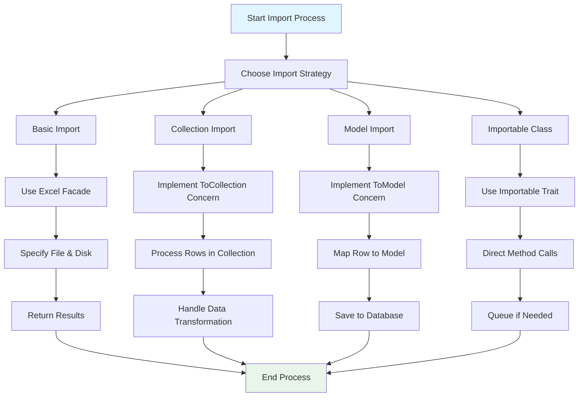
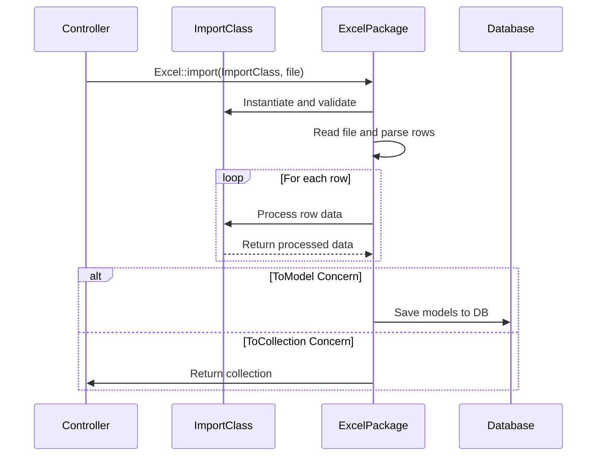

# Laravel Excel Imports: Comprehensive Guide

## File Path: `laravel-8.x/excel/import/1-imports-comprehensive-guide.md`

## Table of Contents
- [Introduction](#introduction)
- [Technical Definition](#technical-definition)
- [Visualization](#visualization)
- [Importing Basics](#importing-basics)
- [Importing to Collections](#importing-to-collections)
- [Importing to Models](#importing-to-models)
- [Importables](#importables)
- [Import Formats](#import-formats)
- [Best Practices](#best-practices)
- [Conclusion](#conclusion)

## Introduction

Laravel Excel provides a powerful and intuitive way to import data from various spreadsheet formats into your Laravel applications. This comprehensive guide covers all aspects of importing data, from basic operations to advanced techniques, helping you leverage the full potential of the Laravel Excel package.

## Technical Definition

**Laravel Excel Imports**: A feature-rich component of the Laravel Excel package that enables developers to read and transform data from various spreadsheet formats (XLSX, CSV, ODS, etc.) into PHP arrays, collections, or directly into Eloquent models. The import functionality provides multiple approaches including basic imports, collection-based imports, model imports, and importable classes with various concerns to customize behavior.

**Key Components**:
- Import classes implementing specific concerns
- Multiple import strategies (ToModel, ToCollection, OnEachRow)
- Support for various file formats
- Advanced features like upserts, skipping duplicates, and queuing

## Visualization



### Import Process Flow



## Importing Basics

### Overview
The basic import functionality allows you to import data from Excel files using custom import classes. This approach provides the foundation for more advanced import operations.

### File Reference: `app/Imports/UsersImport.php`

```php
<?php

namespace App\Imports;

use App\Models\User;
use Illuminate\Support\Facades\Hash;
use Maatwebsite\Excel\Concerns\ToModel;

class UsersImport implements ToModel
{
    /**
     * @param array $row
     *
     * @return User|null
     */
    public function model(array $row)
    {
        return new User([
           'name'     => $row[0],
           'email'    => $row[1],
           'password' => Hash::make($row[2]),
        ]);
    }
}
```

**Explanation**: This basic import class implements the `ToModel` concern, which means each row in the Excel file will be transformed into a User model. The `model()` method receives an array representing a single row and returns a new User instance.

### Importing from Default Disk

**File Reference**: Controller method using facade

```php
// In your controller
Excel::import(new UsersImport, 'users.xlsx');
```

**Explanation**: This imports the 'users.xlsx' file from the default filesystem disk configured in `config/filesystems.php`. The file should be accessible from the default disk.

### Importing from Another Disk

**File Reference**: Controller method with specific disk

```php
// Import from S3 or other configured disk
Excel::import(new UsersImport, 'users.xlsx', 's3');
```

**Explanation**: This example imports from the 's3' disk, allowing you to import files stored on cloud storage services. The disk name corresponds to configurations in `config/filesystems.php`.

### Importing Uploaded Files

**File Reference**: Controller handling file uploads

```php
// Import uploaded file directly
Excel::import(new UsersImport, request()->file('your_file'));
```

**Explanation**: This method allows direct import of files that users upload through forms, eliminating the need to store them temporarily before importing.

### Importing Full Path

**File Reference**: Import with full system path

```php
// Import using full system path
Excel::import(new UsersImport, storage_path('users.xlsx'));
```

**Explanation**: This approach bypasses Laravel's filesystem abstraction and imports directly from a full system path.

### Importing to Array or Collection

**File Reference**: Alternative import methods

```php
// Import to array
$array = Excel::toArray(new UsersImport, 'users.xlsx');

// Import to collection
$collection = Excel::toCollection(new UsersImport, 'users.xlsx');
```

**Explanation**: These methods bypass the standard import concerns and return raw data as arrays or collections, useful when you need to process data differently.

### Specifying Reader Type

**File Reference**: Explicit reader type specification

```php
// Specify reader type explicitly
Excel::import(new UsersImport, 'users.xlsx', 's3', \Maatwebsite\Excel\Excel::XLSX);
```

**Explanation**: When the file extension doesn't match the actual format, you can explicitly specify the reader type to ensure proper parsing.

## Importing to Collections

### Overview
Collection-based imports provide a simpler approach when you need to process data in bulk without immediately persisting to the database.

### File Reference: `app/Imports/UsersCollectionImport.php`

```php
namespace App\Imports;

use App\Models\User;
use Illuminate\Support\Collection;
use Maatwebsite\Excel\Concerns\ToCollection;

class UsersCollectionImport implements ToCollection
{
    public function collection(Collection $rows)
    {
        foreach ($rows as $row) 
        {
            User::create([
                'name' => $row[0],
                'email' => $row[1],
                'status' => $row[2],
            ]);
        }
    }
}
```

**Explanation**: The `ToCollection` concern passes all rows to the `collection()` method as a single Collection object. Each row is an array of cell values. This approach gives you full control over processing all rows together.

### Usage in Controller

**File Reference**: Controller method using collection import

```php
public function import() 
{
    Excel::import(new UsersCollectionImport, 'users.xlsx');
}
```

**Explanation**: This method processes the entire Excel file and passes all rows to the collection method in a single operation.

## Importing to Models

### Overview
Model imports provide direct integration with Eloquent models, enabling automatic saving and relationship handling.

### Basic Model Import

**File Reference: `app/Imports/UsersModelImport.php`**

```php
namespace App\Imports;

use App\Models\User;
use Maatwebsite\Excel\Concerns\ToModel;

class UsersModelImport implements ToModel
{
    public function model(array $row)
    {
        return new User([
            'name' => $row[0],
            'email' => $row[1],
            'age' => $row[2],
        ]);
    }
}
```

**Explanation**: The `ToModel` concern requires a `model()` method that transforms each row into an Eloquent model instance. The package automatically handles saving these models to the database.

### Upserting Models

**File Reference: `app/Imports/UsersUpsertImport.php`**

```php
namespace App\Imports;

use App\Models\User;
use Maatwebsite\Excel\Concerns\ToModel;
use Maatwebsite\Excel\Concerns\WithUpserts;

class UsersUpsertImport implements ToModel, WithUpserts
{
    public function model(array $row)
    {
        return new User([
            'email' => $row[1], // Unique identifier
            'name' => $row[0],
            'age' => $row[2],
        ]);
    }

    /**
     * @return string|array
     */
    public function uniqueBy()
    {
        return 'email';
    }
}
```

**Explanation**: The `WithUpserts` concern enables upsert functionality, where records are updated if they exist (based on the `uniqueBy()` field) or inserted if they don't.

### Upserting Specific Columns

**File Reference: `app/Imports/UsersSpecificUpsertImport.php`**

```php
namespace App\Imports;

use App\Models\User;
use Maatwebsite\Excel\Concerns\ToModel;
use Maatwebsite\Excel\Concerns\WithUpserts;
use Maatwebsite\Excel\Concerns\WithUpsertColumns;

class UsersSpecificUpsertImport implements ToModel, WithUpserts, WithUpsertColumns
{
    public function model(array $row)
    {
        return new User([
            'email' => $row[1],
            'name' => $row[0],
            'age' => $row[2],
            'updated_at' => now(),
        ]);
    }

    public function uniqueBy()
    {
        return 'email';
    }

    public function upsertColumns()
    {
        return ['name', 'age']; // Only update these columns during upsert
    }
}
```

**Explanation**: The `WithUpsertColumns` concern allows you to specify exactly which columns should be updated during an upsert operation, leaving others unchanged.

### Skipping Duplicate Rows

**File Reference: `app/Imports/UsersSkipDuplicatesImport.php`**

```php
namespace App\Imports;

use App\Models\User;
use Maatwebsite\Excel\Concerns\ToModel;
use Maatwebsite\Excel\Concerns\WithSkipDuplicates;

class UsersSkipDuplicatesImport implements ToModel, WithSkipDuplicates
{
    public function model(array $row)
    {
        return new User([
            'email' => $row[1],
            'name' => $row[0],
        ]);
    }
}
```

**Explanation**: The `WithSkipDuplicates` concern prevents duplicate records from causing errors by using Laravel's `insertOrIgnore` method.

### Conditional Row Processing

**File Reference: `app/Imports/UsersConditionalImport.php`**

```php
namespace App\Imports;

use App\Models\User;
use Maatwebsite\Excel\Concerns\ToModel;

class UsersConditionalImport implements ToModel
{
    public function model(array $row)
    {
        // Skip rows with missing required data
        if (!isset($row[0]) || empty(trim($row[0]))) {
            return null; // Skip this row
        }

        return new User([
            'name' => $row[0],
            'email' => $row[1] ?? null,
        ]);
    }
}
```

**Explanation**: Returning `null` from the `model()` method skips that particular row during the import process.

### Handling Multiple Column Names

**File Reference: `app/Imports/UsersFlexibleColumnsImport.php`**

```php
namespace App\Imports;

use App\Models\User;
use Maatwebsite\Excel\Concerns\ToModel;
use Maatwebsite\Excel\Concerns\WithHeadingRow;

class UsersFlexibleColumnsImport implements ToModel, WithHeadingRow
{
    public function model(array $row)
    {
        return new User([
            // Handle multiple possible column names using null coalescing
            'name' => $row['client_name'] ?? $row['client'] ?? $row['name'] ?? null,
            'email' => $row['email_address'] ?? $row['email'] ?? null,
        ]);
    }
}
```

**Explanation**: The `WithHeadingRow` concern treats the first row as column headers, allowing flexible mapping of different possible column names.

### Advanced Row Processing

**File Reference: `app/Imports/UsersAdvancedImport.php`**

```php
namespace App\Imports;

use App\Models\Group;
use App\Models\User;
use Maatwebsite\Excel\Row;
use Maatwebsite\Excel\Concerns\OnEachRow;

class UsersAdvancedImport implements OnEachRow
{
    public function onRow(Row $row)
    {
        $rowIndex = $row->getIndex();
        $rowData = $row->toArray();
        
        // Create or find group based on data in row
        $group = Group::firstOrCreate([
            'name' => $rowData[1], // Assuming group name is in column 1
        ]);

        // Create user and associate with group
        $user = $group->users()->create([
            'name' => $rowData[0], // Assuming user name is in column 0
            'email' => $rowData[2] ?? null,
        ]);
        
        return $user;
    }
}
```

**Explanation**: The `OnEachRow` concern provides low-level access to each row, allowing complex operations like creating related records or conditional logic.

## Importables

### Overview
The Importable trait allows import classes to become self-contained, providing convenient methods for importing, queuing, and data retrieval.

### File Reference: `app/Imports/UsersImportable.php`

```php
namespace App\Imports;

use App\Models\User;
use Maatwebsite\Excel\Concerns\ToModel;
use Maatwebsite\Excel\Concerns\Importable;

class UsersImportable implements ToModel
{
    use Importable;

    public function model(array $row)
    {
        return new User([
            'name' => $row[0],
            'email' => $row[1],
        ]);
    }
}
```

**Explanation**: The `Importable` trait adds convenience methods to your import class, allowing you to call import operations directly on the class instance.

### Direct Import Methods

**File Reference**: Using importable methods in controller

```php
// Direct import
(new UsersImportable)->import('users.xlsx', 'local', \Maatwebsite\Excel\Excel::XLSX);

// Queue the import for later processing
(new UsersImportable)->queue('users.xlsx');

// Load into array
$array = (new UsersImportable)->toArray('users.xlsx');

// Load into collection
$collection = (new UsersImportable)->toCollection('users.xlsx');
```

**Explanation**: These methods provide alternative ways to initiate imports directly from the import class instance, making the code more concise and readable.

## Import Formats

### Overview
Laravel Excel supports multiple file formats for importing data, each requiring specific reader types.

### Supported Formats and Usage

#### XLSX Format

**File Reference**: XLSX import example

```php
// Import XLSX file
(new UsersImportable)->import('users.xlsx', null, \Maatwebsite\Excel\Excel::XLSX);
```

#### CSV Format

**File Reference**: CSV import example

```php
// Import CSV file
(new UsersImportable)->import('users.csv', null, \Maatwebsite\Excel\Excel::CSV);
```

#### TSV Format

**File Reference**: TSV import example

```php
// Import TSV file
(new UsersImportable)->import('users.tsv', null, \Maatwebsite\Excel\Excel::TSV);
```

#### ODS Format

**File Reference**: ODS import example

```php
// Import ODS file
(new UsersImportable)->import('users.ods', null, \Maatwebsite\Excel\Excel::ODS);
```

#### Legacy XLS Format

**File Reference**: XLS import example

```php
// Import legacy XLS file
(new UsersImportable)->import('users.xls', null, \Maatwebsite\Excel\Excel::XLS);
```

#### Other Supported Formats

```php
// SLK format
(new UsersImportable)->import('users.slk', null, \Maatwebsite\Excel\Excel::SLK);

// XML format
(new UsersImportable)->import('users.xml', null, \Maatwebsite\Excel\Excel::XML);

// Gnumeric format
(new UsersImportable)->import('users.gnumeric', null, \Maatwebsite\Excel\Excel::GNUMERIC);

// HTML format
(new UsersImportable)->import('users.html', null, \Maatwebsite\Excel\Excel::HTML);
```

**Explanation**: Each format requires specifying the appropriate constant from the `\Maatwebsite\Excel\Excel` class to ensure proper parsing.

## Best Practices

### 1. Use Appropriate Import Strategies
- Use `ToModel` for direct model creation and saving
- Use `ToCollection` for batch processing or complex transformations
- Use `OnEachRow` for complex row-by-row operations

### 2. Handle Errors Gracefully
```php
try {
    Excel::import(new UsersImport, $request->file('users'));
    return redirect('/')->with('success', 'Import successful!');
} catch (\Maatwebsite\Excel\Validators\ValidationException $e) {
    $failures = $e->failures();
    foreach ($failures as $failure) {
        $failure->row(); // row that went wrong
        $failure->attribute(); // The attribute that went wrong
        $failure->errors(); // Actual error messages
        $failure->values(); // The values of the row that has failed.
    }
}
```

### 3. Validate Imported Data
Always validate data before importing to prevent database errors and security issues.

### 4. Use Queuing for Large Files
For large files, use queued imports to prevent timeout issues:
```php
// In your import class, implement ShouldQueue
use Illuminate\Contracts\Queue\ShouldQueue;

class UsersImport implements ToModel, ShouldQueue
{
    // Implementation remains the same
}
```

### 5. Optimize Performance
- Use batch inserts when possible
- Consider chunk reading for very large files
- Index database columns used in upsert operations

## Conclusion

Laravel Excel imports provide a robust, flexible solution for bringing spreadsheet data into your Laravel applications. From basic imports to complex data transformations, the package offers multiple approaches to suit different needs. Understanding when to use each import strategy and how to properly implement them will help you build efficient and maintainable import functionality in your applications.

The key takeaways include:
- Choose the right import strategy based on your needs
- Leverage concerns like `WithUpserts`, `WithSkipDuplicates`, and `WithHeadingRow`
- Use the `Importable` trait for cleaner code
- Consider performance implications for large datasets
- Always handle errors gracefully and validate incoming data

For next steps, explore advanced features like custom CSV settings, chunk reading, and validation during imports.