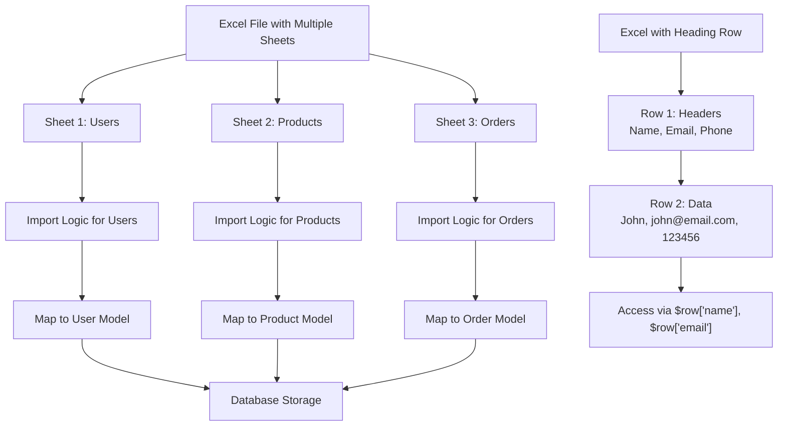
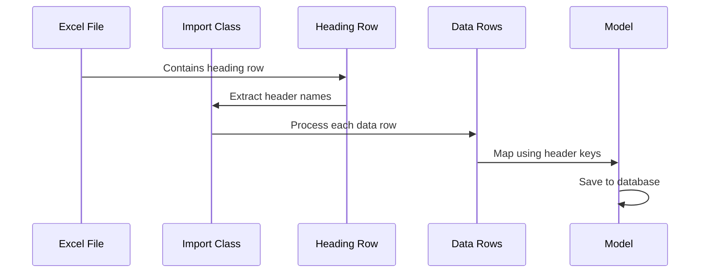

# Multiple Sheets & Heading Row Handling | Laravel Excel

**File Path:** `laravel-8.x/excel/import/2-imports-multiple-sheets-and-heading-row.md`

**Description:** Comprehensive guide to handling multiple sheets and heading rows in Laravel Excel imports

---

## Introduction

In this documentation, we'll explore two crucial aspects of Laravel Excel imports: handling multiple sheets within a single Excel file and properly managing heading rows. These features are essential when dealing with complex Excel files that contain multiple worksheets or when you need to map data based on column headers rather than numeric indices.

## Technical Definition

### Multiple Sheets Handling
Multiple sheets handling refers to the capability of processing Excel files that contain more than one worksheet. Laravel Excel provides the `WithMultipleSheets` concern that allows you to define specific import logic for each individual sheet within a file. This approach enables granular control over how different sheets are processed, validated, and stored.

### Heading Row Management
Heading row management involves using the first row (or any specified row) of an Excel file as column identifiers. Instead of accessing cell values by numeric indices (like `$row[0]`, `$row[1]`), you can access them by their column headers (like `$row['name']`, `$row['email']`). This makes your import code more readable and maintainable.

## Visualization



### Heading Row Processing Flow



## Code Examples

### 1. Basic Multiple Sheets Import

**File Path:** `app/Imports/MultipleSheetsImport.php`

```php
<?php

namespace App\Imports;

use Maatwebsite\Excel\Concerns\WithMultipleSheets;

class MultipleSheetsImport implements WithMultipleSheets 
{
    public function sheets(): array
    {
        return [
            0 => new UsersSheetImport(),
            1 => new ProductsSheetImport(),
            2 => new OrdersSheetImport(),
        ];
    }
}
```

**File Path:** `app/Imports/UsersSheetImport.php`

```php
<?php

namespace App\Imports;

use App\Models\User;
use Maatwebsite\Excel\Concerns\ToModel;
use Maatwebsite\Excel\Concerns\WithHeadingRow;

class UsersSheetImport implements ToModel, WithHeadingRow
{
    public function model(array $row)
    {
        return new User([
            'name' => $row['name'],
            'email' => $row['email'],
            'phone' => $row['phone'],
        ]);
    }
}
```

### 2. Named Sheet Selection

**File Path:** `app/Imports/NamedSheetsImport.php`

```php
<?php

namespace App\Imports;

use Maatwebsite\Excel\Concerns\WithMultipleSheets;

class NamedSheetsImport implements WithMultipleSheets 
{
    public function sheets(): array
    {
        return [
            'Users' => new UsersSheetImport(),
            'Products' => new ProductsSheetImport(),
            'Orders' => new OrdersSheetImport(),
        ];
    }
}
```

### 3. Heading Row with Custom Formatting

**File Path:** `app/Imports/UsersWithHeadingImport.php`

```php
<?php

namespace App\Imports;

use App\Models\User;
use Maatwebsite\Excel\Concerns\ToModel;
use Maatwebsite\Excel\Concerns\WithHeadingRow;

class UsersWithHeadingImport implements ToModel, WithHeadingRow
{
    public function model(array $row)
    {
        return new User([
            'name' => $row['name'],
            'email' => $row['email'],
            'age' => $row['age'],
            'status' => $row['status'],
        ]);
    }
    
    /**
     * Specify which row contains the headings
     */
    public function headingRow(): int
    {
        return 2; // Use second row as heading row
    }
}
```

### 4. Advanced Multiple Sheets with Conditional Loading

**File Path:** `app/Imports/ConditionalSheetsImport.php`

```php
<?php

namespace App\Imports;

use Maatwebsite\Excel\Concerns\WithMultipleSheets;
use Maatwebsite\Excel\Concerns\WithConditionalSheets;

class ConditionalSheetsImport implements WithMultipleSheets 
{
    use WithConditionalSheets;

    public function conditionalSheets(): array
    {
        return [
            'Users' => new UsersSheetImport(),
            'Products' => new ProductsSheetImport(),
            'Orders' => new OrdersSheetImport(),
        ];
    }
}
```

Usage example:

```php
// Import only specific sheets
$import = new ConditionalSheetsImport();
$import->onlySheets('Users', 'Orders');

Excel::import($import, 'data.xlsx');
```

### 5. Handling Duplicate Headers with Grouping

**File Path:** `app/Imports/GroupedHeadersImport.php`

```php
<?php

namespace App\Imports;

use App\Models\Product;
use Maatwebsite\Excel\Concerns\ToModel;
use Maatwebsite\Excel\Concerns\WithHeadingRow;
use Maatwebsite\Excel\Concerns\WithGroupedHeadingRow;

class GroupedHeadersImport implements ToModel, WithHeadingRow, WithGroupedHeadingRow
{
    public function model(array $row)
    {
        // Access grouped values
        $options = $row['options'] ?? []; // Will contain array of all 'Options' column values
        
        return new Product([
            'name' => $row['name'],
            'price' => $row['price'],
            'options_json' => json_encode($options),
        ]);
    }
}
```

## Best Practices

### For Multiple Sheets:
- **Organize by Purpose**: Separate different types of data into different sheets (e.g., users, products, orders)
- **Consistent Naming**: Use descriptive names for your sheet classes to make the code more readable
- **Error Handling**: Implement error handling for missing sheets using `SkipsUnknownSheets` concern
- **Memory Management**: Consider chunk reading for large sheets within the multiple sheets import

### For Heading Rows:
- **Standardize Headers**: Ensure your Excel files have consistent header names across imports
- **Case Sensitivity**: Be aware that header keys are typically lowercase when using default formatting
- **Validation**: Always validate that required headers exist before processing data
- **Documentation**: Document the expected header format for each import type

### Performance Considerations:
- Combine multiple sheets with batch inserts for better performance
- Use heading rows with indexed database columns for faster lookups
- Consider using `WithStartRow` if you know your data doesn't start immediately after headers

### Security Considerations:
- Sanitize header names to prevent injection attacks
- Validate data types when using heading-based mapping
- Implement proper authorization checks when importing sensitive data

## Conclusion

Handling multiple sheets and heading rows in Laravel Excel imports provides powerful capabilities for processing complex Excel files. By implementing the `WithMultipleSheets` concern, you can process different worksheets with specific logic tailored to each sheet's content. The `WithHeadingRow` concern allows for more readable and maintainable code by using column headers as array keys instead of numeric indices.

These features work together seamlessly, enabling you to build robust import systems that can handle complex business requirements while maintaining clean and organized code.

For more advanced scenarios, consider combining these features with other concerns like `WithBatchInserts`, `WithChunkReading`, and validation to create efficient and reliable import processes.