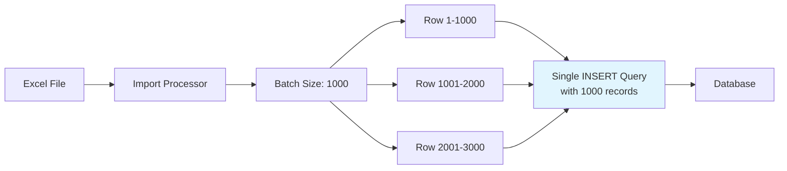
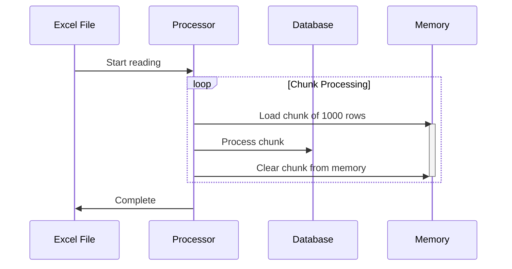
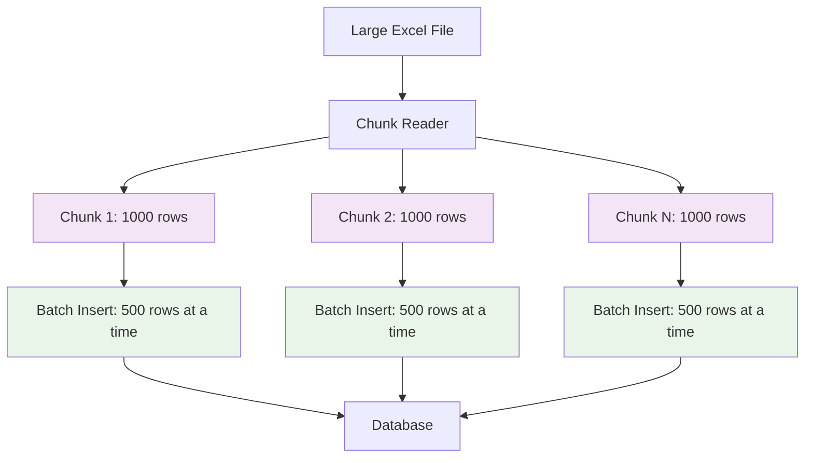

# Batch Inserts & Chunk Reading | Laravel Excel

**File Path:** `laravel-8.x/excel/import/3-imports-batch-inserts-and-chunk-reading.md`

**Description:** Optimizing Laravel Excel imports with batch inserts and chunk reading for improved performance and memory management

---

## Introduction

When dealing with large Excel files containing thousands of rows, standard import methods can become inefficient and consume excessive memory. This documentation covers two critical optimization techniques: batch inserts for database efficiency and chunk reading for memory management. These approaches work together to enable high-performance imports of large datasets while maintaining system stability.

## Technical Definition

### Batch Inserts
Batch inserts refer to the technique of grouping multiple database insert operations into a single query rather than executing individual insert statements for each record. Laravel Excel's `WithBatchInserts` concern allows you to specify a batch size that determines how many records will be inserted together, significantly reducing the number of database round trips and improving import speed.

### Chunk Reading
Chunk reading is a memory management technique that processes Excel files in smaller segments rather than loading the entire file into memory at once. The `WithChunkReading` concern reads the spreadsheet in chunks of specified size, processes each chunk, and then moves to the next, keeping memory usage under control regardless of the total file size.

## Visualization

### Batch Insert Process



### Chunk Reading Process



### Combined Approach Visualization



## Code Examples

### 1. Basic Batch Insert Implementation

**File Path:** `app/Imports/UsersBatchImport.php`

```php
<?php

namespace App\Imports;

use App\Models\User;
use Maatwebsite\Excel\Concerns\ToModel;
use Maatwebsite\Excel\Concerns\WithBatchInserts;

class UsersBatchImport implements ToModel, WithBatchInserts
{
    public function model(array $row)
    {
        return new User([
            'name' => $row[0],
            'email' => $row[1],
            'phone' => $row[2],
        ]);
    }
    
    /**
     * Define the batch size for insert operations
     */
    public function batchSize(): int
    {
        return 1000; // Insert 1000 records at a time
    }
}
```

### 2. Basic Chunk Reading Implementation

**File Path:** `app/Imports/UsersChunkImport.php`

```php
<?php

namespace App\Imports;

use App\Models\User;
use Maatwebsite\Excel\Concerns\ToModel;
use Maatwebsite\Excel\Concerns\WithChunkReading;

class UsersChunkImport implements ToModel, WithChunkReading
{
    public function model(array $row)
    {
        return new User([
            'name' => $row[0],
            'email' => $row[1],
            'phone' => $row[2],
        ]);
    }
    
    /**
     * Define the chunk size for reading
     */
    public function chunkSize(): int
    {
        return 1000; // Process 1000 rows at a time
    }
}
```

### 3. Combined Batch Insert and Chunk Reading

**File Path:** `app/Imports/OptimizedUsersImport.php`

```php
<?php

namespace App\Imports;

use App\Models\User;
use Maatwebsite\Excel\Concerns\ToModel;
use Maatwebsite\Excel\Concerns\WithBatchInserts;
use Maatwebsite\Excel\Concerns\WithChunkReading;

class OptimizedUsersImport implements ToModel, WithBatchInserts, WithChunkReading
{
    public function model(array $row)
    {
        return new User([
            'name' => $row[0],
            'email' => $row[1],
            'phone' => $row[2],
            'created_at' => now(),
        ]);
    }
    
    /**
     * Define batch size for database operations
     */
    public function batchSize(): int
    {
        return 1000;
    }
    
    /**
     * Define chunk size for memory management
     */
    public function chunkSize(): int
    {
        return 1000;
    }
}
```

### 4. Batch Upsert Implementation

**File Path:** `app/Imports/UsersUpsertImport.php`

```php
<?php

namespace App\Imports;

use App\Models\User;
use Maatwebsite\Excel\Concerns\ToModel;
use Maatwebsite\Excel\Concerns\WithBatchInserts;
use Maatwebsite\Excel\Concerns\WithUpserts;

class UsersUpsertImport implements ToModel, WithBatchInserts, WithUpserts
{
    public function model(array $row)
    {
        return new User([
            'name' => $row[0],
            'email' => $row[1],
            'phone' => $row[2],
        ]);
    }
    
    /**
     * Define batch size for upsert operations
     */
    public function batchSize(): int
    {
        return 1000;
    }
    
    /**
     * Define the unique column(s) for upsert operations
     */
    public function uniqueBy()
    {
        return 'email'; // Update existing records based on email uniqueness
    }
}
```

### 5. Chunk Reading with Row Number Tracking

**File Path:** `app/Imports/UsersWithRowNumbersImport.php`

```php
<?php

namespace App\Imports;

use App\Models\User;
use Maatwebsite\Excel\Concerns\ToModel;
use Maatwebsite\Excel\Concerns\WithChunkReading;
use Maatwebsite\Excel\Concerns\RemembersRowNumber;

class UsersWithRowNumbersImport implements ToModel, WithChunkReading
{
    use RemembersRowNumber;

    public function model(array $row)
    {
        $currentRowNumber = $this->getRowNumber();
        
        return new User([
            'name' => $row[0],
            'email' => $row[1],
            'phone' => $row[2],
            'import_row' => $currentRowNumber, // Track original row number
        ]);
    }
    
    public function chunkSize(): int
    {
        return 500;
    }
}
```

### 6. Chunk Reading with Offset Tracking

**File Path:** `app/Imports/UsersWithChunkOffsetImport.php`

```php
<?php

namespace App\Imports;

use App\Models\User;
use Maatwebsite\Excel\Concerns\ToModel;
use Maatwebsite\Excel\Concerns\WithChunkReading;
use Maatwebsite\Excel\Concerns\RemembersChunkOffset;

class UsersWithChunkOffsetImport implements ToModel, WithChunkReading
{
    use RemembersChunkOffset;

    public function model(array $row)
    {
        $chunkOffset = $this->getChunkOffset();
        
        return new User([
            'name' => $row[0],
            'email' => $row[1],
            'phone' => $row[2],
            'chunk_offset' => $chunkOffset,
        ]);
    }
    
    public function chunkSize(): int
    {
        return 1000;
    }
}
```

### 7. Batch Insert with Duplicate Skipping

**File Path:** `app/Imports/UsersSkipDuplicatesImport.php`

```php
<?php

namespace App\Imports;

use App\Models\User;
use Maatwebsite\Excel\Concerns\ToModel;
use Maatwebsite\Excel\Concerns\WithBatchInserts;
use Maatwebsite\Excel\Concerns\WithSkipDuplicates;

class UsersSkipDuplicatesImport implements ToModel, WithBatchInserts, WithSkipDuplicates
{
    public function model(array $row)
    {
        return new User([
            'name' => $row[0],
            'email' => $row[1],
            'phone' => $row[2],
        ]);
    }
    
    public function batchSize(): int
    {
        return 1000;
    }
}
```

## Best Practices

### For Batch Inserts:
- **Optimal Batch Size**: Test different batch sizes (commonly 500-2000) to find the sweet spot for your specific database and hardware setup
- **Database Indexes**: Ensure your database tables have appropriate indexes for the columns being inserted
- **Transaction Management**: Consider wrapping batch operations in transactions for data integrity
- **Error Handling**: Implement proper error handling to manage partial failures within batches

### For Chunk Reading:
- **Memory Monitoring**: Monitor memory usage to determine optimal chunk sizes for your environment
- **Processing Speed**: Balance chunk size between memory efficiency and processing speed
- **State Management**: Be careful with class properties that persist across chunks
- **Progress Tracking**: Implement progress indicators for long-running imports

### Performance Considerations:
- **Combined Approach**: Use both batch inserts and chunk reading for optimal performance with large files
- **Database Connection**: Ensure your database connection can handle the load from batch operations
- **Server Resources**: Monitor CPU and disk I/O during large import operations
- **Batch vs Chunk Ratio**: The chunk size should typically be larger than the batch size for optimal performance

### Security Considerations:
- **Data Validation**: Implement validation even with batch operations to prevent malicious data insertion
- **Rate Limiting**: Consider rate limiting for large import operations in production environments
- **Access Controls**: Ensure proper authentication and authorization for import functionality

## Conclusion

Batch inserts and chunk reading are essential techniques for optimizing Laravel Excel imports, especially when dealing with large datasets. Batch inserts dramatically improve database performance by reducing the number of queries, while chunk reading keeps memory usage under control by processing files in manageable segments.

When used together, these techniques provide an optimal solution for handling large Excel files efficiently. The combination allows you to process massive datasets without overwhelming your server's memory or database resources, ensuring smooth and reliable import operations.

Remember to test different configurations based on your specific environment and dataset characteristics to achieve the best performance results.