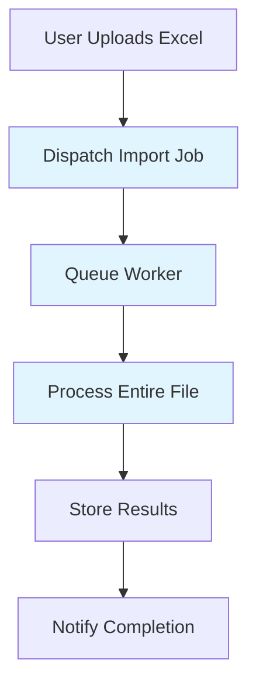
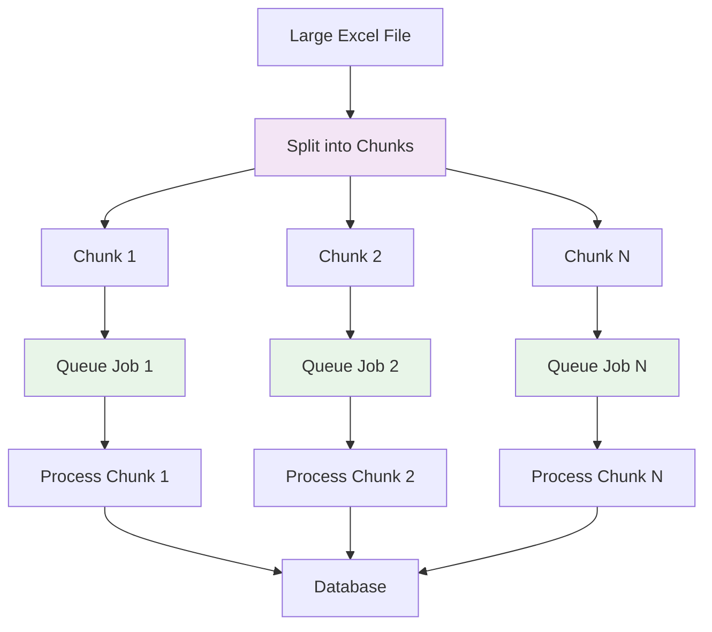
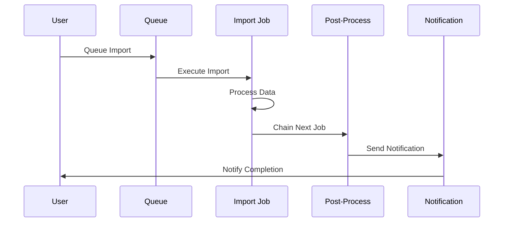

# Queued Processing | Laravel Excel

**File Path:** `laravel-8.x/excel/import/4-imports-queued-processing.md`

**Description:** Processing Laravel Excel imports using queues for improved performance and scalability

---

## Introduction

Queued processing allows you to handle large Excel imports asynchronously, preventing long-running operations from blocking your application. This approach is particularly useful when dealing with large files or when import operations involve complex processing that could impact user experience if performed synchronously. Laravel Excel provides seamless integration with Laravel's queue system for efficient import processing.

## Technical Definition

### Queued Imports
Queued imports refer to the process of dispatching Excel import operations to Laravel's queue system instead of processing them synchronously. This approach allows the import to run in the background while the application remains responsive. Laravel Excel supports both explicit queueing and implicit queueing through the `ShouldQueue` interface.

### Chunk-Based Queue Processing
Chunk-based queue processing involves splitting large Excel files into smaller chunks and processing each chunk as a separate queue job. This technique helps manage memory usage and allows for parallel processing of large datasets. When combined with the `WithChunkReading` concern, each chunk can be processed independently by different workers.

## Visualization

### Standard Queue Processing Flow



### Chunk-Based Queue Processing



### Queue Chain with Post-Processing



## Code Examples

### 1. Basic Queued Import with Chunk Reading

**File Path:** `app/Imports/UsersQueuedImport.php`

```php
<?php

namespace App\Imports;

use App\Models\User;
use Maatwebsite\Excel\Concerns\ToModel;
use Illuminate\Contracts\Queue\ShouldQueue;
use Maatwebsite\Excel\Concerns\WithChunkReading;

class UsersQueuedImport implements ToModel, WithChunkReading, ShouldQueue
{
    public function model(array $row)
    {
        return new User([
            'name' => $row[0],
            'email' => $row[1],
            'phone' => $row[2],
        ]);
    }

    /**
     * Define the chunk size for processing
     */
    public function chunkSize(): int
    {
        return 1000; // Process 1000 rows per chunk
    }
}
```

### 2. Explicit Queue Import Usage

**Controller Example - File Path:** `app/Http/Controllers/ImportController.php`

```php
<?php

namespace App\Http\Controllers;

use App\Imports\UsersQueuedImport;
use Illuminate\Http\Request;
use Maatwebsite\Excel\Facades\Excel;

class ImportController extends Controller
{
    public function queueImport(Request $request)
    {
        // Explicitly queue the import
        Excel::queueImport(
            new UsersQueuedImport,
            $request->file('excel_file')->store('temp')
        );

        return response()->json(['message' => 'Import queued successfully']);
    }
}
```

### 3. Using Importable Trait for Queue Operations

**File Path:** `app/Imports/AdvancedQueuedImport.php`

```php
<?php

namespace App\Imports;

use App\Models\User;
use Maatwebsite\Excel\Concerns\ToModel;
use Maatwebsite\Excel\Concerns\Importable;
use Illuminate\Contracts\Queue\ShouldQueue;
use Maatwebsite\Excel\Concerns\WithChunkReading;

class AdvancedQueuedImport implements ToModel, WithChunkReading, ShouldQueue
{
    use Importable;

    public function model(array $row)
    {
        return new User([
            'name' => $row[0],
            'email' => $row[1],
            'created_at' => now(),
        ]);
    }

    public function chunkSize(): int
    {
        return 500;
    }
}
```

Usage in controller:

```php
// Using the Importable trait
(new AdvancedQueuedImport)->queue('users.xlsx');

// With chaining additional jobs
(new AdvancedQueuedImport)
    ->queue('users.xlsx')
    ->chain([
        new NotifyUserOfCompletedImport(auth()->user()),
    ]);
```

### 4. Handling Failures in Queued Imports

**File Path:** `app/Imports/RobustQueuedImport.php`

```php
<?php

namespace App\Imports;

use App\Models\User;
use App\Notifications\ImportHasFailedNotification;
use Maatwebsite\Excel\Concerns\ToModel;
use Maatwebsite\Excel\Concerns\WithEvents;
use Maatwebsite\Excel\Events\ImportFailed;
use Illuminate\Contracts\Queue\ShouldQueue;
use Maatwebsite\Excel\Concerns\WithChunkReading;

class RobustQueuedImport implements ToModel, WithChunkReading, ShouldQueue, WithEvents
{
    protected $user;

    public function __construct($user)
    {
        $this->user = $user;
    }

    public function model(array $row)
    {
        return new User([
            'name' => $row[0],
            'email' => $row[1],
        ]);
    }

    public function chunkSize(): int
    {
        return 1000;
    }

    /**
     * Register events to handle failures
     */
    public function registerEvents(): array
    {
        return [
            ImportFailed::class => function(ImportFailed $event) {
                $this->user->notify(new ImportHasFailedNotification($event->getException()));
            },
        ];
    }
}
```

### 5. Custom Queue Configuration

**File Path:** `app/Jobs/NotifyUserOfCompletedImport.php`

```php
<?php

namespace App\Jobs;

use App\Models\User;
use App\Notifications\ImportReady;
use Illuminate\Bus\Queueable;
use Illuminate\Contracts\Queue\ShouldQueue;
use Illuminate\Foundation\Bus\Dispatchable;
use Illuminate\Queue\InteractsWithQueue;
use Illuminate\Queue\SerializesModels;

class NotifyUserOfCompletedImport implements ShouldQueue
{
    use Dispatchable, InteractsWithQueue, Queueable, SerializesModels;

    public $user;

    public function __construct(User $user)
    {
        $this->user = $user;
    }

    public function handle()
    {
        $this->user->notify(new ImportReady());
    }
}
```

### 6. Multi-Server Setup Configuration

For multi-server environments, configure temporary file storage in `config/excel.php`:

```php
<?php

return [
    // Other config...

    'temporary_files' => [
        'remote_disk' => 's3', // Store temp files on shared storage
        'force_resync_remote' => true, // Clean up local temp files after each chunk
    ],

    // Other config...
];
```

### 7. Queue with Custom Middleware

**File Path:** `app/Imports/ImportWithMiddleware.php`

```php
<?php

namespace App\Imports;

use App\Models\User;
use Maatwebsite\Excel\Concerns\Importable;
use Maatwebsite\Excel\Concerns\ToModel;
use Illuminate\Contracts\Queue\ShouldQueue;
use Maatwebsite\Excel\Concerns\WithChunkReading;

class ImportWithMiddleware implements ToModel, WithChunkReading, ShouldQueue
{
    use Importable;

    public function model(array $row)
    {
        return new User([
            'name' => $row[0],
            'email' => $row[1],
        ]);
    }

    public function chunkSize(): int
    {
        return 1000;
    }

    /**
     * Apply custom middleware to the job
     */
    public function middleware()
    {
        return [new \App\Jobs\Middleware\RateLimited];
    }

    /**
     * Define retry timeout
     */
    public function retryUntil()
    {
        return now()->addMinutes(5);
    }
}
```

## Best Practices

### For Queued Imports:
- **Always use chunk reading** with queued imports to manage memory usage effectively
- **Monitor queue workers** to ensure they're processing jobs efficiently
- **Implement proper error handling** using the `ImportFailed` event
- **Use job chaining** for post-import notifications or processing
- **Configure appropriate timeouts** for large import operations

### For Performance:
- **Optimize chunk size** based on your server's memory capacity
- **Use appropriate queue connections** (database, redis, sqs) based on your infrastructure
- **Consider using different queues** for different types of imports (high/low priority)
- **Monitor queue length** to prevent backlog accumulation

### Security Considerations:
- **Validate file uploads** before queuing imports
- **Sanitize data** during import processing
- **Implement rate limiting** for import operations
- **Secure temporary files** in multi-server environments

### Multi-Server Considerations:
- **Use shared storage** (like S3) for temporary files in load-balanced environments
- **Configure cleanup policies** to prevent storage overflow
- **Ensure consistent file access** across all servers

## Conclusion

Queued processing is essential for handling large Excel imports efficiently in production applications. By leveraging Laravel's queue system with Laravel Excel, you can ensure your application remains responsive while processing large datasets in the background.

The combination of chunk reading with queued processing provides excellent memory management and allows for parallel processing of large files. Proper error handling and monitoring ensure reliability, while configuration options allow you to optimize for your specific infrastructure needs.

Whether you're processing hundreds or millions of records, queued imports provide a scalable solution for your Excel import needs.