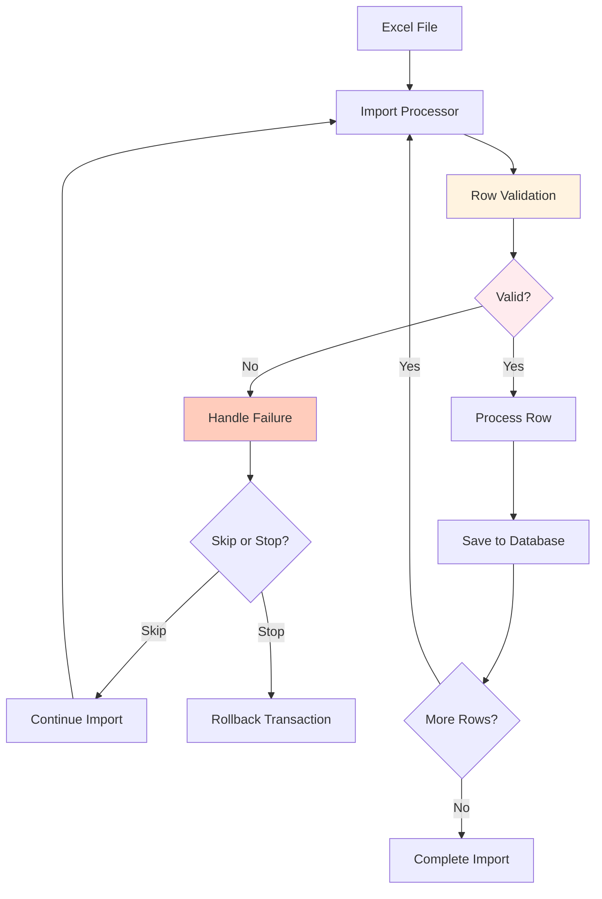
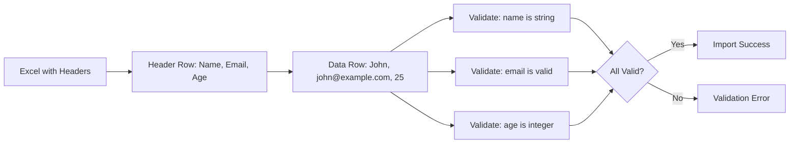
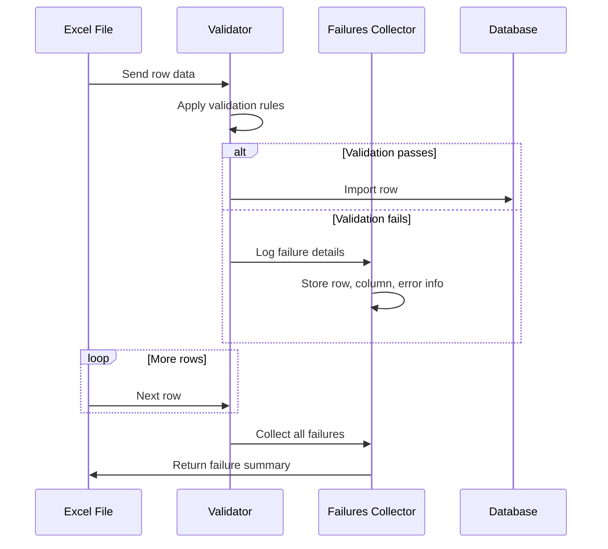

# Row Validation | Laravel Excel

**File Path:** `laravel-8.x/excel/import/5-imports-validation.md`

**Description:** Implementing validation for Excel import rows to ensure data quality and integrity

---

## Introduction

Row validation is a crucial aspect of Excel imports that ensures data quality and prevents invalid data from entering your database. Laravel Excel provides comprehensive validation capabilities that allow you to define rules for each row, customize error messages, handle failures gracefully, and maintain data integrity throughout the import process. This documentation covers various validation techniques and best practices for validating Excel import data.

## Technical Definition

### Row Validation
Row validation refers to the process of applying Laravel validation rules to each row of an Excel file before it's processed or saved to the database. Using the `WithValidation` concern, you can define validation rules that each row must satisfy, with support for both numeric indices and heading-based column access.

### Validation Failures Handling
Validation failures handling encompasses the mechanisms for dealing with rows that don't meet validation criteria. Laravel Excel provides several approaches including database transactions, failure collection, skipping failures, and custom error handling, giving you fine-grained control over how validation errors are managed during the import process.

## Visualization

### Validation Process Flow



### Validation with Heading Row



### Failure Collection Process



## Code Examples

### 1. Basic Row Validation Implementation

**File Path:** `app/Imports/UsersValidationImport.php`

```php
<?php

namespace App\Imports;

use App\Models\User;
use Illuminate\Validation\Rule;
use Maatwebsite\Excel\Concerns\ToModel;
use Maatwebsite\Excel\Concerns\Importable;
use Maatwebsite\Excel\Concerns\WithValidation;

class UsersValidationImport implements ToModel, WithValidation
{
    use Importable;

    public function model(array $row)
    {
        return new User([
            'name' => $row[0],
            'email' => $row[1],
            'password' => bcrypt('secret'),
        ]);
    }

    /**
     * Define validation rules for each row
     */
    public function rules(): array
    {
        return [
            '0' => 'required|string|max:255', // Name column
            '1' => 'required|email|unique:users,email', // Email column
        ];
    }
}
```

### 2. Validation with Heading Row

**File Path:** `app/Imports/UsersWithHeadingValidation.php`

```php
<?php

namespace App\Imports;

use App\Models\User;
use Illuminate\Validation\Rule;
use Maatwebsite\Excel\Concerns\ToModel;
use Maatwebsite\Excel\Concerns\Importable;
use Maatwebsite\Excel\Concerns\WithValidation;
use Maatwebsite\Excel\Concerns\WithHeadingRow;

class UsersWithHeadingValidation implements ToModel, WithValidation, WithHeadingRow
{
    use Importable;

    public function model(array $row)
    {
        return new User([
            'name' => $row['name'],
            'email' => $row['email'],
            'age' => $row['age'],
        ]);
    }

    /**
     * Define validation rules using heading names
     */
    public function rules(): array
    {
        return [
            'name' => 'required|string|max:255',
            'email' => 'required|email|unique:users,email',
            'age' => 'required|integer|min:18|max:100',
        ];
    }
}
```

### 3. Advanced Validation with Custom Rules

**File Path:** `app/Imports/AdvancedValidationImport.php`

```php
<?php

namespace App\Imports;

use App\Models\User;
use Illuminate\Validation\Rule;
use Maatwebsite\Excel\Concerns\ToModel;
use Maatwebsite\Excel\Concerns\Importable;
use Maatwebsite\Excel\Concerns\WithValidation;

class AdvancedValidationImport implements ToModel, WithValidation
{
    use Importable;

    public function model(array $row)
    {
        return new User([
            'name' => $row[0],
            'email' => $row[1],
            'role' => $row[2],
            'department' => $row[3],
        ]);
    }

    public function rules(): array
    {
        return [
            '0' => [
                'required',
                'string',
                'max:255',
                Rule::notIn(['admin', 'root']) // Prevent reserved names
            ],
            '1' => [
                'required',
                'email',
                Rule::unique('users')->where(function ($query) {
                    return $query->whereNull('deleted_at');
                })
            ],
            '2' => 'required|in:user,moderator,admin',
            '3' => 'required|exists:departments,name',
            // Cross-field validation (department must match role)
            '2' => 'required_with:3',
        ];
    }

    /**
     * Custom validation messages
     */
    public function customValidationMessages()
    {
        return [
            '0.not_in' => 'The name cannot be a reserved word.',
            '1.unique' => 'This email is already registered.',
            '2.in' => 'Role must be user, moderator, or admin.',
            '3.exists' => 'Department does not exist.',
        ];
    }

    /**
     * Custom attribute names for validation messages
     */
    public function customValidationAttributes()
    {
        return [
            '0' => 'name',
            '1' => 'email address',
            '2' => 'user role',
            '3' => 'department',
        ];
    }
}
```

### 4. Validation with Callback Rules

**File Path:** `app/Imports/CallbackValidationImport.php`

```php
<?php

namespace App\Imports;

use App\Models\User;
use Maatwebsite\Excel\Concerns\ToModel;
use Maatwebsite\Excel\Concerns\Importable;
use Maatwebsite\Excel\Concerns\WithValidation;

class CallbackValidationImport implements ToModel, WithValidation
{
    use Importable;

    public function model(array $row)
    {
        return new User([
            'name' => $row[0],
            'email' => $row[1],
            'salary' => $row[2],
        ]);
    }

    public function rules(): array
    {
        return [
            '0' => function($attribute, $value, $onFailure) {
                if (strtolower($value) === 'unknown') {
                    $onFailure('Name cannot be "unknown".');
                }
            },
            '1' => 'required|email',
            '2' => function($attribute, $value, $onFailure) {
                if (!is_numeric($value) || $value < 0) {
                    $onFailure('Salary must be a positive number.');
                }
            }
        ];
    }
}
```

### 5. Handling Validation Failures with Error Collection

**File Path:** `app/Imports/FailureCollectionImport.php`

```php
<?php

namespace App\Imports;

use App\Models\User;
use Maatwebsite\Excel\Concerns\ToModel;
use Maatwebsite\Excel\Concerns\Importable;
use Maatwebsite\Excel\Concerns\WithValidation;

class FailureCollectionImport implements ToModel, WithValidation
{
    use Importable;

    public function model(array $row)
    {
        return new User([
            'name' => $row[0],
            'email' => $row[1],
        ]);
    }

    public function rules(): array
    {
        return [
            '0' => 'required|string|max:255',
            '1' => 'required|email|unique:users,email',
        ];
    }
}

// Usage in controller:
/*
try {
    $import = new FailureCollectionImport();
    $import->import('users.xlsx');
} catch (\Maatwebsite\Excel\Validators\ValidationException $e) {
    $failures = $e->failures();
    
    foreach ($failures as $failure) {
        echo $failure->row();           // Row number that failed
        echo $failure->attribute();     // Column name/index that failed
        print_r($failure->errors());   // Array of validation errors
        print_r($failure->values());   // Values in the failed row
    }
}
*/
```

### 6. Skipping Failures Instead of Rolling Back

**File Path:** `app/Imports/SkipFailuresImport.php`

```php
<?php

namespace App\Imports;

use App\Models\User;
use Maatwebsite\Excel\Concerns\ToModel;
use Maatwebsite\Excel\Validators\Failure;
use Maatwebsite\Excel\Concerns\Importable;
use Maatwebsite\Excel\Concerns\SkipsOnFailure;
use Maatwebsite\Excel\Concerns\WithValidation;

class SkipFailuresImport implements ToModel, WithValidation, SkipsOnFailure
{
    use Importable;

    public function model(array $row)
    {
        return new User([
            'name' => $row[0],
            'email' => $row[1],
        ]);
    }

    public function rules(): array
    {
        return [
            '0' => 'required|string|max:255',
            '1' => 'required|email|unique:users,email',
        ];
    }

    /**
     * Handle failures without stopping the import
     */
    public function onFailure(Failure ...$failures)
    {
        foreach ($failures as $failure) {
            // Log the failure or handle it as needed
            \Log::warning('Import failure:', [
                'row' => $failure->row(),
                'attribute' => $failure->attribute(),
                'errors' => $failure->errors(),
                'values' => $failure->values()
            ]);
        }
    }
}
```

### 7. Using SkipsFailures Trait for Automatic Collection

**File Path:** `app/Imports/AutoSkipFailuresImport.php`

```php
<?php

namespace App\Imports;

use App\Models\User;
use Maatwebsite\Excel\Concerns\ToModel;
use Maatwebsite\Excel\Concerns\Importable;
use Maatwebsite\Excel\Concerns\SkipsOnFailure;
use Maatwebsite\Excel\Concerns\WithValidation;
use Maatwebsite\Excel\Concerns\SkipsFailures;

class AutoSkipFailuresImport implements ToModel, WithValidation, SkipsOnFailure
{
    use Importable, SkipsFailures;

    public function model(array $row)
    {
        return new User([
            'name' => $row[0],
            'email' => $row[1],
        ]);
    }

    public function rules(): array
    {
        return [
            '0' => 'required|string|max:255',
            '1' => 'required|email|unique:users,email',
        ];
    }
}

// Usage to retrieve failures after import:
/*
$import = new AutoSkipFailuresImport();
$import->import('users.xlsx');

foreach ($import->failures() as $failure) {
    echo $failure->row();           // Row number that failed
    echo $failure->attribute();     // Column that failed
    print_r($failure->errors());   // Error messages
    print_r($failure->values());   // Row values
}
*/
```

### 8. Skipping Empty Rows During Validation

**File Path:** `app/Imports/SkipEmptyRowsImport.php`

```php
<?php

namespace App\Imports;

use App\Models\User;
use Maatwebsite\Excel\Concerns\Importable;
use Maatwebsite\Excel\Concerns\SkipsEmptyRows;
use Maatwebsite\Excel\Concerns\ToModel;
use Maatwebsite\Excel\Concerns\WithHeadingRow;
use Maatwebsite\Excel\Concerns\WithValidation;

class SkipEmptyRowsImport implements ToModel, SkipsEmptyRows, WithHeadingRow, WithValidation
{
    use Importable;

    public function model(array $row)
    {
        return new User([
            'name' => $row['name'],
            'email' => $row['email'],
        ]);
    }

    public function rules(): array
    {
        return [
            'name' => 'required|string|max:255',
            'email' => 'required|email|unique:users,email',
        ];
    }

    /**
     * Custom logic for determining if a row is empty
     */
    public function isEmptyWhen(array $row): bool
    {
        // Skip rows where name is 'DELETE_ME' or email is empty
        return $row['name'] === 'DELETE_ME' || empty($row['email']);
    }
}
```

### 9. Validation Without ToModel (Using ToCollection)

**File Path:** `app/Imports/CollectionValidationImport.php`

```php
<?php

namespace App\Imports;

use App\Models\User;
use Illuminate\Support\Collection;
use Illuminate\Support\Facades\Validator;
use Maatwebsite\Excel\Concerns\ToCollection;

class CollectionValidationImport implements ToCollection
{
    public function collection(Collection $rows)
    {
        // Validate the entire collection
        Validator::make($rows->toArray(), [
            '*.0' => 'required|string', // Name column
            '*.1' => 'required|email',  // Email column
        ])->validate();

        // Process validated data
        foreach ($rows as $row) {
            User::create([
                'name' => $row[0],
                'email' => $row[1],
            ]);
        }
    }
}
```

### 10. Custom Validation Preparation

**File Path:** `app/Imports/PrepareForValidationImport.php`

```php
<?php

namespace App\Imports;

use App\Models\User;
use Maatwebsite\Excel\Concerns\ToModel;
use Maatwebsite\Excel\Concerns\Importable;
use Maatwebsite\Excel\Concerns\WithValidation;

class PrepareForValidationImport implements ToModel, WithValidation
{
    use Importable;

    public function model(array $row)
    {
        return new User([
            'name' => $row[0],
            'email' => $row[1],
        ]);
    }

    public function rules(): array
    {
        return [
            '0' => 'required|string|max:255',
            '1' => 'required|email|unique:users,email',
        ];
    }

    /**
     * Prepare data before validation
     */
    public function prepareForValidation($data, $index)
    {
        // Clean up email data before validation
        $data[1] = trim(strtolower($data[1]));
        
        // Convert empty strings to null for optional fields
        if ($data[0] === '') {
            $data[0] = null;
        }
        
        return $data;
    }
}
```

### 11. Complex Validation with Validator Configuration

**File Path:** `app/Imports/ComplexValidationImport.php`

```php
<?php

namespace App\Imports;

use App\Models\User;
use Maatwebsite\Excel\Concerns\ToModel;
use Maatwebsite\Excel\Concerns\Importable;
use Maatwebsite\Excel\Concerns\WithValidation;

class ComplexValidationImport implements ToModel, WithValidation
{
    use Importable;

    public function model(array $row)
    {
        return new User([
            'name' => $row[0],
            'email' => $row[1],
            'role' => $row[2],
        ]);
    }

    public function rules(): array
    {
        return [
            '0' => 'required|string|max:255',
            '1' => 'required|email',
            '2' => 'required|in:user,admin,moderator',
        ];
    }

    /**
     * Configure the validator with custom logic
     */
    public function withValidator($validator)
    {
        $validator->after(function ($validator) {
            // Add custom validation after basic rules
            $data = $validator->getData();
            
            foreach ($data as $rowIndex => $row) {
                if (isset($row[2]) && $row[2] === 'admin' && isset($row[0])) {
                    // Admin accounts must have a name longer than 3 characters
                    if (strlen($row[0]) <= 3) {
                        $validator->errors()->add("{$rowIndex}.0", 'Admin name must be longer than 3 characters.');
                    }
                }
            }
        });

        // Conditional validation
        $validator->sometimes('*.2', 'required', function ($data) {
            return !empty($data[1]) && str_ends_with($data[1], '@company.com');
        });
    }
}
```

## Best Practices

### For Validation:
- **Define clear validation rules** that match your business requirements
- **Use specific error messages** to help users understand validation failures
- **Validate early** in the import process to catch issues quickly
- **Test validation rules** with various data scenarios

### For Error Handling:
- **Choose appropriate failure strategy** (rollback vs. skip failures)
- **Log validation failures** for debugging and monitoring
- **Provide user feedback** about validation issues
- **Collect and report all failures** at the end of the import

### Performance Considerations:
- **Use batch validation** with `WithBatchInserts` for better performance
- **Optimize validation rules** to minimize database queries
- **Consider caching** for complex validation lookups
- **Monitor validation performance** with large datasets

### Security Considerations:
- **Sanitize all input data** before validation
- **Use proper escaping** for database queries
- **Implement rate limiting** for import operations
- **Validate file types** before processing

## Conclusion

Row validation is essential for maintaining data quality and integrity during Excel imports. Laravel Excel provides comprehensive validation capabilities that integrate seamlessly with Laravel's validation system, allowing you to define complex rules, handle failures gracefully, and maintain high data quality standards.

Whether you're implementing basic field validation, handling complex cross-field validation, or managing validation failures, Laravel Excel offers the tools and flexibility to handle your specific requirements. The combination of validation rules, custom messages, failure handling strategies, and integration with Laravel's validation system provides a robust foundation for building reliable import processes.

By following the best practices outlined in this documentation, you can create efficient, secure, and maintainable Excel import validation systems that ensure data quality while providing a good user experience.