# 13. HTTP Responses

## Introduction

HTTP responses are a fundamental component of Laravel applications, representing the data sent back to clients after processing their requests. Laravel provides several convenient ways to create and manipulate HTTP responses, from simple strings to complex JSON responses with custom headers and cookies. Understanding how to properly create and manage responses is essential for building robust web applications.

## Technical Definition

The `Illuminate\Http\Response` class extends the `Symfony\Component\HttpFoundation\Response` class and provides a fluent interface for building HTTP responses. Laravel also provides a `response()` helper function that returns an instance of `Illuminate\Contracts\Routing\ResponseFactory`, which can be used to create various types of responses.

## 1. Creating Basic Responses

### 1.1 Simple String Responses

The most basic response in Laravel is simply returning a string from a route or controller. Laravel automatically converts the string into a full HTTP response with appropriate headers:

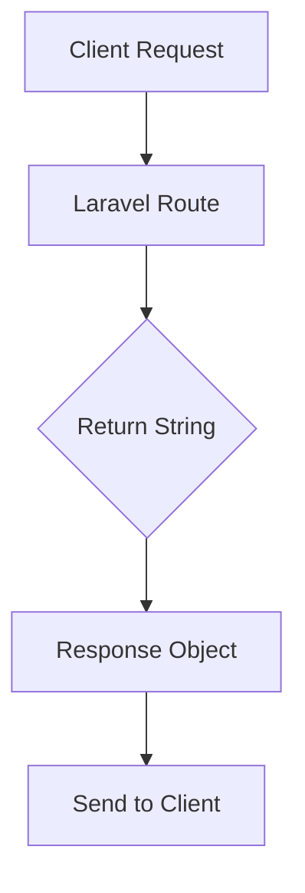

```php
// File: routes/web.php
Route::get('/', function () {
    return 'Hello World';
});
```

### 1.2 Array Responses

Laravel automatically converts arrays to JSON responses when returned from routes or controllers:

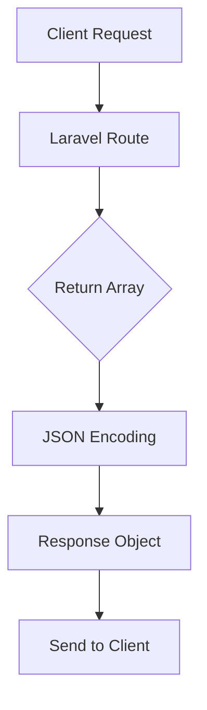

```php
// File: routes/web.php
Route::get('/', function () {
    return [1, 2, 3];
});
```

### 1.3 Eloquent Model and Collection Responses

Eloquent models and collections can be returned directly from routes or controllers and will be automatically converted to JSON, respecting any hidden attributes:

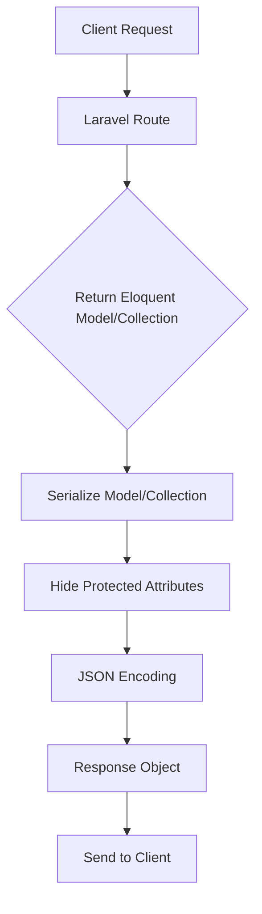

```php
// File: routes/web.php
use App\Models\User;

Route::get('/user/{user}', function (User $user) {
    return $user;
});

// File: app/Models/User.php
<?php

namespace App\Models;

use Illuminate\Database\Eloquent\Factories\HasFactory;
use Illuminate\Foundation\Auth\User as Authenticatable;
use Illuminate\Notifications\Notifiable;

class User extends Authenticatable
{
    use HasFactory, Notifiable;

    /**
     * The attributes that should be hidden for serialization.
     *
     * @var array
     */
    protected $hidden = [
        'password',
        'remember_token',
    ];
}
```

## 2. Response Objects

### 2.1 Creating Custom Response Objects

For more control over the response, you can create full `Illuminate\Http\Response` instances that allow customization of status codes and headers:

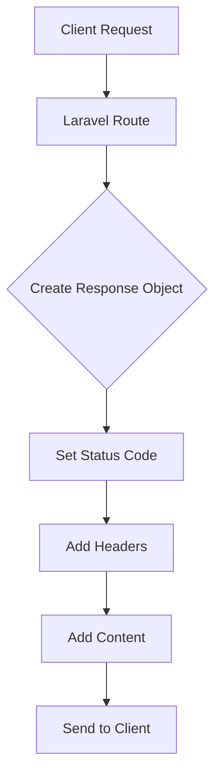

```php
// File: routes/web.php
Route::get('/home', function () {
    return response('Hello World', 200)
        ->header('Content-Type', 'text/plain');
});
```

### 2.2 Fluent Response Building

Most response methods are chainable, allowing for fluent construction of response instances:

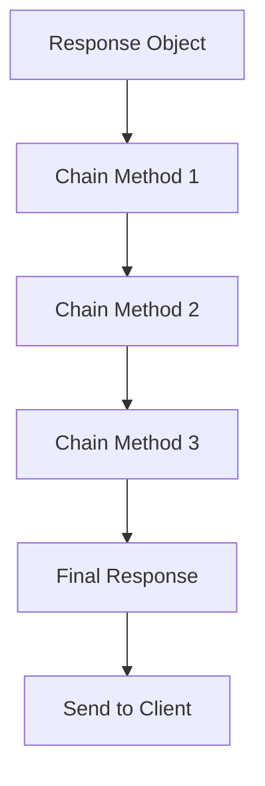

```php
// File: app/Http/Controllers/ResponseController.php
<?php

namespace App\Http\Controllers;

use Illuminate\Http\Request;
use Illuminate\Http\Response;

class ResponseController extends Controller
{
    public function customResponse()
    {
        return response('Custom content')
            ->header('Content-Type', 'text/html')
            ->header('X-Custom-Header', 'Custom Value')
            ->header('X-Another-Header', 'Another Value');
    }
}
```

## 3. Attaching Headers to Responses

### 3.1 Single Header Attachment

Use the `header()` method to add individual headers to a response:

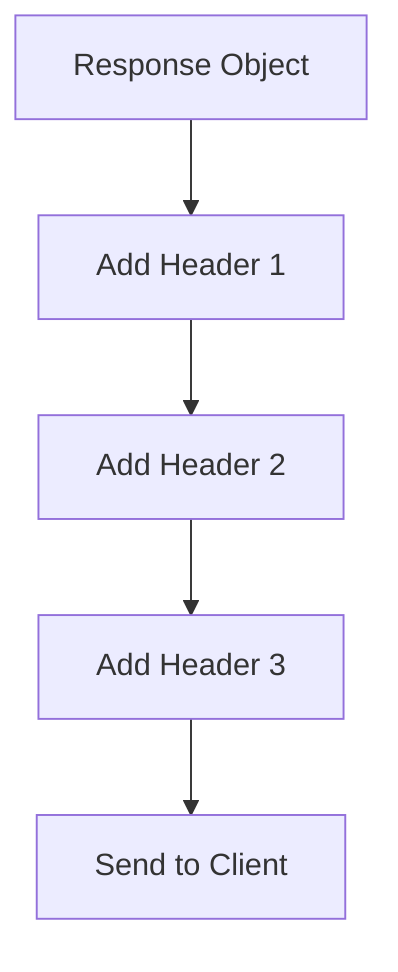

```php
// File: app/Http/Controllers/HeaderController.php
<?php

namespace App\Http\Controllers;

use Illuminate\Http\Request;

class HeaderController extends Controller
{
    public function withHeaders(Request $request)
    {
        $contentType = 'application/json';
        
        return response($request->getContent())
            ->header('Content-Type', $contentType)
            ->header('X-Header-One', 'Header Value')
            ->header('X-Header-Two', 'Header Value');
    }
}
```

### 3.2 Multiple Header Attachment

Use the `withHeaders()` method to add multiple headers at once:

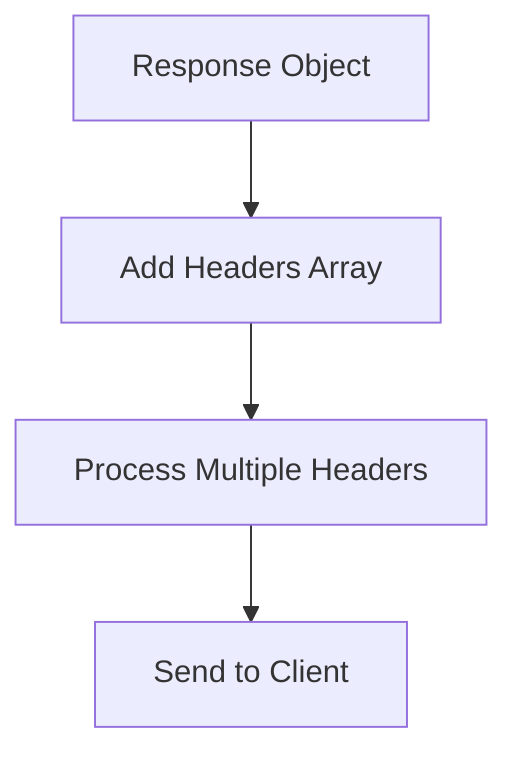

```php
// File: app/Http/Controllers/HeaderController.php
<?php

namespace App\Http\Controllers;

use Illuminate\Http\Request;

class HeaderController extends Controller
{
    public function withMultipleHeaders(Request $request)
    {
        $type = 'application/json';
        
        return response($request->getContent())
            ->withHeaders([
                'Content-Type' => $type,
                'X-Header-One' => 'Header Value',
                'X-Header-Two' => 'Header Value',
            ]);
    }
}
```

## 4. Cache Control Middleware

### 4.1 Using Cache Headers Middleware

Laravel includes a `cache.headers` middleware that can quickly set Cache-Control headers for groups of routes:

```php
// File: routes/web.php
Route::middleware('cache.headers:public;max_age=30;s_maxage=300;stale_while_revalidate=600;etag')->group(function () {
    Route::get('/privacy', function () {
        return view('privacy');
    });

    Route::get('/terms', function () {
        return view('terms');
    });
});
```

## 5. Attaching Cookies to Responses

### 5.1 Adding Cookies to Responses

Use the `cookie()` method to attach cookies to an outgoing response:

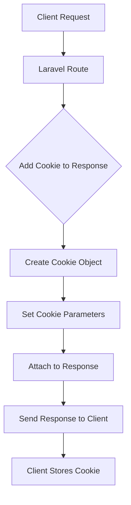


```php
// File: app/Http/Controllers/CookieController.php
<?php

namespace App\Http\Controllers;

use Illuminate\Http\Request;

class CookieController extends Controller
{
    public function withCookie()
    {
        return response('Hello World')->cookie(
            'name', 'value', 60  // Cookie name, value, and duration in minutes
        );
    }

    public function withFullCookie()
    {
        return response('Hello World')->cookie(
            'name', 'value', 60, '/', 'example.com', true, true  // Full parameters
        );
    }
}
```

### 5.2 Queuing Cookies

Use the Cookie facade to queue cookies for attachment to the response when it's sent:

```mermaid
graph TD
    A[Client Request] --> B[Laravel Route]
    B --> C{Queue Cookie for Response}
    C --> D[Use Cookie::queue()]
    D --> E[Store Cookie in Queue]
    E --> F[Process Response]
    F --> G[Attach Queued Cookies]
    G --> H[Send Response to Client]
```


```php
// File: app/Http/Controllers/CookieController.php
<?php

namespace App\Http\Controllers;

use Illuminate\Http\Request;
use Illuminate\Support\Facades\Cookie;

class CookieController extends Controller
{
    public function queueCookie()
    {
        Cookie::queue('name', 'value', 60);
        
        return response('Hello World');
    }
}
```

### 5.3 Generating Cookie Instances

Create cookie instances separately and then attach them to responses:

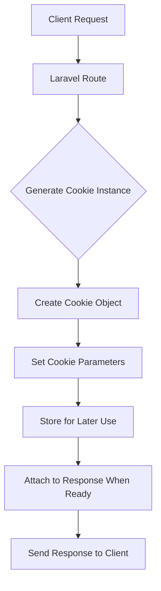


```php
// File: app/Http/Controllers/CookieController.php
<?php

namespace App\Http\Controllers;

use Illuminate\Http\Request;

class CookieController extends Controller
{
    public function generateCookie()
    {
        $cookie = cookie('name', 'value', 60);
        
        return response('Hello World')->cookie($cookie);
    }
}
```

### 5.4 Removing Cookies

Remove cookies using the `withoutCookie()` method or Cookie facade's `expire()` method:

```mermaid
graph TD
    A[Client Request] --> B[Laravel Route]
    B --> C{Remove Cookie}
    C --> D[Use withoutCookie() or expire()]
    D --> E[Set Expiration to Past]
    E --> F[Send Response to Client]
    F --> G[Client Removes Cookie]
```


```php
// File: app/Http/Controllers/CookieController.php
<?php

namespace App\Http\Controllers;

use Illuminate\Http\Request;
use Illuminate\Support\Facades\Cookie;

class CookieController extends Controller
{
    public function removeCookie()
    {
        return response('Hello World')->withoutCookie('name');
    }

    public function expireCookie()
    {
        Cookie::expire('name');
        
        return response('Hello World');
    }
}
```

### 5.5 Cookie Encryption Configuration

Configure which cookies should not be encrypted in your application's bootstrap file:

```mermaid
graph TD
    A[Application Start] --> B{Configure Cookie Encryption}
    B --> C[Modify bootstrap/app.php]
    C --> D[Use encryptCookies() Method]
    D --> E[Specify Cookies to Exclude]
    E --> F[Apply Middleware Configuration]
    F --> G[Run Application with Settings]
```


```php
// File: bootstrap/app.php
<?php

use Illuminate\Foundation\Application;
use Illuminate\Foundation\Configuration\Exceptions;
use Illuminate\Foundation\Configuration\Middleware;

return Application::configure(basePath: dirname(__DIR__))
    ->withRouting(
        web: __DIR__.'/../routes/web.php',
        commands: __DIR__.'/../routes/console.php',
        health: '/up',
    )
    ->withMiddleware(function (Middleware $middleware): void {
        $middleware->encryptCookies(except: [
            'cookie_name',  // Specify cookies that should not be encrypted
        ]);
    })
    ->withExceptions(function (Exceptions $exceptions): void {
        //
    })->create();
```

## 6. Redirects

### 6.1 Basic Redirects

Redirect responses are instances of the `Illuminate\Http\RedirectResponse` class and contain the proper headers to redirect users to another URL:

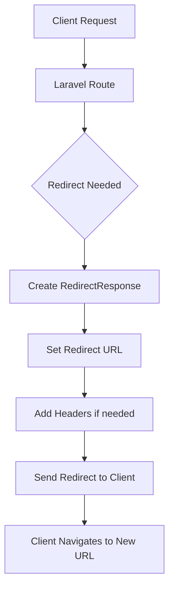


```php
// File: routes/web.php
Route::get('/dashboard', function () {
    return redirect('/home/dashboard');
});
```

### 6.2 Redirecting Back

Redirect to the user's previous location using the `back()` helper:

```mermaid
graph TD
    A[Client Request] --> B[Laravel Route]
    B --> C{Validation Failed}
    C --> D[Use back() Helper]
    D --> E[Retrieve Previous URL from Session]
    E --> F[Create RedirectResponse]
    F --> G[Send Redirect to Client]
    G --> H[Client Returns to Previous Page]
```


```php
// File: routes/web.php
Route::post('/user/profile', function () {
    // Validate the request...

    return back()->withInput();  // Flash input data to session before redirecting back
});
```

### 6.3 Redirecting to Named Routes

Generate redirects to named routes using the `route()` method:

```mermaid
graph TD
    A[Client Request] --> B[Laravel Route]
    B --> C{Redirect to Named Route}
    C --> D[Use redirect()->route()]
    D --> E[Resolve Route Name to URL]
    E --> F[Create RedirectResponse]
    F --> G[Send Redirect to Client]
    G --> H[Client Navigates to Named Route]
```


```php
// File: routes/web.php
// For a route with the following URI: /profile/{id}

Route::get('/redirect-to-profile', function () {
    return redirect()->route('profile', ['id' => 1]);
});
```

### 6.4 Redirecting with Eloquent Models

Pass Eloquent models directly to the route method for automatic parameter population:

```php
// File: app/Http/Controllers/UserController.php
<?php

namespace App\Http\Controllers;

use App\Models\User;
use Illuminate\Http\Request;

class UserController extends Controller
{
    public function redirectToProfile(User $user)
    {
        // For a route with the following URI: /profile/{id}
        return redirect()->route('profile', [$user]);
    }
}
```

### 6.5 Customizing Route Keys

Override the `getRouteKey()` method to customize the value used in route parameters:

```php
// File: app/Models/User.php
<?php

namespace App\Models;

use Illuminate\Foundation\Auth\User as Authenticatable;

class User extends Authenticatable
{
    /**
     * Get the value of the model's route key.
     */
    public function getRouteKey(): mixed
    {
        return $this->slug;  // Use the slug instead of ID in route parameters
    }
}
```

### 6.6 Redirecting to Controller Actions

Generate redirects to controller actions using the `action()` method:

```mermaid
graph TD
    A[Client Request] --> B[Laravel Route]
    B --> C{Redirect to Controller Action}
    C --> D[Use redirect()->action()]
    D --> E[Resolve Controller and Method to URL]
    E --> F[Create RedirectResponse]
    F --> G[Send Redirect to Client]
    G --> H[Client Navigates to Controller Action]
```


```php
// File: routes/web.php
use App\Http\Controllers\UserController;

Route::get('/redirect-to-controller', function () {
    return redirect()->action([UserController::class, 'index']);
});

Route::get('/redirect-to-controller-with-params', function () {
    return redirect()->action(
        [UserController::class, 'profile'], ['id' => 1]
    );
});
```

### 6.7 Redirecting to External Domains

Redirect to external domains using the `away()` method:

```mermaid
graph TD
    A[Client Request] --> B[Laravel Route]
    B --> C{Redirect to External Domain}
    C --> D[Use redirect()->away()]
    D --> E[Create RedirectResponse with External URL]
    E --> F[Send Redirect to Client]
    F --> G[Client Navigates to External Site]
```


```php
// File: routes/web.php
Route::get('/external-link', function () {
    return redirect()->away('https://www.google.com');
});
```

### 6.8 Redirecting with Flashed Session Data

Flash data to the session while redirecting using the `with()` method:

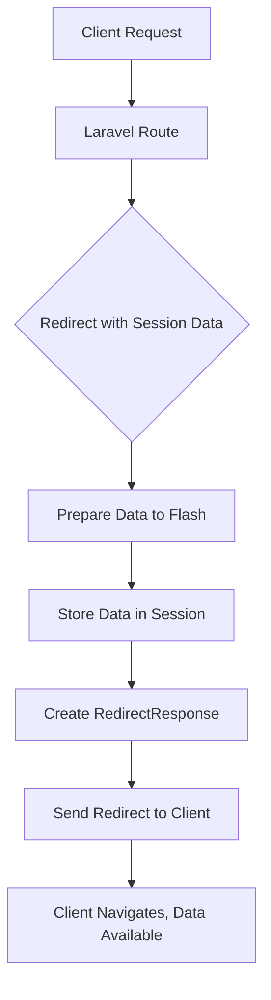


```php
// File: routes/web.php
Route::post('/user/profile', function () {
    // Process profile update...

    return redirect('/dashboard')->with('status', 'Profile updated!');
});

// Displaying flashed messages in Blade template:
/*
@if (session('status'))
    <div class="alert alert-success">
        {{ session('status') }}
    </div>
@endif
*/
```

### 6.9 Redirecting with Input Data

Flash the current request's input data to the session before redirecting:

```mermaid
graph TD
    A[Client Request with Data] --> B[Laravel Route]
    B --> C{Validation Failed}
    C --> D[Use withInput() Method]
    D --> E[Store Input Data in Session]
    E --> F[Create RedirectResponse]
    F --> G[Send Redirect to Client]
    G --> H[Client Returns with Input Preserved]
```


```php
// File: routes/web.php
Route::post('/user/profile', function () {
    // Validation fails...
    
    return back()->withInput();  // Flash input data to session before redirecting back
});
```

## 7. Other Response Types

### 7.1 View Responses

Return views with custom status codes and headers using the `view()` method:

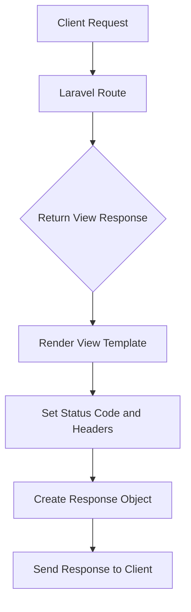


```php
// File: app/Http/Controllers/ViewController.php
<?php

namespace App\Http\Controllers;

use Illuminate\Http\Request;

class ViewController extends Controller
{
    public function customViewResponse()
    {
        $data = ['title' => 'Custom Page'];
        
        return response()
            ->view('hello', $data, 200)
            ->header('Content-Type', 'text/html');
    }
}
```

### 7.2 JSON Responses

Create JSON responses using the `json()` method:

```mermaid
graph TD
    A[Client Request] --> B[Laravel Route]
    B --> C{Return JSON Response}
    C --> D[Prepare Data Array]
    D --> E[Convert to JSON]
    E --> F[Set Content-Type Header]
    F --> G[Create Response Object]
    G --> H[Send Response to Client]
```


```php
// File: app/Http/Controllers/JsonController.php
<?php

namespace App\Http\Controllers;

use Illuminate\Http\Request;

class JsonController extends Controller
{
    public function jsonResponse()
    {
        return response()->json([
            'name' => 'Abigail',
            'state' => 'CA',
        ]);
    }

    public function jsonpResponse(Request $request)
    {
        return response()
            ->json(['name' => 'Abigail', 'state' => 'CA'])
            ->withCallback($request->input('callback'));
    }
}
```

### 7.3 File Downloads

Force browsers to download files using the `download()` method:

```php
// File: app/Http/Controllers/DownloadController.php
<?php

namespace App\Http\Controllers;

use Illuminate\Http\Request;
use Illuminate\Support\Facades\Storage;

class DownloadController extends Controller
{
    public function downloadFile()
    {
        $pathToFile = storage_path('app/public/files/document.pdf');
        
        return response()->download($pathToFile);
    }

    public function downloadFileWithName()
    {
        $pathToFile = storage_path('app/public/files/document.pdf');
        $name = 'custom-name.pdf';
        $headers = ['Content-Type' => 'application/pdf'];
        
        return response()->download($pathToFile, $name, $headers);
    }
}
```

### 7.4 File Responses

Display files directly in the browser instead of initiating a download:

```mermaid
graph TD
    A[Client Request] --> B[Laravel Route]
    B --> C{Return File Response}
    C --> D[Locate File on Server]
    D --> E[Read File Contents]
    E --> F[Set Appropriate Headers]
    F --> G[Create Response Object]
    G --> H[Send File to Client Browser]
```


```php
// File: app/Http/Controllers/FileController.php
<?php

namespace App\Http\Controllers;

use Illuminate\Http\Request;

class FileController extends Controller
{
    public function showImage()
    {
        $pathToFile = public_path('images/photo.jpg');
        
        return response()->file($pathToFile);
    }

    public function showImageWithHeaders()
    {
        $pathToFile = public_path('images/photo.jpg');
        $headers = [
            'Content-Type' => 'image/jpeg',
            'Cache-Control' => 'public, max-age=3600'
        ];
        
        return response()->file($pathToFile, $headers);
    }
}
```

### 7.5 Streamed Responses

Stream data to clients as it's generated to reduce memory usage:

```mermaid
graph TD
    A[Client Request] --> B[Laravel Route]
    B --> C{Stream Response}
    C --> D[Generate Data Chunk 1]
    D --> E[Send Chunk to Client]
    E --> F[Generate Data Chunk 2]
    F --> G[Send Chunk to Client]
    G --> H{More Chunks?}
    H -->|Yes| F
    H -->|No| I[Complete Response]
    I --> J[End Connection]
```


```mermaid
graph TD
    A[Client Request] --> B[Laravel Route]
    B --> C{Stream Response}
    C --> D[Generate Data Chunk 1]
    D --> E[Send Chunk to Client]
    E --> F[Generate Data Chunk 2]
    F --> G[Send Chunk to Client]
    G --> H{More Chunks?}
    H -->|Yes| F
    H -->|No| I[Complete Response]
    I --> J[End Connection]
```


```php
// File: app/Http/Controllers/StreamController.php
<?php

namespace App\Http\Controllers;

use Illuminate\Http\Request;

class StreamController extends Controller
{
    public function streamData()
    {
        return response()->stream(function (): void {
            foreach (['developer', 'admin'] as $string) {
                echo $string;
                ob_flush();
                flush();
                sleep(2); // Simulate delay between chunks...
            }
        }, 200, ['X-Accel-Buffering' => 'no']);
    }

    public function streamGenerator()
    {
        return response()->stream(function (): \Generator {
            // Example with simulated data stream
            $data = ['item1', 'item2', 'item3'];
            
            foreach ($data as $item) {
                yield $item . "\n";
            }
        });
    }
}
```

## 8. Advanced Response Techniques

### 8.1 Macroable Response Factory

You can extend the response factory with custom methods using macros:

```mermaid
graph TD
    A[Request Received] --> B{Custom Response Needed}
    B -->|Yes| C[Define Macro]
    C --> D[Register Macro in Service Provider]
    D --> E[Use Custom Response Method]
    E --> F[Return Custom Response]
    B -->|No| F
```


```mermaid
graph TD
    A[Request Received] --> B{Custom Response Needed}
    B -->|Yes| C[Define Macro]
    C --> D[Register Macro in Service Provider]
    D --> E[Use Custom Response Method]
    E --> F[Return Custom Response]
    B -->|No| F
```


```php
// File: app/Providers/AppServiceProvider.php
<?php

namespace App\Providers;

use Illuminate\Http\Response;
use Illuminate\Support\ServiceProvider;

class AppServiceProvider extends ServiceProvider
{
    public function boot(): void
    {
        Response::macro('caps', function ($data) {
            return $this->json(array_map('strtoupper', $data));
        });
    }

    public function register(): void
    {
        //
    }
}

// Usage:
// return response()->caps(['foo', 'bar']); // Returns ["FOO", "BAR"]
```

### 8.2 Conditional Response Creation

Create responses conditionally based on request data:

```mermaid
graph TD
    A[Request Received] --> B{Check Request Type}
    B -->|JSON Request| C[Return JSON Response]
    B -->|HTML Request| D[Return HTML Response]
    B -->|API Request| E[Return API Response]
    C --> F[Send Response]
    D --> F
    E --> F
```


```php
// File: app/Http/Controllers/ConditionalController.php
<?php

namespace App\Http\Controllers;

use Illuminate\Http\Request;

class ConditionalController extends Controller
{
    public function conditionalResponse(Request $request)
    {
        if ($request->wantsJson()) {
            return response()->json(['message' => 'Success']);
        }

        return response('Success', 200)->header('Content-Type', 'text/plain');
    }
}
```

## Best Practices

1. **Use appropriate response types** - Choose the right response type for your use case (JSON for APIs, views for web pages, etc.)

2. **Set proper status codes** - Always return appropriate HTTP status codes for different scenarios

3. **Secure cookie handling** - Never disable cookie encryption unless absolutely necessary, and be careful with sensitive data in cookies

4. **Validate redirect targets** - When redirecting to user-provided URLs, validate them to prevent open redirect vulnerabilities

5. **Handle large responses efficiently** - Use streamed responses for large datasets to minimize memory usage

6. **Proper error responses** - Return appropriate error responses with correct status codes for failed operations

7. **Cache headers** - Set appropriate cache headers to optimize performance

8. **Content negotiation** - Respect client preferences for response formats when applicable

## Common Pitfalls

1. **Forgetting to return responses** - Always return a response from route closures and controller methods

2. **Inconsistent response formats** - Maintain consistent response structures across your API

3. **Security issues with redirects** - Always validate redirect targets to prevent open redirect vulnerabilities

4. **Cookie security** - Don't disable encryption for cookies containing sensitive information

5. **Memory issues with large responses** - Use streamed responses for large datasets to avoid memory exhaustion

6. **Improper error handling** - Don't return raw exceptions; format them as proper error responses

7. **Missing headers** - Always set appropriate headers for different response types

## Visualization

```mermaid
graph TD
    A[HTTP Request] --> B[Laravel Route/Controller]
    B --> C{Response Type Needed}
    C -->|String| D[Simple String Response]
    C -->|Array| E[JSON Response]
    C -->|Model/Collection| F[Eloquent JSON Response]
    C -->|View| G[View Response]
    C -->|File| H[File Response]
    C -->|Redirect| I[Redirect Response]
    C -->|Large Data| J[Streamed Response]
    
    D --> K[Send to Browser]
    E --> K
    F --> K
    G --> K
    H --> K
    I --> L[Redirect Headers]
    J --> K
    
    B --> M[Add Headers/Cookies]
    M --> N[Customize Response]
    N --> D
    N --> E
    N --> F
    N --> G
    N --> H
    N --> I
    N --> J
```

## Conclusion

Laravel provides a comprehensive and intuitive API for creating HTTP responses. From simple string returns to complex streamed responses, the framework offers the flexibility to handle any response scenario. By understanding the various response types and techniques available, you can build robust applications that properly communicate with clients. Always remember to follow security best practices and choose the appropriate response type for your specific use case.